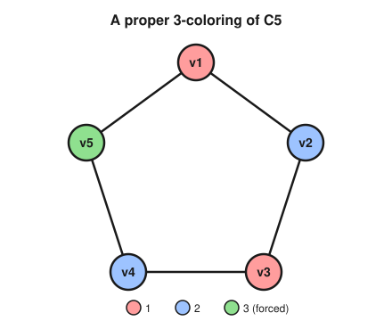

# Graph Theory · Lesson 3.3: Coloring & the chromatic number

> ⏱ ~15 min · Module 3: Planarity & coloring · Builds on: [2.4 (König & covers)](02-04-konig-covers.md), [3.1 (planar graphs & Euler's formula)](03-01-planar-euler-formula.md) · Unlocks: [3.4 (the chromatic polynomial)](03-04-chromatic-polynomial.md)

## Why this matters

"Color the map so no two neighboring countries match" is the toy version. The real version is everywhere you need to hand out a scarce resource so that things which *conflict* never get the same one: exam slots so no student sits two at once, radio frequencies so no two nearby towers jam, CPU registers so two live variables never share storage. Each is a graph — conflicts are edges — and the minimum number of resources you need is a single integer, the **chromatic number**. This lesson is about pinning that integer between a floor and a ceiling, because computing it exactly is famously hard, but *bounding* it is often easy and often enough.

## The idea

A **proper coloring** paints each vertex so that no edge has both ends the same color. The colors aren't red and blue in any meaningful sense — they're just labels, "buckets" of mutually non-conflicting vertices. So a coloring is really a way to *partition the vertices into groups with no internal edges*, and each such group is exactly an **independent set** (Lesson 2.4). The chromatic number $\chi(G)$ is the fewest buckets you can get away with.

Two forces fight over $\chi(G)$:

- **From below**, structure you *must* separate. If some $k$ vertices are all pairwise adjacent (a clique), they need $k$ different colors, full stop. And if the biggest independent set has size $\alpha$, then no single color can cover more than $\alpha$ vertices, so you need at least $n/\alpha$ of them.
- **From above**, a dumb-but-honest algorithm. Walk the vertices in any order and give each one the smallest color not already used by its neighbors. A vertex with at most $\Delta$ neighbors can be blocked from at most $\Delta$ colors, so color number $\Delta + 1$ is always available. That gives $\chi \le \Delta + 1$ for *free*, no cleverness required.

Everything below is these two ideas sharpened.

## The formal version

Throughout, $G$ has $n = |V|$ vertices, maximum degree $\Delta = \Delta(G)$, and no loops.

**Definition (proper coloring, chromatic number).** A *proper $k$-coloring* is a map $c : V \to \{1, \dots, k\}$ with $c(u) \ne c(v)$ whenever $uv \in E$. The **chromatic number** $\chi(G)$ is the least $k$ for which a proper $k$-coloring exists.

*In words:* the smallest number of colors that keeps every edge two-toned.

Each color class $c^{-1}(i)$ is an independent set, so a proper $k$-coloring is the same thing as a partition of $V$ into $k$ independent sets.

**Two benchmark values.**
- $\chi(K_n) = n$: in the complete graph every pair is adjacent, so all $n$ vertices need distinct colors.
- $\chi(C_n) = 2$ if $n$ is even, $3$ if $n$ is odd. Walk the cycle alternating two colors; you close up consistently only when the length is even. An odd cycle forces a third color at the last step — which is exactly why the graph in the Picture needs three.

**Lower bound 1 — the clique bound.** Let $\omega(G)$ (the *clique number*) be the number of vertices in a largest complete subgraph. Then
$$\chi(G) \ge \omega(G).$$
*In words:* a set of mutually-adjacent vertices all need different colors, so the biggest such set is a floor on $\chi$. *(Proof: the $\omega$ vertices of a maximum clique are pairwise adjacent, hence pairwise differently colored, using $\omega$ colors already.)*

**Lower bound 2 — the independence bound.** Let $\alpha(G)$ be the size of a largest independent set. Then
$$\chi(G) \ge \frac{n}{\alpha(G)}.$$
*In words:* each color can be reused only within one independent set, so no color covers more than $\alpha$ vertices; you need at least $n/\alpha$ colors to cover all $n$. *(Proof: the $\chi$ color classes are independent sets, each of size $\le \alpha$, and together they hold all $n$ vertices, so $n \le \chi \cdot \alpha$.)*

**Upper bound — the greedy bound.** For every graph,
$$\chi(G) \le \Delta(G) + 1.$$
*Proof (greedy).* Fix any order $v_1, \dots, v_n$ of the vertices. Color them in turn: give $v_i$ the smallest color in $\{1, 2, 3, \dots\}$ not already used on a neighbor of $v_i$ that precedes it. When we reach $v_i$ it has at most $\Delta$ neighbors, so at most $\Delta$ colors are forbidden; the pigeonhole among the palette $\{1, \dots, \Delta + 1\}$ leaves at least one legal color. No vertex ever needs a color above $\Delta + 1$, so the finished coloring is proper and uses $\le \Delta + 1$ colors. $\blacksquare$

The greedy bound is tight — $K_n$ has $\Delta = n-1$ and needs $\Delta + 1 = n$ colors, and an odd cycle has $\Delta = 2$ and needs $3$ — but those two families are the *only* obstructions to saving one color:

**Brooks' theorem (stated).** If $G$ is connected and is *neither* a complete graph *nor* an odd cycle, then $\chi(G) \le \Delta(G)$.

*In words:* the crude $\Delta + 1$ can always be beaten down to $\Delta$ except for the two families where it obviously can't.

### Coloring planar graphs

Planarity buys you a hard ceiling that degree alone never could. The engine is a fact you proved in [Lesson 3.1](03-01-planar-euler-formula.md): from $|E| \le 3n - 6$, the average degree of a planar graph is below $6$, so **every planar graph has a vertex of degree at most $5$.** Peeling off such low-degree vertices repeatedly is what makes the induction below work.

**Five-color theorem (stated, with proof sketch).** Every planar graph is $5$-colorable.

*Sketch.* Induct on $n$. Pick a vertex $v$ with $\deg(v) \le 5$ and $5$-color the planar graph $G - v$ by induction. If $v$'s neighbors use $\le 4$ colors, a fifth is free for $v$ and we are done. The only trouble is when $v$ has exactly five neighbors $v_1, \dots, v_5$ (in clockwise order around $v$) wearing all five distinct colors $1, \dots, 5$. Consider the subgraph $H_{13}$ on just the color-$1$ and color-$3$ vertices — a **Kempe chain** structure.
- *If $v_1$ and $v_3$ lie in different components of $H_{13}$:* swap colors $1 \leftrightarrow 3$ throughout $v_1$'s component. This stays a proper coloring, but now $v_1$ is color $3$, so color $1$ is free for $v$.
- *If $v_1$ and $v_3$ lie in the same component:* there is a path from $v_1$ to $v_3$ using only colors $1, 3$. Together with $v$ it encloses a region that traps $v_2$ inside and leaves $v_4$ outside (planarity — the path is a closed curve). So no color-$2$/color-$4$ path can connect $v_2$ to $v_4$; they sit in different components of $H_{24}$. Swap colors $2 \leftrightarrow 4$ in $v_2$'s component, freeing color $2$ for $v$.

Either way $v$ gets a color and the induction closes. $\blacksquare$

**Four-color theorem (stated as fact).** Every planar graph is $4$-colorable. This is true — proved by Appel and Haken in 1976 — but the proof is a computer-assisted case check over roughly $1{,}900$ configurations, with no short human-readable version. Five colors you can prove on a napkin; the fourth costs a supercomputer.

## Picture

A proper coloring of the $5$-cycle $C_5$. Two colors would work all the way around until the last edge $v_5 v_1$, where both remaining choices clash — so an *odd* cycle forces a third color (shown green). This realizes $\chi(C_5) = 3$, and no fewer works.

## Worked examples

**Example 1 (bounds vs. truth — the wheel $W_5$).** Take the *wheel* $W_5$: a $5$-cycle $v_1 \dots v_5$ plus a hub $h$ joined to all five. Let's box in $\chi$.
- *Lower bounds.* A triangle $h v_1 v_2$ is a clique, so $\omega \ge 3$ and $\chi \ge 3$. Independence: $h$ is adjacent to everything, so no independent set contains it; on the rim $C_5$ the largest independent set has size $2$, so $\alpha(W_5) = 2$, giving $\chi \ge n/\alpha = 6/2 = 3$.
- *Upper bounds.* Here $\Delta = 5$ (the hub), so greedy gives $\chi \le 6$, and Brooks (not complete, not an odd cycle) sharpens this to $\chi \le 5$.

So the general machinery only says $3 \le \chi \le 5$. To nail it, argue directly: the rim is an odd cycle needing $3$ colors, and the hub is adjacent to all rim vertices, so it needs a color different from all three used on the rim — a fourth. Hence $\chi(W_5) = 4$. *Moral:* the bounds frame the answer instantly, but a tight value often still needs a sentence of structure.

**Example 2 (why you'd care — exam scheduling).** Five exams $A, B, C, D, E$ must be slotted into as few time periods as possible; two exams conflict (need different periods) when some student takes both. Suppose the conflict edges are
$$AB,\ AC,\ BC,\ BD,\ CD,\ DE.$$
Model exams as vertices, conflicts as edges; a *period* is a color, and the minimum number of periods is $\chi$. The triangle $\{A, B, C\}$ is a clique, so $\chi \ge 3$: no two of $A,B,C$ can share a slot. Can we do it in $3$? Color $A=1,\ B=2,\ C=3$; then $D$ conflicts with $B$ and $C$ (colors $2, 3$) so take $D=1$; then $E$ conflicts only with $D$ (color $1$) so take $E=2$. Every edge is two-toned, so $\chi = 3$: three exam periods suffice and — because of the triangle — two never could.

## Watch out

- **You might think $\chi = \omega$ always** (color number equals clique number). Not so: $W_5$ above has $\omega = 3$ but $\chi = 4$, and odd cycles $C_{2k+1}$ ($k \ge 2$) have $\omega = 2$ but $\chi = 3$. The clique bound is a *floor*, not the answer; graphs can be "hard to color" with no big clique to blame.
- **You might think greedy always finds $\chi$.** Greedy's output depends entirely on the vertex order, and a bad order can waste colors — even a $2$-colorable (bipartite) graph can be dragged up to many colors by an adversarial ordering. Greedy proves the *bound* $\Delta + 1$; it does not compute $\chi$.
- **Colors are not numbers.** $c(v) = 3$ carries no arithmetic meaning; only the pattern of *equalities* matters. Any relabeling (permutation) of the colors is the same coloring, which is why $P(C_5, k)$ in [Lesson 3.4](03-04-chromatic-polynomial.md) will count colorings up to the palette, not up to "which color is which."

## One-liner

> A coloring is a partition into independent sets: the clique number and $n/\alpha$ push $\chi$ up from below, greedy caps it at $\Delta + 1$ from above, and planarity slams the ceiling down to $5$ (really $4$).

## Problems

**P1 (🟢)** Give $\chi$ for each, with a one-line reason: (a) the complete bipartite graph $K_{4,7}$; (b) the cycle $C_{11}$; (c) the complete graph $K_6$; (d) the Petersen graph, given only that it is $3$-regular, connected, not complete, and not a cycle — state the *best upper bound* you can justify without more work.

**P2 (🟡)** A graph $G$ has $n = 10$ vertices and independence number $\alpha(G) = 3$. (a) Show $\chi(G) \ge 4$. (b) If in addition $\Delta(G) = 5$, what upper bound does Brooks' theorem give, and why does Brooks apply? (c) Conclude a two-sided bound on $\chi(G)$.

**P3 (🔴, optional)** Using only the fact from [Lesson 3.1](03-01-planar-euler-formula.md) that every planar graph has a vertex of degree $\le 5$, prove by induction on $n$ that **every planar graph is $6$-colorable.** (This is the easy warm-up the five-color theorem upgrades with Kempe chains.)

Solutions

**P1** (a) $K_{4,7}$ is bipartite with at least one edge, so color one side $1$ and the other side $2$: $\chi = 2$. (b) $C_{11}$ is an *odd* cycle, so $\chi = 3$. (c) $K_6$ is complete on $6$ vertices, all pairwise adjacent, so $\chi = 6$. (d) It is connected, not complete, and not a cycle, so Brooks' theorem applies with $\Delta = 3$: the best guaranteed bound is $\chi \le \Delta = 3$. *(In fact $\chi = 3$ for Petersen, but Brooks alone only certifies $\le 3$; the odd $5$-cycles inside force $\ge 3$.)*

**P2** (a) Every color class is an independent set of size $\le \alpha = 3$. With $\chi$ classes covering all $10$ vertices, $10 \le 3\chi$, so $\chi \ge 10/3 = 3.33\ldots$, and since $\chi$ is an integer, $\chi \ge 4$. (b) $G$ has $n = 10 > 6$, so it cannot be a complete graph ($K_n$ needs $\Delta = n - 1$, and it certainly isn't an odd cycle since $\Delta = 5 \ne 2$); a disconnected $G$ can be handled component-by-component, each non-complete-non-odd-cycle, so Brooks gives $\chi \le \Delta = 5$. (c) Combining, $4 \le \chi(G) \le 5$.

**P3** Induct on the number of vertices $n$. *Base:* any planar graph with $n \le 6$ vertices is trivially $6$-colorable (give every vertex its own color). *Step:* let $G$ be planar with $n \ge 7$. By the Lesson 3.1 fact it has a vertex $v$ with $\deg(v) \le 5$. Deleting a vertex keeps a graph planar, so $G - v$ is planar with $n - 1$ vertices and, by the induction hypothesis, has a proper $6$-coloring. Restore $v$: it has at most $5$ neighbors, so its neighbors occupy at most $5$ of the $6$ colors, leaving at least one color free to assign to $v$. The result is a proper $6$-coloring of $G$. By induction every planar graph is $6$-colorable. $\blacksquare$

## Flashback

**From [Lesson 2.4](02-04-konig-covers.md) (independent sets & covers):** For the $5$-cycle $C_5$ with vertices $1, 2, 3, 4, 5$ (edges $12, 23, 34, 45, 51$): find a maximum independent set and a minimum vertex cover, verify the Gallai identity $\alpha(C_5) + \tau(C_5) = n$, and use $\alpha$ to give a lower bound on $\chi(C_5)$.

Solution

A maximum independent set is e.g. $\{1, 3\}$ (vertices $1$ and $3$ are non-adjacent); no three vertices of $C_5$ are pairwise non-adjacent, so $\alpha(C_5) = 2$. Recall from Lesson 2.4 that a set $S$ is independent **iff** its complement $V \setminus S$ is a vertex cover — every edge has at least one end outside any independent set. So the complement $\{2, 4, 5\}$ is a vertex cover, and it is minimum: $\tau(C_5) = n - \alpha = 5 - 2 = 3$. Check it covers every edge: $12{\to}2,\ 23{\to}2,\ 34{\to}4,\ 45{\to}4,5,\ 51{\to}5$. ✓ This is the **Gallai identity** $\alpha + \tau = n$: $2 + 3 = 5$. ✓

Now feed $\alpha$ into the independence bound of this lesson: $\chi(C_5) \ge n/\alpha = 5/2 = 2.5$, and since $\chi$ is an integer, $\chi(C_5) \ge 3$ — recovering the "odd cycles need $3$ colors" fact from a completely different direction. (The alternating $3$-coloring in the Picture shows $3$ suffices, so $\chi(C_5) = 3$ exactly.)

## Connections

- **Backward:** each color class is an *independent set* from [Lesson 2.4](02-04-konig-covers.md), so coloring is "partition into independent sets," and the $n/\alpha$ floor is literally that dictionary read backwards. The planar bound rides entirely on the min-degree-$\le 5$ consequence of Euler's formula in [Lesson 3.1](03-01-planar-euler-formula.md).
- **Forward:** [Lesson 3.4](03-04-chromatic-polynomial.md) refines "*is* there a $k$-coloring?" into "*how many* are there?" — the chromatic polynomial $P(G, k)$ — and recovers $\chi(G)$ as the smallest $k$ with $P(G, k) > 0$.
- **Sideways (CS):** register allocation in a compiler is graph coloring — variables that are simultaneously "live" conflict, and the colors are the machine registers; when $\chi$ exceeds the register count, some variable must "spill" to memory. The same $\Delta + 1$ greedy argument is the standard heuristic there, a bridge into the `algorithms` track.
