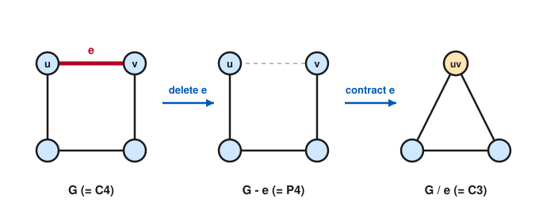

# Graph Theory · Lesson 3.4: The chromatic polynomial

> ⏱ ~15 min · Module 3: Planarity & coloring · Builds on: [Lesson 3.3](03-03-coloring-chromatic-number.md) · Unlocks: Module 4 — [Lesson 4.1](04-01-flow-networks-maxflow-mincut.md)

## Why this matters

In [Lesson 3.3](03-03-coloring-chromatic-number.md) you asked a yes/no question: can $G$ be properly colored with $k$ colors? That collapses a huge amount of structure into a single number, $\chi(G)$. Here we refuse to collapse it. Instead of "is there a coloring," we count **how many** proper $k$-colorings there are — and the astonishing fact is that this count, as $k$ varies, is always a *polynomial* in $k$. Suddenly the full machinery of algebra applies to a combinatorial object: you can read the number of edges, the number of triangles, even $\chi(G)$ itself, straight off its coefficients and roots. This is the first place in the course where a graph invariant becomes a genuine algebraic gadget — the same move that later turns matrices into spectra (Module 5).

## The idea

Fix a palette of $k$ colors. A **proper coloring** assigns each vertex a color so that adjacent vertices differ. Let $P(G,k)$ be the number of such colorings. For a graph with no edges at all on $n$ vertices, every vertex is free, so $P = k^n$. Add an edge and you *forbid* the colorings where its two endpoints agree — the count drops.

The engine that computes $P(G,k)$ for any graph is one idea, **deletion–contraction**, and it rests on a single clean dichotomy. Take any edge $e = uv$ and look at colorings of the graph with $e$ *erased* (call it $G-e$). In $G-e$ the endpoints $u$ and $v$ are unconstrained, so each such coloring falls into exactly one of two camps:

- $u$ and $v$ got **different** colors — this is legal in $G$ too, so it's a proper coloring of $G$.
- $u$ and $v$ got the **same** color — this is exactly a coloring of the graph where $u$ and $v$ are *fused into one vertex* (call it $G/e$).

Every coloring of $G-e$ is one or the other, never both. So the colorings of $G-e$ split cleanly into (colorings of $G$) plus (colorings of $G/e$). Rearranged, that's a recipe for peeling one edge off at a time until nothing is left but edgeless graphs, whose counts you already know.

## The formal version

**Definition (chromatic polynomial).** For a graph $G$ and a positive integer $k$, $P(G,k)$ is the number of proper colorings of $G$ using colors from a set of size $k$ (not every color need be used).

*In words:* $P(G,k)$ counts the ways to color $G$ with $k$ colors so no edge is monochromatic.

Two operations drive everything. For an edge $e=uv$:

- **Deletion** $G-e$: remove $e$, keep both endpoints.
- **Contraction** $G/e$: delete $e$, then merge $u$ and $v$ into a single vertex whose neighbors are the combined neighbors of $u$ and $v$ (any parallel edges created are collapsed to one — proper coloring only cares *whether* two vertices are adjacent).

**Theorem (deletion–contraction).** For every edge $e$ of $G$,
$$P(G,k) = P(G-e,\,k) - P(G/e,\,k).$$

*In words:* the colorings of $G$ are the colorings of "$e$ erased" minus those that would have made $e$'s endpoints clash.

*Proof.* Let $e=uv$. Every proper coloring of $G-e$ colors $u$ and $v$ somehow, and splits by whether $c(u)=c(v)$:

- If $c(u)\neq c(v)$, the coloring already respects $e$, so it is precisely a proper coloring of $G$. Conversely every proper coloring of $G$ is a proper coloring of $G-e$ with $c(u)\neq c(v)$. This class has size $P(G,k)$.
- If $c(u)=c(v)$, give the merged vertex $uv$ of $G/e$ that shared color and every other vertex its old color. This is proper in $G/e$ (the only new adjacencies at $uv$ are old adjacencies of $u$ or $v$, already respected), and the correspondence is a bijection. This class has size $P(G/e,k)$.

The two classes are disjoint and exhaust the colorings of $G-e$, so $P(G-e,k) = P(G,k) + P(G/e,k)$. $\blacksquare$

**Three graphs you can color by hand** (no recurrence needed):

- **Complete graph $K_n$.** Color the vertices in any order; each new vertex is adjacent to all already colored, so it has one fewer choice than the last:
$$P(K_n,k) = k(k-1)(k-2)\cdots(k-n+1).$$
- **Tree $T$ on $n$ vertices.** Root it and color outward. The root has $k$ choices; every other vertex has exactly one already-colored neighbor (its parent), so $k-1$ choices:
$$P(T,k) = k(k-1)^{n-1}.$$
- **Cycle $C_n$.** Deletion–contraction gives $C_n - e = P_n$ (a path, i.e. a tree) and $C_n/e = C_{n-1}$, so $P(C_n,k)=k(k-1)^{n-1}-P(C_{n-1},k)$; unwinding the recursion yields the closed form
$$P(C_n,k) = (k-1)^n + (-1)^n (k-1).$$

**Why it's genuinely a polynomial, and what its shape tells you.** Induct on the number of edges. An edgeless graph on $n$ vertices has $P=k^n$, a polynomial. For any $G$ with an edge $e$, both $G-e$ and $G/e$ have fewer edges, so by induction they are polynomials, and $P(G,k)=P(G-e,k)-P(G/e,k)$ is their difference — a polynomial. Tracking the recursion pins down its shape:

**Structure of $P(G,k)$.** For a graph $G$ with $n=|V|$ vertices and $m=|E|$ edges, $P(G,k)$ is a polynomial in $k$ of degree $n$, with leading coefficient $1$, integer coefficients that **alternate in sign**, and the coefficient of $k^{n-1}$ equal to $-m$:
$$P(G,k) = k^n - m\,k^{n-1} + \cdots$$

*In words:* the degree counts vertices, the second coefficient counts edges (with a minus sign), and the signs march $+,-,+,-,\dots$.

**Reading off the chromatic number.** Since $P(G,k)$ counts colorings, $P(G,k)>0$ *exactly* when a proper $k$-coloring exists. Hence
$$\chi(G) = \min\{\,k \in \mathbb{Z}_{>0} : P(G,k) > 0\,\}.$$

*In words:* $\chi(G)$ is the smallest positive integer that is **not** a root of the chromatic polynomial. Plug in $k=1,2,3,\dots$ and the first value that comes out positive is your chromatic number.

## Picture

One deletion–contraction step on $G=C_4$. Erasing the red edge $e=uv$ opens the cycle into the path $G-e=P_4$; fusing its endpoints instead closes it into the triangle $G/e=C_3$. The theorem says $P(C_4,k)=P(P_4,k)-P(C_3,k)$.

## Worked examples

**Example 1 (the definition in one line — $P(K_3,k)$).** The triangle is $K_3$. Color its three mutually adjacent vertices in order: $k$ choices, then $k-1$, then $k-2$. So
$$P(K_3,k) = k(k-1)(k-2) = k^3 - 3k^2 + 2k.$$
Check the structure theorem: degree $3=|V|$ ✓, leading coefficient $1$ ✓, coefficient of $k^{2}$ is $-3=-|E|$ ✓, signs $+,-,+$ alternate ✓. And $\chi$: $P(K_3,1)=0$, $P(K_3,2)=2\cdot1\cdot0=0$, $P(K_3,3)=3\cdot2\cdot1=6>0$, so $\chi(K_3)=3$, as it must be for a triangle.

**Example 2 (deletion–contraction in full — $P(C_4,k)$).** Take $G=C_4$ and the edge $e$ from the Picture.

- $G-e = P_4$, a tree on $4$ vertices: $P(P_4,k)=k(k-1)^{3}$.
- $G/e = C_3 = K_3$: $P(C_3,k)=k(k-1)(k-2)$ from Example 1.

Apply the theorem:
$$P(C_4,k) = k(k-1)^{3} - k(k-1)(k-2).$$
Factor out $k(k-1)$ and simplify the bracket:
$$= k(k-1)\big[(k-1)^{2} - (k-2)\big] = k(k-1)\big[k^{2}-3k+3\big].$$
Expanding gives the standard form
$$P(C_4,k) = k^{4} - 4k^{3} + 6k^{2} - 3k.$$
Sanity checks: degree $4$, leading coefficient $1$, coefficient of $k^{3}$ is $-4=-|E(C_4)|$, signs alternate $+,-,+,-$ — all as promised. This also matches the cycle formula: $(k-1)^{4}+(-1)^{4}(k-1)=(k-1)^4+(k-1)$, and indeed $(k-1)^4+(k-1)=(k-1)\big[(k-1)^3+1\big]=(k-1)\,k\,(k^2-3k+3)$, the same thing.

Now read off $\chi$: $P(C_4,1)=1-4+6-3=0$, and $P(C_4,2)=16-32+24-6=2>0$. So $\chi(C_4)=2$ — exactly right, since an even cycle is bipartite. The polynomial even tells you *how many* $2$-colorings: precisely $2$ (swap the two colors on the two color classes).

## Watch out

- **Colorings are labeled, not up to symmetry.** $P(G,k)$ counts colorings where the colors are distinguishable — red/blue and blue/red are two different $2$-colorings of an edge, so $P(K_2,2)=2$, not $1$. Never divide out by permutations of colors.
- **$P(G,k)$ is a polynomial identity, not just a table of values.** The recurrence and the formulas hold as polynomials in the *variable* $k$; you may evaluate at any integer (even $k=0$, giving $0$), and the algebra — factoring, comparing coefficients — is all fair game. Its being a polynomial is a theorem, not a definition.
- **Contraction can create parallel edges — collapse them.** Merging $u$ and $v$ may leave two edges to a common neighbor. Proper coloring only cares whether two vertices are adjacent, so keep a single edge. (If contraction ever produces a *self-loop*, that graph has $P\equiv 0$ — a vertex adjacent to itself can never be properly colored.)
- **"$\chi$ is the smallest non-root," not the smallest root.** $P(G,k)$ vanishes at $k=0,1,\dots,\chi-1$; the chromatic number is the first integer *past* that block where the count turns positive.

## One-liner

> Counting proper $k$-colorings is a monic degree-$n$ polynomial in $k$ — peel edges by $P(G)=P(G-e)-P(G/e)$, and $\chi(G)$ is the smallest positive integer it doesn't kill.

## Problems

**P1 (🟢)** (a) Write down $P(K_4,k)$, and use it to find both the number of proper $4$-colorings of $K_4$ and $\chi(K_4)$. (b) Write $P(T,k)$ for the star $K_{1,3}$ (one center joined to three leaves — a tree on $4$ vertices) and evaluate it at $k=3$.

**P2 (🟡)** Let $G$ be the "diamond": the $4$-cycle $u{-}a{-}v{-}b{-}u$ with the extra chord $e=uv$ added (equivalently $K_4$ minus one edge). Use deletion–contraction *on the chord* $e$, reusing $P(C_4,k)$ from Example 2, to compute $P(G,k)$. Put it in factored form and read off $\chi(G)$.

**P3 (🔴, optional)** Prove, by induction on the number of edges $m$, that for every graph $G$ on $n\ge 1$ vertices the coefficient of $k^{n}$ in $P(G,k)$ is $1$ and the coefficient of $k^{n-1}$ is $-m$.

Solutions

**P1** (a) $K_4$ is complete on $4$ vertices, so
$$P(K_4,k)=k(k-1)(k-2)(k-3).$$
Proper $4$-colorings: $P(K_4,4)=4\cdot3\cdot2\cdot1=24$. For $\chi$: $P(K_4,3)=3\cdot2\cdot1\cdot0=0$ and $P(K_4,4)=24>0$, so $\chi(K_4)=4$ — a complete graph needs all $n$ colors.

(b) A tree on $n=4$ vertices has $P(T,k)=k(k-1)^{3}$ (the shape doesn't matter, only that it's a tree). At $k=3$: $P(K_{1,3},3)=3\cdot2^{3}=3\cdot8=24$. (Sanity: the center picks $1$ of $3$ colors, each leaf independently picks any of the remaining $2$, giving $3\cdot2\cdot2\cdot2=24$. ✓)

**P2** With $e=uv$ the chord:
- $G-e$: deleting the chord leaves the $4$-cycle $u{-}a{-}v{-}b{-}u$, so $P(G-e,k)=P(C_4,k)=k^4-4k^3+6k^2-3k$ (Example 2).
- $G/e$: merging $u$ and $v$ into one vertex $w$. Vertex $a$ was adjacent to both $u$ and $v$, so it is adjacent to $w$; likewise $b$. There is no edge $a{-}b$. So $G/e$ is the path $a{-}w{-}b$, a tree on $3$ vertices: $P(G/e,k)=k(k-1)^2=k^3-2k^2+k$.

Deletion–contraction:
$$P(G,k)=P(G-e,k)-P(G/e,k)=(k^4-4k^3+6k^2-3k)-(k^3-2k^2+k)=k^4-5k^3+8k^2-4k.$$
Factor: pull out $k$, then note $k=1$ is a root of the cubic $k^3-5k^2+8k-4$, giving $(k-1)$, and dividing leaves $k^2-4k+4=(k-2)^2$:
$$P(G,k)=k(k-1)(k-2)^2.$$
Checks: degree $4$, leading coefficient $1$, coefficient of $k^3$ is $-5=-|E(G)|$ (the diamond has $5$ edges) ✓. For $\chi$: $P(G,2)=2\cdot1\cdot0=0$, $P(G,3)=3\cdot2\cdot1=6>0$, so $\chi(G)=3$. (Makes sense: the diamond contains a triangle, so $\chi\ge3$, and $3$ colors clearly suffice.) The factored form also matches the direct count — color the shared edge's endpoints $u,v$ with $k(k-1)$, then $a$ and $b$ each avoid both, $(k-2)$ ways apiece: $k(k-1)(k-2)^2$. ✓

**P3** *Base case* $m=0$: an edgeless graph on $n$ vertices has $P(G,k)=k^n$. The coefficient of $k^n$ is $1$ and of $k^{n-1}$ is $0=-m$. ✓

*Inductive step.* Assume the claim for all graphs with fewer than $m$ edges, and let $G$ have $m\ge1$ edges and $n$ vertices. Pick any edge $e$. Then $G-e$ has $n$ vertices and $m-1$ edges, and $G/e$ has $n-1$ vertices and at most $m-1$ edges. By the induction hypothesis,
$$P(G-e,k)=k^{n}-(m-1)k^{n-1}+\cdots,\qquad P(G/e,k)=k^{n-1}+\cdots,$$
where in the second polynomial every term has degree $\le n-1$ (its top vertex count is $n-1$), with leading coefficient $1$ on $k^{n-1}$. Subtract:
$$P(G,k)=P(G-e,k)-P(G/e,k)=k^{n}-\big[(m-1)+1\big]k^{n-1}+\cdots=k^{n}-m\,k^{n-1}+\cdots.$$
The $k^n$ coefficient is $1$ (only $G-e$ contributes at degree $n$) and the $k^{n-1}$ coefficient is $-(m-1)-1=-m$. $\blacksquare$

## Flashback

**From [Lesson 3.3](03-03-coloring-chromatic-number.md) (chromatic number & the greedy bound):** Let $G$ be the *bowtie* — two triangles $\{a,b,c\}$ and $\{c,d,e\}$ sharing the single vertex $c$ (so $5$ vertices, $6$ edges). Find $\chi(G)$, and compare it to the greedy bound $\chi(G)\le \Delta(G)+1$. Is the bound tight here?

Solution

$\chi(G)=3$. *Lower bound:* $G$ contains a triangle ($K_3$), and any triangle needs $3$ colors, so $\chi(G)\ge3$. *Upper bound / construction:* color $c$ with color $1$; in the first triangle give $a,b$ colors $2,3$; in the second triangle give $d,e$ colors $2,3$. No edge is monochromatic, so $3$ colors suffice. Hence $\chi(G)=3$.

The greedy bound: the maximum degree is $\Delta(G)=\deg(c)=4$ (the shared vertex touches all four others), so $\chi(G)\le \Delta+1 = 5$. The bound is very loose here — it promises $5$ but the truth is $3$. (Brooks' theorem does better: $G$ is neither a complete graph nor an odd cycle, so $\chi(G)\le\Delta(G)=4$; still not tight, but closer.)

## Connections

- **Backward:** this refines [Lesson 3.3](03-03-coloring-chromatic-number.md) — where $\chi(G)$ answered "how few colors," $P(G,k)$ counts colorings for *every* $k$ and hands you $\chi(G)$ back as its smallest positive non-root. The contraction operation is the same vertex-merging you met informally when arguing about minors in [Lesson 3.2](03-02-kuratowski-wagner.md).
- **Forward:** deletion–contraction is the template for the whole Tutte-polynomial family (spanning-tree counts obey the same peel-an-edge recurrence you'll see behind the Matrix–Tree theorem in [Lesson 5.2](05-02-laplacian-matrix-tree.md)), where a graph invariant is again read off an algebraic object.
- **Sideways (physics):** the chromatic polynomial is exactly the zero-temperature partition function of the *antiferromagnetic Potts model* on $G$ with $k$ spin states — statistical mechanics counts ground-state configurations with the same object, and its complex roots (Yang–Lee / chromatic zeros) mark phase transitions. Counting-as-polynomial also echoes the inclusion–exclusion generating functions of combinatorics.
