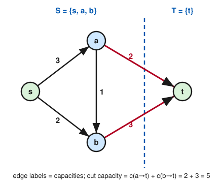

# Graph Theory · Lesson 4.1: Flow networks & the max-flow min-cut theorem

> ⏱ ~15 min · Module 4: Network flows · Builds on: [Lesson 2.4](02-04-konig-covers.md) · Unlocks: [Lesson 4.2](04-02-augmenting-paths-ford-fulkerson.md)

## Why this matters

How much water can you push through a pipe network from a source to a drain? How many packets per second from a server to a client? How many trucks from a factory to a store? These are all the same question, and its answer is governed by one of the most useful theorems in all of applied mathematics: **max-flow min-cut**. It says the maximum you can push equals the capacity of the *cheapest bottleneck* that separates source from sink — throughput is capped by your narrowest wall, and that cap is always achievable. This is the module's master duality, and it quietly *contains* König's matching-cover theorem (Lesson 2.4), Menger's connectivity theorem (Lesson 4.3), and even Hall's marriage theorem as special cases.

## The idea

Picture a system of one-way pipes. Water enters at the **source** $s$ and leaves at the **sink** $t$; every pipe has a **capacity** — the most it can carry. A **flow** is a consistent way to route water: no pipe carries more than its capacity, and at every intermediate junction *what flows in flows out* (no water is created or lost). The **value** of the flow is how much reaches $t$.

Now here is the trick that bounds you. Draw any closed curve — a **cut** — with $s$ on the inside and $t$ on the outside. Every drop that gets from $s$ to $t$ must physically cross that curve at some point. So the total flow can't exceed the total capacity of the pipes crossing the curve *in the outward direction*. That's true for **every** cut you could draw. So the value of the best flow is at most the capacity of the *tightest* cut you can find. That inequality — any flow $\le$ any cut — is **weak duality**, and it's the whole reason the answer is bounded. The deep theorem is that the bound is *exactly* tight: some flow actually equals some cut.

## The formal version

A **flow network** is a directed graph $G=(V,E)$ with two distinguished vertices, a source $s$ and a sink $t$, together with a **capacity** $c(e)\ge 0$ on each edge $e$.

**Definition (flow).** A *flow* is a function $f$ assigning each edge $e$ a value $f(e)$ with:

- **Capacity constraint:** $0 \le f(e) \le c(e)$ for every edge $e$.
- **Conservation:** for every *internal* vertex $v$ (that is, $v\ne s$ and $v\ne t$),
$$\sum_{e \text{ into } v} f(e) \;=\; \sum_{e \text{ out of } v} f(e).$$

*In words:* never overfill a pipe, and at every junction other than the source and sink, flow in equals flow out.

**Definition (value).** The **value** of $f$ is the net flow leaving the source,
$$|f| \;=\; \sum_{e \text{ out of } s} f(e) \;-\; \sum_{e \text{ into } s} f(e).$$

*In words:* how much water the source actually pushes into the network (outflow minus any that loops back in).

**Definition (cut).** An **$s$–$t$ cut** $(S,T)$ is a partition of the vertices $V$ into two sets with $s\in S$ and $t\in T$ (so $T = V\setminus S$). Its **capacity** counts only the edges crossing *forward*, from $S$ to $T$:
$$\mathrm{cap}(S,T) \;=\; \sum_{\substack{e=(u,w)\\ u\in S,\ w\in T}} c(e).$$

*In words:* a cut is a way to split the vertices with the source and sink on opposite sides; its capacity is the total capacity of the pipes pointing from the source's side to the sink's side.

The bridge between the two worlds is one bookkeeping lemma.

**Lemma (flow across a cut).** For *any* flow $f$ and *any* $s$–$t$ cut $(S,T)$, the value of the flow equals the net flow crossing the cut:
$$|f| \;=\; \sum_{\substack{e \text{ from } S \text{ to } T}} f(e) \;-\; \sum_{\substack{e \text{ from } T \text{ to } S}} f(e).$$

*Proof.* Start from $|f|$. Because every internal vertex conserves flow, its net outflow is $0$, so adding those zeros changes nothing:
$$|f| \;=\; \sum_{v\in S}\Big(\sum_{e \text{ out of } v} f(e) - \sum_{e \text{ into } v} f(e)\Big).$$
(The only vertex in $S$ with nonzero net outflow is $s$, contributing exactly $|f|$.) Now expand the double sum edge by edge. An edge with **both** endpoints in $S$ appears twice — once as an outflow of its tail ($+f$) and once as an inflow of its head ($-f$) — and cancels. An edge from $S$ to $T$ appears only as an outflow ($+f$); an edge from $T$ to $S$ appears only as an inflow ($-f$). What survives is exactly the claimed difference. $\blacksquare$

*In words:* wherever you draw the dividing line, the net flow sneaking across it always equals the total the source is pushing — water is conserved in bulk, not just at each junction.

**Theorem (weak duality).** For every flow $f$ and every $s$–$t$ cut $(S,T)$,
$$|f| \;\le\; \mathrm{cap}(S,T).$$

*Proof.* By the lemma,
$$|f| \;=\; \sum_{S\to T} f(e) \;-\; \sum_{T\to S} f(e) \;\le\; \sum_{S\to T} f(e) \;\le\; \sum_{S\to T} c(e) \;=\; \mathrm{cap}(S,T).$$
The first inequality drops a nonnegative backward term ($\sum_{T\to S} f(e)\ge 0$); the second uses $f(e)\le c(e)$ on each forward edge. $\blacksquare$

*In words:* no flow can beat any cut. Taking the best of each side, **max flow $\le$ min cut**.

**Theorem (max-flow min-cut).** In every flow network,
$$\max_{f}\, |f| \;=\; \min_{(S,T)}\, \mathrm{cap}(S,T).$$

*In words:* the maximum achievable flow equals the minimum cut capacity — the bound of weak duality is always tight. Weak duality gives $\le$ for free; the hard direction ($\ge$) is proved constructively in [Lesson 4.2](04-02-augmenting-paths-ford-fulkerson.md), where an augmenting-path algorithm either improves the flow or hands you a cut of equal capacity.

## Picture

Source $s$, sink $t$, capacities on each directed edge. The dashed line is the cut $(S,T)$ with $S=\{s,a,b\}$ and $T=\{t\}$. Only the two edges pointing across it, $a\to t$ and $b\to t$, count toward its capacity: $\mathrm{cap}(S,T)=2+3=5$. Weak duality already tells us no flow through this network can exceed $5$.

## Worked examples

Use the network in the Picture throughout. Edges and capacities: $s\to a\,(3)$, $s\to b\,(2)$, $a\to b\,(1)$, $a\to t\,(2)$, $b\to t\,(3)$.

**Example 1 (a valid flow and its value).** Route $f(s\to a)=2$, $f(a\to t)=2$, $f(s\to b)=2$, $f(b\to t)=2$, and $f(a\to b)=0$.

- *Capacity:* $2\le 3$, $2\le 2$, $2\le 2$, $2\le 3$, $0\le 1$ — all fine.
- *Conservation at $a$:* in $=2$ (from $s$), out $=2+0=2$ (to $t$ and $b$). ✓ At $b$: in $=2+0=2$, out $=2$. ✓
- *Value:* $|f| = f(s\to a)+f(s\to b) = 2+2 = 4$ (nothing flows back into $s$).

Check the lemma on the sink cut $S=\{s,a,b\},\,T=\{t\}$: net flow across $= f(a\to t)+f(b\to t) = 2+2 = 4 = |f|$. ✓ And weak duality holds: $4 \le \mathrm{cap}(S,T)=5$. There's slack, so this flow is *not* yet maximum.

**Example 2 (hitting the bound — a certificate of optimality).** Push more: $f(s\to a)=3$, $f(s\to b)=2$, $f(a\to b)=1$, $f(a\to t)=2$, $f(b\to t)=3$.

- *Capacity:* every edge is now saturated ($3\le3$, $2\le2$, $1\le1$, $2\le2$, $3\le3$). ✓
- *Conservation at $a$:* in $=3$, out $=1+2=3$. ✓ At $b$: in $=2+1=3$, out $=3$. ✓
- *Value:* $|f| = 3+2 = 5$.

Now $|f| = 5 = \mathrm{cap}(S,T)$ for the sink cut. By weak duality **every** flow is $\le 5$ and **every** cut is $\ge 5$, so this flow is maximum and that cut is minimum — no algorithm needed, the matching numbers *are* the proof. (The source cut $\{s\}$ has capacity $3+2=5$ too, and so does the middle cut $\{s,a\}$; this network has three different minimum cuts, all of capacity $5$.) This equality-as-certificate is precisely how König's theorem worked in [Lesson 2.4](02-04-konig-covers.md): a matching and a cover of equal size prove each other optimal. Max-flow min-cut is that same duality, generalized from unit-capacity bipartite graphs to arbitrary capacities.

## Watch out

- **A cut's capacity counts only forward edges.** Edges pointing $T\to S$ contribute *nothing* to $\mathrm{cap}(S,T)$ — you don't subtract them. (They only appear, subtracted, in the *net flow* across the cut, which is a different quantity.) You might think you should net the capacities out; you shouldn't. Capacity is a one-way sum.
- **Conservation is for internal vertices only.** The source and sink are exempt — indeed the whole point is that $s$ has a net outflow of $|f|$ and $t$ a matching net inflow. Imposing "in $=$ out" at $s$ would force $|f|=0$.
- **Being max isn't about saturating every edge you see; it's about saturating a cut.** A flow can leave slack on many pipes and still be optimal — what matters is that *some* $s$–$t$ cut is completely full. Conversely, a flow that saturates every edge on one path can still be improvable through others. The bottleneck is a cut, not a single pipe.

## One-liner

> The most you can push from $s$ to $t$ equals the capacity of the cheapest wall separating them — max flow $=$ min cut — and any flow that ties any cut proves them both optimal on the spot.

## Problems

Use the Picture network unless stated otherwise: $s\to a\,(3)$, $s\to b\,(2)$, $a\to b\,(1)$, $a\to t\,(2)$, $b\to t\,(3)$.

**P1 (🟢)** Consider the assignment $f(s\to a)=2$, $f(a\to b)=1$, $f(a\to t)=1$, $f(s\to b)=1$, $f(b\to t)=2$. (a) Verify it is a valid flow (check capacities and conservation at $a$ and $b$). (b) Compute its value $|f|$. (c) Name a cut and its capacity, and confirm weak duality for this flow.

**P2 (🟡)** Show that the *middle* cut $S=\{s,a\},\,T=\{b,t\}$ also has capacity $5$: list exactly which edges cross it (from $S$ to $T$) and sum their capacities. Then, using the value-$5$ flow of Example 2, explain in one sentence why this cut is a *minimum* cut without checking any other cut.

**P3 (🔴)** Prove the **optimality certificate**: if a flow $f$ and an $s$–$t$ cut $(S,T)$ satisfy $|f| = \mathrm{cap}(S,T)$, then $f$ is a maximum flow *and* $(S,T)$ is a minimum cut. (Use only weak duality — no algorithm.)

Solutions

**P1** (a) *Capacities:* $2\le3$, $1\le1$, $1\le2$, $1\le2$, $2\le3$ — all hold. *Conservation at $a$:* in $=f(s\to a)=2$; out $=f(a\to b)+f(a\to t)=1+1=2$. ✓ *At $b$:* in $=f(s\to b)+f(a\to b)=1+1=2$; out $=f(b\to t)=2$. ✓ So $f$ is a valid flow.
(b) $|f| = f(s\to a)+f(s\to b) = 2+1 = 3$. (Cross-check on the sink cut: $f(a\to t)+f(b\to t)=1+2=3$. ✓)
(c) Take the source cut $S=\{s\},\,T=\{a,b,t\}$: crossing edges $s\to a\,(3)$ and $s\to b\,(2)$, so $\mathrm{cap}=5$. Weak duality: $|f|=3 \le 5$. ✓ (Any of the three minimum cuts, all capacity $5$, works.)

**P2** The edges from $S=\{s,a\}$ to $T=\{b,t\}$ are: $s\to b$ (tail $s\in S$, head $b\in T$) with capacity $2$; $a\to b$ (tail $a\in S$, head $b\in T$) with capacity $1$; and $a\to t$ (tail $a\in S$, head $t\in T$) with capacity $2$. The edge $s\to a$ lies inside $S$ and $b\to t$ lies inside $T$, so neither counts. Total $\mathrm{cap}(S,T)=2+1+2=5$. Example 2 exhibits a flow with $|f|=5$; by weak duality no cut can have capacity below $5$, and this cut attains $5$, so it is a minimum cut.

**P3** By weak duality, every flow $f'$ satisfies $|f'|\le \mathrm{cap}(S,T)$. Since $\mathrm{cap}(S,T)=|f|$, we get $|f'|\le |f|$ for all flows $f'$: no flow beats $f$, so $f$ is maximum. Symmetrically, every cut $(S',T')$ satisfies $|f|\le \mathrm{cap}(S',T')$. Since $|f|=\mathrm{cap}(S,T)$, we get $\mathrm{cap}(S,T)\le \mathrm{cap}(S',T')$ for all cuts: no cut is cheaper than $(S,T)$, so it is minimum. $\blacksquare$ (This is exactly why finding a matching flow-and-cut pair *is* a complete proof of optimality — the engine behind [Lesson 4.2](04-02-augmenting-paths-ford-fulkerson.md)'s min-cut certificate.)

## Flashback

**From Lesson 2.4 (König's theorem):** Consider the bipartite graph with parts $X=\{x_1,x_2,x_3\}$ and $Y=\{y_1,y_2\}$ and edges $x_1y_1$, $x_2y_1$, $x_2y_2$, $x_3y_2$. (a) Exhibit a matching $M$ and a vertex cover $C$. (b) Explain, in the weak-duality spirit, why $|M|\le|C|$ must always hold. (c) Conclude that your $M$ and $C$ are both optimal and state the König equality here.

Solution

(a) Matching $M=\{x_1y_1,\ x_3y_2\}$, size $2$ (its two edges share no vertex — $x_2$ is left unmatched). Vertex cover $C=\{y_1,y_2\}$, size $2$: every edge lists $y_1$ or $y_2$ as an endpoint, so $C$ touches all four edges.

(b) The edges of a matching are pairwise vertex-disjoint, so they have $2|M|$ distinct endpoints. A vertex cover must contain at least one endpoint of each matching edge, and because those endpoints are all distinct, it must contain at least $|M|$ vertices. Hence $|M|\le|C|$ for *every* matching and *every* cover — the exact analogue of "any flow $\le$ any cut."

(c) We exhibited $|M|=|C|=2$. By the weak-duality bound in (b), every matching has size $\le 2$ and every cover has size $\ge 2$, so $M$ is a maximum matching and $C$ is a minimum cover — both optimal. König's theorem (max matching $=$ min cover in a bipartite graph) holds here with common value $2$.

## Connections

- **Backward:** this generalizes König's max-matching = min-vertex-cover duality (Lesson 2.4). A bipartite matching problem is exactly a flow network with all capacities $1$; a vertex cover becomes a cut, and König's equality becomes max-flow min-cut. The full reduction — matching as unit-capacity flow — is built in [Lesson 4.3](04-03-menger-flows-matching.md). The flow-across-a-cut lemma is just conservation (from [Lesson 1.3](01-03-walks-paths-connectivity.md)'s connectivity language) summed in bulk.
- **Forward:** [Lesson 4.2](04-02-augmenting-paths-ford-fulkerson.md) proves the hard $\ge$ direction constructively via residual graphs and augmenting paths, and shows integer capacities force an integer maximum flow. [Lesson 4.3](04-03-menger-flows-matching.md) then reads Menger's theorem (max edge-disjoint $s$–$t$ paths $=$ min edge separator) straight off the unit-capacity case.
- **Sideways (optimization / economics):** max-flow min-cut is the combinatorial shadow of *linear-programming duality* — flows are a primal LP, cuts the dual, and their equality is strong duality with integer optimal solutions. The same primal-dual pattern is the transportation and assignment problem at the heart of operations research and market-clearing models in economics.
