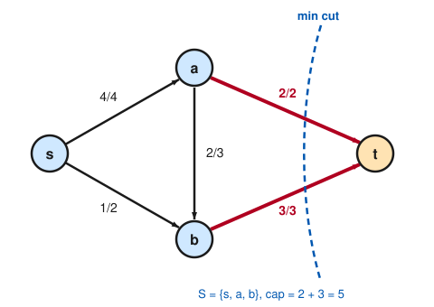
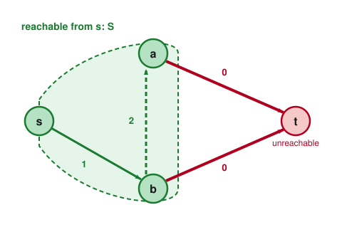

# Graph Theory · Lesson 4.2: Finding a maximum flow — augmenting paths

> ⏱ ~15 min · Module 4: Network flows · Builds on: [Lesson 4.1](04-01-flow-networks-maxflow-mincut.md) (flows, cuts, max-flow min-cut) · Unlocks: [Lesson 4.3](04-03-menger-flows-matching.md) (Menger, matching via flows)

## Why this matters

Lesson 4.1 told you the max flow *equals* the min cut — a beautiful duality, but an **existence** theorem. It never said how to find either one. This lesson turns that promise into an algorithm: a mechanical procedure that pumps flow until it can't, and — this is the elegant part — the very moment it gets stuck it *hands you the min cut for free*, proving the flow it found is optimal. That constructive argument is itself the proof of max-flow min-cut. The same engine, run on unit-capacity graphs, will solve bipartite matching and edge-connectivity in [Lesson 4.3](04-03-menger-flows-matching.md), so getting it in your hands now pays off three times.

## The idea

Suppose you've pushed some flow $f$ from $s$ to $t$ and want more. Two moves are available on each edge. Where an edge $u \to v$ has leftover capacity, you can **push extra flow forward**. But there's a subtler move: where the edge already *carries* flow, you can **cancel some of it** — sending flow backward along $u \to v$ is really re-routing flow that was committed to $v$ so it goes somewhere better. Greedy forward-only pushing gets stuck in dead ends; the ability to *reroute* is what makes the method actually reach the optimum.

The bookkeeping trick that captures both moves at once is the **residual graph** $G_f$: for every original edge, record how much more you can push forward *and* how much you can take back. Then "make progress" becomes one clean question — **is there any path from $s$ to $t$ in $G_f$?** Such a path is an *augmenting path*; push the largest amount its tightest edge allows, and repeat. When no $s$–$t$ path remains, you're done — and the set of vertices you *can* still reach from $s$ is exactly one side of a min cut.

## The formal version

Fix a flow network with capacity $c(e) \ge 0$ on each directed edge, source $s$, sink $t$, and a flow $f$ with $0 \le f(e) \le c(e)$.

**Definition (residual graph).** The residual graph $G_f$ has the same vertices, and for each edge $e = u \to v$ of the original network it may contain up to two arcs:

- a **forward** arc $u \to v$ with residual capacity $c(e) - f(e)$ (room left to push), included when this is positive;
- a **backward** arc $v \to u$ with residual capacity $f(e)$ (flow you could cancel), included when this is positive.

*In words:* $G_f$ records every legal one-unit move — top up an unsaturated edge, or undo flow on a used one.

**Definition (augmenting path).** An augmenting path is a directed $s \to t$ path in $G_f$. Its **bottleneck** is the smallest residual capacity along it.

**Ford–Fulkerson method.** Start from the zero flow. While $G_f$ contains an augmenting path $P$, let $b$ be its bottleneck and **augment**: on each arc of $P$, add $b$ to $f(e)$ for a forward arc, or subtract $b$ from $f(e)$ for a backward arc. Recompute $G_f$ and repeat. When no augmenting path exists, output $f$.

*In words:* keep finding a route with slack and push as much as its narrowest link permits; stop when the residual graph disconnects $s$ from $t$.

Each augmentation keeps $f$ a valid flow (it respects $0 \le f \le c$ by the bottleneck choice, and conservation is preserved because every intermediate vertex on $P$ gains and loses $b$ in balance) and raises the flow value by exactly $b > 0$.

**Theorem (max-flow min-cut, via termination).** When Ford–Fulkerson stops, let $S$ be the set of vertices reachable from $s$ in $G_f$. Then $t \notin S$, so $(S, \bar S)$ is an $s$–$t$ cut, and

$$\operatorname{val}(f) \;=\; \operatorname{cap}(S,\bar S)\;=\;\min\text{-cut}.$$

*In words:* the flow you end with equals the capacity of the cut carved out by "how far $s$ can still reach" — so that flow is maximum and that cut is minimum, simultaneously.

*Proof.* Since no augmenting path exists, $t \notin S$. Consider any edge $e = u \to v$ crossing the cut, i.e. $u \in S,\ v \in \bar S$. It must be **saturated**, $f(e) = c(e)$ — otherwise its forward arc $u \to v$ has positive residual, putting $v \in S$, a contradiction. Now consider any edge $e' = v \to u$ pointing *back into* $S$ (with $u \in S,\ v \in \bar S$). It must be **empty**, $f(e') = 0$ — otherwise its backward arc $u \to v$ has residual $f(e') > 0$, again putting $v \in S$. From Lesson 4.1, the flow across a cut is (flow out) minus (flow in):

$$\operatorname{val}(f) \;=\; \sum_{u \in S,\, v \in \bar S} f(u\to v) \;-\; \sum_{v \in \bar S,\, u \in S} f(v\to u) \;=\; \sum_{\text{crossing } S \to \bar S} c(e) \;-\; 0 \;=\; \operatorname{cap}(S,\bar S).$$

By weak duality (Lesson 4.1) every flow is $\le$ every cut, so a flow that *equals* a cut is maximum and that cut is minimum. $\blacksquare$

**Integrality theorem.** If every capacity is an integer, Ford–Fulkerson terminates with an **integer-valued** maximum flow.

*In words:* integer capacities never force you into fractions — there's always a whole-number optimum, and this method finds one. (Reason: starting from $f \equiv 0$, every bottleneck is an integer $\ge 1$, so $f$ stays integral and its value climbs by at least $1$ each step until it hits the finite min cut.)

*Caveat and fix (mention only).* With **irrational** capacities and unlucky path choices, Ford–Fulkerson can loop forever, augmenting by ever-smaller amounts that never reach the true max. Always choosing a **shortest** augmenting path (fewest edges, found by BFS) — the **Edmonds–Karp** rule — guarantees termination in $O(|V|\,|E|^2)$ time regardless of capacities.

## Picture

We run the method on a four-vertex network (capacities below). The final flow, written $f/c$ on each edge, and its certifying min cut:

At termination we ask which vertices $s$ can still reach in $G_f$. It reaches $b$ (edge $s\to b$ has slack) and from $b$ reaches $a$ (by *cancelling* flow on $a\to b$) — but the two edges into $t$ are saturated, so $t$ is stranded. That reachable set $S=\{s,a,b\}$ and its saturated boundary *are* the min cut:

## Worked examples

**Example 1 (a full Ford–Fulkerson run, cancellation included).** Capacities:

$$c(s\to a)=4,\quad c(s\to b)=2,\quad c(a\to b)=3,\quad c(a\to t)=2,\quad c(b\to t)=3.$$

Start from $f\equiv 0$.

*Augment 1 — path $s\to a\to b\to t$.* Residual capacities $4,3,3$; bottleneck $b=3$. Push $3$: now $f(s\to a)=3,\ f(a\to b)=3,\ f(b\to t)=3$. Value $=3$. Edges $a\to b$ and $b\to t$ are saturated.

*Augment 2 — path $s\to a\to t$.* Forward residuals: $s\to a$ has $4-3=1$, $a\to t$ has $2$; bottleneck $b=1$. Push $1$: $f(s\to a)=4,\ f(a\to t)=1$. Value $=4$. Now $s\to a$ is saturated.

*Augment 3 — the clever one, $s\to b\to a\to t$.* From $s$: the arc $s\to b$ has residual $2$. From $b$: no forward slack to $t$, **but** the backward arc $b\to a$ exists with residual $f(a\to b)=3$ (we may undo flow we committed on $a\to b$). From $a$: forward arc $a\to t$ has residual $2-1=1$. Bottleneck $b=\min(2,3,1)=1$. Augment: $f(s\to b)\mathbin{+}=1\Rightarrow 1$; $f(a\to b)\mathbin{-}=1\Rightarrow 2$ (**cancellation**); $f(a\to t)\mathbin{+}=1\Rightarrow 2$. Value $=5$.

*Stop.* Reachable set in $G_f$: $s\to b$ still has residual $1$ (reach $b$); $b\to a$ has residual $2$ (reach $a$); both $a\to t$ and $b\to t$ are saturated, so $t$ is unreachable. Thus $S=\{s,a,b\}$, and

$$\operatorname{cap}(S,\bar S) = c(a\to t) + c(b\to t) = 2+3 = 5 = \operatorname{val}(f).$$

The flow is maximum, certified by a cut of equal capacity. Notice augment 3 *reduced* flow on the middle edge — pure greedy pushing could never have found it. Final flow: $f(s\to a)=4,\ f(s\to b)=1,\ f(a\to b)=2,\ f(a\to t)=2,\ f(b\to t)=3$; check conservation at $a$ ($4$ in, $2+2$ out) and $b$ ($1+2$ in, $3$ out). ✓

**Example 2 (why integrality is not automatic elsewhere — and why here it is).** Imagine you're assigning $3$ delivery trucks (from $s$) across two hubs $a,b$ to $t$, capacities as above. A fractional "solution" like "send $2.5$ trucks through $a$" is meaningless. The integrality theorem promises you never need to: because we augmented only by whole bottlenecks starting from $0$, every $f(e)$ above is an integer. This is exactly the guarantee that will make bipartite matching fall out of flows in [Lesson 4.3](04-03-menger-flows-matching.md) — a $0/1$ max flow gives an honest set of matched pairs, never a "half-matched" person.

## Watch out

- **You might think** the backward arc means "the graph has an edge $v\to u$." It doesn't — $G_f$ is bookkeeping, not the network. The backward arc represents *cancelling* existing flow on $u\to v$; using it re-routes committed flow, it doesn't send anything upstream in reality.
- **You might think** any $s$–$t$ path with an unsaturated *first* edge is augmenting. No — **every** arc on the path must have positive residual, and the amount you push is the **minimum** (bottleneck), not the first edge's slack.
- **You might think** Ford–Fulkerson always terminates. With integer (or even rational) capacities, yes. With irrational capacities and adversarial path choices it can run forever; Edmonds–Karp's shortest-path rule is the standard cure. The *theorem* (max flow $=$ min cut) holds regardless — it's the *method's termination* that needs care.
- **You might think** you must hunt for the min cut separately. You never do: at termination the reachable set $S$ *is* a min cut, read straight off $G_f$.

## One-liner

> Push flow along any residual $s$–$t$ path until none remains; the vertices $s$ can still reach then wall off exactly a minimum cut — flow met cut, and you have the certificate.

## Problems

**P1 (🟢)** Run Ford–Fulkerson from the zero flow on the network
$$c(s\to a)=3,\ c(s\to b)=3,\ c(a\to b)=2,\ c(a\to t)=2,\ c(b\to t)=3.$$
Report the maximum flow value, and exhibit a cut whose capacity equals it (identify $S$).

**P2 (🟡)** Someone hands you this flow $f$ on the network
$$c(s\to a)=3,\ c(s\to b)=3,\ c(a\to b)=3,\ c(a\to t)=2,\ c(b\to t)=2,$$
$$f(s\to a)=3,\ f(s\to b)=0,\ f(a\to b)=2,\ f(a\to t)=1,\ f(b\to t)=2,\quad \operatorname{val}(f)=3,$$
and claims it's maximum. Is it? If not, find an augmenting path in $G_f$ (it will need a backward arc), push it, and certify the new flow with a matching cut.

**P3 (🔴, optional)** Prove the integrality theorem: if all capacities are integers, Ford–Fulkerson terminates with an integer max flow, using at most $\operatorname{val}(f^{*})$ augmentations, where $f^{*}$ is a maximum flow. Where exactly does the argument break if a capacity is irrational?

Solutions

**P1** One valid run:
- *Augment $s\to a\to t$*: bottleneck $\min(3,2)=2$. Now $f(s\to a)=2,\ f(a\to t)=2$ (saturated). Value $2$.
- *Augment $s\to b\to t$*: bottleneck $\min(3,3)=3$. Now $f(s\to b)=3,\ f(b\to t)=3$ (saturated). Value $5$.
- *Stop.* In $G_f$, $s\to a$ has residual $3-2=1$ (reach $a$), $s\to b$ is saturated, and from $a$: $a\to b$ has residual $2$ (reach $b$), while $a\to t$ and $b\to t$ are saturated. So $t$ is unreachable and $S=\{s,a,b\}$.

**Max flow $=5$.** Cut $S=\{s,a,b\}$: $\operatorname{cap}=c(a\to t)+c(b\to t)=2+3=5=\operatorname{val}(f)$. ✓ (The edge $a\to b$ stays unused; a different path order gives the same value $5$ — the min cut is unique.)

**P2** It is **not** maximum. Build $G_f$: $s\to a$ is saturated ($3/3$), but $s\to b$ has residual $3$. From $b$, the forward $b\to t$ is saturated ($2/2$), yet the backward arc $b\to a$ has residual $f(a\to b)=2$. From $a$, the forward $a\to t$ has residual $2-1=1$. So $s\to b\to a\to t$ is augmenting with bottleneck $\min(3,2,1)=1$.

Push $1$: $f(s\to b)=1$, $f(a\to b)=2-1=1$ (cancelled), $f(a\to t)=1+1=2$. New value $=4$.

Certify: in the updated $G_f$, from $s$ only $s\to b$ has slack ($3-1=2$, reach $b$); $b\to a$ still has residual $1$ (reach $a$); both $a\to t$ ($2/2$) and $b\to t$ ($2/2$) are saturated, so $t$ is unreachable, $S=\{s,a,b\}$. $\operatorname{cap}(S,\bar S)=c(a\to t)+c(b\to t)=2+2=4=\operatorname{val}(f)$. **Max flow $=4$.** ✓

**P3** *Integrality and the augmentation bound.* Argue by induction that $f$ is integer-valued at every step. Base: the starting flow is $f\equiv 0$, an integer flow. Inductive step: if the current $f$ is integer-valued, then every residual capacity — a forward $c(e)-f(e)$ or backward $f(e)$ — is an integer, so the bottleneck $b$ of any augmenting path is a positive integer, $b\ge 1$; adding/subtracting $b$ keeps every $f(e)$ integral. Hence $f$ stays an integer flow throughout, and its final value is an integer.

*Termination and the count.* Each augmentation raises $\operatorname{val}(f)$ by $b\ge 1$. The value can never exceed $\operatorname{cap}(\{s\},\overline{\{s\}})$, a finite number, and equals $\operatorname{val}(f^{*})$ at the optimum; so the number of augmentations, each contributing at least $1$, is at most $\operatorname{val}(f^{*})$. The process therefore halts, and when it halts (no augmenting path) the max-flow min-cut theorem certifies the integer flow is maximum. $\blacksquare$

*Where irrationality breaks it.* The claim "$b\ge 1$" used integer residuals. With irrational capacities the bottlenecks can be arbitrarily small positive reals whose running sum converges to a value strictly below the true max flow — so the value need not increase by a fixed amount, the "at most $\operatorname{val}(f^{*})$ steps" bound collapses, and the method may never terminate. (Edmonds–Karp's shortest-augmenting-path rule restores termination without relying on integrality.)

## Flashback

**From Lesson 4.1 (cuts and weak duality):** In the network
$$c(s\to x)=5,\ c(s\to y)=4,\ c(x\to y)=2,\ c(x\to t)=3,\ c(y\to t)=6,\ c(y\to x)=1,$$
compute the capacity of the cut $S=\{s,x\}$. Then state the best upper bound this single cut gives on the maximum $s$–$t$ flow, and name the principle behind that bound.

Solution

The capacity of a cut counts **only edges leaving $S$** (going $S \to \bar S$); edges pointing back into $S$ contribute nothing. With $S=\{s,x\}$ and $\bar S=\{y,t\}$, the crossing edges $S\to\bar S$ are

$$s\to y\ (4),\qquad x\to y\ (2),\qquad x\to t\ (3),$$

so $\operatorname{cap}(S,\bar S)=4+2+3=9$. The edge $y\to x$ runs $\bar S \to S$ (backward across the cut) and is **not** counted; the edge $s\to x$ lies entirely inside $S$ and doesn't cross at all.

By **weak duality** — every $s$–$t$ flow value is at most the capacity of every $s$–$t$ cut — this cut certifies

$$\operatorname{val}(f)\ \le\ 9$$

for any flow $f$. (It happens not to be the tightest cut here, but any cut is a valid upper bound.)

## Connections

- **Backward:** this is the *constructive* proof of the max-flow min-cut theorem stated in [Lesson 4.1](04-01-flow-networks-maxflow-mincut.md) — weak duality gave $\le$; the reachable set $S$ at termination supplies a cut achieving equality.
- **Forward:** [Lesson 4.3](04-03-menger-flows-matching.md) runs this engine on unit-capacity graphs — the integrality theorem turns a max flow into edge-disjoint paths (Menger) and into a bipartite matching, no fractions to worry about.
- **Sideways (linear programming / optimization):** max-flow min-cut is the archetype of **LP duality** — the augmenting-path "$S$ reads off a min cut" argument is a combinatorial version of complementary slackness, where a saturated cut edge is a tight constraint. The same primal-improve-until-a-dual-certificate-appears pattern drives the simplex method and the constrained-optimization duality you meet in optimization courses.
