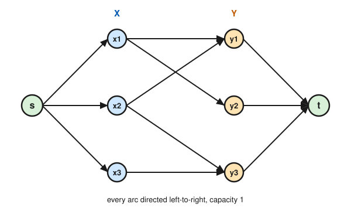

# Graph Theory · Lesson 4.3: Menger's theorem & flows behind matching

> ⏱ ~15 min · Module 4: Network flows · Builds on: [Lesson 4.2](04-02-augmenting-paths-ford-fulkerson.md), [Lesson 2.3](02-03-bipartite-matching-hall.md), [Lesson 2.4](02-04-konig-covers.md) · Unlocks: [Lesson 5.1](05-01-adjacency-spectrum.md)

## Why this matters

This is the lesson where the whole course's through-line — *duality* — snaps shut. Back in Module 2 you met König: in a bipartite graph, the largest matching equals the smallest vertex cover. In Module 4 you met max-flow min-cut: the most you can push from $s$ to $t$ equals the cheapest way to sever them. They looked like different theorems about different objects. They are not. Menger's theorem says connectivity is a flow problem, König says matching is a flow problem, and once you see the reductions you never have to prove a max–min duality from scratch again — you build the right unit-capacity network and let max-flow min-cut (Lesson 4.1) do the work. This is exactly how a network engineer reasons about fault tolerance ("how many cables can fail before $s$ and $t$ are cut off?") and how a scheduler reasons about assignments ("can every worker be given a distinct job?").

## The idea

Two robustness questions about a graph $G$ with a chosen source $s$ and sink $t$:

- **How many edges must an adversary cut to disconnect $s$ from $t$?** Call it the *min edge separator*.
- **How many $s$–$t$ paths can you route so no two share an edge?** Call these *edge-disjoint paths*.

Every edge-disjoint path is a distinct route the adversary must break, so *paths $\le$ separator*: you can never route more paths than the number of edges it takes to cut them all. Menger's theorem is the surprise that the inequality is always an *equality*. And the reason is almost embarrassing: give every edge capacity $1$. Then a set of edge-disjoint paths **is** an integer flow, a separator **is** an $s$–$t$ cut, and max-flow min-cut says the biggest flow equals the smallest cut. Menger is max-flow min-cut wearing a hat.

The same trick captures matching. A bipartite matching is a set of worker–job edges with no shared endpoint. Wire a super-source $s$ into every worker, every job into a super-sink $t$, cap everything at $1$, and an integer flow of value $k$ is forced to pick $k$ worker–job edges that touch each worker once and each job once — a matching. Max flow $=$ max matching; the min cut turns out to be a vertex cover, and König falls out.

## The formal version

Fix a graph $G=(V,E)$ with $|V|\ge 2$.

**Definition (edge connectivity).** $\lambda(G)$ is the minimum number of edges whose deletion disconnects $G$ (leaves it in $\ge 2$ components). The **local** version $\lambda(s,t)$ is the minimum number of edges whose deletion leaves no $s$–$t$ path.

**Definition (vertex connectivity).** $\kappa(G)$ is the minimum number of *vertices* whose deletion disconnects $G$ or reduces it to a single vertex; by convention $\kappa(K_n)=n-1$. The local version $\kappa(s,t)$, defined for non-adjacent $s,t$, is the minimum number of vertices — other than $s,t$ — whose deletion leaves no $s$–$t$ path.

*In words:* $\lambda$ counts the weakest bundle of cables; $\kappa$ counts the weakest bundle of relay stations.

Two paths are **edge-disjoint** if they share no edge, and **internally disjoint** if they share no vertex except $s$ and $t$.

**Menger's theorem (edge form).** For any $s\ne t$,
$$\max\{\text{edge-disjoint } s\text{–}t \text{ paths}\} = \lambda(s,t) = \min\{\text{edges separating } s \text{ from } t\}.$$

*In words:* the number of independent routes equals the number of cuts needed to kill them all.

**Menger's theorem (vertex form).** For non-adjacent $s,t$,
$$\max\{\text{internally-disjoint } s\text{–}t \text{ paths}\} = \kappa(s,t) = \min\{\text{vertices separating } s \text{ from } t\}.$$

*In words:* the number of vertex-independent routes equals the size of the smallest set of intermediate vertices that blocks every route.

### Deriving the edge form from max-flow min-cut

Turn $G$ into a network $N$: keep every edge but give it **capacity $1$** (an undirected edge may carry one unit in either direction). Now:

1. **Flows $=$ path packings.** By integrality of Ford–Fulkerson (Lesson 4.2), a max flow can be taken to be integer-valued, so with unit capacities every edge carries $0$ or $1$. A flow of value $k$ **decomposes** into $k$ edge-disjoint $s$–$t$ paths: repeatedly follow flow-carrying edges out of $s$ until you reach $t$ (conservation guarantees you can always continue), peel that path off, and drop the value by $1$; leftover flow sits on cycles and is discarded. Because each edge holds at most one unit, the peeled paths share no edge. Conversely $k$ edge-disjoint paths give a flow of value $k$. Hence **max flow $=$ max edge-disjoint paths.**
2. **Cuts $=$ separators.** An $s$–$t$ cut $(S,T)$ has capacity equal to the number of edges crossing from $S$ to $T$ (each contributes $1$), and deleting exactly those edges leaves no $s$–$t$ path. So **min cut $=$ min edge separator $=\lambda(s,t)$.**
3. Max-flow min-cut (Lesson 4.1) says max flow $=$ min cut. Chain (1)–(3): max edge-disjoint paths $=\lambda(s,t)$. $\blacksquare$

The vertex form comes from the same machine after one gadget: **split** each internal vertex $v$ into $v_{\text{in}}\to v_{\text{out}}$ joined by a capacity-$1$ arc (all edges into $v$ enter $v_{\text{in}}$, all edges out leave $v_{\text{out}}$). A unit of flow now consumes a whole vertex, so integer flows become internally-disjoint paths and min cuts become vertex separators.

## Picture

The reduction from a bipartite matching instance to a unit-capacity $s$–$t$ flow network. Left column $X$ (workers), right column $Y$ (jobs); the original edges $x_iy_j$ become the middle arcs. Add $s\to x_i$ and $y_j\to t$, orient everything left-to-right, and cap every arc at $1$.

An integer flow can push at most $1$ unit through each $x_i$ (its only in-arc $s\to x_i$ has capacity $1$) and at most $1$ unit into each $y_j$ (its only out-arc $y_j\to t$ has capacity $1$). So the saturated middle arcs form a set of edges meeting each vertex at most once — a matching. Here the max flow is $3$: route $s\to x_1\to y_2\to t$, $s\to x_2\to y_1\to t$, $s\to x_3\to y_3\to t$, recovering the perfect matching $\{x_1y_2,\;x_2y_1,\;x_3y_3\}$.

## Worked examples

**Example 1 (edge Menger, by hand).** Let $G$ have vertices $s,a,b,t$ and edges $sa,\,sb,\,ab,\,at,\,bt$ (a 4-cycle $s\text{-}a\text{-}t\text{-}b\text{-}s$ plus the chord $ab$). How many edge-disjoint $s$–$t$ paths, and what is $\lambda(s,t)$?

*Paths.* $P_1: s\to a\to t$ and $P_2: s\to b\to t$ share no edge — that's $2$. Can we reach $3$? Every path must leave $s$, and $s$ has only the two edges $sa,sb$; three edge-disjoint paths would need three distinct edges at $s$. So $2$ is the max.

*Separator.* Delete $sa$ and $sb$: now $s$ is isolated, no $s$–$t$ path survives, so a separator of size $2$ exists, giving $\lambda(s,t)\le 2$. And $\lambda(s,t)\ge 2$ because a single edge cannot separate them ($2$ disjoint paths survive any one deletion).

Both counts are $2$: Menger checks out. Notice the chord $ab$ is a decoy — it can't raise the path count past the bottleneck of two edges at $s$.

**Example 2 (matching $\to$ flow $\to$ König).** Take the bipartite graph in the Picture: $X=\{x_1,x_2,x_3\}$, $Y=\{y_1,y_2,y_3\}$, edges $x_1y_1,\,x_1y_2,\,x_2y_1,\,x_2y_3,\,x_3y_3$. Build the unit network as drawn.

*Max flow.* The three routes above give value $3$; since $|X|=3$ caps the flow at $3$, that's optimal. So the maximum matching has size $3$ (it's perfect).

*Reading König off the min cut.* By max-flow min-cut some cut has capacity $3$. Turn **any** min cut $(S,T)$ into a vertex cover as follows. Let $B=X\cap T$ (workers on the sink side), $C=Y\cap S$ (jobs on the source side). The crossing arcs are: the arcs $s\to x$ for $x\in B$, the arcs $y\to t$ for $y\in C$, and any middle arc $x\to y$ with $x\in X\cap S,\ y\in Y\cap T$. Now $B\cup C$ covers every edge *except* those middle arcs — an edge $x_iy_j$ is uncovered only if $x_i\notin B$ and $y_j\notin C$, i.e. $x_i\in S$ and $y_j\in T$, which is exactly a crossing middle arc. Add one endpoint of each such arc: the resulting cover has size $\le |B|+|C|+(\text{middle crossings}) = $ cut capacity $=3$. Since every matching needs a distinct cover vertex, the min cover is $\ge 3$ too. Hence min cover $=3=$ max matching — **König, recovered from flow.**

## Watch out

- You might think "capacity $1$ on the middle arcs is too tight and loses matchings" — but it doesn't. The bottlenecks are the source and sink arcs; making a middle arc's capacity $1$ (versus $\infty$) never changes the max flow, because no worker or job can push more than one unit anyway. Unit capacity everywhere keeps the model uniform *and* makes the min cut translate cleanly into a cover.
- You might think edge and vertex connectivity are the same number — they are not. Always $\kappa(G)\le\lambda(G)\le\delta(G)$ (min degree), and the gaps can be strict: two triangles sharing a single vertex have $\kappa=1$ but $\lambda=2$. Menger's edge form governs $\lambda$; the vertex form (via vertex-splitting) governs $\kappa$.
- You might think "edge-disjoint" and "internally disjoint" are interchangeable — internally-disjoint paths are automatically edge-disjoint, but not vice versa. Two paths can avoid sharing an edge while both passing through a common relay vertex, which is why the vertex form needs the splitting gadget rather than the raw network.

## One-liner

> Give every edge capacity one and max-flow min-cut hands you Menger (disjoint paths $=$ separator) and König (matching $=$ cover) for free — connectivity and matching were flow problems all along.

## Problems

**P1 (🟢)** In the graph $G$ with vertices $s,a,b,c,t$ and edges $sa,\,sb,\,ac,\,bc,\,at,\,ct$: (a) find a maximum set of edge-disjoint $s$–$t$ paths, and (b) exhibit a minimum edge separator of the same size, confirming Menger's edge form.

**P2 (🟡)** Bipartite graph: $X=\{x_1,x_2,x_3\}$, $Y=\{y_1,y_2,y_3\}$, edges $x_1y_1,\,x_1y_2,\,x_2y_2,\,x_3y_2$. Build the unit-capacity $s$–$t$ network, find the maximum flow, and read off both the maximum matching and a minimum vertex cover of equal size. (What single vertex is doing all the work?)

**P3 (🔴)** Vertex form. In $G$ with vertices $s,a,b,c,t$ and edges $sa,\,sc,\,ac,\,cb,\,ct,\,bt$ (two triangles $sac$ and $cbt$ glued at $c$; note $s,t$ are non-adjacent): find the maximum number of internally-disjoint $s$–$t$ paths and a minimum vertex separator of the same size. Then compare with the *edge* form — how many edge-disjoint $s$–$t$ paths are there, and what is $\lambda(s,t)$?

Solutions

**P1** (a) $P_1: s\to a\to t$ and $P_2: s\to b\to c\to t$ are edge-disjoint — $2$ paths. A third is impossible: $t$ has only the two edges $at,ct$, so at most two edge-disjoint paths can *enter* $t$.
(b) Delete $at$ and $ct$: $t$ becomes isolated, no $s$–$t$ path remains, so this is a separator of size $2$. One edge alone can't separate (the two disjoint paths survive any single deletion), so $\lambda(s,t)=2$. Max paths $=2=$ min separator. $\blacksquare$

**P2** Network: $s\to x_1,x_2,x_3$; middle arcs $x_1\to y_1,\ x_1\to y_2,\ x_2\to y_2,\ x_3\to y_2$; $y_1,y_2,y_3\to t$ (note $y_3$ has no in-arc). Max flow: push $s\to x_1\to y_1\to t$ and $s\to x_2\to y_2\to t$, value $2$. Can we get $3$? No: $x_2$ and $x_3$ can only reach $y_2$, and $y_2$'s out-arc $y_2\to t$ has capacity $1$, so at most one unit total flows through $\{x_2,x_3\}$. Max flow $=2$.
Maximum matching: $\{x_1y_1,\,x_2y_2\}$ (size $2$); $x_3$ cannot be matched because its only neighbor $y_2$ is taken. Minimum vertex cover of size $2$: $\{x_1, y_2\}$ — $x_1$ covers $x_1y_1$ and $x_1y_2$, while $y_2$ covers $x_1y_2,\,x_2y_2,\,x_3y_2$; every edge is covered. So max matching $=2=$ min cover (König). The vertex $y_2$ is the bottleneck — three workers competing for the one job. $\blacksquare$

**P3** *Vertex form.* Trace the graph: $s$'s neighbors are $a,c$; from $a$ you can only reach $c$; and every route into $t$ arrives from $c$ or $b$, while $b$'s neighbors are $c,t$. So *every* $s$–$t$ path passes through $c$. Hence at most **one** internally-disjoint path exists, and deleting the single vertex $c$ severs $s$ from $t$: $\kappa(s,t)=1$ with min vertex separator $\{c\}$. Max internally-disjoint paths $=1=$ separator size.

*Edge form, for contrast.* Now $c$ is only a shared *vertex*, not a shared edge, so two edge-disjoint paths fit: $P_1: s\to c\to t$ (edges $sc,ct$) and $P_2: s\to a\to c\to b\to t$ (edges $sa,ac,cb,bt$). A third is impossible since $t$ has only two edges $ct,bt$; deleting both isolates $t$, so $\lambda(s,t)=2$. This is a clean $\kappa(s,t)=1 < 2=\lambda(s,t)$: one relay vertex blocks everything, yet it takes two cables to cut. $\blacksquare$

## Flashback

**From Lesson 2.3 (bipartite matching & Hall):** In the bipartite graph $X=\{a,b,c,d\}$, $Y=\{1,2,3,4\}$ with edges $a1,\,a2,\,b1,\,b2,\,c1,\,c2,\,d3,\,d4$, find a maximum matching. If it is not perfect, exhibit a set $S\subseteq X$ violating Hall's condition $|N(S)|\ge|S|$.

Solution

The three vertices $a,b,c$ all have their edges going only to $\{1,2\}$: take $S=\{a,b,c\}$. Then $N(S)=\{1,2\}$, so $|N(S)|=2 < 3=|S|$ — **Hall's condition fails**, so no perfect matching exists. The obstruction is concrete: three workers chasing only two jobs.
A maximum matching has size $3$, e.g. $\{a1,\,b2,\,d3\}$ (leaving $c$ unmatched). It's maximum because $\{1,2,d\}$ is a vertex cover of size $3$ — vertices $1,2$ cover all edges among $a,b,c$, and $d$ covers $d3,d4$ — so by König no matching can exceed $3$. $\blacksquare$

## Connections

- **Backward:** this closes Module 4 by cashing in Lesson 4.1's max-flow min-cut and Lesson 4.2's integrality. It also loops back to Module 2: [Lesson 2.3](02-03-bipartite-matching-hall.md)'s Hall condition and [Lesson 2.4](02-04-konig-covers.md)'s König duality are now *corollaries* of flow, not separate theorems — Hall is "max flow $=|X|$ iff no $s$-side cut is smaller."
- **Forward:** connectivity resurfaces spectrally in Module 5 — [Lesson 5.2](05-02-laplacian-matrix-tree.md) reads the number of components off the Laplacian's zero eigenvalues, and its second eigenvalue $\lambda_2$ (algebraic connectivity) is a quantitative cousin of the $\kappa,\lambda$ you met here.
- **Sideways (CS / operations research):** the matching-as-flow reduction is the theoretical seed of every real assignment algorithm — job scheduling, ad allocation, and the Hungarian method all run this network. The future algorithms track will keep the network but ask *how fast*; here you learned *why it is correct*. The same max–min pattern is the discrete twin of Lagrangian duality in optimization: a maximization capped by a minimization, meeting exactly.
