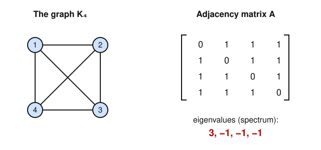

# Graph Theory · Lesson 5.1: The adjacency spectrum

> ⏱ ~15 min · Module 5: Spectral & extremal — a taste · Builds on: [Lesson 1.2](01-02-representing-graphs-isomorphism.md), [linalg-refresher](../../linalg-refresher/syllabus.md) · Unlocks: [Lesson 5.2](05-02-laplacian-matrix-tree.md)

## Why this matters

So far every invariant we've used — degree sequence, connectivity, chromatic number — you read off the *picture*. Spectral graph theory does something slyer: it hands the graph to linear algebra as a matrix and lets the **eigenvalues** report back. Those numbers quietly encode how many pieces the graph has, whether it's bipartite, how well it mixes, and (next lesson) exactly how many spanning trees it holds. This is the bridge Google's PageRank, community detection, and expander-graph constructions all walk across. And it's a chance to see that a symmetric-matrix diagonalization you learned abstractly in [linalg-refresher](../../linalg-refresher/syllabus.md) *means something combinatorial*.

## The idea

Take a graph on $n$ vertices and write down its **adjacency matrix** $A$ from [Lesson 1.2](01-02-representing-graphs-isomorphism.md): an $n \times n$ grid of $0$s and $1$s where $A_{ij} = 1$ exactly when $i$ and $j$ are joined by an edge. For a simple graph this matrix is **symmetric** ($A_{ij} = A_{ji}$, edges have no direction) with a zero diagonal (no loops).

Symmetric is the magic word. The spectral theorem promises a symmetric real matrix has all-real eigenvalues and a full orthonormal basis of eigenvectors — no complex numbers, no defective corners. So a graph comes with a list of $n$ real numbers, its **spectrum** $\lambda_1 \ge \lambda_2 \ge \cdots \ge \lambda_n$, and these are the same no matter how you relabel the vertices (relabeling just conjugates $A$ by a permutation matrix, which leaves eigenvalues untouched). The spectrum is a genuine **graph invariant**.

The second idea makes those numbers concrete: **matrix powers count walks**. Multiply $A$ by itself and the entry $(A^k)_{ij}$ turns out to be the number of walks of length $k$ from vertex $i$ to vertex $j$. So the algebra of $A$ is nothing but bookkeeping for how you can stroll around the graph.

## The formal version

**Definition (adjacency matrix).** For a simple graph $G$ with vertices $1,\dots,n$, its adjacency matrix is the $n\times n$ matrix $A$ with $A_{ij}=1$ if $ij$ is an edge and $A_{ij}=0$ otherwise. Its eigenvalues $\lambda_1 \ge \cdots \ge \lambda_n$ (with multiplicity) form the **spectrum** of $G$.

*In words:* the graph's "wiring table," read as a linear map, and the numbers that map stretches by.

**Fact (real symmetric ⇒ diagonalizable).** $A = A^{\mathsf T}$, so by the spectral theorem $A$ has $n$ real eigenvalues and an orthonormal eigenbasis; $A = Q\,\mathrm{diag}(\lambda_1,\dots,\lambda_n)\,Q^{\mathsf T}$ for an orthogonal $Q$.

*In words:* every graph diagonalizes cleanly over the reals — the exact statement about symmetric matrices from [linalg-refresher](../../linalg-refresher/syllabus.md), now with a combinatorial meaning. **This is the cross-subject bridge: adjacency/Laplacian spectrum ↔ symmetric-matrix diagonalization.**

**Theorem (walk counting).** For every $k \ge 0$, $(A^k)_{ij}$ equals the number of walks of length $k$ from $i$ to $j$.

*In words:* the $(i,j)$ entry of the $k$-th power counts length-$k$ routes from $i$ to $j$.

*Proof (induction on $k$).* For $k=1$, $(A^1)_{ij}=A_{ij}$ is $1$ or $0$ — exactly the number of one-edge walks. Assume it holds for $k$. A walk of length $k+1$ from $i$ to $j$ is a walk of length $k$ from $i$ to some neighbor $m$ of $j$, then the edge $mj$. Summing over the intermediate vertex $m$:
$$(A^{k+1})_{ij}=\sum_{m=1}^{n}(A^{k})_{im}A_{mj},$$
which is precisely matrix multiplication, and each term counts the walks routed through $m$. $\blacksquare$

Two immediate corollaries you'll use as sanity checks. Because a length-$2$ closed walk $i\to m\to i$ just picks a neighbor and returns, $(A^2)_{ii}=\deg(i)$. And the trace collects all closed walks: $\operatorname{tr}(A)=\sum_i\lambda_i=0$ (no loops), while
$$\operatorname{tr}(A^2)=\sum_i\lambda_i^{2}=\sum_i\deg(i)=2\lvert E\rvert.$$
*In words:* the eigenvalues sum to zero and their squares sum to twice the edge count — free error-checks on any spectrum you compute.

**Theorem (regular graphs).** Let $G$ be **$d$-regular** (every vertex has degree $d$). Then:

1. $d$ is an eigenvalue, with eigenvector $\mathbf{1}=(1,1,\dots,1)^{\mathsf T}$.
2. Every eigenvalue satisfies $\lvert\lambda\rvert\le d$.
3. The multiplicity of $d$ equals the number of connected components of $G$.
4. $-d$ is an eigenvalue **iff** some component is bipartite; if $G$ is connected, $-d$ appears iff $G$ is bipartite.

*In words:* for a regular graph the top eigenvalue is the degree, nothing exceeds it in size, how many times $d$ repeats counts the pieces, and the bottom eigenvalue hits $-d$ exactly when bipartiteness lets you two-color the graph.

*Why (1) and (2).* Each row of $A$ sums to $d$, so $A\mathbf 1 = d\mathbf 1$. For (2), if $Ax=\lambda x$ and $x_k$ is the entry of largest absolute value, then $\lvert\lambda\rvert\,\lvert x_k\rvert=\big\lvert\sum_{m\sim k}x_m\big\rvert\le\sum_{m\sim k}\lvert x_m\rvert\le d\,\lvert x_k\rvert$, so $\lvert\lambda\rvert\le d$. *(Sketch for (4):* on a connected bipartite graph with sides $X,Y$, flip signs — set $y_v=+1$ on $X$, $-1$ on $Y$ — and $Ay=-d\,y$.)*

**Fact (cospectral graphs).** The spectrum is an invariant but **not a complete** one: non-isomorphic graphs can share a spectrum. The smallest example is $C_4\cup K_1$ versus the star $K_{1,4}$ — both have spectrum $\{2,0,0,0,-2\}$, yet one is disconnected and the other isn't.

*In words:* equal spectra do **not** force isomorphism; the eigenvalues can't hear everything about the shape.

## Picture

The all-ones off-diagonal pattern of $K_4$ is what forces the lopsided spectrum $3,-1,-1,-1$: one big eigenvalue (the degree) and the rest crammed down as low as symmetry allows.

## Worked examples

**Example 1 (the spectrum of $K_4$, with walk check).** The complete graph $K_4$ is $3$-regular, and its adjacency matrix is $A=J-I$, where $J$ is the all-ones $4\times4$ matrix and $I$ the identity. Now $J$ has eigenvalue $4$ once (eigenvector $\mathbf 1$) and $0$ with multiplicity $3$ (every vector summing to zero). Subtracting $I$ shifts every eigenvalue down by $1$:
$$\lambda(K_4)=\{\,4-1,\ 0-1,\ 0-1,\ 0-1\,\}=\{\,3,\,-1,\,-1,\,-1\,\}.$$
The top eigenvalue is $d=3$, as the regular theorem promised, with multiplicity-one $3$ confirming $K_4$ is connected. Sanity checks: $\sum\lambda_i=3-1-1-1=0=\operatorname{tr}(A)$ ✓, and $\sum\lambda_i^2=9+1+1+1=12=2\lvert E\rvert=2\cdot6$ ✓.

Now verify walk-counting. Squaring, $A^2=(J-I)^2=J^2-2J+I=4J-2J+I=2J+I$ (using $J^2=4J$). So $(A^2)_{ii}=2\cdot1+1=3=\deg(i)$ ✓, and for $i\neq j$, $(A^2)_{ij}=2$. Read that off the graph: a length-$2$ walk from vertex $1$ to vertex $3$ is $1\to m\to 3$ with $m$ adjacent to both — and in $K_4$ the two remaining vertices $\{2,4\}$ both qualify, giving exactly $2$ walks. The matrix and the picture agree.

**Example 2 (why the bottom eigenvalue matters: $C_4$).** The $4$-cycle $C_4$ (vertices $1\!-\!2\!-\!3\!-\!4\!-\!1$) is $2$-regular and bipartite (sides $\{1,3\}$ and $\{2,4\}$). Its spectrum is
$$\lambda(C_4)=\{\,2,\,0,\,0,\,-2\,\}.$$
Everything the theorem predicts is visible: the top eigenvalue is $d=2$; nothing exceeds $2$ in size; and because $C_4$ is bipartite, $-d=-2$ appears. Contrast this with $K_4$, whose smallest eigenvalue was $-1$, not $-3$ — $K_4$ is *not* bipartite (it's stuffed with triangles), so $-d$ is absent. The single number $\lambda_n$ told you "bipartite or not" without your ever hunting for an odd cycle.

Walk check for $C_4$: $A^2$ has diagonal $2$ (each vertex has $\deg=2$) and $(A^2)_{13}=2$ (routes $1\to2\to3$ and $1\to4\to3$), while $(A^2)_{12}=0$ — adjacent vertices in $C_4$ share no common neighbor, so there is no length-$2$ walk between them. The zeros and twos of $A^2$ are a map of who-can-reach-whom in two steps.

## Watch out

- You might think the spectrum determines the graph — but it doesn't. Cospectral non-isomorphic graphs ($C_4\cup K_1$ and $K_{1,4}$) prove the eigenvalues are *necessary* to match for isomorphism, never *sufficient*. Equal spectra: keep looking. Different spectra: definitely not isomorphic.
- The "$d$ is the largest eigenvalue" and "$-d$ iff bipartite" rules are for **regular** graphs. For an irregular graph the top eigenvalue lands somewhere between the average and maximum degree, and the clean bipartite test becomes "the spectrum is symmetric about $0$" — a subtler statement.
- Multiplicity of $d$ counts components only *for regular graphs*. Do not port this to the adjacency matrix of an arbitrary graph — that job belongs to the Laplacian's zero eigenvalues, which is exactly [Lesson 5.2](05-02-laplacian-matrix-tree.md).
- $(A^k)_{ij}$ counts **walks**, not paths — repeats and backtracking are allowed. A closed length-$2$ walk $i\to m\to i$ is why $(A^2)_{ii}=\deg(i)$; it is not a cycle.

## One-liner

> Hand a graph to linear algebra as a symmetric matrix and its eigenvalues report back its size-cap, its components, and its bipartiteness — while matrix powers just count walks.

## Problems

**P1 (🟢)** Consider the path $P_3$ on three vertices $1\!-\!2\!-\!3$ (two edges). (a) Write down its adjacency matrix $A$. (b) Compute $A^2$ and state, in words, what each diagonal entry counts — check it against the degrees. (c) The spectrum of $P_3$ is $\{\sqrt2,\,0,\,-\sqrt2\}$; verify both trace identities $\sum\lambda_i=0$ and $\sum\lambda_i^2=2\lvert E\rvert$.

**P2 (🟡)** The complete bipartite graph $K_{2,3}$ has $\lvert E\rvert = 6$ and its adjacency spectrum is $\{\sqrt6,\,0,\,0,\,0,\,-\sqrt6\}$. (a) Without computing anything, explain why $-\sqrt6$ being an eigenvalue is consistent with — indeed forced by — the fact that $K_{2,3}$ is bipartite. (b) Verify $\sum\lambda_i^2 = 2\lvert E\rvert$. (c) $K_{2,3}$ is *not* regular. Which one of the four "regular graph" rules can you no longer rely on to conclude its top eigenvalue is $\sqrt6$?

**P3 (🔴, optional)** Let $G$ be any simple graph with adjacency matrix $A$. Show that the number of **triangles** in $G$ equals $\tfrac16\operatorname{tr}(A^3)$. *(Hint: $(A^3)_{ii}$ counts closed walks of length $3$ from $i$; describe them, then account for overcounting.)*

Solutions

**P1** (a) With the ordering $1,2,3$,
$$A=\begin{pmatrix}0&1&0\\1&0&1\\0&1&0\end{pmatrix}.$$
(b) Squaring,
$$A^2=\begin{pmatrix}1&0&1\\0&2&0\\1&0&1\end{pmatrix}.$$
Each diagonal entry $(A^2)_{ii}$ counts closed length-$2$ walks from $i$, i.e. "go to a neighbor and come back," which is exactly $\deg(i)$. Here $\deg(1)=\deg(3)=1$ and $\deg(2)=2$, matching the diagonal $1,2,1$ ✓. (The off-diagonal $(A^2)_{13}=1$ is the single walk $1\to2\to3$.)

(c) $\sum\lambda_i=\sqrt2+0-\sqrt2=0$ ✓. And $\sum\lambda_i^2=2+0+2=4=2\cdot2=2\lvert E\rvert$ ✓.

**P2** (a) $K_{2,3}$ is bipartite (that's its definition — two sides, all edges across). For a bipartite graph the spectrum is symmetric about $0$: if $\lambda$ is an eigenvalue so is $-\lambda$ (flip the sign of the eigenvector on one side). So the presence of the top eigenvalue $\sqrt6$ *forces* $-\sqrt6$ to appear as well. (b) The nonzero eigenvalues are $\pm\sqrt6$, so $\sum\lambda_i^2=6+0+0+0+6=12=2\cdot6=2\lvert E\rvert$ ✓. (c) Rule (1) — "$d$ is an eigenvalue with eigenvector $\mathbf 1$" — needed *regularity* so that every row sums to the same $d$. $K_{2,3}$ has degrees $3,3,2,2,2$, so the all-ones vector is not an eigenvector and there's no single degree $d$ to be the top eigenvalue. (The top eigenvalue $\sqrt6\approx2.449$ instead sits between the average degree $2.4$ and the max degree $3$, as the general bound predicts.)

**P3** By the walk-counting theorem, $(A^3)_{ii}$ is the number of closed walks of length $3$ starting and ending at $i$. Such a walk is $i\to a\to b\to i$ where each consecutive pair is an edge; since the graph is simple (no loops, no repeated edges) and the walk returns to $i$ in three distinct edges, $i,a,b$ must be three distinct mutually-adjacent vertices — i.e. a triangle through $i$. So $(A^3)_{ii}$ counts the triangles containing $i$, each traversed in one of $2$ directions ($i\to a\to b\to i$ or $i\to b\to a\to i$): thus $(A^3)_{ii}=2\cdot(\#\text{ triangles through }i)$. Summing over $i$, $\operatorname{tr}(A^3)=\sum_i 2\,(\#\triangle\text{ through }i)=2\cdot 3\cdot(\#\text{ triangles})$, since each triangle is counted once at each of its $3$ vertices. Therefore
$$\#\text{ triangles}=\tfrac16\operatorname{tr}(A^3)=\tfrac16\sum_i\lambda_i^3. \qquad\blacksquare$$
(Quick check on $K_4$: $\operatorname{tr}(A^3)=\sum\lambda_i^3=3^3+3(-1)^3=27-3=24$, giving $24/6=4$ triangles — correct, $K_4$ has $\binom43=4$.)

## Flashback

**From [Lesson 1.2](01-02-representing-graphs-isomorphism.md) (isomorphism invariants):** Let $G=C_6$ (a single $6$-cycle) and let $H$ be the disjoint union of two triangles, $H=K_3\cup K_3$. Both have $6$ vertices, $6$ edges, and every vertex of degree $2$ — so their **degree sequences are identical**. Are $G$ and $H$ isomorphic? Justify with an invariant that *does* separate them.

Solution

They are **not** isomorphic. The degree sequence fails to distinguish them, so reach for a finer invariant — the **number of connected components**. $C_6$ is a single cycle, hence connected (one component); $H=K_3\cup K_3$ is two disjoint triangles (two components). Isomorphisms preserve connectedness, so no bijection of vertices can carry one to the other. (Equivalent finer invariants: $H$ contains a triangle — a $3$-cycle — while $C_6$'s shortest cycle has length $6$, so their **girths** differ, $3$ vs $6$.)

Foreshadowing this lesson: their *spectra* also differ — $\lambda(C_6)=\{2,1,1,-1,-1,-2\}$ while $\lambda(K_3\cup K_3)=\{2,2,-1,-1,-1,-1\}$ — so even the eigenvalues would have caught this one. The multiplicity of the top eigenvalue $2$ is $1$ for the connected $C_6$ and $2$ for the two-component $H$, exactly the "multiplicity of $d$ = number of components" rule for $2$-regular graphs.

## Connections

- **Backward:** this reuses the adjacency matrix from [Lesson 1.2](01-02-representing-graphs-isomorphism.md) and its invariants — the spectrum is the strongest matrix invariant we've met, though the cospectral pair shows even it has blind spots.
- **Forward:** [Lesson 5.2](05-02-laplacian-matrix-tree.md) swaps $A$ for the Laplacian $L=D-A$, where the *zero* eigenvalues count components (for any graph, not just regular) and the nonzero ones multiply to give the spanning-tree count — the Matrix–Tree theorem.
- **Sideways (linear algebra):** the entire lesson rides on symmetric-matrix diagonalization from [linalg-refresher](../../linalg-refresher/syllabus.md) — real eigenvalues, orthonormal eigenbasis, $A=Q\Lambda Q^{\mathsf T}$. Spectral graph theory is that theorem given a combinatorial job. The same eigenvector-of-the-top-eigenvalue idea (Perron–Frobenius) is what powers PageRank and Markov-chain mixing in probability.
