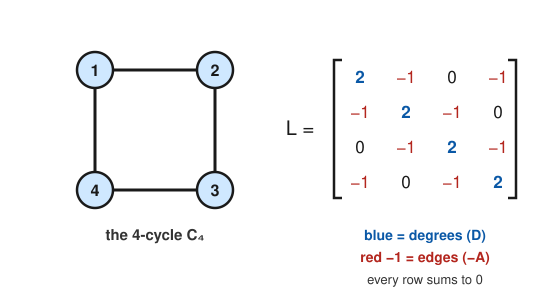

# Graph Theory · Lesson 5.2: The Laplacian & the Matrix–Tree theorem

> ⏱ ~15 min · Module 5: Spectral & extremal — a taste · Builds on: [5.1](05-01-adjacency-spectrum.md), [2.2](02-02-spanning-trees-mst.md) · Unlocks: 5.3 (extremal graphs & Ramsey theory)

## Why this matters

In [Lesson 5.1](05-01-adjacency-spectrum.md) the adjacency matrix $A$ told you about *walks*. Its close cousin — the **Laplacian** $L = D - A$ — turns out to be the one matrix that reads off a graph's *global connectivity* and even **counts its spanning trees**, exactly. This is the object behind spectral clustering (splitting a social network into communities), behind the "stiffness" of a spring network or a resistor grid in physics, and behind a one-line proof of Cayley's formula $n^{n-2}$ that Module 2 could only *state*. One symmetric matrix, three payoffs: is the graph connected, how robustly, and how many skeletons does it have.

## The idea

Take a graph and, for each vertex, write its degree on the diagonal; for each edge, write $-1$ in the two off-diagonal slots it touches. That's $L = D - A$: the degree matrix $D$ minus the adjacency matrix $A$. Because each row is "(degree) minus (one $-1$ per neighbor)," **every row sums to zero**. So the all-ones vector $\mathbf{1}$ is instantly killed: $L\mathbf{1} = \mathbf{0}$, meaning $0$ is always an eigenvalue.

Why care about a matrix whose rows sum to zero? Because $L$ measures *disagreement across edges*. Assign a number $x_u$ to each vertex — think a temperature, a vote, a coordinate — and $L$ answers "how much do neighbors differ?" via the clean formula $x^\top L x = \sum_{\text{edges }(u,v)} (x_u - x_v)^2$. That sum is zero exactly when every edge's endpoints agree, i.e. when $x$ is constant on each connected piece. So the *ways to be zero* count the pieces: the multiplicity of eigenvalue $0$ equals the number of connected components. One component ⇒ $0$ appears once, and the next eigenvalue up, $\lambda_2 > 0$, quietly measures *how hard the graph is to cut* — its **algebraic connectivity**.

## The formal version

Let $G$ be a graph on $n$ vertices with adjacency matrix $A$ and let $D = \mathrm{diag}(\deg v_1, \dots, \deg v_n)$.

**Definition (Laplacian).** $L = D - A$. So $L_{uu} = \deg(u)$, and for $u \neq v$, $L_{uv} = -1$ if $uv$ is an edge and $0$ otherwise.

*In words:* degrees on the diagonal, a $-1$ for every edge, zeros elsewhere.

**The quadratic form.** For any vector $x \in \mathbb{R}^n$,
$$x^\top L x \;=\; \sum_{(u,v)\in E} (x_u - x_v)^2.$$

*In words:* plug in a number per vertex, and $L$ returns the total squared disagreement across edges. (Derivation: $x^\top L x = \sum_u \deg(u)\,x_u^2 - 2\sum_{(u,v)\in E} x_u x_v = \sum_{(u,v)\in E}(x_u^2 - 2x_ux_v + x_v^2)$.)

Since the right side is a sum of squares, it is never negative, so:

**Spectral facts.** $L$ is symmetric and **positive semidefinite**, so its eigenvalues are real and can be ordered
$$0 = \lambda_1 \le \lambda_2 \le \cdots \le \lambda_n.$$
- $\lambda_1 = 0$ always, with eigenvector $\mathbf{1}$ (all ones).
- The **multiplicity of the eigenvalue $0$ equals the number of connected components** of $G$.
- Hence $\lambda_2 > 0$ **iff** $G$ is connected. This $\lambda_2$ is the **algebraic connectivity** (or **Fiedler value**): bigger means harder to disconnect.

*In words:* count how many times $0$ shows up to count the graph's pieces; the first nonzero eigenvalue grades how well-glued a single piece is.

**Kirchhoff's Matrix–Tree Theorem.** Let $\tau(G)$ be the number of **spanning trees** of $G$ (connected, acyclic subgraphs touching every vertex — see [Lesson 2.2](02-02-spanning-trees-mst.md)). Then:
$$\tau(G) \;=\; \text{any cofactor of } L \;=\; \frac{1}{n}\,\lambda_2 \lambda_3 \cdots \lambda_n.$$

*In words:* delete **any one row and the matching column** of $L$ and take the determinant of what's left — you get the exact number of spanning trees. Equivalently, multiply the nonzero eigenvalues and divide by $n$.

(Why every cofactor is equal: $L$ is singular with rank $n-1$ when connected, and its rows sum to zero, which forces all $n^2$ signed cofactors to coincide. We take that on faith here and *use* it.)

## Picture

Read the matrix straight off the picture: vertex $2$ has degree $2$ (blue $2$ on the diagonal) and edges to $1$ and $3$ (red $-1$s in those columns), zero to the non-neighbor $4$. Each row's blue $2$ is cancelled by exactly two red $-1$s — that's the "rows sum to zero" fact, made visible.

## Worked examples

**Example 1 (mechanical — $K_4$, and Cayley falls out).** The complete graph $K_4$ has every degree $3$, so $D = 3I$, and $A = J - I$ where $J$ is the all-ones matrix. Thus
$$L = 3I - (J - I) = 4I - J.$$
The eigenvalues of $J$ (a rank-one $4\times4$ matrix) are $4$ once (eigenvector $\mathbf{1}$) and $0$ three times. So $L = 4I - J$ has eigenvalues
$$4-4 = 0, \qquad 4-0 = 4,\ 4,\ 4 \quad\Longrightarrow\quad \{0,\,4,\,4,\,4\}.$$
Matrix–Tree via the eigenvalue product:
$$\tau(K_4) = \frac{1}{4}\,(4\cdot 4\cdot 4) = \frac{64}{4} = 16 = 4^{\,4-2}.$$
That last equality is **Cayley's formula** $\tau(K_n) = n^{n-2}$ from [Lesson 2.1](02-01-trees.md), which we could only quote there — here it is a two-line consequence of $L = nI - J$ having eigenvalues $0$ and $n$ (with multiplicity $n-1$), giving $\tau(K_n) = \frac1n\, n^{\,n-1} = n^{\,n-2}$.

**Example 2 (a cofactor by hand — $C_4$).** Take the $4$-cycle from the Picture, vertices $1\text{–}2\text{–}3\text{–}4\text{–}1$, every degree $2$:
$$L = \begin{bmatrix} 2 & -1 & 0 & -1 \\ -1 & 2 & -1 & 0 \\ 0 & -1 & 2 & -1 \\ -1 & 0 & -1 & 2 \end{bmatrix}.$$
Delete row $4$ and column $4$ and take the determinant of the surviving $3\times3$ block:
$$\det\!\begin{bmatrix} 2 & -1 & 0 \\ -1 & 2 & -1 \\ 0 & -1 & 2 \end{bmatrix}
= 2\,(4 - 1) - (-1)\,(-2 - 0) + 0 = 6 - 2 = 4.$$
So $\tau(C_4) = 4$ — and indeed a spanning tree of a $4$-cycle is exactly the cycle with **one** of its $4$ edges removed, so there are $4$ of them. Cross-check with eigenvalues: $C_4$'s Laplacian spectrum is $\{0, 2, 2, 4\}$, and $\frac14(2\cdot 2\cdot 4) = \frac{16}{4} = 4$. ✓ The middle value $\lambda_2 = 2$ is the algebraic connectivity: a $4$-cycle is better-glued than, say, a path on $4$ vertices (which has $\lambda_2 = 2 - \sqrt2 \approx 0.59$), matching the intuition that a cycle has no single weak link.

## Watch out

- **You might think** the Laplacian is $A - D$ or that a $+1$ goes off-diagonal. **Actually** it is $D - A$: degrees **positive** on the diagonal, edges **$-1$** off it. Get the sign backwards and you lose positive-semidefiniteness (and every eigenvalue flips sign).
- **You might think** the cofactor means "the determinant of $L$ itself." **Actually** $\det L = 0$ always (rows sum to zero), which is useless — you must *delete one row and one column* first. Delete matching indices (row $i$, column $i$) so the sign is $+$ and the cofactor is just that principal minor's determinant.
- **You might think** a disconnected graph might still have spanning trees. **Actually** $\tau(G) = 0$ for any disconnected $G$ — there's no acyclic subgraph joining separate pieces — and this is consistent with Matrix–Tree: two or more $0$ eigenvalues make the product $\lambda_2\cdots\lambda_n$ include a zero, so the formula returns $0$ too.
- **You might think** $\lambda_2 = 0$ is possible for a connected graph. **Actually** $\lambda_2 > 0$ *characterizes* connectivity — a single $0$ eigenvalue means one component. Seeing $0$ twice is a certificate that the graph is in pieces.

## One-liner

> $L = D - A$ packs a graph's whole global shape into one symmetric matrix: count its zero eigenvalues for the components, read $\lambda_2$ for how tightly it's glued, and take any cofactor to count its spanning trees exactly.

## Problems

**P1 (🟢)** For the triangle $C_3 = K_3$: (a) write down its Laplacian $L$; (b) count its spanning trees by a cofactor (delete row/column $3$); (c) confirm the same count from the eigenvalues $\{0, 3, 3\}$, and check it against Cayley's $3^{3-2}$.

**P2 (🟡)** Let $G$ be two disjoint edges: vertices $\{1,2,3,4\}$ with edges $12$ and $34$ only. Write $L$, determine the multiplicity of the eigenvalue $0$, and compute a cofactor. Explain how all three answers tell the same story about $G$.

**P3 (🔴, optional)** Using only the quadratic-form identity $x^\top L x = \sum_{(u,v)\in E}(x_u - x_v)^2$, prove: (a) every eigenvalue of $L$ is $\ge 0$; and (b) if $G$ is *connected*, the only vectors with $Lx = 0$ are the constant multiples of $\mathbf{1}$ — hence the $0$-eigenspace is one-dimensional and $\lambda_2 > 0$.

Solutions

**P1** (a) Every vertex of $K_3$ has degree $2$ and is adjacent to the other two, so
$$L = \begin{bmatrix} 2 & -1 & -1 \\ -1 & 2 & -1 \\ -1 & -1 & 2 \end{bmatrix}.$$
(b) Delete row $3$ and column $3$: $\det\!\begin{bmatrix} 2 & -1 \\ -1 & 2 \end{bmatrix} = 4 - 1 = 3$. So $\tau(K_3) = 3$ — remove any one of the $3$ edges of the triangle and you get a spanning tree (a path on $3$ vertices), so $3$ is right. (c) Eigenvalue product: $\frac13(3\cdot 3) = \frac{9}{3} = 3$. ✓ And Cayley gives $3^{3-2} = 3^1 = 3$. All three agree.

**P2** Degrees are all $1$; only edges are $12$ and $34$, so
$$L = \begin{bmatrix} 1 & -1 & 0 & 0 \\ -1 & 1 & 0 & 0 \\ 0 & 0 & 1 & -1 \\ 0 & 0 & -1 & 1 \end{bmatrix}.$$
This is block-diagonal with two identical $2\times2$ blocks, each having eigenvalues $0$ and $2$. So the spectrum is $\{0, 0, 2, 2\}$: **eigenvalue $0$ has multiplicity $2$**, correctly reporting **$2$ components**. A cofactor — delete row/column $4$ — is $\det\!\begin{bmatrix} 1 & -1 & 0 \\ -1 & 1 & 0 \\ 0 & 0 & 1 \end{bmatrix} = 1\cdot(1\cdot1 - 0) - (-1)\cdot(-1\cdot1 - 0) = 1 - 1 = 0$, so $\tau(G) = 0$. Same story three ways: two zero-eigenvalues ⇒ disconnected ⇒ no spanning tree ⇒ every cofactor is $0$, matching $\frac14(0\cdot 2\cdot 2) = 0$.

**P3** (a) For any $x$, $x^\top L x = \sum_{(u,v)\in E}(x_u - x_v)^2 \ge 0$, so $L$ is positive semidefinite. If $Lx = \lambda x$ with $x \neq 0$, then $x^\top L x = \lambda\, x^\top x = \lambda \|x\|^2$; the left side is $\ge 0$ and $\|x\|^2 > 0$, forcing $\lambda \ge 0$.

(b) Suppose $Lx = \mathbf{0}$. Then $x^\top L x = 0$, i.e. $\sum_{(u,v)\in E}(x_u - x_v)^2 = 0$. A sum of squares is zero only if each term is, so $x_u = x_v$ for **every edge** $(u,v)$. Now take any two vertices $s, t$: since $G$ is connected there is a path $s = w_0, w_1, \dots, w_k = t$, and along it $x_{w_0} = x_{w_1} = \cdots = x_{w_k}$, so $x_s = x_t$. Thus $x$ is constant across all vertices, i.e. $x = c\,\mathbf{1}$. The null space is therefore exactly $\mathrm{span}(\mathbf{1})$, one-dimensional, so $0$ has multiplicity $1$ and the next eigenvalue satisfies $\lambda_2 > 0$. $\blacksquare$

## Flashback

**From [Lesson 2.2](02-02-spanning-trees-mst.md) (Spanning trees & MST):** A courier network on $4$ hubs $A, B, C, D$ has links with costs $AB = 1$, $CD = 2$, $DA = 3$, $BC = 4$, and the diagonal $AC = 5$. Run Kruskal's algorithm to find a minimum spanning tree: list the edges you add, in order, and give the total cost.

Solution

Sort the edges by weight: $AB(1),\ CD(2),\ DA(3),\ BC(4),\ AC(5)$. Kruskal adds the cheapest edge that doesn't create a cycle, until $n - 1 = 3$ edges are in:

1. **$AB$ (1)** — add. Components: $\{A,B\}, \{C\}, \{D\}$.
2. **$CD$ (2)** — add (joins two singletons). Components: $\{A,B\}, \{C,D\}$.
3. **$DA$ (3)** — add (merges the two remaining components). Now all four hubs are connected with $3$ edges — done.
4. $BC(4)$ and $AC(5)$ are skipped; each would close a cycle.

MST edges $\{AB, CD, DA\}$, total cost $1 + 2 + 3 = \mathbf{6}$. It's genuinely minimum: these are the three lightest edges and they happen to form a tree (the path $B\text{–}A\text{–}D\text{–}C$, no cycle), so no cheaper skeleton exists.

## Connections

- **Backward:** this is the [adjacency matrix](05-01-adjacency-spectrum.md) $A$ recentered — $L = D - A$ trades "counting walks" for "measuring connectivity," and its guaranteed $0$ eigenvalue (from row-sums) is the structural fact $A$ lacked. It also delivers the promissory notes from Module 2: **spanning trees** ([2.2](02-02-spanning-trees-mst.md)) get counted, and **Cayley's $n^{n-2}$** ([2.1](02-01-trees.md)) gets proved.
- **Forward:** the eigenvalue-as-global-invariant habit carries into [Lesson 5.3](05-03-extremal-ramsey.md), where extremal and Ramsey arguments likewise force structure out of a single number (edge count, or graph size) rather than local checks.
- **Sideways (linear algebra):** the whole lesson is the spectral theorem at work — $L$ is real symmetric, so it is orthogonally diagonalizable with real eigenvalues, exactly the machinery of [linalg-refresher](../../linalg-refresher/syllabus.md). Positive-semidefiniteness ↔ "$x^\top L x \ge 0$ for all $x$" is the same PSD test you meet for covariance matrices in probability and for quadratic forms in optimization.
- **Sideways (physics/networks):** $x^\top L x = \sum_{\text{edges}}(x_u - x_v)^2$ is literally the energy stored in a network of unit springs (or the power dissipated in a grid of unit resistors) when node $u$ is displaced by $x_u$ — which is why $\lambda_2$ governs how a network relaxes, and why spectral clustering cuts a graph along the Fiedler eigenvector.
