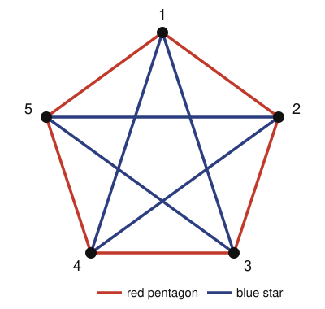

# Graph Theory · Lesson 5.3: Extremal graphs & Ramsey theory

> ⏱ ~15 min · Module 5: Spectral & extremal — a taste · Builds on: [Lesson 1.1](01-01-degree-and-handshake-lemma.md) (counting & pigeonhole), [Lesson 2.4](02-04-konig-covers.md) (independent sets) · Unlocks: course complete — the "how fast" sequel lives in the CS `algorithms` track

## Why this matters

Every theorem so far answered "given this graph, what's true of it?" This last lesson flips the question: **how much structure is forced on you, whether you want it or not?** Two answers, two flavors of inevitability. *Extremal* theory says: pack in enough edges and a triangle must appear — you can't stay sparse of structure past a hard threshold. *Ramsey* theory says: make the graph big enough and order appears out of pure chaos — any 2-coloring of a large enough complete graph hides a monochromatic clique. This is the mathematics behind "complete disorder is impossible," and it closes your Dangerous Checklist: after this you can bound a Turán-type edge count and pin down a small Ramsey number.

## The idea

Start with a game. You want to draw as many edges as possible on $n$ vertices **without ever forming a triangle**. How greedy can you be? The winning move is to split the vertices into two teams and join *every* cross-team pair, but *never* a same-team pair. No triangle can form — a triangle needs three mutually joined vertices, but any three vertices put two on the same team, and those two aren't joined. Split as evenly as you can and you get $\lfloor n^2/4 \rfloor$ edges. **Mantel's theorem** says you can't beat that: the balanced complete bipartite graph is the unique champion, and one more edge anywhere forces a triangle.

Now the second game, and it feels like magic. Color the edges of a complete graph with two crayons, red and blue, any way you like — you're *trying to avoid* a solid-color triangle. On $5$ vertices you can dodge it. On $6$ you cannot, no matter how cleverly you color. Somewhere in every 2-coloring of $K_6$ sits a red triangle or a blue triangle. That threshold, $6$, is the **Ramsey number** $R(3,3)$, and the proof is nothing but pigeonhole.

## The formal version

### Mantel and Turán: density forces a clique

**Mantel's Theorem.** A triangle-free (simple) graph on $n$ vertices has at most $\left\lfloor n^2/4 \right\rfloor$ edges. Equality holds only for the balanced complete bipartite graph $K_{\lfloor n/2\rfloor,\,\lceil n/2\rceil}$.

*In words:* once you pass $n^2/4$ edges, a triangle is unavoidable — and the densest triangle-free graph is the even two-team split.

*Proof (degree argument on an edge + Cauchy–Schwarz).* Let $G$ be triangle-free with $m$ edges, and write $\deg(v)$ for the degree of vertex $v$. Take any edge $uv$. Because $G$ has no triangle, $u$ and $v$ share **no** common neighbor — a common neighbor $w$ would complete a triangle $uvw$. So the neighborhoods of $u$ and $v$ are disjoint, and both sit inside the $n$ vertices, giving
$$\deg(u) + \deg(v) \le n \qquad \text{for every edge } uv.$$
Sum this inequality over all $m$ edges. On the left, each vertex $v$ appears once for each edge touching it, i.e. $\deg(v)$ times, contributing $\deg(v)\cdot\deg(v)$:
$$\sum_{uv \in E}\big(\deg(u)+\deg(v)\big) = \sum_{v}\deg(v)^2 \;\le\; m\,n.$$
By Cauchy–Schwarz (the power-mean inequality), $\sum_v \deg(v)^2 \ge \dfrac{\left(\sum_v \deg(v)\right)^2}{n}$, and by the handshake lemma $\sum_v \deg(v) = 2m$. Chaining:
$$\frac{(2m)^2}{n} \;\le\; \sum_v \deg(v)^2 \;\le\; mn \quad\Longrightarrow\quad \frac{4m^2}{n} \le mn \quad\Longrightarrow\quad m \le \frac{n^2}{4}.$$
Since $m$ is an integer, $m \le \lfloor n^2/4\rfloor$. $\blacksquare$

**Turán's Theorem (the generalization).** For $r \ge 2$, a graph on $n$ vertices with no complete subgraph $K_{r+1}$ has at most
$$\left(1 - \frac{1}{r}\right)\frac{n^2}{2}$$
edges, with equality exactly for the **Turán graph** $T(n,r)$ — the complete $r$-partite graph whose $r$ parts are as equal in size as possible.

*In words:* to avoid an $(r{+}1)$-clique, the best you can do is split into $r$ near-equal teams and join every cross-team pair. Mantel is the case $r = 2$ (no $K_3$): the bound becomes $\left(1-\tfrac12\right)\tfrac{n^2}{2} = \tfrac{n^2}{4}$, and $T(n,2)$ is the balanced complete bipartite graph.

### Ramsey: size forces monochromatic order

**Definition (Ramsey number).** $R(s,t)$ is the smallest integer $N$ such that **every** red/blue coloring of the edges of the complete graph $K_N$ contains a red $K_s$ (a set of $s$ vertices all joined in red) or a blue $K_t$.

*In words:* $R(s,t)$ is the group size past which you're guaranteed $s$ mutual friends or $t$ mutual strangers, however the relationships fall.

**Theorem.** $R(3,3) = 6$.

*In words:* six is the smallest number of people among whom you must find three mutual acquaintances or three mutual strangers; with five, some arrangement dodges both.

*Proof.* Two halves: $K_6$ always works ($R(3,3)\le 6$), and some coloring of $K_5$ fails ($R(3,3) > 5$).

**Upper bound ($\le 6$).** Take any red/blue coloring of $K_6$ and fix one vertex $v$. It has $5$ incident edges, each red or blue. By pigeonhole, some color owns at least $\lceil 5/2\rceil = 3$ of them; say $v$ is joined in **red** to three vertices $a, b, c$. Now look at the triangle among $a,b,c$:
- If **any** of the edges $ab$, $bc$, $ca$ is red — say $ab$ — then $v, a, b$ form an all-red triangle (edges $va$, $vb$, $ab$ all red). Done.
- Otherwise all three edges $ab, bc, ca$ are **blue**, and $a, b, c$ themselves form an all-blue triangle. Done.

Either way a monochromatic triangle exists. $\blacksquare$

**Lower bound ($> 5$).** We need one coloring of $K_5$ with no monochromatic triangle. Color the edges of a $5$-cycle $1\text{–}2\text{–}3\text{–}4\text{–}5\text{–}1$ **red**, and the remaining five edges — the "pentagram" $1\text{–}3\text{–}5\text{–}2\text{–}4\text{–}1$ — **blue**. Each color class is itself a $5$-cycle $C_5$, and a $5$-cycle contains no triangle (its shortest cycle has length $5$). So neither color hides a triangle. Hence $K_5$ admits a triangle-free-per-color coloring, and $R(3,3) > 5$.

Combining, $R(3,3) = 6$. $\blacksquare$

**Ramsey's Theorem (general).** $R(s,t)$ is *finite* for all $s, t$ — a monochromatic clique of the demanded size is always forced once $N$ is large enough. But the numbers explode and are mostly unknown: $R(4,4)=18$, yet $R(5,5)$ is only pinned between $43$ and $48$. The bounds grow at least exponentially, which is why "just compute it" is hopeless past tiny cases.

## Picture

The $K_5$ coloring that beats $R(3,3)$: a **red pentagon** (outer $5$-cycle) and a **blue star** (the pentagram of the other five edges). Together they use all $\binom{5}{2}=10$ edges exactly once. Each color is a $C_5$, and $C_5$ has no triangle — so there is no monochromatic triangle anywhere.

Trace it: any triangle in $K_5$ needs $3$ of these $5$ vertices, and you can check every such triple uses at least one red and one blue edge — the two color classes are exactly the two "rotational" $5$-cycles, and neither closes up a $3$-cycle.

## Worked examples

**Example 1 (Mantel, mechanically).** What is the most edges a triangle-free graph on $n = 8$ vertices can have, and which graph achieves it? Mantel gives $\lfloor 8^2/4\rfloor = \lfloor 64/4\rfloor = 16$. The champion is the balanced complete bipartite graph $K_{4,4}$: split $8$ vertices $4$–$4$ and join every cross pair, for $4\times 4 = 16$ edges. It's triangle-free because any three vertices land two on one side, and same-side vertices are non-adjacent. Add even one more edge — necessarily inside a team — and its two endpoints, plus any vertex on the *other* team joined to both, close a triangle.

**Example 2 (Turán, why you'd care — a scheduling bound).** Six wireless nodes must be paired by direct links, but hardware forbids any set of **four** mutually-linked nodes ($K_4$ would overload a channel). What's the maximum number of links? This is the no-$K_4$ case, $r = 3$, $n = 6$:
$$\left(1-\tfrac13\right)\frac{6^2}{2} = \tfrac23\cdot 18 = 12 \text{ links.}$$
The optimum is the Turán graph $T(6,3) = K_{2,2,2}$: three pairs, every node linked to the four nodes *outside* its pair. No four nodes can be mutually linked, since any four include two from the same pair, and those two aren't linked. (Cross-check: $\binom{6}{2} = 15$ total pairs minus $3$ within-pair non-edges $= 12$. ✓) Extremal graph theory turns "how much can I build before a forbidden pattern appears?" into a clean arithmetic bound.

## Watch out

- You might think Mantel says "$n^2/4$ edges *guarantees* a triangle," but it's the other way: **more than** $\lfloor n^2/4\rfloor$ forces one. Exactly $\lfloor n^2/4\rfloor$ edges can still be triangle-free (the balanced $K_{\lfloor n/2\rfloor,\lceil n/2\rceil}$ sits right at the bound). The threshold is a ceiling you're allowed to touch, not to cross.
- You might think $R(3,3) = 6$ means "$6$ people always contain $3$ mutual friends," but the guarantee is $3$ mutual friends **or** $3$ mutual strangers — a red $K_3$ *or* a blue $K_3$. Dropping the "or" (the other color) breaks the theorem: $6$ mutual strangers have no mutual-friend triple at all.
- You might think a mono-triangle-free coloring of $K_5$ is a lucky one-off — but it's structural: it exists *because* $5$ edges split into two triangle-free $5$-cycles. The moment you go to $K_6$ ($5$ edges at each vertex, an odd number), pigeonhole forces a $3$-to-$1$ majority color at every vertex, and the argument bites.

## One-liner

> Density past $n^2/4$ forces a triangle (Mantel/Turán), and size past $5$ forces a monochromatic one ($R(3,3)=6$) — structure is inevitable once you're dense enough or big enough.

## Problems

**P1 (🟢)** (a) Using Mantel's theorem, find the maximum number of edges in a triangle-free graph on $n = 11$ vertices, and name the graph that achieves it. (b) Using Turán's theorem, find the maximum number of edges in a graph on $n = 9$ vertices with no $K_4$, and name the extremal graph.

**P2 (🟡)** Prove that $R(2, t) = t$ for every $t \ge 2$. (That is: in any red/blue coloring of $K_t$ there is a red edge — a red $K_2$ — or an all-blue $K_t$; and some coloring of $K_{t-1}$ has neither.)

**P3 (🔴, optional)** Prove that *every* red/blue coloring of $K_6$ contains **at least two** monochromatic triangles. *(Hint: call a vertex-pair-of-edges at a vertex $v$ a "cherry" if the two edges have different colors. Count cherries two ways: at vertex $v$ with $r$ red and $b = 5 - r$ blue edges there are $rb$ cherries, and every non-monochromatic triangle contains exactly $2$ cherries.)*

Solutions

**P1** (a) $\lfloor 11^2/4\rfloor = \lfloor 121/4\rfloor = \lfloor 30.25\rfloor = 30$. Achieved by the balanced complete bipartite graph $K_{5,6}$ (split $11$ as $5$ and $6$; edges $= 5\times 6 = 30$), which is triangle-free.

(b) No $K_4$ means $r = 3$. The bound is $\left(1-\tfrac13\right)\tfrac{9^2}{2} = \tfrac23\cdot\tfrac{81}{2} = \tfrac{81}{3} = 27$ edges. The extremal graph is the Turán graph $T(9,3) = K_{3,3,3}$: three parts of size $3$, every cross-part pair joined. Check: $\binom{9}{2} = 36$ pairs minus $3\cdot\binom{3}{2} = 3\cdot 3 = 9$ within-part non-edges $= 27$. ✓

**P2** *Upper bound $R(2,t) \le t$:* take any red/blue coloring of $K_t$. Either at least one edge is red — that single red edge is a red $K_2$ — or no edge is red, meaning every edge is blue, and then all $t$ vertices form an all-blue $K_t$. Either way the demanded monochromatic clique appears, so $t$ vertices always suffice.

*Lower bound $R(2,t) > t-1$:* color **every** edge of $K_{t-1}$ blue. There is no red edge (so no red $K_2$), and a blue $K_t$ would need $t$ vertices, but only $t-1$ exist. So this coloring has neither — $t-1$ vertices are not enough.

Together, the smallest sufficient $N$ is exactly $t$, i.e. $R(2,t) = t$. $\blacksquare$

**P3** Call a *cherry* a pair of edges meeting at a common vertex whose two colors differ (one red, one blue). Count all cherries in the coloring two ways.

*By vertices.* At a vertex $v$, suppose $r$ of its $5$ incident edges are red and $b = 5 - r$ are blue. A cherry at $v$ picks one red and one blue edge, so there are $rb$ cherries at $v$. The product $rb$ with $r + b = 5$ is maximized at $\{r,b\} = \{2,3\}$, giving $rb \le 2\cdot 3 = 6$. Summing over all $6$ vertices, the total number of cherries is
$$C = \sum_v r_v b_v \le 6 \cdot 6 = 36.$$

*By triangles.* Classify each of the $\binom{6}{3} = 20$ triangles. A **monochromatic** triangle (all three edges one color) has $0$ cherries — at every vertex both its edges match. A **non-monochromatic** triangle has its three edges split $2$–$1$ by color, so exactly two of its vertices sit where the two incident (triangle) edges differ: exactly $2$ cherries per non-mono triangle. Hence if $M$ triangles are monochromatic and $20 - M$ are not,
$$C = 2\,(20 - M).$$

Combine: $2(20 - M) = C \le 36$, so $20 - M \le 18$, giving $M \ge 2$. Every 2-coloring of $K_6$ has at least two monochromatic triangles. $\blacksquare$

*(Remark: two is tight — colorings achieving exactly two exist, and this refines the mere existence proved in the lesson.)*

## Flashback

**From Lesson 1.1 (Degree & the handshake lemma):** A regional league has $15$ teams. The organizers want a season where **every team plays exactly $7$ distinct opponents** (each such pairing once). Prove no such schedule exists.

Solution

Model teams as vertices and "played each other this season" as edges; then "plays exactly $7$ opponents" means every vertex has degree $7$. The handshake lemma requires
$$\sum_{v}\deg(v) = 2|E|,$$
an even number. But here $\sum_v \deg(v) = 15 \times 7 = 105$, which is **odd** — it cannot equal $2|E|$. So the schedule is impossible. (Equivalently: all $15$ vertices would have odd degree $7$, but the number of odd-degree vertices must be even, and $15$ is odd.) $\blacksquare$

## Connections

- **Backward:** the $R(3,3)\le 6$ proof is pure **pigeonhole** — "$5$ edges, two colors, so $3$ share a color" — the same counting reflex from [Lesson 1.1](01-01-degree-and-handshake-lemma.md), and a *blue triangle* is a size-$3$ **independent set** in the red graph, the notion from [Lesson 2.4](02-04-konig-covers.md). Mantel's proof leans on the handshake lemma ($\sum\deg = 2m$) once more.
- **Forward:** nothing in this course — **you've finished Graph Theory.** The full Dangerous Checklist is now covered, including the final "estimate a Turán bound and a small Ramsey number." The natural sequel is the *how fast* question — algorithms and complexity for the matchings, flows, and colorings you learned to reason about — which lives in the CS `algorithms` track.
- **Sideways (combinatorics & probability):** Ramsey theory is the birthplace of the **probabilistic method** — coloring $K_n$ at random shows a monochromatic $K_s$ can be avoided up to exponentially large $n$, giving the standard lower bound on $R(s,s)$. That bridge (random colorings ↔ existence proofs) is a centerpiece of `combinatorics` and `probability-theory`; the same "count the bad configurations" idea powering P3 is its combinatorial half.
