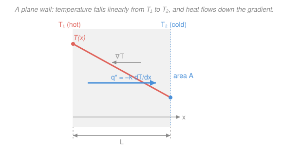

# Heat Transfer · Lesson 1.1: The three modes and Fourier's law

> ⏱ ~15 min · Module 1: Conduction and thermal resistance · Builds on: [`engineering-thermodynamics` 1.5 (Work and heat)](../../engineering-thermodynamics/lessons/01-05-work-and-heat.md) · Unlocks: [1.2 The heat equation](01-02-heat-equation.md)

## Why this matters

Thermodynamics told you *whether* heat flows (from hot to cold) and *how much* energy is available. It never told you **how fast**. But "how fast" is the entire engineering question: a coffee cup and a nuclear reactor both obey the first law, yet one cools in minutes and the other must never overheat. The rate of heat flow sets the size of a heat sink, the thickness of insulation, the temperature a turbine blade survives at. This course is thermodynamics' missing verb — *transfer* — and it starts with the one law that governs heat moving through solid matter.

## The idea

Heat moves in exactly three ways, and it helps to picture each as a different kind of "carrier":

- **Conduction** — heat diffusing through *stationary* matter. Jiggling atoms bump their neighbors; energy walks down the material without the material going anywhere. This is the hot end of a spoon warming your fingers, or heat creeping through a wall. Needs a medium; no bulk motion.
- **Convection** — conduction into a *moving* fluid that then carries the energy away bodily. Blow on hot soup and it cools faster: the same molecular hand-off, but now a current sweeps the warmed fluid off and brings cold fluid back. Needs a moving fluid.
- **Radiation** — energy leaving a surface as *electromagnetic waves*, no carrier at all. The sun warms you across empty space; a campfire warms your face before the air does. Needs no medium, and it's the only mode that works in vacuum.

Rough rule of thumb for which dominates: **conduction** rules inside solids; **convection** rules at any solid–fluid boundary with flow (it usually swamps conduction into still air); **radiation** is small near room temperature but grows ferociously with temperature ($\propto T^4$) and takes over when things get hot or when there's no fluid to convect into (space, vacuum flasks).

The rest of this lesson makes the first mode quantitative. The insight is almost obvious once stated: heat flows *faster* when the temperature drops *more steeply*. Squeeze the same 80-degree drop into a thin wall and heat pours through; spread it over a thick wall and it trickles. The rate is proportional to the **steepness of the temperature profile** — its gradient.

## The formal version

**Fourier's law (1-D).** For heat conducting along one direction $x$ through a material,

$$q'' = -k\,\frac{dT}{dx}.$$

*In words: the heat flux equals the thermal conductivity times how fast temperature falls with distance, and it flows toward lower temperature.* Symbol by symbol:

- $q''$ = **heat flux**, the heat rate *per unit area*, in watts per square meter ($\mathrm{W/m^2}$). (The double prime is the standard flag for "per unit area"; a single prime would be per unit length.)
- $k$ = **thermal conductivity**, a material property, in watts per meter-kelvin ($\mathrm{W/(m\cdot K)}$). Big $k$ = easy conductor.
- $dT/dx$ = the **temperature gradient**, in kelvin per meter ($\mathrm{K/m}$) — the slope of the temperature-vs-position curve.
- The **minus sign** encodes the second law: heat flows *down* the temperature gradient (toward cold). If $T$ decreases as $x$ increases, then $dT/dx < 0$, and the minus sign makes $q'' > 0$ — flux points in the $+x$ direction, toward the cold side. Drop the sign and you'd have heat spontaneously climbing uphill.

**Vector form (3-D).** In general temperature varies in all directions and heat is a vector:

$$\mathbf{q''} = -k\,\nabla T.$$

*In words: heat flows in the direction of steepest temperature descent, at a rate set by how steep that descent is.* The gradient $\nabla T = (\partial T/\partial x,\ \partial T/\partial y,\ \partial T/\partial z)$ points *uphill* (toward hot); the minus sign turns the flux downhill (toward cold). Flux is always **perpendicular to isotherms** (surfaces of constant temperature), the fastest way down.

**From flux to rate.** Flux is per unit area; to get the total heat rate $q$ (in watts, W) through an area $A$ (in $\mathrm{m^2}$) where the flux is uniform,

$$q = q''\,A.$$

For the special case of a **plane wall** with faces held at $T_1 > T_2$ a distance $L$ apart, the steady temperature profile is a straight line, so the gradient is just the constant slope $dT/dx = -(T_1 - T_2)/L$, and Fourier's law collapses to

$$q'' = k\,\frac{T_1 - T_2}{L}, \qquad q = kA\,\frac{T_1 - T_2}{L}.$$

*In words: flux through a wall is conductivity times the temperature drop divided by the thickness.* (Why the profile is exactly linear is Lesson [1.2](01-02-heat-equation.md)'s job — for now take it as given for a wall with no internal heating.)

**The range of $k$ is enormous** — roughly five orders of magnitude across everyday materials, which is *why* material choice matters so much:

| Material (≈300 K) | $k$ (W/(m·K)) | Kind |
|---|---|---|
| Copper | ~400 | metal (excellent conductor) |
| Aluminum | ~237 | metal |
| Stainless steel | ~15 | metal (poor, for a metal) |
| Firebrick | ~1.4 | ceramic |
| Water | ~0.6 | liquid |
| Glass wool / insulation | ~0.04 | insulator |
| Air (still) | ~0.026 | gas |

*(Representative values, Incropera tables.)* Metals conduct well because free electrons carry heat as well as charge; gases conduct poorly because their molecules are far apart — which is exactly why trapped-air insulation (foam, wool, double glazing) works.

**The other two modes — a preview.** Each mode gets its own flux law; we quote them now and treat them fully later.

- **Convection — Newton's law of cooling:** $\ q'' = h\,(T_s - T_\infty)$. Flux off a surface at temperature $T_s$ into a fluid at bulk temperature $T_\infty$ is proportional to their difference, with $h$ the **convection coefficient** ($\mathrm{W/(m^2\cdot K)}$) — a property of the *flow*, not just the fluid. (Full treatment: Module 3.)
- **Radiation — Stefan–Boltzmann:** $\ q'' = \varepsilon\,\sigma\,T_s^4$. A surface radiates in proportion to the *fourth power* of its **absolute** temperature (in kelvin, always), where $\varepsilon$ is the **emissivity** ($0 \le \varepsilon \le 1$, how "black" the surface is) and $\sigma = 5.67\times10^{-8}\ \mathrm{W/(m^2\cdot K^4)}$ is the Stefan–Boltzmann constant. That fourth power is why radiation is negligible in a fridge and dominant in a furnace. (Full treatment: Module 4.)

## Picture

## Worked examples

**Example 1 (conduction through a wall — the definition in action).** A firebrick wall is $L = 0.1\ \mathrm{m}$ thick with conductivity $k = 1.4\ \mathrm{W/(m\cdot K)}$. Its inner face is at $100\,^\circ\mathrm{C}$ and its outer face at $20\,^\circ\mathrm{C}$. Find the heat flux through it.

The profile in a plain wall is linear, so use $q'' = k(T_1 - T_2)/L$. The temperature *difference* is the same in $^\circ\mathrm{C}$ or K (a difference of 80 degrees is 80 kelvin either way — you only need absolute temperature for *radiation*):

$$q'' = k\,\frac{T_1 - T_2}{L} = 1.4 \times \frac{100 - 20}{0.1} = 1.4 \times \frac{80}{0.1} = 1.4 \times 800 = 1120\ \mathrm{W/m^2}.$$

Over a wall of area $A = 5\ \mathrm{m^2}$, the total rate would be $q = q''A = 1120 \times 5 = 5600\ \mathrm{W}$.

*Check.* Units: $\mathrm{\tfrac{W}{m\cdot K}\cdot\tfrac{K}{m}} = \mathrm{W/m^2}$ ✓. Sanity: firebrick is a modest conductor and the wall is thin, so a kilowatt-per-square-meter-scale flux for an 80-degree drop is reasonable; double the thickness and the flux would halve.

**Example 2 (mode comparison — when does radiation matter?).** A hot plate surface sits at $T_s = 400\ \mathrm{K}$ (127 °C) in a room where both the air and the surrounding walls are at $T_\infty = T_{sur} = 300\ \mathrm{K}$ (27 °C). Its emissivity is $\varepsilon = 0.8$, and natural-convection gives $h = 10\ \mathrm{W/(m^2\cdot K)}$. Which mode carries more heat off the plate?

*Convective flux* (Newton's law of cooling):

$$q''_{conv} = h\,(T_s - T_\infty) = 10 \times (400 - 300) = 10 \times 100 = 1000\ \mathrm{W/m^2}.$$

*Radiative flux.* A surface at $T_s$ facing large surroundings at $T_{sur}$ emits $\varepsilon\sigma T_s^4$ and absorbs $\varepsilon\sigma T_{sur}^4$ back, so the **net** radiative flux is the difference (this net form is Module 4's result; the plate both emits and receives):

$$q''_{rad} = \varepsilon\sigma\,(T_s^4 - T_{sur}^4) = 0.8 \times 5.67\times10^{-8} \times (400^4 - 300^4).$$

Compute the fourth powers: $400^4 = 2.56\times10^{10}$ and $300^4 = 8.1\times10^{9}$, so $400^4 - 300^4 = 1.75\times10^{10}\ \mathrm{K^4}$. Then

$$q''_{rad} = 0.8 \times 5.67\times10^{-8} \times 1.75\times10^{10} \approx 794\ \mathrm{W/m^2}.$$

So convection ($1000\ \mathrm{W/m^2}$) slightly beats radiation ($\approx 794\ \mathrm{W/m^2}$) here — but they're the *same order of magnitude*. Ignore radiation and you'd underestimate the plate's cooling by nearly half. Push the plate to 700 K and the $T^4$ term explodes ($700^4 - 300^4 \approx 2.3\times10^{11}$), radiation dwarfs convection, and any calculation that dropped it would be badly wrong.

*Check.* Units of radiation: $\mathrm{\tfrac{W}{m^2 K^4}\cdot K^4} = \mathrm{W/m^2}$ ✓ — and note we used **absolute** temperatures in kelvin, non-negotiable for the fourth-power law. Sanity: near room temperature radiation is comparable to modest convection but not overwhelming; its dominance is a *high-temperature* phenomenon, exactly as the "which mode wins" rule of thumb claimed.

## Watch out

- **You might think a bigger temperature *difference* means more radiation.** For conduction and convection, yes — flux is linear in $\Delta T$. But radiation depends on $T^4$ of each surface *separately* ($T_s^4 - T_{sur}^4$), not on $\Delta T$ alone. The same 100 K gap gives far more net radiation at 700 K than at 400 K, because the absolute temperatures are higher. Always carry absolute (kelvin) temperatures into Stefan–Boltzmann.
- **You might drop the minus sign in Fourier's law because "flux is obviously positive."** The sign is what makes heat flow toward *cold*. Keep it, let $dT/dx$ carry its own sign, and the direction takes care of itself. Only in a shortcut like $q'' = k(T_1-T_2)/L$ — where you've already written the *hot* temperature first — does the minus disappear into the ordering.
- **You might think convection is a fourth, separate physics.** At the surface itself, convection *is* conduction — heat still crosses the stationary fluid film touching the wall by molecular diffusion. What "convection" adds is bulk fluid motion that sweeps that heat away and keeps the near-wall gradient steep. The coefficient $h$ is just bookkeeping that hides a messy boundary-layer conduction problem inside one number (Module 3 opens the box).

## One-liner

> Thermodynamics says how much; heat transfer says how fast — and for conduction the answer is Fourier's law, $q'' = -k\,dT/dx$: flux is conductivity times temperature slope, always pointing downhill toward cold.

## Problems

**P1 (🟢)** A pane of window glass is $L = 6\ \mathrm{mm}$ thick with $k = 1.4\ \mathrm{W/(m\cdot K)}$ and area $A = 2\ \mathrm{m^2}$. Its inner surface is at $18\,^\circ\mathrm{C}$ and its outer surface at $6\,^\circ\mathrm{C}$. Find the heat flux $q''$ and the total heat rate $q$ through the pane.

**P2 (🟡)** Two walls have the *same* faces temperatures ($T_1 = 200\,^\circ\mathrm{C}$, $T_2 = 25\,^\circ\mathrm{C}$) and the same thickness $L = 5\ \mathrm{cm}$: one is copper ($k = 400$), one is glass wool ($k = 0.04$). By what factor do their heat fluxes differ, and which way? What does this say about why insulation is made of trapped air rather than metal?

**P3 (🔴)** A spacecraft radiator panel at $T_s = 320\ \mathrm{K}$ with emissivity $\varepsilon = 0.9$ sits in the vacuum of space, radiating to the deep-sky background at essentially $T_{sur} \approx 3\ \mathrm{K}$. There is no fluid, so no convection. Estimate the net radiative flux the panel rejects. Then explain in one sentence why a spacecraft can *only* dump waste heat this way.

Solutions

**P1** Linear profile in a plane wall, so $q'' = k(T_1 - T_2)/L$ with $L = 6\ \mathrm{mm} = 0.006\ \mathrm{m}$:

$$q'' = 1.4 \times \frac{18 - 6}{0.006} = 1.4 \times \frac{12}{0.006} = 1.4 \times 2000 = 2800\ \mathrm{W/m^2}.$$

Total rate: $q = q''A = 2800 \times 2 = 5600\ \mathrm{W}$.

*Check.* Units: $\mathrm{\tfrac{W}{m\cdot K}\cdot\tfrac{K}{m}} = \mathrm{W/m^2}$, then $\times\,\mathrm{m^2} = \mathrm{W}$ ✓. Sanity: a bare single pane leaks a lot of heat — 5.6 kW through 2 m² is why single glazing is a thermal disaster and why the real drop happens in the still-air films on each side, not the glass. (Convert mm to m before dividing — the commonest slip here.)

**P2** Same $\Delta T$ and same $L$, so the fluxes are in direct proportion to $k$:

$$\frac{q''_{Cu}}{q''_{wool}} = \frac{k_{Cu}}{k_{wool}} = \frac{400}{0.04} = 10{,}000.$$

Copper conducts **10,000 times** more flux than glass wool for the identical temperature drop. Insulation's whole job is to *resist* heat flow, i.e. to have tiny $k$; gases conduct poorly because their molecules are sparse, so trapping still air (in foam, wool, or a double-glazed gap) gives a near-minimum $k$. A metal, however strong or cheap, would short-circuit the heat straight through.

*Check.* The ratio is dimensionless (W/m² over W/m²) ✓, and it equals the $k$ ratio exactly because every other factor canceled — the cleanest way to see that $k$ alone ranks materials as conductors.

**P3** No convection in vacuum, so the panel rejects heat purely by radiation. Net flux to cold surroundings:

$$q''_{rad} = \varepsilon\sigma\,(T_s^4 - T_{sur}^4) = 0.9 \times 5.67\times10^{-8} \times (320^4 - 3^4).$$

Here $320^4 = 1.049\times10^{10}$ and $3^4 = 81$ is utterly negligible, so $T_s^4 - T_{sur}^4 \approx 1.049\times10^{10}\ \mathrm{K^4}$:

$$q''_{rad} \approx 0.9 \times 5.67\times10^{-8} \times 1.049\times10^{10} \approx 535\ \mathrm{W/m^2}.$$

Why radiation only: heat transfer needs a carrier — matter for conduction, a moving fluid for convection — and space has neither. Electromagnetic radiation is the one mode that crosses vacuum, so a spacecraft's *sole* way to shed waste heat is to radiate it away (which is why radiator panels are large, and painted for high emissivity).

*Check.* Units: $\mathrm{\tfrac{W}{m^2 K^4}\cdot K^4} = \mathrm{W/m^2}$ ✓, absolute temperatures used ✓. Sanity: the $3\ \mathrm{K}$ background is thermally irrelevant against a $320\ \mathrm{K}$ panel — dropping it changes the answer by under $10^{-8}$ — which is why "radiating to space" is effectively radiating to absolute zero.

## Connections

- **Backward:** [`engineering-thermodynamics` 1.5](../../engineering-thermodynamics/lessons/01-05-work-and-heat.md) defined heat as energy in transit driven by a temperature difference but treated it as a lump sum ($Q$, in joules) in an energy balance. This lesson supplies the *rate law* that thermodynamics left as a black box — $q$ in watts, the time derivative of that $Q$. The two meet in the steady-flow energy equation (SFEE): the convective rate a fluid stream carries, $\dot q = \dot m\,c_p\,\Delta T$, is exactly the boundary heat term in the first law you'll size with Newton's law of cooling later.
- **Forward:** [1.2 The heat equation](01-02-heat-equation.md) plugs Fourier's law into an energy balance on a control volume to derive the governing PDE $\rho c_p\,\partial_t T = \nabla\!\cdot(k\nabla T) + \dot q$ — and shows *why* the wall profile in Example 1 came out linear. From there Module 1 turns Fourier's law into thermal-resistance circuits ([1.4](01-04-thermal-resistance-networks.md)), and Modules 3–4 develop the convection ($h$) and radiation ($\varepsilon, \sigma$) laws we only previewed here.
- **Sideways:** Fourier's law is one member of a family of **gradient-driven transport laws** — heat flows down a temperature gradient just as mass diffuses down a concentration gradient (Fick's law) and momentum diffuses down a velocity gradient (Newton's viscosity law). The shared mathematical skeleton "flux $= -(\text{property}) \times (\text{gradient})$" is the reason conduction, diffusion, and viscous drag all obey the same-shaped equations, a unity you'll exploit repeatedly once the heat equation appears in [1.2](01-02-heat-equation.md).
