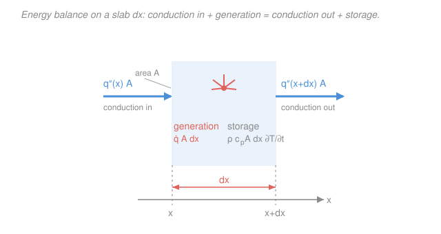

# Heat Transfer · Lesson 1.2: The heat equation

> ⏱ ~15 min · Module 1: Conduction · Builds on: [1.1 Three modes & Fourier's law](01-01-three-modes-fouriers-law.md), [`ode-refresher` (PDEs & boundary conditions)](../../ode-refresher/syllabus.md) · Unlocks: [1.3 1-D steady conduction](01-03-1d-steady-conduction.md), Module 2 (transient conduction)

## Why this matters

Fourier's law tells you the heat *flux* if you already know the temperature field. But that's the catch — usually you *don't* know it; the temperature at every point and every instant is exactly what you're trying to find. The **heat equation** is the master equation that produces it: a single PDE whose solution $T(x,y,z,t)$ governs every conduction problem in the rest of this course — a wall losing heat in winter, a quenched steel bar, a nuclear fuel pin, a CPU under load. Every later result (resistance networks, fins, lumped capacitance, Heisler charts) is a special case of this one equation with particular boundary conditions. Get the derivation once and you own the whole map.

## The idea

The heat equation is nothing more than **energy bookkeeping on a tiny box.** Zoom in on a sliver of material. Heat conducts *into* it from one side and *out* the other; maybe the material *generates* heat internally (a resistor, a reaction, a fissioning atom); and whatever doesn't leave must be *stored*, showing up as the box getting warmer. Written as a sentence:

> (heat conducted in) − (heat conducted out) + (heat generated) = (heat stored, i.e. temperature rising).

That's it. The only physics input is Fourier's law for the "in" and "out" fluxes. Everything else is accounting. The reason the result is a *differential* equation is that we let the box shrink to a point, so "in minus out" becomes a derivative of the flux — a second derivative of temperature.

One number falls out that's worth the price of admission: the **thermal diffusivity** $\alpha$. It answers "when I poke this material with heat, how fast does the disturbance spread?" — and it's why a metal spoon in soup scalds your hand in a minute while a wooden spoon never does.

## The formal version

Take a 1-D slab: a control volume of cross-sectional area $A$ (m²) and thickness $dx$ (m), sitting at position $x$. Track the four energy rates (all in watts, W).

**Conduction in and out.** By Fourier's law the flux is $q'' = -k\,\partial T/\partial x$ (W/m²), so the *rate* crossing a face of area $A$ is $q''A$. Net conduction *into* the box is what enters at $x$ minus what leaves at $x+dx$:

$$\dot E_{\text{cond}} = q''_x A - q''_{x+dx}A = -A\,\frac{\partial q''}{\partial x}\,dx = A\,\frac{\partial}{\partial x}\!\left(k\,\frac{\partial T}{\partial x}\right)dx.$$

*In words: the net conduction into the box is how fast the flux is changing across it* — the last step just substitutes $q''=-k\,\partial T/\partial x$.

**Generation.** If the material releases heat internally at a volumetric rate $\dot q$ (W/m³), the box makes $\dot E_{\text{gen}} = \dot q\,(A\,dx)$.

**Storage.** Storing energy means warming up. With density $\rho$ (kg/m³) and specific heat $c_p$ (J/kg·K), the box's energy rises at $\dot E_{\text{st}} = \rho c_p\,(A\,dx)\,\partial T/\partial t$.

Now enforce conservation, $\dot E_{\text{cond}} + \dot E_{\text{gen}} = \dot E_{\text{st}}$, and divide through by the volume $A\,dx$:

$$\boxed{\;\rho c_p\,\frac{\partial T}{\partial t} = \frac{\partial}{\partial x}\!\left(k\,\frac{\partial T}{\partial x}\right) + \dot q\;}$$

*In words: the rate a point stores heat equals the net conduction delivered to it plus what it generates.* In three dimensions the single conduction term becomes a divergence of the flux vector, giving the general heat equation:

$$\rho c_p\,\frac{\partial T}{\partial t} = \nabla\!\cdot(k\nabla T) + \dot q.$$

If $k$ is constant (doesn't vary with position or temperature), it slides out of the divergence, $\nabla\!\cdot(k\nabla T)=k\nabla^2 T$, and dividing by $\rho c_p$ gives the clean form:

$$\frac{\partial T}{\partial t} = \alpha\nabla^2 T + \frac{\dot q}{\rho c_p}, \qquad \boxed{\;\alpha \equiv \frac{k}{\rho c_p}\;}\ (\mathrm{m^2/s}).$$

*In words: temperature obeys a diffusion equation, and $\alpha$ is the diffusion rate.* Read the definition as a **ratio**: $k$ in the numerator is how readily the material *conducts* heat; $\rho c_p$ in the denominator is how much heat it must sock away to change temperature — its thermal inertia. A big $\alpha$ means "conducts eagerly, stores reluctantly," so a temperature disturbance races through. A metal has $\alpha \sim 10^{-4}\,\mathrm{m^2/s}$; a plastic or wood is near $10^{-7}$ — a thousandfold slower to respond, even though both eventually reach the same steady state.

**Boundary and initial conditions.** The PDE alone has infinitely many solutions; the physics of a *specific* problem is pinned down by conditions on the edges and (if transient) at the start. In time you need one **initial condition**, e.g. $T(x,0)=T_i$. In space, each boundary needs one condition, and they come in three flavors:

| Type | Physical meaning | Math form (surface normal $n$) |
|---|---|---|
| **Dirichlet** (1st kind) | surface held at a known temperature | $T_s = T_{\text{given}}$ |
| **Neumann** (2nd kind) | known flux; *insulated* is the special case | $-k\,\partial T/\partial n = q''_{\text{given}}$; insulated $\Rightarrow \partial T/\partial n = 0$ |
| **Robin** (3rd kind) | surface convects to a fluid | $-k\,\partial T/\partial n = h\,(T_s - T_\infty)$ |

*In words: you either fix the temperature, fix the heat flow, or let the surface trade heat with a fluid.* The Robin condition just says the conduction arriving at the surface from inside must equal the convection carried away, with $h$ (W/m²·K) the convection coefficient and $T_\infty$ the fluid temperature. **Steady state** drops the $\partial T/\partial t$ term (nothing stored); a **1-D** problem keeps only one spatial derivative. Almost everything in Module 1 lives at $\partial T/\partial t = 0$; Module 2 turns that term back on.

## Picture

## Worked examples

**Example 1 (specialize the master equation).** The power of one general PDE is that the problems you actually solve are just terms switched off. Start from the constant-$k$, 1-D form $\partial T/\partial t = \alpha\,\partial^2 T/\partial x^2 + \dot q/(\rho c_p)$.

*Steady, no generation.* Set $\partial T/\partial t = 0$ (nothing accumulating) and $\dot q = 0$:

$$0 = \alpha\,\frac{d^2T}{dx^2} \;\Longrightarrow\; \frac{d^2T}{dx^2}=0 \;\Longrightarrow\; T(x)=C_1 x + C_2.$$

The temperature profile is a straight line. That's not a new fact — it's exactly the linear profile behind the constant flux $q''=-k\,dT/dx = -kC_1$ we used in [1.1](01-01-three-modes-fouriers-law.md). The heat equation *derives* what Fourier's law assumed. (Lesson [1.3](01-03-1d-steady-conduction.md) does this properly with boundary conditions.)

*Transient, no generation.* Now keep time but still $\dot q=0$:

$$\frac{\partial T}{\partial t} = \alpha\,\frac{\partial^2 T}{\partial x^2}.$$

This is *the* diffusion equation — the same mathematical object that governs how a dye spreads in water or how contaminants diffuse in a solid. All of Module 2 is built on solving it. Two terms flipped on or off took us from a straight line to the richest problems in the course.

**Example 2 (why a metal spoon heats through and a wooden one doesn't).** Compute $\alpha$ for copper and for oak (properties at ~300 K, Incropera tables).

Copper: $k=401\ \mathrm{W/m\,K}$, $\rho=8933\ \mathrm{kg/m^3}$, $c_p=385\ \mathrm{J/kg\,K}$.

$$\alpha_{\text{Cu}}=\frac{k}{\rho c_p}=\frac{401}{8933\times385}=\frac{401}{3.44\times10^{6}}\approx 1.17\times10^{-4}\ \mathrm{m^2/s}.$$

Oak: $k=0.17\ \mathrm{W/m\,K}$, $\rho=545\ \mathrm{kg/m^3}$, $c_p=2385\ \mathrm{J/kg\,K}$.

$$\alpha_{\text{oak}}=\frac{0.17}{545\times2385}=\frac{0.17}{1.30\times10^{6}}\approx 1.31\times10^{-7}\ \mathrm{m^2/s}.$$

The ratio is $\alpha_{\text{Cu}}/\alpha_{\text{oak}} \approx 1.17\times10^{-4}/1.31\times10^{-7}\approx 890$ — copper spreads a temperature disturbance nearly **900 times faster.** To make that concrete, the time for heat to penetrate a distance $L$ scales as $t\sim L^2/\alpha$ (this comes straight from the diffusion equation — more in [2.2](02-02-semi-infinite-solid.md)). Across a $10\ \mathrm{cm}$ spoon handle, $L=0.1\ \mathrm{m}$:

$$t_{\text{Cu}}\sim\frac{(0.1)^2}{1.17\times10^{-4}}\approx 85\ \mathrm{s}, \qquad t_{\text{oak}}\sim\frac{(0.1)^2}{1.31\times10^{-7}}\approx 7.6\times10^{4}\ \mathrm{s}\approx 21\ \mathrm{h}.$$

The copper handle warms your fingers in a minute-and-a-half; the wooden one would need most of a day. Same soup, same Fourier's law — the difference is entirely $\alpha$. *Units check:* $\mathrm{(W/m\,K)/[(kg/m^3)(J/kg\,K)]}=\mathrm{(J/s\,m\,K)}\cdot\mathrm{m^3/(kg)}\cdot\mathrm{kg\,K/J}=\mathrm{m^2/s}$ ✓, and $L^2/\alpha=\mathrm{m^2/(m^2/s)}=\mathrm{s}$ ✓.

## Watch out

- **You might think $\alpha$ measures how good a conductor something is — but it's conduction *relative to storage*.** Water conducts far better than air, yet air actually has the *larger* $\alpha$, because water hoards so much heat per degree ($\rho c_p$). High $k$ and high $\alpha$ are different questions: $k$ sets the steady heat *rate*, $\alpha$ sets the *speed* of transients. A material can conduct well and still respond sluggishly.
- **You might read the heat equation as a law of physics — it's really conservation of energy.** The only physics smuggled in is Fourier's law, plugged in for the flux. That's why a bad Fourier's law (e.g. at nanoscale, or in a moving fluid) breaks the heat equation but not energy conservation.
- **You might pull $k$ out of the divergence automatically.** $\nabla\!\cdot(k\nabla T)=k\nabla^2 T$ *only* when $k$ is uniform. If conductivity varies with temperature or position (common in real materials and reactor fuel), you must keep it inside the derivative — otherwise you drop a real term.

## One-liner

> Energy in − out + generated = stored, shrunk to a point, is $\rho c_p\,\partial_t T=\nabla\!\cdot(k\nabla T)+\dot q$; with constant $k$ it's a diffusion equation whose rate is $\alpha=k/(\rho c_p)$.

## Problems

**P1 (🟢)** A long rod (treat as 1-D in $x$) sits at steady state with constant conductivity $k$ and uniform internal generation $\dot q$ (W/m³). Starting from the constant-$k$ heat equation, write the governing ODE for $T(x)$ and find its general solution. What shape is the temperature profile?

**P2 (🟡)** A surface temperature swing needs to be "felt" $5\ \mathrm{cm}$ deep. Estimate the time using $t\sim L^2/\alpha$ for (a) carbon steel, $\alpha=1.88\times10^{-5}\ \mathrm{m^2/s}$, and (b) concrete, $\alpha=5.7\times10^{-7}\ \mathrm{m^2/s}$. Interpret why a concrete wall buffers daily temperature swings better than a steel one.

**P3 (🔴)** A plane wall occupies $0\le x\le L$ and starts at uniform temperature $T_i$. For $t>0$ the left face ($x=0$) is held at $T_0$, and the right face ($x=L$) convects to a fluid at $T_\infty$ with coefficient $h$. Assume constant $k$, no generation. Write the complete mathematical statement: the PDE, the initial condition, and both boundary conditions (name each type). Then state how the right-face condition changes if that face were instead perfectly insulated.

Solutions

**P1** Steady $\Rightarrow \partial T/\partial t = 0$; keep generation. The constant-$k$, 1-D equation $\partial T/\partial t = \alpha\,\partial^2T/\partial x^2 + \dot q/(\rho c_p)$ becomes

$$0=\alpha\frac{d^2T}{dx^2}+\frac{\dot q}{\rho c_p}\;\Longrightarrow\;\frac{d^2T}{dx^2}=-\frac{\dot q}{k},$$

using $\alpha\rho c_p = k$. Integrate twice:

$$\frac{dT}{dx}=-\frac{\dot q}{k}x+C_1, \qquad T(x)=-\frac{\dot q}{2k}x^2+C_1 x+C_2.$$

The profile is a **parabola** (concave down for $\dot q>0$), not a straight line — generation makes the interior hotter than a linear interpolation of the edges, peaking where $dT/dx=0$. *Check:* set $\dot q=0$ and you recover $T=C_1x+C_2$, the no-generation straight line of Example 1 ✓. Units of $\dot q/k$: $\mathrm{(W/m^3)/(W/m\,K)}=\mathrm{K/m^2}$, matching $d^2T/dx^2$ ✓.

**P2** (a) Steel: $t\sim L^2/\alpha = (0.05)^2/(1.88\times10^{-5}) = 0.0025/1.88\times10^{-5}\approx 133\ \mathrm{s}$ (about 2 minutes).

(b) Concrete: $t\sim (0.05)^2/(5.7\times10^{-7}) = 0.0025/5.7\times10^{-7}\approx 4.4\times10^{3}\ \mathrm{s}\approx 73\ \mathrm{min}$.

Concrete's low $\alpha$ (big $\rho c_p$, small $k$) means a surface temperature change takes over an hour to reach 5 cm in, so a daily heating/cooling cycle is smeared out and heavily damped before it penetrates — that thermal inertia is exactly why massive masonry walls keep interiors stable. Steel, ~30× faster, transmits the swing almost immediately. *Check:* both times $=\mathrm{m^2/(m^2/s)}=\mathrm{s}$ ✓; the ratio $t_{\text{conc}}/t_{\text{steel}}=\alpha_{\text{steel}}/\alpha_{\text{conc}}\approx 33$ ✓.

**P3** Constant $k$, no generation, 1-D transient:

$$\text{PDE:}\quad \frac{\partial T}{\partial t}=\alpha\frac{\partial^2 T}{\partial x^2},\qquad 0<x<L,\ t>0.$$

$$\text{Initial condition:}\quad T(x,0)=T_i \quad (\text{all }x).$$

$$\text{BC at }x=0\ (\text{Dirichlet}):\quad T(0,t)=T_0.$$

At $x=L$ the outward normal points in $+x$, so conduction reaching the surface from inside equals the convection carried off:

$$\text{BC at }x=L\ (\text{Robin/convection}):\quad -k\,\frac{\partial T}{\partial x}\Big|_{x=L}=h\big(T(L,t)-T_\infty\big).$$

If instead the right face is perfectly insulated, no heat crosses it, so the flux there is zero — a Neumann condition:

$$-k\,\frac{\partial T}{\partial x}\Big|_{x=L}=0\;\Longrightarrow\;\frac{\partial T}{\partial x}\Big|_{x=L}=0.$$

*Check:* one IC (time is first-order) and one BC per boundary (space is second-order) — the count is right for a well-posed problem. The insulated case is the $h\to 0$ limit of the Robin condition ✓.

## Connections

- **Backward:** this generalizes [1.1](01-01-three-modes-fouriers-law.md) — Fourier's law is the flux input plugged into the energy balance, and Example 1 shows the lesson-1.1 linear profile is just the steady, no-generation corner of the full equation.
- **Forward:** [1.3](01-03-1d-steady-conduction.md) solves the steady version with real boundary conditions to build the thermal-resistance toolkit; Module 2 ([2.1 lumped capacitance](02-01-lumped-capacitance-biot.md), [2.2 semi-infinite solid](02-02-semi-infinite-solid.md)) turns the storage term back on and solves the transient diffusion equation.
- **Sideways:** the transient form $\partial_t T=\alpha\nabla^2 T$ is mathematically identical to **Fick's second law** of mass diffusion (concentration in place of temperature, mass diffusivity $D$ in place of $\alpha$) from materials science — solve one and you've solved the other. And the separation-of-variables / boundary-condition machinery it needs is exactly the PDE toolkit from [`ode-refresher`](../../ode-refresher/lessons/04-02-intro-pdes-separation.md); the Fourier-series solutions of Module 2's Heisler charts trace straight back to it.
