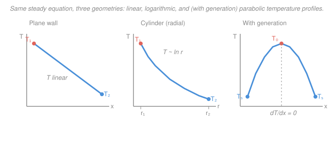

# Heat Transfer · Lesson 1.3: 1-D steady conduction

> ⏱ ~15 min · Module 1: Conduction and thermal resistance · Builds on: [1.2 The heat equation](01-02-heat-equation.md) · Unlocks: [1.4 Thermal-resistance networks](01-04-thermal-resistance-networks.md)

## Why this matters

Almost every conduction problem an engineer actually solves is this one: heat leaking straight through a furnace wall, radially out of a steam pipe or a coaxial cable, or out of a sphere of insulation around a cryogenic tank. In [1.2](01-02-heat-equation.md) you derived the full heat equation; here you throw away time and two of the three dimensions and are left with an ODE you can integrate by hand. The payoff is a set of closed-form temperature profiles — and, more usefully, closed-form **heat rates** — for the plane wall, the cylinder, and the sphere. Add a heat source inside the solid (electrical resistance, or fission in a nuclear fuel pin) and the same integration hands you the parabolic profile that sets the hottest temperature in a reactor. These three results are also the raw material for the thermal-resistance shortcut in [1.4](01-04-thermal-resistance-networks.md).

## The idea

Steady state means nothing is changing in time, so **energy in = energy out** for every slice of the solid. If there's no heat being generated inside, that forces a beautiful constraint: the total heat rate $q$ (watts) passing through any cross-section must be the *same* for every cross-section — heat can't pile up anywhere. Where that constant flows through a constant area (the plane wall), the *flux* is constant too, and constant flux down a constant conductivity means a **straight-line** temperature drop. That's the whole plane-wall story.

The cylinder and sphere are the same story with one twist: the area heat flows through **grows** as you move outward ($2\pi r L$ for a pipe, $4\pi r^2$ for a shell). The total rate $q$ is still constant, but to push it through an ever-larger area the *flux* must shrink, so the temperature gradient must shrink too — the profile starts steep near the inside and flattens out. Integrate that and you get a **logarithm** for the cylinder and a **$1/r$** curve for the sphere, instead of a straight line.

Now switch the source back on. If every cubic meter of the solid dumps out heat $\dot q$ (watts per cubic meter), then heat *does* accumulate as you move outward — each shell has to carry away everything generated inside it. The flux climbs steadily from zero at the center to a maximum at the surface, so the temperature profile isn't linear anymore: it **bows into a parabola** with its peak at the center, where by symmetry the gradient is zero. That peak is the number that keeps reactor engineers up at night.

## The formal version

Start from the steady heat equation with constant $k$ from [1.2](01-02-heat-equation.md), $\nabla^2 T + \dot q/k = 0$, and keep only one spatial coordinate.

**Plane wall (no generation).** With variation only in $x$ (meters) and $\dot q = 0$:

$$\frac{d^2 T}{dx^2} = 0 \quad\Longrightarrow\quad T(x) = T_1 + (T_2 - T_1)\frac{x}{L}.$$

*In words: a straight line from the hot face $T_1$ to the cold face $T_2$ across thickness $L$ (m).* The flux follows from Fourier's law $q'' = -k\,dT/dx$:

$$\boxed{\,q'' = \frac{k\,(T_1 - T_2)}{L}\,} \qquad \left[\mathrm{W/m^2}\right],$$

with $k$ the thermal conductivity (W/(m·K)) and $q''$ the heat flux. It is **constant** everywhere in the wall — same value at every $x$. The total rate through area $A$ (m²) is $q = q'' A$.

**Cylinder, radial (no generation).** In cylindrical coordinates with variation only in $r$:

$$\frac{1}{r}\frac{d}{dr}\!\left(r\,\frac{dT}{dr}\right) = 0.$$

Integrate twice: $r\,dT/dr = C_1$, so $T(r) = C_1 \ln r + C_2$. *In words: the temperature varies as the logarithm of radius, not linearly.* Fitting $T(r_1)=T_1$ and $T(r_2)=T_2$ and applying Fourier through the area $A = 2\pi r L$ (the notation $r_1, r_2$ are the inner and outer radii in m, $L$ the pipe length in m):

$$\boxed{\,q = \frac{2\pi k L\,(T_1 - T_2)}{\ln(r_2/r_1)}\,} \qquad [\mathrm{W}].$$

The **total rate $q$ is constant** (independent of $r$), but the flux $q'' = q/(2\pi r L)$ falls off as $1/r$.

**Sphere (no generation).** Same steps with $A = 4\pi r^2$ give $\dfrac{1}{r^2}\dfrac{d}{dr}\!\left(r^2\dfrac{dT}{dr}\right)=0$, so $T(r) = -C_1/r + C_2$ — a $1/r$ profile — and

$$\boxed{\,q = \frac{4\pi k\,(T_1 - T_2)}{\,1/r_1 - 1/r_2\,}\,} \qquad [\mathrm{W}].$$

**With uniform generation $\dot q$ (W/m³).** Now $\dfrac{d^2T}{dx^2} = -\dfrac{\dot q}{k}$ for a plane wall. Consider a slab of half-thickness $L$ cooled symmetrically to surface temperature $T_s$ on both faces, with the center at $x=0$. Symmetry gives the boundary condition $dT/dx = 0$ at the center. Integrating once, $dT/dx = -\dot q x / k$; integrating again and applying $T(\pm L)=T_s$:

$$T(x) = T_s + \frac{\dot q L^2}{2k}\left(1 - \frac{x^2}{L^2}\right), \qquad \boxed{\,T_0 - T_s = \frac{\dot q L^2}{2k}\,}$$

where $T_0$ is the centerline temperature. *In words: the profile is a parabola peaking at the center, and the center-to-surface rise scales with $\dot q$, with the square of the size, and inversely with conductivity.* The identical derivation in cylindrical coordinates (finite temperature at $r=0$ kills the log term) gives the **fuel-rod result**

$$\boxed{\,T_0 - T_s = \frac{\dot q\, r_o^2}{4k}\,}$$

for a solid cylinder of radius $r_o$ — the factor is $4k$ instead of $2k$. This one equation is the backbone of reactor thermal analysis: it sets the fuel centerline temperature against the melting limit.

## Picture

## Worked examples

**Example 1 (steam pipe — the log formula).** A steel pipe carries steam over a length $L = 1\ \mathrm{m}$. Inner radius $r_1 = 0.05\ \mathrm{m}$, outer $r_2 = 0.06\ \mathrm{m}$, conductivity $k = 15\ \mathrm{W/(m\,K)}$, inner-wall temperature $200\,^\circ\mathrm{C}$, outer-wall $185\,^\circ\mathrm{C}$. Find the radial heat loss.

$$q = \frac{2\pi k L\,(T_1 - T_2)}{\ln(r_2/r_1)} = \frac{2\pi (15)(1)(200 - 185)}{\ln(0.06/0.05)} = \frac{1413.7}{\ln 1.2} = \frac{1413.7}{0.1823} \approx 7.75\times 10^{3}\ \mathrm{W}.$$

So about **7.75 kW** leaks out per meter of pipe. Note the flux is *not* uniform: at the inner wall $q'' = q/(2\pi r_1 L) = 7754/(2\pi\cdot 0.05\cdot 1) \approx 2.47\times10^4\ \mathrm{W/m^2}$, but at the outer wall it is only $q/(2\pi r_2 L) \approx 2.06\times10^4\ \mathrm{W/m^2}$ — smaller by the factor $r_1/r_2 = 5/6$, exactly as the $1/r$ falloff predicts.

*Check.* Units: $\mathrm{(W/m\,K)\cdot m \cdot K} = \mathrm{W}$ (the log is dimensionless) ✓. Sanity: a thin wall ($r_2/r_1 \to 1$) would make $\ln(r_2/r_1)\to 0$ and $q\to\infty$ — a razor-thin wall offers almost no resistance, as it should.

**Example 2 (internal generation — centerline rise).** A solid cylindrical rod of radius $r_o = 5\ \mathrm{mm} = 0.005\ \mathrm{m}$ generates heat uniformly at $\dot q = 3.0\times10^{8}\ \mathrm{W/m^3}$ and has conductivity $k = 3\ \mathrm{W/(m\,K)}$ (a low value, typical of a ceramic like uranium dioxide). Its surface is held at $T_s = 400\,^\circ\mathrm{C}$. How hot is the center?

$$T_0 - T_s = \frac{\dot q\, r_o^2}{4k} = \frac{(3.0\times10^{8})(0.005)^2}{4(3)} = \frac{(3.0\times10^{8})(2.5\times10^{-5})}{12} = \frac{7500}{12} = 625\ \mathrm{K}.$$

The center sits $625\ \mathrm{K}$ above the surface, so $T_0 \approx 400 + 625 = 1025\,^\circ\mathrm{C}$. That enormous internal gradient — from a rod only a centimeter across — is exactly why a nuclear fuel pin runs with a glowing-hot core and a comparatively cool clad surface; the *same* $\dot q\, r_o^2/(4k)$ governs a current-carrying wire, only with $\dot q$ coming from $I^2R$ Joule heating instead of fission.

*Check.* Units: $\mathrm{(W/m^3)\cdot m^2 / (W/m\,K)} = \mathrm{K}$ ✓. Sanity: halving the radius would cut the rise by four ($r_o^2$), which is why fuel is drawn into thin pins — the only cheap way to keep the centerline below the melting point is to make the pin skinny.

## Watch out

- **You might think the heat flux $q''$ is constant in a pipe like it is in a plane wall.** Actually only the *total rate* $q$ (watts) is constant in the cylinder and sphere; the *flux* $q''$ (W/m²) drops as you move outward because the area $2\pi r L$ (or $4\pi r^2$) it spreads over keeps growing. In the plane wall the area is fixed, so there both $q$ and $q''$ are constant.
- **You might expect the temperature profile in a pipe wall to be a straight line.** It's a logarithm. It only *looks* straight when the wall is thin ($r_2/r_1$ near 1), because $\ln(1+\epsilon)\approx\epsilon$ — then the cylinder formula collapses back to the plane-wall one.
- **You might place the hottest point of a generating slab at its cooled surface.** With symmetric cooling the peak is at the **center**, where the symmetry condition $dT/dx=0$ holds. Heat generated in the core has to climb "uphill" out to both faces, so the core is the hottest place, not the coldest.

## One-liner

> With no source, steady 1-D conduction makes the *flux* (plane) or the *total rate* (cylinder, sphere) constant — giving linear, logarithmic, and $1/r$ profiles; switch on a uniform source $\dot q$ and the profile bows into a parabola peaking where $dT/dx=0$.

## Problems

**P1 (🟢)** A brick wall is $L = 0.15\ \mathrm{m}$ thick with $k = 0.72\ \mathrm{W/(m\,K)}$. The inner face is at $25\,^\circ\mathrm{C}$, the outer face at $5\,^\circ\mathrm{C}$. Find the heat flux $q''$ and the total heat rate through a $10\ \mathrm{m^2}$ section.

**P2 (🟡)** A hollow sphere of insulation has inner radius $r_1 = 0.05\ \mathrm{m}$, outer radius $r_2 = 0.10\ \mathrm{m}$, and $k = 1.5\ \mathrm{W/(m\,K)}$. The inner surface is at $100\,^\circ\mathrm{C}$ and the outer at $40\,^\circ\mathrm{C}$. Find the heat rate $q$ through the shell.

**P3 (🔴)** An electric heating slab of full thickness $2L = 0.04\ \mathrm{m}$ (so $L = 0.02\ \mathrm{m}$) has $k = 25\ \mathrm{W/(m\,K)}$ and generates $\dot q = 2.0\times10^{6}\ \mathrm{W/m^3}$ uniformly. Both faces are cooled to $T_s = 50\,^\circ\mathrm{C}$. Find (a) the centerline temperature $T_0$, and (b) the heat flux leaving each face, using a whole-slab energy balance.

Solutions

**P1** Plane wall, no generation:

$$q'' = \frac{k(T_1 - T_2)}{L} = \frac{0.72\,(25 - 5)}{0.15} = \frac{14.4}{0.15} = 96\ \mathrm{W/m^2}.$$

Total rate through $A = 10\ \mathrm{m^2}$: $q = q'' A = 96 \times 10 = 960\ \mathrm{W}$.

*Check.* Units: $\mathrm{(W/m\,K)\cdot K / m = W/m^2}$ ✓, and $\times\,\mathrm{m^2} = \mathrm{W}$ ✓. A 20 K drop across a decent insulator leaking ~1 kW over 10 m² is a believable household-scale number.

**P2** Sphere formula:

$$q = \frac{4\pi k (T_1 - T_2)}{1/r_1 - 1/r_2} = \frac{4\pi (1.5)(100 - 40)}{1/0.05 - 1/0.10} = \frac{4\pi (1.5)(60)}{20 - 10} = \frac{1131}{10} \approx 113\ \mathrm{W}.$$

*Check.* Units: $\mathrm{(W/m\,K)\cdot K / (1/m) = W}$ ✓. Sanity: $1/r_1 - 1/r_2 = 10\ \mathrm{m^{-1}}$ is positive (inner radius smaller), so $q>0$ flowing outward, matching hot-inside-cold-outside.

**P3** (a) Symmetric slab with generation, center-to-surface rise:

$$T_0 - T_s = \frac{\dot q L^2}{2k} = \frac{(2.0\times10^{6})(0.02)^2}{2(25)} = \frac{(2.0\times10^{6})(4\times10^{-4})}{50} = \frac{800}{50} = 16\ \mathrm{K},$$

so $T_0 = 50 + 16 = 66\,^\circ\mathrm{C}$.

(b) In steady state, everything generated must leave through the two faces. Total generation per unit face area is $\dot q \cdot (2L)$ split between two faces, so each face sheds $\dot q L$:

$$q'' = \dot q L = (2.0\times10^{6})(0.02) = 4.0\times10^{4}\ \mathrm{W/m^2} = 40\ \mathrm{kW/m^2}.$$

*Check.* Units: (a) $\mathrm{(W/m^3)\,m^2/(W/m\,K)} = \mathrm{K}$ ✓; (b) $\mathrm{(W/m^3)\,m = W/m^2}$ ✓. Cross-check (b) with Fourier at the surface: $q'' = -k\,dT/dx|_{x=L} = -k(-\dot q L/k) = \dot q L$ — the energy balance and the temperature gradient agree. ✓

## Flashback

**From Lesson 1.2 (The heat equation — thermal diffusivity):** Stainless steel has $k = 15\ \mathrm{W/(m\,K)}$, density $\rho = 7900\ \mathrm{kg/m^3}$, and specific heat $c_p = 477\ \mathrm{J/(kg\,K)}$. Find its thermal diffusivity $\alpha$, and say in one sentence what it controls.

Solution

$$\alpha = \frac{k}{\rho c_p} = \frac{15}{(7900)(477)} = \frac{15}{3.768\times10^{6}} \approx 4.0\times10^{-6}\ \mathrm{m^2/s}.$$

Thermal diffusivity is how fast a temperature *disturbance* spreads through a material — it governs transient response, not steady heat rate. Stainless steel's value is roughly 30 times smaller than copper's ($\sim1.2\times10^{-4}\ \mathrm{m^2/s}$), so a stainless part takes far longer to heat through, which is exactly why it feels "slow" to warm up.

*Check.* Units: $\mathrm{(W/m\,K)/[(kg/m^3)(J/kg\,K)]} = \mathrm{(W/m\,K)/(J/m^3\,K)} = \mathrm{(J/s\,m\,K)/(J/m^3\,K)} = \mathrm{m^2/s}$ ✓.

## Connections

- **Backward:** this is the steady, source-optional specialization of [1.2](01-02-heat-equation.md)'s heat equation — drop $\partial_t T$ and two spatial derivatives and the PDE becomes an ODE you integrate directly. The flux law $q''=-k\,dT/dx$ at each step is Fourier's law from [1.1](01-01-three-modes-fouriers-law.md).
- **Forward:** [1.4 Thermal-resistance networks](01-04-thermal-resistance-networks.md) reads the *conductances* straight off these three results — plane $R = L/(kA)$, cylinder $R = \ln(r_2/r_1)/(2\pi k L)$, sphere $R = (1/r_1 - 1/r_2)/(4\pi k)$ — so you can chain walls, insulation, and convection like resistors in a circuit and never integrate again.
- **Sideways:** the generation results are the entry point to reactor thermal analysis — the fuel-pin centerline temperature $T_0 - T_s = \dot q\, r_o^2/(4k)$ is the constraint that fixes how much power a fuel rod can carry before it melts. The same $1/r$ and $\ln r$ profiles reappear anywhere a quantity diffuses radially, from electrostatic potential around a wire to species concentration around a spherical catalyst pellet.
