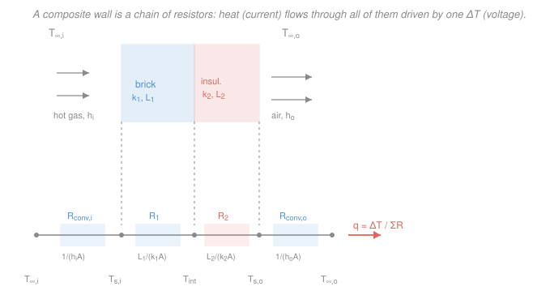

# Heat Transfer · Lesson 1.4: Thermal-resistance networks

> ⏱ ~15 min · Module 1: Conduction and thermal resistance · Builds on: [1.3 1-D steady conduction](01-03-1d-steady-conduction.md), [1.1 the three modes (convection preview)](01-01-three-modes-fouriers-law.md) · Unlocks: [1.5 Fins](01-05-fins-extended-surfaces.md), Module 4 heat exchangers (overall $U$)

## Why this matters

You already know how to solve conduction the hard way — write the ODE, apply boundary conditions, integrate ([1.3](01-03-1d-steady-conduction.md)). But real walls are layered: gypsum, then insulation, then brick, with air blowing on both sides. Re-solving the ODE across every interface is miserable. The payoff of this lesson is that you never have to. Steady 1-D heat flow obeys **exactly the same algebra as a DC electrical circuit**, so a five-layer furnace wall becomes "add up the resistors and divide" — a problem you can do on a napkin. This one analogy carries you all the way to sizing heat exchangers in Module 4, where the whole device collapses to a single overall coefficient $U$.

## The idea

Look at Fourier's law for a plane wall, $q = kA\,\Delta T/L$, and rearrange it: $q = \Delta T \big/ (L/kA)$. That is **Ohm's law wearing a lab coat.** A *temperature difference* $\Delta T$ pushes a *heat current* $q$ through a *thermal resistance* $R = L/kA$, precisely as a voltage pushes electrical current through a resistance. Same equation, same intuition:

$$q = \frac{\Delta T}{R} \qquad\longleftrightarrow\qquad I = \frac{V}{R}.$$

Once you accept that dictionary — $\Delta T \leftrightarrow$ voltage, $q \leftrightarrow$ current, $R \leftrightarrow$ resistance — every circuit trick you own becomes a heat-transfer trick. Layers stacked so heat flows through one *then* the next are **in series**: their resistances add. Materials sitting *side by side* offering heat two parallel paths are **in parallel**: their conductances add. Convection at a surface is just one more resistor in the chain. You stop solving differential equations and start doing bookkeeping.

Why does this work? Because in steady state the *same* heat current $q$ flows through every layer of a series wall (nowhere for energy to pile up), and the total temperature drop is the sum of the drops across each layer — which is exactly the rule for resistors in series.

## The formal version

Define the **thermal resistance** of any element as $R \equiv \Delta T / q$, units kelvin per watt (K/W). From the [1.3](01-03-1d-steady-conduction.md) conduction solutions and Newton's cooling law, each element has a closed form:

| Element | Resistance $R$ (K/W) | Where it comes from |
|---|---|---|
| Plane wall (area $A$, thickness $L$) | $\dfrac{L}{kA}$ | $q = kA\,\Delta T/L$ |
| Cylindrical shell (length $L$) | $\dfrac{\ln(r_2/r_1)}{2\pi kL}$ | the $\ln r$ profile |
| Spherical shell | $\dfrac{1}{4\pi k}\left(\dfrac{1}{r_1}-\dfrac{1}{r_2}\right)$ | the $1/r$ profile |
| Convection at a surface | $\dfrac{1}{hA}$ | $q = hA\,\Delta T$ |
| Contact between two solids | $\dfrac{R''_{tc}}{A}$ | imperfect interface |

*In words: geometry and material set each resistance; a fat, conductive, large-area path is a small resistance, and heat pours through it.* Here $k$ is thermal conductivity (W/(m·K)), $h$ the convection coefficient (W/(m²·K)), $r_1,r_2$ inner/outer radii (m).

**Contact resistance.** Two solids "in contact" actually touch only at scattered high spots; the gaps trap air. That imperfect joint drops temperature all on its own. We tabulate it as a **thermal contact resistance** $R''_{tc}$ (units m²·K/W, per unit interface area), and its network resistance is $R_{tc}=R''_{tc}/A$. *In words: a bolted or pressed joint behaves like a thin extra insulating layer you can't see.*

**Series.** Heat flowing through layers 1, 2, …, $n$ in turn sees the sum:

$$R_{tot} = \sum_i R_i, \qquad q = \frac{\Delta T_{overall}}{R_{tot}}.$$

*In words: stack the resistors, add them, done.* Because $q$ is common to all, the drop across any single layer is $\Delta T_i = q\,R_i$ — that's how you back out an interface temperature.

**Parallel.** Two materials side by side spanning the same $\Delta T$ carry heat independently, so their **conductances** $1/R$ add:

$$\frac{1}{R_{tot}} = \sum_i \frac{1}{R_i}.$$

*In words: heat takes every path at once; give it a second lane and total flow rises.*

**Overall heat-transfer coefficient $U$.** For a whole assembly we fold all of $R_{tot}$ into one number defined by

$$q = UA\,\Delta T_{overall}, \qquad \boxed{UA = \frac{1}{R_{tot}}}.$$

*In words: $U$ (W/(m²·K)) is one convection-like coefficient standing in for the entire sandwich — inside film, every solid layer, outside film.* This is the exact quantity heat exchangers are rated by ([4.4](04-04-heat-exchangers-lmtd.md)).

**Critical insulation radius.** Here the analogy bites back. Wrap insulation of conductivity $k$ around a pipe out to radius $r$, with convection $h$ outside. The per-length resistance is

$$R'_{tot} = \underbrace{\frac{\ln(r/r_1)}{2\pi k}}_{\text{conduction, grows with }r} + \underbrace{\frac{1}{2\pi r h}}_{\text{convection, shrinks with }r}.$$

Adding insulation *thickens* the conductive resistance but also *enlarges* the outer surface, which *lowers* the convective resistance. Setting $dR'_{tot}/dr = 0$ gives the radius where total resistance is **minimum** (so heat loss is *maximum*):

$$\boxed{r_{cr} = \frac{k}{h}} \quad(\text{cylinder}), \qquad r_{cr}=\frac{2k}{h}\ (\text{sphere}).$$

*In words: for a thin enough pipe, the first bit of insulation makes it lose* more *heat, not less — until you build past $r_{cr}$.*

## Picture

## Worked examples

**Example 1 — the furnace wall (per unit area).** A furnace wall is firebrick ($L_1=0.2\ \mathrm{m}$, $k_1=1.0\ \mathrm{W/(m\,K)}$) bonded to insulation ($L_2=0.1\ \mathrm{m}$, $k_2=0.05\ \mathrm{W/(m\,K)}$). Inside, hot gas at $T_{\infty,i}=900\ ^\circ\mathrm{C}$ blows with $h_i=25\ \mathrm{W/(m^2 K)}$; outside, air at $T_{\infty,o}=30\ ^\circ\mathrm{C}$ with $h_o=15\ \mathrm{W/(m^2 K)}$. Find the heat flux $q''$ and the brick–insulation interface temperature.

Work per unit area, so every resistance is an $R''$ in m²·K/W (an $R''$ is just $R$ with the $A$ stripped out; then $q''=\Delta T/\sum R''$). Four resistors in series, inside to outside:

$$R''_{conv,i}=\frac{1}{h_i}=\frac{1}{25}=0.040,\quad R''_1=\frac{L_1}{k_1}=\frac{0.2}{1.0}=0.200,$$
$$R''_2=\frac{L_2}{k_2}=\frac{0.1}{0.05}=2.000,\quad R''_{conv,o}=\frac{1}{h_o}=\frac{1}{15}=0.0667,$$

all in m²·K/W. Sum them:

$$\sum R'' = 0.040+0.200+2.000+0.0667 = 2.307\ \mathrm{m^2 K/W}.$$

The overall drop is $\Delta T_{overall}=900-30=870\ ^\circ\mathrm{C}$ (a *difference*, so °C and K are interchangeable):

$$q'' = \frac{\Delta T_{overall}}{\sum R''} = \frac{870}{2.307} = 377\ \mathrm{W/m^2}.$$

Same $q''$ flows through every layer. March from the inside, dropping $q''R''$ at each step. Inner brick face: $T_{s,i}=900-377(0.040)=884.9\ ^\circ\mathrm{C}$. Interface: subtract the drop across the brick,

$$T_{int}=T_{s,i}-q''R''_1 = 884.9-377(0.200) = 809\ ^\circ\mathrm{C}.$$

*Check.* March in from the *outside* instead: $T_{s,o}=30+377(0.0667)=55.1\ ^\circ\mathrm{C}$, then $T_{int}=55.1+377(2.000)=809\ ^\circ\mathrm{C}$ ✓ — both routes meet. Sanity: the insulation holds 87% of the total resistance ($2.0/2.307$) and so eats $754\ ^\circ\mathrm{C}$ of the $870\ ^\circ\mathrm{C}$ drop — exactly what insulation is for. Units: $(\mathrm{K})/(\mathrm{m^2 K/W})=\mathrm{W/m^2}$ ✓.

**Example 2 — the critical radius surprise.** A thin electrical wire of radius $r_1=2\ \mathrm{mm}$ runs at fixed surface temperature in still air, $h=10\ \mathrm{W/(m^2 K)}$. You sleeve it in rubber insulation, $k=0.05\ \mathrm{W/(m\,K)}$. Does insulating it reduce heat loss? Compute the critical radius:

$$r_{cr}=\frac{k}{h}=\frac{0.05}{10}=0.005\ \mathrm{m}=5\ \mathrm{mm}.$$

Since $r_1=2\ \mathrm{mm} < r_{cr}=5\ \mathrm{mm}$, we're on the *wrong* side — adding insulation up to 5 mm will *raise* heat loss. Watch the per-length resistance (K·m/W) fall as we build out from bare wire:

$$R'_{bare}=\frac{1}{2\pi r_1 h}=\frac{1}{2\pi(0.002)(10)}=7.96,$$
$$R'_{@5\,\mathrm{mm}}=\underbrace{\frac{\ln(5/2)}{2\pi(0.05)}}_{2.92}+\underbrace{\frac{1}{2\pi(0.005)(10)}}_{3.18}=6.10.$$

The resistance *dropped* from 7.96 to 6.10, so for a fixed $\Delta T$ the heat loss *rises* by $7.96/6.10 = 1.30$ — **30% more heat lost** with insulation added. Push further to $r=10\ \mathrm{mm}$ and $R'$ climbs back to $6.71$; you'd have to insulate well past 5 mm just to return to the bare-wire loss.

*Check.* $dR'/dr = \frac{1}{2\pi r}\!\left(\frac1k-\frac1{rh}\right)=0$ at $r=k/h$ ✓, and it's a minimum (loss peaks there). Sanity: this is a real trick — thin current-carrying wires are sometimes coated precisely to *shed* more heat and raise their ampacity. For a fat pipe where $r_1>r_{cr}$ already, insulation only ever helps.

## Watch out

- **You might think the layer with the biggest temperature drop conducts the most heat.** Backwards — in series *every* layer carries the identical $q$. The big drop just flags the big resistor (the insulation in Example 1). Voltage divider, not current divider.
- **You might reach for $R'' = 1/h$ and forget it's per unit area.** Convection resistance is $R=1/(hA)$; the "$1/h$" form is $R''=RA$. Mixing $R$ (K/W) and $R''$ (m²·K/W) in the same sum is the classic units disaster — pick one and stay there.
- **You might assume insulation always helps.** Only for $r_1>r_{cr}$. On a thin wire or small tube, the first millimeters can *increase* loss, because growing the outer area cuts convective resistance faster than the insulation adds conductive resistance.

## One-liner

> Heat flow is Ohm's law: $q=\Delta T/R$, so stack resistors in series (add $R$) or parallel (add $1/R$) and read a whole wall off by inspection — but on a thin pipe, the first insulation can *raise* loss until you pass $r_{cr}=k/h$.

## Problems

**P1 (🟢)** A furnace door is a 15 mm steel plate ($k=50\ \mathrm{W/(m\,K)}$) backed by 40 mm of insulation ($k=0.03\ \mathrm{W/(m\,K)}$). The inner steel face is held at $200\ ^\circ\mathrm{C}$; the outer insulation face loses heat by convection to air at $25\ ^\circ\mathrm{C}$ with $h=20\ \mathrm{W/(m^2 K)}$. Per unit area, find the heat flux $q''$ and the steel–insulation interface temperature.

**P2 (🟡)** A $2.5\ \mathrm{m^2}$ wall section is 90% fiberglass ($k=0.04\ \mathrm{W/(m\,K)}$) and 10% wood studs ($k=0.12\ \mathrm{W/(m\,K)}$) by area, both $L=0.10\ \mathrm{m}$ thick and spanning the same faces. Treat the two as parallel resistances. Find $R_{tot}$, the overall $U$, and the heat rate if the wall holds a $25\ \mathrm{K}$ difference. Which path carries more heat, and why?

**P3 (🔴, optional — cross to circuits/ampacity)** A copper wire of radius $r_1=1\ \mathrm{mm}$ dissipates ohmic heat to air at $h=12\ \mathrm{W/(m^2 K)}$. You consider a rubber jacket, $k=0.15\ \mathrm{W/(m\,K)}$. Find the critical radius $r_{cr}$. Does a 1 mm-thick jacket (out to $r=2\ \mathrm{mm}$) help *cool* the wire or overheat it, and by roughly what factor does the per-length heat loss change?

Solutions

**P1** Three resistors in series (steel, insulation, outside convection), per unit area:

$$R''_{steel}=\frac{0.015}{50}=3.0\times10^{-4},\quad R''_{ins}=\frac{0.040}{0.03}=1.333,\quad R''_{conv}=\frac{1}{20}=0.050,$$

so $\sum R''=1.383\ \mathrm{m^2 K/W}$ and

$$q''=\frac{200-25}{1.383}=\frac{175}{1.383}=127\ \mathrm{W/m^2}.$$

Interface temperature = inner face minus the (tiny) drop across the steel:

$$T_{int}=200-q''R''_{steel}=200-127(3.0\times10^{-4})=200-0.04\approx 200.0\ ^\circ\mathrm{C}.$$

*Check.* The steel resistance is $\sim 2\times10^{-4}$ of the total, so essentially the whole $200\ ^\circ\mathrm{C}$ reaches the insulation — a metal plate is nearly a short circuit thermally. Units: $\mathrm{(K)/(m^2K/W)=W/m^2}$ ✓.

**P2** Areas: studs $A_s=0.25\ \mathrm{m^2}$, fiberglass $A_f=2.25\ \mathrm{m^2}$. Each path is a plane-wall resistance $R=L/(kA)$:

$$R_{stud}=\frac{0.10}{0.12(0.25)}=3.333\ \mathrm{K/W},\qquad R_{ins}=\frac{0.10}{0.04(2.25)}=1.111\ \mathrm{K/W}.$$

Parallel — add conductances:

$$\frac{1}{R_{tot}}=\frac{1}{3.333}+\frac{1}{1.111}=0.300+0.900=1.200\ \mathrm{W/K}\ \Rightarrow\ R_{tot}=0.833\ \mathrm{K/W}.$$

Then $UA=1/R_{tot}=1.200\ \mathrm{W/K}$ and $U=UA/A=1.200/2.5=0.48\ \mathrm{W/(m^2 K)}$. Heat rate:

$$q=\frac{\Delta T}{R_{tot}}=\frac{25}{0.833}=30\ \mathrm{W}\quad(\text{or } UA\,\Delta T=1.2\times25=30\ \mathrm{W}).$$

The fiberglass path carries $25/1.111=22.5\ \mathrm{W}$; the studs carry $25/3.333=7.5\ \mathrm{W}$. **The insulation carries more total heat** — not because it conducts well (it doesn't) but because it covers $9\times$ the area. *Per unit area* the studs leak worse (a thermal bridge); over the whole wall, area wins.

*Check.* Conductances sum to the parallel total ($0.3+0.9=1.2$) and the two heat rates sum to $30\ \mathrm{W}$ ✓.

**P3** Critical radius:

$$r_{cr}=\frac{k}{h}=\frac{0.15}{12}=0.0125\ \mathrm{m}=12.5\ \mathrm{mm}.$$

The bare wire ($r_1=1\ \mathrm{mm}$) sits far below $r_{cr}=12.5\ \mathrm{mm}$, so a jacket out to $r=2\ \mathrm{mm}$ is still on the loss-*increasing* side: it **cools** the wire (raises heat loss). Compare per-length resistances (K·m/W):

$$R'_{bare}=\frac{1}{2\pi(0.001)(12)}=13.3,$$
$$R'_{@2\,\mathrm{mm}}=\frac{\ln(2/1)}{2\pi(0.15)}+\frac{1}{2\pi(0.002)(12)}=0.735+6.63=7.37.$$

Resistance falls from 13.3 to 7.37, so for the wire's fixed internal heating the loss rises by $13.3/7.37\approx 1.8$ — nearly **double** the heat rejection, letting the wire run cooler at the same current.

*Check.* $r=2\ \mathrm{mm}<r_{cr}=12.5\ \mathrm{mm}$, so we expect $R'$ to drop — it does ✓. This is exactly why thin insulated conductors can carry more current than bare ones: the sleeve is a heat sink, not a blanket.

## Flashback

**From Lesson 1.3 (1-D steady conduction):** A cylindrical firebrick liner has inner radius $r_1=0.10\ \mathrm{m}$, outer radius $r_2=0.15\ \mathrm{m}$, conductivity $k=1.5\ \mathrm{W/(m\,K)}$, and length $L=2\ \mathrm{m}$. Its inner surface is at $400\ ^\circ\mathrm{C}$ and its outer surface at $100\ ^\circ\mathrm{C}$. Find the total radial heat rate $q$. (Pure conduction — no convection, no network.)

Solution

Use the cylindrical-shell resistance from [1.3](01-03-1d-steady-conduction.md):

$$R_{cyl}=\frac{\ln(r_2/r_1)}{2\pi kL}=\frac{\ln(0.15/0.10)}{2\pi(1.5)(2)}=\frac{\ln 1.5}{18.85}=\frac{0.405}{18.85}=0.0215\ \mathrm{K/W}.$$

Then

$$q=\frac{\Delta T}{R_{cyl}}=\frac{400-100}{0.0215}=\frac{300}{0.0215}\approx 1.39\times10^{4}\ \mathrm{W}\approx 13.9\ \mathrm{kW}.$$

*Check.* Units: $\mathrm{(K)/(K/W)=W}$ ✓. This is the *same* $q=\Delta T/R$ formula this lesson runs on — a single cylindrical shell is just a one-resistor network. Sanity: a thin (5 cm), fairly conductive liner over 2 m of length passing kilowatts is reasonable for a furnace. ✓

## Connections

- **Backward:** every resistance in the table is a [1.3](01-03-1d-steady-conduction.md) conduction solution rearranged, plus the [1.1](01-01-three-modes-fouriers-law.md) convection law $q=hA\,\Delta T$ turned into $R=1/(hA)$. The network is a repackaging, not new physics.
- **Forward:** [1.5 Fins](01-05-fins-extended-surfaces.md) adds a *parallel* conductance to a surface — the fin gives heat a second escape path, which is exactly Boss problem 1(b)'s finned outer wall. Module 4 rates entire heat exchangers by the single overall coefficient $U=1/(R_{tot}A)$ built here ([4.4](04-04-heat-exchangers-lmtd.md)).
- **Sideways:** the whole method *is* DC circuit analysis — series/parallel resistances and voltage dividers from Ohm's law, with temperature for voltage and heat rate for current. And once $q$ is known, [engineering-thermodynamics](../../engineering-thermodynamics/syllabus.md)'s steady-flow energy balance $\dot q=\dot m c_p\,\Delta T$ tells you how fast the fluid on either side actually heats or cools — the bridge you'll cross constantly in Module 4.
