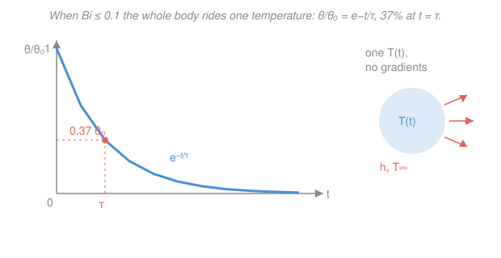

# Heat Transfer · Lesson 2.1: Lumped capacitance and the Biot number

> ⏱ ~15 min · Module 2: Transient conduction · Builds on: [1.2 The heat equation](01-02-heat-equation.md), [1.4 Thermal-resistance networks](01-04-thermal-resistance-networks.md) · Unlocks: [2.2 The semi-infinite solid](02-02-semi-infinite-solid.md), [2.3 Finite bodies: one-term and Heisler](02-03-finite-bodies-heisler.md)

## Why this matters

Module 1 froze time — every wall sat at steady state. Now we let temperature *change*, and the whole module hangs on one question: **does the object have a single temperature, or do gradients build up inside it?** A copper coin dropped in cold water cools all-of-a-piece; a thick steel billet cools skin-first while its core stays hot for minutes. Getting this wrong means solving the wrong equation. One dimensionless number — the **Biot number** — decides for you in a single line of arithmetic, and when it says "one temperature," the transient problem collapses from a PDE to a one-line exponential you already met as Newton's law of cooling.

## The idea

Picture two resistances in series between an object's hot interior and the cold fluid around it. Heat must first **conduct** from the core to the surface (through the solid), then **convect** from the surface into the fluid. Whichever resistance is bigger controls where the temperature drop happens.

- If convection is the bottleneck (conduction inside is *easy*), heat pools at the surface no faster than the core can resupply it — so the interior stays nearly uniform. The body is "thermally thin." **One temperature.**
- If conduction inside is the bottleneck (a thick, poorly-conducting slab), the surface dumps heat to the fluid faster than the core can feed it, so a steep gradient forms. **Many temperatures.**

The Biot number is just the *ratio* of those two resistances. Small Biot means internal conduction is the cheap step, gradients never build, and we can treat the body as a single blob of temperature $T(t)$ — that is **lumped capacitance**. The blob then cools like anything approaching equilibrium: fast at first (big temperature gap), slowing as it closes in — an exponential decay with a characteristic time you can compute from the material and the geometry.

## The formal version

**Biot number.**

$$Bi = \frac{h L_c}{k_{\text{solid}}} = \frac{L_c/(k_{\text{solid}} A)}{1/(hA)} = \frac{\text{internal conduction resistance}}{\text{external convection resistance}}, \qquad L_c = \frac{V}{A_s}.$$

Here $h$ is the convection coefficient (W/(m²·K)), $k_{\text{solid}}$ the **solid's** thermal conductivity (W/(m·K)), $V$ the body's volume (m³), and $A_s$ its surface area exposed to the fluid (m²), so the **characteristic length** $L_c = V/A_s$ has units of metres. *In words: Biot compares how hard it is to move heat through the solid to how hard it is to shed it from the surface.* The criterion:

$$\boxed{\,Bi < 0.1 \;\Longrightarrow\; \text{internal gradients} < \text{a few percent} \;\Longrightarrow\; \text{lumped capacitance is valid.}\,}$$

For common shapes $L_c = V/A_s$ gives: sphere $D/6$, long cylinder $D/4$, plane wall of half-thickness $L$ (convection on both faces) $L_c = L$.

**Lumped energy balance.** With one temperature $T(t)$, the first law on the whole body says *stored energy falls at exactly the rate the surface convects heat away* (no internal gradient to store energy in a profile):

$$\rho V c_p \frac{dT}{dt} = -\,h A_s\big(T - T_\infty\big),$$

where $\rho$ is density (kg/m³), $c_p$ specific heat (J/(kg·K)), and $T_\infty$ the fluid temperature (K or °C — a *difference*, so either works). Define the **temperature excess** $\theta \equiv T - T_\infty$; since $T_\infty$ is constant, $d\theta/dt = dT/dt$, and the equation becomes $\rho V c_p\,\dot\theta = -hA_s\,\theta$ — first-order linear, the same $\dot\theta = -\theta/\tau$ you solved as Newton's law of cooling in [`ode-refresher` 1.3](../../ode-refresher/lessons/01-03-first-order-models.md). Its solution:

$$\boxed{\,\frac{\theta}{\theta_i} = \frac{T - T_\infty}{T_i - T_\infty} = e^{-t/\tau}\,}, \qquad \tau = \frac{\rho V c_p}{h A_s} = \underbrace{\frac{1}{hA_s}}_{R_t\ (\text{K/W})}\underbrace{\big(\rho V c_p\big)}_{C_t\ (\text{J/K})} = R_t\,C_t.$$

*In words: the gap to ambient shrinks by a fixed fraction every fixed stretch of time.* The **time constant** $\tau$ (seconds) is the convection **resistance** $R_t = 1/(hA_s)$ times the lumped **thermal capacitance** $C_t = \rho V c_p$ — literally $R_tC_t$, the identical structure to a capacitor discharging through a resistor in an RC circuit ($V/V_0 = e^{-t/RC}$). After one $\tau$ the gap is down to $e^{-1} = 37\%$; after $3\tau$, to 5%; after $5\tau$, essentially gone.

Two quantities fall straight out. To reach a target temperature, invert the exponential:

$$t = -\tau \ln\!\frac{\theta}{\theta_i}.$$

And the **total heat transferred** up to time $t$ is the stored energy the body has given up:

$$Q(t) = \int_0^t hA_s\,\theta\,dt' = \rho V c_p\,\theta_i\big(1 - e^{-t/\tau}\big) = \rho V c_p\,(T_i - T(t)) = m c_p\,\Delta T,$$

capping at $Q_{\max} = \rho V c_p\,\theta_i$ when the body finally reaches $T_\infty$.

## Picture

## Worked examples

**Example 1 — a small copper sphere quenched (lumped works).** A copper sphere of diameter $D = 5\ \mathrm{mm}$, initially at $T_i = 200\,^\circ\mathrm{C}$, is dropped into an agitated oil bath at $T_\infty = 25\,^\circ\mathrm{C}$ with $h = 200\ \mathrm{W/(m^2 K)}$. Copper (Incropera, ~300 K): $k = 400\ \mathrm{W/(m\,K)}$, $\rho = 8933\ \mathrm{kg/m^3}$, $c_p = 385\ \mathrm{J/(kg\,K)}$. Find $Bi$, $\tau$, and the time to cool to $50\,^\circ\mathrm{C}$.

Characteristic length (sphere): $L_c = D/6 = 0.005/6 = 8.33\times10^{-4}\ \mathrm{m}$. Then

$$Bi = \frac{hL_c}{k} = \frac{200 \times 8.33\times10^{-4}}{400} = 4.2\times10^{-4} \ll 0.1. \quad\checkmark\ \text{lumped is valid.}$$

Copper conducts so freely that the internal resistance is negligible. The time constant (using $V/A_s = L_c$):

$$\tau = \frac{\rho c_p L_c}{h} = \frac{8933 \times 385 \times 8.33\times10^{-4}}{200} = \frac{2866}{200} \approx 14.3\ \mathrm{s}.$$

Time to reach $50\,^\circ\mathrm{C}$: $\dfrac{\theta}{\theta_i} = \dfrac{50-25}{200-25} = \dfrac{25}{175} = 0.143$, so

$$t = -\tau\ln(0.143) = -14.3 \times (-1.946) \approx 27.8\ \mathrm{s}.$$

*Units/sanity check.* $\tau$: $\frac{(\mathrm{kg/m^3})(\mathrm{J/(kg\,K)})(\mathrm{m})}{\mathrm{W/(m^2K)}} = \frac{\mathrm{J/(m^2K)}}{\mathrm{W/(m^2K)}} = \mathrm{J/W} = \mathrm{s}$ ✓. About $2\tau$ to fall from a 175° gap to a 25° gap ($e^{-2}=0.135\approx0.143$) — consistent. The sphere gives up $Q = mc_p\Delta T$; with $m = \rho V = 8933(\tfrac{\pi}{6}D^3) = 5.85\times10^{-4}\ \mathrm{kg}$, that is $5.85\times10^{-4}\times385\times150 \approx 33.8\ \mathrm{J}$.

**Example 2 — a thick steel slab (lumped *fails*).** [Boss problem 2(a) flavor.] A steel slab $50\ \mathrm{mm}$ thick, insulated on its back face, is suddenly exposed on the front to a fast water spray at $T_\infty$ with $h = 500\ \mathrm{W/(m^2 K)}$. Carbon steel: $k = 50\ \mathrm{W/(m\,K)}$. Is lumped capacitance legitimate?

With the back insulated, all heat leaves through the front, so $L_c = V/A_s = (AL)/A = L = 0.05\ \mathrm{m}$ (the full thickness). Then

$$Bi = \frac{hL_c}{k} = \frac{500 \times 0.05}{50} = 0.5.$$

$Bi = 0.5 \gg 0.1$ — the test **fails**. Internal conduction resistance is *half* the convection resistance, not negligible: the sprayed face plunges toward $T_\infty$ while the core lags far behind, so no single $T(t)$ describes the slab. Assuming lumped here would badly mispredict both the surface and the core. We must resolve the spatial gradient — which is exactly what the **semi-infinite solution** ([2.2](02-02-semi-infinite-solid.md)) does at early times (before the insulated far face "feels" anything) and the **one-term / Heisler** solution ([2.3](02-03-finite-bodies-heisler.md)) does once $Fo \gtrsim 0.2$.

*Sanity check.* Same $h$, but $k$ dropped ~8× and $L_c$ grew ~60× versus Example 1, so $Bi$ jumped from $10^{-4}$ to $10^{0}$ — poor conductor, thick body: the two ingredients that make gradients unavoidable. ✓

## Watch out

- **You might think $Bi$ uses the fluid's conductivity — actually it's the *solid's*.** $Bi = hL_c/k_{\text{solid}}$. (Its look-alike, the Nusselt number $Nu = hL/k_{\text{fluid}}$ in Module 3, uses the *fluid's* $k$; they look identical but answer opposite questions. Same $h$, different $k$.)
- **You might think cranking up $h$ helps lumped capacitance — actually it hurts it.** A bigger $h$ raises $Bi$, making internal gradients *worse*: the surface sheds heat faster than the interior can keep up. Vigorous quenching is precisely when lumped capacitance breaks down.
- **You might use the full size for $L_c$ — actually it's $V/A_s$.** For a sphere that's $D/6$, not $D$ or $R$; for a plane wall cooled on both faces it's the *half*-thickness. Using the wrong length can push a valid $Bi$ over $0.1$ or vice versa.

## One-liner

> One number decides the transient: $Bi = hL_c/k_{\text{solid}} < 0.1$ means the body holds a single temperature that decays as $e^{-t/\tau}$ with $\tau = R_tC_t = \rho Vc_p/(hA_s)$ — heat transfer's own RC circuit.

## Problems

**P1 (🟢)** A $3\ \mathrm{mm}$-diameter aluminum sphere at $100\,^\circ\mathrm{C}$ is cooled in a $25\,^\circ\mathrm{C}$ air stream with $h = 30\ \mathrm{W/(m^2 K)}$. Aluminum: $k = 237\ \mathrm{W/(m\,K)}$, $\rho = 2702\ \mathrm{kg/m^3}$, $c_p = 903\ \mathrm{J/(kg\,K)}$. Confirm $Bi < 0.1$, find the time constant $\tau$, and find how long to reach $40\,^\circ\mathrm{C}$.

**P2 (🟡)** A stainless-steel ball bearing, $D = 10\ \mathrm{mm}$, $k = 15\ \mathrm{W/(m\,K)}$, is quenched in water with $h = 1000\ \mathrm{W/(m^2 K)}$. Compute $Bi$ and decide whether lumped capacitance is legitimate. Then find the largest $h$ for which it *would* be legitimate.

**P3 (🔴)** Two solid spheres of the *same* material and surface condition (same $h$) have radii $r$ and $2r$, both starting at $T_i$ in a fluid at $T_\infty$. Show that for a sphere $\tau = \rho c_p D/(6h)$, then find the ratio of times for the two spheres to reach the same fraction $\theta/\theta_i$. Which cools faster, and why does size matter but the starting temperature not?

Solutions

**P1** Sphere: $L_c = D/6 = 0.003/6 = 5.0\times10^{-4}\ \mathrm{m}$.

$$Bi = \frac{hL_c}{k} = \frac{30 \times 5.0\times10^{-4}}{237} = 6.3\times10^{-5} \ll 0.1. \quad\checkmark$$

$$\tau = \frac{\rho c_p L_c}{h} = \frac{2702 \times 903 \times 5.0\times10^{-4}}{30} = \frac{1220}{30} \approx 40.7\ \mathrm{s}.$$

Target: $\dfrac{\theta}{\theta_i} = \dfrac{40-25}{100-25} = \dfrac{15}{75} = 0.20$, so $t = -40.7\ln(0.20) = -40.7\times(-1.609) \approx 65.5\ \mathrm{s}$.

*Check.* $\tau$ has units $\mathrm{J/W = s}$ ✓; reaching $\theta/\theta_i=0.2$ takes $-\ln0.2 = 1.61$ time constants, i.e. between $1\tau$ (37%) and $2\tau$ (14%) — consistent with $t \approx 1.6\tau$. ✓

**P2** $L_c = D/6 = 0.010/6 = 1.667\times10^{-3}\ \mathrm{m}$.

$$Bi = \frac{hL_c}{k} = \frac{1000 \times 1.667\times10^{-3}}{15} = \frac{1.667}{15} = 0.111.$$

$Bi = 0.111 > 0.1$, so lumped capacitance is **not** strictly legitimate — it just fails the criterion; a real analysis would carry an error of a few percent from the modest internal gradient (poorly-conducting steel plus a high quench $h$). For validity we need $Bi < 0.1$:

$$h < \frac{0.1\,k}{L_c} = \frac{0.1 \times 15}{1.667\times10^{-3}} = 900\ \mathrm{W/(m^2 K)}.$$

*Check.* At exactly $h=900$, $Bi = 900\times1.667\times10^{-3}/15 = 0.1$ ✓. Note how a *worse* conductor (steel, $k=15$ vs copper's 400) and a *stronger* quench both push $Bi$ up — the two failure ingredients from Example 2. ✓

**P3** For a sphere, $V = \tfrac{\pi}{6}D^3$ and $A_s = \pi D^2$, so $L_c = V/A_s = D/6$. Then

$$\tau = \frac{\rho V c_p}{hA_s} = \frac{\rho c_p L_c}{h} = \frac{\rho c_p D}{6h}.$$

So $\tau \propto D$: the $2r$ sphere has $\tau_2 = 2\tau_1$. Time to reach a given $\theta/\theta_i$ is $t = -\tau\ln(\theta/\theta_i)$, and the log factor is *identical* for both, so

$$\frac{t_2}{t_1} = \frac{\tau_2}{\tau_1} = 2.$$

The bigger sphere takes twice as long. Size matters because $\tau = C_t R_t$ scales as $C_t \propto V \propto D^3$ (stored energy) while $R_t \propto 1/A_s \propto 1/D^2$ (shedding surface), and $D^3/D^2 = D$ — volume outgrows surface, so larger bodies carry more heat per unit skin and cool sluggishly. The starting temperature drops out because the *fractional* decay $\theta/\theta_i = e^{-t/\tau}$ depends only on $\tau$, not on the initial gap — the same amplitude-independence as an RC discharge.

*Check.* $\tau = \rho c_p D/(6h)$ has units $\frac{(\mathrm{kg/m^3})(\mathrm{J/(kg\,K)})(\mathrm{m})}{\mathrm{W/(m^2K)}} = \mathrm{s}$ ✓, and matches Example 1's $\rho c_p L_c/h$ since $L_c=D/6$. ✓

## Flashback

**From Lesson 1.4 (Thermal-resistance networks):** A brick wall $0.20\ \mathrm{m}$ thick, $k = 0.70\ \mathrm{W/(m\,K)}$, separates inside air at $20\,^\circ\mathrm{C}$ ($h_i = 10\ \mathrm{W/(m^2 K)}$) from outside air at $-5\,^\circ\mathrm{C}$ ($h_o = 40\ \mathrm{W/(m^2 K)}$). Find the steady heat flux $q''$ through the wall (per unit area).

Solution

Three resistances in series, per unit area (K·m²/W): inside convection $1/h_i = 0.100$, conduction $L/k = 0.20/0.70 = 0.286$, outside convection $1/h_o = 1/40 = 0.025$.

$$R''_{\text{tot}} = 0.100 + 0.286 + 0.025 = 0.411\ \mathrm{m^2 K/W}, \qquad q'' = \frac{\Delta T}{R''_{\text{tot}}} = \frac{20 - (-5)}{0.411} \approx 60.9\ \mathrm{W/m^2}.$$

*Check.* Units: $\mathrm{K}/(\mathrm{m^2 K/W}) = \mathrm{W/m^2}$ ✓. The wall conduction dominates the stack (0.286 of 0.411), so most of the 25° drop falls across the brick — as expected for a thick, moderate-$k$ wall. This same series-resistance idea is what defines $\tau = R_tC_t$ in today's lesson: the convection resistance $1/(hA_s)$ reappears as the discharge resistance. ✓

## Connections

- **Backward:** the Biot number is the [1.4](01-04-thermal-resistance-networks.md) resistance network in disguise — conduction resistance $L_c/(kA)$ over convection resistance $1/(hA)$ — and $\tau = R_tC_t$ reuses that same convection resistance as an RC discharge time. The lumped balance $\rho Vc_p\,\dot T = -hA_s\theta$ is the transient version of the [1.2](01-02-heat-equation.md) energy balance with the spatial term dropped (legal precisely when $Bi < 0.1$).
- **Forward:** when $Bi$ fails the test (Example 2), gradients must be resolved — [2.2](02-02-semi-infinite-solid.md) handles early times (semi-infinite, penetration depth $\sim\sqrt{\alpha t}$) and [2.3](02-03-finite-bodies-heisler.md) handles the full finite body ($Fo$, one-term, Heisler charts).
- **Sideways (ODEs & circuits):** this is exactly the first-order decay of [`ode-refresher` 1.3](../../ode-refresher/lessons/01-03-first-order-models.md) — Newton's law of cooling — and structurally identical to an RC circuit's $e^{-t/RC}$, with thermal capacitance $\rho Vc_p$ playing the capacitor and $1/(hA_s)$ the resistor. The lumped balance is also just the closed-system first law $dU/dt = -\dot Q$ from [`engineering-thermodynamics` 2.1](../../engineering-thermodynamics/lessons/02-01-first-law-closed-systems.md), applied to a body with one uniform temperature.
