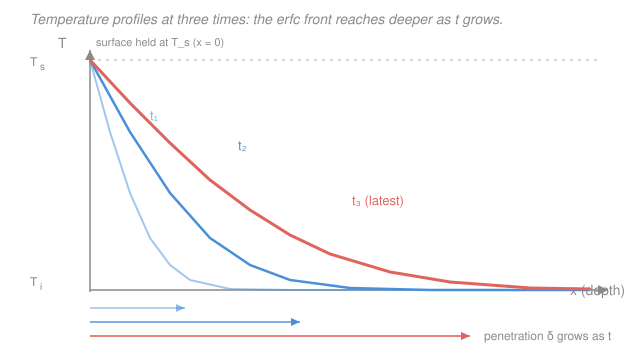

# Heat Transfer · Lesson 2.2: The semi-infinite solid

> ⏱ ~15 min · Module 2: Transient conduction · Builds on: [2.1 Lumped capacitance and the Biot number](02-01-lumped-capacitance-biot.md), [1.2 The heat equation](01-02-heat-equation.md) · Unlocks: 2.3 (finite bodies and Heisler charts)

## Why this matters

Slam a hot iron onto a thick steel plate and, for the first few seconds, the plate's far side has *no idea anything happened*. Only a thin skin near the surface heats up. That's the opposite regime from [lumped capacitance](02-01-lumped-capacitance-biot.md) (Biot $\ll 1$, where the whole body stays at one temperature): here the body is so thick, or the time so short, that a **temperature front** is still crawling inward and hasn't reached the back. This is how you find quench times, how deep a fire has charred a beam, how long before a buried pipe freezes — and, remarkably, the *exact same math* governs how carbon diffuses into steel during case-hardening ([materials-science 2.5](../../materials-science/lessons/02-05-diffusion-ii-transient-arrhenius.md)). One error function, two fields.

## The idea

Picture heat as a rumor spreading inward from the surface. At $t=0$ you change the surface — pin it hot, or blow hot fluid over it. The interior is still at its old uniform temperature $T_i$. As time passes, the "the surface changed" news diffuses inward: nearby atoms hear it first, deeper ones later. At any instant there's a **fuzzy front** — beyond it, the material is still blissfully at $T_i$; inside it, temperature ramps up toward the surface value.

The key insight is that this front has a characteristic reach, the **penetration depth** $\delta \sim \sqrt{\alpha t}$, where $\alpha$ is thermal diffusivity. It grows like $\sqrt{t}$, not like $t$ — diffusion is a *drunkard's walk*, so doubling the depth costs four times the wait. As long as $\delta$ is smaller than the body's actual thickness, the far side never got the memo, and we can pretend the solid extends to infinity. That's the **semi-infinite** idealization: a solid filling all of $x \ge 0$, with one surface at $x=0$ and no back wall to worry about.

## The formal version

We solve the 1-D heat equation from [1.2](01-02-heat-equation.md) on the half-line, with no internal generation:

$$\frac{\partial T}{\partial t} = \alpha\,\frac{\partial^2 T}{\partial x^2}, \qquad x \ge 0, \quad t > 0,$$

where $T(x,t)$ is temperature (°C or K), $x$ is depth below the surface (m), $t$ is time (s), and $\alpha = k/(\rho c_p)$ is the **thermal diffusivity** (m²/s) — conductivity $k$ over volumetric heat capacity $\rho c_p$. *In words: the local temperature rises where the profile curves upward, at a rate set by how fast the material shuttles heat versus how much it hoards.* Initial and far-field conditions: $T(x,0) = T_i$ and $T(x\to\infty,\,t) = T_i$ (the deep interior never moves).

**Case 1 — constant surface temperature.** Suddenly hold the face at $T_s$: $T(0,t) = T_s$. The solution is

$$\boxed{\;\frac{T(x,t) - T_i}{T_s - T_i} = \operatorname{erfc}\!\left(\frac{x}{2\sqrt{\alpha t}}\right)\;}$$

where the **complementary error function** is $\operatorname{erfc}(\eta) = 1 - \operatorname{erf}(\eta)$ and $\operatorname{erf}(\eta) = \dfrac{2}{\sqrt{\pi}}\displaystyle\int_0^{\eta} e^{-s^2}\,ds$. *In words: the fractional progress from old temperature to surface temperature depends only on the single grouped variable $\eta = x/(2\sqrt{\alpha t})$ — depth measured in units of the penetration length.* At $\eta = 0$ (the surface), $\operatorname{erfc}=1$ and $T = T_s$; as $\eta \to \infty$ (deep, or early), $\operatorname{erfc}\to 0$ and $T\to T_i$. That everything collapses onto one variable $\eta$ is a **similarity solution** — the profiles at different times are the same S-curve, just stretched.

Differentiate at the surface and apply Fourier's law to get the **surface heat flux**:

$$q''_s(t) = \frac{k\,(T_s - T_i)}{\sqrt{\pi \alpha t}}.$$

*In words: the flux into the wall starts infinite and decays like $1/\sqrt{t}$* — huge at the first instant (the profile is nearly vertical), fading as the front thickens and the gradient relaxes.

**Penetration depth.** The group $\delta \sim \sqrt{\alpha t}$ is the ruler of this whole problem. A common convention: at $\eta = 2$, i.e. $x = 4\sqrt{\alpha t}$, the temperature change has dropped below about 1% of $(T_s - T_i)$, so define the practical thermal-penetration depth $\delta \approx 4\sqrt{\alpha t}$. *In words: beyond four penetration lengths, the material still hasn't felt the surface — that's exactly the thickness a real body must exceed for "semi-infinite" to be legitimate.*

**Case 2 — convection surface (Robin BC).** More realistically, a fluid at $T_\infty$ with coefficient $h$ washes the face, so the surface flux is set by Newton cooling, $-k\,\partial_x T|_{0} = h[T_\infty - T(0,t)]$. The solution gains a second term:

$$\frac{T(x,t) - T_i}{T_\infty - T_i} = \operatorname{erfc}(\eta) - \exp\!\left(\frac{hx}{k} + \frac{h^2 \alpha t}{k^2}\right)\operatorname{erfc}\!\left(\eta + \frac{h\sqrt{\alpha t}}{k}\right), \qquad \eta = \frac{x}{2\sqrt{\alpha t}}.$$

*In words: it's the constant-$T_s$ erfc profile, minus a correction that accounts for the surface lagging behind the fluid because convection can only deliver heat at a finite rate.* The dimensionless group $h\sqrt{\alpha t}/k$ measures how effective the convection has become; let $h\to\infty$ (perfect contact) and this term collapses to give back Case 1 with $T_s = T_\infty$. There is a third standard flavor — **constant surface flux** $q''_s$ — with solution $T(x,t) - T_i = \dfrac{2 q''_s\sqrt{\alpha t / \pi}}{k}\,e^{-x^2/4\alpha t} - \dfrac{q''_s x}{k}\operatorname{erfc}(\eta)$; reach for it when a heater or absorbed radiation imposes flux rather than temperature.

**The bridge.** Fick's second law of mass diffusion, $\partial_t C = D\,\partial_{xx} C$, is *literally the same PDE* with concentration $C$ for $T$ and mass diffusivity $D$ for $\alpha$. So carbon soaking into steel obeys $\frac{C(x,t)-C_i}{C_s - C_i} = \operatorname{erfc}\!\big(x/2\sqrt{Dt}\big)$ — the identical error function you just met. Learn this once; you've learned both ([materials-science 2.5](../../materials-science/lessons/02-05-diffusion-ii-transient-arrhenius.md)).

## Picture

Each curve is the *same* erfc shape; later times simply stretch it rightward, pushing the front deeper into the solid.

## Worked examples

**Example 1 (constant surface temperature).** A thick slab is initially uniform at $T_i = 20\,^\circ\mathrm{C}$. Its face is suddenly held at $T_s = 100\,^\circ\mathrm{C}$. With diffusivity $\alpha = 1\times10^{-5}\,\mathrm{m^2/s}$, find the temperature at depth $x = 0.02\,\mathrm{m}$ after $t = 60\,\mathrm{s}$, and the penetration depth.

Form the similarity variable:

$$\eta = \frac{x}{2\sqrt{\alpha t}} = \frac{0.02}{2\sqrt{(10^{-5})(60)}} = \frac{0.02}{2\sqrt{6\times10^{-4}}} = \frac{0.02}{2(0.02449)} = 0.408.$$

From a table (or a calculator), $\operatorname{erfc}(0.408) \approx 0.564$. Then

$$T = T_i + (T_s - T_i)\,\operatorname{erfc}(\eta) = 20 + (80)(0.564) = 20 + 45.1 = 65.1\,^\circ\mathrm{C}.$$

Penetration depth: $\delta \approx 4\sqrt{\alpha t} = 4(0.02449) = 0.098\,\mathrm{m} \approx 9.8\,\mathrm{cm}$.

*Check.* $\eta$ is dimensionless: $\mathrm{m}/\sqrt{(\mathrm{m^2/s})(\mathrm{s})} = \mathrm{m/m}$ ✓. Our point sits at $x = 2\,\mathrm{cm}$, well inside the $\approx 9.8\,\mathrm{cm}$ front, so it *should* be substantially warmed — and $65\,^\circ\mathrm{C}$, roughly halfway from $20$ to $100$, matches $\operatorname{erfc}\approx0.56$. ✓ (If we also want the surface flux, with a steel-like $k = 15\,\mathrm{W/(m\cdot K)}$: $q''_s = k(T_s-T_i)/\sqrt{\pi\alpha t} = 15(80)/\sqrt{\pi(10^{-5})(60)} = 1200/0.0434 \approx 2.8\times10^{4}\,\mathrm{W/m^2}$.)

**Example 2 (convection surface — Boss Problem 2(b) flavor).** A thick steel slab, initially $T_i = 20\,^\circ\mathrm{C}$, is suddenly blasted by hot gas at $T_\infty = 500\,^\circ\mathrm{C}$ with $h = 250\,\mathrm{W/(m^2\cdot K)}$. Steel: $k = 15\,\mathrm{W/(m\cdot K)}$, $\alpha = 3.5\times10^{-6}\,\mathrm{m^2/s}$. How long until the point at depth $x = 0.01\,\mathrm{m}$ reaches $T = 100\,^\circ\mathrm{C}$?

The target as a dimensionless temperature:

$$\frac{T - T_i}{T_\infty - T_i} = \frac{100 - 20}{500 - 20} = \frac{80}{480} = 0.167.$$

We need the $t$ that makes the convection solution equal $0.167$. This is **transcendental** — $t$ hides inside three places ($\eta$, the exponential, and the shifted erfc) — so solve by iteration. Set up the substitutions in terms of $\tau \equiv \sqrt{\alpha t}$, using $h/k = 250/15 = 16.67\,\mathrm{m^{-1}}$:

$$\eta = \frac{x}{2\tau} = \frac{0.005}{\tau}, \qquad \frac{h\sqrt{\alpha t}}{k} = 16.67\,\tau, \qquad \frac{hx}{k} + \frac{h^2\alpha t}{k^2} = 0.167 + (16.67\,\tau)^2.$$

Try $t = 100\,\mathrm{s}$: $\alpha t = 3.5\times10^{-4}$, $\tau = 0.01871$. Then $\eta = 0.005/0.01871 = 0.267$, so $\operatorname{erfc}(0.267) = 0.705$. The shift is $16.67(0.01871) = 0.312$, so the second erfc is $\operatorname{erfc}(0.267 + 0.312) = \operatorname{erfc}(0.579) = 0.413$. The exponential argument is $0.167 + (16.67)^2(3.5\times10^{-4}) = 0.167 + 0.097 = 0.264$, so $e^{0.264} = 1.302$. Assemble:

$$\frac{T - T_i}{T_\infty - T_i} = 0.705 - (1.302)(0.413) = 0.705 - 0.538 = 0.167. \;\checkmark$$

It matches on the first serious guess, so $t \approx 100\,\mathrm{s}$ (about 1.7 min). *(In practice you'd bracket it: at $t=120\,\mathrm{s}$ the ratio climbs to $\approx 0.19$, i.e. $\approx 110\,^\circ\mathrm{C}$ — too hot — confirming the root sits just under $100\,\mathrm{s}$.)*

*Check.* Every argument of erfc and exp is dimensionless: $h\sqrt{\alpha t}/k$ has units $\frac{\mathrm{W/(m^2K)}\cdot\mathrm{m}}{\mathrm{W/(mK)}} = 1$ ✓. And $100\,^\circ\mathrm{C}$ is only a fifth of the way from $20$ to $500$, consistent with a mere $100\,\mathrm{s}$ of exposure and a finite-$h$ surface that hasn't yet caught up to the gas. ✓

## Watch out

- **You might think penetration depth grows linearly in time.** It grows like $\sqrt{\alpha t}$. To double how deep the front reaches, you wait *four times* as long — the hallmark of diffusion. This $\sqrt{t}$ is why the surface flux decays as $1/\sqrt{t}$, not $1/t$.
- **You might use the semi-infinite formula for all times.** It's only valid while $\delta \approx 4\sqrt{\alpha t}$ stays smaller than the body's half-thickness $L$ — equivalently while the Fourier number $Fo = \alpha t / L^2$ is small (roughly $Fo \lesssim 0.05$). Once the far side responds, switch to the finite-body / Heisler treatment of [2.3](02-03-finite-bodies-heisler.md).
- **You might confuse $\operatorname{erf}$ with $\operatorname{erfc}$.** For constant surface temperature the *temperature ratio* is $\operatorname{erfc}(\eta)$ (equals 1 at the surface, 0 deep). If you write the *excess relative to the surface*, $\frac{T - T_s}{T_i - T_s} = \operatorname{erf}(\eta)$ instead. Pick a reference and stay consistent, or your surface and interior will swap.

## One-liner

> Too thick to feel its far side, a solid heats as an error-function front creeping inward a distance $\sim\sqrt{\alpha t}$ — the very same erfc that carbon diffusing into steel obeys.

## Problems

**P1 (🟢)** A thick concrete wall ($\alpha = 5\times10^{-7}\,\mathrm{m^2/s}$) is initially at $15\,^\circ\mathrm{C}$ when its surface is suddenly held at $35\,^\circ\mathrm{C}$. Find the temperature at depth $x = 0.03\,\mathrm{m}$ after $t = 1\,\mathrm{hour}$. (Use $\operatorname{erfc}(0.559) \approx 0.429$.)

**P2 (🟡)** For the same wall and conditions as P1, roughly how deep has the thermal front penetrated after 1 hour? After 4 hours? State the depth ratio and explain it in one sentence.

**P3 (🔴)** A firewalker crosses coals; her sole (skin) contacts a surface effectively at $T_s = 600\,^\circ\mathrm{C}$ for $t = 0.3\,\mathrm{s}$. Model skin as semi-infinite, initially $35\,^\circ\mathrm{C}$, with $\alpha = 1.3\times10^{-7}\,\mathrm{m^2/s}$. To what depth $x$ has the temperature risen to $60\,^\circ\mathrm{C}$ (the burn threshold)? (You'll need to invert erfc: find $\eta$ with $\operatorname{erfc}(\eta) = $ the right value.)

Solutions

**P1** Similarity variable with $t = 3600\,\mathrm{s}$:

$$\eta = \frac{x}{2\sqrt{\alpha t}} = \frac{0.03}{2\sqrt{(5\times10^{-7})(3600)}} = \frac{0.03}{2\sqrt{1.8\times10^{-3}}} = \frac{0.03}{2(0.04243)} = 0.559.$$

Then $T = T_i + (T_s - T_i)\operatorname{erfc}(0.559) = 15 + (20)(0.429) = 15 + 8.6 = 23.6\,^\circ\mathrm{C}$.

*Check.* $\eta$ dimensionless ✓. At $3\,\mathrm{cm}$ deep the wall has warmed only $\approx 9\,^\circ\mathrm{C}$ of the available $20\,^\circ\mathrm{C}$ after a full hour — concrete's tiny $\alpha$ makes it a sluggish conductor, exactly why buildings buffer daily temperature swings. ✓

**P2** Penetration depth $\delta \approx 4\sqrt{\alpha t}$. After 1 hour: $\delta_1 = 4(0.04243) = 0.170\,\mathrm{m} \approx 17\,\mathrm{cm}$. After 4 hours: $\sqrt{t}$ doubles (since $\sqrt{4} = 2$), so $\delta_4 = 2\delta_1 \approx 34\,\mathrm{cm}$.

Depth ratio $\delta_4/\delta_1 = 2$. *In one sentence:* quadrupling the time only doubles the reach, because diffusion advances as $\sqrt{t}$ — the drunkard's-walk scaling.

*Check.* Units $\mathrm{m}$ ✓; ratio dimensionless and equals $\sqrt{4}=2$ ✓.

**P3** Target ratio: $\dfrac{T - T_i}{T_s - T_i} = \dfrac{60 - 35}{600 - 35} = \dfrac{25}{565} = 0.0442$. So we need $\eta$ with $\operatorname{erfc}(\eta) = 0.0442$, i.e. $\operatorname{erf}(\eta) = 0.9558$. From tables that's $\eta \approx 1.43$. Then invert the similarity variable:

$$x = 2\eta\sqrt{\alpha t} = 2(1.43)\sqrt{(1.3\times10^{-7})(0.3)} = 2.86\sqrt{3.9\times10^{-8}} = 2.86(1.975\times10^{-4}) = 5.6\times10^{-4}\,\mathrm{m}.$$

So burns reach only about $0.56\,\mathrm{mm}$ deep — barely past the outer dead skin layer.

*Check.* Units: $\sqrt{(\mathrm{m^2/s})(\mathrm{s})} = \mathrm{m}$ ✓. The sub-millimeter depth is the whole physics of firewalking: skin's minuscule $\alpha$ plus a $0.3\,\mathrm{s}$ contact keeps the front paper-thin, so despite $600\,^\circ\mathrm{C}$ coals the live tissue barely warms. ✓

## Flashback

**From Lesson 2.1 (Lumped capacitance and the Biot number):** A 5 mm-diameter copper sphere ($k = 400\,\mathrm{W/(m\cdot K)}$, $\rho = 8933\,\mathrm{kg/m^3}$, $c_p = 385\,\mathrm{J/(kg\cdot K)}$) is dropped into a coolant with $h = 100\,\mathrm{W/(m^2\cdot K)}$. Verify that lumped capacitance applies, then find the time constant $\tau$. (Fresh variant — a sphere, not the slab of 2.1.)

Solution

Characteristic length for a sphere: $L_c = V/A_s = \frac{(4/3)\pi r^3}{4\pi r^2} = \frac{r}{3} = \frac{D}{6} = \frac{0.005}{6} = 8.33\times10^{-4}\,\mathrm{m}$.

Biot number: $Bi = \dfrac{h L_c}{k} = \dfrac{(100)(8.33\times10^{-4})}{400} = 2.1\times10^{-4} \ll 0.1$, so lumped capacitance is comfortably valid (copper's huge $k$ keeps the sphere nearly isothermal).

Time constant: $\tau = \dfrac{\rho V c_p}{h A_s} = \dfrac{\rho c_p L_c}{h} = \dfrac{(8933)(385)(8.33\times10^{-4})}{100} \approx 28.7\,\mathrm{s}.$

*Check.* $Bi$ dimensionless ✓. $\tau$ units: $\frac{(\mathrm{kg/m^3})(\mathrm{J/kg\,K})(\mathrm{m})}{\mathrm{W/m^2K}} = \frac{\mathrm{J/(m^2 K)}}{\mathrm{W/(m^2 K)}} = \mathrm{s}$ ✓. Note the contrast with today's lesson: here $Bi \to 0$ means the *whole* body moves together; the semi-infinite solid is the far opposite, where an internal gradient is the entire story. ✓

## Connections

- **Backward:** this is the transient heat equation of [1.2](01-02-heat-equation.md) solved on the half-line, and the *conceptual opposite* of [2.1's](02-01-lumped-capacitance-biot.md) lumped body — there the internal resistance was negligible ($Bi \ll 0.1$, no gradient); here it dominates (an internal front is the whole phenomenon).
- **Forward:** [2.3 Finite bodies and Heisler charts](02-03-finite-bodies-heisler.md) picks up exactly when the front reaches the far side ($Fo$ no longer small) and the semi-infinite approximation breaks — the erfc solution becomes the *early-time asymptote* of the full finite-slab series.
- **Sideways (materials science):** the constant-surface-temperature result is *identically* the transient-diffusion (Fick's second law) solution for carburizing / doping in [materials-science 2.5](../../materials-science/lessons/02-05-diffusion-ii-transient-arrhenius.md) — swap $\alpha \leftrightarrow D$ and $T \leftrightarrow C$. The similarity variable $\eta = x/2\sqrt{\alpha t}$ and its $\sqrt{t}$ scaling are the shared fingerprint of every diffusion process.
