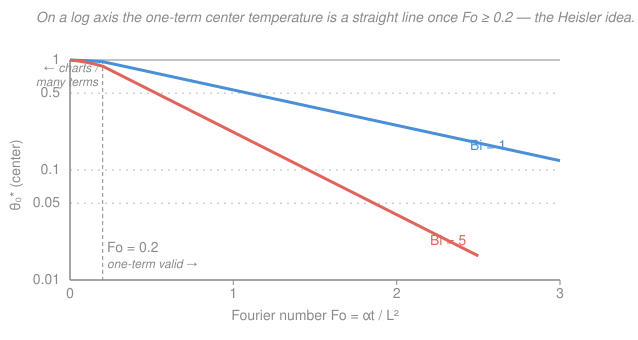

# Heat Transfer · Lesson 2.3: Finite bodies — one-term and Heisler solutions

> ⏱ ~15 min · Module 2: Transient conduction · Builds on: [2.1 Lumped capacitance and Biot](02-01-lumped-capacitance-biot.md), [2.2 The semi-infinite solid](02-02-semi-infinite-solid.md) · Unlocks: Module 3 (convection supplies the $h$ and hence $Bi$), Boss problem 2(c)

## Why this matters

Modules 2.1 and 2.2 handled the two extremes. **Lumped capacitance** ([2.1](02-01-lumped-capacitance-biot.md)) works when the body is so thin, or its conductivity so high, that it has essentially *one* temperature everywhere ($Bi<0.1$). The **semi-infinite solid** ([2.2](02-02-semi-infinite-solid.md)) works when the body is so thick that its far side never feels the surface disturbance during the time of interest. But most real transient problems — quenching a steel plate, cooking a roast, cooling a nuclear fuel pellet — live in the **middle**: internal gradients matter ($Bi>0.1$), *and* the body is finite, so at late times the whole thing equilibrates. This lesson is the tool for that middle ground, and it's the payoff of Module 2's organizing question: *does the object have one temperature, or must you resolve the gradient inside it?*

## The idea

When $Bi>0.1$ you can no longer pretend the interior is uniform — the surface cools first and the center lags. So you need the full temperature *field* $T(x,t)$ inside a finite slab (or cylinder, or sphere) that's suddenly plunged into a fluid. Solving the transient heat equation with a convective boundary on a finite body is a boundary-value problem, and the machine for those is **separation of variables**: guess that the solution is a product of a shape in space times a decay in time, and the heat equation forces the spatial shapes to be a specific set of standing-wave patterns (cosines for a slab), each dying off exponentially at its own rate.

The result is an **infinite series** — you're literally writing the initial "flat" temperature as a sum of these standing-wave modes, which is exactly a **Fourier series** ([`fourier-analysis` 1.1](../../fourier-analysis/lessons/01-01-periodic-functions-fourier-coefficients.md)). Here's the gift: each mode decays like $e^{-\zeta_n^2 Fo}$, and the higher modes (bigger $\zeta_n$) die *fast*. After a modest wait — a Fourier number $Fo>0.2$ — every term except the first is already negligible. So a messy infinite series collapses to **one term**. That single exponential, or its graphical form (the **Heisler charts**), is the whole practical toolkit.

## The formal version

Take a **plane wall** of half-thickness $L$ (m), initially at uniform $T_i$, suddenly exposed on both faces to a fluid at $T_\infty$ with coefficient $h$. By symmetry the center plane is where we put $x=0$. Nondimensionalize with three groups:

- **Dimensionless temperature** $\displaystyle \theta^* = \frac{T-T_\infty}{T_i-T_\infty}$ — runs from $1$ (initial) to $0$ (equilibrated). *In words: how far from done you still are, on a 0–1 scale.*
- **Fourier number** $\displaystyle Fo = \frac{\alpha t}{L^2}$ — dimensionless time, where $\alpha=k/(\rho c_p)$ (m²/s) is the thermal diffusivity. *In words: how far the thermal signal has diffused, in units of "body half-thicknesses squared."*
- **Biot number** $\displaystyle Bi = \frac{hL}{k}$ — surface resistance vs. internal resistance, as in [2.1](02-01-lumped-capacitance-biot.md).

With $x^*=x/L$, the heat equation becomes $\dfrac{\partial\theta^*}{\partial Fo}=\dfrac{\partial^2\theta^*}{\partial x^{*2}}$. Separate variables, $\theta^*=X(x^*)\,G(Fo)$, and the time part is $G\propto e^{-\zeta^2 Fo}$ while the symmetric space part is $X\propto\cos(\zeta x^*)$. The convective boundary condition at the surface, $-k\,\partial T/\partial x = h(T_s-T_\infty)$, admits solutions only for a discrete set of **eigenvalues** $\zeta_n$ satisfying a $Bi$-dependent **transcendental equation**:

$$\zeta_n\tan\zeta_n = Bi \qquad\text{(plane wall)}.$$

*In words: only certain standing-wave wavelengths fit the "lose heat at the rate the surface convection demands" condition, and $Bi$ sets which ones.* Each geometry has its own version (from the same separation, in the geometry's natural coordinates):

| Geometry | Char. length $L_c$ | Space shape | Eigenvalue equation |
|---|---|---|---|
| Plane wall | half-thickness $L$ | $\cos(\zeta x^*)$ | $\zeta\tan\zeta = Bi$ |
| Infinite cylinder | radius $r_o$ | $J_0(\zeta r^*)$ (Bessel) | $\zeta\,\dfrac{J_1(\zeta)}{J_0(\zeta)} = Bi$ |
| Sphere | radius $r_o$ | $\dfrac{\sin(\zeta r^*)}{\zeta r^*}$ | $1-\zeta\cot\zeta = Bi$ |

The full solution is the Fourier series $\theta^*=\sum_{n=1}^{\infty}C_n\,e^{-\zeta_n^2 Fo}\cos(\zeta_n x^*)$, with the $C_n$ the Fourier coefficients that reproduce the flat initial condition (this is the orthogonal-projection idea from [`fourier-analysis` 1.2](../../fourier-analysis/lessons/01-02-orthogonal-systems-projection.md); the same separation-of-variables move is [`ode-refresher` 4.2](../../ode-refresher/lessons/04-02-intro-pdes-separation.md)).

**One-term approximation (valid $Fo>0.2$).** Higher modes decay as $e^{-\zeta_n^2 Fo}$ with $\zeta_2\gg\zeta_1$, so keep only $n=1$. The **center** temperature ($x^*=0$, $\cos 0=1$) is

$$\boxed{\;\theta_0^* = \frac{T_0-T_\infty}{T_i-T_\infty}=C_1\,e^{-\zeta_1^2 Fo}\;}$$

and anywhere in the wall, $\theta^*=\theta_0^*\cos(\zeta_1 x^*)$ — *the whole profile keeps its shape and just shrinks.* $\zeta_1$ and $C_1$ depend only on $Bi$ (plane wall, from Incropera Table 5.1):

| $Bi$ | $\zeta_1$ (rad) | $C_1$ |
|---|---|---|
| 0.1 | 0.3111 | 1.0160 |
| 0.5 | 0.6533 | 1.0701 |
| 1.0 | 0.8603 | 1.1191 |
| 2.0 | 1.0769 | 1.1785 |
| 5.0 | 1.3138 | 1.2402 |
| 10.0 | 1.4289 | 1.2620 |
| $\infty$ | 1.5708 | 1.2732 |

The **Heisler charts** are nothing more than this equation plotted (center temperature vs. $Fo$ on a log axis, a family of $Bi$ curves) — a pre-computer graphical lookup. The companion **Gröber chart** gives the *total energy* removed as a fraction of the maximum possible, $Q_{\max}=\rho V c_p(T_i-T_\infty)$; for the plane wall,

$$\frac{Q}{Q_{\max}} = 1-\frac{\sin\zeta_1}{\zeta_1}\,\theta_0^*.$$

*In words: once you know the center temperature, you also know what fraction of the "energy budget" has already flowed out.*

## Picture

The log axis is the point: $\ln\theta_0^* = \ln C_1-\zeta_1^2\,Fo$ is *linear* in $Fo$, so past $Fo=0.2$ each $Bi$ traces a straight line whose slope is $-\zeta_1^2$. Bigger $Bi$ (better surface cooling) means a larger $\zeta_1$ and a steeper plunge. Left of $Fo=0.2$ the higher modes still matter and the curve bends — that's the region where you'd keep more terms.

## Worked examples

**Example 1 (plane wall — look up and plug).** A large steel plate of thickness $2L=80\ \mathrm{mm}$ ($L=0.04\ \mathrm{m}$, $\alpha=5\times10^{-6}\ \mathrm{m^2/s}$) starts at $T_i=200\,^\circ\mathrm{C}$ and is suddenly cooled on both faces by a fluid at $T_\infty=20\,^\circ\mathrm{C}$ giving $Bi=1$. Find the center temperature at $Fo=0.5$.

First, $Fo=0.5>0.2$, so one-term is legal. From the table at $Bi=1$: $\zeta_1=0.8603$, $C_1=1.1191$. Then

$$\theta_0^* = C_1 e^{-\zeta_1^2 Fo}=1.1191\,e^{-(0.8603)^2(0.5)}=1.1191\,e^{-0.370}=1.1191(0.6907)=0.773.$$

$$T_0 = T_\infty+\theta_0^*(T_i-T_\infty)=20+0.773(180)=159\,^\circ\mathrm{C}.$$

That corresponds to a real time $t=Fo\,L^2/\alpha = 0.5(0.04)^2/(5\times10^{-6})=160\ \mathrm{s}$. The surface is cooler: $\theta_s^*=\theta_0^*\cos\zeta_1=0.773(0.652)=0.504$, so $T_s=20+0.504(180)=111\,^\circ\mathrm{C}$ — a real $48\,^\circ\mathrm{C}$ gap between center and face, which is exactly why lumped analysis ($Bi>0.1$) would have been wrong here.

*Units/sanity check.* $\theta_0^*$ and the exponent are dimensionless (rad² is dimensionless); $t=[\,]\cdot\mathrm{m^2}/(\mathrm{m^2/s})=\mathrm{s}$ ✓. Center hotter than surface, both between $T_\infty$ and $T_i$ ✓.

**Example 2 (Boss 2(c) flavor — reconcile with semi-infinite).** A thick steel slab starts at $T_i=200\,^\circ\mathrm{C}$; one face is suddenly exposed to a fluid at $T_\infty=20\,^\circ\mathrm{C}$ with the *same* properties as Example 1 ($Bi=1$ using the relevant $L$; the far face is insulated, so by mirror symmetry this **is** a plane wall of half-thickness $L$). In [2.2](02-02-semi-infinite-solid.md) you estimated the exposed-surface temperature with the semi-infinite convective-surface formula, valid at *early* times. Now that $Fo$ has grown to $0.2$, redo the surface temperature with the one-term method and check the two agree.

*One-term, at $Fo=0.2$, $Bi=1$:*
$$\theta_0^*=1.1191\,e^{-0.740(0.2)}=1.1191(0.8624)=0.965,\qquad \theta_s^*=\theta_0^*\cos\zeta_1=0.965(0.652)=0.629,$$
$$T_s = 20+0.629(180)=133\,^\circ\mathrm{C}.$$

*Semi-infinite convective surface, at the same instant.* The surface ($x=0$) form from [2.2](02-02-semi-infinite-solid.md) reduces to $\dfrac{T_s-T_i}{T_\infty-T_i}=1-e^{\,h^2\alpha t/k^2}\operatorname{erfc}\!\big(h\sqrt{\alpha t}/k\big)$. Rewrite the arguments in the finite-body groups: $h\sqrt{\alpha t}/k = Bi\sqrt{Fo}=1\cdot\sqrt{0.2}=0.447$ and $h^2\alpha t/k^2 = Bi^2 Fo = 0.2$. With $\operatorname{erfc}(0.447)\approx0.527$,

$$\frac{T_s-T_i}{T_\infty-T_i}=1-e^{0.2}(0.527)=1-1.221(0.527)=0.357\;\Rightarrow\; T_s = 200+0.357(20-200)=136\,^\circ\mathrm{C}.$$

The two estimates — $133\,^\circ\mathrm{C}$ (one-term) and $136\,^\circ\mathrm{C}$ (semi-infinite) — agree to within about $2\%$ right at the $Fo\approx0.2$ handoff, exactly as they must in the overlap: semi-infinite is the *early* limit, one-term the *late* limit, and $Fo=0.2$ is where both are marginally valid. Below $Fo=0.2$ trust the semi-infinite erfc; above it, the one-term.

*Units/sanity check.* $Bi\sqrt{Fo}$ and $Bi^2 Fo$ are dimensionless ✓. Both $T_s$ lie between $20$ and $200\,^\circ\mathrm{C}$ ✓, and the surface ($133$–$136\,^\circ\mathrm{C}$) is below the center from Example 1's timeline, as physics demands ✓.

## Watch out

- **You might think the $L_c$ here is $V/A_s$ like in lumped analysis — it isn't.** For the one-term/Heisler framework the characteristic length is the **half-thickness $L$** for a plane wall and the **outer radius $r_o$** for a cylinder or sphere, *not* $V/A_s$. So the $Bi$ you feed the tables differs from the lumped $Bi$ by a geometric factor (for a slab $V/A_s=L$, but for a sphere $V/A_s=r_o/3$). Compute $Bi$ with the same $L$ you use in $Fo$.
- **You might use the one-term formula for $Fo<0.2$.** Don't — the second and third modes haven't died yet, and the single exponential over-predicts the center temperature by several percent (see the curved region in the figure). For early times use the semi-infinite solution from [2.2](02-02-semi-infinite-solid.md) instead; the two meet near $Fo=0.2$.
- **You might read $C_1>1$ as "hotter than the start," a contradiction.** $C_1$ is only the *extrapolated intercept* of the one-term line at $Fo=0$; the true $\theta_0^*(0)=1$. The one-term formula simply isn't meant to be evaluated near $Fo=0$ — it's the tail of the series, tuned to be accurate for $Fo>0.2$.

## One-liner

> For a finite body with internal gradients, separation of variables gives a Fourier series whose higher modes die fast, so after $Fo>0.2$ the center temperature is one exponential, $\theta_0^*=C_1 e^{-\zeta_1^2 Fo}$ — and the Heisler chart is just that line drawn on log paper.

## Problems

**P1 (🟢)** A large plane wall of thickness $2L=100\ \mathrm{mm}$ is initially at $T_i=250\,^\circ\mathrm{C}$ and is suddenly cooled on both faces by a fluid at $T_\infty=25\,^\circ\mathrm{C}$, giving $Bi=0.5$. At $Fo=1.0$, find (a) the center temperature and (b) the surface temperature. Is the one-term approximation valid?

**P2 (🟡)** For the plate of Example 1 ($Bi=1$) at $Fo=0.5$ (so $\theta_0^*=0.773$), what fraction of the maximum possible energy has left the plate by that time? Use $Q/Q_{\max}=1-(\sin\zeta_1/\zeta_1)\,\theta_0^*$.

**P3 (🔴)** Continue Example 1's plate ($Bi=1$, $L=0.04\ \mathrm{m}$, $\alpha=5\times10^{-6}\ \mathrm{m^2/s}$, $T_i=200$, $T_\infty=20\,^\circ\mathrm{C}$). How long until the **center** cools to $100\,^\circ\mathrm{C}$? (Invert the one-term formula for $Fo$, then convert to seconds — and confirm the answer sits in the valid range.) This is the calculation Boss problem 2(c) asks for.

Solutions

**P1** $Fo=1.0>0.2$, so one-term is valid. From the table at $Bi=0.5$: $\zeta_1=0.6533$, $C_1=1.0701$.

(a) Center: $\theta_0^*=1.0701\,e^{-(0.6533)^2(1.0)}=1.0701\,e^{-0.4268}=1.0701(0.6526)=0.698$. So $T_0=25+0.698(225)=25+157=182\,^\circ\mathrm{C}$.

(b) Surface: $\theta_s^*=\theta_0^*\cos\zeta_1=0.698\cos(0.6533)=0.698(0.7941)=0.554$, so $T_s=25+0.554(225)=25+125=150\,^\circ\mathrm{C}$.

*Check.* Both temperatures lie between $25$ and $250\,^\circ\mathrm{C}$; center hotter than surface; the center–surface gap ($32\,^\circ\mathrm{C}$) is smaller than Example 1's ($48\,^\circ\mathrm{C}$), consistent with the lower $Bi$ (weaker surface cooling flattens the interior profile) ✓.

**P2** $Q/Q_{\max}=1-\dfrac{\sin\zeta_1}{\zeta_1}\theta_0^*=1-\dfrac{\sin(0.8603)}{0.8603}(0.773)=1-\dfrac{0.7574}{0.8603}(0.773)=1-0.8804(0.773)=1-0.681=0.319.$

About **32%** of the total transferable energy has left the plate by $Fo=0.5$. *Check.* $Q/Q_{\max}\in[0,1]$ ✓, and it's well short of 1 while the center is still at $159\,^\circ\mathrm{C}$ (far from equilibrium), as expected ✓.

**P3** Target center temperature $100\,^\circ\mathrm{C}$: $\theta_0^*=\dfrac{100-20}{200-20}=\dfrac{80}{180}=0.444$. Invert $\theta_0^*=C_1 e^{-\zeta_1^2 Fo}$ with $C_1=1.1191$, $\zeta_1^2=0.740$:

$$e^{-0.740\,Fo}=\frac{0.444}{1.1191}=0.397\;\Rightarrow\;-0.740\,Fo=\ln(0.397)=-0.924\;\Rightarrow\;Fo=1.25.$$

Since $Fo=1.25>0.2$, the one-term approximation was legitimate. Convert to time:

$$t=\frac{Fo\,L^2}{\alpha}=\frac{1.25\,(0.04)^2}{5\times10^{-6}}=\frac{1.25(0.0016)}{5\times10^{-6}}=400\ \mathrm{s}\approx6.7\ \min.$$

*Check.* $t$ has units $\mathrm{m^2}/(\mathrm{m^2/s})=\mathrm{s}$ ✓. Sanity: at $Fo=0.5$ ($t=160\ \mathrm{s}$) the center was $159\,^\circ\mathrm{C}$; reaching $100\,^\circ\mathrm{C}$ takes longer, and $400\ \mathrm{s}>160\ \mathrm{s}$ ✓.

## Flashback

**From Lesson 2.2 (The semi-infinite solid):** After a cold snap, the ground surface (initially $10\,^\circ\mathrm{C}$ throughout) is suddenly held at $-10\,^\circ\mathrm{C}$. Soil diffusivity $\alpha=0.14\times10^{-6}\ \mathrm{m^2/s}$. A water pipe is buried $0.5\ \mathrm{m}$ deep. Using the constant-surface-temperature erfc solution, how long until the soil at the pipe reaches the freezing point $0\,^\circ\mathrm{C}$?

Solution

Constant-surface-temperature semi-infinite solution: $\dfrac{T-T_i}{T_s-T_i}=\operatorname{erfc}\!\left(\dfrac{x}{2\sqrt{\alpha t}}\right)$. With $T=0$, $T_i=10$, $T_s=-10\,^\circ\mathrm{C}$:

$$\frac{0-10}{-10-10}=\frac{-10}{-20}=0.5=\operatorname{erfc}(\eta),\qquad \eta=\frac{x}{2\sqrt{\alpha t}}.$$

$\operatorname{erfc}(\eta)=0.5$ means $\operatorname{erf}(\eta)=0.5$, so $\eta=0.477$. Solve for $t$ with $x=0.5\ \mathrm{m}$:

$$\sqrt{\alpha t}=\frac{x}{2\eta}=\frac{0.5}{2(0.477)}=0.524\ \Rightarrow\ \alpha t=0.275\ \Rightarrow\ t=\frac{0.275}{0.14\times10^{-6}}\approx1.96\times10^{6}\ \mathrm{s}\approx23\ \text{days}.$$

*Check.* $\eta$ is dimensionless; $t=[\mathrm{m^2}]/[\mathrm{m^2/s}]=\mathrm{s}$ ✓. About three weeks for frost to reach half a meter is the right order for the classic frost-line estimate ✓. (This is why finite-body methods weren't needed: the "far side" of the ground never enters — it's genuinely semi-infinite.)

## Connections

- **Backward:** this closes Module 2's trichotomy. When $Bi\to0$ the first eigenvalue obeys $\zeta_1^2\to Bi$ and $C_1\to1$, so $\theta_0^*\to e^{-Bi\,Fo}=e^{-ht/(\rho c_p L)}$ — exactly the lumped-capacitance exponential of [2.1](02-01-lumped-capacitance-biot.md). And at small $Fo$ the finite body is indistinguishable from the semi-infinite solid of [2.2](02-02-semi-infinite-solid.md); Example 2 shows the two agreeing at the $Fo=0.2$ seam.
- **Forward:** every number here needs $Bi=hL/k$, and $h$ is the output of **Module 3** ([3.1](03-01-convection-coefficient-boundary-layers.md) onward, via correlations). This lesson is also the final piece of **Boss problem 2(c)** — the one-term redo and reconciliation you practiced in Example 2 and P3.
- **Sideways:** the series is a genuine **Fourier series** — the eigenfunctions $\cos(\zeta_n x^*)$ are an orthogonal basis and the $C_n$ are projections onto it ([`fourier-analysis` 1.1](../../fourier-analysis/lessons/01-01-periodic-functions-fourier-coefficients.md), [1.2](../../fourier-analysis/lessons/01-02-orthogonal-systems-projection.md)); [`fourier-analysis` 4.3](../../fourier-analysis/lessons/04-03-heat-wave-equations.md) solves this very heat equation that way. The separation-of-variables step that produced the eigenvalue problem is [`ode-refresher` 4.2](../../ode-refresher/lessons/04-02-intro-pdes-separation.md).
