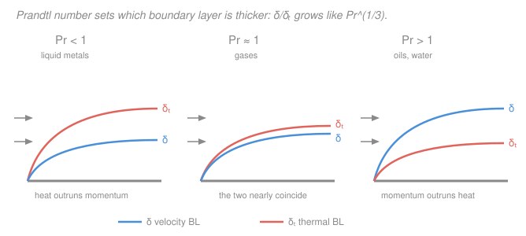

# Heat Transfer · Lesson 3.2: Dimensionless groups — Re, Pr, Nu

> ⏱ ~15 min · Module 3: Convection · Builds on: [3.1 The convection coefficient and boundary layers](03-01-convection-coefficient-boundary-layers.md) · Unlocks: 3.3 (external flow), 3.4 (internal flow), 3.5 (natural convection) — all of them are "pick the right $Nu=f(Re,Pr)$"

## Why this matters

In [3.1](03-01-convection-coefficient-boundary-layers.md) we found that the convection coefficient $h$ is not a material property — it depends on the fluid, the speed, the geometry, and where you are in the boundary layer. That sounds hopeless: a different experiment for every pipe, every wind speed, every fluid. This lesson is the rescue. Three dimensionless numbers — **Reynolds, Prandtl, Nusselt** — package all of that into a single universal relationship, $Nu=f(Re,Pr)$. One wind-tunnel test on one plate then predicts $h$ for *every* geometrically similar situation, at any scale, in any fluid. Every remaining convection lesson (3.3–3.6) is just a catalog of these $f$'s. Learn to read the three numbers and you can estimate almost any $h$.

## The idea

Physics doesn't care about your units — it cares about **ratios**. Whether a flow is fast isn't "10 m/s"; it's fast *relative to* how strongly viscosity can smear it out. Whether heat spreads quickly isn't "0.65 W/m·K"; it's quick *relative to* how quickly momentum spreads. Each of our three groups is one such ratio, and each answers one question:

- **Reynolds** $Re$ — *does the flow stay in neat layers or break into turbulence?* It compares the fluid's inertia (its tendency to barrel ahead) against viscosity (its tendency to stick and smooth). Big $Re$ = inertia wins = turbulent = thin boundary layer = better mixing = higher $h$.
- **Prandtl** $Pr$ — *which spreads faster from the wall, momentum or heat?* It's a property of the fluid alone. It decides whether the thermal boundary layer is thicker or thinner than the velocity one.
- **Nusselt** $Nu$ — *how much better is convection than just standing still?* It's the dimensionless $h$: the ratio of actual convective heat transfer to what pure conduction across the same fluid layer would give. $Nu=1$ means the moving fluid did nothing; $Nu=100$ means convection carries 100 times more.

The punchline, which we'll justify below: the first two ($Re$, $Pr$) are the *inputs* you can compute from the setup, and the third ($Nu$) is the *output* you want — and nature ties them together with a single function per geometry.

## The formal version

**Reynolds number** — inertia over viscous forces:

$$Re=\frac{\rho u L}{\mu}=\frac{u L}{\nu},\qquad \nu\equiv\frac{\mu}{\rho}.$$

Here $\rho$ = density (kg/m³), $u$ = characteristic velocity (m/s), $L$ = characteristic length (m — tube diameter, plate length, whatever the geometry names), $\mu$ = dynamic viscosity (Pa·s), and $\nu$ = kinematic viscosity (m²/s), the "momentum diffusivity." *In words: how hard the fluid pushes forward divided by how hard viscosity holds it back.* Past a critical value the flow trips to turbulence — for pipe flow near $Re\approx2300$, for a flat plate near $Re\approx5\times10^5$. Higher $Re$ also thins the boundary layer ($\delta\sim L/\sqrt{Re}$), which is why fast flow transfers heat better.

**Prandtl number** — momentum diffusivity over thermal diffusivity:

$$Pr=\frac{\nu}{\alpha}=\frac{\mu c_p}{k},\qquad \alpha\equiv\frac{k}{\rho c_p}.$$

$\alpha$ = thermal diffusivity (m²/s, from [1.2](01-02-heat-equation.md)), $c_p$ = specific heat (J/kg·K), $k$ = fluid conductivity (W/m·K). *In words: how fast a fluid spreads momentum compared to how fast it spreads heat.* It's built from fluid properties only — no velocity, no size. Its value sets the ratio of boundary-layer thicknesses:

$$\frac{\delta}{\delta_t}\approx Pr^{1/3}.$$

Oils have $Pr\gg1$ (momentum diffuses easily, heat sluggishly $\Rightarrow$ a *thin* thermal layer buried inside a thick velocity layer); gases have $Pr\approx1$ (the two layers nearly coincide); liquid metals have $Pr\ll1$ (heat races ahead $\Rightarrow$ a *thick* thermal layer).

**Nusselt number** — dimensionless convection coefficient:

$$Nu=\frac{h L}{k_f},$$

with $k_f$ = the **fluid's** conductivity (not the wall's) and $L$ the same characteristic length. *In words: the ratio of convective heat transfer to the conduction that would occur across a stationary fluid layer of thickness $L$.* Read it as $Nu=\dfrac{h}{k_f/L}=\dfrac{\text{convection}}{\text{pure conduction across the layer}}$. So $Nu=1$ means the fluid might as well be frozen solid — convection bought you nothing beyond conduction; $Nu>1$ is the payoff of motion.

**Why the correlations are universal.** Write the steady boundary-layer momentum and energy equations, then nondimensionalize: scale lengths by $L$, velocity by the free-stream $u_\infty$, and temperature by $T^*=\dfrac{T-T_s}{T_\infty-T_s}$. When you do, every dimensional constant collapses into groups, and only two survive: $Re$ appears as the lone parameter in the momentum equation, and $Re$ together with $Pr$ in the energy equation. So the dimensionless temperature field can depend on nothing but position and those two numbers, $T^*=T^*(x^*,y^*;Re,Pr)$. Since $h$ comes from the wall temperature gradient (that's [3.1](03-01-convection-coefficient-boundary-layers.md)), the dimensionless gradient — which *is* $Nu$ — can likewise depend only on

$$\boxed{\,Nu=f(Re,\,Pr)\,}$$

for a given geometry. *In words: strip the units and two geometrically similar flows with matching $Re$ and $Pr$ have identical dimensionless temperature fields — hence identical $Nu$.* That's **dynamic similarity**: the same reason a scale-model airplane in a wind tunnel predicts the full-size plane's drag (see [`fluid-dynamics` 3.1](../../fluid-dynamics/lessons/03-01-reynolds-number.md)). One measured curve $f$ covers an entire family of real situations. That is the entire logic of the next four lessons.

## Picture

## Worked examples

**Example 1 (compute $Re$ and $Pr$, classify the flow).** Water at $\approx330$ K (properties from Incropera tables: $\rho=984\ \mathrm{kg/m^3}$, $\mu=489\times10^{-6}\ \mathrm{Pa\cdot s}$, $k=0.650\ \mathrm{W/m\cdot K}$, $c_p=4184\ \mathrm{J/kg\cdot K}$) flows at $u=1\ \mathrm{m/s}$ through a tube of diameter $D=0.02\ \mathrm{m}$. The characteristic length for a pipe is $L=D$.

$$Re=\frac{\rho u D}{\mu}=\frac{984\times1\times0.02}{489\times10^{-6}}=\frac{19.68}{489\times10^{-6}}\approx4.0\times10^{4}.$$

Since $Re\approx40{,}000$ is well above the pipe-flow threshold $Re\approx2300$ (and past the $\sim10^4$ mark for fully turbulent), **the flow is turbulent.** And the Prandtl number:

$$Pr=\frac{\mu c_p}{k}=\frac{489\times10^{-6}\times4184}{0.650}=\frac{2.046}{0.650}\approx3.15.$$

*Check.* Both are dimensionless: $Re=\dfrac{(\mathrm{kg/m^3})(\mathrm{m/s})(\mathrm{m})}{\mathrm{Pa\cdot s}}$; since $\mathrm{Pa\cdot s}=\mathrm{kg/(m\cdot s)}$, the units cancel completely. ✓ And $Pr\approx3.15$ is the tabulated value for water at 330 K, and $Pr>1$ as expected for a liquid — its velocity layer outgrows its thermal layer. ✓ These two numbers are exactly what Boss Problem 3 and Lesson 3.4 feed into the Dittus–Boelter correlation to get $Nu$.

**Example 2 (turn a given $Nu$ into $h$).** Suppose a correlation returns $Nu=50$ for that same water-in-tube case. Recover the convection coefficient by unfolding the definition $Nu=hL/k_f$, using $k_f=0.650\ \mathrm{W/m\cdot K}$ (the *fluid's* conductivity) and $L=D=0.02\ \mathrm{m}$:

$$h=\frac{Nu\,k_f}{D}=\frac{50\times0.650}{0.02}=\frac{32.5}{0.02}=1625\ \mathrm{W/m^2\cdot K}.$$

Interpret the two numbers. $Nu=50$ says convection moves **50 times** more heat than a stagnant 2-cm-thick slug of water would by conduction alone — the motion is doing serious work. And $h\approx1600\ \mathrm{W/m^2\cdot K}$ is a textbook figure for forced convection of water: orders of magnitude above natural convection in air ($h\sim5$–$25$) and above forced air ($h\sim50$–$250$), which is why water-cooled everything.

*Check.* $\dfrac{[\,\cdot\,](\mathrm{W/m\cdot K})}{\mathrm{m}}=\mathrm{W/m^2\cdot K}$, the right units for $h$. ✓ And $Nu=50\gg1$, consistent with vigorous turbulent flow beating pure conduction handily. ✓

## Watch out

- **You might think $Nu$ and $Bi$ are the same number** — both are $hL/k$. They are not. The Biot number ([2.1](02-01-lumped-capacitance-biot.md)) uses the **solid's** conductivity $k_s$ and asks "is the *solid* internally uniform?"; the Nusselt number uses the **fluid's** conductivity $k_f$ and asks "how good is convection in the *fluid*?" Same algebra, opposite material, opposite question. Grabbing the wrong $k$ is the classic slip.
- **You might think a bigger $h$ always means a bigger $Nu$.** Only at fixed $k_f$ and $L$. A liquid metal can have enormous $h$ yet a modest $Nu$ because its $k_f$ is huge; a gas can have a large $Nu$ with a small $h$. $Nu$ measures convection *relative to that fluid's own conduction*, not absolute heat transfer.
- **You might reuse the same $L$ everywhere.** The "characteristic length" is defined per geometry — diameter for a pipe, distance from the leading edge for a plate, $V/A_s$ elsewhere. $Re$, $Nu$, and any correlation must all use the *same* $L$, and it must be the one the correlation was fitted with. Mixing lengths silently corrupts every number.

## One-liner

> $Re$ (inertia/viscous) and $Pr$ (momentum/heat diffusivity) are the inputs, $Nu=hL/k_f$ (convection/conduction) is the output, and nondimensionalizing the boundary layer proves $Nu=f(Re,Pr)$ — so one experiment sizes $h$ for every similar flow.

## Problems

**P1 (🟢)** Air at $300$ K ($\rho=1.16\ \mathrm{kg/m^3}$, $\mu=184\times10^{-7}\ \mathrm{Pa\cdot s}$, $k=0.0263\ \mathrm{W/m\cdot K}$, $c_p=1007\ \mathrm{J/kg\cdot K}$) flows at $u=10\ \mathrm{m/s}$ over a flat plate. At a distance $x=0.1\ \mathrm{m}$ from the leading edge, compute $Re_x$ and $Pr$. Is the boundary layer laminar there (transition at $Re_x\approx5\times10^5$)?

**P2 (🟢)** For that air flow a correlation gives $\overline{Nu}_L=45$ over a plate of length $L=0.1\ \mathrm{m}$. Find the average convection coefficient $\bar h$.

**P3 (🔴)** Engine oil at $300$ K has $Pr\approx6400$; mercury (a liquid metal) has $Pr\approx0.025$. For each, estimate the ratio $\delta/\delta_t$ of velocity- to thermal-boundary-layer thickness, and say in one sentence which boundary layer is thicker and what that means for where the temperature drop happens.

Solutions

**P1** Characteristic length for a plate is the distance from the leading edge, $x=0.1\ \mathrm{m}$:

$$Re_x=\frac{\rho u x}{\mu}=\frac{1.16\times10\times0.1}{184\times10^{-7}}=\frac{1.16}{1.84\times10^{-5}}\approx6.3\times10^{4}.$$

$$Pr=\frac{\mu c_p}{k}=\frac{184\times10^{-7}\times1007}{0.0263}=\frac{0.01853}{0.0263}\approx0.70.$$

Since $Re_x\approx6.3\times10^4$ is below the transition value $5\times10^5$, **the boundary layer is laminar** at that station. *Check.* $Pr\approx0.70$ is the standard tabulated value for air (a gas, so $Pr\approx1$ and the two boundary layers nearly coincide). ✓ Both groups dimensionless. ✓

**P2** Unfold $\overline{Nu}_L=\bar h L/k_f$ with the fluid conductivity $k_f=0.0263\ \mathrm{W/m\cdot K}$ and $L=0.1\ \mathrm{m}$:

$$\bar h=\frac{\overline{Nu}_L\,k_f}{L}=\frac{45\times0.0263}{0.1}=\frac{1.1835}{0.1}\approx11.8\ \mathrm{W/m^2\cdot K}.$$

*Check.* Units $\dfrac{\mathrm{W/m\cdot K}}{\mathrm{m}}=\mathrm{W/m^2\cdot K}$ ✓, and $\bar h\sim12$ is a believable figure for forced air over a plate — far below the water value of Example 2, exactly because air is a poor conductor. ✓

**P3** Use $\delta/\delta_t\approx Pr^{1/3}$.

Oil: $\delta/\delta_t\approx(6400)^{1/3}\approx18.6$ — the velocity layer is roughly **19 times thicker** than the thermal layer. The entire temperature change is crammed into a razor-thin sheet right at the wall, so the wall gradient (and $h$) is steep.

Mercury: $\delta/\delta_t\approx(0.025)^{1/3}\approx0.29$ — the thermal layer is about **3.4 times thicker** than the velocity layer ($\delta_t/\delta\approx1/0.29$). Heat diffuses far out into fluid that is barely moving; temperature spreads well beyond the region that has felt the wall's drag.

*Check.* $Pr>1\Rightarrow\delta>\delta_t$ (oil) and $Pr<1\Rightarrow\delta<\delta_t$ (mercury), matching the two outer panels of the figure. ✓ Cube roots keep the ratios modest even though the $Pr$'s span five orders of magnitude — the $1/3$ power is doing heavy lifting. ✓

## Flashback

**From Lesson 3.1 (The convection coefficient and boundary layers):** A hot plate sits in air at $T_\infty=20^\circ\mathrm{C}$; its surface is at $T_s=50^\circ\mathrm{C}$. At the wall, the measured temperature gradient in the air is $\left.\dfrac{\partial T}{\partial y}\right|_{y=0}=-5000\ \mathrm{K/m}$ (temperature falls off as you move into the fluid). With air conductivity $k_f=0.0263\ \mathrm{W/m\cdot K}$, find the local convection coefficient $h$.

Solution

At the wall the fluid isn't moving (no-slip), so heat crosses the very first layer by conduction — Fourier's law gives the wall flux, and Newton's cooling law must reproduce it. Equating the two:

$$h=\frac{-k_f\left.\dfrac{\partial T}{\partial y}\right|_{y=0}}{T_s-T_\infty}=\frac{-(0.0263)(-5000)}{50-20}=\frac{131.5}{30}\approx4.4\ \mathrm{W/m^2\cdot K}.$$

*Check.* Units: $\dfrac{(\mathrm{W/m\cdot K})(\mathrm{K/m})}{\mathrm{K}}=\mathrm{W/m^2\cdot K}$ ✓. The gradient is negative (fluid cools away from the hot wall) and $T_s-T_\infty>0$, so $h>0$ as it must be. And $h\approx4$–$5\ \mathrm{W/m^2\cdot K}$ is right in the natural-convection-of-air range — consistent with a plate just sitting in still air. ✓ This is exactly the wall-gradient definition that, once nondimensionalized, *becomes* the Nusselt number of this lesson.

## Connections

- **Backward:** the wall-gradient origin of $h$ from [3.1](03-01-convection-coefficient-boundary-layers.md) is what nondimensionalizes into $Nu$; the thermal diffusivity $\alpha=k/\rho c_p$ inside $Pr$ is the same one that set transient timescales in [1.2](01-02-heat-equation.md) and the Biot/Fourier work of [Module 2](02-01-lumped-capacitance-biot.md). Contrast $Nu=hL/k_f$ with $Bi=hL/k_s$ — same form, fluid vs. solid conductivity.
- **Forward:** every convection lesson ahead is one specific $f$ in $Nu=f(Re,Pr)$ — [3.3](03-03-external-forced-convection.md) (flat plate $Nu_x=0.332\,Re_x^{1/2}Pr^{1/3}$, cylinders), [3.4](03-04-internal-forced-convection.md) (Dittus–Boelter $Nu=0.023\,Re^{4/5}Pr^{n}$), and [3.5](03-05-natural-convection.md), which swaps $Re$ for the Rayleigh number when buoyancy, not a pump, drives the flow.
- **Sideways (fluid dynamics):** the Reynolds number and dynamic similarity here are imported wholesale from [`fluid-dynamics` 3.1](../../fluid-dynamics/lessons/03-01-reynolds-number.md) — heat transfer just adds a second dimensionless group, $Pr$, to carry the thermal side. This shared machinery is the heart of transport phenomena: the momentum boundary layer and the thermal boundary layer obey the same nondimensional equations, differing only by the factor $Pr$.
