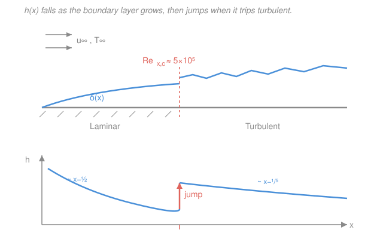

# Heat Transfer · Lesson 3.3: External forced convection

> ⏱ ~15 min · Module 3: Convection · Builds on: [3.1 Convection coefficient & boundary layers](03-01-convection-coefficient-boundary-layers.md), [3.2 Re, Pr, Nu](03-02-dimensionless-groups-re-pr-nu.md) · Unlocks: [3.4 Internal forced convection](03-04-internal-forced-convection.md)

## Why this matters

In [3.2](03-02-dimensionless-groups-re-pr-nu.md) you learned that convection collapses into $Nu = f(Re, Pr)$ — but that's a promise, not a number. This lesson cashes it in. For the everyday geometries where fluid streams *past* an object with open space all around — wind over a roof, air over a cooling fin, coolant across a bundle of nuclear fuel pins — engineers long ago measured $f$ and boiled it down to plug-and-play correlations. The whole skill is: identify the geometry, compute $Re$, read off the right correlation, and out drops $\bar h$. Get that reflex and you can size the convective cooling of almost any exposed surface.

## The idea

Picture wind blowing along a flat plate. Right at the leading edge the fluid slams into stationary surface and a razor-thin **boundary layer** — the slowed-down region where the fluid feels the wall — begins to grow. It's thin, so temperature and velocity change steeply across it, which means heat crosses it *easily*: $h$ is large at the front. As you move downstream the layer thickens, the gradients slacken, and $h$ **falls off** like $x^{-1/2}$.

Then something dramatic happens. Past a critical distance the smooth, layered (**laminar**) flow becomes chaotic and swirling (**turbulent**). Those swirls physically ferry hot fluid away from the wall far more effectively than orderly laminar sliding ever could — so at transition $h$ **jumps back up** and thereafter decays only gently ($x^{-1/5}$). That single picture — thin-then-thick, laminar-then-turbulent — is the spine of every external-flow correlation. The only questions are *which regime am I in* (that's $Re$) and *how does this fluid trade momentum for heat* (that's $Pr$).

One habit locks it all together: fluid properties change with temperature, and the fluid near the wall sits between the surface and the free stream. So we evaluate every property at the **film temperature** $T_f = (T_s + T_\infty)/2$ — the average of wall and stream. Do this before touching a correlation.

## The formal version

**Flat plate, laminar.** Solving the boundary-layer equations (Blasius) gives the *local* Nusselt number a distance $x$ from the leading edge,

$$Nu_x = \frac{h_x\,x}{k} = 0.332\,Re_x^{1/2}\,Pr^{1/3}, \qquad Re_x = \frac{u_\infty x}{\nu},$$

valid for $Pr \gtrsim 0.6$. *In words: local heat transfer grows like the square root of how far the flow has run.* Here $h_x$ is the local coefficient ($\mathrm{W/(m^2 K)}$), $k$ the fluid conductivity ($\mathrm{W/(m\,K)}$), $u_\infty$ the free-stream speed (m/s), $x$ the distance from the leading edge (m), and $\nu$ the kinematic viscosity ($\mathrm{m^2/s}$).

Averaging $h_x$ from $0$ to $L$ (the integral of $x^{-1/2}$ doubles the trailing-edge value) gives the plate-average number we actually design with:

$$\boxed{\;\overline{Nu}_L = \frac{\bar h L}{k} = 0.664\,Re_L^{1/2}\,Pr^{1/3}\;}\qquad (Re_L < 5\times10^5).$$

*In words: the average coefficient over a laminar plate is exactly twice the local coefficient at its trailing edge.*

**Transition.** Laminar flow trips to turbulent near

$$Re_{x,c} \approx 5\times10^5 \quad\Longrightarrow\quad x_c = \frac{Re_{x,c}\,\nu}{u_\infty}.$$

If the whole plate sits below this, it's laminar everywhere and the boxed formula is the whole story.

**Flat plate, turbulent.** Where the layer is turbulent the local number steepens its $Re$ dependence:

$$Nu_x = 0.0296\,Re_x^{4/5}\,Pr^{1/3}.$$

*In words: turbulent mixing makes $h$ far less eager to fade downstream* ($h_x \propto x^{-1/5}$ instead of $x^{-1/2}$).

**Flat plate, mixed.** If the plate is long enough that it starts laminar and ends turbulent, averaging *both* pieces (with $Re_{x,c} = 5\times10^5$) gives the mixed-boundary-layer average

$$\overline{Nu}_L = \big(0.037\,Re_L^{4/5} - 871\big)\,Pr^{1/3},$$

valid for $5\times10^5 \le Re_L \le 10^8$. The $-871$ subtracts off the turbulent formula's over-count of the front laminar stretch.

**Cylinder in cross-flow.** Flow *across* a tube (wind on a wire, coolant across a pipe) separates behind the cylinder, so there's no tidy closed form — but the data fit the **Hilpert** power law

$$\overline{Nu}_D = C\,Re_D^{m}\,Pr^{1/3}, \qquad Re_D = \frac{u_\infty D}{\nu},$$

with $C$ and $m$ read from a table keyed on $Re_D$ (properties at $T_f$):

| $Re_D$ range | $C$ | $m$ |
|---|---|---|
| 0.4 – 4 | 0.989 | 0.330 |
| 4 – 40 | 0.911 | 0.385 |
| 40 – 4 000 | 0.683 | 0.466 |
| 4 000 – 40 000 | 0.193 | 0.618 |
| 40 000 – 400 000 | 0.027 | 0.805 |

*In words: as the flow speeds up the exponent $m$ climbs — faster flow buys more heat transfer, and increasingly so.* The single-correlation **Churchill–Bernstein** form spans all $Re_D\,Pr>0.2$ in one (uglier) expression,

$$\overline{Nu}_D = 0.3 + \frac{0.62\,Re_D^{1/2}Pr^{1/3}}{\left[1+(0.4/Pr)^{2/3}\right]^{1/4}}\left[1+\left(\frac{Re_D}{282{,}000}\right)^{5/8}\right]^{4/5},$$

and reduces to a pure-conduction floor $\overline{Nu}_D \to 0.3$ as the flow dies.

**Sphere (Whitaker).** For flow over a sphere, properties at $T_\infty$ except $\mu_s$ at the surface:

$$\overline{Nu}_D = 2 + \big(0.4\,Re_D^{1/2} + 0.06\,Re_D^{2/3}\big)Pr^{0.4}\left(\frac{\mu}{\mu_s}\right)^{1/4}.$$

*In words: even in dead-still fluid a sphere loses heat by conduction alone, so $\overline{Nu}_D \to 2$* (the exact conduction answer for a sphere in an infinite medium).

**The drag–heat analogy.** Friction and heat transfer are two faces of the same boundary layer, tied by the **Reynolds / Chilton–Colburn analogy**

$$\frac{C_f}{2} = St\,Pr^{2/3}, \qquad St = \frac{Nu}{Re\,Pr} = \frac{\bar h}{\rho\,u_\infty c_p}\quad(0.6 < Pr < 60),$$

where $C_f$ is the skin-friction coefficient and $St$ the Stanton number. *In words: measure the drag on a surface and you've essentially measured its heat transfer — whatever slows the fluid also carries away heat.*

## Picture

## Worked examples

**Example 1 (flat plate — the full drill).** Air at $T_\infty = 300\ \mathrm{K}$ blows at $u_\infty = 10\ \mathrm{m/s}$ over a plate of length $L = 0.5\ \mathrm{m}$ held at $T_s = 350\ \mathrm{K}$. Find $\bar h$ and the heat loss per unit width.

*Step 1 — film temperature and properties.* $T_f = (350+300)/2 = 325\ \mathrm{K}$. Air at 325 K (Incropera Table A.4, interpolated): $\nu = 18.4\times10^{-6}\ \mathrm{m^2/s}$, $k = 0.0282\ \mathrm{W/(m\,K)}$, $Pr = 0.704$.

*Step 2 — Reynolds number, pick the regime.*

$$Re_L = \frac{u_\infty L}{\nu} = \frac{10 \times 0.5}{18.4\times10^{-6}} = 2.72\times10^5.$$

Since $2.72\times10^5 < 5\times10^5$, the plate is **laminar over its whole length** — use the boxed average formula.

*Step 3 — average Nusselt, then $\bar h$.*

$$\overline{Nu}_L = 0.664\,Re_L^{1/2}Pr^{1/3} = 0.664\,(521.3)(0.704)^{1/3} = 0.664 \times 521.3 \times 0.890 = 308.$$

$$\bar h = \frac{\overline{Nu}_L\,k}{L} = \frac{308 \times 0.0282}{0.5} = 17.4\ \mathrm{W/(m^2\,K)}.$$

*Step 4 — heat rate per unit width.* Per meter of width the area is $A' = L = 0.5\ \mathrm{m^2/m}$, so by Newton's law of cooling

$$q' = \bar h\,A'\,(T_s - T_\infty) = 17.4 \times 0.5 \times (350-300) = 434\ \mathrm{W/m}.$$

*Check.* Units: $[\overline{Nu}\,k/L] = \mathrm{W/(m\,K)}/\mathrm{m} = \mathrm{W/(m^2K)}$ ✓; $q' = \mathrm{W/(m^2K)}\cdot\mathrm{m}\cdot\mathrm{K} = \mathrm{W/m}$ ✓. Sanity: $\bar h \approx 17$ is a very typical free-stream-air value (air convection lives in the 10–100 range), and $Re$ being safely sub-critical confirms we chose the laminar branch correctly.

**Example 2 (cylinder in cross-flow).** Air at $T_\infty = 300\ \mathrm{K}$ flows at $u_\infty = 5\ \mathrm{m/s}$ across a heated pipe of diameter $D = 0.05\ \mathrm{m}$ whose surface is at $T_s = 400\ \mathrm{K}$. Find $\bar h$ and the heat loss per unit length.

*Step 1 — film temperature and properties.* $T_f = (400+300)/2 = 350\ \mathrm{K}$. Air at 350 K: $\nu = 20.9\times10^{-6}\ \mathrm{m^2/s}$, $k = 0.0300\ \mathrm{W/(m\,K)}$, $Pr = 0.700$.

*Step 2 — Reynolds number, pick $C$ and $m$.*

$$Re_D = \frac{u_\infty D}{\nu} = \frac{5 \times 0.05}{20.9\times10^{-6}} = 1.20\times10^4.$$

This lands in the $4{,}000$–$40{,}000$ row: $C = 0.193$, $m = 0.618$.

*Step 3 — Hilpert correlation.*

$$\overline{Nu}_D = C\,Re_D^{m}\,Pr^{1/3} = 0.193\,(1.20\times10^4)^{0.618}(0.700)^{1/3} = 0.193 \times 331 \times 0.888 = 56.7.$$

$$\bar h = \frac{\overline{Nu}_D\,k}{D} = \frac{56.7 \times 0.0300}{0.05} = 34.0\ \mathrm{W/(m^2\,K)}.$$

*Step 4 — heat rate per unit length.* The lateral area per meter is $A' = \pi D = \pi(0.05) = 0.157\ \mathrm{m^2/m}$:

$$q' = \bar h\,(\pi D)\,(T_s - T_\infty) = 34.0 \times 0.157 \times 100 = 534\ \mathrm{W/m}.$$

*Check.* Units of $\bar h$ as before ✓; $q' = \mathrm{W/(m^2K)}\cdot\mathrm{m}\cdot\mathrm{K} = \mathrm{W/m}$ ✓. Sanity: the cross-flow cylinder's $\bar h \approx 34$ beats the flat plate's 17 — bluff-body separation and the higher $Re$ both stir the fluid harder, exactly what you'd expect.

## Watch out

- **You might evaluate properties at $T_\infty$ (or $T_s$).** For external forced convection, use the **film temperature** $T_f = (T_s+T_\infty)/2$ for $\nu, k, Pr$. (Exceptions carry their own rule: the sphere's Whitaker correlation uses $T_\infty$ with a separate $\mu_s$ at the surface.) Using the wrong temperature can shift $\nu$ by 20–30% and quietly corrupt $Re$.
- **You might reach for the turbulent (or mixed) plate formula by reflex.** Always compute $Re_L$ *first*. Below $5\times10^5$ the plate is laminar end-to-end and the mixed formula's $-871$ term would be flat wrong. Only use $(0.037\,Re_L^{4/5}-871)\,Pr^{1/3}$ once $Re_L$ actually exceeds the critical value.
- **You might confuse local $h_x$ with average $\bar h$.** The $0.332$ correlation gives the *local* coefficient at one station; the $0.664$ correlation gives the *plate average*. For a laminar plate the average is exactly $2\times$ the local value at the trailing edge — never plug $\overline{Nu}$'s constant into a local calculation or vice versa.

## One-liner

> Find $Re$, pick the correlation ($0.664\,Re_L^{1/2}Pr^{1/3}$ for a laminar plate, $C\,Re_D^m\,Pr^{1/3}$ for a cylinder) with properties at the film temperature, and $\overline{Nu}\cdot k/\text{length}$ hands you $\bar h$.

## Problems

**P1 (🟢)** Air at $T_\infty = 300\ \mathrm{K}$, $u_\infty = 6\ \mathrm{m/s}$ flows over a plate of length $L = 0.3\ \mathrm{m}$ with surface at $T_s = 350\ \mathrm{K}$. Using film-temperature air properties $\nu = 18.4\times10^{-6}\ \mathrm{m^2/s}$, $k = 0.0282\ \mathrm{W/(m\,K)}$, $Pr = 0.704$: compute $Re_L$, confirm the regime, and find $\bar h$.

**P2 (🟡)** For the plate in P1, at what distance $x_c$ from the leading edge would the flow trip to turbulent? Is the plate long enough to reach it? What would $x_c$ become if the speed were tripled to $18\ \mathrm{m/s}$?

**P3 (🔴, optional)** A long cylinder of diameter $D = 0.02\ \mathrm{m}$ sits in a $u_\infty = 20\ \mathrm{m/s}$ air cross-flow, $T_\infty = 300\ \mathrm{K}$, $T_s = 360\ \mathrm{K}$. With film-temperature air $\nu = 18.9\times10^{-6}\ \mathrm{m^2/s}$, $k = 0.0285\ \mathrm{W/(m\,K)}$, $Pr = 0.705$, find $\bar h$ and the heat loss per unit length using the Hilpert table.

Solutions

**P1** Reynolds number:

$$Re_L = \frac{u_\infty L}{\nu} = \frac{6 \times 0.3}{18.4\times10^{-6}} = \frac{1.8}{18.4\times10^{-6}} = 9.78\times10^4.$$

Since $9.78\times10^4 < 5\times10^5$, the plate is **laminar** throughout. Then

$$\overline{Nu}_L = 0.664\,Re_L^{1/2}Pr^{1/3} = 0.664\,(312.8)(0.890) = 185,$$

using $Re_L^{1/2} = \sqrt{9.78\times10^4} = 312.8$ and $Pr^{1/3} = 0.704^{1/3} = 0.890$. Thus

$$\bar h = \frac{\overline{Nu}_L\,k}{L} = \frac{185 \times 0.0282}{0.3} = 17.4\ \mathrm{W/(m^2\,K)}.$$

*Check.* Units give $\mathrm{W/(m^2K)}$ ✓. It matches Example 1's $\bar h$ almost exactly — sensible, since dropping both $u_\infty$ and $L$ leaves $\bar h \propto \sqrt{u_\infty/L}$ nearly unchanged here ($\sqrt{6/0.3}=4.47$ vs $\sqrt{10/0.5}=4.47$, identical). ✓

**P2** Transition occurs where $Re_x = Re_{x,c} = 5\times10^5$:

$$x_c = \frac{Re_{x,c}\,\nu}{u_\infty} = \frac{(5\times10^5)(18.4\times10^{-6})}{6} = \frac{9.2}{6} = 1.53\ \mathrm{m}.$$

The plate is only $0.3\ \mathrm{m}$ long — far short of $1.53\ \mathrm{m}$ — so it never trips; **laminar everywhere**, consistent with P1. Tripling the speed to $18\ \mathrm{m/s}$ shrinks $x_c$ threefold (it's $\propto 1/u_\infty$):

$$x_c = \frac{9.2}{18} = 0.51\ \mathrm{m}.$$

Still longer than the $0.3\ \mathrm{m}$ plate, so even at $18\ \mathrm{m/s}$ this plate stays laminar.

*Check.* Units: $[\nu]/[u] = (\mathrm{m^2/s})/(\mathrm{m/s}) = \mathrm{m}$ ✓. Faster flow reaches critical $Re$ in a shorter distance — transition creeps toward the leading edge — which is the correct direction. ✓

**P3** Film temperature $T_f = (360+300)/2 = 330\ \mathrm{K}$ (properties given). Reynolds number:

$$Re_D = \frac{u_\infty D}{\nu} = \frac{20 \times 0.02}{18.9\times10^{-6}} = \frac{0.4}{18.9\times10^{-6}} = 2.12\times10^4.$$

This is in the $4{,}000$–$40{,}000$ Hilpert row: $C = 0.193$, $m = 0.618$. So

$$\overline{Nu}_D = 0.193\,(2.12\times10^4)^{0.618}(0.705)^{1/3} = 0.193 \times 472 \times 0.890 = 81.1,$$

using $(2.12\times10^4)^{0.618} = 472$ and $0.705^{1/3} = 0.890$. Then

$$\bar h = \frac{\overline{Nu}_D\,k}{D} = \frac{81.1 \times 0.0285}{0.02} = 116\ \mathrm{W/(m^2\,K)},$$

$$q' = \bar h\,(\pi D)(T_s - T_\infty) = 116 \times \pi(0.02) \times 60 = 116 \times 0.0628 \times 60 = 437\ \mathrm{W/m}.$$

*Check.* Units of $q'$: $\mathrm{W/(m^2K)}\cdot\mathrm{m}\cdot\mathrm{K} = \mathrm{W/m}$ ✓. The small, fast cylinder has a much larger $\bar h$ (116) than Example 2's (34) — smaller $D$ and higher $u_\infty$ both raise $Re_D$ and shrink the length scale in $\bar h = \overline{Nu}\,k/D$, so this is the right direction. ✓

## Flashback

**From Lesson 3.2 (Re, Pr, Nu):** Water at $T = 330\ \mathrm{K}$ flows at $u = 2\ \mathrm{m/s}$ along a $L = 0.1\ \mathrm{m}$ plate. Using $\rho = 984\ \mathrm{kg/m^3}$, $\mu = 489\times10^{-6}\ \mathrm{Pa\cdot s}$, $Pr = 3.15$: compute $Re_L$ and classify the flow. Then say what $Pr = 3.15$ tells you about the relative thicknesses of the velocity and thermal boundary layers.

Solution

Kinematic viscosity first: $\nu = \mu/\rho = 489\times10^{-6}/984 = 4.97\times10^{-7}\ \mathrm{m^2/s}$. Then

$$Re_L = \frac{u L}{\nu} = \frac{2 \times 0.1}{4.97\times10^{-7}} = \frac{0.2}{4.97\times10^{-7}} = 4.0\times10^5.$$

Since $4.0\times10^5 < 5\times10^5$, the flow is **laminar** (only just — a slightly longer or faster plate would trip it). As for $Pr = \nu/\alpha = 3.15 > 1$: momentum diffuses faster than heat, so the **velocity boundary layer is thicker than the thermal** one. Quantitatively $\delta/\delta_t \approx Pr^{1/3} = 3.15^{1/3} \approx 1.47$, so the velocity layer is about $1.5\times$ thicker.

*Check.* Units: $\nu = (\mathrm{Pa\cdot s})/(\mathrm{kg/m^3}) = \mathrm{m^2/s}$ ✓ ($\mathrm{Pa\cdot s} = \mathrm{kg/(m\,s)}$). $Re$ dimensionless ✓. Direction: $Pr>1$ (viscous, sluggish-heat fluids like water and oils) always gives a fatter velocity layer — matching the $Pr^{1/3}$ scaling baked into the $0.332$ and $0.664$ correlations. ✓

## Connections

- **Backward:** this lesson is [3.2](03-02-dimensionless-groups-re-pr-nu.md)'s $Nu = f(Re, Pr)$ made concrete — each correlation is that function pinned down for one geometry. The boundary-layer growth driving $h(x)$ down is the picture from [3.1](03-01-convection-coefficient-boundary-layers.md), and every heat rate still closes with Newton's cooling law $q = \bar h A (T_s - T_\infty)$ from [3.1](03-01-convection-coefficient-boundary-layers.md).
- **Forward:** [3.4 Internal forced convection](03-04-internal-forced-convection.md) turns the flow *inside* a duct, where the boundary layer eventually fills the pipe and the story shifts from "growing layer" to "fully developed" — a different critical $Re$ ($\approx 2300$) and different correlations ($Nu = 3.66$, Dittus–Boelter).
- **Sideways (fluids):** the very boundary layer that sets $h$ also sets skin-friction drag — the Blasius $Re^{1/2}$ scaling in [`fluid-dynamics`](../../fluid-dynamics/syllabus.md) is the *same* $Re^{1/2}$ in $Nu_x = 0.332\,Re_x^{1/2}Pr^{1/3}$, and the Reynolds/Chilton–Colburn analogy $C_f/2 = St\,Pr^{2/3}$ makes that shared origin exact: a drag measurement is a heat-transfer measurement in disguise.
