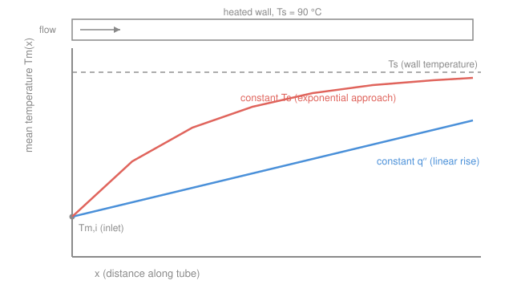

# Heat Transfer · Lesson 3.4: Internal forced convection

> ⏱ ~15 min · Module 3: Convection · Builds on: [3.2 Re, Pr, Nu](03-02-dimensionless-groups-re-pr-nu.md), [3.3 External forced convection](03-03-external-forced-convection.md), [`engineering-thermodynamics` 2.3 SFEE](../../engineering-thermodynamics/lessons/02-03-mass-energy-balance-control-volumes.md) · Unlocks: Boss problem 3, [4.4 Heat exchangers (LMTD)](04-04-heat-exchangers-lmtd.md) tube-side $h$

## Why this matters

Every heat exchanger, engine coolant loop, solar collector, and nuclear fuel channel is fluid running through a pipe with a hot (or cold) wall. External flow (lesson [3.3](03-03-external-forced-convection.md)) had an undisturbed free stream at $T_\infty$ far away — a fixed reference temperature. Inside a pipe there **is** no far-away fluid: the wall heats *all* of it, so the fluid's own temperature climbs as it flows. That one difference changes everything about how you bookkeep the heat and where you get $h$. Get this lesson and you can size the tube side of any exchanger.

## The idea

Picture water entering a hot pipe. Right at the inlet the fluid is cold and the wall is hot — big temperature gap, fast heat transfer. Move downstream and the water has warmed up, so the gap shrinks and heat flows more slowly. The fluid **is being consumed as its own heat sink**. There's no fixed $T_\infty$ to measure against; the relevant reference keeps moving.

So we need a single number for "how hot is the fluid at this station." Not the wall value, not the centerline value — a flow-weighted average, the **mean (bulk) temperature** $T_m$. Think of slicing the pipe, dumping that slice into a cup, and stirring: the cup's temperature is $T_m$. It's the "mixing-cup" temperature, and it's exactly the temperature that carries the energy. That lets us write an energy balance on the fluid — which is just the steady-flow energy equation you already met in thermo — and it replaces $T_\infty$ in Newton's law of cooling.

Two things then remain: (1) *how big is $h$* inside a pipe, and (2) *how does $T_m$ grow down the length*. The answer to (1) is surprisingly tidy in laminar flow — $h$ settles to a **constant** once the flow is "fully developed." The answer to (2) depends on what you hold fixed at the wall: constant heat flux gives a straight-line rise; constant wall temperature gives an exponential approach.

## The formal version

**Mean temperature.** Define $T_m$ so that the enthalpy actually flowing past a cross-section equals $\dot m c_p T_m$:

$$\dot m\, c_p\, T_m = \int_{A_c} \rho\, u\, c_p\, T\; dA_c,$$

where $\dot m$ is the mass flow rate (kg/s), $c_p$ the specific heat (J/(kg·K)), $u$ the local axial velocity (m/s), $T$ the local temperature (K or °C), and $A_c$ the cross-sectional area (m²). *In words: $T_m$ is the velocity-weighted average temperature — the temperature the stream would have if you collected and stirred it.* It, not the centerline temperature, is what conservation of energy tracks.

**The energy balance = the SFEE.** Apply the steady-flow energy equation from [`engineering-thermodynamics` 2.3](../../engineering-thermodynamics/lessons/02-03-mass-energy-balance-control-volumes.md) to the fluid between inlet and outlet — no work, negligible KE/PE change — and all the wall heat goes into raising the stream's enthalpy:

$$\boxed{\,q = \dot m\, c_p\,(T_{m,o} - T_{m,i})\,}$$

*In words: total heat added equals mass flow times specific heat times the bulk-temperature rise* — this is precisely the SFEE $\dot q = \dot m c_p \Delta T$ wearing a heat-transfer uniform. This is the **bridge**: the same control-volume balance you used for turbines and nozzles now sets the fluid's temperature rise in a pipe. Here $T_{m,i}, T_{m,o}$ are the inlet/outlet mean temperatures and $q$ is the total wall heat rate (W).

**Newton's law, local form.** At each station the wall drives heat into the fluid against the *local* gap $T_s - T_m(x)$:

$$q''_s = h\,\big(T_s - T_m(x)\big),$$

with $q''_s$ the wall heat flux (W/m²) and $h$ the convection coefficient (W/(m²·K)). The reference temperature is $T_m(x)$, which moves — that's the whole novelty.

**Entry lengths and fully developed flow.** Near the inlet the velocity and temperature profiles are still forming. The **hydrodynamic entry length** (where the velocity profile finishes developing) for laminar flow is

$$x_{fd,h} \approx 0.05\, Re_D\, D,$$

and a comparable **thermal entry length** $x_{fd,t} \approx 0.05\, Re_D\, Pr\, D$. Past these, the flow is **fully developed**: the shape of the (dimensionless) profile stops changing with $x$, and — the key payoff — the Nusselt number becomes **constant**. Here $Re_D = \rho u_m D/\mu$ uses the mean velocity $u_m$ (m/s) and tube diameter $D$ (m); $\mu$ is viscosity (Pa·s).

**The flow regime.** For pipe flow the transition is at

$$Re_D = \frac{\rho\, u_m D}{\mu} \approx 2300 \quad(\text{laminar below; fully turbulent by }\sim 10^4).$$

**Fully developed laminar $Nu$ — constants.** For a circular tube, once fully developed,

$$Nu_D = 3.66 \;(\text{constant } T_s), \qquad Nu_D = 4.36 \;(\text{constant } q''_s).$$

*In words: in laminar pipe flow $Nu$ does not depend on $Re$ or $Pr$ at all — it's a pure number set by the tube geometry and the wall condition.* Then $h = Nu_D\,k/D$ is fixed the moment you know $k$ and $D$. (Contrast [3.3](03-03-external-forced-convection.md), where $Nu$ climbed with $Re^{1/2}$.)

**Turbulent $Nu$ — Dittus–Boelter.** For fully developed turbulent flow in a smooth tube ($Re_D \gtrsim 10^4$, $0.6 \le Pr \le 160$):

$$Nu_D = 0.023\, Re_D^{4/5}\, Pr^{\,n}, \qquad n = \begin{cases} 0.4 & \text{fluid being heated } (T_s > T_m)\\ 0.3 & \text{fluid being cooled } (T_s < T_m).\end{cases}$$

Evaluate properties at the mean bulk temperature. *In words: turbulent mixing restores the strong $Re$ dependence — faster flow, much bigger $h$.*

**Two wall conditions, two axial profiles.** How $T_m(x)$ grows depends on what the wall enforces:

- **Constant heat flux $q''_s$** (electric heater, uniform irradiation, a fuel rod). Each unit length adds the same heat, so $T_m$ rises **linearly**: $T_m(x) = T_{m,i} + \dfrac{q''_s\, P}{\dot m c_p}\,x$, with $P = \pi D$ the perimeter (m). Once fully developed, $h$ is constant, so the gap $T_s - T_m$ is constant too — the wall temperature runs parallel to $T_m$, a fixed distance above it.

- **Constant surface temperature $T_s$** (a condensing or boiling fluid on the other side, or a big isothermal bath). The gap shrinks as $T_m \to T_s$, so the rise **decays exponentially**. Integrating $q''_s = h(T_s - T_m)$ along the tube gives

$$\boxed{\;\frac{T_s - T_{m,o}}{T_s - T_{m,i}} = \exp\!\left(-\frac{h\, A_s}{\dot m\, c_p}\right)\;}$$

where $A_s = \pi D L$ is the wetted wall area (m²). *In words: the fluid approaches the wall temperature exponentially — the outlet gap is the inlet gap times $e^{-hA_s/(\dot m c_p)}$.* Solving for length to hit a target outlet:

$$L = -\frac{\dot m\, c_p}{h\, \pi D}\,\ln\!\frac{T_s - T_{m,o}}{T_s - T_{m,i}}.$$

## Picture

Both cases start at the inlet $T_{m,i}$. Constant $q''$ (blue) climbs at a fixed slope forever; constant $T_s$ (coral) bends over and asymptotes to the dashed wall line $T_s$, because the driving gap keeps shrinking.

## Worked examples

**Example 1 (Boss problem 3 — turbulent tube, $h$ then length).** Water enters a smooth tube of diameter $D = 0.02$ m at $T_{m,i} = 20\ ^\circ\mathrm{C}$ with mean velocity $u_m = 1$ m/s. The wall is held at $T_s = 90\ ^\circ\mathrm{C}$. Take water properties near the mean bulk temperature (Incropera tables, $\sim 330$ K): $\rho = 984\ \mathrm{kg/m^3}$, $\mu = 489\times 10^{-6}\ \mathrm{Pa\cdot s}$, $k = 0.650\ \mathrm{W/(m\cdot K)}$, $c_p = 4184\ \mathrm{J/(kg\cdot K)}$, $Pr = 3.15$.

*(a) Find $h$.* First the regime:

$$Re_D = \frac{\rho\, u_m D}{\mu} = \frac{984 \times 1 \times 0.02}{489\times 10^{-6}} = \frac{19.68}{489\times 10^{-6}} \approx 4.02\times 10^{4}.$$

That's well above $10^4$ — fully turbulent. The water is being *heated* ($T_s > T_m$), so $n = 0.4$ in Dittus–Boelter:

$$Nu_D = 0.023\, Re_D^{4/5}\, Pr^{0.4} = 0.023\,(40{,}200)^{0.8}(3.15)^{0.4}.$$

Compute the pieces: $(40{,}200)^{0.8} \approx 4830$ and $(3.15)^{0.4} \approx 1.58$, so

$$Nu_D = 0.023 \times 4830 \times 1.58 \approx 176.$$

Then

$$h = \frac{Nu_D\, k}{D} = \frac{176 \times 0.650}{0.02} \approx 5.7\times 10^{3}\ \mathrm{W/(m^2\,K)}.$$

*(b) Length to heat the water to $T_{m,o} = 60\ ^\circ\mathrm{C}$ at constant $T_s$.* Mass flow rate through the circular cross-section $A_c = \pi D^2/4$:

$$\dot m = \rho\, u_m\, \frac{\pi D^2}{4} = 984 \times 1 \times \frac{\pi (0.02)^2}{4} = 984 \times 3.142\times 10^{-4} \approx 0.309\ \mathrm{kg/s}.$$

Use the constant-$T_s$ length formula with inlet gap $90 - 20 = 70$ and outlet gap $90 - 60 = 30$:

$$L = -\frac{\dot m\, c_p}{h\, \pi D}\,\ln\!\frac{T_s - T_{m,o}}{T_s - T_{m,i}} = -\frac{0.309 \times 4184}{5700 \times \pi \times 0.02}\,\ln\!\frac{30}{70}.$$

Numerator $\dot m c_p = 0.309 \times 4184 \approx 1293\ \mathrm{W/K}$; denominator $h\pi D = 5700 \times 0.0628 \approx 359\ \mathrm{W/(m\cdot K)}$; and $\ln(30/70) = \ln(0.4286) = -0.847$:

$$L = -\frac{1293}{359}\,(-0.847) = 3.60 \times 0.847 \approx 3.0\ \mathrm{m}.$$

*Units/sanity check.* $\dot m c_p/(h\pi D)$ has units $\dfrac{\mathrm{W/K}}{\mathrm{W/(m\cdot K)}} = \mathrm{m}$ ✓, and $\ln$ of a ratio is dimensionless ✓. Physically, a 3-metre run of 2-cm tube to go from 20 to 60 °C against a 90 °C wall is reasonable for fast turbulent water. As a cross-check, the heat delivered is $q = \dot m c_p (T_{m,o}-T_{m,i}) = 1293 \times 40 \approx 51.7$ kW — the same SFEE that a turbine energy balance uses.

**Example 2 (laminar contrast — how much $h$ collapses).** Keep the *same* tube ($D = 0.02$ m, same water) but throttle the flow to $u_m = 0.05$ m/s. Now

$$Re_D = \frac{984 \times 0.05 \times 0.02}{489\times 10^{-6}} = \frac{0.984}{489\times 10^{-6}} \approx 2.0\times 10^{3} < 2300,$$

so the flow is **laminar**. With the wall at fixed $T_s$, the fully developed value is simply $Nu_D = 3.66$ — no $Re$, no $Pr$:

$$h = \frac{Nu_D\, k}{D} = \frac{3.66 \times 0.650}{0.02} \approx 119\ \mathrm{W/(m^2\,K)}.$$

*Sanity check / the point.* Dropping the velocity 20-fold pushed us from turbulent to laminar, and $h$ fell from $\sim 5700$ to $\sim 119\ \mathrm{W/(m^2 K)}$ — a factor of **~48**, far more than the 20× speed change. In laminar flow $h$ is *locked* by geometry ($3.66\,k/D$); it can't be improved by nudging the flow rate, only by turbulence, a smaller $D$, or a higher-$k$ fluid. This is why heat-exchanger tubes are run turbulent whenever pumping power allows.

## Watch out

- **You might think you compare the fluid to $T_\infty$ like in external flow.** There is no $T_\infty$ inside a pipe — the reference is the *moving* mean temperature $T_m(x)$. Newton's law is $q'' = h(T_s - T_m(x))$, and $T_m$ climbs as the fluid absorbs heat.
- **You might expect $Nu$ to grow with $Re$ in laminar pipe flow.** It doesn't — fully developed laminar $Nu$ is a *constant* (3.66 or 4.36). The wall condition, not the flow rate, picks which constant. The $Re$-dependence only returns once the flow is turbulent (Dittus–Boelter).
- **You might use $n = 0.4$ every time.** The Dittus–Boelter exponent flips with the direction of heat flow: $n = 0.4$ when the fluid is being *heated* ($T_s > T_m$), $n = 0.3$ when it's being *cooled*. It's a small correction, but check which way the heat goes.
- **You might mix up the two axial profiles.** Constant $q''$ gives a *linear* $T_m(x)$ with a *constant* wall-to-fluid gap; constant $T_s$ gives an *exponential* approach with a *shrinking* gap. The exponential formula only applies to the isothermal-wall case.

## One-liner

> Inside a pipe the fluid is its own heat sink: track the mixing-cup temperature $T_m$ via the SFEE $q=\dot m c_p\Delta T$, get $h$ from a *constant* $Nu$ (3.66 / 4.36) if laminar or Dittus–Boelter if turbulent, and let $T_m$ rise linearly (constant $q''$) or approach $T_s$ exponentially (constant $T_s$).

## Problems

**P1 (🟢)** Air flows through a $D = 0.01$ m tube with $Re_D = 1500$. The wall carries a uniform electric heat flux (constant $q''$). Take $k_{\text{air}} = 0.026\ \mathrm{W/(m\cdot K)}$. Is the flow laminar or turbulent? Find the fully developed $h$.

**P2 (🟡)** Water ($\dot m = 0.2$ kg/s, $c_p = 4180\ \mathrm{J/(kg\cdot K)}$) enters a tube at $30\ ^\circ\mathrm{C}$. The wall is isothermal at $T_s = 80\ ^\circ\mathrm{C}$, and the tube provides $h A_s = 900\ \mathrm{W/K}$. Find the outlet mean temperature $T_{m,o}$ and the total heat rate $q$.

**P3 (🔴)** A tube with constant wall flux $q''_s = 2000\ \mathrm{W/m^2}$, diameter $D = 0.015$ m, carries water at $\dot m = 0.05$ kg/s, $c_p = 4180\ \mathrm{J/(kg\cdot K)}$, entering at $25\ ^\circ\mathrm{C}$. Over a length $L = 4$ m, find the outlet mean temperature. If the fully developed $h = 600\ \mathrm{W/(m^2 K)}$, what is the wall temperature $T_s$ at the outlet?

Solutions

**P1** $Re_D = 1500 < 2300$, so the flow is **laminar**. Constant heat flux → $Nu_D = 4.36$. Then

$$h = \frac{Nu_D\, k}{D} = \frac{4.36 \times 0.026}{0.01} = \frac{0.1134}{0.01} \approx 11.3\ \mathrm{W/(m^2\,K)}.$$

*Check.* Units $\mathrm{(W/(m\cdot K))/m = W/(m^2 K)}$ ✓. Air's low $k$ plus laminar flow gives a tiny $h$ — exactly why air-side coefficients are the bottleneck in most exchangers. We correctly used $4.36$ (constant $q''$), not $3.66$.

**P2** Isothermal wall, so use the exponential-approach formula with $hA_s/(\dot m c_p)$ in the exponent:

$$\frac{hA_s}{\dot m c_p} = \frac{900}{0.2 \times 4180} = \frac{900}{836} = 1.077.$$

$$\frac{T_s - T_{m,o}}{T_s - T_{m,i}} = e^{-1.077} = 0.341 \;\Longrightarrow\; T_s - T_{m,o} = 0.341\,(80 - 30) = 0.341 \times 50 = 17.0\ \mathrm{^\circ C}.$$

So $T_{m,o} = 80 - 17.0 = 63.0\ ^\circ\mathrm{C}$. Heat rate from the SFEE:

$$q = \dot m c_p (T_{m,o} - T_{m,i}) = 0.2 \times 4180 \times (63.0 - 30) = 836 \times 33.0 \approx 2.76\times 10^{4}\ \mathrm{W} \approx 27.6\ \mathrm{kW}.$$

*Check.* The outlet sits between inlet (30) and wall (80), as it must for a heated stream ✓. Exponent dimensionless ✓; $q$ in $\mathrm{kg/s \cdot J/(kg\,K) \cdot K = W}$ ✓.

**P3** Constant flux: total heat is flux × wetted area, $q = q''_s\, (\pi D L)$:

$$q = 2000 \times \pi \times 0.015 \times 4 = 2000 \times 0.1885 = 377\ \mathrm{W}.$$

From the SFEE, $q = \dot m c_p (T_{m,o} - T_{m,i})$:

$$T_{m,o} = T_{m,i} + \frac{q}{\dot m c_p} = 25 + \frac{377}{0.05 \times 4180} = 25 + \frac{377}{209} = 25 + 1.80 = 26.8\ ^\circ\mathrm{C}.$$

At the outlet, Newton's law with the *local* mean temperature gives the wall temperature. Since $h$ and $q''$ are both constant, the gap $T_s - T_m = q''_s/h$ is constant everywhere:

$$T_s - T_m = \frac{q''_s}{h} = \frac{2000}{600} = 3.33\ ^\circ\mathrm{C} \;\Longrightarrow\; T_s(\text{outlet}) = 26.8 + 3.33 = 30.1\ ^\circ\mathrm{C}.$$

*Check.* Modest heating (a 1.8 °C bulk rise) because 377 W is small against a heavy, high-$c_p$ stream ✓. The wall sits a fixed 3.3 °C above the fluid — the signature of constant-flux flow, where the wall runs parallel to $T_m$ ✓.

## Flashback

**From Lesson 3.3 (External forced convection):** Air at $u_\infty = 2$ m/s flows over a flat plate of length $L = 0.5$ m held above the air temperature. Using air properties $\nu = 15.9\times 10^{-6}\ \mathrm{m^2/s}$, $k = 0.0263\ \mathrm{W/(m\cdot K)}$, $Pr = 0.707$ (Incropera, $\sim 300$ K), find the **average** convection coefficient $\overline h$ over the plate. (Assume laminar all the way.)

Solution

Reynolds number over the full plate:

$$Re_L = \frac{u_\infty L}{\nu} = \frac{2 \times 0.5}{15.9\times 10^{-6}} = \frac{1}{15.9\times 10^{-6}} \approx 6.29\times 10^{4}.$$

That's below the transition $Re_{x,c} \approx 5\times 10^5$, so laminar is valid. Use the flat-plate average correlation $\overline{Nu}_L = 0.664\, Re_L^{1/2}\, Pr^{1/3}$:

$$\overline{Nu}_L = 0.664 \times (6.29\times 10^{4})^{1/2} \times (0.707)^{1/3} = 0.664 \times 250.8 \times 0.891 \approx 148.$$

$$\overline h = \frac{\overline{Nu}_L\, k}{L} = \frac{148 \times 0.0263}{0.5} \approx 7.8\ \mathrm{W/(m^2\,K)}.$$

*Check.* Units $\mathrm{(W/(m\cdot K))/m = W/(m^2 K)}$ ✓; a single-digit $h$ is typical of gentle airflow over a plate. Note the *contrast with this lesson*: external flow uses $\overline{Nu} \propto Re^{1/2}$ with the fixed reference $T_\infty$, whereas internal laminar flow pins $Nu$ to a **constant** (3.66/4.36) against the *moving* reference $T_m$.

## Connections

- **Backward:** this reuses the dimensionless groups from [3.2](03-02-dimensionless-groups-re-pr-nu.md) ($Re_D$, $Pr$, $Nu_D = hD/k$) and mirrors [3.3](03-03-external-forced-convection.md)'s external correlations — but swaps the free-stream $T_\infty$ for the mixing-cup $T_m$. The axial energy balance *is* the SFEE from [`engineering-thermodynamics` 2.3](../../engineering-thermodynamics/lessons/02-03-mass-energy-balance-control-volumes.md): $q = \dot m c_p \Delta T$, the identical control-volume bookkeeping.
- **Forward:** the tube-side $h$ you compute here feeds directly into the overall coefficient $U$ of a heat exchanger in [4.4 LMTD](04-04-heat-exchangers-lmtd.md), and the constant-$T_s$ exponential is the seed of the log-mean temperature difference. It's also step (a)–(b) of **Boss problem 3**.
- **Sideways:** the constant-$q''$ linear rise is exactly how a nuclear fuel channel or an electrically heated test section behaves — uniform volumetric heating along the length — which is why reactor-thermal-hydraulics builds its coolant-temperature model on this same balance.
