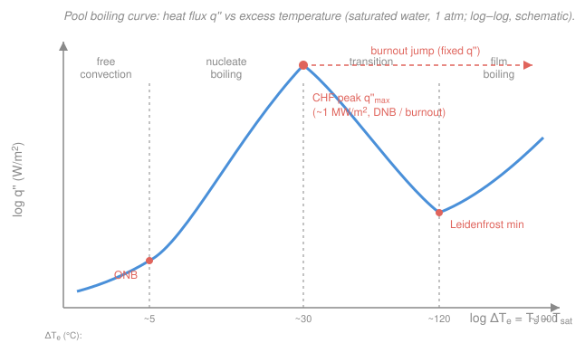

# Heat Transfer · Lesson 3.6: Boiling and condensation (a taste)

> ⏱ ~15 min · Module 3: Convection · Builds on: [3.4 Internal forced convection](03-04-internal-forced-convection.md), [3.5 Natural convection](03-05-natural-convection.md), [`engineering-thermodynamics` 1.2](../../engineering-thermodynamics/lessons/01-02-phase-behavior-pure-substance.md) · Unlocks: 4.4–4.5 (condensers & evaporators), reactor thermal-hydraulics

## Why this matters

Every convection coefficient you have estimated so far — flat plate, pipe flow, a warm plate in still air — has been *single-phase*. Those coefficients top out around a few thousand $\mathrm{W/(m^2\,K)}$ for water and single digits for air. Now let the fluid **boil or condense** and $h$ jumps one to two orders of magnitude, which is exactly why boilers, condensers, refrigerant evaporators, CPU cold plates, and reactor cores all run on phase change: it is how you dump a megawatt per square metre through a small piece of hardware. This is a **taste** — we read the curves and name the regimes, not memorize correlations. The one number that will follow you into reactor thermal-hydraulics is the **critical heat flux**: the ceiling you must never cross.

## The idea

Single-phase convection heats a fluid by making it *hotter* — you pay for every joule with a temperature rise (**sensible heat**, $q=\dot m\,c_p\,\Delta T$ from [`engineering-thermodynamics` 1.2](../../engineering-thermodynamics/lessons/01-02-phase-behavior-pure-substance.md)). Boiling is different: energy goes into ripping liquid into vapor at **nearly constant temperature**, stored as **latent heat**. Two things make this move enormous heat. First, latent heat is huge — vaporizing a kilogram of water takes about seven times the energy of heating it from room temperature to boiling. Second, the bubbles themselves *stir*: they nucleate at the hot wall, grow, detach, and drag cool liquid in behind them, agitating the boundary layer far more violently than any pump. So a tiny wall-superheat of a few degrees drives a colossal flux.

There is a catch, and it is the whole reason engineers respect boiling. Crank the wall hotter and hotter and the flux does **not** keep climbing. At some point the wall makes vapor so fast that a blanket of gas seals it off from the liquid. Vapor is a lousy conductor, so the wall suddenly can't shed its heat — and if you are holding the *heat input* fixed (an electric heater, a fuel rod), the wall temperature bolts upward until something melts. That cliff is **critical heat flux**, and the map of the whole story is the boiling curve.

## The formal version

**Latent heat.** The energy to vaporize a unit mass of saturated liquid is $h_{fg}$ (J/kg), the enthalpy of vaporization. The heat carried by a boiling mass flow is

$$q = \dot m\, h_{fg},$$

with $\dot m$ the vaporization rate (kg/s). *In words: multiply the boil-off rate by the latent heat and you have the power.* For water at 1 atm, $h_{fg}\approx 2257\ \mathrm{kJ/kg}$ — compare $c_p\approx 4.18\ \mathrm{kJ/(kg\,K)}$ for the sensible side.

**The driving temperature is now a superheat.** Newton's law of cooling still holds, $q'' = h\,\Delta T_e$, but the relevant difference is the **excess temperature** (wall superheat)

$$\Delta T_e \equiv T_s - T_{sat},$$

where $T_s$ is the surface temperature (K or $^\circ$C) and $T_{sat}$ is the saturation temperature of the liquid at the system pressure. What is dramatic is $h$: nucleate boiling of water runs $h\sim 10^4$–$10^5\ \mathrm{W/(m^2\,K)}$.

**The pool boiling curve.** Heat a wire or plate submerged in still, saturated liquid and plot $q''$ against $\Delta T_e$ on log–log axes (below). You pass through four regimes:

- **Free convection** ($\Delta T_e \lesssim 5\,^\circ$C for water): no bubbles yet; the wall drives ordinary single-phase natural convection — this is [3.5](03-05-natural-convection.md)'s physics.
- **Nucleate boiling** ($\approx 5$–$30\,^\circ$C): bubbles form at surface cavities (onset of nucleate boiling, **ONB**), first as isolated bubbles, then merging into columns and jets. $q''$ climbs steeply — this is the efficient, useful regime, and the one the **Rohsenow correlation** describes (named here, not derived).
- **Critical heat flux (CHF)**: the peak of the curve, $q''_{max}\approx 1\ \mathrm{MW/m^2}$ for water at 1 atm near $\Delta T_e\approx 30\,^\circ$C. Vapor is generated so fast it chokes off the liquid trying to rewet the surface. Also called the **boiling crisis** or, in flow boiling, **departure from nucleate boiling (DNB)**.
- **Transition boiling** ($\approx 30$–$120\,^\circ$C): a patchy, unstable vapor film flickers on and off; $q''$ actually *falls* as $\Delta T_e$ rises — the only regime where hotter means less heat.
- **Film boiling** (beyond the **Leidenfrost** minimum, $\Delta T_e\gtrsim 120\,^\circ$C): a stable, continuous vapor blanket insulates the wall; $q''$ creeps back up only slowly (now with a growing radiation contribution), while $T_s$ is enormous — hot enough to melt most metals.

*In words: boiling is not monotonic. Flux rises to a peak, collapses through an unstable middle, and limps back up once a vapor film has taken over.*

**Filmwise condensation.** Run it in reverse — vapor touching a cold vertical wall ($T_s < T_{sat}$) — and a liquid film forms and runs down under gravity. In **filmwise** condensation that film wets the whole surface, and *the film itself is the resistance*: latent heat released at the film's outer face must conduct across the liquid layer to reach the wall. **Nusselt's** 1916 analysis makes this quantitative with one clean idea:

$$h_x = \frac{k_\ell}{\delta(x)},\qquad\text{so}\qquad h \propto \frac{1}{\delta},$$

where $\delta(x)$ is the local film thickness (m) and $k_\ell$ the liquid conductivity. *In words: the condensation coefficient is just conduction across the film, so a thinner film means a bigger $h$.* Because the film thickens downward as $\delta\propto x^{1/4}$, the local coefficient thins out as $h_x\propto x^{-1/4}$. In **dropwise** condensation the surface does not wet — condensate beads up and rolls off, repeatedly baring fresh metal — giving $h$ up to roughly an order of magnitude higher. It is wonderful and, sadly, hard to sustain; design correlations assume the pessimistic filmwise case.

## Picture

## Worked examples

**Example 1 (read the curve — the burnout trap).** You are running a *flux-controlled* heater — an electric cartridge, or a nuclear fuel rod, where you dial in the **power** and the surface temperature settles to whatever it must. You sit in nucleate boiling just below CHF, say $q''=0.9\,q''_{max}$, at a comfortable $\Delta T_e\approx 25\,^\circ$C. Now you nudge the power up past the peak.

Follow the curve. Below CHF, each small increase in $q''$ is met by a small rise in $\Delta T_e$ along the steep nucleate branch — stable, self-correcting. But at the **peak** the nucleate branch ends. The next stable point that can carry your imposed flux is *way over on the film-boiling branch*, at $\Delta T_e$ of many hundreds of degrees (the coral dashed arrow in the figure — a horizontal jump at fixed $q''$). With the flux held fixed, the wall has no stable nucleate state to sit in, so its temperature **shoots up by hundreds of degrees** essentially instantaneously as an insulating vapor film clamps down. For water near $q''_{max}$ that overshoot easily exceeds the melting point of the heater — hence the names *burnout* and *boiling crisis*. This is why a reactor is designed with a **margin to DNB (critical heat flux ratio > 1)**: crossing the peak on a power-controlled surface is not a gentle degradation, it is a cliff. (A *temperature*-controlled surface, e.g. a condensing-steam bath, can instead traverse the peak smoothly — it is the flux-controlled boundary condition that makes CHF lethal.)

**Example 2 (order-of-magnitude — three modes, three orders).** How much bigger *is* a boiling coefficient? Line up the three modes we have met, each as a representative water/air $h$ in $\mathrm{W/(m^2\,K)}$:

| Mode | Where we met it | Representative $h$ |
|---|---|---|
| Air, natural convection | [3.5](03-05-natural-convection.md), warm plate in still air | $\sim 5$ |
| Water, forced convection | [3.4](03-04-internal-forced-convection.md), Dittus–Boelter in a tube | $\sim 3\times 10^3$ |
| Water, nucleate boiling | this lesson, near CHF | $\sim 3\times 10^4$ |

That is about **three orders of magnitude** from air natural convection to nucleate boiling. Put it in flux terms with $q''=h\,\Delta T_e$ at a modest $\Delta T_e=30\,^\circ$C: air natural convection manages $q''\approx 5\times 30 = 150\ \mathrm{W/m^2}$, water forced convection $\approx 9\times 10^4\ \mathrm{W/m^2}$, and nucleate boiling $\approx 9\times 10^5\ \mathrm{W/m^2}$ — essentially the $\sim 1\ \mathrm{MW/m^2}$ CHF ceiling. *Sanity check:* $h$ (near CHF) $= q''_{max}/\Delta T_e \approx (10^6\ \mathrm{W/m^2})/(30\ \mathrm{K}) \approx 3\times 10^4\ \mathrm{W/(m^2\,K)}$ ✓, consistent with the table. To move a megawatt per square metre by air natural convection you would need $\Delta T_e = q''/h = 10^6/5 = 2\times 10^5\ \mathrm{K}$ — absurd. That impossibility *is* the reason phase change exists in your thermal toolkit.

## Watch out

- **You might think boiling needs a big temperature difference to move big heat.** Backwards: nucleate boiling delivers $\sim 1\ \mathrm{MW/m^2}$ at a superheat of only $\sim 30\,^\circ$C, because the energy rides on latent heat and the bubbles do the stirring. The whole point is a huge flux for a *small* $\Delta T_e$.
- **You might think a hotter surface always transfers more heat.** True on the nucleate branch, false past CHF: in transition boiling $q''$ *decreases* as $\Delta T_e$ increases, and in film boiling the wall is scaldingly hot yet passes relatively little flux. The curve is non-monotonic — that hump is the entire safety story.
- **You might think film boiling is just "vigorous boiling."** It is nearly the opposite — a continuous vapor blanket that *insulates* the wall (low vapor conductivity), collapsing $h$ and sending $T_s$ soaring. The Leidenfrost droplet skating on a hot pan is film boiling: the vapor cushion is why the drop survives.
- **You might think dropwise vs filmwise is a minor detail.** Dropwise can give roughly $10\times$ the coefficient of filmwise, but it needs a non-wetting surface that real hardware fouls away within hours — so condensers are *designed* for filmwise, where the liquid film's conduction resistance sets $h$.

## One-liner

> Phase change moves enormous heat at nearly constant temperature because latent heat is huge and bubbles stir — but the boiling curve peaks at critical heat flux, past which a flux-controlled surface burns out.

## Problems

**P1 (🟢)** Saturated water at 1 atm is boiled off a heater at $\dot m = 0.010\ \mathrm{kg/s}$. Using $h_{fg}=2257\ \mathrm{kJ/kg}$, find the heat rate. Then compare it to the *sensible* heat needed to first warm that same flow from $20\,^\circ$C to $100\,^\circ$C ($c_p=4.18\ \mathrm{kJ/(kg\,K)}$). Which dominates, and by how much?

**P2 (🟡)** A flat heater boils water at 1 atm in the nucleate regime at $q''=0.60\ \mathrm{MW/m^2}$ with a measured wall superheat $\Delta T_e = 20\,^\circ$C. (a) Find the boiling coefficient $h$. (b) The same heater in *still air* (natural convection, $h_{air}\approx 5\ \mathrm{W/(m^2\,K)}$, $\Delta T=20\,^\circ$C) would pass what flux? Take the ratio and comment. (c) Is it safe to keep raising the power on this heater? Name the limit.

**P3 (🔴)** In Nusselt filmwise condensation the local coefficient scales as $h_x\propto x^{-1/4}$ down a vertical plate of height $L$, and the *average* over the plate works out to $\bar h = \tfrac{4}{3}h_L\propto L^{-1/4}$. A vertical condenser plate is replaced by one **twice as tall** (same everything else). By what factor does the average condensation coefficient change, and does the *total* condensation heat rate go up or down? (The wetted area doubles.)

Solutions

**P1** Latent (boiling) rate:

$$q_{boil} = \dot m\,h_{fg} = 0.010\ \tfrac{\mathrm{kg}}{\mathrm{s}} \times 2257\ \tfrac{\mathrm{kJ}}{\mathrm{kg}} = 22.6\ \mathrm{kW}.$$

Sensible rate to warm the same flow by $\Delta T = 80\,^\circ$C:

$$q_{sens} = \dot m\,c_p\,\Delta T = 0.010\times 4.18\times 80 = 3.34\ \mathrm{kW}.$$

Boiling dominates by $q_{boil}/q_{sens} = 2257/(4.18\times 80) = 2257/334 \approx 6.8$. *Check.* Units: $(\mathrm{kg/s})(\mathrm{kJ/kg}) = \mathrm{kW}$ ✓. The vaporization of water costs about $6.8\times$ the energy of heating it 80 degrees — the latent term is why phase-change hardware is compact.

**P2** (a) From $q''=h\,\Delta T_e$,

$$h = \frac{q''}{\Delta T_e} = \frac{0.60\times 10^6\ \mathrm{W/m^2}}{20\ \mathrm{K}} = 3.0\times 10^4\ \mathrm{W/(m^2\,K)}.$$

(b) Air natural convection at the same $\Delta T=20\ \mathrm{K}$: $q''_{air} = h_{air}\,\Delta T = 5\times 20 = 100\ \mathrm{W/m^2}$. Ratio $q''_{boil}/q''_{air} = 6\times 10^5/100 = 6\times 10^3$ — boiling moves about **6000 times** the flux of natural convection in air at the same temperature difference.

(c) No — not indefinitely. This is nucleate boiling and it is climbing toward the **critical heat flux** ($q''_{max}\approx 1\ \mathrm{MW/m^2}$ for water at 1 atm). Since $0.60\ \mathrm{MW/m^2}$ is already $\sim 60\%$ of CHF, further power increases approach the peak; crossing it on this flux-controlled heater triggers **burnout** (the wall jumps to film boiling and its temperature soars). *Check.* Units in (a): $(\mathrm{W/m^2})/\mathrm{K} = \mathrm{W/(m^2\,K)}$ ✓, and $3\times 10^4$ sits squarely in the nucleate-boiling range quoted in the lesson.

**P3** The average coefficient scales as $\bar h\propto L^{-1/4}$, so doubling $L$ multiplies it by

$$\frac{\bar h_{new}}{\bar h_{old}} = 2^{-1/4} = \frac{1}{2^{1/4}} \approx 0.841.$$

The taller plate has a coefficient about **16% lower** (the film has more length to thicken, and a thicker film is more resistance). But the *total* rate is $q = \bar h\,A\,\Delta T$, and the area doubles while $\Delta T$ is unchanged:

$$\frac{q_{new}}{q_{old}} = \frac{\bar h_{new}}{\bar h_{old}}\cdot\frac{A_{new}}{A_{old}} = 2^{-1/4}\times 2 = 2^{3/4} \approx 1.68.$$

So the total condensation heat rate goes **up** by about $68\%$ — the doubled area wins over the modestly weaker coefficient. *Check.* The area gain ($\times 2$) beats the coefficient loss ($\times 0.84$), and $2^{3/4}$ is the net; dimensionally $\bar h A\,\Delta T$ has units $\mathrm{W/(m^2K)}\cdot\mathrm{m^2}\cdot\mathrm{K}=\mathrm{W}$ ✓.

## Flashback

**From Lesson 3.5 (Natural convection):** A vertical plate $L = 0.30\ \mathrm{m}$ tall sits in still air; its surface is at $T_s = 60\,^\circ$C and the far air is at $T_\infty = 20\,^\circ$C. Estimate the average natural-convection coefficient $\bar h$. Use the vertical-plate correlation $\overline{Nu}_L = 0.59\,Ra_L^{1/4}$ (valid $10^4$–$10^9$), ideal-gas $\beta = 1/T_f$, and air properties at the film temperature (nearest Incropera table, 300 K): $\nu = 15.9\times 10^{-6}\ \mathrm{m^2/s}$, $\alpha = 22.5\times 10^{-6}\ \mathrm{m^2/s}$, $k = 0.0263\ \mathrm{W/(m\,K)}$.

Solution

Film temperature $T_f = (60+20)/2 = 40\,^\circ$C $= 313\ \mathrm{K}$, so $\beta = 1/T_f = 3.19\times 10^{-3}\ \mathrm{K^{-1}}$; temperature difference $\Delta T = 40\ \mathrm{K}$; $g = 9.81\ \mathrm{m/s^2}$.

Rayleigh number:

$$Ra_L = \frac{g\beta\,\Delta T\,L^3}{\nu\alpha} = \frac{9.81\times 3.19\times 10^{-3}\times 40 \times (0.30)^3}{15.9\times 10^{-6}\times 22.5\times 10^{-6}}.$$

Numerator: $9.81\times 3.19\times10^{-3} = 0.0313$; $\times 40 = 1.252$; $\times 0.027 = 0.0338$. Denominator: $15.9\times 22.5\times 10^{-12} = 3.58\times 10^{-10}$. So

$$Ra_L = \frac{0.0338}{3.58\times 10^{-10}} \approx 9.4\times 10^{7},$$

comfortably in the $10^4$–$10^9$ range. Then

$$\overline{Nu}_L = 0.59\,(9.4\times 10^{7})^{1/4} = 0.59\times 98.4 \approx 58,\qquad \bar h = \frac{\overline{Nu}_L\,k}{L} = \frac{58\times 0.0263}{0.30} \approx 5.1\ \mathrm{W/(m^2\,K)}.$$

*Check.* $Ra$ is dimensionless (all units cancel) ✓; $\bar h = Nu\,k/L$ has units $\mathrm{(W/mK)/m}=\mathrm{W/(m^2K)}$ ✓. And $\bar h\approx 5$ is exactly the "air, natural convection" entry used in Example 2 — a single-digit coefficient, three orders below the boiling numbers in this lesson. That contrast is the whole reason for the taste of phase change.

## Connections

- **Backward:** the free-convection foot of the boiling curve *is* [3.5](03-05-natural-convection.md)'s buoyancy-driven flow, and the whole lesson still runs on Newton's law of cooling $q''=h\,\Delta T$ — only now $\Delta T$ is a superheat and $h$ is huge. The latent heat $h_{fg}$ and the constant-$T$ character of phase change come straight from [`engineering-thermodynamics` 1.2](../../engineering-thermodynamics/lessons/01-02-phase-behavior-pure-substance.md); the boil-off power $q=\dot m\,h_{fg}$ is the phase-change cousin of the steady-flow energy balance $\dot q=\dot m\,c_p\,\Delta T$ you will reuse next.
- **Forward:** [4.4](04-04-heat-exchangers-lmtd.md)–[4.5](04-05-heat-exchangers-effectiveness-ntu.md) size **condensers and evaporators**, where one stream changes phase at constant temperature ($C\to\infty$, so $\Delta T$ on that side is fixed) — the boiling and condensing coefficients from this lesson set that side's contribution to the overall $UA$.
- **Sideways:** critical heat flux / departure from nucleate boiling is the central safety limit of **reactor thermal-hydraulics** — cores are operated with a margin (critical-heat-flux ratio > 1) precisely so the fuel never makes the flux-controlled jump from Example 1. Boiling and two-phase flow are also core topics of transport phenomena, extending the single-phase boundary-layer machinery of this module.
