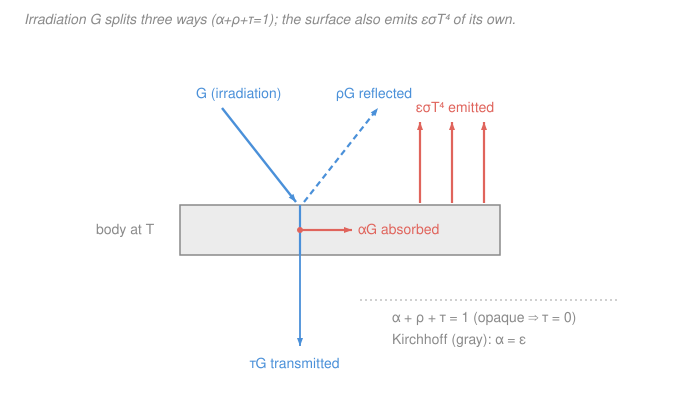

# Heat Transfer · Lesson 4.2: Real surfaces — emissivity and Kirchhoff

> ⏱ ~15 min · Module 4: Radiation and heat exchangers · Builds on: [4.1 Blackbody radiation](04-01-blackbody-radiation.md) · Unlocks: [4.3 View factors and radiation exchange](04-03-view-factors-radiation-exchange.md)

## Why this matters

The blackbody of [4.1](04-01-blackbody-radiation.md) is a fiction: nothing emits the full $\sigma T^4$, and nothing absorbs every photon that lands on it. Real surfaces fall short by a factor you can measure — the **emissivity** — and that single number is what makes radiation calculations *usable* for actual pipes, roofs, and spacecraft. Get it right and you can explain why a white roof stays cool in July, why the coating on a solar collector is nearly black to sunlight but shiny to its own heat, and why a thermos works. The whole radiation-exchange machinery of [4.3](04-03-view-factors-radiation-exchange.md) is built on the two properties introduced here: how well a surface emits, and how well it absorbs.

## The idea

Two things happen at every surface, and they're separate questions. **Emission:** how much of its *own* thermal radiation does the surface throw off, compared to a perfect blackbody at the same temperature? A dull black stove radiates almost like a blackbody; a polished mirror barely radiates at all. **Absorption:** of the radiation *arriving* from elsewhere, how much sticks? The rest bounces off (reflected) or, for a thin or clear material, passes straight through (transmitted). Those two fractions plus the pass-through must account for all the incoming energy — nothing vanishes.

Here's the beautiful part, and it's not obvious: a good *emitter* is automatically a good *absorber*. A surface that's excellent at throwing off radiation at a given wavelength is exactly as excellent at soaking it up. That's **Kirchhoff's law**, and it's forced by thermodynamics — if it weren't true you could build a surface that spontaneously heated itself hotter than its surroundings just by sitting there, a free-energy machine. So emissivity and absorptivity are two views of the same physical trait.

The catch — and it's the money-making catch — is *wavelength*. Kirchhoff pairs emission and absorption **at each wavelength**. A surface can be a fantastic absorber of short-wave sunlight yet a lousy emitter of its own long-wave infrared glow, because those live at different wavelengths. That mismatch is not a loophole in Kirchhoff; it's engineering. It's how you make a surface run hot in the sun or stay cool in the sun, on purpose.

## The formal version

**Emissivity.** For a real surface at temperature $T$ (in K), define

$$\varepsilon \equiv \frac{E}{E_b} = \frac{E}{\sigma T^4} \quad\Longrightarrow\quad E = \varepsilon\,\sigma T^4,$$

where $E$ is the surface's total emissive power ($\mathrm{W/m^2}$), $E_b=\sigma T^4$ is the blackbody value from [4.1](04-01-blackbody-radiation.md), and $\sigma = 5.67\times10^{-8}\ \mathrm{W/(m^2\,K^4)}$. *In words: emissivity is the fraction of blackbody emission a real surface actually delivers, so $\varepsilon\in[0,1]$ — 1 is a blackbody, 0 is a perfect mirror.* Always use **absolute** temperature in K.

**Splitting the incoming radiation.** Let $G$ be the **irradiation** — the radiation flux ($\mathrm{W/m^2}$) landing on the surface from all directions. It divides into three pieces:

$$\underbrace{\alpha}_{\text{absorbed}} + \underbrace{\rho}_{\text{reflected}} + \underbrace{\tau}_{\text{transmitted}} = 1,$$

where **absorptivity** $\alpha$, **reflectivity** $\rho$, and **transmissivity** $\tau$ are the dimensionless fractions of $G$ that are absorbed ($\alpha G$), reflected ($\rho G$), and transmitted through the body ($\tau G$). *In words: every arriving watt is absorbed, reflected, or passed through — it's just an energy balance on the surface.* For an **opaque** surface (a wall, a metal, thick paint) nothing gets through, so $\tau = 0$ and $\alpha + \rho = 1$: whatever isn't absorbed is reflected.

**Kirchhoff's law.** At each wavelength $\lambda$ and direction, for a surface in thermal equilibrium with its surroundings,

$$\varepsilon_\lambda = \alpha_\lambda.$$

*In words: at any given wavelength, a surface absorbs exactly as good a fraction as it emits.* This spectral, directional statement holds essentially always. The clean **total** form,

$$\varepsilon = \alpha \qquad\text{(gray surface),}$$

requires an extra assumption: the surface is **gray**, meaning $\varepsilon_\lambda$ (and hence $\alpha_\lambda$) does not vary with wavelength over the bands that matter. Only then can you pull a single $\varepsilon$ out of the wavelength integral and equate it to a single $\alpha$. When a surface is *not* gray — when its properties differ between, say, the solar band and the infrared band — the total $\alpha$ (which depends on the *incoming* spectrum) and the total $\varepsilon$ (which depends on the *surface's own* temperature) can be very different, even though $\varepsilon_\lambda = \alpha_\lambda$ still holds wavelength by wavelength.

**The working model.** For the exchange calculations in [4.3](04-03-view-factors-radiation-exchange.md) we assume surfaces are **gray** (properties $\lambda$-independent) and **diffuse** (emission and reflection are the same in all directions). Then one number $\varepsilon = \alpha$ per surface describes it, and the radiation-exchange network becomes tractable. State this assumption every time you use it — it's the modeling choice that makes the whole method work, and the one that fails for solar problems.

## Picture

## Worked examples

**Example 1 (net radiative exchange — a hot pipe in a room).** A bare steam pipe, outer diameter $D = 0.06\ \mathrm{m}$, length $L = 5\ \mathrm{m}$, surface temperature $T_s = 400\ \mathrm{K}$, emissivity $\varepsilon = 0.85$, runs through a large room whose walls are at $T_{sur} = 300\ \mathrm{K}$. How much heat does it lose *by radiation*?

A small gray object completely surrounded by much larger, cooler surroundings exchanges net radiation

$$q = \varepsilon\,\sigma A\left(T_s^4 - T_{sur}^4\right).$$

*Why this simple form?* The surroundings are so large that they act as a blackbody enclosure at $T_{sur}$ (they reabsorb essentially all the pipe's reflected radiation), so only the object's own $\varepsilon$ survives — the geometry drops out. We'll derive it properly as the small-object limit in [4.3](04-03-view-factors-radiation-exchange.md).

Area of the pipe: $A = \pi D L = \pi (0.06)(5) = 0.942\ \mathrm{m^2}$.

The temperature term (keep everything in K):

$$T_s^4 - T_{sur}^4 = 400^4 - 300^4 = 2.560\times10^{10} - 0.810\times10^{10} = 1.750\times10^{10}\ \mathrm{K^4}.$$

Then

$$q = (0.85)\big(5.67\times10^{-8}\big)(0.942)\big(1.750\times10^{10}\big) \approx 795\ \mathrm{W}.$$

*Units/sanity check.* $[\varepsilon][\sigma][A][T^4] = (1)\cdot\tfrac{\mathrm W}{\mathrm{m^2K^4}}\cdot\mathrm{m^2}\cdot\mathrm{K^4} = \mathrm{W}$ ✓. Sanity: the *flux* is $q/A \approx 843\ \mathrm{W/m^2}$; a blackbody ($\varepsilon=1$) would radiate $\sigma(T_s^4-T_{sur}^4) = 992\ \mathrm{W/m^2}$, and $0.85\times992 = 843$ ✓. Note this radiative loss (~0.8 kW) is comparable to what natural convection would carry off a pipe this hot — radiation is *not* negligible once surfaces get warm, precisely because of the $T^4$.

**Example 2 (why coatings matter — solar vs. IR on a roof).** Sunlight arrives as short-wave radiation (peak near $0.5\ \mathrm{\mu m}$); a surface at everyday temperatures ($\sim$300–600 K) emits long-wave infrared (peak near $5$–$10\ \mathrm{\mu m}$). A **non-gray** surface can have different properties in those two bands. Compare two roofs under solar irradiation $G_s = 800\ \mathrm{W/m^2}$, both good absorbers of sunlight ($\alpha_s = 0.9$), but differing in infrared emissivity:

- Roof A (ordinary dark paint, effectively gray): $\alpha_s = 0.9$, $\varepsilon = 0.9$.
- Roof B (**selective coating**): $\alpha_s = 0.9$, $\varepsilon = 0.1$ — nearly black to sunlight, nearly mirror-like in the IR.

Ignore convection for a moment (radiation-only ceiling) and balance absorbed sunlight against emitted IR at steady state:

$$\alpha_s\,G_s = \varepsilon\,\sigma\,T^4 \quad\Longrightarrow\quad T = \left(\frac{\alpha_s\,G_s}{\varepsilon\,\sigma}\right)^{1/4}.$$

Roof A ($\alpha_s = \varepsilon$, so the ratio is 1):

$$T_A = \left(\frac{0.9\times800}{0.9\times5.67\times10^{-8}}\right)^{1/4} = \left(\frac{800}{5.67\times10^{-8}}\right)^{1/4} \approx 345\ \mathrm{K}\ (72\,^\circ\mathrm{C}).$$

Roof B ($\alpha_s/\varepsilon = 9$):

$$T_B = \left(\frac{0.9\times800}{0.1\times5.67\times10^{-8}}\right)^{1/4} = \big(1.27\times10^{11}\big)^{1/4} \approx 597\ \mathrm{K}\ (324\,^\circ\mathrm{C}).$$

*Units/sanity check.* Inside the root: $\dfrac{\mathrm{W/m^2}}{\mathrm{W/(m^2K^4)}} = \mathrm{K^4}$, fourth root $=\mathrm K$ ✓. The **only** difference is the IR $\varepsilon$, and it splits the equilibrium temperature by $\sim$250 K. A poor IR emitter can't dump the sunlight it soaked up, so it runs scorching — that is exactly the trick of a **solar-absorber coating** (you *want* it hot). Flip the requirement and you get a **cool roof**: choose *low* solar $\alpha_s$ and *high* IR $\varepsilon$, and the surface stays near or below ambient. Neither is possible for a gray surface, where Kirchhoff forces $\alpha_s = \varepsilon$ and $T_A = 345\ \mathrm{K}$ is all you get. (Real roofs also lose heat by convection, which pulls both numbers down and keeps Roof B well under 597 K — but the *ordering and the large gap* survive, and that gap is the entire reason selective coatings exist.)

## Watch out

- **You might think Kirchhoff means $\varepsilon = \alpha$ always, so solar-selective surfaces violate physics.** They don't. Kirchhoff binds $\varepsilon_\lambda = \alpha_\lambda$ **at each wavelength**. A selective surface obeys it perfectly — it's just that its solar-band $\alpha$ (set by the sun's spectrum) and its IR-band $\varepsilon$ (set by its own temperature) live in different bands and needn't match. The total-property equality $\varepsilon=\alpha$ needs the extra *gray* assumption.
- **You might use $\Delta T$ or Celsius in the radiation term.** Never. $T^4$ is wildly nonlinear, so $T_s^4 - T_{sur}^4 \ne (T_s - T_{sur})^4$, and Celsius is meaningless to the fourth power. Convert to **kelvin** first, then raise to the fourth.
- **You might assume a good reflector is useless for staying cool.** For *staying cool in sunlight* a low-$\alpha_s$ (reflective in the solar band) surface is exactly right. But radiative cooling of a warm object to a cold sky wants the opposite in the IR band — *high* $\varepsilon$. "Shiny" isn't automatically "cool"; you must ask *shiny in which band*.

## One-liner

> Real surfaces emit $\varepsilon\sigma T^4$ and absorb $\alpha G$ with $\alpha+\rho+\tau=1$; Kirchhoff ties $\varepsilon_\lambda=\alpha_\lambda$ wavelength-by-wavelength, so $\varepsilon=\alpha$ only for gray surfaces — and the solar/IR mismatch of *non*-gray surfaces is what selective coatings sell.

## Problems

**P1 (🟢)** A spacecraft radiator panel of area $A = 2.5\ \mathrm{m^2}$ and emissivity $\varepsilon = 0.92$ is at $T_s = 320\ \mathrm{K}$, radiating to deep space at $T_{sur} \approx 0\ \mathrm{K}$. What is the radiative heat rejection?

**P2 (🟡)** An opaque surface is measured to reflect 30% of the radiation striking it. (a) What is its absorptivity in that band? (b) If the surface is gray, what is its emissivity, and what would its emissive power be at $T = 500\ \mathrm{K}$?

**P3 (🔴)** A flat plate in space absorbs solar flux $G_s = 1360\ \mathrm{W/m^2}$ on its sunlit face only, with solar absorptivity $\alpha_s$, and radiates from *both* faces (total area $2A$) with IR emissivity $\varepsilon$ to surroundings at $\approx 0\ \mathrm{K}$. Find the equilibrium temperature in terms of $\alpha_s/\varepsilon$, and evaluate it for a white paint ($\alpha_s = 0.25$, $\varepsilon = 0.88$). Why do satellite thermal engineers obsess over the ratio $\alpha_s/\varepsilon$?

Solutions

**P1** With $T_{sur}=0$ the surroundings return nothing, so $q = \varepsilon\sigma A\,T_s^4$:

$$q = (0.92)(5.67\times10^{-8})(2.5)(320^4).$$

$320^4 = (3.2\times10^2)^4 = 1.0486\times10^{10}\ \mathrm{K^4}$. Then

$$q = 0.92\times5.67\times10^{-8}\times2.5\times1.0486\times10^{10} \approx 1.37\times10^{3}\ \mathrm{W} \approx 1.37\ \mathrm{kW}.$$

*Check.* Units $\mathrm{W/(m^2K^4)}\cdot\mathrm{m^2}\cdot\mathrm{K^4}=\mathrm W$ ✓. Radiators are how spacecraft shed *all* their waste heat — no air to convect into — so this $T^4$ law sizes real hardware.

**P2** (a) Opaque means $\tau=0$, so $\alpha + \rho = 1$, giving $\alpha = 1 - 0.30 = 0.70$.
(b) Gray means $\varepsilon = \alpha = 0.70$. Emissive power:

$$E = \varepsilon\sigma T^4 = 0.70\times5.67\times10^{-8}\times500^4.$$

$500^4 = 6.25\times10^{10}$, so $E = 0.70\times5.67\times10^{-8}\times6.25\times10^{10} \approx 2.48\times10^{3}\ \mathrm{W/m^2} \approx 2.48\ \mathrm{kW/m^2}$.

*Check.* A blackbody at 500 K emits $\sigma T^4 = 3.54\ \mathrm{kW/m^2}$; $0.70\times3.54 = 2.48$ ✓. Note the gray assumption is doing real work in part (b): it's the only reason a *reflectivity* measurement lets us predict *emission*.

**P3** Steady state: absorbed solar (one face) = emitted IR (both faces):

$$\alpha_s\,G_s\,A = \varepsilon\,\sigma\,(2A)\,T^4 \quad\Longrightarrow\quad T = \left(\frac{\alpha_s\,G_s}{2\,\varepsilon\,\sigma}\right)^{1/4} = \left(\frac{\alpha_s}{\varepsilon}\cdot\frac{G_s}{2\sigma}\right)^{1/4}.$$

The area cancels; only the *ratio* $\alpha_s/\varepsilon$ and the solar constant remain. For white paint, $\alpha_s/\varepsilon = 0.25/0.88 = 0.284$:

$$T = \left(0.284\times\frac{1360}{2\times5.67\times10^{-8}}\right)^{1/4} = \big(0.284\times1.199\times10^{10}\big)^{1/4} = \big(3.41\times10^{9}\big)^{1/4} \approx 242\ \mathrm{K}.$$

*Check.* $242^4 \approx 3.43\times10^{9}$ ✓; units give K ✓. Engineers obsess over $\alpha_s/\varepsilon$ because it *alone* sets a passive surface's temperature in sunlight (geometry and area drop out): a low ratio (white paint, $\sim$0.28) runs cold ($\sim$242 K), a high ratio (bare polished metal, $\gg 1$) bakes. Choosing a coating *is* choosing $\alpha_s/\varepsilon$.

## Flashback

**From Lesson 4.1 (Blackbody radiation):** A blackbody's spectral emissive power peaks at wavelength $\lambda_{\max} = 1.45\ \mathrm{\mu m}$. Estimate its temperature, and say roughly what band its peak sits in. (Fresh variant — a different peak wavelength.)

Solution

Wien's displacement law: $\lambda_{\max}\,T = 2898\ \mathrm{\mu m\cdot K}$ (the blackbody peak shifts to shorter wavelengths as $T$ rises). Solve for $T$:

$$T = \frac{2898\ \mathrm{\mu m\cdot K}}{\lambda_{\max}} = \frac{2898}{1.45} \approx 2000\ \mathrm{K}.$$

*Check.* Units: $\mathrm{\mu m\cdot K}/\mathrm{\mu m} = \mathrm K$ ✓. A $1.45\ \mathrm{\mu m}$ peak is in the near-infrared, just past visible red — about the color of a bright tungsten filament or flowing lava, which matches a $\sim$2000 K source. This is the same law that puts the sun's $\sim$0.5 μm peak in the visible and a 300 K room's peak out at $\sim$10 μm — the *reason* solar and IR bands are so far apart, which is exactly what made Example 2's selective surface possible.

## Connections

- **Backward:** emissivity rescales the blackbody law $E_b=\sigma T^4$ from [4.1](04-01-blackbody-radiation.md) into the real-surface law $E=\varepsilon\sigma T^4$, and Wien's displacement law (also 4.1) is what separates the solar and IR bands that make non-gray behavior matter. The split $\alpha+\rho+\tau=1$ is just the surface energy-balance thinking from Module 1 applied to radiation.
- **Forward:** the **gray, diffuse** surface model ($\varepsilon=\alpha$, one number per surface) is the assumption that makes [4.3 View factors and radiation exchange](04-03-view-factors-radiation-exchange.md) solvable — each surface becomes a node with a surface resistance $\tfrac{1-\varepsilon}{\varepsilon A}$ in the radiosity network, and the small-object result $q=\varepsilon\sigma A(T_s^4-T_{sur}^4)$ used here is its simplest limit.
- **Sideways:** the solar/IR selectivity of Example 2 is the working principle of solar-thermal collector coatings, radiative-cooling paints, and spacecraft thermal control (the $\alpha_s/\varepsilon$ ratio of P3) — all real engineering built on the fact that Kirchhoff binds emission and absorption *per wavelength*, not in total. The radiation background here also connects to the thermodynamics-of-radiation ideas underlying [engineering-thermodynamics](../../engineering-thermodynamics/syllabus.md).
