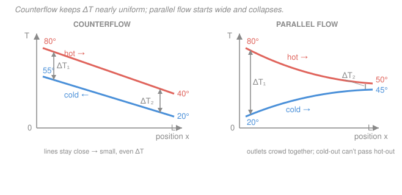

# Heat Transfer · Lesson 4.4: Heat exchangers I — the LMTD method

> ⏱ ~15 min · Module 4: Radiation & Exchangers · Builds on: [1.4 Thermal resistance networks](01-04-thermal-resistance-networks.md), [3.4 Internal forced convection](03-04-internal-forced-convection.md), [`engineering-thermodynamics` 2.5 (steady-flow energy balance)](../../engineering-thermodynamics/lessons/02-05-steady-flow-devices-no-work.md) · Unlocks: [4.5 Effectiveness–NTU](04-05-heat-exchangers-effectiveness-ntu.md)

## Why this matters

A heat exchanger is any device that moves heat from a hot stream to a cold one without mixing them: your car's radiator, a home boiler, the condenser at the back of a fridge, the feedwater heaters in a power plant, the intercooler on a turbo. Design questions come in two flavors. *Sizing*: "I need to cool 0.5 kg/s of water from 80 to 40 °C — how many square meters of tubing do I buy?" *Rating*: "I already have this exchanger — what outlet temperature will I actually get?" This lesson gives you the classic tool for the first question, the **log-mean temperature difference (LMTD)**, and shows why the same duty costs *less area* if you run the streams in opposite directions.

## The idea

Two things govern how fast heat crosses the wall between the streams: how good the wall is at conducting (the overall coefficient $U$ times area $A$, straight from [1.4](01-04-thermal-resistance-networks.md)'s resistance networks), and how big the temperature gap $\Delta T$ between the streams is. But here's the wrinkle that makes exchangers their own topic: **$\Delta T$ is not constant along the exchanger.** At the end where the hot stream enters, both streams are near their extreme temperatures; as they travel, the hot one cools and the cold one warms, so the gap shrinks (or shifts). You can't just multiply $UA$ by one $\Delta T$ — you need the *right average* of a gap that changes down the length.

The surprise is *which* average. Because heat flow at each point is proportional to the local gap, the gap decays **exponentially** along the length, not linearly. The correct average of an exponentially-varying gap is not the plain arithmetic mean of the two ends — it's the **log-mean**. Get that one number and the whole exchanger collapses back to a single clean formula, $q = UA\,\Delta T_{lm}$, that looks just like Newton's law of cooling for the whole device.

And the *arrangement* matters. Run the streams the same way (**parallel flow**) and they chase each other toward a common temperature — the gap starts huge and collapses. Run them opposite (**counterflow**) and the gap stays nearly uniform end to end, which — as we'll see — is thermodynamically the best you can do: smallest area for a given duty, and the only arrangement where the cold stream can leave *hotter* than the hot stream does.

## The formal version

**The energy balance (the SFEE bridge).** Take a steady exchanger with no work and negligible KE/PE changes. The [steady-flow energy equation from `engineering-thermodynamics` 2.5](../../engineering-thermodynamics/lessons/02-05-steady-flow-devices-no-work.md) applied to each stream says the heat one stream loses equals the enthalpy drop it carries, $\dot q = \dot m\,c_p\,\Delta T$. So the total duty $q$ (watts) is

$$q = \dot m_h c_{p,h}\,(T_{h,i}-T_{h,o}) = \dot m_c c_{p,c}\,(T_{c,o}-T_{c,i}).$$

*In words: heat given up by the hot stream = heat picked up by the cold stream = the duty.* Here $\dot m$ is mass flow rate (kg/s), $c_p$ specific heat (J/(kg·K)), and subscripts $h/c$ = hot/cold, $i/o$ = inlet/outlet. The product $C \equiv \dot m c_p$ (W/K) is the stream's **capacity rate** — how many watts it takes to move that stream one kelvin. We'll lean on it hard in [4.5](04-05-heat-exchangers-effectiveness-ntu.md).

**The overall $UA$.** The two streams are separated by a tube wall, so heat crosses three resistances in series exactly as in [1.4](01-04-thermal-resistance-networks.md): inside convection, wall conduction, outside convection. Their sum defines $UA$:

$$\frac{1}{UA} = \underbrace{\frac{1}{h_i A_i}}_{\text{inside}} + \underbrace{\frac{\ln(r_o/r_i)}{2\pi k L}}_{\text{wall}} + \underbrace{\frac{1}{h_o A_o}}_{\text{outside}}.$$

*In words: $UA$ is one over the total series resistance between the two fluids.* The inside coefficient $h_i$ is exactly the internal-convection $h$ you computed in [3.4](03-04-internal-forced-convection.md) (Dittus–Boelter). Because the inner and outer tube areas differ, $U$ alone is ambiguous — always the *product* $UA$ is unambiguous, so we carry $UA$.

**The LMTD result.** Track the local gap $\Delta T(x) = T_h(x) - T_c(x)$ down the length. Writing $dq = U\,\Delta T\,dA$ for a slice and combining with the energy balance shows $\Delta T$ decays exponentially in area. Integrating over the whole device gives

$$\boxed{\,q = UA\,\Delta T_{lm}, \qquad \Delta T_{lm} = \frac{\Delta T_1 - \Delta T_2}{\ln(\Delta T_1/\Delta T_2)}\,}$$

where $\Delta T_1$ and $\Delta T_2$ are the temperature gaps at the **two ends** of the exchanger. *In words: the exchanger behaves like a single Newton-cooling surface whose effective gap is the log-mean of its two terminal gaps.* Which physical temperatures make up $\Delta T_1,\Delta T_2$ depends on the arrangement:

| End gap | Parallel flow | Counterflow |
|---|---|---|
| $\Delta T_1$ | $T_{h,i}-T_{c,i}$ (both inlets) | $T_{h,i}-T_{c,o}$ (hot-inlet end) |
| $\Delta T_2$ | $T_{h,o}-T_{c,o}$ (both outlets) | $T_{h,o}-T_{c,i}$ (hot-outlet end) |

The log-mean always lies *below* the arithmetic mean $(\Delta T_1+\Delta T_2)/2$, and the more lopsided the two ends, the bigger the penalty. (If $\Delta T_1=\Delta T_2$ the formula is $0/0$; the limit is just $\Delta T_{lm}=\Delta T_1$.)

**Cross-flow and multipass: the correction factor $F$.** Real shell-and-tube and cross-flow units aren't pure counterflow — the flow paths partly parallel, partly cross. You handle them with a **correction factor** $F \le 1$ applied to the *counterflow* log-mean:

$$q = UA\,F\,\Delta T_{lm,CF}.$$

*In words: compute the log-mean as if it were counterflow, then discount it by $F$ to account for the messier real geometry.* You read $F$ off charts (or formulas) as a function of two dimensionless temperature ratios; $F$ near 1 means the unit is nearly as good as counterflow, and a design with $F<0.75$ is usually thrown out as wasteful.

## Picture

In **counterflow** (left) the two lines run nearly parallel — the gap $\Delta T_1$ at one end and $\Delta T_2$ at the other are close, so the log-mean stays large. In **parallel flow** (right) both streams enter the same end, so $\Delta T_1$ is enormous and $\Delta T_2$ collapses as the outlets crowd toward a common temperature — and crucially, the cold outlet can *never* climb past the hot outlet.

## Worked examples

**Example 1 — sizing a counterflow exchanger.** Cool $\dot m_h = 0.5\ \mathrm{kg/s}$ of hot water from $T_{h,i}=80\,^\circ\mathrm{C}$ to $T_{h,o}=40\,^\circ\mathrm{C}$, using cold water that enters at $T_{c,i}=20\,^\circ\mathrm{C}$ and leaves at $T_{c,o}=55\,^\circ\mathrm{C}$, in a **counterflow** unit with $U=1200\ \mathrm{W/(m^2K)}$. Take $c_{p}=4184\ \mathrm{J/(kg\,K)}$ (water near its 60 °C mean, Incropera tables). Find the required area.

*Duty from the hot stream (SFEE):*

$$q = \dot m_h c_p\,(T_{h,i}-T_{h,o}) = 0.5 \times 4184 \times (80-40) = 83{,}680\ \mathrm{W} \approx 83.7\ \mathrm{kW}.$$

*Terminal gaps (counterflow — pair each inlet with the far-end outlet):*

$$\Delta T_1 = T_{h,i}-T_{c,o} = 80-55 = 25\ \mathrm{K}, \qquad \Delta T_2 = T_{h,o}-T_{c,i} = 40-20 = 20\ \mathrm{K}.$$

*Log-mean:*

$$\Delta T_{lm} = \frac{\Delta T_1-\Delta T_2}{\ln(\Delta T_1/\Delta T_2)} = \frac{25-20}{\ln(25/20)} = \frac{5}{\ln 1.25} = \frac{5}{0.2231} = 22.4\ \mathrm{K}.$$

*Area:*

$$A = \frac{q}{U\,\Delta T_{lm}} = \frac{83{,}680}{1200 \times 22.4} = \frac{83{,}680}{26{,}890} \approx 3.11\ \mathrm{m^2}.$$

*Check.* Units: $\mathrm{W}/[\mathrm{(W/m^2K)}\cdot\mathrm{K}] = \mathrm{m^2}$ ✓. The log-mean 22.4 K sits just below the arithmetic mean $(25+20)/2 = 22.5$ K — barely, because the two ends are nearly equal, which is the signature of counterflow. ✓

**Example 2 — why counterflow, not parallel.** Try to do the *same job* — same four temperatures — in a **parallel-flow** unit, where both streams enter together. Now $\Delta T_1$ pairs the two inlets and $\Delta T_2$ pairs the two outlets:

$$\Delta T_1 = T_{h,i}-T_{c,i} = 80-20 = 60\ \mathrm{K}, \qquad \Delta T_2 = T_{h,o}-T_{c,o} = 40-55 = -15\ \mathrm{K}.$$

A **negative** end gap is nonsense: it says the cold outlet (55 °C) is *hotter* than the hot outlet (40 °C), so the streams would have to cross temperatures somewhere inside — and in parallel flow, marching side by side toward a common value, they physically can't. The log-mean $\ln(\Delta T_1/\Delta T_2)$ isn't even defined for a negative argument. **Parallel flow simply cannot deliver this duty.**

How far *could* parallel flow push the cold stream? With both streams running to infinite length they approach one common mixed temperature $T_\infty$ set by the capacity rates. Using $C_h = \dot m_h c_p = 2092\ \mathrm{W/K}$ and $C_c = \dot m_c c_p = 2391\ \mathrm{W/K}$ (from $\dot m_c = q/[c_p(T_{c,o}-T_{c,i})] = 0.571\ \mathrm{kg/s}$),

$$T_\infty = \frac{C_h T_{h,i} + C_c T_{c,i}}{C_h + C_c} = \frac{2092\times 80 + 2391\times 20}{2092+2391} = \frac{215{,}200}{4483} \approx 48\,^\circ\mathrm{C}.$$

So parallel flow caps the cold outlet at ~48 °C no matter how much area you buy — it can never reach 55 °C. **Counterflow has no such cap**: because fresh cold fluid meets the *coldest* hot fluid and warm cold fluid meets the *hottest* hot fluid, the cold outlet can exceed the hot outlet. That freedom is exactly why counterflow needs the least area (largest $\Delta T_{lm}$) and can hit outlet temperatures parallel flow can't touch.

## Watch out

- **You might think you average the two end gaps arithmetically.** For anything but nearly-equal ends, that overstates the true driving gap — the gap decays exponentially, so the *log*-mean is correct and always smaller. Using the arithmetic mean makes you buy too little area.
- **You might pair the temperatures wrong for counterflow.** $\Delta T_1$ is the gap *at one physical end of the box*. In counterflow the hot inlet sits at the same end as the cold *outlet*, so $\Delta T_1 = T_{h,i}-T_{c,o}$ — not $T_{h,i}-T_{c,i}$. Draw the box and read the gaps off the ends; don't pair inlet-with-inlet out of habit.
- **You might forget $F$ on a cross-flow or shell-and-tube unit.** The bare LMTD formula is for pure parallel or pure counterflow. A real multipass exchanger needs $q = UAF\,\Delta T_{lm,CF}$; skipping $F$ overestimates performance and undersizes the hardware.

## One-liner

> An exchanger obeys $q = UA\,\Delta T_{lm}$ with the *log*-mean of its two end gaps — and running the streams counter, not parallel, keeps that gap large so you buy the least area and can even push the cold outlet past the hot one.

## Problems

**P1 (🟢)** A counterflow oil cooler takes hot oil in at $120\,^\circ\mathrm{C}$ and out at $60\,^\circ\mathrm{C}$; cooling water runs $25\,^\circ\mathrm{C}$ in, $45\,^\circ\mathrm{C}$ out. Compute $\Delta T_1$, $\Delta T_2$, and $\Delta T_{lm}$.

**P2 (🟡)** In P1 the duty is $q = 90\ \mathrm{kW}$ and the overall coefficient is $U = 250\ \mathrm{W/(m^2K)}$. Find the required heat-transfer area $A$. Then say what happens to the required area if the same terminal temperatures were run in **parallel flow** instead (compute its $\Delta T_{lm}$ and compare).

**P3 (🔴)** A counterflow exchanger has *equal* capacity rates, $C_h = C_c$. Show that the two terminal gaps are equal ($\Delta T_1 = \Delta T_2$), so the temperature profiles are parallel straight lines and $\Delta T_{lm} = \Delta T_1$. (Hint: equal capacity rates mean equal temperature *changes* on each stream.)

Solutions

**P1** Counterflow: pair hot inlet with cold outlet, hot outlet with cold inlet.

$$\Delta T_1 = 120 - 45 = 75\ \mathrm{K}, \qquad \Delta T_2 = 60 - 25 = 35\ \mathrm{K}.$$
$$\Delta T_{lm} = \frac{75-35}{\ln(75/35)} = \frac{40}{\ln 2.143} = \frac{40}{0.7621} = 52.5\ \mathrm{K}.$$

*Check.* Lies below the arithmetic mean $(75+35)/2 = 55$ K, as the log-mean must. ✓

**P2** Counterflow area:

$$A = \frac{q}{U\,\Delta T_{lm}} = \frac{90{,}000}{250 \times 52.5} = \frac{90{,}000}{13{,}125} \approx 6.86\ \mathrm{m^2}.$$

Parallel flow, same temperatures — pair inlets together and outlets together:

$$\Delta T_1 = 120 - 25 = 95\ \mathrm{K}, \qquad \Delta T_2 = 60 - 45 = 15\ \mathrm{K},$$
$$\Delta T_{lm,\text{parallel}} = \frac{95-15}{\ln(95/15)} = \frac{80}{\ln 6.333} = \frac{80}{1.846} = 43.3\ \mathrm{K}.$$

Since $\Delta T_{lm}$ is smaller (43.3 vs 52.5 K), the parallel area is larger: $A = 90{,}000/(250\times 43.3) \approx 8.31\ \mathrm{m^2}$ — about 21% more metal for the identical duty. (Here parallel is at least *feasible*, since the cold outlet 45 °C stays below the hot outlet 60 °C — unlike Example 2.)

*Check.* Units $\mathrm{W}/[\mathrm{(W/m^2K)}\,\mathrm{K}] = \mathrm{m^2}$ ✓; counterflow wins, consistent with the lesson. ✓

**P3** Equal capacity rates: $C_h(T_{h,i}-T_{h,o}) = C_c(T_{c,o}-T_{c,i})$ with $C_h=C_c$ gives $T_{h,i}-T_{h,o} = T_{c,o}-T_{c,i}$, i.e. both streams change temperature by the same amount $\delta$. For counterflow,

$$\Delta T_1 = T_{h,i}-T_{c,o}, \qquad \Delta T_2 = T_{h,o}-T_{c,i} = (T_{h,i}-\delta) - (T_{c,o}-\delta) = T_{h,i}-T_{c,o} = \Delta T_1.$$

So the gap is constant along the whole length — the two profiles are parallel straight lines separated by a fixed $\Delta T_1$. The log-mean of two equal numbers is the number itself (take the limit $\Delta T_2 \to \Delta T_1$ in $(\Delta T_1-\Delta T_2)/\ln(\Delta T_1/\Delta T_2)$), so $\Delta T_{lm} = \Delta T_1$.

*Check.* This is the ideal counterflow case — perfectly uniform driving force, the largest possible $\Delta T_{lm}$ for given inlets, matching the left panel of the figure. ✓

## Flashback

**From Lesson 3.4 (Internal forced convection):** Hot water at a mean temperature near 330 K flows through a tube of inner diameter $D = 20\ \mathrm{mm}$ at mean velocity $u_m = 0.5\ \mathrm{m/s}$, being *cooled*. Find the inside convection coefficient $h_i$ (this is the $1/(h_iA_i)$ resistance in today's $UA$). Water properties at 330 K (Incropera): $\rho = 984\ \mathrm{kg/m^3}$, $\mu = 489\times10^{-6}\ \mathrm{Pa\cdot s}$, $k = 0.650\ \mathrm{W/(m\,K)}$, $Pr = 3.15$.

Solution

Reynolds number:

$$Re = \frac{\rho u_m D}{\mu} = \frac{984 \times 0.5 \times 0.020}{489\times10^{-6}} = \frac{9.84}{489\times10^{-6}} \approx 20{,}100.$$

That's well above 2300, so the flow is turbulent — use **Dittus–Boelter**, with $n=0.3$ because the water is being *cooled*:

$$Nu = 0.023\,Re^{4/5}Pr^{0.3} = 0.023\times(20{,}100)^{0.8}\times(3.15)^{0.3} = 0.023 \times 2773 \times 1.411 \approx 90.0.$$

Then

$$h_i = \frac{Nu\,k}{D} = \frac{90.0 \times 0.650}{0.020} \approx 2.9\times10^{3}\ \mathrm{W/(m^2K)}.$$

*Check.* Units: $Nu$ is dimensionless, so $h = Nu\,k/D$ has $\mathrm{(W/mK)/m = W/m^2K}$ ✓. A few thousand W/(m²K) is the right ballpark for turbulent water in a tube — much larger than air ($\sim$tens), which is why the *air* side usually limits $UA$. ✓ (Had the water been *heated* instead, $n=0.4$ would nudge $Nu$ and $h$ up a few percent.)

## Connections

- **Backward:** $UA$ is the series-resistance sum from [1.4](01-04-thermal-resistance-networks.md) with the inside $h$ supplied by [3.4](03-04-internal-forced-convection.md)'s Dittus–Boelter. The per-stream duty $q=\dot m c_p\,\Delta T$ is the [`engineering-thermodynamics` steady-flow energy balance](../../engineering-thermodynamics/lessons/02-05-steady-flow-devices-no-work.md) applied to a no-work device — the same equation that governs a boiler or condenser in a Rankine cycle.
- **Forward:** LMTD needs all four terminal temperatures — great for *sizing*, awkward for *rating* (unknown outlets force iteration). [4.5 Effectiveness–NTU](04-05-heat-exchangers-effectiveness-ntu.md) recasts everything in terms of the capacity rates $C = \dot m c_p$ introduced here and solves the rating problem in one shot, no LMTD loop.
- **Sideways:** the exponential decay of $\Delta T$ along the length is the same first-order-linear-ODE behavior as the lumped-capacitance cooling curve $\theta/\theta_i = e^{-t/\tau}$ from lumped analysis — a constant driving mechanism acting on a shrinking gap, whether the "coordinate" is time (transient cooling) or area (an exchanger).
