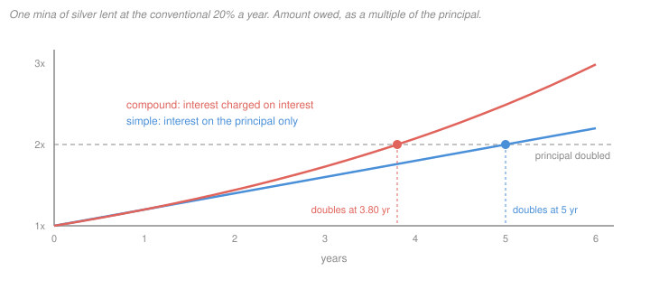

# A History of Debt · Lesson 1.1: Credit before coins

> ⏱ ~15 min · Module 1: Ancient debt: bondage and clean slates · Builds on: nothing (course entry point) · Unlocks: [1.2 Debt bondage and the royal clean slate](01-02-debt-bondage-and-the-royal-clean-slate.md)

## Why this matters

The textbook story says people first bartered, then invented money to make barter easier, and only much later started lending money at interest. The documents say otherwise. Loans with interest were being recorded in Mesopotamia some two thousand years before anyone struck a coin in Lydia (late seventh or early sixth century BC). Which came first is not trivia. If money began as a tool of exchange between strangers, debt is a late complication. If it began as a way of keeping score of obligations, debt is the thing money was made to measure. Every later episode in this course, from royal debt cancellations to Greek bailouts, sits on one of those two pictures.

## The idea

Picture a Babylonian village in spring. The barley from last harvest is gone, and the next harvest is months away. A farmer goes to the temple storehouse, or to a wealthier neighbour, and takes barley now against barley later. A scribe writes the debt on a clay tablet: how much, from whom, when it is due, and how much extra. Nobody hands over a coin, because none exist. The obligation is priced in **silver**, weighed out in shekels, or in **barley**, measured by volume. Most of the time no silver changes hands at all. Silver is the *unit of account*, the ruler against which debts are measured, and the debt is settled at harvest in whatever the debtor has.

That is credit without coins. And interest was built in from the start: the Sumerian word for it, *máš*, means a young goat, the "offspring" of the herd, just as the Greek *tokos* later meant both a child and interest.

Now set that beside Adam Smith. In *Wealth of Nations* (1776) he derives money from a "propensity to truck, barter, and exchange one thing for another" (I.2). Barter is clumsy, so prudent people start keeping a commodity everyone will take, and eventually settle on metals (I.4). David Graeber's *Debt: The First 5,000 Years* (2011) turns this around: no one has ever found a barter economy that money grew out of, and the earliest monetary records are ledgers of credit. This lesson teaches the Mesopotamian machinery and then tests which of Graeber's historical claims survive the evidence. Whether his larger thesis about what debt *is* holds up belongs to [`philosophy-of-debt`](../../philosophy-of-debt/syllabus.md).

## Source

Smith, *Wealth of Nations* I.4, "Of the Origin and Use of Money" (1776; public domain). He first sets up the barter problem with an example:

> The butcher has more meat in his shop than he himself can consume, and the brewer and the baker would each of them be willing to purchase a part of it.

But they have nothing the butcher wants, so no exchange happens. Smith then lists commodities said to have served as money (cattle in Homer, salt, shells, dried cod in Newfoundland, tobacco in Virginia) and ends with a case close to home:

> a village in Scotland, where it is not uncommon, I am told, for a workman to carry nails instead of money to the baker's shop or the ale-house.

Notice the grammar before the content. The butcher is a supposed case, not a report, and the nails come to Smith secondhand.

## The argument

**Smith's derivation (I.2 and I.4), in his terms.**

1. **Humans have a natural propensity to truck, barter and exchange,** and the division of labour grows out of it. *In words:* trade is basic to human nature, not something institutions invented.
2. **Once labour is divided, each person lives by exchanging his surplus.** *In words:* the butcher eats little of his own meat and needs other people's bread and beer.
3. **Direct barter often fails, because the other party may not want what you have.** *In words:* trade needs a "double coincidence of wants," as later economists called it.
4. **So every prudent man must have kept on hand some commodity that few would refuse.** *In words:* people solve the barter problem by holding something widely acceptable.
5. **Metals won out, because they last and divide without loss.** *In words:* the best such commodity is durable and divisible, so silver and gold beat cattle.
6. **∴ Money originates as a medium of exchange that emerged from barter.** *In words:* money is lubricated barter; credit comes later.

Dugald Stewart's name for this style of reasoning was *conjectural history*: how things must have gone, given human nature, where records are lacking.

**Graeber's historical counter-claims (2011, ch. 2 and after), paraphrased.**

1. **No barter economy of the kind Smith describes has ever been observed.** He leans on the anthropologist Caroline Humphrey's survey (1985), which, as he reads it, found barter mainly between strangers or enemies, or where a money system had broken down, not as the precursor of money. *In words:* the ethnographic record has no "before money" stage of neighbourly barter.
2. **Within communities, people ran tabs.** Neighbours gave and owed, and settled later. *In words:* the everyday problem was keeping score over time, not swapping on the spot.
3. **The earliest documented money was a unit of account for such debts,** as in Mesopotamian temple and palace accounts. *In words:* silver first mattered as a way to measure obligations, not as something that changed hands.
4. **Coins came much later,** tied to states, armies and markets. *In words:* cash came after credit, so the textbook order is backwards.
5. **∴ Credit came first; barter and coinage are later, often derivative, developments.**

**The arithmetic of the tablets.** Silver was weighed: 60 shekels to the mina, 60 minas to the talent, 180 grains to the shekel. Barley was measured by volume: in the Old Babylonian period, 300 *sila* to the *gur* (*kor*). The Laws of Eshnunna (§1) open with a tariff pricing one *gur* of barley at one shekel of silver. They also fix the conventional interest (§18A): 20% a year on silver and 33⅓% on barley. The same maxima appear in a section of Hammurabi's laws restored from other copies. The silver rate is usually glossed as one shekel per mina per month: $12/60 = 1/5$. Interest was normally **simple**, a flat charge on the principal. Compare the two cases, with $P$ the principal, $r$ the annual rate and $t$ years:

$$A_{\text{simple}} = P(1 + rt), \qquad A_{\text{compound}} = P(1+r)^t.$$

*In words:* simple interest grows the debt by the same amount each year; compound interest charges interest on the interest too.

Setting $A = 2P$ gives the doubling times:

$$t_{\text{simple}} = \frac{1}{r}, \qquad t_{\text{compound}} = \frac{\ln 2}{\ln(1+r)} \approx \frac{72}{100r}.$$

*In words:* at 20%, a simple debt doubles in exactly 5 years, a compounding one in about 3.8. The "rule of 72" (72 divided by the rate in percent) is the quick approximation.

At 20%, $\ln 2/\ln 1.2 = 3.80$ years (2 d.p.). The scribes knew this problem. An Old Babylonian school tablet in the Louvre (AO 6770, as usually read) asks how long silver takes to double at 20% compounded yearly. Its answer, a little under 3.79 years, is what you get by interpolating linearly between year 3 ($1.2^3 = 1.728$) and year 4 ($1.2^4 = 2.0736$).

## Timeline

- **c. 3300–3000 BC.** The earliest proto-cuneiform tablets at Uruk. Nearly all are administrative accounts of goods owed and delivered.
- **Third millennium BC.** Interest-bearing loans attested in Sumerian cities. Temples and palaces lend grain and silver and keep the books.
- **c. 1900 BC (roughly).** Old Assyrian merchants trade between Assur and Kanesh in Anatolia, leaving many thousands of letters and contracts.
- **c. 1792–1750 BC (middle chronology).** Hammurabi of Babylon. The Laws of Eshnunna, a little earlier, and his own laws set conventional interest and prices.
- **Late 7th or early 6th century BC.** The first coins, in Lydia.
- **1776.** Smith's conjectural history of money.
- **1913.** Alfred Mitchell-Innes publishes a credit theory of money in *The Banking Law Journal*. He argued, in effect, that Smith's cod and nails were credit arrangements with dealers, not commodity currencies (Graeber revives the argument).
- **2011.** Graeber's *Debt*.

## Worked examples

**Example 1 (clean: a harvest loan in two units).** A farmer owes a debt booked as 2 shekels of silver, due in a year at the silver rate. He owes $2 \times 1.2 = 2.4$ shekels. He has no silver, but the Eshnunna tariff converts: 2.4 shekels = 2.4 *gur* = $2.4 \times 300 = 720$ *sila* of barley. Suppose the same advance had been booked in barley instead, 2 *gur* at 33⅓%. Then he owes $600 \times \tfrac{4}{3} = 800$ *sila*. That is the same advance and the same year, with a different bill depending on the unit.

Three things to see. First, silver works as a pure **unit of account** here: it measures the debt and never moves. Second, the higher barley rate is conventional, not a market price. A common explanation is that barley loans were typically taken before harvest, when grain was scarce, and repaid after, when it was plentiful, but that is a reconstruction. Third, the law softened the risk. Hammurabi §48 says that if a storm or drought destroys the debtor's crop, he owes no grain and no interest that year; the tablet is rewritten. So Graeber's picture fits the rural case well. Credit is recorded in a unit that rarely moves, and it is settled at harvest.

**Example 2 (hard: the merchants of Kanesh).** Old Assyrian traders shipped tin and textiles by donkey caravan from Assur to Kanesh, sold them for silver and gold, and sent the metal home. Their archives, as specialists describe them, are full of credit: goods sold to Anatolian dealers on terms, debts among merchants at a commonly reported rate of about 30% a year, and long-term investment pools (*naruqqum*, "bag") in which backers staked gold with a merchant for years.

Run both stories on this case. Credit is everywhere, long before coins, which is a point for Graeber. But here **silver physically travels**. Weighed metal is the means of payment between parties who are not neighbours, and it is exactly what the trade is for. That is closer to Smith's medium of exchange. Neither pure story fits: credit and weighed-metal money are working side by side. What this tests is the scope of Graeber's claim. "Credit before coins" survives easily. "Money was originally credit *rather than* a medium of exchange" is much harder to defend here, and several Assyriologists and economic historians have said so. The evidence supports the chronology more firmly than it supports any single account of what money is.

## Watch out

- **You might think "before coins" means "before money."** Weighed silver was money in every sense that matters for accounting and for many payments. Graeber's claim is about credit and units of account, not an age without metal.
- **You might think a Mesopotamian "interest rate" is a market price.** *Anachronism trap:* 20% and 33⅓% were conventions fixed by custom and royal law and remarkably sticky over centuries. Don't read supply and demand into them, or modern banking into "temple lending."
- **You might think refuting barter-as-history refutes Smith.** Read as conjectural history, Smith is explaining why a widely accepted commodity is *useful*, and that logic does not need a barter era to have happened. The historical question and the analytical one come apart.
- **You might trust the rule of 72 at ancient rates.** It works for low rates. At 33⅓% it says 2.16 years; the true compound figure is 2.41.

## One-liner

> People wrote down debts in silver for two thousand years before anyone minted a coin; the live question is not whether credit came first but how much of what money *is* that fact settles.

## Problems

**P1 (🟢) *(Formal.)*** A merchant borrows 1 mina (60 shekels) of silver at 20% a year; a farmer borrows 1 *gur* (300 *sila*) of barley at 33⅓%. (a) What does each owe after 3 years under simple interest, and under annual compounding? (b) For each rate, give the doubling time under simple interest, under compounding (exact, 2 d.p.), and by the rule of 72. By what percentage does the rule of 72 understate the true compound doubling time at each rate? Show your arithmetic.

**P2 (🟡) *(Exegetical.)*** Reread the Source section, together with this sentence from the same chapter: "Many different commodities, it is probable, were successively both thought of and employed for this purpose." (a) Find three words or phrases in Smith's I.4 (Source section or this sentence) that mark his claims as something other than direct observation, and say for each whether it is supposition, inference or hearsay. (b) Do Smith's examples (cod, tobacco, nails) show that people *bartered before money existed*? Say exactly what they are examples of in his argument. 150 words or fewer for (b).

**P3 (🔴, optional) *(Exegetical.)*** Smith and Graeber disagree about the origin of money. Name the single premise one side must deny for the disagreement to be a *historical* one, and say what kind of evidence would move a defender of either side. Then say what happens to the dispute if a defender of Smith replies that I.4 was never a historical claim. 150 words or fewer.

Solutions

**P1** *(Formal.)*

**Must hit, strict:** correct formulas $P(1+rt)$ and $P(1+r)^t$; doubling times $1/r$, $\ln 2/\ln(1+r)$, $72/(100r)$; the observation that the approximation worsens as the rate rises.

(a) Silver, simple: $60(1 + 0.2 \times 3) = 60 \times 1.6 = 96$ shekels. Silver, compound: $60 \times 1.2^3 = 60 \times 1.728 = 103.68$ shekels.
Barley, simple: $300(1 + \tfrac13 \times 3) = 300 \times 2 = 600$ *sila*. Barley, compound: $300 \times (4/3)^3 = 300 \times 64/27 = 711.11$ *sila* (2 d.p.).

(b) At 20%: simple $1/0.2 = 5$ years; compound $\ln 2/\ln 1.2 = 0.6931/0.1823 = 3.80$ years; rule of 72 $= 72/20 = 3.60$ years. Understatement $= (3.80 - 3.60)/3.80 \approx 5.3\%$ (from unrounded 3.8018).
At 33⅓%: simple $1/(1/3) = 3$ years; compound $\ln 2/\ln(4/3) = 0.6931/0.2877 = 2.41$ years; rule of 72 $= 72/33.33 = 2.16$ years. Understatement $= (2.41 - 2.16)/2.41 \approx 10.4\%$ (from unrounded 2.4094).

**Wrong turns:** using $1.333^3$ rounded early and getting 710.4 (accept, note rounding); taking the barley loan to double under simple interest at 3 years and calling that "compound."

**Model answer:** Silver owes 96 (simple) or 103.68 shekels (compound); barley owes 600 or 711.11 *sila*. Doubling: 5 / 3.80 / 3.60 years at 20%, and 3 / 2.41 / 2.16 years at 33⅓%. The rule of 72 is about 5% short at 20% and about 10% short at 33⅓%, because $\ln(1+r) \approx r$ holds only for small $r$.

---

**P2** *(Exegetical — strict.)*

**Must hit, strict (a):** any three, correctly classed. *Supposition:* "we shall suppose" (introducing the butcher case), and the butcher example itself as a stipulated case. *Inference:* "must frequently have been" (barter "clogged"), "must naturally have endeavoured," "it is probable." *Hearsay:* "are said to have been" (cattle, salt), "I am told" (the nails).

**Must hit, strict (b):** No. In Smith's argument the examples illustrate step 4 onward: commodities that served as a *medium of exchange*, that is, as money, before metals won out. They are cases of commodity money, not of barter. The barter stage itself is reached by inference from the inconvenience of barter, not by example.

**Wrong turns:** treating Homer's armour priced in oxen as a report of barter (Smith cites it as valuation in cattle, a unit of account); saying the nails prove barter because no coins changed hands, which confuses "no coins" with "no money."

**Model answer (b):** No. The cod, tobacco and nails are Smith's examples of commodities that served as money, things few people would refuse, before metal took over. They illustrate the solution to barter's inconvenience, not barter itself. The existence of a barter stage is never shown by example in I.4. It is inferred: barter barter must have been clogged, prudent men must have kept a common commodity, and many commodities were, "it is probable," tried. The one contemporary example, the Scottish nails, rests on hearsay. So the chapter's evidence is for commodity money, and its claim about barter is conjectural. (Mitchell-Innes and Graeber go further and read even the examples as credit arrangements; that is a rival interpretation of the cases, not something Smith's text says.)

---

**P3** *(Exegetical — strict on isolating one premise; any defensible statement of it passes.)*

**Must hit, strict:**
- The crux, stated as a historical premise: *that money first emerged to settle spot exchanges between parties who otherwise had to barter* (Smith's side affirms; Graeber denies, holding that it first served as a unit of account for debts that already existed).
- Evidence that bears on it: the earliest monetary records (do they record obligations over time, or spot trades?), ethnographic cases of exchange in societies without money, and cases like Kanesh where credit and weighed metal coexist.
- The consequence of the "never historical" reply: the dispute stops being historical. Smith's model then explains why a medium of exchange is useful, which Graeber's evidence does not touch, and the remaining disagreement moves to the analytical and philosophical question of what money is (`philosophy-of-debt`, and economic theory).

**Wrong turns:** naming "whether coins came before credit" (both sides can grant credit before coins; Smith never dated coinage that early); naming two premises; declaring a winner, which the task does not ask for.

**Model answer:** The premise is that money arose to fix barter, to settle one-off exchanges between people with no running obligations. Smith's story needs it; Graeber denies it and holds that money began as a unit for measuring debts. A defender of Smith would be moved by early records showing silver used chiefly in spot trade, or by a documented barter economy turning into a monetary one. A defender of Graeber would be moved if Mesopotamian ledgers turned out to record mostly on-the-spot sales rather than obligations over time. If Smith's defender says I.4 is conjecture about usefulness, not history, the evidence no longer decides anything. The disagreement becomes one about what money essentially is, which the documents cannot settle.

## Connections

- **Backward:** none inside the course; this is the entry point. The method in P3 is [`philosophical-method` 4.3](../../philosophical-method/lessons/04-03-finding-the-crux.md): one premise, and the evidence that would move it.
- **Forward:** [1.2](01-02-debt-bondage-and-the-royal-clean-slate.md) follows the barley loan when the harvest fails: family members pledged, debtors bound, and kings who cancelled consumption debts while leaving merchants' debts standing, which is exactly the Example 1 versus Example 2 split. Compounding returns in [2.1](02-01-commerce-around-the-prohibition.md) as the interest hidden in a bill of exchange, and in [3.4](03-04-humes-prophecy-carrying-a-great-debt.md) as the debt-to-GDP identity. [`philosophy-of-debt`](../../philosophy-of-debt/syllabus.md) examines Graeber's thesis as philosophy, and discounting proper is in [`mathematical-finance` 4.1](../../mathematical-finance/lessons/04-01-term-structure-bond-pricing.md).
- **Sideways:** the claim that money is a social contrivance valued because others will accept it is modelled in [`grad-macro` 3.3](../../grad-macro/lessons/03-03-money-rational-bubbles.md), which gets money without any barter story. [`theology-of-debt`](../../theology-of-debt/syllabus.md) picks up the interest-as-offspring image, since the complaint that money should not "breed" runs from Aristotle through the usury doctrine.
