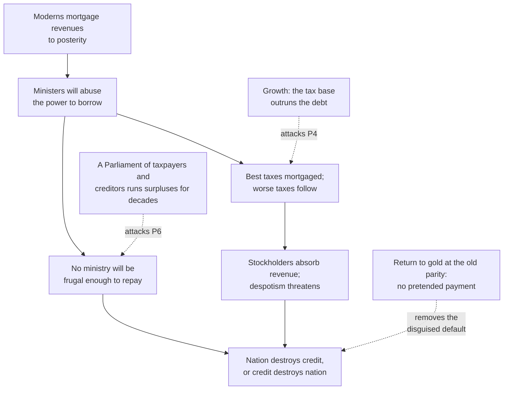

# A History of Debt · Lesson 3.4: Hume's prophecy: carrying a great debt

> ⏱ ~15 min · Module 3: The financial revolutions · Builds on: [3.1 From the Stop of the Exchequer to the Bank of England](03-01-from-the-stop-of-the-exchequer-to-the-bank-of-england.md), [3.2 Did 1688 make Britain creditworthy?](03-02-did-1688-make-britain-creditworthy.md), [3.3 The South Sea bubble](03-03-the-south-sea-bubble.md) · Unlocks: [4.1 Hamilton's assumption plan](04-01-hamiltons-assumption-plan.md)

## Why this matters

By 1750 Britain had learned to borrow cheaply and permanently (3.1–3.3). The two sharpest economic minds of the age were sure this would ruin it. Hume predicted that the debt would end in bankruptcy or in conquest. Smith, a generation later, thought every state that had funded its debts had been weakened by them. Then Britain fought the longest and most expensive wars in its history, finished them owing close to twice its national income, and became the richest power on earth. Every argument about a "great debt" since, from Hamilton in 1790 to the Eurozone, has had to explain how Britain managed that.

## The idea

A debt is heavy or light only relative to what can be taxed to service it. So there are two ways to lighten one. You can pay it down, which takes a **primary surplus**: tax revenue above spending on everything except interest. Or you can let the economy outgrow it. Working against both is interest, which adds to the debt every year that you don't pay it out of taxes.

The whole story fits in one line of arithmetic. Suppose debt is 180% of national income, interest is 4% and the economy grows 3%. Interest adds about 7 points of income to the debt this year, and growth removes about 5. Unless taxes cover the gap of about 2 points, the burden grows.

Hume and Smith did not reason in these terms. They reasoned about **mortgaged taxes**. Each loan was secured on a particular tax, so every war used up another good tax, until only oppressive taxes were left. Their fear was political before it was arithmetical. Parliament would never find the frugality to pay the debt down, and when the next war came the state would have to break faith with its creditors or give up defending itself. Whether Britain later proved them wrong, or lived in a world that changed after they wrote, is Module 3's boss question. This lesson gives you the texts and the arithmetic you need to argue it.

## The argument

**Hume, *Of Public Credit* (1752).** Paragraph numbers follow the davidhume.org edition of the 1777 text (PC).

1. **The ancients saved in peace for war; moderns mortgage the public revenues and trust posterity to pay** (PC 1–2). *In words:* borrowing shifts the cost of war onto people who cannot object.
2. **Ministers will almost infallibly abuse the power to borrow,** because borrowing lets them spend without taxing voters now (PC 5). *In words:* debt is a politician's free lunch, so there will be too much of it.
3. **The benefits are small.** Public securities work as a kind of money for merchants, but that is outweighed by the harm (PC 8–10). *In words:* Hume concedes the liquidity argument and then sets it aside.
4. **"We owe it to ourselves" is loose reasoning.** A transfer from taxpayers to stockholders still requires taxes, and the best taxes run out and must be followed by worse ones (PC 17–21). *In words:* the right hand paying the left still wears the hand out.
5. **Carried far enough, stockholders absorb the nation's revenue.** Rank and independent landed power fade, and despotism follows (PC 23). *In words:* the fiscal problem becomes a constitutional one.
6. **No ministry will be frugal enough to pay the debt down** (PC 28). *In words:* do not count on surpluses.
7. **∴ "either the nation must destroy public credit, or public credit will destroy the nation"** (PC 28). *In words:* the debt ends in default or in defeat.

Hume then sketches how each ending would come about (PC 29–32). He calls a default seized in an emergency the *natural death* of public credit, and a state too bound by its creditors to defend itself its *violent death*. A later note concedes that his fathers' prophecies of ruin had already failed, and declines to give a date.

**Smith, *Wealth of Nations* V.3, "Of Public Debts" (1776).**

- Funding lets governments avoid imposing the full cost of a war while it is fought. Wars therefore last longer and begin more lightly, where taxing within the year would end them sooner. (This is the fiscal-illusion claim that [Ricardian equivalence](../../grad-macro/lessons/03-04-social-security-transfers.md) later challenges.)
- Borrowed capital is turned from productive to unproductive uses. The rentier creditor has no interest in any particular field or firm.
- History: "The practice of funding has gradually enfeebled every state which has adopted it." His examples are Genoa, Venice, Spain, France and the Dutch Republic.
- But Smith hedges more than Hume. "Great Britain seems to support with ease, a burden which, half a century ago, nobody believed her capable of supporting," he writes, while warning that this does not mean she can bear any burden.

## Argument map

The dashed edges show what actually happened after 1815. Which of them breaks the argument, and whether any of them would still have broken it in Hume's world, is the crux.

## Worked examples

Let $d_t$ be debt divided by GDP in year $t$, $r$ the interest rate on the debt, $g$ the growth rate of GDP, and $s$ the primary surplus as a share of GDP. The accounting identity is

$$d_{t+1} = \frac{1+r}{1+g}\,d_t - s.$$

*In words:* interest scales the debt up, growth scales the economy up (which scales the ratio down), and the surplus pays some of it off. Subtracting $d_t$ from both sides gives the one-year change:

$$d_{t+1} - d_t = \frac{r-g}{1+g}\,d_t - s.$$

*In words:* the ratio falls only if the surplus beats the interest–growth gap applied to the existing debt. (Why this is an identity and not a theory of sustainability is `economics-of-debt`'s subject.)

**Example 1 (clean).** Take $d_0 = 1.8$, $r = 4\%$, $g = 3\%$, $s = 1\%$, all illustrative.

- The interest term adds $1.8 \times 0.04/1.03 = 0.0699$.
- The growth term removes $1.8 \times 0.03/1.03 = 0.0524$.
- The surplus removes $0.0100$.
- The net change is $+0.0075$, so $d_1 = 1.8075$.

The ratio rises even though the budget is in surplus. Run it for 20 years and the ratio comes out at about 2.18 with no surplus, 1.96 with a 1% surplus, and 1.53 with a 3% surplus. When $r > g$, a big debt eats small surpluses.

**Example 2 (hard: the real British case).** Official and academic series agree on the shape but not the exact peak. The Office for Budget Responsibility's long-run data put British debt at about 155% of GDP on the eve of the French wars and close to 180% after Waterloo. Eichengreen, El-Ganainy, Esteves and Mitchener, in an IMF conference paper ("Public Debt through the Ages", 2018) using the Bank of England's millennium dataset, date the peak to 1822 at 194%. Postwar deflation raised the ratio after the fighting stopped, because Britain returned to gold at the prewar parity in 1821. The ratio then fell to 28% by 1913.

Their decomposition of that fall is the surprise:

| 1822–1913 | Average | Share of the fall in the ratio |
|---|---|---|
| Primary balance | surplus of 1.6% of GDP | +180.5% |
| Growth minus interest | real $g$ 1.9%, real $r$ 3.5% | −95.6% |
| Stock-flow adjustment | — | +15.1% |

Growth did not beat interest. The interest–growth term *added* to the debt, and nearly a century of surpluses did all the work and then some. The authors attribute those surpluses to Victorian "sound finance" (Peel, Gladstone) and to a Parliament where creditors and income-tax payers stayed well represented.

Now try plugging the averages into the identity: $d_0 = 1.94$, $r = 3.5\%$, $g = 1.9\%$, $s = 1.6\%$, for 91 years. The ratio comes out at about 4.8 instead of 0.28. The averages cannot reproduce the history. In 1822 the interest–growth term on a 194% debt was already about $1.94 \times 0.016/1.019 \approx 3$ points of GDP a year, twice the average surplus. So the surpluses, or a narrower $r - g$ gap, must have been concentrated in the years when the debt was largest. Averages hide timing, and with a large debt, timing is everything.

What this does to Hume is contested. His premise 6 failed: British governments were frugal for ninety years. His premise 4 also bent, because the tax base kept growing. But the first thing that failed was his political prediction, not his arithmetic.

## Watch out

- **Anachronism trap.** You might think Hume and Smith misjudged a debt-to-GDP ratio. National-income accounting did not exist until the twentieth century. They measured the burden by mortgaged taxes, interest charges and taxable capacity. Translating their fears into a ratio is useful, but it is our translation, and the modern series are reconstructions.
- **"Britain grew out of its debt."** You might think so, but on the 2018 decomposition the growth–interest gap worked *against* Britain after 1822, and surpluses did the reducing. Growth mattered because it kept the needed surplus a modest share of a rising income.
- **Inflation was not the exit.** Smith expected any escape to be a bankruptcy, avowed or disguised as a "pretended payment" (debasing the coin). Britain did the opposite and restored gold at the old parity. Wartime inflation (prices rose roughly 90% between 1791 and 1813, per the same paper) was reversed, which raised the real debt.
- **Hume's forecast was not only fiscal.** Premise 5 is a claim about the constitution: the loss of the landed middle power between king and people. Grading it only on whether Britain defaulted misses half of it.

## One-liner

> Hume bet that no Parliament would stay frugal enough to carry a great debt; Britain carried twice its income through a century of surpluses, while growth only made the bill bearable.

## Problems

**P1 (🟢) *(Formal.)*** Illustrative values: $d_0 = 1.5$, $r = 5\%$, $g = 3\%$, $s = 2\%$. (a) Compute $d_{10}$. Iterate or use the closed form. (b) Recompute with $s = 0$, and again with $g = 0$ (keeping $s = 2\%$). (c) In one sentence: in this example, which does more to hold the ratio down over the decade, growth or the surplus? Round to three decimals.

**P2 (🟡) *(Exegetical.)*** Smith (WN V.3) first says that once national debts reach a certain size, there is scarcely an instance of their being fairly and completely paid. He goes on:

> "The liberation of the public revenue, if it has ever been brought about at all, has always been brought about by a bankruptcy; sometimes by an avowed one, though frequently by a pretended payment."

(a) What is "the liberation of the public revenue," and what are the two kinds of bankruptcy Smith distinguishes? What does his next paragraph name as the usual form of the second? (b) Is Britain's record from 1822 to 1913 (Example 2) a counterexample to this claim? Say which words decide it. 150 words or fewer for (b).

**P3 (🔴, optional) *(Exegetical (a) · Exegetical (b).)*** An invented op-ed: *"After Waterloo, Britain owed twice its GDP. It didn't default and it didn't inflate — it simply grew its way out. Heavily indebted countries today should stop agonizing over budgets and focus on growth; the debt will take care of itself."* (a) Name the historical analogy doing the work and the mechanism it claims. Using Example 2, say exactly where the history breaks. (b) A defender replies: "Growth is what made a century of surpluses politically bearable." Name the crux between that reading and one that credits political choice (who sat in Parliament, the creed of sound finance), and say what evidence would move it. 150 words or fewer in total. Take no position on today's policy.

Solutions

**P1** *(Formal.)*

(a) $a = \frac{1+r}{1+g} = \frac{1.05}{1.03} = 1.019417$, and $a^{10} = 1.212051$. Closed form:
$$d_{10} = a^{10} d_0 - s\,\frac{a^{10}-1}{a-1} = 1.212051 \times 1.5 - 0.02 \times \frac{0.212051}{0.019417} = 1.818076 - 0.218412 = 1.600.$$
Year by year: 1.509, 1.518, 1.528, 1.538, 1.547, 1.557, 1.568, 1.578, 1.589, 1.600. The ratio *rises* despite a 2% surplus, because the first-year interest–growth term is $1.5 \times 0.02/1.03 = 0.029 > 0.02$.

(b) With $s = 0$: $d_{10} = 1.212051 \times 1.5 = 1.818$. With $g = 0$: $a = 1.05$, $a^{10} = 1.628895$, so $d_{10} = 2.443342 - 0.02 \times 0.628895/0.05 = 2.443342 - 0.251558 = 2.192$.

(c) Removing growth raises $d_{10}$ by $2.192 - 1.600 = 0.592$. Removing the surplus raises it by $1.818 - 1.600 = 0.218$. So growth does more here. (These counterfactual effects do not add up to a clean decomposition, because the terms interact.)

**Wrong turns:** subtracting $r - g$ without dividing by $1 + g$ (this gives 1.609 after ten years: close, but a different identity); concluding that a surplus must make the ratio fall.

---

**P2** *(Exegetical.)*

**Must hit, strict (a):**
- *Liberation of the public revenue* means freeing taxes from being mortgaged to the interest on the debt, that is, getting the debt off the revenue.
- The two kinds are an *avowed* bankruptcy (open default) and a *pretended payment* (a default disguised as payment).
- The next paragraph names raising the denomination of the coin as the most usual expedient: paying nominal debts in debased money.

**Must hit, strict (b):**
- Britain did neither: it made no open default and no debasement, and it returned to gold at the old parity.
- But it also did not *fairly and completely pay* the debt. The debt was never paid off; it shrank relative to income.
- So the record is not a clean counterexample. Smith's claim concerns how liberation happens *if it has ever been brought about at all*, and it is framed around paying the debt off, not around a ratio falling. The deciding words are "if it has ever been brought about at all" and "fairly and completely paid."
- Full credit also for adding that Britain's case strains the *spirit* of Smith's warning, since the burden became light without any bankruptcy.

**Wrong turns:** calling postwar Britain a "pretended payment" by inflation (prices fell back after the war); treating a falling ratio as the "liberation" Smith meant.

**Model answer (b):** Not straightforwardly. Smith's claim is that *if* revenue is ever freed from its debt, the freeing comes through bankruptcy, open or disguised by debasement. Britain after 1822 did neither: no default, and a return to gold at the old parity rather than a raised denomination. But it didn't free the revenue in Smith's sense either, since the debt was never "fairly and completely paid." It shrank against a growing income while surpluses serviced it. The conditional "if it has ever been brought about at all" lets Smith's claim survive. What the case really challenges is the unstated assumption behind his warning: that a debt which is never paid must stay a crushing burden.

---

**P3** *(Exegetical (a) · Exegetical (b).)*

**Must hit, strict (a):**
- The analogy is post-Napoleonic Britain. The claimed mechanism is growth alone, with no default, no inflation and no budget effort.
- Where it breaks: on Eichengreen et al. (2018), real interest (3.5%) exceeded real growth (1.9%) on average, so the growth–interest term *added* to the ratio (−95.6% of the reduction). Primary surpluses averaging 1.6% of GDP for about ninety years did the reducing (+180.5%).
- "Didn't inflate" is right, and even understates it: postwar deflation raised the burden. "Didn't agonize over budgets" is the part that fails.

**Must hit (b):**
- The crux: were the surpluses an automatic by-product of a growing tax base, or a political choice that could have gone the other way?
- Evidence that would move it: whether surpluses survived franchise extensions (1832, 1867, 1884) and slumps, how the tax burden as a share of income moved, and comparisons with states of similar growth that did not run surpluses.

**Wrong turns:** answering whether today's countries *should* pursue austerity (not asked, and not this course's verdict to give); naming two cruxes.

**Model answer:** (a) The op-ed leans on Britain after 1815 and credits growth. But on the 2018 decomposition, real interest (3.5%) outran real growth (1.9%), so growth alone would have raised the ratio. Nearly a century of primary surpluses, about 1.6% of GDP a year, brought 194% down to 28%. The history undercuts the budget-free part of the claim, not the no-default part. (b) The two readings share the data and divide on one premise: whether growth made the surpluses nearly automatic, or whether a creditor- and taxpayer-weighted Parliament chose them. Surpluses that persisted through the widening franchise and through slumps would favor the automatic reading. Surpluses that dissolved as the electorate widened would favor the choice reading.

## Flashback

**From Lesson 3.2 (Did 1688 make Britain creditworthy?):** *(Exegetical.)* For each observation, say what North and Weingast's account predicts, what Stasavage's predicts, and which premise of the lesson's reconstruction the difference turns on. (a) A ministry hostile to the moneyed interest takes office; no statute changes. (b) A state adopts the 1689 arrangements exactly — supply voted for limited terms, appropriation to named purposes, judges secure in office — but its assembly is dominated by landowners who hold none of the debt. (c) In one sentence, why would neither observation settle the objection Clark and Sussman–Yafeh press? Two sentences or fewer per prediction.

Solution

**Must hit, strict (a):** North and Weingast predict little or no change: credibility rests on the rules and the veto structure, both untouched, and on their learning clause it should if anything keep improving with experience. Stasavage predicts borrowing costs rise, because credibility tracked which coalition held the Commons — his instance is the change of ministry in 1710. The difference turns on **P4** (multiple vetoes protect creditors), or equivalently on reading **P5** as a constant.

**Must hit, strict (b):** North and Weingast predict a creditworthy state, since the rules are what bind. Stasavage predicts weak credibility, because the supreme body now holds both the power to rewrite the debt and no stake in being repaid. Same premise: the veto that mattered was Parliament's own, so P4 does no work once the majority is hostile.

**Must hit, strict (c):** Clark and Sussman–Yafeh attack the **timing** — whether rates broke at 1688 at all, and whether any fall was British-specific rather than shared with Holland and with peace. Both observations hold the rules fixed and vary the politics, so they test the mechanism; the timing question needs yield series across the decades and a comparison with other states.

**Wrong turns:** letting North and Weingast predict the rise in (a), which just concedes Stasavage's mechanism; making Stasavage predict an actual default rather than a price; filing (b) under Clark, whose evidence is about private property returns before 1688.

**Model answer:** (a) North and Weingast: no material change, since the statutes, the vetoes and the courts are all as they were. Stasavage: costs rise, because protection came from a majority that held the debt, and that majority has gone. The premise at issue is P4. (b) North and Weingast: the rules bind, so the state should borrow well. Stasavage: they will not, because Parliament is supreme and its members lose nothing by defaulting — again P4, read together with P5. (c) Both cases keep the rules fixed and move the coalition, so they speak to what makes a promise credible, not to when British yields actually fell, which is the whole of the timing objection.

## Connections

- **Backward:** [3.1](03-01-from-the-stop-of-the-exchequer-to-the-bank-of-england.md) built the funded debt that Hume feared, and [3.2](03-02-did-1688-make-britain-creditworthy.md) asked why creditors trusted it. The surpluses in Example 2 are that commitment kept for a century. [3.3](03-03-the-south-sea-bubble.md)'s conversion is the kind of "projector's scheme" Hume thought would finish public credit off. Smith's "pretended payment" echoes the currency revaluation in Solon's reform ([1.4](01-04-solons-shaking-off-of-burdens.md)).
- **Forward:** [4.1](04-01-hamiltons-assumption-plan.md): Hamilton, writing inside this literature, argued the other way: that a funded debt, well serviced, is national capital and a bond of union. Module 3's boss problem asks whether Hume was wrong, or right about a world that changed. The identity returns for reparations ([5.1](05-01-war-debts-and-reparations.md)) and Greece ([6.2](06-02-the-eurozone-and-greece.md)).
- **Sideways:** Smith's claim that borrowing hides the cost of war from taxpayers is the claim that Ricardian equivalence denies ([`grad-macro` 3.4](../../grad-macro/lessons/03-04-social-security-transfers.md)). The $r$ versus $g$ knife-edge, and when a debt can be rolled over forever, belong to [`economics-of-debt`](../../economics-of-debt/syllabus.md). Hume and Smith as political theorists belong to [`history-of-political-thought`](../../history-of-political-thought/syllabus.md). Whether one generation may bind the next with debt is [`philosophy-of-debt`](../../philosophy-of-debt/syllabus.md)'s question.
