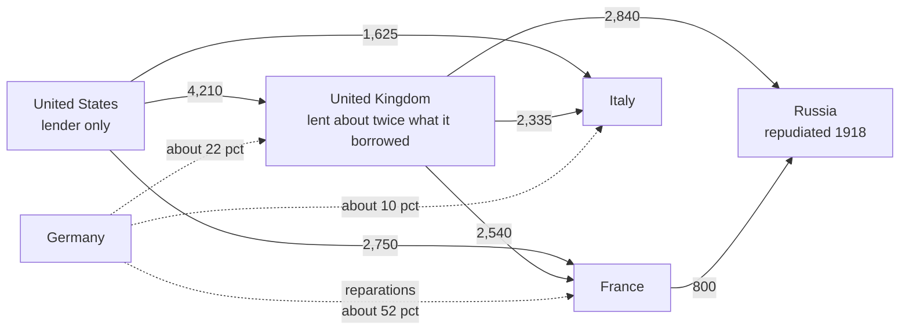

# A History of Debt · Lesson 5.1: War debts and reparations

> ⏱ ~15 min · Module 5: Reparations to Jubilee: the twentieth century · Builds on: [4.6 Bondholders, gunboats, and receiverships](04-06-bondholders-gunboats-and-receiverships.md) · Unlocks: [5.2 Could Germany pay?](05-02-could-germany-pay.md)

## Why this matters

In 4.6 creditors were private bondholders, and the question was whether gunboats or reputation made weak states pay. After 1918 the creditors were governments, the debtors were great powers, and the sums were bigger than anything in the nineteenth century. Two sets of claims came out of the war: loans the Allies owed one another, above all to the United States, and reparations the Allies demanded from Germany. Whether those two were one problem or two was the political fight of the 1920s. This lesson builds the web of claims and the instruments that priced it. [5.2](05-02-could-germany-pay.md) asks whether Germany could have paid.

## The idea

Picture three friends who run up a huge bar tab defending the bar from a fourth. One friend (the US) paid most of it by lending to the other two. The second (Britain) borrowed from the first and lent even more to the third (France, Italy, Russia). Afterwards everyone presents a bill to the fourth man (Germany). Now ask the question that ran through the decade. Is what the third friend owes the first a separate IOU, or is it part of one shared bill that should be settled out of whatever the fourth man pays?

The US said: separate. It had lent money to sovereign governments on written terms, and it was not a party to the reparation settlement. The European Allies said: connected. They could pay Washington only what they collected from Berlin. That makes Germany's capacity to pay everyone's problem, and makes cancelling the inter-Allied debts the price of a sane reparation figure. Neither position is confused. Each reads the same loans through a different picture of what the war was.

Two further facts make the web hard to read:

- **A headline is not a claim.** A total can be announced for domestic audiences while most of it is built so that it will never be collected.
- **Maturity and interest rate are the real currency of concession.** Governments that could not be seen to cancel a debt could stretch it and cut its rate. That forgives much of it in present value while the face value stays untouched.

## Source

Treaty of Versailles (1919), Article 231, the opening article of Part VIII, "Reparation":

> The Allied and Associated Governments affirm and Germany accepts the responsibility of Germany and her allies for causing all the loss and damage … as a consequence of the war imposed upon them by the aggression of Germany and her allies.

The article asserts *responsibility for loss and damage*. It names no sum. Article 232 immediately concedes that Germany's resources are not adequate for complete reparation, and limits the demand to civilian damage under listed heads, including pensions. Keynes, who was at Paris for the British Treasury, read 231 as drafted so that Wilson could take it as a *moral* admission and Lloyd George as a *financial* one (*Economic Consequences*, ch. V). German opinion read it as a verdict of guilt, and the label "war guilt clause" comes from that reading, not from the text.

## The argument

The Allied reparation claim, as the treaty and the 1921 schedule built it:

1. **Germany accepts responsibility for the loss and damage the war caused** (Art. 231). *In words:* liability is established first, before anyone says how much.
2. **Her resources cannot make it good in full** (Art. 232). *In words:* the treaty itself concedes that the claim exceeds capacity, and so turns the dispute into a question of how much less.
3. **So the demand is limited to listed civilian damages and pensions, and a Reparation Commission fixes the amount by 1 May 1921** (Arts. 232–233), with 20 billion gold marks due meanwhile (Art. 235). *In words:* a legal claim was converted into an administrative process, because in 1919 no figure could survive both Allied electorates and the economics.
4. **The London Schedule of Payments (5 May 1921) fixes 132 billion gold marks**, split into A bonds (12 billion), B bonds (38 billion) and C bonds (82 billion). Germany pays 2 billion gold marks a year plus 26 percent of the value of its exports. *In words:* one headline number, but a contract in three tiers.
5. **C bonds become an active obligation only by a further decision, once Germany's payments are shown to be enough to service them.** *In words:* nearly two thirds of the headline was contingent from the start. Historians such as Sally Marks ("The Myths of Reparations", 1978) therefore read the operative demand as about 50 billion. On the United States Office of the Historian's editorial note, even contemporaries thought the total unreal.

The inter-Allied claim, as each side argued it:

6. **US position.** The advances were loans to sovereign governments. Congress created a World War Foreign Debt Commission (1922) and forbade it to cancel any part, set a rate below 4¼ percent, or run past 1947. *In words:* debts are contracts. Germany's obligations are someone else's business.
7. **British position** (the Balfour Note, August 1922). The debts were a connected series of transactions for a common purpose. Britain was owed about £3.4 billion by its allies and owed the US about £850 million. It proposed to write off everything, reparations included. Failing that, it would collect only what it needed to pay Washington. The note's hinge: "if our undoubted obligations as a debtor are to be enforced, our not less undoubted rights as a creditor cannot be left wholly in abeyance." *In words:* if the US collects, Britain must collect too, and the money will ultimately come from Germany.
8. **Keynes's argument** (1919, ch. VII). Without cancellation the war would end with the Allies stuck paying "indemnities to one another instead of receiving them from the enemy." Resentful debtors would be a lasting source of friction. *In words:* the inter-Allied debts are what make the reparation demand politically impossible to lower.

## The case

The web as Keynes tabulated it in 1919 (million dollars, loans to governments; the table in ch. VII):

Solid edges are wartime loans. Dashed edges are the reparation shares the Allies agreed among themselves at Spa in 1920 (approximate; Belgium's share and the smaller ones are omitted). Keynes's total for US loans was about 9.5 billion dollars. Postwar credits and accrued interest raised the principal the commission worked from to roughly 11 billion. The Russian edge matters: Britain's and France's largest claims were on a government that no longer recognized them.

How the story ran:

- **1921.** Germany accepted the schedule under an Allied ultimatum threatening occupation of the Ruhr.
- **Late 1922.** The Reparation Commission declared Germany in default on deliveries in kind (timber, then coal).
- **January 1923.** French and Belgian troops occupied the Ruhr. The German government backed passive resistance and financed it largely by printing money. Prices, already rising fast, went into hyperinflation, and by November 1923 a dollar cost about 4.2 trillion marks. How much the occupation, rather than prior policy, caused the collapse is disputed.
- **1923–26.** Meanwhile the debt commission began settling with the debtors. The British settlement (1923) funded 4.6 billion dollars over 62 years at 3 percent for ten years and 3½ thereafter. That broke the 1922 statute's limits, so Congress passed it as an amendment. France (4.0 billion, 1926) and Italy (2.0 billion, 1925) got still lower average rates.

## Worked examples

**Example 1 (clean — what "funding" a debt forgives).** A government owes 1 billion dollars on demand notes at 5 percent. The creditor refuses to cancel anything but agrees to fund it: equal annual payments over $n = 62$ years at $r = 3.5\%$. The level payment $A$ that repays principal $P$ is

$$A = P\,\frac{r}{1-(1+r)^{-n}} .$$

*In words:* the payment that makes the stream's present value at the loan rate exactly equal to the principal.

Here $A = 1{,}000 \times \frac{0.035}{1-1.035^{-62}} \approx 39.7$ million a year. Over 62 years that totals about 2.46 billion, so the debtor "pays back" nearly two and a half times the principal. Now value the stream at the rate the original notes carried, $i = 5\%$:

$$PV = A\,\frac{1-(1+i)^{-n}}{i} \approx 39.7 \times 19.03 \approx 755 \text{ million}.$$

*In words:* discount each payment at the rate money was worth to the creditor, and add them up.

The face value is untouched. Yet about 24 percent of the debt's value has been forgiven. Both sides can tell the truth to their voters: nothing was cancelled, and a quarter was given away.

**Example 2 (hard — why did France go into the Ruhr?).** Run the linkage picture on 1923. France was the largest reparation creditor and, after Britain, the largest debtor to the US. If the debts were linked, a German default threatened the French budget directly, and seizing coal and customs revenue looks like a creditor enforcing a claim, the 4.6 logic with troops for gunboats. But a second reading fits the same facts. Occupation weakened Germany as a power. Some French leaders also saw it as leverage to revise the whole settlement, the Rhineland included. On this reading reparations were the occasion, and security was the aim.

The web does not decide between these readings. It shows why *both* were available: the claim on Germany was simultaneously a French fiscal asset and a lever of power. That is the same cause-or-pretext crux as Egypt in 1882 ([4.5](04-05-egypt-the-ottomans-and-debt-administration.md)). What would separate them is the kind of evidence named there: what French ministers wrote to one another about their aims, set against what they said in public.

## Watch out

- **"War guilt clause" is not the treaty's language.** Article 231 speaks of *responsibility for loss and damage*, and parallel articles appear in the treaties with Germany's allies. Reading it as a moral verdict was one live reading in 1919, not the text. Calling it "the war guilt clause" without flagging this is an anachronism of vocabulary.
- **132 billion is a headline, not the effective demand.** The C bonds were contingent. Any figure for what Germany "owed" has to say whether it includes them.
- **"The US forgave nothing" and "the US forgave a lot" can both be true.** They are nominal and present-value statements. Always ask which one is being made, and at what discount rate.
- **Don't read Keynes as a neutral recorder.** He resigned from the British delegation and wrote as an advocate. His figures are estimates made for an argument, and 5.2 is the dispute over them.

## One-liner

> The peace of 1919 left a triangle of claims (Germany owing the Allies, the Allies owing Britain and America), and every quarrel of the 1920s was over whether it was one debt or two.

## Problems

**P1 (🟢) *(Formal.)*** Stylize the 1923 British settlement as a level annuity: principal 4.6 billion dollars, 62 annual payments, at the settlement's average rate of 3.306 percent. (The real schedule was graduated; this simplification is illustrative.) (a) Compute the annual payment and the total paid. (b) Compute the present value of that stream at 5 percent, the rate the original demand notes carried, and the implied concession as a share of face value. (c) Do the same for the terms the 1922 statute allowed: 25 years at 4.25 percent. (d) In two sentences, say what a senator and a British Chancellor could each truthfully claim about the 1923 deal. Round to the nearest 0.01 billion and 0.1 percentage point.

**P2 (🟡) *(Exegetical.)*** Keynes, *Economic Consequences of the Peace*, ch. VII, explains why Allied publics demanded large indemnities:

> a feeling which is based, not on any reasonable calculation of what Germany can, in fact, pay, but on a well-founded appreciation of the unbearable financial situation in which these countries will find themselves unless she pays.

(a) On this passage, what links the inter-Allied debts to the reparation demand: Germany's capacity, or the Allies' own obligations? Name the words that decide it. (b) Keynes calls the feeling unreasonable *and* well-founded. Say exactly what each adjective attaches to, and why that is not a contradiction. (c) Say in one sentence why, on this passage, cutting the reparation figure first and dealing with inter-Allied debts later would fail. 150 words total.

**P3 (🔴, optional) *(Exegetical.)*** The US Congress (1922) treated the Allied war loans as contracts that could not be cancelled or offset against other debts. The Balfour Note (1922) treated them as parts of "a connected series of transactions" for a common purpose. Name the single premise one side affirms and the other denies, and say what evidence about how the loans were made and used would bear on it. 150 words or fewer.

Solutions

**P1** *(Formal.)*

(a) $A = 4.6 \times \frac{0.03306}{1-1.03306^{-62}}$. Here $1.03306^{-62} \approx 0.1331$, so the denominator is $0.8669$ and $A \approx 4.6 \times 0.03813 \approx 0.1754$ billion, about **0.18 billion** a year. Total paid: $62 \times 0.1754 \approx$ **10.88 billion**.

(b) At 5 percent, the annuity factor is $\frac{1-1.05^{-62}}{0.05} \approx 19.03$, so $PV \approx 0.1754 \times 19.03 \approx$ **3.34 billion**. Concession: $1 - 3.34/4.6 \approx$ **27.4 percent** of face value.

(c) $A = 4.6 \times \frac{0.0425}{1-1.0425^{-25}} \approx 0.302$ billion a year, total about **7.56 billion**. Annuity factor at 5 percent over 25 years $\approx 14.09$, so $PV \approx$ **4.26 billion**, a concession of about **7.4 percent**.

(d) The senator: Britain will repay every dollar of principal, and more than twice that in total. The Chancellor: in present value at the original rate, over a quarter of the debt was given up, nearly four times what the statute allowed.

**Wrong turns:** discounting at the settlement rate itself, which returns exactly 4.6 billion by construction and hides the concession; treating the 10.88 billion total as the "real" size of the debt.

---

**P2** *(Exegetical — strict.)*

**Must hit, strict:**
- (a) The Allies' own obligations. The deciding words are "not on any reasonable calculation of what Germany can, in fact, pay" set against "the unbearable financial situation in which these countries will find themselves unless she pays." The demand is sized by what the creditors need, not by what the debtor has.
- (b) "Not reasonable" attaches to the *calculation* of Germany's capacity, which is absent. "Well-founded" attaches to the *appreciation* of the Allies' own plight, which is accurate. A demand can rest on a true premise about oneself and ignore the relevant premise about the payer.
- (c) As long as the Allies' debts stand, the pressure that inflates the demand stands too, so a lowered figure would be politically unsustainable. That is why Keynes makes debt settlement "an indispensable preliminary" to facing the truth about the indemnity (same section; paraphrase acceptable).

**Wrong turns:** reading the passage as Keynes's estimate of Germany's capacity (that is ch. V); taking "well-founded" to mean Keynes endorses the size of the demand.

**Model answer:** (a) The link runs through the Allies' obligations: the feeling rests "not on any reasonable calculation of what Germany can … pay" but on the Allies' "unbearable financial situation." (b) Unreasonable describes the missing calculation of German capacity; well-founded describes the accurate sense of the Allies' own plight. The demand is anchored in a true fact about the creditors, not in the debtor. (c) Cut reparations while Allied debts to the US stand and the source of the pressure remains, so voters would reject the lower figure; the debts have to be settled first.

---

**P3** *(Exegetical — strict on naming one premise; any defensible formulation passes.)*

**Must hit, strict:**
- The crux: *whether the obligations created by the wartime advances are fixed by their bilateral terms alone, or also by the common purpose they served, so that the burden may be pooled and offset across creditors and debtors.* Congress affirms the first; the Balfour Note affirms the second.
- Not the crux: whether the debts were legally valid (Britain granted its "undoubted obligations as a debtor") or whether cancellation would be wise (both sides could concede economic costs).
- Evidence: the loan instruments and the statutes authorizing them (to whom, on what terms, for what purposes); whether US lending after 1917 in fact financed purchases for other Allies on British credit, as Britain and Keynes claimed; whether any Allied undertaking at the time tied repayment to receipts from the enemy.

**Wrong turns:** naming Germany's capacity to pay (that is 5.2's crux, and both sides could agree on it); naming two premises; answering with a verdict about whether the US should have cancelled.

**Model answer:** The premise in dispute is that a wartime advance between allies is fully defined by its written terms between those two governments. Congress affirmed it: the loans were contracts, so no offset or cancellation could be granted. The Balfour Note denied it: loans for a common war were one connected series, so Britain's duties as a debtor could not be separated from its rights as a creditor. What bears on it is how the loans were made and used. Did the authorizing acts and notes describe them as ordinary government lending, or as contributions to a joint effort? Did American advances in 1917–18 in effect fund other Allies' purchases on Britain's credit? Did anyone at the time promise that repayment would depend on reparations?

## Flashback

**From Lesson 4.5 (Egypt, the Ottomans, and debt administration):** *(Exegetical.)* Place each arrangement on the ladder of creditor control and name the feature that decides the rung. (a) A loan decree assigns the harbour dues of the two chief ports to the loan; the finance ministry collects them as before and remits the service each quarter. (b) A council of bondholders' nominees hires its own staff, takes the sugar export duty straight from the district offices and pays the coupons out of it, with no voice in any other part of the budget. (c) A convention gives two creditor-government appointees the right to inspect every ministry's accounts and report on all revenue and spending; they collect nothing and hold no office of state. Then, in one sentence: why does a creditor who already has (b) want (c)? One sentence per case.

Solution

**Must hit, strict:**
- (a) **Rung 1, pledge a revenue.** A named security is still only a promise, because the government's own collectors handle the money and can divert it, take the dues years in advance, or pledge them twice.
- (b) **Rung 2, collect the pledged revenue.** The deciding feature is who physically collects: creditors' agents take the duty before it reaches the treasury. It stops at rung 2 because the council's reach ends at that one revenue.
- (c) **Rung 3, audit the budget.** Inspection covers *all* revenue and spending, which is more than rung 2, but the appointees neither collect nor spend, so it is not rung 2 and not rung 4.
- The one sentence: a pledged revenue is worthless if the rest of the budget collapses, so a creditor at rung 2 wants sight of the whole budget to see whether the state is wrecking its finances elsewhere, borrowing against the same pledge again, or starving the source he holds.

**Wrong turns:** calling (a) rung 2 because a specific tax is named — naming a revenue is the pledge; what moves it up is who collects. Calling (c) rung 4 because foreigners now sit inside the machinery — auditing is not running a ministry, and the rung turns on power to spend. Treating the rungs as a sequence every debtor climbs: the Ottoman Empire stopped at 2 and stayed sovereign.

**Model answer:** (a) Rung 1: the dues are pledged but the government still collects them, so the security is a promise. (b) Rung 2: creditors' own collectors take the duty before the treasury sees it, and their authority stops at that revenue. (c) Rung 3: the appointees watch the whole budget but collect nothing and run nothing, which is audit, not administration. A creditor with (b) wants (c) because his pledged duty is only as safe as the rest of the finances, and nothing at rung 2 stops the government from pledging the same revenue again or letting everything around it fail.

## Connections

- **Backward:** [4.6](04-06-bondholders-gunboats-and-receiverships.md) asked whether force or reputation enforced sovereign debts. In 1923 a creditor state used troops against a great power, not a Caribbean customs house. And Example 2's cause-or-pretext question is the one [4.5](04-05-egypt-the-ottomans-and-debt-administration.md) posed about Egypt. The annuity arithmetic is [4.4](04-04-haitis-independence-debt.md)'s, turned from an indemnity to a war loan.
- **Forward:** [5.2](05-02-could-germany-pay.md) takes up Keynes's capacity estimate against Mantoux and Marks, the Dawes and Young plans, the circle of American loans, and the 1930s defaults on these very war debts. The nominal-vs-PV distinction of Example 1 becomes the formal core of [5.4](05-04-from-mexico-1982-to-the-brady-plan.md)'s Brady haircuts and [6.2](06-02-the-eurozone-and-greece.md)'s Greek restructuring.
- **Sideways:** discounting a payment stream is taught properly in [`mathematical-finance` 4.1](../../mathematical-finance/lessons/04-01-term-structure-bond-pricing.md). Whether Germany's problem was raising the money or transferring it abroad is the transfer problem, owned by `economics-of-debt` ([syllabus](../../economics-of-debt/syllabus.md)). Why a sovereign repays with no court to make it do so is the repeated-game logic of [`game-theory-refresher` 2.3](../../game-theory-refresher/lessons/02-03-repeated-games-folk-theorem.md). And whether a nation can be *responsible* for a war's damages in the sense Article 231 asserts is collective responsibility, a question for `philosophy-of-debt` ([syllabus](../../philosophy-of-debt/syllabus.md)).
