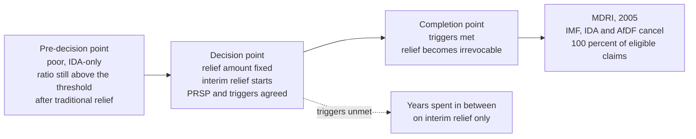

# A History of Debt · Lesson 5.5: Jubilee 2000 and HIPC

> ⏱ ~15 min · Module 5: Reparations to Jubilee: the twentieth century · Builds on: [5.4 From Mexico 1982 to the Brady Plan](05-04-from-mexico-1982-to-the-brady-plan.md), [1.3 Release laws in ancient Israel](01-03-release-laws-in-ancient-israel.md) · Unlocks: [6.1 The American mortgage and 2008](06-01-the-american-mortgage-and-2008.md)

## Why this matters

Brady ([5.4](05-04-from-mexico-1982-to-the-brady-plan.md)) settled the debts of middle-income countries owed to commercial banks. It did nothing for the poorest countries, whose creditors were mostly governments and the multilateral institutions themselves — and whose claims, by long practice, were never written down. Between 1996 and 2005 that practice broke. This lesson is about how it broke: the framework the creditors built, the campaign that pushed on it, the ancient word the campaign borrowed, and the argument, still unsettled, about what the relief actually bought.

## The idea

Three things had to happen before a poor country's debt could be cancelled, and each was a different kind of obstacle.

**A rule for how much.** Creditors will not cancel "what cannot be paid" unless somebody defines it. The official framework defined it as a ratio test: value the debt stock in present value, divide by the country's export earnings, and call everything above a fixed multiple unsustainable. That turns forgiveness into arithmetic, which is exactly why creditors could agree to it — and exactly what campaigners objected to, since the test starts from what creditors can extract rather than from what the country needs to spend.

**A break in the seniority rule.** The IMF and World Bank had always been *preferred creditors*: paid first, never written down, on the argument that they lend when nobody else will and can only keep doing so if repayment is certain. A poor country's debt was by the 1990s mostly owed to them and to other governments. Relief that excluded them would be relief in name only.

**A reason to move.** Ratios do not generate political will. Jubilee 2000 supplied it — a coalition of churches, aid agencies and unions that borrowed a name from Leviticus 25 ([1.3](01-03-release-laws-in-ancient-israel.md)), collected a petition signed by more than 20 million people, and on 16 May 1998 ringed the G8 summit in Birmingham with a human chain of roughly 70,000. John Paul II's appeal for relief in the approaching Jubilee year gave it a second pulpit; the theology belongs to [`theology-of-debt`](../../theology-of-debt/syllabus.md).

Behind all three sat the objection creditors made from the start: forgive once and you teach every future borrower and lender that debts can be escaped. The actors argued moral hazard against need; this course reports the argument and leaves the doctrine to [`philosophy-of-debt`](../../philosophy-of-debt/syllabus.md).

## Source

A century earlier, the United States had refused to take on a debt on a different ground — not that it could not be paid, but that the wrong people had contracted it. Negotiating the Treaty of Paris in 1898, Spain proposed to hand over Cuba together with the "Cuban debt" run up largely to suppress Cuban revolts. The American Commissioners replied (Annex 1 to Protocol No. 4, conference of 11 October 1898):

> It is difficult to perceive by what logic an indebtedness contracted for any purpose can be deemed part of the sovereignty of Spain over the Island of Cuba.

Sovereignty passed; the debt did not. Spain kept it. The Cuban bondholders were not repudiated by their debtor — they were left with the debtor they had actually lent to. That is the germ of what a Russian émigré jurist, Alexander Sack, would in 1927 name *odious debt*.

## The argument

**A. The creditors' framework** (HIPC Initiative, 1996; enhanced at the Cologne G8, June 1999).

1. **A country's external debt is unsustainable when its net present value exceeds 150 percent of annual exports** — or, through a fiscal window, 250 percent of government revenue, open only to countries whose exports exceed 30 percent of GDP and whose revenue exceeds 15 percent of GDP. *In words:* unpayability is defined by a ratio, and a country either clears the bar or does not. The 1996 thresholds were higher (200–250 percent of exports); 1999 lowered them, which is most of what "enhanced" means.
2. **The test is applied to what is left after the existing machinery has done its work** — full use of traditional Paris Club terms first. *In words:* HIPC pays for the residual, not the whole debt.
3. **Multilateral claims are included.** *In words:* the preferred creditors agreed to take losses on themselves, which is the genuinely new thing in the design.
4. **Relief is staged and conditional.** At the *decision point* the amount is fixed, interim relief begins, and the country agrees a poverty reduction strategy paper (PRSP) and a list of triggers. At the *completion point* — floating, reached when the triggers are met — relief becomes irrevocable. *In words:* the debt is not cancelled when you qualify, but when you have done what you promised, which can take years.
5. **Relief is to be additional to aid.** *In words:* creditors promised not to pay for the write-off by cutting aid budgets — a promise later disputed.

**B. The campaign's argument** (Jubilee 2000, as campaigners put it).

6. **These debts will not be paid in full on any schedule anyone can name.** *In words:* the question is not whether there will be a loss but who books it, and when.
7. **Meanwhile debt service is paid out of budgets that also fund clinics and schools.** *In words:* the burden is measured in what the money would otherwise do, not in a ratio.
8. **Much of the stock was lent to unaccountable governments by creditors who knew it.** *In words:* the campaign's premise 8 and the odious-debt argument below are the same thought in different registers, one political and one legal.

∴ **Cancel the unpayable debts of the poorest countries by the year 2000**, on a deadline rather than a case-by-case timetable.

**C. Odious debt**, as Sack formulated it in 1927 (paraphrased; his text is not public domain in English). A debt does not bind a successor state when three conditions hold together:

9. **It was contracted without the consent of the people.** *In words:* no representative organ acted for them.
10. **It was not spent for their benefit.** *In words:* the proceeds went to purposes hostile or irrelevant to them.
11. **The creditors knew this when they lent.** *In words:* the lender's knowledge is what makes the loss fall on the lender rather than on the borrower's successors.

∴ The successor is not bound. This has never been adopted as settled international law; it is a doctrine repeatedly invoked and never squarely applied by a tribunal.

## Timeline

- **1996** — HIPC launched by the IMF and World Bank.
- **May 1998** — the Birmingham human chain; debt reaches the top of the G8 agenda.
- **June 1999** — Cologne G8: enhanced HIPC. Lower thresholds, faster and deeper relief, the PRSP requirement.
- **2000** — the Jubilee year; campaign deadline passes with a handful of countries at completion point.
- **2004** — the Paris Club cuts Iraq's debt by 80 percent in net present value, in three stages tied to IMF programs (21 November 2004). Odious debt was argued loudly in public and used in the agreement not at all.
- **July 2005** — Gleneagles G8 proposes the Multilateral Debt Relief Initiative: on top of HIPC, the IMF, IDA and the African Development Fund cancel 100 percent of their eligible claims on completion-point countries.
- **2023** — Somalia becomes the 37th country to reach completion point. The IMF and World Bank put the cost of HIPC relief to creditors at about 76 billion dollars and MDRI at about 43 billion, both in end-2017 present-value terms.

## Worked examples

**Example 1 (clean — how much relief).** A country, call it Bantara, arrives at its decision point. Its exports of goods and services average 900 million dollars over the three prior years. After full use of traditional Paris Club terms, the present value of its public external debt is 2,250 million.

Ratio: $2250/900 = 250$ percent, above the 150 percent threshold, so it qualifies on the export window.

Target stock: $1.5 \times 900 = 1{,}350$ million. Relief required: $2250 - 1350 = 900$ million in present value, a *common reduction factor* of $900/2250 = 40$ percent, which each creditor is then asked to apply to its own claims.

Two features of that arithmetic decide most of the disputes in this lesson. The relief is a present-value number, so the face amount written off is a different and usually larger figure — the nominal-versus-present-value distinction from [5.4](05-04-from-mexico-1982-to-the-brady-plan.md). And the target is set by exports, so a commodity price collapse after the decision point pushes a country back above the line through no act of its own.

**Example 2 (hard — Iraq 2004, where the doctrine did not travel).** After 2003, American officials and outside lawyers argued publicly that Saddam Hussein's debts were odious in Sack's sense: contracted by an unelected government, spent on war and repression, and lent by creditors who knew both. On premises 9–11 Iraq's successors were not bound at all.

What happened was a Paris Club negotiation. Iraq got 80 percent in present value, in three tranches conditioned on IMF programs — a deep cut, and deeper than HIPC's own average, but delivered as a discretionary act by creditors, not as a finding that the debt had never been owed. Note what each route implies. The doctrine says the loss was always the creditors', so no conditions attach and no precedent for other debtors can be refused. The negotiation says the loss is a concession, so it can be priced, staged, tied to a program, and confined to this case. Creditors who were willing to lose the money were not willing to concede the principle — and Iraq, wanting relief quickly and wanting to keep borrowing later, did not press it.

## Watch out

- **You might think HIPC cancelled debts because they were unjust; it cancelled them because a ratio was exceeded.** Every step of the framework is capacity arithmetic plus conditionality. The justice arguments came from the campaign and ran alongside, which is why the two sides could agree on relief and disagree completely about what relief meant.
- **You might think 1898 was an application of the odious-debt doctrine.** It is the other way around: Sack's 1927 formulation was built partly out of episodes like this one, and the American Commissioners argued from the terms of the August protocol and from who had contracted the debt, not from a doctrine that did not yet exist. Reading the doctrine back into 1898 is an anachronism of vocabulary.
- **You might think the Jubilee 2000 campaign was applying Leviticus 25.** The ancient release was periodic, automatic and internal to one society ([1.3](01-03-release-laws-in-ancient-israel.md)); HIPC was case-by-case, conditional, negotiated between states, and available once. The campaign borrowed the name and the moral force of a fixed date. Where the analogy holds and where it breaks is a live question, not a settled one.
- **You might think "X billion cancelled" is one number.** It can mean face value, present value, debt *service* over some horizon, or the cost booked by creditors — and those differ by large factors. Always ask which, and in which year's present-value terms.
- **You might think the effect on social spending is documented.** It is contested. The IMF and World Bank report poverty-reducing expenditure in post-decision-point countries far exceeding debt service after relief (about 7 percent of GDP against 2 percent in 2017), while independent work — Depetris Chauvin and Kraay's study of the 2000s is the usual reference — found little robust effect of relief on growth or on the quality of policy. The disagreement is partly about the counterfactual and partly about fungibility: money is not labelled.

## One-liner

> HIPC made forgiveness computable — a present-value ratio, a threshold, a conditional two-step — and Jubilee 2000 supplied the political force to make creditors run the computation, including on themselves.

## Problems

**P1 (🟢) *(Formal.)*** An invented country, Kalinda, reaches its decision point. Three-year average exports: 1,600 million dollars. Present value of public external debt after full use of traditional relief mechanisms: 2,880 million. GDP: 4,000 million. Government revenue: 560 million. (a) Compute the debt-to-exports ratio and say whether Kalinda qualifies on the export window. (b) Compute the present-value relief needed to reach the threshold and the implied common reduction factor. (c) Check whether Kalinda could instead use the fiscal window, stating each criterion and whether it is met. (d) Suppose that after relief, 900 million of the remaining present value is owed to the IMF, IDA and the African Development Fund, and MDRI cancels all of it. Compute the new debt-to-exports ratio. One sentence: what does (d) show about how MDRI relates to the HIPC threshold? Round percentages to 0.1.

**P2 (🟡) *(Exegetical.)*** From the American Commissioners' reply on the Cuban debt (Annex to Protocol No. 5, conference of 14 October 1898):

> The thing done in the exercise of sovereignty is not a part of the sovereignty itself; the power to create is not the thing created.

and, of the so-called Cuban debt:

> They are debts created by the Government of Spain, for its own purposes and through its own agents, in whose creation Cuba had no voice.

with the charge that the burden was "imposed upon the people of Cuba without their consent and by force of arms."

(a) The passage gives two distinct grounds for refusing the debt: one about what sovereignty *is*, one about how this debt *arose*. State each in a sentence and name the words that carry it. (b) Which of Sack's three conditions (premises 9–11) does the passage supply, and which does it leave untouched? (c) In one sentence: on this text, is the claim that nobody owes these debts, or that somebody else owes them? 150 words total.

**P3 (🔴, optional) *(Exegetical.)*** Official reports treat HIPC and MDRI as having freed budget room that went into poverty-reducing spending; skeptical researchers find little robust effect of relief on growth or on the quality of spending. Name the single premise the two sides divide on, and say what evidence or research design would move it. Do not say who is right. 150 words or fewer.

Solutions

**P1** *(Formal.)*

(a) $2880/1600 = 1.80$, i.e. **180.0 percent** of exports. That exceeds the enhanced-HIPC threshold of 150 percent, so Kalinda **qualifies on the export window**.

(b) Target stock: $1.5 \times 1600 = 2{,}400$ million. Relief: $2880 - 2400 = $ **480 million** in present value. Common reduction factor: $480/2880 = 0.1667 =$ **16.7 percent**.

(c) The fiscal window requires *all three*: exports at least 30 percent of GDP — $1600/4000 = 40.0$ percent, **met**; revenue at least 15 percent of GDP — $560/4000 = 14.0$ percent, **not met**; and debt above 250 percent of revenue — $2880/560 = 514.3$ percent, met. Because the revenue-effort criterion fails, **the fiscal window is unavailable**, even though the debt-to-revenue ratio is enormous. (That is the point of the criterion: the window is for countries already taxing hard, not for countries with small revenues.)

(d) $(2400 - 900)/1600 = 1500/1600 = $ **93.8 percent**. MDRI is not calibrated to the threshold at all — it cancels eligible multilateral claims in full and drops the country far below 150 percent, whereas HIPC by construction stops exactly at it.

**Wrong turns:** computing the common reduction factor against the target rather than the pre-relief stock ($480/2400 = 20$ percent); treating the fiscal window's criteria as alternatives rather than conjuncts; reporting the 480 million as the face value written off — it is a present-value figure, and the face amount is larger and not determined by the data given.

---

**P2** *(Exegetical — strict.)*

**Must hit, strict:**
- (a) Ground one is conceptual: a sovereign's debts are not constituents of sovereignty, so transferring sovereignty does not transfer them. The words: "the power to create is not the thing created" (and "not a part of the sovereignty itself"). Ground two is about provenance: this debt was contracted by Spain, for Spain's purposes, through Spain's agents, with no Cuban participation — "for its own purposes", "in whose creation Cuba had no voice", "without their consent".
- (b) It supplies **absence of consent** (premise 9) explicitly and **absence of benefit** (premise 10) through "for its own purposes" plus the charge that the money was spent suppressing Cuban independence. It says nothing about **creditor knowledge** (premise 11).
- (c) Somebody else owes them: Spain remains the debtor. The passage denies transfer, not existence.

**Wrong turns:** reading (c) as repudiation — nothing here says the bondholders lose their claim; treating the conceptual ground as doing the same work as the provenance ground, when either could stand alone.

**Model answer:** (a) First, sovereignty is a power, not a bundle of the obligations incurred by exercising it — "the power to create is not the thing created" — so relinquishing sovereignty over Cuba carries no debts with it. Second, these particular debts were Spain's own: created "for its own purposes and through its own agents", in a process in which "Cuba had no voice", and imposed "without their consent and by force of arms". (b) Absence of consent is explicit; absence of benefit follows from "for its own purposes"; creditor knowledge is not addressed. (c) The claim is that Spain still owes them, not that they have ceased to exist.

---

**P3** *(Exegetical — strict on naming one premise; any defensible formulation passes.)*

**Must hit, strict:**
- The crux: *whether the spending observed after relief would have happened anyway* — i.e. whether relief was additional to what donors and budgets would otherwise have provided, or whether aid was reshuffled and the freed service payments were fungible with other resources. Official reports implicitly deny the counterfactual explanation; skeptics affirm it.
- Not the crux: whether spending and debt-service numbers rose and fell as reported (both sides accept the accounting), or whether relief was deserved.
- Evidence that bears on it: total net transfers to each country before and after relief, including gross aid, to see whether relief displaced aid; comparison with countries that narrowly missed eligibility or reached completion later, exploiting the timing of decision and completion points; consistent definitions of "poverty-reducing expenditure" over time, since the coverage changed; spending outcomes rather than budget lines (enrolment, clinic utilization); and pre-HIPC trends, since spending was already rising.

**Wrong turns:** naming "did social spending rise?" as the crux — that is measurable and largely agreed; giving a verdict on whether HIPC worked; treating the IMF's own definitional caveat as itself the disagreement.

**Model answer:** The divide is over the counterfactual, not the arithmetic. Both sides accept that debt service fell and that reported poverty-reducing spending rose. Official reports treat the second as caused by the first; skeptics hold that donors would have financed that spending anyway, moving money between aid and relief, and that a government freed from debt service can simply spend elsewhere. What would move it: measuring total net transfers, not relief alone, to see whether aid was displaced; using the staggered timing of decision and completion points, or near-miss countries, as a comparison group; holding the definition of poverty-reducing expenditure fixed over time; and checking service-delivery outcomes rather than budget lines.

## Flashback

**From Lesson 5.3 (Bretton Woods and the lending boom):** *(Exegetical.)* Four financing needs, all illustrative. Name the institution or instrument each belongs to, and the single feature that decides it. (a) A member needs foreign exchange to hold its par value through one bad harvest year that it expects to reverse. (b) A government wants twenty-year money to build a hydroelectric dam. (c) A government cannot meet payments falling due to a dozen creditor governments on export credits, and wants them rescheduled together. (d) A state-owned refiner borrows 500 million dollars from a group of banks at six-month LIBOR plus a spread. Then, in one sentence: which of the four did the 1944 conference not create, and which one puts interest-rate risk on the borrower? One sentence per case.

Solution

**Must hit, strict:**
- (a) **A drawing on the IMF** (from 1952, under a stand-by arrangement). Deciding feature: a *temporary balance-of-payments* need — the member buys other members' currency with its own, "under adequate safeguards", within the caps of 25 percent of quota in twelve months and Fund holdings of its currency at 200 percent of quota.
- (b) **An IBRD project loan.** Deciding feature: long-term finance for a specific investment rather than a payments gap. The Fund/Bank line is drawn by the instrument, not by who the borrower is.
- (c) **The Paris Club** (ad hoc from the Argentine meeting of 1956). Deciding feature: the creditors are *governments* and the need is rescheduling existing official bilateral claims as a group, not new money from an institution — in practice alongside a Fund program.
- (d) **A syndicated Eurodollar bank loan.** Deciding feature: many private banks sharing one large credit, priced at a floating rate reset every six months rather than at a fixed coupon.
- The one sentence: the conference created only (a)'s Fund and (b)'s Bank — the Paris Club was an ad hoc meeting that became a standing forum, and the syndicated loan was market practice — and (d) puts interest-rate risk on the borrower, who pays whatever each reset brings.

**Wrong turns:** sending (b) to the Fund because the borrower is a government — the Fund lends against a payments need, not for projects; sending (c) to the Fund because a Fund program usually accompanies a rescheduling, when the Fund lends and the Paris Club rewrites the official creditors' own claims; describing (d) as oil exporters lending to oil importers, when the banks stand in the middle, borrowing short from depositors and lending long.

**Model answer:** (a) An IMF drawing, later under a stand-by: the need is a temporary payments gap, financed against the member's own currency and capped by quota. (b) An IBRD project loan: long-term money for one investment, which is not balance-of-payments finance. (c) The Paris Club: the creditors are governments and the operation is a collective rescheduling of existing claims, not new lending. (d) A syndicated Eurodollar loan: private banks sharing one credit at a rate reset every six months. Bretton Woods created only the Fund and the Bank; the Paris Club (1956) and the syndicated loan grew up afterwards — and it is (d) that hands the borrower the interest-rate risk, which is why 1981 repriced everything at once.

## Connections

- **Backward:** [5.4](05-04-from-mexico-1982-to-the-brady-plan.md) is the same move one income tier up and one creditor class over: Brady wrote down commercial bank claims on middle-income states, HIPC wrote down official and multilateral claims on the poorest. The present-value arithmetic is identical; only the seniority rule that had to break is different. And [1.3](01-03-release-laws-in-ancient-israel.md) is the release the campaign named itself after — worth rereading beside premise 8 to see how little the two mechanisms share.
- **Forward:** Module 6 inherits two unfinished problems from here. Creditors who stayed outside HIPC — commercial holders who sued instead of participating — are the holdout problem of [6.3](06-03-holdouts-and-the-law-of-sovereign-restructuring.md), and the non-Paris Club official creditors whose participation HIPC never fully secured are [6.4](06-04-new-creditors.md)'s subject, where "comparability of treatment" becomes the central fight. [6.1](06-01-the-american-mortgage-and-2008.md) turns from sovereigns to households.
- **Sideways:** the Jubilee as theology, and the papal appeals of 1994–2000, belong to [`theology-of-debt`](../../theology-of-debt/syllabus.md); odious debt as a doctrine, and moral hazard against forgiveness as a moral argument, to [`philosophy-of-debt`](../../philosophy-of-debt/syllabus.md). Why cancelling debt can raise a country's investment rather than merely its consumption is debt overhang, owned by [`economics-of-debt`](../../economics-of-debt/syllabus.md). The IMF and World Bank as organizations with members, votes and mandates are [`international-relations`](../../international-relations/syllabus.md)'s. The present-value machinery behind every number here is [`mathematical-finance` 4.1](../../mathematical-finance/lessons/04-01-term-structure-bond-pricing.md).
