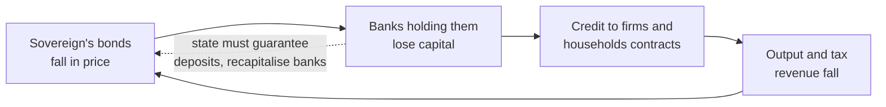

# A History of Debt · Lesson 6.2: The Eurozone and Greece

> ⏱ ~15 min · Module 6: Debt in the twenty-first century · Builds on: [6.1 The American mortgage and 2008](06-01-the-american-mortgage-and-2008.md), [4.1 Hamilton's assumption plan](04-01-hamiltons-assumption-plan.md) · Unlocks: [6.3 Holdouts and the law of sovereign restructuring](06-03-holdouts-and-the-law-of-sovereign-restructuring.md)

## Why this matters

Every episode so far has had a sovereign that could, at the limit, print its own money, devalue it, or stop paying. From 1999 a group of European states gave up the first two and wrote the third out of their treaty. When Greece turned out to owe far more than its books showed, the union had to decide something no one had drafted a procedure for: whether a currency without a common treasury could let one of its members default, and who would take the loss if it did not. The answer arrived in loans, a record write-down of private bonds, a sentence spoken in London, and an unused program that stopped the crisis anyway.

## The idea

A sovereign in trouble has three exits. Devalue, so that its exports become cheap and its wage bill shrinks in foreign currency. Inflate, so that a fixed-money debt gets lighter. Default, and negotiate. A euro member had given away the first two: monetary policy sat in Frankfurt, for the union as a whole. That left default — and the treaty had been written to make even that a purely national event, with no one else on the hook.

The reason that design strained is that a government's bonds do not sit in a vault. They sit on the balance sheets of banks, including banks in other member states, where the union's own rules let them be held against almost no capital. So a member's default is not a private quarrel between one treasury and its creditors. It is a banking crisis in the creditor countries, and a banking crisis at home, because domestic banks hold the most of all.

That circle — the sovereign–bank "doom loop" — is why rescuing a state and rescuing a creditor country's banks were, in 2010, two descriptions of one act.

The second strain is arithmetic. Without devaluation, a country restores competitiveness by cutting domestic wages and prices — "internal devaluation." But the debt ratio has GDP in its denominator, and that is *nominal* GDP. Cutting prices and output shrinks the denominator while the euro-denominated numerator stands still. Austerity and the debt ratio therefore pull in opposite directions, and which effect wins is a quantitative question, not a doctrinal one.

## Source

Treaty on the Functioning of the European Union, Article 125(1), second sentence (the "no-bailout clause"):

> A Member State shall not be liable for or assume the commitments of central governments, regional, local or other public authorities, other bodies governed by public law, or public undertakings of another Member State …

Read the verbs. The article forbids being *liable for* and *assuming* another member's commitments. It says nothing about lending to that member, and the Court of Justice, upholding the permanent rescue fund in *Pringle* (Case C-370/12, 2012), leaned on exactly that gap: the aim of the article, it held, is that members "remain subject to the logic of the market when they enter into debt," so assistance is compatible with it where the borrower stays responsible to its own creditors and the conditions attached push it toward sound budgets.

## The argument

The union as designed, and what the design implied when a member could not pay:

1. **Monetary policy is union-wide; fiscal policy stays national**, disciplined by the Stability and Growth Pact's reference values of 3 percent of GDP for the deficit and 60 percent for the debt. *In words:* one central bank, a national budget per member, and rules instead of a treasury.
2. **The central bank may not finance governments** (Art. 123), and **no member or the Union assumes another's commitments** (Art. 125). *In words:* each state borrows on its own credit and, in principle, can go bust on its own.
3. **Therefore discipline was to come from the bond market plus the Pact.** *In words:* lenders were supposed to charge a bad borrower more, long before insolvency.
4. **But the market did not price it that way.** From 1999 to 2008 Greek and German ten-year yields traded within a fraction of a percentage point of each other. *In words:* either investors did not believe Art. 125, or they thought the risk negligible; both readings are live, and both make market discipline arrive as a shock rather than a signal.
5. **A member cannot devalue, so adjustment runs through wages, prices and output** — and through the denominator of its debt ratio. *In words:* the cure operates on the very quantity being measured.
6. **A member's default is a union-wide banking event.** *In words:* enforcing the no-bailout rule meant accepting bank failures in the creditor states, which had their own taxpayers.
7. **So the choice in 2010 was not rule-versus-mercy but which loss to take.** Lending kept the rule's letter (loans, at a margin, repayable) while conceding its purpose; refusing kept the purpose at a price no creditor government would name out loud. *In words:* the treaty had a prohibition where it needed a procedure.

## Timeline

| Date | Event | What it did to the rule |
|---|---|---|
| Oct 2009 | A new Greek government revises the 2009 deficit to about 12.7 percent of GDP, against roughly 6 percent projected earlier (an earlier notification had said 3.7). Eurostat's figure, published Nov 2010, was 15.4 percent | Turns a fiscal number into a credibility crisis |
| 2 May 2010 | First program: about 110 billion euros — roughly 80 billion in bilateral loans from euro-area states, about 30 billion from the IMF, at exceptional access far beyond normal quota limits | Loans, not assumption: Art. 125 preserved in form |
| May–June 2010 | EFSM (on Art. 122(2)) and the temporary EFSF created; ECB starts buying member bonds in the secondary market | Two new lenders where the treaty had none |
| Oct 2010 | Deauville: the German and French leaders say future rescues should involve private creditors taking losses | Reintroduces default risk; peripheral spreads widen |
| Nov 2010 – May 2011 | Ireland, then Portugal, enter programs | The Greek case is no longer singular |
| Feb–Apr 2012 | PSI: about 199 billion euros of private bonds exchanged (96.9 percent of eligible), face value cut 53.5 percent; Greek law retrofits collective action clauses onto domestic-law bonds. Second program, about 130 billion euros | The largest sovereign restructuring on record, inside the union |
| 26 July 2012 | Draghi in London: "Within our mandate, the ECB is ready to do whatever it takes to preserve the euro. And believe me, it will be enough" | A central-bank backstop the treaty never wrote |
| Sept–Oct 2012 | OMT announced (conditional on an ESM program; never used); the permanent ESM begins work | Conditionality becomes the price of protection |
| June–Aug 2015 | Capital controls; the 5 July referendum rejects the creditors' terms, about 61 percent No; a third program of up to 86 billion euros follows within weeks | A vote against the terms, then the terms |

## Worked examples

**Example 1 (clean — the denominator).** Use the identity from [3.4](03-04-humes-prophecy-carrying-a-great-debt.md):

$$d_{t+1} = \frac{1+r}{1+g}\,d_t - s,$$

where $d$ is gross debt over GDP, $r$ the average nominal interest rate paid on the debt, $g$ the growth rate of *nominal* GDP, and $s$ the primary surplus as a share of GDP. *In words:* last year's ratio grows at interest, shrinks with the economy's nominal growth, and is cut by whatever the budget raises before interest.

Set the ratio constant and solve for the surplus that does it:

$$s^{*} = d\,\frac{r-g}{1+g}.$$

Take an illustrative country with $d = 1.30$ and $r = 4.5\%$. If nominal GDP grows at $g = 3\%$, then $s^{*} = 1.30 \times 0.015 / 1.03 \approx 1.9\%$ of GDP — demanding but ordinary. If instead nominal GDP *falls* at $5\%$, then $s^{*} = 1.30 \times 0.095 / 0.95 = 13.0\%$ of GDP. No democracy has sustained anything close to that. The parameter that moved was not the interest rate or the debt; it was the sign of $g$.

**Example 2 (hard — why the biggest write-down in history barely moved the ratio).** In the 2012 exchange, private holders gave up 53.5 percent of face value, receiving 15 percent of old face in short-term EFSF notes and 31.5 percent in new long bonds, plus a GDP-linked warrant. About 107 billion euros of face value disappeared — more than half of a year's Greek output. Zettelmeyer, Trebesch and Gulati (2013) put the loss in present value at 59–65 percent, depending on the discount rate used, the largest in the modern record.

Greece's debt ratio ended 2012 at about 160 percent of GDP and was higher two years later. Three reasons, all visible in the identity. First, the cut applied only to privately held bonds; official loans, the central bank's holdings and guaranteed debt were untouched. Second, the same crisis required borrowing tens of billions more to recapitalise the Greek banks that had just been written down — new debt replacing old. Third, $g$ stayed negative: output fell about a quarter from its 2008 peak. A one-off cut lowers $d_t$ once; a negative $g$ works on it every year.

The lasting effect was not the ratio but the creditor list. After 2012 most of Greece's debt was owed to other governments, the ESM and the IMF, on long maturities at low rates — a political creditor rather than a market one. That is why [6.3](06-03-holdouts-and-the-law-of-sovereign-restructuring.md)'s holdout problem, which dominated Argentina, was a footnote in Greece.

## Watch out

- **"Bailout" is doing argumentative work, not descriptive work.** The programs were loans to the Greek state, repayable with a margin, conditional on legislated measures — not a transfer, and not an assumption of Greek debts. They also financed payments to banks in creditor countries, which is why others call them a bank rescue routed through a government. Both descriptions fit the cash flows; say which one you are using.
- **Do not say the no-bailout clause was simply broken.** Whether the rescue funds are compatible with Art. 125 was litigated and decided in their favour on the reading above. You may think the decision strained the text — plenty of lawyers did — but the claim to argue is about the reading, not about a rule everyone agreed was violated.
- **Three different haircut numbers describe the same swap.** The face-value cut (53.5 percent), the present-value loss (59–65 percent), and the change in what the state owed overall (much smaller, since it borrowed to fund the cash sweetener and the bank recapitalisation) are not competing estimates. They answer different questions.
- **Anachronism trap, running the other way.** The American states that defaulted in 1841–42 are the standard precedent for a federation that refused assumption and survived. Before borrowing it, note what differed: the federal government had already assumed state debts once, in 1790 ([4.1](04-01-hamiltons-assumption-plan.md)); it had its own tariff revenue and its own currency; the defaulting states then wrote balanced-budget rules into their own constitutions rather than having them imposed. Henning and Kessler (2012) set out that sequence, and read as caution against the easy analogy as much as support for it.
- **Greece is not the euro area.** Ireland and Spain entered 2008 with low debt and budget surpluses, and their crises came from private and bank borrowing. Any explanation that works only through government profligacy explains Greece and little else.

## One-liner

> A currency union wrote a prohibition where it needed a procedure, and then spent five years inventing the procedure under deadline.

## Problems

**P1 (🟢) *(Formal.)*** Use $d_{t+1} = \frac{1+r}{1+g}d_t - s$ with illustrative, Greek-like numbers: $d_0 = 1.30$, $r = 4.5\%$. (a) Nominal GDP falls at $g = -5\%$ and the government runs a primary surplus of $s = 2\%$ of GDP. Compute $d_1, d_2, d_3$. (b) Compute the same three years with $g = +3\%$, everything else unchanged, and say in one sentence what the comparison shows. (c) Now a restructuring: debt is $d = 1.60$, of which privately held bonds are $1.05$ of GDP, and those are cut by 53.5 percent of face value. Immediately afterwards the state borrows an extra 0.25 of GDP to recapitalise its banks. Compute the ratio after both steps, then run one more year at $r = 3\%$, $g = -5\%$, $s = 0$. Round to three decimals.

**P2 (🟡) *(Exegetical.)*** In May 2010 the Union created a rescue facility on the basis of Article 122(2) TFEU:

> Where a Member State is in difficulties or is seriously threatened with severe difficulties caused by natural disasters or exceptional occurrences beyond its control, the Council … may grant, under certain conditions, Union financial assistance …

(a) Which words have to carry the weight if this article is to authorise assistance to a state whose difficulties arose from its own borrowing and its own accounts, and what reading of them is required? Name a reading that would exclude such a state. (b) Assistance under this article is Union money. Using the words of Article 125(1) in the Source above and the Court's reading of it, say why granting it is not by itself the thing Article 125 forbids — and name the one feature of an assistance package that, on that reading, would make it forbidden. 150 words total.

**P3 (🔴, optional) *(Exegetical.)*** Two explanations of the euro crisis. **A:** it was a fiscal crisis — states borrowed beyond their means and hid it, and the discipline built into the treaty failed to bind. **B:** it was a balance-of-payments crisis in a fixed-exchange-rate system — a decade of capital flowing from the core to the periphery stopped suddenly, and members without their own currency or a lender of last resort had no way to absorb the reversal. Name the single premise one side must deny, and say what evidence about the years 2000–2008, or about the crisis countries other than Greece, would move it. Do not argue for either. 150 words or fewer.

Solutions

**P1** *(Formal.)*

Note $\frac{1.045}{0.95} = 1.1$ exactly, which keeps (a) clean.

(a) $d_1 = 1.1 \times 1.30 - 0.02 = 1.43 - 0.02 = \mathbf{1.410}$. $d_2 = 1.1 \times 1.410 - 0.02 = 1.551 - 0.02 = \mathbf{1.531}$. $d_3 = 1.1 \times 1.531 - 0.02 = 1.6841 - 0.02 = \mathbf{1.664}$.

(b) $\frac{1.045}{1.03} \approx 1.014563$. $d_1 \approx 1.014563 \times 1.30 - 0.02 = 1.31893 - 0.02 \approx \mathbf{1.299}$; $d_2 \approx \mathbf{1.298}$; $d_3 \approx \mathbf{1.297}$. Same debt, same interest rate, same primary surplus: with 3 percent nominal growth the ratio is flat, with a 5 percent nominal contraction it rises by more than a third of GDP in three years. The sign of $g$, not the surplus, is doing the work. (Equivalently: $s^{*} = d(r-g)/(1+g)$ is 1.9 percent of GDP at $g = +3\%$ and 13.0 percent at $g = -5\%$.)

(c) Cut $= 0.535 \times 1.05 = 0.562$ (0.56175), so the ratio falls to $1.60 - 0.562 = \mathbf{1.038}$. Adding the bank recapitalisation: $1.038 + 0.25 = \mathbf{1.288}$. One year on, $\frac{1.03}{0.95} \approx 1.08421$, so $d \approx 1.08421 \times 1.288 \approx \mathbf{1.397}$ — above where the write-down left it, and most of the way back to 1.60 within two more years.

**Wrong turns:** using real instead of nominal growth in $g$ while leaving $r$ nominal (the identity mixes units then); applying the 53.5 percent cut to the whole 1.60 rather than to the privately held 1.05; treating the bank recapitalisation as outside the debt because it was "for the banks" — it was borrowed by the state.

---

**P2** *(Exegetical — strict.)*

**Must hit, strict (a):** the phrase "exceptional occurrences beyond its control" (and, secondarily, "difficulties"). To reach a state whose crisis came from its own borrowing and misreported accounts, "exceptional occurrences" has to be read as covering a market-wide event — the sudden loss of market access in a global financial crisis — with "beyond its control" attaching to that external event rather than to the fiscal history that made the state vulnerable to it. The excluding reading: the phrase is limited to external shocks of the kind the sentence lists, disasters and the like, so a crisis traceable to the member's own policy is by definition not "beyond its control."

**Must hit, strict (b):** Article 125 forbids being "liable for" or "assum[ing] the commitments" of another member. A loan does neither: the borrower remains the debtor on its existing obligations, and a new claim is created against it rather than an old one being taken over — which is the Court's reading in the Source section. The forbidden feature: an arrangement under which the assisting body becomes answerable to the member's creditors for those debts (a guarantee of the outstanding bonds, or a transfer discharging them), or, on the Court's purposive version, assistance with no conditions, so that the recipient is removed from the discipline the article exists to preserve.

**Wrong turns:** answering (a) with "the Council may grant assistance" — the permissive words are not the contested ones; treating (b) as a question about whether the rescues were *wise*, or about the political fact that creditors expected repayment.

**Model answer:** (a) Everything turns on "exceptional occurrences beyond its control." To cover Greece it must be read as the market-wide freeze of 2010, with "beyond its control" qualifying that external event, not the member's fiscal record; read narrowly, as a disaster-type clause, it excludes a state whose difficulties are its own doing. (b) Article 125 bans being "liable for" or "assum[ing]" another member's commitments. A loan adds a new debt and leaves the old creditors where they were, so it is not assumption. It becomes forbidden if the assistance guarantees or discharges the existing obligations, or — on the Court's purposive reading — if it comes without conditions, leaving the state outside market discipline.

---

**P3** *(Exegetical — strict on naming one premise; any defensible formulation passes.)*

**Must hit, strict:**
- The crux: *whether the borrowing that built up before 2008 was principally sovereign borrowing by the governments that later needed rescue.* A affirms it; B denies it, holding that the flows were private (bank and household), that the sovereign became the debtor of record only when it absorbed bank losses and a collapsed tax base, and that what made the reversal uncontainable was the absence of a national currency and a lender of last resort.
- Not the crux: whether Greek statistics were falsified (B can grant it), whether the Stability Pact was enforced (both sides can agree it was not), or whether austerity worked (a separate question).
- Evidence that bears: the composition of pre-crisis capital inflows and of current-account deficits country by country; the debt and deficit records of Ireland and Spain up to 2007 against Greece's and Portugal's; whether spreads moved with fiscal announcements or with bank losses and redenomination fear; whether the crisis ended when budgets tightened or when a central-bank backstop was announced in 2012.

**Wrong turns:** naming two premises; converting the crux into a verdict about who was to blame; treating Greece as decisive for the general claim when the disagreement is precisely about whether Greece generalises.

**Model answer:** The premise in dispute is that the pre-crisis build-up of debt in the crisis countries was mainly government debt. A needs it: only then does fiscal indiscipline explain why these states and not others lost market access. B denies it, reading the build-up as private capital flowing into banks and housing under a fixed exchange rate, with the state taking the debt onto its books afterwards. What would move it is the country record for 2000–2008: Ireland and Spain ran surpluses and low debt, which is hard for A unless Greece is treated as the type case rather than one of four. Also relevant is whether spreads tracked fiscal news or bank losses, and whether relief came from consolidation or from the 2012 backstop.

## Flashback

**From Lesson 5.5 (Jubilee 2000 and HIPC):** A poor country reaches its HIPC decision point in 2001: the relief amount is fixed, interim relief begins, and a poverty reduction strategy plus a list of triggers is agreed. Two triggers stall, and completion point is not reached until 2009. Over those eight years the price of the country's dominant export halves, and its debt-to-exports ratio climbs back above 150 per cent. Two sentences or fewer per part. (a) As of 2005, what has been irrevocably cancelled? (b) Who carries the risk of the price collapse, and which feature of the creditors' test puts it there? (c) At completion point in 2009, does the higher ratio entitle the country to more relief than was fixed in 2001?

Solution

**Must hit, strict (a):** **Nothing.** The amount was fixed in 2001 and interim relief has been flowing since, but relief becomes irrevocable only at the completion point; for eight years the creditors keep the claims and the country is being relieved provisionally, on condition. Naming the two-step structure — decision point fixes and starts, completion point makes final — is the whole of the answer.

**Must hit, strict (b):** the **debtor** carries it. The threshold is a ratio whose denominator is the country's export earnings, so the same debt stock becomes "unsustainable" again when a commodity price moves, while the relief amount was computed once, at the decision point, from decision-point exports and a present value of the debt struck then. Nothing in the design indexes the award to what happens next.

**Must hit, strict (c):** **No, not as of right.** The ratio test sizes the relief at entry; it is not a running covenant that re-measures and tops up automatically, which is the same design choice as (b). Credit for adding that the framework did allow an exceptional top-up at completion point where circumstances had fundamentally changed — but as a discretionary act of the creditors, case by case, not an entitlement the ratio creates.

**Wrong turns:** saying the debt was cancelled in 2001 — that erases the gap the two-step structure creates, which is precisely where countries sat for years; saying the creditors bear the export risk because the test is a capacity test (a capacity test run once is a snapshot, not insurance); reading the 2009 ratio as automatically reopening the arithmetic.

**Model answer:** (a) Nothing is irrevocable in 2005. The decision point fixed the amount and started interim relief; only the completion point makes the cancellation final, so the country has spent four years relieved but not released. (b) The country does. The threshold is debt over exports, so a commodity slump raises the ratio without any act of the debtor, while the relief was sized once from the exports and present value observed in 2001. (c) No. The test determines eligibility and the amount at entry rather than tracking the ratio through time; a top-up for fundamentally changed circumstances was possible, but as a discretionary concession by creditors, not something the new ratio entitles the country to.

## Connections

- **Backward:** [6.1](06-01-the-american-mortgage-and-2008.md) ended with a state absorbing private mortgage losses; here a union absorbs bank losses that had become sovereign ones. The identity in Example 1 is [3.4](03-04-humes-prophecy-carrying-a-great-debt.md)'s, run with the denominator falling instead of growing. Conditional lending by an official creditor with a program attached is [5.3](05-03-bretton-woods-and-the-lending-boom.md)'s design and [5.4](05-04-from-mexico-1982-to-the-brady-plan.md)'s crisis management, now applied inside a rich currency union. And the 1841–42 precedent belongs to [4.1](04-01-hamiltons-assumption-plan.md), where assumption happened first.
- **Forward:** [6.3](06-03-holdouts-and-the-law-of-sovereign-restructuring.md) takes up the legal machinery the 2012 exchange used and largely escaped — collective action clauses, their retrofit by statute, and the holdouts who broke Argentina. [6.4](06-04-new-creditors.md) asks what happens when the official creditor is not a club with a treaty but a single state.
- **Sideways:** why a fall in output raises the debt ratio faster than surpluses lower it is the arithmetic here and a model in `economics-of-debt` ([syllabus](../../economics-of-debt/syllabus.md)), which also owns debt overhang and sovereign default under a hard currency peg. Discounting the new bonds to value a haircut is [`mathematical-finance` 4.1](../../mathematical-finance/lessons/04-01-term-structure-bond-pricing.md). The IMF's role as lender and program designer belongs to `international-relations` ([syllabus](../../international-relations/syllabus.md)), and whether a population may be held to obligations contracted by earlier governments is `philosophy-of-debt` ([syllabus](../../philosophy-of-debt/syllabus.md)).
