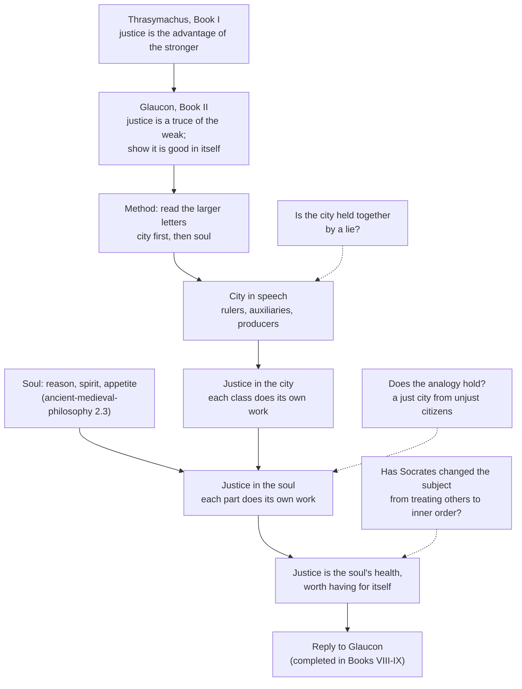

# History of Political Thought · Lesson 1.1: Plato's *Republic*: justice in the city and the soul

> ⏱ ~15 min · Module 1: The Greek polis · Builds on: none (the reconstruction habits of [`philosophical-method` 1.3](../../philosophical-method/lessons/01-03-reconstruction-and-charity.md) help) · Unlocks: [1.2 Plato against democracy, and the second-best city](01-02-plato-against-democracy-and-the-second-best-city.md)

## Why this matters

Every later political theory has to answer the question the *Republic* opens with: is justice a real good, or a set of rules the powerful impose and the weak agree to because they must? Thrasymachus's cynic and Glaucon's contract are still the two standard ways of debunking justice, and Plato's reply is the first full attempt to say what a just political order is by saying what a just person is. The *Republic* also teaches the discipline this whole course runs on: reading an old book as a move in its own argument before treating it as an answer to ours.

## The idea

The book is built as a challenge and a reply.

**The challenge.** In Book I the rhetorician Thrasymachus says that justice is whatever serves those in power: every regime writes laws for its own benefit and calls obeying them "just." So the just person is a dupe serving someone else, and the successful tyrant is the happiest of men. In Book II Plato's brothers, Glaucon and Adeimantus, make the challenge harder. They say they do not believe it, and they want Socrates to refute it properly. Glaucon's version: justice is a truce the weak strike because they cannot do wrong with impunity, and anyone who could would stop being just.

**The reply.** Socrates does not answer with a better rule. He changes the object of inquiry. Justice, he says, is said both of cities and of persons, and a city is bigger, so look for it there first, as a short-sighted man reads large letters before small ones. He then builds a city in speech, finds justice in it, and checks that the same structure exists in the soul. If justice turns out to be the soul's health, then asking whether it pays is like asking whether health pays.

**The context.** The conversation is set in the Piraeus at the house of Cephalus, whose son Polemarchus takes part. Plato's readers knew what came next. Polemarchus would be put to death by the Thirty, the oligarchy that ruled Athens after its defeat in the Peloponnesian War (404–403 BC). Plato's relatives Critias and Charmides were leading figures of that regime, and the restored democracy executed Socrates in 399. A dialogue about whether rulers rule for themselves was written, probably in the 370s, by someone who had watched both oligarchs and democrats get the answer wrong.

## Source

Plato, *Republic* I 338e–339a (Jowett, public domain). Thrasymachus explains his definition:

> And the different forms of government make laws democratical, aristocratical, tyrannical, with a view to their several interests; and these laws, which are made by them for their own interests, are the justice which they deliver to their subjects

Read it as a claim about *every* regime, not only tyranny. Democracies make democratic laws for the benefit of the people who rule there. Note too that justice is something delivered *to subjects*. It is obedience, and rulers are not bound by it.

## The argument

Thrasymachus's own argument is Problem 2's to reconstruct. Here is Socrates' reply in Books II–IV, in Plato's terms.

1. **Justice is said both of a person and of a city (368e).** *In words:* we call cities just and we call people just, so it may be the same thing in each.
2. **The city is larger, so its justice will be easier to see (368e–369a).** *In words:* study the big version first, then check it against the small one.
3. **A city arises because no one is self-sufficient, and each does best when doing the one work his nature fits (369b–370c).** *In words:* specialization is the city's founding principle, not a later efficiency gain.
4. **A good city has three classes: rulers who deliberate for the whole, auxiliaries who defend it, and producers who feed and supply it (412b–415d).** Each class is taught a founding myth, the *gennaion pseudos* or noble lie (414b–415d), that citizens are earth-born brothers mixed with gold, silver, or bronze and iron, and that a child is moved to whichever class his metal fits. *In words:* the city is divided by function and told a story that makes the division feel like kinship.
5. **Such a city is wise through its rulers, courageous through its auxiliaries, and temperate through agreement about who should rule (427e–432a).** *In words:* three of the four cardinal virtues belong to parts of the city or to their harmony.
6. **The remaining virtue, justice, is each class doing its own work: in Jowett's words, "doing one's own business, and not being a busybody" (433a–b).** A cobbler swapping jobs with a carpenter does little harm. A trader who pushes his way into ruling is the ruin of the city (434a–c). *In words:* justice is the structure that keeps each part to its function, and injustice is one part taking over another's work.
7. **The soul has three parts matching the three classes: reason, spirit, and appetite (434d–441c).** *In words:* the city's anatomy is found again in the person. The argument for the division belongs to psychology; see [`ancient-medieval-philosophy` 2.3](../../ancient-medieval-philosophy/lessons/02-03-the-soul-its-parts-and-immortality.md).
8. **So a person is just when each part does its own work, reason ruling with spirit as its ally and appetite governed (441d–442b); such justice concerns the inner self first and outward acts only as a result (443c–444a).** *In words:* justice is not first a rule for how you treat others. It is an order inside you, and just acts are the ones that preserve it.
9. **Justice so understood is the soul's health and injustice its civil war (444c–e).** *In words:* this is why Glaucon's question is badly posed. No one would trade health for the ring of Gyges. The full comparison of lives waits for Books VIII–IX.

## Argument map

Solid arrows show the order of the reply. Dashed arrows are the pressure points readers keep returning to. The third, whether an ordered soul guarantees the ordinary just acts Thrasymachus was talking about, is the most discussed in modern scholarship.

## Worked examples

**Example 1 (clean): who is being unjust?** Run step 6 on three cases from the city in speech.

- A cobbler who also does some carpentry. Plato says this does little harm (434a). So the principle is not "never do two jobs." Division of labor was only a shadow of justice (443c).
- A rich trader who uses his money to become a guardian. This is the ruin of the city (434b). What is wrong is not his wealth but that the function of deliberating for the whole has passed to someone whose ruling part is appetite.
- A guardian who starts to accumulate private wealth. This is the same fault in reverse. Plato bars guardians from private property (416d–417b) for exactly this reason.

Now carry it into the soul. A person whose appetite decides what reason may think about is the trader-guardian writ small. The mapping holds only if "doing its own work" means the same thing in both: a part performing the function that its nature suits it for. It is a claim about *structure*, not about who gets what share. That is why a modern reader looking for distributive justice in Book IV finds almost nothing.

**Example 2 (hard): three ways to read the noble lie.** The same passage (414b–415d) supports three readings, and each depends on how it frames the text.

- **As a perennial blueprint.** Karl Popper, in *The Open Society and Its Enemies* (1945), read the *Republic* as a program for a closed, caste society ruled by propaganda, and so as an ancestor of twentieth-century totalitarianism. The noble lie is his exhibit A.
- **As a perennial question, answered ironically.** On a reading associated with Leo Strauss (*The City and Man*, 1964), the city in speech is meant to show the *limits* of politics. A city that must censor poets, abolish the guardians' families and lie to its citizens is a city that cannot actually be built. Justice fully realized belongs to the soul, not the state. (Scholars dispute how far Strauss meant this; treat it as one reading.)
- **In context.** On a contextualist approach of the kind Quentin Skinner argued for in "Meaning and Understanding in the History of Ideas" (1969), you ask what Plato was *doing* by writing it. The myth answers an Athenian problem. The city's founding stories already claimed that Athenians were born from the soil, and Plato keeps that motif but adds that rank follows merit rather than birth. A golden child of bronze parents moves up (415b–c). The move was aimed at a city where oligarchs claimed rule by birth and wealth and democrats claimed it by number.

What each reading costs. Popper's reading must explain away the passage's own embarrassment: Socrates hesitates to tell the tale at all. Strauss's must explain why Plato spends so many pages on institutions. The contextual reading must say why the book has spoken to readers who never heard of the Thirty. None of these objections settles the matter. They show that the interpretive frame decides the reading before the words do.

## Watch out

- **Anachronism: *dikaiosynē* is not modern "social justice."** The Greek word covers being a just person generally, close to "righteousness." Looking in Book IV for principles of fair distribution (Rawls's question) is looking for an answer to a question the book was not asking. That question belongs to [`political-philosophy`](../../political-philosophy/syllabus.md).
- **Anachronism: the three classes are not Marxian classes or hereditary castes.** They are defined by function and by the soul's dominant part, and the myth itself provides for moving between them. Whether the city would actually allow that movement is a fair question. The text's stated rule is not in doubt.
- **You might think Glaucon endorses the contract view.** He says plainly that he does not hold it (358c). He states it at its strongest so that Socrates has to defeat it. It is the ancestor of contract theory ([3.3](03-03-hobbes-matter-motion-and-the-state-of-nature.md); [`ethics` 5.1](../../ethics/lessons/05-01-contractarianism-morality-as-mutual-advantage.md)), but Glaucon offers it as a challenge.
- **You might think Thrasymachus and Glaucon say the same thing.** For Thrasymachus the strong make the law to exploit the weak. For Glaucon the weak make it together to protect themselves from the strong. Both debunk justice, but they tell opposite stories about who wrote the rules.

## One-liner

> Thrasymachus says justice is the rulers' advantage and Glaucon says it is the weak's truce; Plato answers that justice is each part of a city or soul doing its own work, and so a kind of health no one would trade away.

## Problems

**P1 (🟢) *(Exegetical.)*** Close reading. Glaucon states "the received account" of justice (*Republic* II 358e–359b, Jowett):

> it is a mean or compromise, between the best of all, which is to do injustice and not be punished, and the worst of all, which is to suffer injustice without the power of retaliation

(a) Which reading do these words support? (i) Justice is a bargain that is rational for everyone. (ii) Justice is rational only for those who cannot do injustice with impunity. Name the words that decide it. (b) In one sentence, say how this account's story of who makes the law differs from Thrasymachus's in the Source. 100 words or fewer in total.

**P2 (🟡) *(Exegetical.)*** (a) Reconstruct Thrasymachus's position across 338c–344c in numbered premises, in his own terms. Include his retreat to the ruler "in the strict sense" (340d–341a) and the shepherd speech (343b–344c). Flag the weakest premise. (b) Socrates replies that every craft, taken strictly, seeks the good of its object: medicine serves the body, not the doctor (341c–342e). Name the single premise about ruling that one of them must deny, and say what would move a defender of either side. 150 words each.

**P3 (🔴, optional) *(Exegetical.)*** Diagnose this invented op-ed paragraph. Which ideas from Book I–II does it borrow, from whom, and what has it dropped or blended that the originals keep apart? 150 words or fewer.

> "Let's stop pretending. Every regulation on the books was written by the incumbents it protects, and 'compliance' just means paying tribute to them. And don't tell me about the honest firm. Give any CEO a guarantee he'd never be caught, and he'd cut every corner going. The honest firm is simply the one that can't afford better lawyers. Honesty is what we call being too small to cheat."

Solutions

**P1** *(Exegetical, strict.)*

**Must hit, strict (a):** reading (ii). The deciding words are "the best of all, which is to do injustice and not be punished." Justice is ranked below unpunished injustice, so it is only a second-best, chosen by those who cannot reach the best. Someone who can do injustice with impunity has no reason on this account to accept the compromise. (The next sentence makes this explicit, but the quoted words already imply it.) "Without the power of retaliation" shows the bargain is struck from weakness.
**Must hit, strict (b):** for Thrasymachus the rulers (the strong) make laws for their own interest and impose them on subjects. On the received account the many, who both do and suffer injustice, agree among themselves to laws that protect them from the worst.
**Wrong turns:** choosing (i) because "compromise" sounds mutual. The compromise is mutual only among people who are unable to do better. Also: attributing the account to Glaucon's own belief.
**Model answer:** (a) Reading (ii). Unpunished injustice is "the best of all," and justice is merely a middle point below it. The compromise is rational only for someone who lacks the power to reach the best. (b) Thrasymachus has the strong write the law against the weak. The received account has the weak write it together against the strong.

---

**P2** *(Exegetical, strict.)*

**Must hit, strict (a):**
- P1: In every city the ruling group makes laws with a view to its own interest (338e).
- P2: Justice is subjects obeying those laws (338e–339a).
- P3: A ruler "in the strict sense" does not err, just as a doctor does not err insofar as he is a doctor. So what he commands is really to his advantage (340d–341a).
- ∴ C1: Justice is the advantage of the stronger (339a, 341a).
- P4: So justice is "another's good," the loss of the one who practices it. Injustice is one's own profit (343c).
- P5: This is seen most clearly in the tyrant, who is called happy (344a–c).
- ∴ C2: The unjust life is better than the just life.
- Weakest premise flagged, with a reason. The best candidate is P3, since the strict-sense move invites Socrates' craft analogy. P4's shift from "the rulers' advantage" to "another's good" is also acceptable.

**Must hit, strict (b):** the crux is whether ruling, taken strictly, is a craft whose defining aim is the good of those ruled. Socrates affirms it: a craft as such serves its object, and wage-earning is a separate craft (346a–e). Thrasymachus denies it: the shepherd fattens sheep for the master's table. Say what would move each side. Socrates' defender could be moved by showing that the strict/popular distinction does not carry over from medicine to ruling. Thrasymachus's defender could be moved by showing that his own "strict sense" commits him to judging rulers by the standard of their craft.
**Wrong turns:** naming "whether justice pays" as the crux, which is the conclusion in dispute, not the premise; naming two premises.
**Model answer (b):** The crux is whether ruling in the strict sense aims at the good of the ruled. Socrates says every craft as such serves its object, as medicine serves the body. Thrasymachus's shepherd speech denies that ruling works this way: the shepherd tends sheep for his own or his master's gain. Thrasymachus himself introduced the strict sense, so he is exposed to Socrates' use of it. He would have to drop it, or show that ruling is a craft whose object is the ruler's own interest. A Socratic would be moved by an argument that ruling is unlike medicine: its "patients" can be exploited without the art of ruling itself being done badly.

---

**P3** *(Exegetical, strict.)*

**Must hit, strict:**
- Sentence 2 borrows **Thrasymachus**: laws are written by those in power for their own advantage, and obedience serves them (338e–339a).
- Sentences 4–6 borrow **Glaucon's Gyges argument**: anyone guaranteed impunity would act unjustly, so the just are only those unable to be unjust (359b–360d).
- What it blends: the two accounts disagree about who writes the rules. For Thrasymachus, the strong. For Glaucon's received account, the weak together. The op-ed makes incumbents the authors and then treats honest firms as the weak, running both stories at once.
- What it drops: at least one of these. Glaucon does not hold the view and puts it forward to be refuted (358c). Thrasymachus's claim concerns rulers in the strict sense, not every powerful party. The *Republic*'s question is whether justice is good *in itself*, which the op-ed never asks.

**Wrong turns:** naming only Thrasymachus; attributing the impunity argument to Thrasymachus. He praises the tyrant, but the impunity thought experiment is Glaucon's.
**Model answer:** The first claim, that incumbents write regulations to serve themselves, is Thrasymachus: laws made by rulers for their own interest, called justice for the subject. The impunity test is Glaucon's ring of Gyges. So is the conclusion that honesty is only inability to cheat. The op-ed runs the two together, though they disagree about who writes the law: for Thrasymachus the strong, for Glaucon's received account the weak, to protect themselves. It also drops the frame. Glaucon puts the view forward so that Socrates must defeat it, and the demand is to show justice worth having for itself, a question the op-ed never raises.

## Connections

- **Backward:** the *nomos*/*physis* debate that Thrasymachus and Glaucon inherit is in [`ancient-medieval-philosophy` 1.3](../../ancient-medieval-philosophy/lessons/01-03-the-sophists-and-socrates.md). The division of the soul that step 7 borrows is argued in [2.3](../../ancient-medieval-philosophy/lessons/02-03-the-soul-its-parts-and-immortality.md), and the Line and the Cave behind the rulers' knowledge are in [2.2](../../ancient-medieval-philosophy/lessons/02-02-recollection-the-line-and-the-cave.md).
- **Forward:** [1.2](01-02-plato-against-democracy-and-the-second-best-city.md) takes the rulers' claim to knowledge head on, with the ship of state and the decline of regimes, and then asks what the *Laws* concedes. [1.3](01-03-aristotle-the-city-exists-by-nature.md) is Aristotle's critique of the unity this city demands. Glaucon's contract returns fully armed in Hobbes ([3.3](03-03-hobbes-matter-motion-and-the-state-of-nature.md)).
- **Sideways:** Glaucon's challenge is the ancestor of morality as mutual advantage in [`ethics` 5.1](../../ethics/lessons/05-01-contractarianism-morality-as-mutual-advantage.md). Finding the premise Socrates and Thrasymachus disagree about is the skill from [`philosophical-method` 4.3](../../philosophical-method/lessons/04-03-finding-the-crux.md). Whether justice is first a virtue of persons or of institutions is still argued in [`political-philosophy`](../../political-philosophy/syllabus.md).
