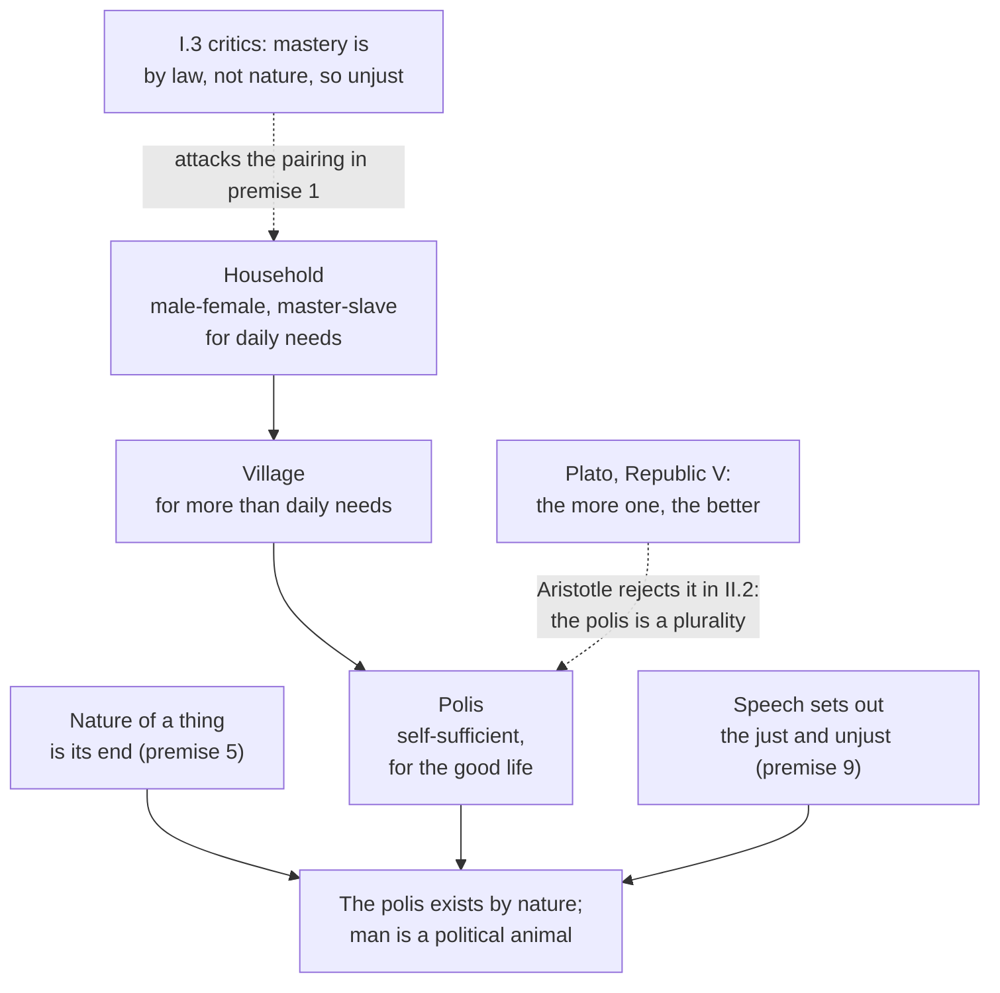

# History of Political Thought · Lesson 1.3: Aristotle: the city exists by nature

> ⏱ ~15 min · Module 1: The Greek polis · Builds on: [1.1 Plato's *Republic*: justice in the city and the soul](01-01-platos-republic-justice-in-city-and-soul.md), [1.2 Plato against democracy, and the second-best city](01-02-plato-against-democracy-and-the-second-best-city.md) · Unlocks: [1.4 Aristotle: constitutions, citizens and the polity](01-04-aristotle-constitutions-citizens-and-the-polity.md)

## Why this matters

Hobbes, Locke and Rousseau will all begin with individuals who *make* a political community by agreement. Aristotle, Plato's student for twenty years, begins from the opposite end: the city is not an invention layered on top of human nature but the place where that nature is completed. Whether politics is natural or artificial is the first fork in the whole tradition, and nearly every later thinker in this course takes a side on it. The same book of the *Politics* also defends natural slavery, and the next book takes apart the *Republic*'s communism. You need all three to read Aristotle as he wrote, not as a quotable forerunner.

## The idea

Watch an acorn. Nobody decides that it should become an oak; it grows toward being one, and the oak is what "acorn" was aiming at all along. Aristotle's physics calls that aim the thing's *nature*, its end (see [`ancient-medieval-philosophy` 3.2](../../ancient-medieval-philosophy/lessons/03-02-nature-and-the-four-causes.md); it is not re-taught here).

*Politics* I.2 runs the same pattern on human associations. People pair up to have children and to get the day's work done: that is the household. Households cluster into villages. Villages combine into a community large enough to supply everything a human life needs: the *polis*, the self-governing Greek city. If the household is natural, and the polis is what the household was growing toward, then the polis is natural too, the oak of which the household is the acorn.

Then comes a second argument. Bees and cranes live together, but humans have speech (*logos*), and speech does more than signal pain or pleasure: it lets us argue about what is useful and what is just. An animal built to argue about justice is built for a community that decides questions of justice together. So humans are *political* animals in a stronger sense than any herd.

Finally, Aristotle says the city is *prior* to the individual, the way a body is prior to a hand: a severed hand is a hand in name only. (Rebuilding that argument is P1.)

## Source

Aristotle, *Politics* I.2, 1253a1–4 (Jowett translation, public domain):

> Hence it is evident that the state is a creation of nature, and that man is by nature a political animal. And he who by nature and not by mere accident is without a state, is either a bad man or above humanity

Jowett's "state" translates *polis*. Aristotle has no word for an impersonal state apparatus separate from its citizens; read "city" throughout. And note "by nature and not by mere accident": the exile is not the target, the person whose nature does not fit city life is.

## The argument

**The growth argument (I.2, 1252a24–1253a1).**

1. **Two pairings come first: male and female, for offspring; natural ruler and natural subject (master and slave), for preservation. From these the household arises, for everyday needs.** *In words:* the smallest association already contains ruling and being ruled, and it contains slavery.
2. **Several households form a village, for needs beyond the daily.** *In words:* the next stage is bigger, and aims higher.
3. **Several villages form a complete community, nearly or fully self-sufficient: the polis. It comes into being for the sake of life, and continues in being for the sake of the good life** (1252b27–30). *In words:* the city starts as survival and stays for flourishing.
4. **The earlier associations exist by nature.** *In words:* nobody contracts into a family; it grows out of what we are.
5. **The nature of a thing is what it is when its development is complete: its end** (1252b32–34). *In words:* you learn what a thing is from its finished form, not its first stage.
6. **The end is best, and self-sufficiency is an end and best.** *In words:* completion is not neutral; it is the good the process was for.
7. **So the polis exists by nature, and a human being is by nature a political animal.** *In words:* the city is the household's completed form, so living in one is part of what it is to be human.

**The speech argument (1253a7–18).**

8. **Nature makes nothing in vain.** *In words:* a capacity nature gives has a use.
9. **Humans alone have speech; voice signals pleasure and pain, speech sets out the expedient and inexpedient, and so the just and unjust.** *In words:* we can argue about what is right, not just yelp.
10. **A shared perception of good and bad, just and unjust, is what makes a household and a city.** *In words:* the community is built out of exactly what speech is for.
11. **So a human is more of a political animal than bees or any herd animal.** *In words:* our nature points to a community of deliberation, not mere cohabitation.

Two cautions on the reasoning. Premise 5 is where the argument lives: "natural" means "the completion of a natural process", not "found without human effort". And "political animal" leans on what *ethics* 4.1 argues about the human *ergon* ([the function argument](../../ethics/lessons/04-01-aristotle-the-human-good.md)): the good life the city exists for is the life of rational activity.

## Argument map

Solid arrows run from ground to conclusion. The dashed edges are the two quarrels this lesson reads: one Aristotle reports and answers, one he starts.

## Worked examples

**Example 1 (clean: two men without a city).** A citizen of Athens is ostracized and lives ten years abroad with no city of his own. Now imagine a being like Homer's Cyclopes (whom I.2 cites for the scattered early households), each giving law to his own family, with no assemblies, and suppose that isolation is his settled nature. Run the source passage. The exile is cityless "by mere accident": his nature still points to a polis, and he is deprived of it. The second would be cityless by nature, and Aristotle's disjunction applies: either worse than human (he adds that such a one is a lover of war) or above humanity. A little later he gives the sharper form: whoever cannot share in a community, or needs nothing because he is self-sufficient, is a beast or a god (1253a27–29). The test is never "does he live in a city?" but "what is his nature for?"

**Example 2 (hard: natural slavery).** Premise 1 put the master-slave pairing inside the first natural association, so Aristotle owes an account of it. He gives one in I.4–7, and it should be read without softening.

A household needs instruments, and a slave is "a living possession" (1253b32), an instrument for action that belongs wholly to another. Is anyone *by nature* a slave? Yes, he says: rule of the better over the worse is natural throughout (soul over body, reason over appetite), and whoever shares in reason enough to apprehend it but not to possess it is a slave by nature (1254b20–23), for whom slavery is beneficial and just. Later, in I.13, he says that the slave has "no deliberative faculty at all" (1260a12), the woman has it without authority, the child has it immature. He also quotes, apparently with approval, the poets' line that Greeks should rule barbarians (1252b7–9).

Now the strain, which Aristotle himself records. I.3 reports critics who hold that mastery is contrary to nature, a distinction by law only, and therefore unjust. I.6 grants that they are in a sense right: slavery by convention, the law that war captives belong to the victor, is attacked by many jurists, and a war may itself be unjust. He admits that nature intends to mark free and slave in body and soul but often fails, and the soul cannot be seen. He concludes that where mastery rests on law and force rather than nature, master and slave are not friends.

Follow the logic without importing a verdict. Aristotle's criteria sort people by a capacity (deliberation) that he admits cannot be observed, while actual Greek slavery ran mainly through capture and sale, the route he concedes may be unjust. Whether that makes his theory a justification of Athenian practice or, read strictly, a standard almost no real enslavement met, is a live interpretive dispute. What is not disputed is that he held natural slaves exist. Later readers used both halves: at Valladolid (1550–51), Juan Ginés de Sepúlveda invoked Aristotelian natural slavery against the native peoples of the Americas, and Bartolomé de las Casas contested that application. Whether any theory of natural hierarchy survives is a question for [`political-philosophy`](../../political-philosophy/syllabus.md), not this lesson.

## Watch out

- **You might think "political animal" means "social animal."** Bees are gregarious; Aristotle says humans are political *more* than bees because of speech about justice. The Latin tradition's softening into "social and political animal" (Aquinas, *De Regno* I.1) already shifts the emphasis. Also, "by nature" does not mean "without anyone doing anything": Aristotle calls the first founder of a city the greatest of benefactors (1253a30–31).
- **Anachronism trap: reading Jowett's "state" as the modern state.** A polis was a few thousand citizens ruling and being ruled in turn, with no separation of state from society or of public from religious life. The claim that the polis is prior to the individual is not a charter for bureaucracy; it says a human's life is completed only as a member of a self-governing community.
- **Anachronism trap: hearing the tragedy of the commons in II.3.** Aristotle does say that what is common to most gets least care, and later readers link it to modern free-rider arguments. But his target is the *Republic*'s guardian community of wives, children and property as a route to civic unity, and his worry includes family affection diluted to nothing, like a little wine in much water (II.4). His remedy is not simply private property: it is private ownership with common *use*, generosity cultivated by the legislator (II.5).
- **You might think the critique of Plato is a defence of individualism.** His objection is that a city can be too *much* one, not that individuals come before it (II.2). A city is a plurality of different kinds of people, and pushed toward the unity of a household or a single person, it stops being a city.

## One-liner

> The polis is the household's completed form, so humans, the animals who argue about justice, are made for it; but a city is a plurality, not one person writ large, and the same teleology that makes citizens natural made Aristotle call some men slaves by nature.

## Problems

**P1 (🟢) *(Exegetical.)*** Right after the speech argument, Aristotle argues that the polis is prior by nature to the individual (1253a18–29): the whole is prior to the part; a hand cut from a destroyed body is a hand only in name, like a stone hand, since things are defined by their work and power; the isolated individual is not self-sufficient and so is like a part in relation to the whole. (a) Reconstruct this in four or five numbered premises and a conclusion, in Aristotle's terms. (b) Say what kind of priority is claimed, given that I.2 has just told a story in which households come *before* the polis. (c) Flag the premise most open to challenge and say why. 150 words or fewer.

**P2 (🟡) *(Exegetical.)*** *Politics* II.3, 1261b33–35 (Jowett), on the *Republic*'s proposal that the guardians hold wives, children and property in common:

> For that which is common to the greatest number has the least care bestowed upon it. Every one thinks chiefly of his own, hardly at all of the common interest; and only when he is himself concerned as an individual.

(a) Which reading do the words support? **R1:** common holding is unjust because it violates each person's right to what is his. **R2:** common holding defeats its own purpose, because care follows what each regards as his own. **R3:** people are selfish, a vice the city should correct. Name the words that decide it.

(b) An invented tenants' newsletter: *"The shared garden is a jungle because nobody owns it; everyone assumes someone else will weed. Aristotle saw this: what belongs to everyone is cared for by no one. So let's split it into private plots and stop pretending sharing works."* Whose argument is it borrowing, and what has it dropped from the original? 150 words or fewer for (a) and (b) together.

**P3 (🔴, optional) *(Exegetical (a) · Evaluative (b).)*** In *Republic* V (462a–b) Socrates says the greatest good for a city is whatever binds it into one, and the greatest evil whatever pulls it into many; he compares the well-ordered city to a single person who feels pain when a finger is hurt. Aristotle (II.2) replies that a city pushed toward unity becomes a household and then an individual, and ceases to be a city. (a) Name the single premise one side affirms and the other denies. (b) Aristotle himself compared the city to a body and the citizen to a hand (I.2). Does that analogy commit him to the unity he rejects in Book II? Any verdict. 150 words or fewer.

Solutions

**P1** *(Exegetical — strict, with a small flagged step.)*

**Must hit, strict (a):**
- P1: A whole is prior by nature to its parts.
- P2: Things are defined by their work and power; what can no longer do its work is the same thing in name only (the stone hand).
- P3: Separated from the polis, an individual is not self-sufficient and cannot live the life that defines him.
- P4: So the individual stands to the polis as a part to a whole.
- ∴ The polis is prior by nature to the individual (and to the household).

**Must hit, strict (b):** priority in nature or definition (what the part *is* depends on the whole), not in time. The growth story is temporal; this claim is not, so the two do not conflict.

**Must hit, any verdict (c):** one premise named with a reason. Strong candidates: P3→P4 (dependence is not parthood: trading partners depend on each other without being parts of a whole), or P2's analogy (an exile, unlike a severed hand, still sees, speaks and reasons).

**Wrong turns:** reading "prior" as "earlier in history", which makes Aristotle contradict himself a page apart; treating the beast-or-god remark as a premise rather than a corollary.

**Model answer:** (a) P1 wholes are prior to parts; P2 things are defined by their work, so a part cut off is that part in name only; P3 the isolated individual is not self-sufficient; P4 so he is to the city as a part to a whole; ∴ the city is prior by nature to him. (b) Priority of nature: the individual's full being and definition depend on the city, even though households came first in time. (c) P4: that I need a city to live well shows dependence, not that I am a part whose identity the whole fixes. The exile keeps his speech and reason, which the severed hand does not.

---

**P2** *(Exegetical (a) · Exegetical (b) — both strict.)*

**Must hit, strict (a):** **R2.** "has the least care bestowed upon it" names the harm as neglect, a failure of the scheme's own aim, not an injustice; "thinks chiefly of his own" and "only when he is himself concerned as an individual" describe where care attaches, without condemning it. R1 imports rights language the passage lacks. R3 fails because the passage describes rather than blames; II.5 adds that self-love is natural and only its excess is censured.

**Must hit, strict (b):** it borrows Aristotle's neglect argument (II.3). It drops at least one of: (i) his remedy, private ownership with common *use*, sharing cultivated by the legislator (II.5), where the newsletter abolishes use-sharing too; (ii) his target, the *Republic*'s guardian communism as a route to civic unity, not any shared resource; (iii) his admission that common use already works in well-ordered cities (the Spartans' use of one another's horses and dogs).

**Wrong turns:** choosing R3 because "thinks chiefly of his own" sounds like a charge of selfishness; saying the newsletter "gets Aristotle right" because the first sentence matches.

**Model answer:** (a) R2. The complaint is that common things get "the least care", a failure of the scheme on its own terms; the second sentence reports that care follows what one holds "as an individual", and nothing condemns that. No right is mentioned, and II.5 calls self-love natural. (b) It is Aristotle's II.3 argument, cut from its conclusion. Aristotle wanted property private but its use common, with the legislator training citizens to share, and he pointed to Sparta as proof that shared use works. His target was Plato's guardian communism, not a garden rota.

---

**P3** *(Exegetical (a) — strict · Evaluative (b) — any verdict.)*

**Must hit, strict (a):** the premise *the more a city is one, the better it is* (Aristotle names it in II.2 as the premise of Socrates' argument). Plato affirms it; Aristotle denies it, because the polis is by nature a plurality of *different* kinds whose self-sufficiency depends on their difference.

**Must hit, any verdict (b):** state the tension (both thinkers use a body analogy); draw a distinction that either dissolves or confirms it, such as priority of the whole (dependence and definition) versus degree of unity (sameness, shared feeling); note that a body's parts are themselves unlike, which may favour Aristotle's kind of unity; a one-line verdict.

**Wrong turns:** naming "whether communism works" as the crux, which is a consequence, not the premise; assuming Aristotle opposes unity as such, when II.5 says a city should be one in some respects, not all.

**Model answer (b), one of several:** No, on a careful reading. I.2's analogy claims the city is prior: a citizen is what he is only within it. That is a claim about dependence. Book II rejects a different thing: unity as sameness, a city whose members share one set of pleasures and pains. A body is the best case of a whole made of *unlike* parts; a hand is not a foot. So the analogy supports a differentiated unity, exactly what II.2 defends. A reader who says yes can press that Plato's finger image is also a body analogy, and Aristotle gives no principled stopping point between "prior whole" and "too much one".

## Flashback

**From Lesson 1.1 (Plato's *Republic*: justice in the city and the soul):** *(Exegetical.)* Close reading. The larger-letters method is introduced with the proviso "if they were the same" (368d). Having found justice in the city, Socrates says of carrying it over to the soul (434d–435a, Jowett):

> if they agree, we shall be satisfied; or, if there be a difference in the individual, we will come back to the State and have another trial of the theory

(a) Which reading do the words support? **(i)** The city-soul match is assumed from the start, so finding the same justice in the soul is guaranteed. **(ii)** The match is a hypothesis the look at the soul could fail, in which case the account of the *city* is revised too. Name the deciding words. (b) Socrates' very next step asks whether a greater and a lesser thing called by the same name are alike insofar as they share that name. In one or two sentences, say whether that step fits reading (ii) or pulls toward (i). 100 words or fewer in total.

Solution

**Must hit, strict (a):** reading (ii). The deciding words are "if there be a difference in the individual" (a failed match is openly contemplated) and "come back to the State and have another trial of the theory" (a mismatch sends the inquiry back to revise the city, not just the soul). "if they were the same" at 368d confirms that the sameness was conditional from the outset.
**Must hit, strict (b):** it pulls toward (i). The principle that things called by the same name are alike in that respect makes the soul's justice match the city's before the soul has been examined. So the hypothesis is tested against a premise that already favours a match. (Book IV then does argue separately for three parts of the soul, 436b–441c, which is the real test.)
**Wrong turns:** choosing (i) because the argument does in fact find a match; the passage is about method, not outcome. Treating "come back to the State" as a retreat from the soul rather than a revision of the city.
**Model answer:** (a) Reading (ii). "If there be a difference in the individual" allows that the match could fail, and "come back to the State and have another trial" makes the city's account revisable in that case; 368d's "if they were the same" was already conditional. (b) It pulls toward (i). If things sharing a name are alike in that respect, the soul's justice must resemble the city's before we look. The independent test is the argument for the soul's three parts that follows.

## Connections

- **Backward:** [1.1](01-01-platos-republic-justice-in-city-and-soul.md) built the city as the soul writ large; Book II of the *Politics* is Aristotle's answer to that construction, and P3 is the crux. The teleology is [`ancient-medieval-philosophy` 3.2](../../ancient-medieval-philosophy/lessons/03-02-nature-and-the-four-causes.md); the good life the city exists for is [`ethics` 4.1](../../ethics/lessons/04-01-aristotle-the-human-good.md). Finding a crux is [`philosophical-method` 4.3](../../philosophical-method/lessons/04-03-finding-the-crux.md).
- **Forward:** [1.4](01-04-aristotle-constitutions-citizens-and-the-polity.md) asks who should rule this natural community, and defines the citizen as one who rules and is ruled in turn. Aquinas ([2.4](02-04-aquinas-on-kingship-tyranny-and-property.md)) takes over both the political animal and the private-ownership, common-use formula. Hobbes ([3.3](03-03-hobbes-matter-motion-and-the-state-of-nature.md)) denies that humans are political by nature and builds the commonwealth as an artifice; Rousseau ([4.3](04-03-rousseau-discourse-on-inequality.md)) makes sociability a late and corrupting acquisition; Marx ([6.5](06-05-marx-from-hegel-to-historical-materialism.md)) revives the social nature of humans while attacking private property.
- **Sideways:** the neglect of common things is the informal ancestor of the public-goods problem in [`grad-micro` 6.4](../../grad-micro/lessons/06-04-public-goods.md), with the caveat in Watch out. Property as private in ownership and common in use runs into [`catholic-social-teaching`](../../catholic-social-teaching/syllabus.md)'s universal destination of goods. Whether natural hierarchy or the naturalness of political community can be defended today belongs to [`political-philosophy`](../../political-philosophy/syllabus.md).
