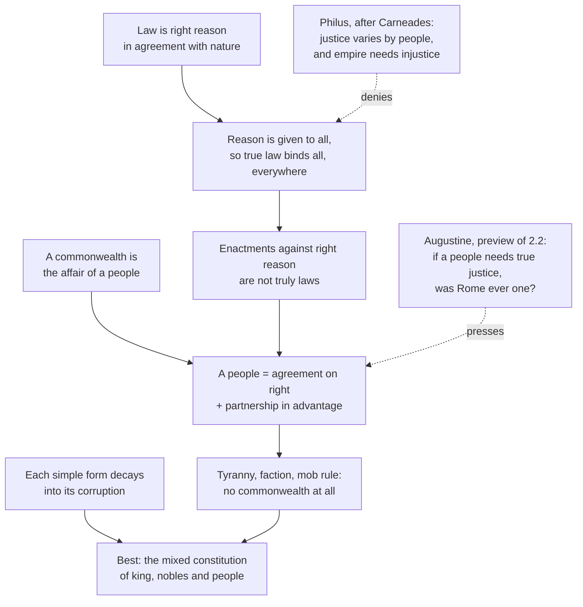

# History of Political Thought · Lesson 2.1: Cicero: the commonwealth and the law of nature

> ⏱ ~15 min · Module 2: Rome and Christendom · Builds on: [1.4 Aristotle: constitutions, citizens and the polity](01-04-aristotle-constitutions-citizens-and-the-polity.md) · Unlocks: [2.2 Augustine: the two cities](02-02-augustine-the-two-cities.md)

## Why this matters

"Republic" is a Latin word, and it came with a definition attached. Cicero wrote that a *res publica* is the *res populi*, the property or affair of a people, and he defined a people so that justice is built into it. From that one move follow two claims the West never stopped arguing about. A tyranny is not a bad state but no state at all. And there is a law above every statute that no senate or assembly can repeal. Augustine will attack the definition, Aquinas will build on the law, and the American founders read both. This lesson gets them right in Cicero's own terms, before anyone borrows them.

## The idea

Think of an estate. It belongs to its owner. If a steward seizes it and runs it for himself, it is still land, still a set of buildings. But it is no longer *the owner's estate* in any sense that matters. The name survives; the thing is gone.

Cicero (106–43 BC), consul in 63 BC and the republic's most famous orator, applies that thought to Rome. A commonwealth is the people's affair. So when one man, a faction or a mob treats the city as its own, the buildings and magistracies remain, but the commonwealth does not. And what makes a crowd into a *people* is not just living together. It is agreement about what is right (*ius*) and a shared stake in the common advantage.

That raises the obvious question: agreement about *which* right? If "right" meant whatever a people happens to enact, the definition would be empty, since any regime could call its decrees right. Cicero's answer comes from the Stoics ([`ancient-medieval-philosophy` 4.2](../../ancient-medieval-philosophy/lessons/04-02-the-stoics-logos-fate-and-virtue.md)). There is a *true law*: right reason, the same reason that orders the cosmos, present in every human being. Statutes are law to the degree they agree with it.

Context matters twice. First, *On the Commonwealth* (*De Re Publica*, written c. 54–51 BC) is a dialogue set in 129 BC, in the garden of Scipio Aemilianus, when the republic still seemed whole; Cicero wrote it as that republic was coming apart under armed factions. Second, the text is a ruin. It survived largely through quotations in Augustine and Lactantius until Angelo Mai found part of it under a later text in a Vatican palimpsest, published in 1822. Several of its most famous passages, including the one below, exist only because Christian authors quoted them.

## Source

Cicero, *On the Commonwealth* III.22 (33), preserved by Lactantius, *Divine Institutes* VI.8 (trans. C. D. Yonge, 1853):

> True law is right reason conformable to nature, universal, unchangeable, eternal, whose commands urge us to duty, and whose prohibitions restrain us from evil.

Note the order. "Right reason" comes first, and "law" is its name when it commands and forbids. Law is not defined as the command of anyone in particular, which is exactly what Thrasymachus assumed in [1.1](01-01-platos-republic-justice-in-city-and-soul.md). The speaker in the dialogue is Laelius, answering a speech in which Philus had revived the case the Greek skeptic Carneades made at Rome in 155 BC: that justice is convention, varying from people to people, and that a wise power prefers advantage to it.

## The argument

**A. What a commonwealth is** (*On the Commonwealth* I.25–29, I.45, III.31–33; chapter numbers as in Yonge, standard sections in parentheses where given).

1. **A commonwealth is the affair of a people** (I.25 (39)). *In words:* the state belongs to its people the way an estate belongs to its owner; rulers are stewards, not owners.
2. **A people is not any gathering, but an association bound by agreement on right and by shared advantage.** Scipio's words, in Yonge:

   > the people is not every association of men, however congregated, but the association of the entire number, bound together by the compact of justice, and the communication of utility.

   The Latin pairs *iuris consensu* (consent to right, or law) with *utilitatis communione* (partnership in advantage). *In words:* two ingredients, a shared standard of right and a shared stake, and a crowd lacking either is not a people.
3. **Humans associate by nature, not chiefly from weakness** (I.25). *In words:* we would seek society even if we needed nothing, which is Aristotle's political animal ([1.3](01-03-aristotle-the-city-exists-by-nature.md)) in Roman dress.
4. **Every commonwealth needs a directing authority: one, few or many** (I.26). Each is tolerable while the bond of step 2 holds; each slides toward its corruption, king to tyrant, aristocracy to faction, people to mob (I.28–29, I.44), which is the cycle of regimes Polybius called *anacyclosis* (*Histories* VI). *In words:* every simple form carries its own decay.
5. **So the best form is a blend** of a royal element, an aristocratic element and a popular element (I.45 (69)). It gives enough equality for liberty and a stability no simple form has; Rome's inherited constitution, grown over generations rather than designed by one founder, is the best instance (I.46; Book II). *In words:* consuls, senate and assemblies check one another, so no part can seize the whole.
6. **Where a tyrant, a faction or a mob holds everything, nothing is the people's affair** (III.31–33 (43–45)). *In words:* there is no owner left for the estate to belong to.

**∴** A tyranny is not a corrupt commonwealth but no commonwealth at all.

**B. What law is** (III.22; *On the Laws* I.6, I.12, I.15–16, II.5).

1. **Law is the highest reason, implanted in nature, commanding what ought to be done and forbidding the contrary** (*Laws* I.6 (18), reporting "learned men", that is, the Stoics). *In words:* law is first a feature of the rational order of things, and only second a text.
2. **Nature gave reason to all humans, so right reason, and therefore law and right, belong to all** (I.12 (33)). *In words:* nobody needs to be a Roman jurist to have access to the true law.
3. **If votes and decrees made right, a vote could make robbery or forgery right** (I.16 (43–44)). *In words:* a reductio: conventionalism about justice cannot explain why some enactments are bad.
4. **So enactments contrary to right reason do not deserve the name of law,** any more than the agreements of robbers, or a quack's poison deserves the name of a physician's prescription (II.5 (13)). Cicero's Marcus asks, of the laws of tyrants, as Yonge renders it: "Are then the laws of tyrants just, simply because they are laws?" (I.15 (42)). *In words:* "law" names a standard, not just a procedure.

**∴** True law is one, eternal and universal; the laws of Rome are genuine laws to the degree they agree with it, and no senate or people can release anyone from it.

The two halves lock together. Part A says a people is bound by agreement on *right*; Part B says what right is. Without B, A's definition would be satisfied by any regime whose subjects happened to agree.

## Argument map

Solid arrows run from ground to conclusion. The dashed edges are the two attacks on the structure: Philus's is inside the dialogue, and Laelius's true-law speech answers it; Augustine's comes four and a half centuries later, and is [2.2](02-02-augustine-the-two-cities.md)'s subject.

## Worked examples

**Example 1 (clean: Athens under the Thirty).** Cicero's own case (III.32). In 404 BC, after the Peloponnesian War, thirty oligarchs ruled Athens unjustly. Run the definition. Is the city still there? Yes: the Parthenon, the theatre, the harbour at Piraeus. Is there a commonwealth? Step 2: is there agreement on right binding the entire number? No, the Thirty rule for themselves. Step 6: nothing is the people's affair. So, in Laelius's reply, the buildings did not make a commonwealth, because the common welfare was not consulted. Now the same test on its mirror image (III.33): an assembly that seizes, confiscates and punishes as it pleases. Everything is "done by the people", yet Laelius denies it the name more firmly than any other, because a mob is not held together by agreement on right. The definition cuts against rule by the many as sharply as against rule by one, which is why Cicero is no simple democrat.

**Example 2 (hard: Cicero's own Rome).** In the preface to Book V, Cicero looks at the Rome of the 50s BC and says that through its own vices it has kept the name of a republic and long since lost the reality (V.1 (2)). Apply the definition, and it strains in two places.

First, *where is the threshold?* Scipio calls tyranny not a vitiated commonwealth but none. Yet the simple forms count as tolerable only while the bond of right holds (I.26), and every real state is partly unjust. So step 2 needs a degree: how much agreement on right, among how many, before a people dissolves? The text gives cases at the extremes (Dionysius, the Thirty, the mob) and no rule for the middle. Cicero's Rome of armed gangs and street violence is squarely in the middle.

Second, *who judges?* If true law needs no special interpreter (step B2), every citizen can judge whether Rome still has a commonwealth, and so whether its statutes are laws. Cicero, who as consul had conspirators executed without trial in 63 BC and was exiled for it, knew both sides of that knife. Read as a statesman's text, the Book V lament is a call to restore the constitution. Read as the logic of the definition, it hands a weapon to anyone who declares the current order no commonwealth. Which reading to prefer is a question for the reader; what the definition by itself does not supply is a procedure.

## Watch out

- **You might think *res publica* means "republic" in the modern sense, a state without a king.** Cicero's definition admits a just kingship as a commonwealth, and ranks it first among the simple forms (I.45). *Res publica* names whose affair the state is, not who holds office. That is an anachronism trap.
- **You might think *iuris consensu* is "consent of the governed" in Locke's sense.** It is agreement on right, where right has a standard in nature. Individuals do not create it by contract; a people recognizes it. The consent-based theory of legitimacy is [4.2](04-02-locke-limited-government-and-toleration.md)'s, and it differs in exactly this respect.
- **You might think Cicero invented natural law.** He took the core from the Stoics, and says so, reporting the definition as the view of learned men. His contribution is to make it Roman and political: to bind it to the definition of a commonwealth, and to use it to judge statutes.
- **You might think "no senate or people can dispense us" licenses private disobedience.** The passage says the true law cannot be repealed. It says nothing about who enforces it or how; in Laelius's speech the penalty is inward, the offender's flight from his own nature.

## One-liner

> A commonwealth is the people's affair, a people is bound by agreement on right, and right is reason in nature that no vote can repeal, so a tyranny is not a bad state but no state.

## Problems

**P1 (🟢) *(Exegetical.)*** From the same Lactantius passage (*On the Commonwealth* III.22 (33)), in Yonge's translation:

> Neither the senate nor the people can give us any dispensation for not obeying this universal law of justice. It needs no other expositor and interpreter than our own conscience. It is not one thing at Rome, and another at Athens

The Latin behind the second sentence says, roughly, that no other expounder or interpreter of the law need be sought; it has no word for conscience, and G. W. Featherstonhaugh's earlier translation (1829) mentions none either. (a) Name the two features of true law that the passage denies to every Roman statute, and quote the words that establish each. (b) A reader says the passage makes each person's conscience the final judge of which laws bind. Which words appear to support that reading, and what does the note on the Latin do to it? What does the sentence most plausibly claim instead, given step B2 of the lesson? 120 words or fewer in total.

**P2 (🟡) *(Exegetical (a)–(b) · Evaluative (c).)*** (a) Reconstruct, in numbered premises, Cicero's argument that Syracuse under the tyrant Dionysius was no commonwealth at all, using only the definition of I.25 and the claims of III.31. (b) Thrasymachus ([1.1](01-01-platos-republic-justice-in-city-and-soul.md)) holds that justice is the advantage of the stronger: each ruling power enacts laws for its own benefit and calls obeying them just. Both he and Cicero would agree that Dionysius made the rules at Syracuse. Name the single premise Cicero affirms and Thrasymachus denies, and say which of Cicero's arguments in Part B is aimed at it. (c) A critic says Cicero wins only by definition: he builds justice into "people" and "law," so the dispute with Thrasymachus is verbal. Is it? Any verdict, 150 words or fewer.

**P3 (🔴, optional) *(Exegetical.)*** Diagnose this invented op-ed paragraph. 150 words or fewer.

> Some things do not change at a border. A regime that jails journalists and rigs its courts is not a real state at all; it has forfeited any claim to sovereignty. And because justice is the same in Lagos, Lima and London, an international human-rights court should be able to strike down any national statute that violates it. No parliament can vote its way out of universal rights.

(a) Which two of Cicero's claims is the columnist borrowing? (b) Name two things the column adds or changes that are not in Cicero, including at least one anachronism.

Solutions

**P1** *(Exegetical, strict.)*

**Must hit, strict (a):**
- *Irrepealability by any political body:* "Neither the senate nor the people can give us any dispensation." A statute can be repealed or waived by the body that made it; true law cannot.
- *Universality across place (and time):* "It is not one thing at Rome, and another at Athens." A Roman statute binds at Rome, not at Athens.

**Must hit, strict (b):**
- The apparent support is "than our own conscience."
- The note shows those words are the translator's gloss, so they cannot carry the reading.
- What the sentence claims: true law needs no specialist or outside interpreter (no jurist) because, by B2, right reason is given to all. That is a claim about *access*, not about individual conscience as final authority over statutes.

**Wrong turns:** listing "eternal" from the Source rather than a feature grounded in *this* passage's words; answering (b) by arguing whether conscience *should* be supreme, which is evaluation, not exegesis.

**Model answer:** (a) It cannot be dispensed with by any political authority, "Neither the senate nor the people can give us any dispensation"; and it is the same everywhere, "not one thing at Rome, and another at Athens." (b) "Than our own conscience" seems to make conscience the judge. But the Latin lacks it: Yonge has added a gloss. The sentence says only that true law needs no outside expounder, since reason, and so law, is given to everyone.

---

**P2** *(Exegetical (a)–(b) · Evaluative (c).)*

**Must hit, strict (a):**
- P1: a commonwealth is the affair of a people.
- P2: a people is an association of the whole number bound by agreement on right and shared advantage.
- P3: under Dionysius, everything, the people included, belonged to one man; there was no agreement on right binding the whole, and no common advantage pursued.
- P4: so there was no people in the required sense, and nothing was the people's affair.
- C: Syracuse under Dionysius was no commonwealth, not merely a corrupt one.

**Must hit, strict (b):**
- The crux: *that right (justice) has a standard in nature, independent of and prior to what any ruling power enacts.* Cicero affirms; Thrasymachus denies, since for him "just" just means compliance with the stronger's enactments.
- Aimed at it: the reductio of *Laws* I.16 (if votes made right, robbery could be made right), supported by I.12 (reason, and so right, is given to all) and the robbers and quack analogy of II.5.

**Must hit, any verdict (c):**
- State what the definitional charge would require: that, once terms are clarified, the two share every substantive belief.
- Test it: check whether a substantive disagreement survives relabelling (for instance, whether anything in nature makes Dionysius's rule wrong), using the verbal-dispute test of [`philosophical-method` 3.2](../../philosophical-method/lessons/03-02-distinctions-and-verbal-disputes.md).
- A verdict, with the step that decides it.

**Wrong turns:** naming "who made the rules" as the crux (both agree); naming "whether tyranny is bad" (Thrasymachus can call it advantageous for the tyrant and still grant it is bad for the ruled); in (c), treating any definition as automatically a verbal move.

**Model answer (c), one of several acceptable:** Partly. Whether to call Dionysius's Syracuse a "commonwealth" is verbal: Thrasymachus could grant Cicero the word and keep his view. But relabel the terms and a disagreement survives. Replace "law" with "rule that binds by right reason" and "people" with "group united by recognized right." Thrasymachus still denies that any such rules exist apart from what the strong enact; Cicero still affirms it, and argues for it with the robbery reductio. That is a disagreement about what exists, not about words. Verdict: the definition packages the thesis but does not replace an argument for it, and Cicero supplies one in *On the Laws*. Whether the argument succeeds is a question for [`philosophy-of-law`](../../philosophy-of-law/syllabus.md).

---

**P3** *(Exegetical, strict.)*

**Must hit, strict (a):**
- The *no-commonwealth* claim (III.31–33): an unjust regime is not a defective state but no state.
- The *universal, irrepealable true law* (III.22): "the same in Lagos, Lima and London," and no parliament can vote its way out of it.

**Must hit, strict (b), any two:**
- *Rights* for *law and right*: Cicero speaks of *ius* and true law, not individual rights held against the state. Calling it "universal rights" imports modern rights language (anachronism).
- *Sovereignty*: "forfeited any claim to sovereignty" imports the modern law of sovereign states, a concept Cicero lacks. His claim is that there is no *res populi*, not that outside powers may treat the state as non-sovereign (anachronism).
- *An enforcing institution*: Cicero's true law needs no outside interpreter and its penalty is the offender's self-alienation; nothing in him lodges enforcement in a court over statutes.
- *Dropped*: the mixed constitution and the thought that the remedy is restoring a people's own constitution, as in the Book V lament.

**Wrong turns:** attributing the column to Aquinas or Locke without naming the Ciceronian claims; judging whether international courts are a good idea (not asked).

**Model answer:** (a) The column borrows Cicero's claim that a tyranny is no commonwealth at all, and his true law, the same at Rome and Athens and beyond the reach of senate or people. (b) It translates *right* into *universal rights*, which are modern rights held by individuals, not Cicero's law of right reason. It adds "sovereignty," a modern legal status Cicero lacks: his point is that nothing belongs to the people, not that the state loses standing among states. And it gives true law a court to enforce it, where Cicero says true law needs no interpreter.

## Flashback

**From Lesson 1.3 (Aristotle: the city exists by nature):** *(Exegetical.)* Close reading and application. Just after the beast-or-god remark, Aristotle writes (*Politics* I.2, 1253a29–33, Jowett):

> A social instinct is implanted in all men by nature, and yet he who first founded the state was the greatest of benefactors.

He goes on: man "when perfected" is the best of animals, but "when separated from law and justice, he is the worst of all", since he is born armed with intelligence and moral qualities that he may turn to the worst ends.

(a) Which reading do the words support? **(i)** The founder remark concedes that the city is a human artifact after all, in tension with I.2's claim that it exists by nature. **(ii)** Nature supplies the impulse and the end; founding and law are how the impulse reaches that end, so the founder completes nature rather than overriding it. Name the deciding words, and the premise of the growth argument that makes (ii) consistent. (b) Does the passage support each invented claim? One line each. **(1)** "Since the social impulse is natural, a people with sound instincts needs no lawgiver." **(2)** "The city is needed for humans to become good, not only to survive." **(3)** "A clever man without laws is less dangerous than a dull one, since he can calculate what crime costs him."

Solution

**Must hit, strict (a):** reading (ii). "A social instinct is implanted … by nature" puts an *impulse* in nature, not a finished city; "and yet" marks that the impulse alone does not produce a city, without retracting that it is natural; "when perfected" makes the best human condition a completion, reached through "law and justice". The premise is 5: a thing's nature is what it is when its development is complete. On that premise, something natural can need human work to reach its end, so a founder is the benefactor who brings the impulse to its completion, not the inventor of something nature lacks.

**Must hit, strict (b):**
- (1) **No.** The instinct is universal "and yet" the founder is the greatest benefactor: impulse without law leaves man short of perfection.
- (2) **Yes.** Perfected in law and justice he is best, cut off from them worst; this matches the city existing "for the sake of the good life" (premise 3).
- (3) **No.** Intelligence is the arms he is born with, and armed injustice is the more dangerous: the clever lawless man is the worst of animals, not the safest.

**Wrong turns:** choosing (i) because "founded" sounds like a contract or an invention. Reading "worst of all" as the beast of the beast-or-god remark: that one is cityless *by nature* and cannot share in a community, while this one has a political nature and is cut off from law.

**Model answer:** (a) Reading (ii). The "social instinct" is implanted "by nature", but it is only an impulse, and "and yet" says it still needs a founder; man "when perfected" is best, and perfection comes through "law and justice". Premise 5 reconciles the two: a thing's nature is its completed form, so a city can be natural and still need founding, as the founder brings the impulse to its end. (b) (1) No: the instinct is universal, yet the founder is the greatest benefactor, so instinct without law is not enough. (2) Yes: separated from law and justice man is worst, perfected in them best, which is why the city exists for living well. (3) No: intelligence is a weapon, and armed injustice is the more dangerous.

## Connections

- **Backward:** Aristotle's six regimes and the polity ([1.4](01-04-aristotle-constitutions-citizens-and-the-polity.md)) and Plato's decline of regimes and second-best mixed city ([1.2](01-02-plato-against-democracy-and-the-second-best-city.md)) are the Greek sources of Cicero's cycle and blend, by way of Polybius. The natural social impulse of I.25 is Aristotle's political animal ([1.3](01-03-aristotle-the-city-exists-by-nature.md)). True law as right reason pervading nature is Stoic ([`ancient-medieval-philosophy` 4.2](../../ancient-medieval-philosophy/lessons/04-02-the-stoics-logos-fate-and-virtue.md)), and Laelius's speech is a reply to a Thrasymachus-style challenge ([1.1](01-01-platos-republic-justice-in-city-and-soul.md)).
- **Forward:** [2.2](02-02-augustine-the-two-cities.md) takes Cicero's definition of a people at its word and asks whether Rome ever satisfied it, then redefines a people without justice. [2.3](02-03-aquinas-on-law.md) turns true law into natural law as a participation in eternal law, and inherits the question of whether an unjust law is a law. The mixed constitution returns in Aquinas ([2.4](02-04-aquinas-on-kingship-tyranny-and-property.md)), Machiavelli's *Discourses* ([3.2](03-02-machiavelli-the-discourses.md)), Montesquieu ([5.1](05-01-montesquieu-the-spirit-of-the-laws.md)) and *The Federalist* ([5.2](05-02-the-federalist-faction-and-the-extended-republic.md)).
- **Sideways:** natural law as an ethical theory is [`ethics` 4.4](../../ethics/lessons/04-04-natural-law-aquinas.md)'s; whether an unjust law is a law, the dispute between natural-law theory and legal positivism, belongs to [`philosophy-of-law`](../../philosophy-of-law/syllabus.md); and the mixed constitution as working institutional design is [`political-institutions`](../../political-institutions/syllabus.md)'s.
