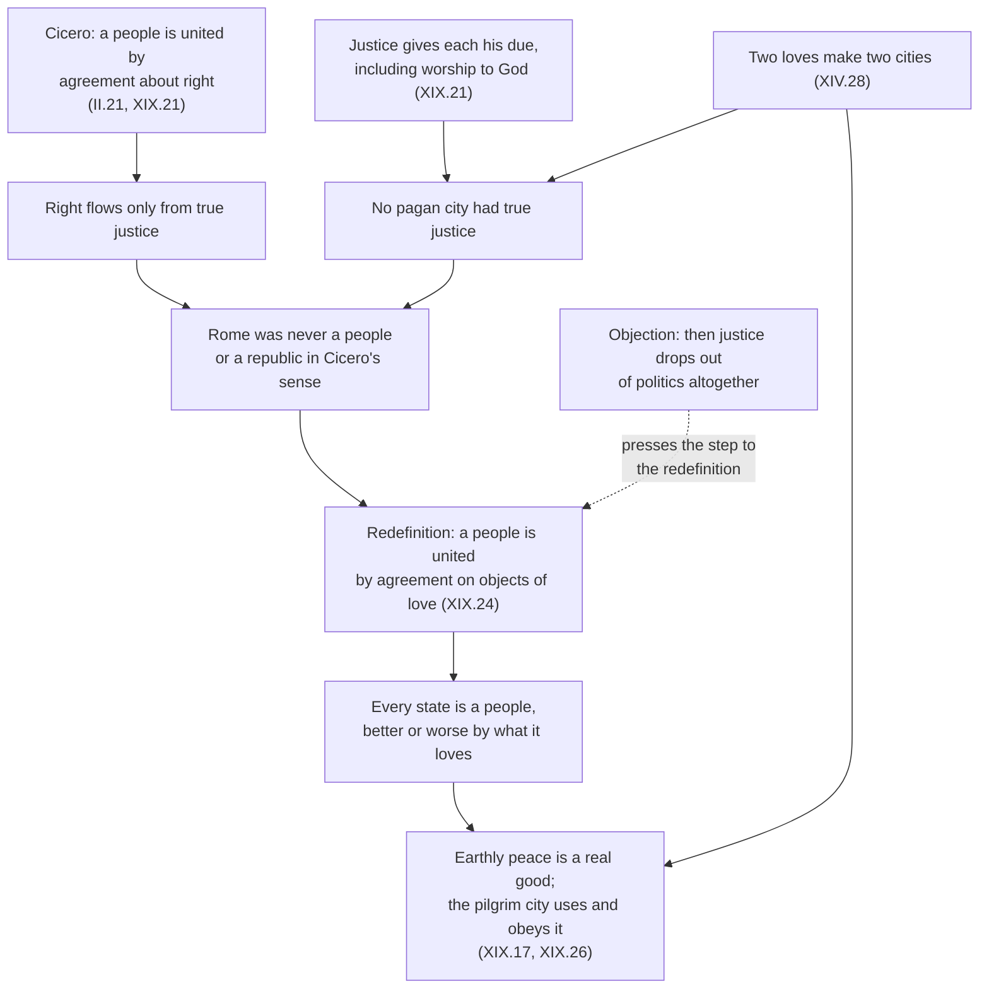

# History of Political Thought · Lesson 2.2: Augustine: the two cities

> ⏱ ~15 min · Module 2: Rome and Christendom · Builds on: [2.1 Cicero: the commonwealth and natural law](02-01-cicero-the-commonwealth-and-natural-law.md) · Unlocks: [2.3 Aquinas on law](02-03-aquinas-on-law.md)

## Why this matters

In 410 the Visigoths under Alaric sacked Rome, the first time in about eight hundred years that the city had fallen to a foreign enemy. Pagans had a ready explanation: Rome abandoned its gods for Christ, and the gods withdrew their protection. Augustine, bishop of Hippo, spent roughly thirteen years (c. 413–426) answering them, and the answer grew into *The City of God*. Along the way he took Cicero's proud definition of the republic from [2.1](02-01-cicero-the-commonwealth-and-natural-law.md) and turned it against Rome, and then offered a thinner definition of a people that fits every state that has ever existed. Every medieval theory of the Church and the state, Aquinas's included, starts from this book or against it.

## The idea

Cicero told you a commonwealth is held together by shared agreement about what is right. Augustine asks the obvious follow-up: *measured by what?* If "right" means true justice, and true justice includes giving God what he is owed, then no pagan city was ever just, and on Cicero's own terms Rome was never a republic at all.

That sounds like a debater's trap, but it leads somewhere constructive. Augustine sorts humanity not by nation or institution but by what people love most. Some love themselves above God; others love God above themselves. Those two loves make two "cities": communities defined by their final allegiance, mixed together in every actual kingdom and in the Church itself until the Last Judgment separates them.

Then he rebuilds politics at a lower altitude. A people is any rational multitude united by agreement on what it loves. Rome qualifies; so does Babylon. Such cities cannot deliver true justice, but they can deliver *peace*: order, safety, the necessities of life. That peace is a genuine good, and citizens of the heavenly city, living for now as resident aliens, use it, obey its laws and pray for its rulers. Politics loses its claim to perfect us and keeps its claim to keep us alive.

## Source

Augustine, *City of God* XIX.24 (Dods, *Nicene and Post-Nicene Fathers*, public domain). He has just shown that on Cicero's definition there was never a Roman people:

> …say that a people is an assemblage of reasonable beings bound together by a common agreement as to the objects of their love, then, in order to discover the character of any people, we have only to observe what they love.

Three things to notice. The definition is introduced as an alternative ("say that"), not as a refutation of Cicero. Justice has vanished from it. And the definition becomes a diagnostic: it does not tell you whether a group is a people, but what *kind* of people it is. Augustine goes on to say a people is better or worse in proportion to the objects of its love, and that on this definition the Roman people is a people and its affairs a republic.

## The argument

1. **Two loves have made two cities** (XIV.28): the earthly city by love of self extending to contempt of God, the heavenly city by love of God extending to contempt of self. *In words:* your deepest allegiance, not your passport, fixes which city you belong to.
2. **The earthly city is ruled by the lust to rule.** In the preface to Book I, the city that seeks mastery over nations is itself mastered by *libido dominandi*, which Dods renders as lust of rule; XIV.28 says its princes are ruled by the love of ruling. *In words:* the drive to dominate enslaves those who have it.
3. **Justice gives each his due, and what is due includes God** (XIX.21). *In words:* a city that withholds worship from the true God fails justice at its root, however fair its courts.
4. **Cicero's people requires agreement about right, and right flows only from justice** (XIX.21, fulfilling the promise of II.21). So Augustine concludes, in II.21, that "Rome never was a republic, because true justice had never a place in it." *In words:* hold Cicero to his own definition and it condemns the city he wrote it to praise.
5. **Without justice, rule is organized robbery in form.** IV.4: "Justice being taken away, then, what are kingdoms but great robberies?" A robber band has a leader, a pact and rules for splitting the loot; add territory and conquest and you have a kingdom. Augustine tells the story of the pirate who told Alexander that he was called a robber for doing with one small ship what Alexander did with a great fleet. *In words:* size and legitimacy of title do not by themselves distinguish a state from a gang.
6. **So redefine a people by its shared loves** (XIX.24). *In words:* every organized society is a people; the question is only how good its loves are.
7. **Earthly peace is a real good the heavenly city uses** (XIX.17, XIX.26). The pilgrim city obeys the laws that govern mortal life, tolerates any diversity of customs and institutions that serve earthly peace, and draws the line only where they hinder worship of the one God. In XIX.26 Augustine says that while the two cities are mixed, Christians too enjoy the peace of Babylon. *In words:* use the state, obey it in its own sphere, never love it as your end.
8. **Rule of man over man is not natural** (XIX.15). God gave the rational creature dominion over irrational creatures, not over other humans; slavery is a penalty and consequence of sin, not an order of nature. *In words:* domination is what fallen humans do to each other, not what they were made for.

## Argument map

Solid arrows run from premise to conclusion. The dashed edge is the question [2.3](02-03-aquinas-on-law.md) reopens: once justice leaves the definition of a people, what, if anything, makes an earthly law binding?

## Worked examples

**Example 1 (clean: Rome under both definitions).** Run Rome through Cicero's test as Augustine reads it. Right requires true justice; true justice gives God his due; Rome worshipped what Augustine regarded as demons. So there was no agreement about right, no people, no republic. Cicero's own lament, which Augustine reports in II.21, that the republic had already been lost to vice in his day, makes the point easier: Augustine only pushes the loss back to the founding.

Now run XIX.24. Did the Romans share a common agreement about what they loved? Plainly: glory, dominion, the safety and greatness of the city (Book V makes glory the Roman passion). So Rome was a people, and XIX.24 says so outright. What kind? Augustine adds that its history of seditions and civil wars shows the bond of concord rotting, without its ceasing to be a people. Same city, two verdicts, and no contradiction, because the two definitions answer different questions: Cicero's asks whether a city is *just*; Augustine's asks what holds it *together*.

**Example 2 (hard: does XIX.15 make all government a punishment?).** XIX.15 says God did not intend rational creatures to rule other rational creatures: the righteous men of early times were shepherds of cattle rather than kings of men, and slavery entered with sin. Push that and it seems to reach political rule itself: if dominion of man over man is unnatural, the magistrate is as much a product of the Fall as the slaveholder.

Readers split here, and the text supports more than one reading. Herbert Deane (*The Political and Social Ideas of St. Augustine*, 1963) read Augustine as a realist for whom coercive government is a punishment and remedy for sin, needed because fallen humans must be restrained. Others point to what surrounds the passage. XIX.14 describes rule in a just household as service: those who rule serve those they seem to command, from duty and mercy rather than love of power. And in XII.27 (Dods's numbering; some Latin editions number it XII.28) Augustine calls the human race social by nature and unsocial by its corruption. On that reading, *ordering* others for their good is natural and *mastering* them is penal. XIX.15 names slavery explicitly; whether coercive political authority falls on the natural side or the penal side of that line, the text does not settle.

The chapter has a second twist a modern reader should not smooth over. Having called slavery unnatural, Augustine does not call for abolition. He cites the apostle's instruction that slaves serve their masters faithfully, so that they may make their slavery in some sense free, until all human power is brought to nothing. Unnatural, penal and to be endured: all three belong to his position.

## Watch out

- **Anachronism: "the two cities are Church and State."** Membership is fixed by love, which only God sees. The heavenly city includes the angels; its earthly part is a pilgrim company, and Augustine treats the visible Church as a mixed body until the harvest (the ecclesiology is [`patristics`](../../patristics/syllabus.md) 4.4). The medieval tendency to identify the heavenly city with the Church and absorb the state into it, which H.-X. Arquillière called "political Augustinianism" (1934), is a later reading, and [2.5](02-05-marsilius-and-conciliarism.md) shows where it led.
- **Anachronism: "Augustine invented the secular state."** R. A. Markus (*Saeculum*, 1970) argued that Augustine opens a neutral zone of politics that neither city owns; John Milbank (*Theology and Social Theory*, 1990) replied that for Augustine no peace is neutral, since every city's peace is ordered by some love. Both are serious readings. What is not available is the modern *secular* as a religion-free public sphere: Augustine's *saeculum* means this age, the time between Christ's first and second comings.
- **You might think IV.4 says states are simply gangs.** Its opening clause is conditional: *justice being taken away*. How much follows about actual states, given the Book XIX redefinition, is exactly what Module 2's boss problem asks, so hold the question open.
- **You might think Augustine's quarrel with Cicero is about whether justice matters.** Both agree a true republic needs justice and that justice gives each his due. They part over what is due, and to whom.

## One-liner

> Augustine held Rome to Cicero's definition and found it was never a republic, then redefined a people by what it loves, demoting every earthly city from the home of justice to the keeper of a peace that pilgrims use but must not worship.

## Problems

**P1 (🟢) *(Exegetical.)*** *City of God* XIV.28 (Dods, NPNF):

> Accordingly, two cities have been formed by two loves: the earthly by the love of self, even to the contempt of God; the heavenly by the love of God, even to the contempt of self.

A student writes: "Augustine means Rome and the Church, and 'contempt of self' shows the heavenly city requires self-hatred." Using the words of the passage, correct both claims. 150 words or fewer.

**P2 (🟡) *(Exegetical.)*** Cicero (through Scipio in *De Re Publica*) and Augustine (II.21, XIX.21) reach opposite verdicts on whether early Rome was a true republic, although both accept that a people requires agreement about right and that right flows from justice. Name the single premise on which they divide, show that it is not "whether justice is required for a republic," and say what kind of argument would move each side. 150 words or fewer.

**P3 (🔴, optional) *(Exegetical.)*** Diagnose this paragraph from an invented church newsletter. Which of Augustine's ideas is it borrowing, and what has it dropped from *City of God*? Cite book and chapter for each point. 150 words or fewer.

> "Augustine settled the matter sixteen centuries ago: a government without true justice is not a government, and no modern state worships the true God. Its laws therefore have no claim on us. Christians should stop paying taxes that fund it and withdraw from its courts and elections. Our citizenship is in heaven, and Babylon is nothing to us."

Solutions

**P1** *(Exegetical, strict.)*

**Must hit, strict:**
- The cities are *formed by two loves*: membership is fixed by what a person loves most, not by belonging to an institution. So neither city maps onto Rome or the visible Church. Supporting context (any one): the heavenly city includes the angels and only a part of it sojourns on earth (XIX.17); the two are mixed together in this age (XIX.26).
- "Contempt of self" is the term of a contrast: love of God carried *even to* contempt of self, mirroring love of self carried even to contempt of God. It describes the ordering of loves, self placed below God, and XIV.28 goes on to contrast glorying in oneself with glorying in the Lord. It is not a command to hate oneself.

**Wrong turns:** conceding that the earthly city is "roughly" the Roman state because Books I–V attack Rome (Rome is the chief *example* of the earthly city's love of dominion, not its definition); treating "earthly" as meaning "living on earth," which would put every pilgrim Christian in the earthly city.

**Model answer:** The passage defines each city by a love, not by an institution: two cities "formed by two loves." A Roman senator who loves God above himself belongs to the heavenly city; a bishop who loves himself above God does not. Rome is Augustine's great example of the earthly city's love of glory and dominion, not its definition, and in this age the two cities are mixed. "Contempt of self" is half of a symmetry: each love runs *even to* contempt of what the other puts first. The heavenly city puts the self below God, glorying in the Lord rather than in itself. That is an ordering of loves, not self-hatred.

---

**P2** *(Exegetical, strict.)*

**Must hit, strict:**
- The crux: *what is due, above all what worship is due and to whom.* Augustine holds that giving each his due includes worship of the one true God, and that Rome gave its worship to false gods (demons), so it lacked true justice from the start. Cicero treats Rome's ancestral worship as part of its good order and holds that justice is knowable by right reason ([2.1](02-01-cicero-the-commonwealth-and-natural-law.md)); his complaint in II.21 is that Rome *lost* the republic through vice, not that it never had one.
- Why "whether justice is required" is not the crux: both affirm it. Augustine's argument works *inside* Cicero's definition; his XIX.24 redefinition is offered as an alternative, not as a denial that a true republic needs justice.
- What would move each side: the disagreement turns on theology, not political theory. Cicero would have to be persuaded that the gods of Rome are not owed worship and that the true God is; Augustine would have to accept that justice can be complete while withholding worship from God, which his account of justice rules out.

**Wrong turns:** naming "whether Rome had good laws and courts" (Augustine can grant that it did, relatively, and still deny true justice); naming the redefinition of a people as the crux, since it changes the question instead of answering Cicero.

**Model answer:** Both hold that a republic needs agreement about right and that right flows from justice, so that is not where they divide. The single premise in dispute is what justice gives God. Augustine holds that justice gives each his due, that the true God is owed worship, and that a city worshipping demons withholds from its maker what it owes, so no Roman agreement about right was ever an agreement about *true* right. Cicero treats Rome's ancestral religion as part of what made its early constitution just. Neither side can be moved by political argument alone: Cicero would need to be convinced about which divinity is owed worship, and Augustine would need to concede that justice can be complete while God is denied his due.

---

**P3** *(Exegetical, strict.)*

**Must hit, strict:**
- **Borrowed:** Rome was never a republic for lack of true justice (II.21, XIX.21), perhaps with a gesture at kingdoms without justice as robberies (IV.4), plus the language of pilgrim citizenship.
- **Dropped (at least three):** (i) the XIX.24 redefinition, on which every organized multitude, Rome included, *is* a people and a republic; (ii) XIX.17: the pilgrim city obeys the laws that govern mortal life and uses earthly peace; (iii) XIX.26: Christians enjoy the peace of Babylon and pray for kings; (iv) XIV.28 and the mixed cities: Christians cannot sort the world into a heavenly us and a Babylonian them, since the cities are not institutions. The one limit Augustine does set (XIX.17: nothing that hinders the worship of God) is narrower than the newsletter's blanket refusal.
- The newsletter converts "not a republic in Cicero's strict sense" into "no claim on us," a step Augustine explicitly declines.

**Wrong turns:** judging whether tax resistance is right (not asked, and owned elsewhere); saying the newsletter misquotes IV.4 without noticing that its real omission is Book XIX.

**Model answer:** It borrows the argument of II.21 and XIX.21: without true justice there is no people in Cicero's sense, so Rome was never a republic. It drops the rest of Book XIX. Augustine at once redefines a people by its shared loves (XIX.24) and grants Rome was a people and a republic. The pilgrim city uses earthly peace and obeys the laws that govern mortal life (XIX.17), and while the cities are mixed Christians enjoy the peace of Babylon and pray for rulers (XIX.26). His only limit is laws that hinder worship of God. And since the two cities are defined by love (XIV.28), a congregation cannot declare itself the heavenly city and the state Babylon. The move from "not just" to "no claim" is exactly the one Augustine refuses.

## Flashback

**From Lesson 1.4 (Aristotle: constitutions, citizens and the polity):** *(Exegetical.)* Close reading and application. In *Politics* III.4 (1276b20–35, Jowett) Aristotle compares citizens to a ship's crew: rower, pilot and look-out do different jobs, but all share one object, "safety in navigation". The salvation of the community is likewise every citizen's business, and so

> the virtue of the citizen must therefore be relative to the constitution of which he is a member.

Since there are many constitutions, he concludes that the good citizen "need not of necessity possess the virtue which makes a good man."

(a) Which reading do the words support? **(i)** Citizenship corrupts: the good citizen and the good man are opposed types. **(ii)** Citizen virtue is measured by what preserves one's own constitution, so it varies by regime and cannot simply be the good man's single virtue, though the two can coincide. Name the deciding words. (b) An invented oligarchy seats only landowners in its assembly. **(1)** One landowner serves faithfully on juries, upholds the property bar and never takes a bribe, but is grasping and intemperate at home. **(2)** Another is just and temperate, and argues in the assembly for opening it to the landless. On III.4's measure, is each a good citizen, a good man, both or neither? **(3)** In whom, and in what kind of city, does Aristotle let the two virtues coincide? Three sentences or fewer per part.

Solution

**Must hit, strict (a):** reading (ii). "Relative to the constitution of which he is a member" makes the standard of citizen virtue the preservation of a particular constitution, as the crew's standard is the ship's safety. "Need not of necessity" denies that the two virtues are *necessarily* the same; it does not say they are opposed or can never meet. The argument runs from the plurality of constitutions: a virtue that changes with the regime cannot be the one perfect virtue that defines the good man.

**Must hit, strict (b):**
- (1) **Good citizen, not a good man.** He does his part in keeping *this* constitution safe; his private vices do not touch that measure, but they rule out perfect virtue.
- (2) **Possibly a good man, but not a good citizen of this constitution on III.4's measure,** since what he urges would change the constitution rather than preserve it (III.3 has just said a city's identity lies in its constitution). Note that III.4 gives no verdict on whether that is to his discredit.
- (3) **In the good ruler, and fully in the best city.** The good ruler must be a good and wise man, since practical wisdom is the ruler's own virtue; where citizens rule and are ruled in turn as free men, and the constitution is the best, the good citizen's virtue and the good man's can be the same.

**Wrong turns:** choosing (i) because "need not" is heard as "cannot". Saying no one can be a good citizen of an oligarchy because it is a deviant regime: III.4 makes citizen virtue relative to whatever constitution the citizen belongs to. Calling landowner (1) a bad citizen because of his private vices.

**Model answer:** (a) Reading (ii). Virtue is "relative to the constitution of which he is a member", like a sailor's to the ship's safety, and there are many constitutions, so citizen virtue cannot be the single virtue of the good man. "Need not of necessity" leaves room for the two to coincide; it does not make them opposed. (b) (1) A good citizen, since he preserves the oligarchy, but not a good man. (2) Perhaps a good man, but by III.4's measure not a good citizen of *this* constitution, since he works to change it. (3) In the good ruler, who must have practical wisdom, and in the best city, where citizens rule and obey as free men.

## Connections

- **Backward:** Augustine's target is Cicero's definition of the *res publica* in [2.1](02-01-cicero-the-commonwealth-and-natural-law.md). In XIX.21 he also dismisses the definition of right as what is useful to the stronger, which is Thrasymachus's thesis from [1.1](01-01-platos-republic-justice-in-city-and-soul.md); and XIX.15's denial of natural dominion is the opposite pole from Aristotle's natural slavery in [1.3](01-03-aristotle-the-city-exists-by-nature.md). The will turning from higher to lower goods, the psychology behind the two loves, is [`ancient-medieval-philosophy` 5.2](../../ancient-medieval-philosophy/lessons/05-02-augustine-evil-and-the-will.md).
- **Forward:** [2.3](02-03-aquinas-on-law.md) and [2.4](02-04-aquinas-on-kingship-tyranny-and-property.md) put justice back into law and treat political life as natural, via Aristotle; whether that abandons Augustine or completes him is Module 2's boss problem. [2.5](02-05-marsilius-and-conciliarism.md) shows the two-cities language hardening into the two swords. Hobbes's portrait of the papacy as the ghost of the Roman empire ([3.4](03-04-hobbes-the-sovereign-and-the-church.md)) is worth setting beside Augustine's very different use of Rome.
- **Sideways:** Augustine's theology of grace and his writings on coercing the Donatists belong to [`patristics`](../../patristics/syllabus.md); [`catholic-social-teaching`](../../catholic-social-teaching/syllabus.md) cites this lesson for the Church's relation to political authority. Whether a political community needs justice or only order, asked as an analytic question rather than a historical one, belongs to [`political-philosophy`](../../political-philosophy/syllabus.md).
