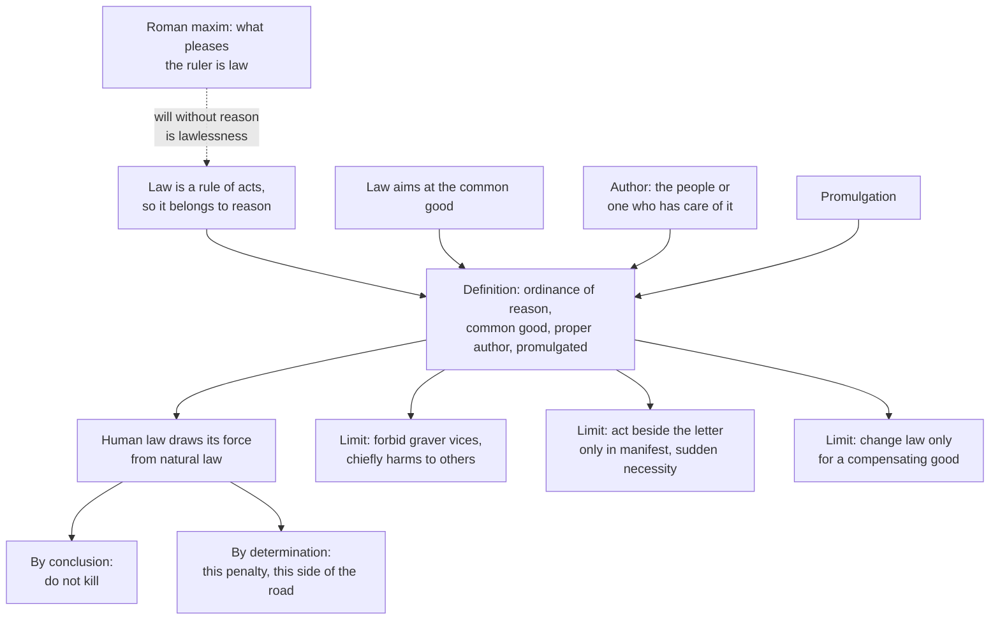

# History of Political Thought · Lesson 2.3: Aquinas on law

> ⏱ ~15 min · Module 2: Rome and Christendom · Builds on: [2.2 Augustine: the two cities](02-02-augustine-the-two-cities.md) · Unlocks: [2.4 Aquinas on kingship, tyranny and property](02-04-aquinas-on-kingship-tyranny-and-property.md)

## Why this matters

Augustine left politics with a hard question: if every earthly city is shot through with the lust to dominate, what makes a ruler's command anything more than force with paperwork? Thomas Aquinas (c. 1225–1274) answers it in the short treatise on law in the *Summa Theologiae* (I-II qq.90–97, written around 1270). The answer is a definition of law, a theory of how the laws of a particular city relate to justice, and a set of limits on what those laws should try to do. That is the root of natural-law jurisprudence, and it still decides how people argue about unjust statutes, legal loopholes and whether the state should outlaw every vice.

## The idea

Picture four notices taped to the door of an apartment building.

1. A tenant has written: *No bikes in the hallway.*
2. The building manager has written the same thing, but only to stop people getting past his office with deliveries he would rather not sign for.
3. The manager has decided the rule for everyone's safety, but has written it in a notebook in his desk.
4. The manager has posted it, for everyone's safety, where every tenant can read it.

Only the fourth is really a rule of the building. The first has the right content but the wrong author: a tenant can advise, not legislate. The second has the right author but the wrong aim: it serves him, not the building. The third has author and aim but nobody can be guided by a rule nobody can see. Aquinas's definition of law is this intuition made exact. A law needs four things at once: it comes from *reason*, it aims at the *common good*, it is made by whoever has *care of the community*, and it is *made known*.

The political payoff comes next. If law is reason ordering a community to its good, then the law of any given city is either drawing out what justice already requires, or filling in details justice leaves open, and it should not attempt more than its people can bear.

**Where this sits.** Aquinas sorts law into four kinds (q.91): *eternal law*, God's reason governing everything; *natural law*, the rational creature's share in it; *human law*, which rulers derive from natural law; and *divine law*, revealed in scripture, needed partly because human law cannot reach inner acts or punish every evil (q.91 a.4). How natural law's first principles work is taught in [`ethics` 4.4](../../ethics/lessons/04-04-natural-law-aquinas.md); this lesson takes natural law as given and asks what it does to *political* authority.

## Source

Aquinas, *Summa Theologiae* I-II, English Dominican Province translation (public domain). The definition closes q.90 a.4:

> [law] is nothing else than an ordinance of reason for the common good, made by him who has care of the community, and promulgated.

And from q.90 a.1 ad 3, answering the Roman lawyers' maxim that what pleases the ruler has the force of law (Ulpian, *Digest* 1.4.1):

> otherwise the sovereign's will would savor of lawlessness rather than of law.

Read the second against the first. Aquinas does not deny that the ruler's will moves the law: in the same reply he grants that reason gets its power to move from the will. He denies that will *alone* makes it law. The word "otherwise" is doing the work: the maxim is true only of a will already in accord with reason.

## The argument

**The definition (q.90 aa.1–4).**

1. **Law is a rule and measure of acts, binding us to act or not act.** *In words:* a law is the kind of thing you can steer by.
2. **The rule and measure of human acts is reason, which directs to the end.** *In words:* only something that grasps a goal can give a rule for reaching it, so law belongs to reason, not bare will (a.1).
3. **The first principle of practical reason is the last end, and one person is part of a complete community, so law regards the common good.** A precept aimed at a private good lacks the nature of law, except insofar as it bears on the common good (a.2). *In words:* a rule for one person's benefit is a favour or an order, not a law.
4. **Ordering to the common good belongs to the whole people or to a public person who has care of it.** A private person can only advise; a father can give household commands, but they lack the full force of law (a.3). *In words:* the right to legislate follows responsibility for the whole.
5. **A rule binds only those to whom it is applied, and it is applied by being made known** (a.4). *In words:* a secret law cannot guide, so it is not yet a law.
6. **∴ Law is an ordinance of reason for the common good, made by one who has care of the community, and promulgated.**

**The derivation of human law (q.95 a.2).**

7. **Human law has the nature of law to the extent that it derives from natural law;** a provision that departs from natural law is a perversion of law. *In words:* a city's laws borrow their authority from justice.
8. **Derivation runs two ways.** By *conclusion*, as in a science: from *harm no one* follows *do not kill*. By *determination*, as in a craft: a builder must give the general form of a house some particular shape; natural law says the wrongdoer should be punished, human law settles which penalty. *In words:* some laws spell out what justice already demands; others choose one of many reasonable options.
9. **Conclusions keep some force from natural law itself; determinations have only the force of human law.** *In words:* murder was wrong before the statute; driving on the right was not.

**The limits of human law (q.96, q.97).**

10. **Law must fit those it rules, and most people are not perfect in virtue, so human law forbids not all vices but the graver ones, chiefly those that harm others** (q.96 a.2). *In words:* law is written for ordinary people, not saints.
11. **Law may command acts of any virtue, but only as they bear on the common good,** and it commands the act, not the virtuous spirit in which a good person does it (q.96 a.3). *In words:* law can make you pay your debts; it cannot make you just.
12. **The ruler is exempt from law's coercive force (no one can pass sentence on him) but not from its directive force: he should keep his own law voluntarily** (q.96 a.5 ad 3). *In words:* nobody can punish the king, yet the law still tells him what to do.
13. **Since lawgivers frame rules for what usually happens, a subject may act beside the letter to save the common good the rule exists for, but only when the harm is manifest and too sudden to refer to authority** (q.96 a.6). *In words:* follow the purpose over the wording only in a real emergency.
14. **Law may be changed as reason improves or conditions change, but change itself costs the force custom lends, so it needs a compensating benefit; custom can itself make, abolish and interpret law** (q.97 aa.1–3). *In words:* old laws carry weight simply by being old, and that weight counts.

## Argument map

Solid arrows run from ground to consequence. The dashed edge is the rival Aquinas absorbs: will moves law, but reason makes it law.

## Worked examples

**Example 1 (clean: the besieged city).** Aquinas's own case in q.96 a.6. A city under siege has a law: keep the gates shut. Some of the city's defenders are fleeing back from the enemy. Should the guard open the gates?

Run the steps. The law is a determination (step 8): the common good requires defending the city, and *keep the gates shut* is one reasonable way to do it. The lawgiver wrote it for the usual case (step 13). Here obeying the wording destroys the very good it serves, since the city loses its defenders. The harm is manifest, and there is no time to ask the magistrate. So the gates should be opened: in Aquinas's phrase, "necessity knows no law."

Note the two brakes. First, the guard is not judging the law, only this case (ad 1). Second, if the harm were doubtful, or there were time to refer it, he must keep the letter or consult those in authority (ad 2). The article licenses emergency judgment, not private reinterpretation.

**Example 2 (hard: the empty road).** A town sets a 30 km/h limit near schools. At 3 a.m., on an empty street, a driver goes 38.

*Conclusion or determination?* Both, in layers. *Do not endanger others* is natural law; *drive carefully near children* follows by conclusion. The number 30 is a determination: 25 or 35 would also be reasonable.

*Does step 13 excuse him?* No. There is no manifest harm in keeping the limit and no sudden peril, so this is not the besieged gate. At most he thinks the rule pointless tonight, and a.6 ad 2 gives that thought no licence.

*Here the theory strains.* Step 9 says a determination has *no other force* than human law. So what makes breaking it more than a legal risk? Aquinas's answer runs through authority: a just human law binds in conscience because the power that made it is itself ordered by eternal law (q.96 a.4, taken up in the boss problem). But then natural law is back in the determination after all, not as its content but as the ground of obeying whoever settled it. Readers divide on how to state this. On one reading, "no other force" means only that the *content* could have been otherwise; on another, determinations bind weakly, and prudence (with q.97 a.2's respect for settled custom) does the rest. The text supports the first more directly, but it does not say so in so many words.

## Watch out

- **You might think q.96 a.2 is Mill's harm principle.** It is not. Harm to others marks the *chief* cases, and the test is what an imperfect majority can bear; the law's aim is still to lead people to virtue, gradually (ad 2). Mill's principle forbids paternalism in principle ([`political-philosophy`](../../political-philosophy/syllabus.md) 3.2); Aquinas's restraint is prudential. Reading one into the other is an anachronism.
- **You might think "determination" means "arbitrary."** The builder's choice of shape is still governed by what a house is for. A determination is free among reasonable options, not free of reason.
- **You might think "him who has care of the community" means an elected legislature, or else an absolute king.** Aquinas says the whole people *or* a public person acting for it (q.90 a.3), and does not choose here. Which regime is best is [2.4](02-04-aquinas-on-kingship-tyranny-and-property.md)'s question; consent and representation as theories arrive with [2.5](02-05-marsilius-and-conciliarism.md).
- **You might think the sovereign's exemption (q.96 a.5) makes him above the law in Hobbes's sense.** He escapes coercion, not direction: he is bound before God to keep his own law. Hobbes's sovereign ([3.4](03-04-hobbes-the-sovereign-and-the-church.md)) is not subject to civil law at all.

## One-liner

> For Aquinas a law is reason ordering a community to its good, made by the one responsible and made known; a city's laws either conclude from justice or fill in its details, and they should demand no more than ordinary people can bear.

## Problems

**P1 (🟢) *(Exegetical.)*** For each invented provision, say whether it derives from natural law by *conclusion* or by *determination* (q.95 a.2), and so whether it has any force beyond that of human law. If a provision mixes both, split it. One line each.

> (i) Whoever intentionally kills another person without lawful cause commits murder.
> (ii) Perjury in a court proceeding is punished by up to five years in prison.
> (iii) Vehicles shall keep to the right-hand side of the road.
> (iv) A seller may not knowingly conceal a hidden defect of the goods from the buyer.

**P2 (🟡) *(Exegetical (a) · Evaluative (b).)*** Aquinas, ST I-II q.96 a.2 (English Dominican):

> human laws do not forbid all vices, from which the virtuous abstain, but only the more grievous vices, from which it is possible for the majority to abstain; and chiefly those that are to the hurt of others

The article continues: without prohibiting these, human society could not be maintained. Reader A: *Aquinas holds that the state may forbid only conduct that harms others.* Reader B: *the limit is what an imperfect majority can manage; harm to others marks the main cases, not the boundary.* (a) Which reading do the words support? Name the words that decide it, and say what the reply to the second objection (law leads to virtue gradually) adds. (b) By this test, the reach of prohibition varies with the moral condition of a people, and q.97 a.1 lets law change as a people changes. Is that a principled account of law's limits, or does it leave them unfixed? Any verdict; 150 words or fewer for (b).

**P3 (🔴, optional) *(Exegetical.)*** Thrasymachus holds that each ruling group lays down laws for its own advantage and calls what serves it just for its subjects (*Republic* I, 338e–339a; see [1.1](01-01-platos-republic-justice-in-city-and-soul.md)). A ruler decrees, publishes and enforces a tax whose proceeds go to his own palace. A Thrasymachean says: that is the law. Aquinas says it has the look of law but not its nature (q.90 aa.1–2). Name the single premise one side affirms and the other denies, note what both sides agree on, and say what argument would move a defender of each side. 150 words or fewer.

Solutions

**P1** *(Exegetical, strict.)*

**Must hit, strict:**
- (i) **Conclusion**, from *harm no one* (Aquinas's own example: *do not kill*). It keeps some force from natural law itself. The phrase "without lawful cause" and the exact legal definition may involve determination, but the core prohibition is a conclusion.
- (ii) **Mixed.** That perjury is to be punished is a conclusion (lying under oath wrongs the court and the party harmed, and natural law says wrongdoers should be punished); *up to five years* is a **determination**, Aquinas's own case of settling the penalty. The penalty has only human-law force.
- (iii) **Determination.** The natural-law ground (do not endanger others) requires *some* rule; right rather than left is chosen among equally reasonable options. Human-law force only.
- (iv) **Conclusion**, from *harm no one* or justice in exchange: concealing a known defect takes the buyer's money on false terms. Any particular remedy would be a determination.

**Wrong turns:** calling (iii) a conclusion because road safety is a natural-law good (the good is, the *side* is not); treating (ii) as purely one or the other; saying determinations have *no* moral weight at all (step 9 says their force is that of human law, which is not nothing).

**Model answer:** (i) Conclusion; natural-law force as well. (ii) The prohibition and the call for punishment are conclusions; the five-year maximum is a determination with human-law force only. (iii) Determination; human-law force only. (iv) Conclusion; natural-law force as well.

---

**P2** *(Exegetical (a) · Evaluative (b).)*

**Must hit, strict (a):**
- **Reader B.** The deciding words are "possible for the majority to abstain": the governing test is what most people can bear, which is why the article opens with the child and the adult (law must fit the condition of those ruled).
- "*chiefly* those that are to the hurt of others": *chiefly* marks the main class, not the only one, so Reader A's "only" is not in the text. Harm to others is singled out because society cannot survive without those prohibitions.
- Ad 2: law still aims to lead people to virtue, but gradually; burdening the imperfect with the precepts of the perfect makes them despise the law and break out into worse evils. The restraint is prudential, not a principled ban on legislating morality.

**Must hit, any verdict (b):**
- State precisely what varies: the *scope of prohibition*, not what counts as vice (drunkenness stays a vice whether or not it is outlawed).
- Identify the fixed point, if any: the graver harms to others without which society cannot be maintained. Test whether that floor really constrains, or whether "cannot be maintained" is itself elastic.
- A verdict, with the step that decides it.

**Wrong turns:** (a) choosing A because murder and theft, Aquinas's examples, both harm others (examples of the chief class do not show it is the only one); calling a.2 Mill's harm principle. (b) Arguing about whether a particular vice *should* be banned today instead of about the structure of the test.

**Model answer (b), one of several acceptable:** What varies is how much of morality the law enforces, not what morality requires, and that distinction gives Aquinas a principle: law is a measure, and a measure must fit what it measures. There is also a floor. Whatever a people's condition, the grave harms to others without which common life collapses must be forbidden. Above the floor the line is set by prudence about what this people can bear without despising the law, which q.97 a.2 reinforces by making change itself costly. The critic is right that the floor does little work at the margin: nothing in a.2 says how grave "grievous" is. Verdict: principled in structure, deliberately unfixed in application. Aquinas would call that a feature, since lawgiving is a craft of determination, not a demonstration.

---

**P3** *(Exegetical, strict on identifying a single premise; any defensible wording passes.)*

**Must hit, strict:**
- The crux: *whether being ordered by reason to the common good belongs to what law is, or whether law is identified by its source in the effective command of whoever rules.* Aquinas affirms the first (q.90 a.1: law pertains to reason; a.2: a precept not bearing on the common good lacks the nature of law). The Thrasymachean denies it: law is whatever the stronger lays down.
- What both agree on: the decree was commanded by the ruler, published and enforced, and it serves the ruler. Aquinas even grants that the will moves the law (a.1 ad 3). The dispute is not about the facts.
- What would move each: the Thrasymachean, an argument that a "law" identified by source alone cannot explain why subjects *ought* to follow it, or why rulers can make mistakes about their own advantage (Socrates presses the second at 339c ff.); Aquinas's defender, an argument that the reason-based definition makes the concept of law unusable for describing unjust legal systems, which plainly have laws.

**Wrong turns:** naming God or eternal law as the crux (the definition in q.90 aa.1–2 is argued from what a rule of action is, and a secular natural lawyer can hold it); saying Thrasymachus denies that any law serves the common good (his claim is about what law *is*, not that no law could happen to help subjects); reconstructing q.96 a.4's conditions, which is the boss problem's task, not this one.

**Model answer:** Both agree the decree was commanded, published and enforced for the ruler's gain. They disagree on one premise: that a command must be ordered by reason to the common good to be law at all. Aquinas affirms it, since law is a rule and measure of action and a rule for one man's profit lacks the nature of law. The Thrasymachean denies it: law is what the stronger lays down, and "just" is a name for obedience to it. The Thrasymachean might be moved by the problem that a pure-command account cannot say why anyone *ought* to obey, only why they do. Aquinas's defender might be moved by the objection that his definition cannot describe the laws of unjust regimes as laws, which ordinary legal description plainly does.

## Flashback

**From Lesson 2.1 (Cicero: the commonwealth and the law of nature):** *(Exegetical (a) · Evaluative (b).)* Close reading. In *On the Commonwealth* I.27 (43), Scipio grants that Cyrus of Persia was a most righteous and wise king, and still says (Yonge):

> the interest of the people (for this is, as I have said before, the same as the commonwealth) could not be very effectually promoted when all things depended on the beck and nod of one individual

(a) Which reading do the words support? **(i)** Like Dionysius's Syracuse, Cyrus's Persia was no commonwealth at all. **(ii)** It was a genuine commonwealth, served less well and less securely than it could be. Name the deciding words, and say what separates Cyrus from Dionysius on Cicero's definition. (b) The lesson's estate analogy says an estate still belongs to its owner when a steward runs it. Does that sit comfortably with Scipio's complaint here, or does the complaint show a commonwealth needs more than belonging to the people? Any verdict. Three sentences or fewer per part.

Solution

**Must hit, strict (a):** reading (ii). "Could not be very *effectually* promoted" is a claim of degree: the people's interest is served poorly, not absent. The objection is structural, "all things depended on the beck and nod of one individual", not that Cyrus was unjust; Scipio grants he was righteous and wise. What separates the two is the bond of right (step A2): under a just king the agreement on right and common advantage holds, so each simple form stays tolerable (I.26); under Dionysius everything belonged to one man and nothing was the people's affair (step A6).
**Must hit, any verdict (b):** name the tension: ownership (whose affair the state is) versus participation (who has a share in running it). Then say what Scipio's complaint adds beyond the definition: I.27 says that under a king the other members are deprived of public counsel, and I.28 that kingship slides easily into tyranny (Phalaris). So either the complaint is a separate argument for the mixed constitution layered on the definition, or participation is part of what makes the affair the people's. A verdict, with the step that decides it.
**Wrong turns:** (a) choosing (i) because the parenthesis equates the people's interest with the commonwealth, as if serving it badly meant it did not exist; reading *res publica* as "a state without a king", the anachronism 2.1 flags. (b) Arguing whether monarchy is good today instead of about the fit between the definition and the complaint.
**Model answer:** (a) Reading (ii). "Could not be very effectually promoted" grades how well the people's interest is served, and the fault named is dependence on one man's "beck and nod", not injustice. Cyrus keeps the bond of right that makes a people, so his kingdom is a tolerable commonwealth; Dionysius owned everything, so there was no people's affair left. (b) One of several acceptable: the analogy survives, because Scipio's complaint is not that Persia stopped being the people's but that its owners had no share in counsel and no protection against the next king being Phalaris. That makes the complaint a second argument, about liberty and security, added to the definition rather than contained in it. The definition says whose the commonwealth is; the case for mixture says how it is best kept.

## Connections

- **Backward:** Cicero's true law as right reason ([2.1](02-01-cicero-the-commonwealth-and-natural-law.md)) is the ancestor of step 2, and Aquinas cites Cicero in q.95 a.2. The claim that an unjust law seems no law at all is Augustine's (*On Free Choice of the Will* I.5), quoted in q.95 a.2 and q.96 a.4; how that sits with Augustine's realism about earthly cities ([2.2](02-02-augustine-the-two-cities.md)) is the Module 2 boss problem. The community as a *perfect* (complete) community is Aristotle's city by nature ([1.3](01-03-aristotle-the-city-exists-by-nature.md)). Natural law's first precept and its inclinations: [`ethics` 4.4](../../ethics/lessons/04-04-natural-law-aquinas.md).
- **Forward:** [2.4](02-04-aquinas-on-kingship-tyranny-and-property.md) asks who best has "care of the community" and what subjects may do when a ruler legislates for himself. [2.5](02-05-marsilius-and-conciliarism.md) keeps q.90 a.3's "whole people" and turns it against the papacy. Hobbes ([3.4](03-04-hobbes-the-sovereign-and-the-church.md)) defines civil law by who commands it, the rival P3 anticipates.
- **Sideways:** q.95 a.2 is the historical root of natural-law jurisprudence and the classic "unjust law" debate in [`philosophy-of-law`](../../philosophy-of-law/syllabus.md); Church teaching on the state's role draws on this treatise in [`catholic-social-teaching`](../../catholic-social-teaching/syllabus.md). Each article here is a disputed question, read the way [`philosophical-method` 4.4](../../philosophical-method/lessons/04-04-arguing-within-a-tradition-the-disputed-question.md) teaches.
