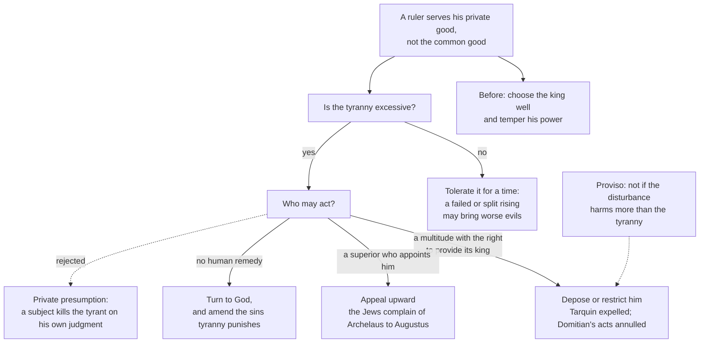

# History of Political Thought · Lesson 2.4: Aquinas on kingship, tyranny and property

> ⏱ ~15 min · Module 2: Rome and Christendom · Builds on: [2.3 Aquinas on law](02-03-aquinas-on-law.md), [1.4 Aristotle: constitutions, citizens and the polity](01-04-aristotle-constitutions-citizens-and-the-polity.md) · Unlocks: [2.5 Pope, emperor and council: Marsilius and conciliarism](02-05-marsilius-and-conciliarism.md)

## Why this matters

Lesson 2.3 gave you Aquinas's account of law. This one asks the questions any ruler actually faces. Who should hold power? What happens when power goes bad? And what does anyone own, if the earth was given to everyone? Aquinas answers with Aristotle's *Politics* in one hand and scripture in the other. What comes out still frames later debates: the mixed constitution, a doctrine of resistance hedged on every side, and the claim that a starving man who takes bread is not a thief.

## The idea

One idea holds the whole lesson together: **rule exists for the common good of the ruled.** Aquinas takes it straight from Aristotle ([1.4](01-04-aristotle-constitutions-citizens-and-the-polity.md)). A government is just when it aims at the good of the community, and corrupt when it aims at the good of whoever governs. Everything else follows from applying that test to three questions.

**Who should rule?** Peace is what a community needs first, and peace means unity. Something that is itself one produces unity better than many hands pulling in different directions. So rule by one is best in principle. But a king has so much power that he easily slides into tyranny. So the best *actual* arrangement keeps one person at the top and shares power beneath him.

**What if the ruler turns tyrant?** The same argument that makes kingship best makes tyranny worst: power concentrated for evil does more harm than power spread out. Even so, resisting it can be worse than enduring it. Aquinas's answer is a ladder of remedies, and private assassination is not on it.

**What may be owned?** Private ownership is lawful and useful. But ownership is a way of *managing* goods, and their *use* stays common. Where a person's need is desperate and nothing else will help, what they take to survive is not theft.

## Source

Aquinas, *Summa Theologiae* II-II q.42 a.2 ad 3 (English Dominican Province translation, public domain). He has just said, following Aristotle, that a tyrannical government is unjust because it aims at the ruler's private good rather than the common good. Then:

> Consequently there is no sedition in disturbing a government of this kind, unless indeed the tyrant's rule be disturbed so inordinately, that his subjects suffer greater harm from the consequent disturbance than from the tyrant's government.

Two things to notice. First, the question is about *sedition*, a sin against the unity of the community, and the reply says that overthrowing a tyrant is not that sin *in kind*. The reply adds that the tyrant is the real seditious party. Second, the "unless" clause is not about the tyrant's guilt at all. It is about consequences: even a rightful disturbance becomes sedition if it does more damage than the tyranny did.

## The argument

The main text is *De Regno* (*On Kingship, to the King of Cyprus*), usually dated to about 1267. Aquinas left it unfinished, and a continuator, usually identified as Ptolemy of Lucca, completed it. Book I is securely his. No public-domain English translation exists, so this lesson paraphrases it and cites it by book and topic, since chapter numbers vary between editions.

**A. Why one should rule (*De Regno* I).**

1. **Humans are social by nature, and a multitude needs something that directs it to its common good.** *In words:* left alone, everyone pursues their own good and the community falls apart, just as a body would without a governing part.
2. **Rule is just when it serves the common good of the ruled, and unjust when it serves the ruler's private good.** Following Aristotle, this yields six regimes: three just (kingship, aristocracy, polity) and three unjust (tyranny, oligarchy, democracy in Aristotle's bad sense). *In words:* the test is *whose* good the rule serves, not how many people rule.
3. **The first good of a community is its unity, which is called peace.** *In words:* no community can pursue anything else until it holds together.
4. **What is itself one brings about unity better than a plurality does.** Aquinas points to nature (the heart among the organs, the single ruler of the universe) and to experience (cities without a single ruler torn by faction). *In words:* many rowers pulling in different directions go nowhere.
5. **So kingship is the best form of rule.** *In words:* if the goal is unity, the best means is unity at the top.
6. **By the same reasoning, tyranny is the worst.** A united force is more effective for evil as for good. Aquinas adds that rule by the many breeds tyranny more often than rule by one, since factional strife hands power to a strongman. *In words:* the thing that makes one-man rule best is exactly what makes its corruption worst.

**B. The mixed regime (ST I-II q.105 a.1).** In the *Summa*, discussing the government of ancient Israel, Aquinas calls the best polity a mixture. One person presides over all (the kingly element). A few, chosen for virtue, hold authority under him (aristocracy). And rulers are drawn from the whole people and chosen by them (democracy). Moses, the seventy-two elders and their election are his model. A reply in the same article explains why the mixture is needed: kingship is best only if it stays uncorrupted, and since perfect virtue is rare, full royal power easily becomes tyranny. *In words:* keep monarchy's unity, and build in shared power as insurance against the king.

**C. Property (ST II-II q.66 a.2, a.7).**

1. **People have two relations to external goods: the power to *procure and dispense* them, and their *use*.** *In words:* there's who manages a thing, and there's what it's for.
2. **As to managing, private property is lawful and necessary.** People take more care of what is their own, affairs are more orderly when each looks after his own, and there are fewer quarrels. The division of goods comes from human agreement, as an addition to natural law, not something natural law dictates (a.2 ad 1). *In words:* private ownership is a very good human arrangement, not a natural right that exists before any society.
3. **As to use, a person should hold external things "not as his own, but as common", ready to share them with those in need.** *In words:* ownership gives you the job of managing things, not the right to shut others out when they are in need.
4. **Human law cannot override natural law, and by the natural order goods exist to meet human need (a.7).** *In words:* the property system is there to meet needs, so it cannot forbid doing exactly that.
5. **So when need is manifest and urgent, danger is imminent and no other remedy exists, taking another's goods is not theft.** In a reply Aquinas adds that "that which he takes for the support of his life becomes his own property by reason of that need" (a.7 ad 2). He extends the same permission to taking for a neighbor in like need (ad 3). *In words:* in extreme necessity the thing becomes yours, so there is nothing to steal.

## Argument map

What may be done about a tyrant, following *De Regno* I and ST II-II q.42 a.2 ad 3:

The dashed edge to private tyrannicide marks the option *De Regno* rules out. Some praised it, citing Ehud's killing of a tyrant king in Judges, but Aquinas finds it at odds with the apostolic counsel to obey even harsh masters and with the martyrs' patience. It is also dangerous: bad men would claim the same license against good kings, whose rule they find just as burdensome. The proviso from the *Summa* applies to any remedy.

## Worked examples

**Example 1 (clean: the granary).** A famine. A traveller, days from any town and visibly starving, finds a locked granary on an estate whose owner is away. He breaks in and takes bread.

Run a.7. The need is *manifest* (anyone could see it) and *urgent* (the danger to his life is imminent). There is *no other remedy*: no town, no owner to ask. So he may take openly or secretly, and it is not theft. The reason is not that his need outweighs the owner's right. The bread *becomes his* by reason of the need. Now put the owner at home a mile off, giving alms freely. Another remedy exists, so the condition fails, and breaking in is theft again, even though the owner already has a duty from a.2 to share. The owner's duty and the needy person's license are two different things: a.2 grounds the first, and only a.7's extreme case grounds the second.

**Example 2 (hard: whose authority is "public"?).** Invented: a kingdom whose estates elect the king. The king packs the estates with his own men, then rules by confiscation and terror. A group of nobles who sat in the old estates meets in exile, declares him deposed, and asks for a rising.

The map seems to allow this: a multitude with the right to provide its king may depose him. But the map strains at three points. **First, who is the multitude?** The legal body has been captured. Are the exiled nobles its rightful voice, or a faction? *De Regno* says the remedy belongs to public authority, but gives no test for when a body *is* that authority. **Second, is it excessive?** Confiscation and terror probably qualify, but the text sets no threshold. **Third, the proviso.** If a rising means civil war, q.42 a.2 ad 3 makes the verdict depend on a forecast: whether the war will do more harm than the tyranny. No principle settles that. It is a judgment of prudence.

There is a further strain. Aquinas's early commentary on the *Sentences* (Book II, distinction 44) is usually read as more permissive. It distinguishes a ruler who *seizes* power unjustly from one who *abuses* power he holds rightly, and appears to allow a usurper, where no superior can be appealed to, to be killed by whoever frees the country, citing Cicero's praise of Caesar's killers. Scholars disagree about whether *De Regno* withdraws this or addresses a different case: the rightful king turned tyrant. Our king is the second kind, which is exactly why *De Regno*'s restrictions bite.

## Watch out

- **Anachronism: "democracy" in q.105 a.1 is not popular sovereignty.** The democratic element is that rulers come from the people and are chosen by them. The people do not legislate, hold no assembly, and in Israel's case did not even choose the chief ruler. And unlike Aristotle's deviant "democracy", here the word names a healthy element of a mixture.
- **Anachronism: Aquinas has no "right of revolution".** He never says subjects have a right to overthrow a government. He says deposition by rightful public authority is not the sin of sedition, subject to a harm proviso. Reading Locke back into him ([4.2](04-02-locke-limited-government-and-toleration.md)) turns a limited permission into a right held by each person.
- **Private property is not a natural right here.** For Aquinas, dividing goods is a human arrangement *added* to natural law (q.66 a.2 ad 1). Locke's labour theory ([4.1](04-01-locke-against-filmer-and-property.md)) makes property prior to government. Don't merge the two.
- **Aquinas doesn't say "the poor may take from the rich".** a.7 requires urgent, manifest need and no other remedy. The general duty to share belongs to the owner (a.2) and doesn't license taking. How later Church teaching develops this is [`catholic-social-teaching`](../../catholic-social-teaching/syllabus.md)'s business.

## One-liner

> Rule, resistance and ownership all answer to the common good: one should rule but share power, a tyrant may be removed by public authority but not by private daggers, and property is for managing goods whose use stays common.

## Problems

**P1 (🟢) *(Exegetical.)*** Close reading. ST I-II q.105 a.1 (English Dominican) describes the best polity as

> partly kingdom, since there is one at the head of all; … partly democracy, i.e. government by the people, in so far as the rulers can be chosen from the people, and the people have the right to choose their rulers.

(a) Name the two features that make the regime "partly democracy", and one power a modern reader might expect the people to hold that the passage does not give them. (b) Does this article contradict *De Regno*'s claim that kingship is the best form of rule? Point to the words in the passage, and to the reply in the same article discussed in this lesson, that decide your answer. 150 words or fewer in total.

**P2 (🟡) *(Exegetical (a) · Evaluative (b).)*** (a) For each case, say whether ST II-II q.66 a.7 counts the taking as theft, and name the condition that decides it. One line each.

> (i) After a flood cuts a village off for days, a father takes infant formula from a closed shop for his baby, who is dehydrating.
> (ii) A man who is chronically poor takes a winter coat from a department store. A shelter two streets away is handing out coats today.
> (iii) A woman takes insulin from an unattended clinic for her neighbour, who is collapsing, when no help can arrive in time.

(b) Someone argues that in a modern state with emergency services and welfare, the condition "no other possible remedy" is almost never met, so a.7 is now a dead letter. Is that a fair application of the article, or does it misread what kind of need a.7 is about? Any verdict; 150 words or fewer.

**P3 (🔴, optional) *(Exegetical (a) · Evaluative (b).)*** (a) Reconstruct, in no more than six numbered premises and a conclusion, *De Regno*'s case that a tyrant is to be resisted by public authority and not by private presumption, using this lesson's paraphrase. Flag the weakest premise and say why in one sentence. (b) Does the proviso in q.42 a.2 ad 3 make Aquinas's teaching on resistance a matter of prudential calculation rather than of right? Any verdict; 150 words or fewer.

Solutions

**P1** *(Exegetical, strict.)*

**Must hit, strict (a):**
- The two features: rulers **can be chosen from the people** (everyone is eligible), and **the people have the right to choose their rulers** (election).
- One power not given: the people do not govern or legislate themselves (no assembly, no lawmaking by the people), and nothing is said about removing or controlling the one at the head. Any one of these is enough.

**Must hit, strict (b):**
- The passage keeps "one at the head of all". The mixture includes kingship; it does not replace it.
- The reply (ad 2): kingship is best *so long as it is not corrupt*, but such great power easily becomes tyranny unless the king is very virtuous, and perfect virtue is rare. So the mixture is kingship protected against its typical corruption. This matches *De Regno*'s advice to temper the king's power.
- So on the most natural reading there is no contradiction. What differs is emphasis: *De Regno* ranks pure forms, and the *Summa* designs a working constitution. An answer that sees a real shift passes only if it deals with the "one at the head" words and the corruption reply.

**Wrong turns:** reading "government by the people" as popular sovereignty; saying Aquinas now prefers democracy to monarchy; forgetting that in q.105 the democratic element concerns who supplies and chooses rulers.

**Model answer:** (a) The people are eligible to rule and have the right to choose their rulers. They do not make law or govern in an assembly. (b) No contradiction. The best polity is still "partly kingdom, since there is one at the head of all", so unity at the top is kept. The reply in the same article explains the mixture: kingship is best only if it stays uncorrupted, and great power easily becomes tyranny. Sharing power among elected rulers under the king is the institutional form of *De Regno*'s advice to temper his power, not a retreat from monarchy.

---

**P2** *(Exegetical (a) · Evaluative (b).)*

**Must hit, strict (a):**
- (i) **Not theft.** The need is manifest and urgent, the danger imminent, and no other remedy is available while the village is cut off.
- (ii) **Theft.** Another remedy is at hand (the shelter), and chronic poverty is not the imminent danger a.7 requires.
- (iii) **Not theft.** Taking for a neighbour in like need is allowed (ad 3), and the conditions are met.

**Must hit, any verdict (b):**
- State the conditions precisely: manifest and urgent need, imminent danger, no other possible remedy. And note that a.7 is an exception for extreme cases, not the basis of the ordinary duty to share, which is a.2's.
- Say which condition the argument turns on (no other remedy), and whether the article ties that condition to any particular social setting.
- Consider the counter-pressure: when the remedies exist on paper but fail in fact (a waitlist, a closed office), is "no other remedy" met?
- A one-line verdict.

**Wrong turns:** in (ii), calling it lawful because the store is rich or the man is poor; treating a.2's duty to share as a license to take; in (b), arguing about whether welfare states are good, which is not the question.

**Model answer (b), one of several acceptable:** The argument is mostly fair. a.7 was never a general rule for the poor. It is an exception for cases where the need is so urgent that it has to be met by whatever is at hand, with no other remedy. Where ambulances and emergency aid reliably reach people, those conditions are rarer, and the article intends that: the exception shrinks as other remedies grow. But "dead letter" overstates it. The test is whether a remedy is actually available here and now, not whether one exists in law. Disasters, remote places and failing systems still produce such cases. Verdict: a.7 becomes rare in a functioning state, not void, and whether it applies still turns on the facts.

---

**P3** *(Exegetical (a) · Evaluative (b).)*

**Must hit, strict (a):**
- P1: Rule is for the common good; a tyrant rules for his private good, so his rule is unjust.
- P2: Action against a ruler on private judgment is dangerous to the community: failed attempts provoke worse oppression, and bad men would use the same license against good kings.
- P3: Scripture counsels subjection even to harsh masters, and the martyrs endured rather than rebelled.
- P4: Where the multitude has the right to provide itself with a king, the same multitude may depose or restrict him when he rules tyrannically.
- P5: It is not faithless to do so, even if the people bound themselves to him permanently, because by not ruling faithfully he has forfeited the undertaking.
- P6 (optional): Where a superior appoints the ruler, the remedy lies with the superior; where no human remedy exists, with God.
- C: So a tyrant is to be proceeded against by public authority, not by private presumption.
- A flagged weakest premise with a reason. Any is acceptable if the reason is stated: e.g. P2 is a forecast that cuts both ways (public risings also fail), or P4 assumes the multitude has the right to appoint, which leaves hereditary monarchies with only the appeal upward or to God.

**Must hit, any verdict (b):**
- Separate the two questions the reply answers: whether disturbing a tyrant is sedition *in kind* (no, because the tyrant attacks the common good), and whether a *particular* disturbance is permitted (not if it causes greater harm).
- Say whether the harm clause makes the permission depend entirely on a forecast, or only limits a permission grounded in justice.
- A one-line verdict.

**Wrong turns:** calling Aquinas a consequentialist because of one clause, when the tyrant's injustice is established without any calculation; saying the proviso bans all resistance; bringing in a Lockean individual right of revolution.

**Model answer (b), one of several acceptable:** Both, in order. Whether a rising is sedition is settled by justice, not by counting harms: a government aimed at the ruler's private good is unjust, so disturbing it is not an attack on the community's unity. The harm clause does not re-open that question. It limits how the permission may be used, the same way prudence limits any just act. But in practice the clause does most of the work, because almost every real rising turns on a forecast of civil war against continued tyranny. Verdict: the permission rests on right, and whether to use it rests on prudence. The text keeps these apart even though in practice they are hard to separate.

## Flashback

**From Lesson 2.2 (Augustine: the two cities):** *(Exegetical.)* In *City of God* V.24 (Dods, NPNF) Augustine first denies that certain Christian emperors were happy because they reigned long, died in peace, left sons to succeed them or subdued their enemies, since even worshippers of demons have received such gifts. Then:

> we say that they are happy if they rule justly; … if more than their own they love that kingdom in which they are not afraid to have partners; if they are slow to punish, ready to pardon…

A reader concludes: "So a Christian emperor can make Rome the just republic that II.21 said it never was." (a) Using the words of the passage, say what the emperor's happiness is measured by, and why that does not turn his empire into the heavenly city. (b) Which phrase applies the two-loves test of XIV.28 to a ruler, and which vice of the earthly city does it exclude? Three sentences or fewer per part.

Solution

**Must hit, strict (a):** the measure is the ruler's own justice and loves, not the empire's success: the passage strips long reign, dynasty and victory out of happiness, and gives them even to demon-worshippers. What is judged is the emperor as a person: ruling justly, loving God's kingdom above his own. Since the two cities are defined by love (XIV.28) and stay mixed in this age, a ruler can belong to the heavenly city while the empire he governs remains an earthly people. Nothing in the passage says Rome acquires true justice; the chapter ends by calling such emperors happy now only in hope.

**Must hit, strict (b):** "more than their own they love that kingdom in which they are not afraid to have partners." It ranks love of God's kingdom above love of one's own rule, and a kingdom whose partners are no threat is the opposite of sole mastery. It excludes the *libido dominandi*, the lust of rule that masters those who seek mastery (Book I preface, XIV.28).

**Wrong turns:** reading "rule justly" as the true justice of II.21 achieved by a whole city, when it names a personal virtue of the ruler; treating V.24 as a promise of earthly reward for Christian rulers, which the opening denial rules out; answering (b) with "slow to punish," which is mercy, not the ordering of loves.

**Model answer:** (a) The emperor's happiness lies in how he rules and what he loves: justly, without pride, putting God's kingdom above his own. Long reigns, heirs and victories are explicitly not the measure, since pagans get them too, so the passage judges the man, not the state. Because the cities are formed by loves and mixed until the end, a just emperor is a citizen of the heavenly city ruling an earthly one, and his happiness is present only in hope. (b) "More than their own they love that kingdom in which they are not afraid to have partners": love of God over love of self, applied to power. It shuts out the lust of rule, which cannot bear a partner.

## Connections

- **Backward:** the common-good test and the six regimes are Aristotle's ([1.4](01-04-aristotle-constitutions-citizens-and-the-polity.md)). But where Aristotle recommends a polity balanced between rich and poor as the best most cities can reach, Aquinas keeps a king at the head. The mixed constitution also runs back through Cicero ([2.1](02-01-cicero-the-commonwealth-and-natural-law.md)). The rule that human law cannot override natural law, which a.7 relies on, is [2.3](02-03-aquinas-on-law.md)'s derivation of human law. And q.42 a.2 defines a people with the Ciceronian definition that Augustine quotes and later rejects ([2.2](02-02-augustine-the-two-cities.md)).
- **Forward:** [2.5](02-05-marsilius-and-conciliarism.md) takes up the question *De Regno* leaves hanging, of who holds public authority, and gives the answer to the community and its representatives, first against the pope and later inside the Church. Locke ([4.1](04-01-locke-against-filmer-and-property.md), [4.2](04-02-locke-limited-government-and-toleration.md)) turns property and resistance into individual rights.
- **Sideways:** [`catholic-social-teaching`](../../catholic-social-teaching/syllabus.md) reads q.66 a.2 and a.7 as the property teaching the encyclicals invoke (the universal destination of goods) and cites this lesson for resistance. Whether rulers have authority at all, and whether a duty to obey exists, is analyzed in [`political-philosophy`](../../political-philosophy/syllabus.md). Aquinas's first two reasons for private property (people neglect what is shared, and confusion follows when no one is responsible) are an informal version of the free-rider problem that [`political-economy`](../../political-economy/syllabus.md) models. To read any of these articles as a disputed question, see [`philosophical-method` 4.4](../../philosophical-method/lessons/04-04-arguing-within-a-tradition-the-disputed-question.md).
