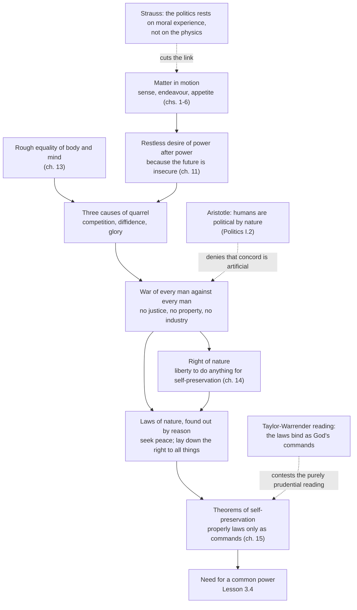

# History of Political Thought · Lesson 3.3: Hobbes I: matter, motion and the state of nature

> ⏱ ~15 min · Module 3: Machiavelli and Hobbes: the state without a common good · Builds on: [3.1 Machiavelli's *Prince*](03-01-machiavelli-the-prince.md), [1.1 Plato's *Republic*](01-01-platos-republic-justice-in-city-and-soul.md) · Unlocks: [3.4 Hobbes II: the sovereign and the church](03-04-hobbes-the-sovereign-and-the-church.md)

## Why this matters

Machiavelli taught rulers how to survive without a shared idea of the good. Hobbes asked a harder question: if people disagree about the good all the way down, can reason alone *prove* that they must have a sovereign? His answer starts with bodies in motion and ends with the most famous thought experiment in political theory, and every later contract theorist, from Locke and Rousseau to modern game theorists, works inside the frame he built. Reading him carefully also means unlearning the cartoon: Hobbes did not think people were wicked, and his "laws of nature" are not moral laws in the sense you probably expect.

## The idea

Hobbes lived through a collapse. He was born in 1588; in a Latin verse autobiography written late in life he says his mother, frightened by rumours of the Spanish Armada, gave birth to twins, himself and fear. By 1640 England was sliding toward civil war, and Hobbes, whose royalist-leaning *Elements of Law* was circulating in manuscript, left for Paris. From there he watched the wars of 1642 to 1651 and the execution of Charles I in 1649. *Leviathan* appeared in London in 1651. Its question was not "what is the best regime?" but "what stops people who are sure they are right from killing each other?"

His method was borrowed from geometry. According to John Aubrey's *Brief Lives*, Hobbes came to Euclid only around the age of forty, opened a copy at a proposition he thought impossible, and followed the proofs backward until he was convinced; the story may be polished, but the ambition is real. Geometry, Hobbes says in chapter 4, is the only science God has so far given mankind, because it begins by fixing the meanings of its words and then reasons strictly from them. Politics could be a science too, if it did the same.

So he starts at the bottom. The world is matter in motion. Sensation is motion pressed on our organs by outside bodies (ch. 1); imagination is that motion fading (ch. 2). Inside the body, tiny beginnings of motion toward or away from things are *endeavour*, called appetite or aversion (ch. 6). "Good" names whatever a person desires, with no good in things themselves (ch. 6). There is no final goal at which desire comes to rest; happiness is desire moving from one object to the next (ch. 11). Reason is reckoning, adding and subtracting the consequences of names (ch. 5).

Now put creatures like that together, with nobody over them. That is the state of nature, and chapter 13 argues that it is war.

## Source

Hobbes, *Leviathan* (1651), ch. 13, original spelling:

> "So that in the nature of man, we find three principall causes of quarrel. First, Competition; Secondly, Diffidence; Thirdly, Glory. The first, maketh men invade for Gain; the second, for Safety; and the third, for Reputation."

Read the middle term in its seventeenth-century sense. *Diffidence* is distrust, not shyness, and it is the cause that does the real work: the one that makes even peaceful people strike first.

## The argument

**From motion to the laws of nature (chs. 6, 11, 13, 14, 15).**

1. **Every person seeks to preserve their own motion, that is, their life, and to satisfy desires that never finally end.** Hobbes puts it as a general inclination of all mankind, "a perpetuall and restlesse desire of Power after power, that ceaseth onely in Death" (ch. 11), and explains it not by greed but by insecurity: you cannot secure what you have without acquiring more. *In words:* people pile up power because tomorrow is uncertain, not because they are insatiable.
2. **People are roughly equal: the weakest can kill the strongest, by stealth or alliance, and prudence is only experience, which time gives to all (ch. 13).** *In words:* nobody is safe enough to ignore anyone else.
3. **Equality of ability breeds equality of hope, so two people who want the same thing become enemies (competition).** *In words:* scarcity plus rough equality means contests nobody is sure to win.
4. **Since some take pleasure in conquest beyond what security needs, even those content with modest bounds must anticipate, mastering others before they are mastered (diffidence).** *In words:* you cannot tell the aggressor from the peaceful, so it is reasonable for everyone to strike first.
5. **People want others to value them as they value themselves, and punish signs of contempt (glory).** *In words:* honour adds quarrels over trifles to quarrels over goods and safety.
6. **So without a common power to keep them all in awe, people are in a condition of war of every man against every man (ch. 13).** War is not fighting but a known disposition to fight, as foul weather is not one shower but a tendency to rain. *In words:* the state of nature is a cold war, not a battlefield.
7. **In that war there is no industry, agriculture, navigation, arts or letters, and life is "solitary, poore, nasty, brutish, and short." Nor is anything unjust, because where there is no law there is no injustice (ch. 13).** *In words:* justice is not a natural fact but something that arrives with a common power.
8. **The right of nature is each person's liberty to use their own power, by their own judgement, to preserve their life; in war this extends to everything, even another's body (ch. 14).** *In words:* in the state of nature you may do whatever you judge necessary to survive.
9. **A law of nature is a general rule found out by reason forbidding what destroys one's life. The first: seek peace where there is hope of it, and otherwise use every advantage of war. The second: be willing, when others are too, to lay down the right to all things (ch. 14).** *In words:* reason tells a frightened creature that mutual disarmament beats endless war.
10. **These "laws" are strictly conclusions or theorems about what conduces to self-preservation; they are properly laws only as the command of one who has the right to command, God or the sovereign (ch. 15).** *In words:* the laws of nature are the deductions of a science of survival, and whether they are also commands depends on who issues them.

Premises 1 to 7 describe the problem; 8 to 10 derive, by reckoning alone, the rules that point to its solution. [Lesson 3.4](03-04-hobbes-the-sovereign-and-the-church.md) builds the sovereign from premise 9.

## Argument map

## Worked examples

**Example 1 (clean: sorting causes of quarrel).** A borderland with no magistrate. A herder raids a neighbour's flock in a dry year; the neighbour, seeing the raid, starts fortifying and ambushes the herder's cousin before any attack on him comes; a third man burns a barn because its owner mocked him at market.

Run chapter 13's classification. The raid is *competition*: violence for gain. The ambush is *diffidence*: violence for safety, by anticipation. The barn-burning is *glory*: violence for reputation, over what Hobbes calls trifles, a word or a sign of undervaluing. Now notice which is the engine. Remove the herder's greed and the third man's pride, and the neighbour still has reason to strike first, because he cannot know that the next stranger is as harmless as the herder turned out to be. Premise 4 is why Hobbes can say the argument accuses no one's nature: he states that the passions are in themselves no sin (ch. 13). The war follows from uncertainty about others, not from malice in all. Hobbes also offers evidence from ordinary life: you lock your doors and chests even under a working government, and so your actions accuse mankind as much as his words do.

**Example 2 (hard: does the right of nature cancel the law of nature?).** In the state of nature, may you kill a sleeping stranger who has never threatened you?

Premise 8 seems to say yes, if you judge it an apt means to survive, and in that condition you are the only judge. Premise 9 seems to say no: the first law commands you to seek peace. Hobbes resolves the strain in chapter 15 with a distinction. The laws of nature always oblige *in foro interno*, in the inner court: they bind you to desire that they take effect, and to an unfeigned endeavour toward peace. They oblige *in foro externo*, in outward action, only where there is security. Someone who kept every promise and stayed modest where no one else did would, Hobbes says, make himself prey and procure his own ruin, which is contrary to the very ground of the laws.

So the answer is: the law never licenses the killing as good, but it does not forbid it either, if you genuinely judge that no security exists. What the law demands is that you be the kind of agent who would disarm the moment others credibly would. This is where the reading of premise 10 bites. On a prudential reading, the inner obligation is simply what rational self-interest recommends. On A. E. Taylor's (1938) and Howard Warrender's (*The Political Philosophy of Hobbes*, 1957) reading, it is a genuine moral obligation because the theorems are also God's commands, which Hobbes explicitly allows. The text supports each at some point; that is why the dispute has lasted.

## Watch out

- **You might think the state of nature is a historical era, but** Hobbes says he believes it was never generally so over all the world. Its evidence is civil war, the locked door and the armed frontiers of kings, who stand toward each other in the posture of gladiators (ch. 13). It is an analysis of what life would be without a common power, not a prehistory.
- **You might think Hobbes held humans to be evil, but** he denies it: the passions are not sins, and the war comes from rough equality, scarcity and mutual uncertainty. Pessimism about *outcomes* is not a doctrine of original depravity. Contrast Machiavelli's generalization about human ingratitude in *Prince* ch. 17 ([3.1](03-01-machiavelli-the-prince.md)).
- **Anachronism trap: "law of nature."** For Aquinas, natural law is the rational creature's participation in eternal law ([`ethics` 4.4](../../ethics/lessons/04-04-natural-law-aquinas.md)). Hobbes keeps the name and changes the content: a theorem of self-preservation, called a law improperly unless taken as a command. Reading it as a modern moral duty, or as Thomist natural law, imports what chapter 15 explicitly strips out.
- **Anachronism trap: "right."** Hobbes's right of nature is a *liberty*, the absence of obligation, which he sets against law as liberty against obligation (ch. 14). It is not a claim that others must respect, as in later rights talk.

## One-liner

> Hobbes derives war from equality and distrust rather than wickedness, and derives peace from theorems of self-preservation rather than from a natural common good.

## Problems

**P1 (🟢) *(Exegetical.)*** Close reading. Just before this passage, Hobbes calls the laws of nature dictates of reason concerning what conduces to people's own conservation and defence (ch. 15):

> "they are but Conclusions, or Theoremes … whereas Law, properly is the word of him, that by right hath command over others. But yet if we consider the same Theoremes, as delivered in the word of God, … then are they properly called Lawes."

Two readers disagree. Reader A: for Hobbes, the laws of nature are merely prudential advice with no obligating force of their own. Reader B: for Hobbes, the laws of nature are genuinely obligatory because they are divine commands. Which reading, or what combination, do the words support? Point to the words that decide it. 150 words or fewer.

**P2 (🟡) *(Exegetical (a) · Evaluative (b).)*** (a) Reconstruct Hobbes's *diffidence* argument from chapter 13 in numbered premises, ending with the conclusion that it is reasonable even for a person content with modest bounds to strike first. (b) Flag the weakest premise, and say what happens to the conclusion in a society where every person's peaceful disposition is reliably known to all. 150 words or fewer for (b).

**P3 (🔴, optional) *(Exegetical (a) · Evaluative (b).)*** Aristotle holds that a human being is by nature a political animal, more political than bees, because speech lets humans share a perception of the just and unjust (*Politics* I.2, 1253a). In *Leviathan* ch. 17 Hobbes asks why humans cannot live sociably like bees and ants, and answers, among other reasons, that humans compete for honour, judge themselves wiser than their rulers, and use words to make good seem evil. (a) Name the crux: the single premise about human speech and reason that one side must deny. (b) Say what kind of evidence or argument would move a reader toward either side. 150 words or fewer in total.

Solutions

**P1** *(Exegetical.)*

**Must hit, strict:**
- The passage denies that the dictates are laws *properly* speaking in their own right: "but Conclusions, or Theoremes," set against law as "the word of him, that by right hath command."
- The "But yet" clause states a condition under which the same theorems *are* properly laws: considered as delivered in the word of God, who by right commands.
- So neither pure reading fits the words. A is right that the theorems, as theorems, lack the form of command; B is right that Hobbes grants them the status of law under a theological description. The text supports a *conditional* combination; which description Hobbes thought carried the obligation is left open here.

**Wrong turns:** treating "improperly" as "falsely" (Hobbes still calls them dictates of reason); ignoring the "But yet" sentence; claiming the passage settles whether Hobbes was sincere about God, which it does not address.

**Model answer:** The words support neither reading alone. "But Conclusions, or Theoremes" denies that the dictates are laws in the proper sense, which is defined as "the word of him, that by right hath command," so, taken as reason's findings, they have the form of advice (A's point). But the next sentence, beginning "But yet," names a condition: "as delivered in the word of God," the same theorems "are … properly called Lawes." Since God "by right commandeth all things," the theorems gain the commanding form they lacked (B's point). The best-supported reading is conditional: one set of propositions, prudential theorems under one description and laws under another. The passage does not tell us which description Hobbes thought actually binds people, which is why the Taylor-Warrender dispute survives it.

---

**P2** *(Exegetical (a) · Evaluative (b).)*

**Must hit, strict (a):**
- P1: People are roughly equal in ability, so each can threaten each.
- P2: Some people take pleasure in conquest beyond what their security requires.
- P3: No one can reliably tell in advance who those people are.
- P4: Without a common power, no one else will protect you.
- P5: Someone who only defends, while others enlarge their power by invasion, cannot long survive.
- C: So for anyone, even the moderate, anticipation (mastering others before they master you) is reasonable, and "generally allowed" as needed for conservation.
P2 (some aggressors) and P3 (not knowing who) must both appear; a reconstruction resting on universal aggression misses Hobbes's argument.

**Must hit, any verdict (b):** identify a premise and say why it is vulnerable (P3, the uncertainty about types, is the usual choice; P2 or P5 are defensible); then state that with dispositions reliably known, P3 fails and the diffidence route to war does not go through for the known-peaceful, and say whether competition or glory alone could still produce war.

**Wrong turns:** writing "people are naturally evil" as a premise; confusing diffidence with competition (diffidence is violence for *safety*).

**Model answer (b), one of several:** P3 carries the most weight and is the most contestable, because it turns the aggression of a few into a reason for all to attack. If everyone's peaceful disposition were reliably known, a moderate person would have no one to anticipate, and diffidence would give no reason to strike. War could still come from competition over scarce goods or from glory, but Hobbes's claim that the war is *universal*, including the moderate, would lose its main support. A Hobbesian can reply that dispositions are never reliably knowable, since words deceive and people change, which is exactly what ch. 17 stresses.

---

**P3** *(Exegetical (a) · Evaluative (b).)*

**Must hit, strict (a):** both thinkers point to the same human capacities, speech and reason, and give them opposite effects. The crux is whether speech and reason tend toward *shared* judgments of just and unjust (Aristotle) or toward *rival* private judgments that set people against each other (Hobbes). Aristotle must deny that speech mainly breeds conflict; Hobbes must deny that it naturally produces a shared perception of justice. Either formulation of this single premise is acceptable.

**Must hit, any verdict (b):** name evidence or argument that bears on *that* premise, for example whether groups without coercive power reach and keep agreement about justice, or how disputes behave where no arbiter exists; and note that each side can reinterpret the same evidence (Aristotle's households and villages versus Hobbes's small families held together by natural affection).

**Wrong turns:** making the crux "humans are good or bad"; saying Aristotle thought humans political in the sense bees are (he says *more* political, because of speech); taking a side in (b) without naming evidence.

**Model answer, one of several:** (a) Whether reason and speech naturally produce agreement about justice. For Aristotle speech exists to share a sense of the just, so community fulfils our nature; for Hobbes the same gifts let each person think himself wiser and paint good as evil, so agreement must be manufactured by covenant and a common power. (b) What would move a reader is evidence about communities without an arbiter: if they tend to keep a shared sense of justice over time, that supports Aristotle; if they fragment into rival judgments until someone imposes one, that supports Hobbes. A reader should also ask whether such communities are really without power, since each side can read them as confirming its view.

## Flashback

**From Lesson 3.1 (Machiavelli's *Prince*: *virtù* and *fortuna*):** *(Exegetical.)* Apply to a hard case. *The Prince* chapter 16, on liberality and meanness, answers one objection with a distinction of stage: are you already a prince, or on the way to becoming one? It answers another with a distinction of source (Marriott):

> Either a prince spends that which is his own or his subjects' or else that of others. In the first case he ought to be sparing, in the second he ought not to neglect any opportunity for liberality.

(a) For each invented case, say whether chapter 16 advises liberality or thrift, and name the distinction that decides it. One line each. (i) An established duke pays for lavish festivals with a new salt tax. (ii) A captain campaigning abroad pays his troops generously from a sacked city's treasury. (iii) An ambitious citizen, not yet in power, spends his family fortune on public banquets. (b) Machiavelli calls meanness a vice and still recommends it. By what test? Two sentences or fewer.

Solution

**Must hit, strict (a):**
- (i) **Thrift.** He is a prince in fact spending his subjects' goods. The new tax is the road the chapter warns of: liberality makes a prince rapacious, and rapacity makes him hated.
- (ii) **Liberality.** He is spending what belongs to others. A prince who goes out with his army, living on plunder, *must* be liberal or his soldiers will not follow him (Cyrus, Caesar, Alexander).
- (iii) **Liberality, by the stage distinction.** For someone on the way to power it is "very necessary" to be thought liberal. That is Caesar's case, even though the money is his own. The chapter adds that once in power he would have to moderate his spending or be ruined.

**Must hit, strict (b):** the test is maintaining the state (chapter 15's test). Meanness brings reproach *without hatred*. Liberality, once the money runs out, forces rapacity, which brings reproach *with* hatred, and hatred together with contempt is what a prince must guard against above all.

**Wrong turns:** in (iii), applying the source rule ("his own, so be sparing") and ignoring the stage reply, which is the one Machiavelli gives for Caesar before power. Answering (b) with "the end justifies the means", a slogan the book does not use.

**Model answer:** (a) (i) Thrift: an established prince spending his subjects' money ends up rapacious and hated. (ii) Liberality: another's goods, and soldiers living on plunder will not follow a stingy captain. (iii) Liberality: on the way to power the reputation is necessary, as with Caesar, but it must be curbed once he rules. (b) The test is whether the quality keeps the state. Meanness costs only reproach, while liberality ends in rapacity and hatred.

## Connections

- **Backward:** Glaucon's story in [1.1](01-01-platos-republic-justice-in-city-and-soul.md), where justice is a compromise among people who would rather do injustice than suffer it, is the ancestor of chapter 13; Hobbes turns a challenge Plato set out to refute into a foundation. [3.1](03-01-machiavelli-the-prince.md) gave rule without a common good as an art; Hobbes wants it as a science. The Aristotle whom Hobbes answers in ch. 17 is [1.3](01-03-aristotle-the-city-exists-by-nature.md).
- **Forward:** [3.4](03-04-hobbes-the-sovereign-and-the-church.md) builds the sovereign from the second law, by authorization, and shows why half of *Leviathan* is about scripture. Locke's state of nature under a law that binds before any government ([4.1](04-01-locke-against-filmer-and-property.md)) and Rousseau's complaint that Hobbes gave natural man the passions of civil society ([4.3](04-03-rousseau-discourse-on-inequality.md)) are both replies to this lesson.
- **Sideways:** Hobbes's reply to the Foole in ch. 15, and the prisoner's-dilemma reading of compliance, are taught in [`ethics` 5.1](../../ethics/lessons/05-01-contractarianism-morality-as-mutual-advantage.md). Whether the state-of-nature device can justify obligation is the analytic question of [`political-philosophy`](../../political-philosophy/syllabus.md) Module 1. Hobbes's materialism belongs to the mechanical philosophy that [`modern-philosophy`](../../modern-philosophy/syllabus.md) owns. Finding the crux in P3 is the method of [`philosophical-method` 4.3](../../philosophical-method/lessons/04-03-finding-the-crux.md).
