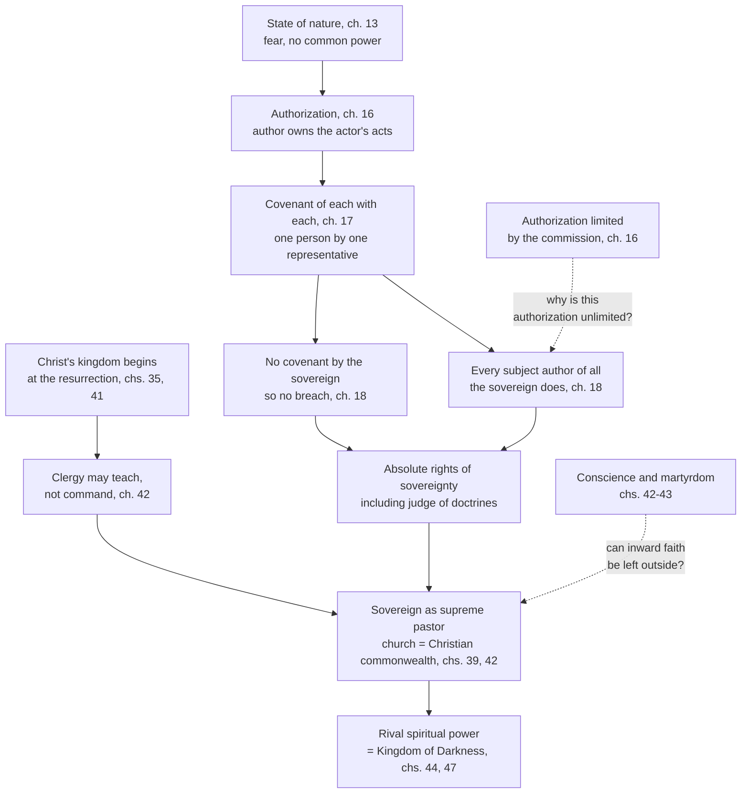

# History of Political Thought · Lesson 3.4: Hobbes II: the sovereign, the church and the Kingdom of Darkness

> ⏱ ~15 min · Module 3: Machiavelli and Hobbes: the state without a common good · Builds on: [3.3 Hobbes I: matter, motion and the state of nature](03-03-hobbes-matter-motion-and-the-state-of-nature.md) · Unlocks: [4.1 Locke I: against Filmer, and the origin of property](04-01-locke-against-filmer-and-property.md)

## Why this matters

[3.3](03-03-hobbes-matter-motion-and-the-state-of-nature.md) left you with frightened, equal people who can reason their way to peace but cannot trust each other to keep it. This lesson is how Hobbes gets from there to a sovereign no subject may lawfully accuse, punish or depose, and why that sovereign must also be head of the church. Most readers stop at chapter 31. Hobbes did not: roughly half of *Leviathan* (1651) is scripture, prophecy and a polemic against the papacy. He thought the English Civil War had been fought as much over who speaks for God as over who commands the army, so a theory of sovereignty that left the clergy alone would have solved half the problem.

## The idea

Start with a theatre. An actor on stage speaks words that are not his own; they belong to the character, and behind the character to whoever commissioned the play. Hobbes takes that stage vocabulary (the Latin *persona* was an actor's mask) and turns it into law. When I authorize you to act for me, you are the **actor** and I am the **author**: what you do in my name counts as my act.

Now let every member of a frightened multitude say to every other: *I authorize this one man, or this one assembly, to act for me, if you do the same.* The multitude, which was many wills, now has one voice, because it has one representative. That representative is the sovereign, and the people did not merely *consent* to him. They made themselves the authors of everything he does.

The consequence is severe and, on Hobbes's premises, strict. If I am the author of your acts, I cannot complain that you have wronged me, since no one can wrong himself. So the sovereign's power is absolute by construction. And since what men believe about God and damnation moves them more than any fear of the sword, the sovereign must also decide which doctrines may be taught. A rival authority over souls, whether pope, presbytery or inspired preacher, is a second sovereign, and two sovereigns mean war.

## Source

*Leviathan* ch. 17, the covenant that generates the commonwealth, as each person would phrase it to every other (original 1651 spelling):

> "I Authorise and give up my Right of Governing my selfe, to this Man, or to this Assembly of men, on this condition, that thou give up thy Right to him, and Authorise all his Actions in like manner."

Two verbs, not one. *Give up* is the transfer of right from ch. 14. *Authorise* is the ch. 16 idea of ownership of another's acts. And the covenant runs between subjects: the sovereign is named, but he is not a party.

## The argument

**From authorization to absolute sovereignty (chs. 16–18).**

1. **A person is one whose words or actions are taken as his own (natural) or as representing another's (artificial)** (ch. 16). *In words:* acting-for-someone is a real, rule-governed relation, not a metaphor.
2. **When an actor acts by authority, the author owns the act and is bound by it, as far as the commission goes** (ch. 16). *In words:* my agent's deal is my deal.
3. **A multitude becomes one person by being represented by one representative, with each member's consent** (ch. 16). *In words:* unity comes from the one who speaks for the crowd, not from the crowd agreeing with itself.
4. **Only a common power strong enough to overawe everyone gives the laws of nature security** (ch. 17). *In words:* 3.3's theorems of peace are worthless without a sword behind them.
5. **So each covenants with each to authorize one man or assembly to bear their person in what concerns common peace and safety** (ch. 17). *In words:* the commonwealth is made by that mutual authorization.
6. **The sovereign makes no covenant with the subjects, so he cannot breach one** (ch. 18, second right). *In words:* there is no contract with the ruler that he could break and so forfeit his power.
7. **Every subject is author of all the sovereign's actions and judgements** (ch. 18, fourth right). *In words:* whatever the sovereign does, you did.
8. **∴ The sovereign cannot injure a subject, cannot justly be punished by one, and holds the whole bundle of rights that follow from being charged with the end of peace:** legislation, judicature, war and peace, appointment of officers, and judgement of which doctrines are fit to be taught (ch. 18, rights 4–11). *In words:* whoever has right to the end has right to the means, and on Hobbes's psychology opinion is one of the means.

**Institution and acquisition (chs. 19–20).** A commonwealth *by institution* is set up by people afraid of each other; one *by acquisition* is submission to a conqueror they are afraid of. Hobbes insists the rights of sovereignty are the same in both, because both covenants are made from fear, and fear does not void a covenant (ch. 20). The conqueror's title rests on the same authorization as the elected assembly's.

**From sovereignty to the church (chs. 32–43, 47).** Part III rebuilds Christian politics from scripture, where Parts I–II used reason alone (ch. 32 says scripture holds things above reason but nothing contrary to it).

- **The Kingdom of God, properly so called, is a civil kingdom:** God's rule over Israel by covenant through Moses, cast off when Israel chose Saul, and to be restored by Christ at his return (ch. 35). Christ's own kingdom does not begin until the general resurrection (ch. 41).
- **So the clergy between now and then have a power to teach, not to command.** Ministers are, in Hobbes's comparison, schoolmasters rather than commanders, and their precepts counsel rather than law (ch. 42).
- **A church that can command is a commonwealth of Christians** (ch. 39), and in each Christian commonwealth the sovereign is supreme pastor, from whom all other pastors hold their right to teach (ch. 42). Hobbes puts the point with some relish in ch. 39: "Temporall and Spirituall Government, are but two words brought into the world, to make men see double, and mistake their Lawfull Soveraign."
- **Only two things are necessary to salvation: faith that Jesus is the Christ, and obedience to laws** (ch. 43). *In words:* once you see how little is necessary, a lawful command will almost never require damning yourself to obey it.

Part IV, the Kingdom of Darkness, names the enemy: a confederacy of deceivers who use dark doctrines to rule men in this world (ch. 44). Its culmination is ch. 47's image of Rome: "the Papacy, is no other, than the Ghost of the deceased Romane Empire, sitting crowned upon the grave thereof."

## Argument map

Two routes meet at the supreme pastor: one from reason (chs. 16–18), one from scripture (chs. 35–42). The dashed edges are the pressure points Hobbes himself raises.

## Worked examples

**Example 1 (clean: a preacher with a commission from God).** In a Christian commonwealth, a minister announces that God has revealed to him that a law is sinful, and that the faithful must not obey it. Run Hobbes.

First, ch. 18 (first right): a pretended covenant with God, made over the sovereign's head, is void, since no one covenants with God except through the one who bears God's person, and that is the sovereign. Second, ch. 42: the minister's office is to teach, and a teacher's precept is counsel, not law. Third, ch. 32: a claim that God spoke to someone directly is, for anyone else, hard if not impossible to verify, and Hobbes's problem was exactly that men cannot tell a true prophet from an ambitious one. Fourth, ch. 43: unless the law requires denying that Jesus is the Christ or breaking a law of God in a way that forfeits salvation, disobedience is unjust. Verdict on Hobbes's terms: the minister's authority to teach comes from the sovereign, and he has just used it to divide the sovereign's power, which ch. 29 lists among the diseases that kill a commonwealth.

**Example 2 (hard: the sovereign who forbids the faith).** Now the sovereign is an unbeliever and commands Christians to deny Christ aloud. Here the machine strains, and Hobbes knows it.

His first answer (ch. 42): belief cannot be commanded, since faith is God's gift, and only the tongue can be. Outward profession is a gesture of obedience. His example is Naaman the Syrian (2 Kings 5), who asked pardon for bowing in the temple of Rimmon beside his master and was told by Elisha to go in peace. What a subject does under compulsion *in obedience to the law* is, Hobbes argues, not his act but his sovereign's: authorization again. He then turns the question on the objector: would you say a Muslim subject of a Christian prince must die rather than attend Christian worship when commanded?

His second answer (ch. 43) pulls the other way: a Christian who does accept martyrdom should expect his reward in heaven and must not rebel. So the martyr is honoured but not required.

What strains is the gap between Matthew 10:33 (whoever denies Christ before men) and an account on which the denial is someone else's act. Readers split on what the strain shows. A. P. Martinich (*The Two Gods of Leviathan*, 1992) reads Parts III–IV as sincere, broadly Calvinist-leaning Protestant theology put to political use; Edwin Curley (an essay of about the same year) reads the scriptural chapters as a cautious, ironic undermining of revealed religion. J. G. A. Pocock (1971) had argued earlier that the eschatology is structural, not decorative. The lesson does not choose.

## Watch out

- **Anachronism trap: "absolute" is not "totalitarian," and "representative" is not "elected."** Hobbes's sovereign may be one man or an assembly, may be a conqueror, and owes an account of his office to God alone (ch. 30). He has no ambition to remake souls; ch. 42 grants that belief cannot be commanded. Reading a twentieth-century party-state or a modern parliament into *Leviathan* imports both too much and too little.
- **You might think Hobbes separates church and state.** The reverse: he denies there are two governments in this life at all. He agrees with later secularists that the clergy have no coercive power, but concludes that the *civil* sovereign therefore governs religion. The usual label is Erastian (after the sixteenth-century physician Thomas Erastus), used loosely.
- **You might think the sovereign is a party to the contract.** He is not; that is the point of the ch. 17 formula. Readers who import Locke's trust ([4.2](04-02-locke-limited-government-and-toleration.md)) make ch. 18's no-forfeiture argument unintelligible.
- **You might think ch. 47 is anti-Christian satire.** Whatever Hobbes privately believed, the argument is aimed at a *political* claim, papal power over princes, and is made from Protestant scriptural premises. Whether it reaches Christianity itself is the Martinich–Curley dispute, not a reading of the passage.

## One-liner

> By making every subject the author of the sovereign's acts, Hobbes makes the sovereign unaccusable, and by postponing Christ's kingdom to the resurrection, he makes the sovereign the church's only earthly head.

## Problems

**P1 (🟢) *(Exegetical.)*** Reconstruct Hobbes's argument in ch. 18 (the second right) that the sovereign cannot forfeit his power by breach of covenant. Give numbered premises and a conclusion (5–7 lines), in Hobbes's own terms, covering both reasons he gives, and flag the premise a critic like Locke would most want to deny.

**P2 (🟡) *(Exegetical (a) · Evaluative (b).)*** In ch. 18, right after arguing that the sovereign's actions cannot justly be accused by a subject, Hobbes adds:

> "It is true that they that have Soveraigne power, may commit Iniquity; but not Injustice, or Injury in the proper signification."

(a) Does this sentence say the sovereign can do no wrong? Name the word that decides it, and explain the technical sense of *injustice* Hobbes is relying on (from ch. 15, where injustice is defined) and why the sovereign cannot commit it. (b) A critic says: a wrong that no subject may name, judge or punish is no constraint at all. Using ch. 30 (the sovereign's office and to whom he answers), assess whether the distinction does any real work in Hobbes's theory. Any verdict. 150 words or fewer for (b).

**P3 (🔴, optional) *(Exegetical.)*** Aquinas, in *De Regno* (Book I, ch. 15 in the usual numbering; paraphrased, since there is no public-domain English translation), holds that because man's final end is beyond civil life, the care of that end belongs to priests, above all the Roman pontiff, to whom Christian kings should be subject as to Christ. Hobbes makes the Christian sovereign supreme pastor. Both are Christians who accept that salvation matters more than civil peace. Name the single premise one must deny, cite where Hobbes denies it, and say what kind of argument would move each side. 150 words or fewer.

Solutions

**P1** *(Exegetical — strict.)*

**Must hit, strict:**
- The right to bear the person of all is given by covenant of subjects **one to another**, not of the sovereign to them.
- **First reason (dilemma):** a prior covenant by the sovereign would have to be either (i) with the whole multitude as one party, impossible because before institution they are not yet one person; or (ii) with each man severally, and those covenants are void once he is sovereign, since any act alleged as breach is the act of every subject too, done in their person and by their right.
- **Second reason (no judge):** if some subjects allege breach and others deny it, there is no judge; the dispute returns to the sword, contrary to the purpose of institution.
- Conclusion: no breach on the sovereign's side, so no subject can be freed from subjection by pretence of forfeiture.
- Flag: the first premise, that the sovereign is not a party. Locke's government holds power in trust and can forfeit it ([4.2](04-02-locke-limited-government-and-toleration.md)).

**Wrong turns:** citing ch. 21's liberties (a different question); saying the sovereign is above covenants because he is appointed by God. Hobbes's argument here is from institution alone.

**Model answer:** P1 Sovereignty is conferred by covenant of each subject with each, not of the sovereign with them. P2 A prior covenant by the sovereign would be with the multitude as one party or with each man severally. P3 Not with the multitude: before institution it is not one person. P4 Not with each severally: once he is sovereign, any alleged breach is an act done in every subject's person, so each is its author. P5 If subjects dispute whether a breach occurred, there is no judge, and the question returns to the sword, defeating the institution's end. ∴ The sovereign cannot breach, and no subject can claim release by forfeiture. Weakest for a Lockean: P1.

---

**P2** *(Exegetical (a) · Evaluative (b).)*

**Must hit, strict (a):**
- No. **"Iniquity"** decides it: the sovereign can act wrongly.
- In ch. 15, injustice is the not performing of covenant, and an injury (the injustice of an action) is done to the one to whom the covenant was made. The sovereign made no covenant with subjects, and each subject is author of his acts; no one injures himself. So the sovereign's wrongs cannot be *injustice* "in the proper signification."
- Iniquity is a breach of equity, that is of the laws of nature, which still bind the sovereign.

**Must hit, any verdict (b):**
- Use ch. 30: the sovereign is obliged by the law of nature to procure the people's safety and must account to God, the author of that law, and to none but him.
- Say what the distinction does: it keeps a moral standard while denying subjects any title to enforce it.
- Test the critic's point: does an unenforceable-by-subjects duty change anything (sovereign's conscience, counsel, teaching of doctrine, stability as self-interest), or is it idle?

**Wrong turns:** reading "Iniquity" as a synonym of injustice; treating (b) as settled by pointing to ch. 21.

**Model answer (b), one of several acceptable:** The distinction is not idle inside Hobbes's system. It lets him say that a sovereign who starves his people violates the law of nature and will answer to God (ch. 30), so his theory is not "might makes right." It also gives counsellors and teachers a vocabulary for criticism short of accusation. But the critic is right about enforcement: no subject has standing to judge the breach, so the constraint works only through the sovereign's conscience, his fear of God and his interest in a strong commonwealth. Verdict: a real moral constraint, deliberately without a human court. Whether that counts as a constraint depends on whether one thinks only enforceable duties restrain rulers.

---

**P3** *(Exegetical — strict on identifying one premise.)*

**Must hit, strict:**
- The crux: **whether there is now, in this life, a government properly so called, ordered to salvation and distinct from civil government** (equivalently, whether Christ's kingdom is present in the church or begins only at the resurrection).
- Aquinas affirms it: the spiritual end has its own present rulers, to whom kings are subordinate in what concerns that end.
- Hobbes denies it: Christ's kingdom is not of this world and does not begin until the general resurrection (ch. 41); clergy have only a power to teach (ch. 42); there is no government in this life but temporal (ch. 39).
- What moves each: scriptural and ecclesiological argument (the meaning of "kingdom of God," the Petrine texts, the apostles' actual powers) for both; for Hobbes, also the political argument that divided authority produces civil war.

**Wrong turns:** naming "whether salvation matters more than peace" (both affirm it); naming Hobbes's materialism, which is not the premise he uses here.

**Model answer:** The disputed premise is that a distinct spiritual government, with authority to command, exists now. Aquinas affirms it: because the final end exceeds civil life, its care belongs to priests and the pope, and kings are subject in that order. Hobbes denies it: the Kingdom of God is a civil kingdom once held by Israel and to be restored at Christ's return (chs. 35, 41), so until then ministers teach but do not command (ch. 42), and a church able to command is simply a Christian commonwealth under its sovereign (ch. 39). What would move them is exegesis first: whether scripture's kingdom is present or future, and what the apostles' commission conferred. Hobbes adds a political premise Aquinas could contest independently: that two authorities over the same subjects must end in war.

## Flashback

**From Lesson 3.2 (Machiavelli's *Discourses*: the republic of conflict):** *(Exegetical.)* In *Discourses* I.11 (Thomson), Machiavelli says Numa found the Romans fierce and turned to religion to bring them to order. Of the Romans he then writes:

> "esteeming the power of God beyond that of man, they dreaded far more to violate their oath than to transgress the laws"

He gives two proofs. After Cannae, Scipio drew his sword on citizens planning to abandon Italy and made them swear to stay. And when the tribune Marcus Pomponius brought a charge against Lucius Manlius, the accused man's son threatened the tribune with death and made him swear to drop it; the tribune, having sworn, kept his oath. (a) Is religion praised here for making Romans pious or good, or for something else? Name the words that decide it. (b) The Manlius story sits awkwardly with one premise of the *Discourses*' theory of conflict. Which premise, and why? Three sentences or fewer per part.

Solution

**Must hit, strict (a):** religion is valued for its **effect on obedience**, not for its truth or for the inner goodness of believers. The deciding words are the comparison "dreaded far more to violate their oath than to transgress the laws": the oath reaches where law and love of country fail. Both proofs are oaths *forced* at sword-point or on threat of death, and they bind anyway, which shows the praise is for binding force. Supporting context (any one): the same chapter says religion made easy any enterprise the senate undertook, and that Numa feigned converse with a nymph to get new laws accepted.

**Must hit, strict (b):** premise 3, that a mixed order holds only if each humour has an **ordinary, lawful outlet** (I.7). A tribune's public accusation of a noble is exactly that outlet; it is the channel of the Coriolanus case. Here a private threat of death extracts an oath that shuts the channel, and religion makes the oath stick. So the force Machiavelli praises is indifferent to whether it protects the ordinary channels or closes them. Credit an answer that adds that I.11 cites the case only to show how strongly oaths bound, not to approve closing the accusation.

**Wrong turns:** answering (a) with "Machiavelli is a pagan who prefers Roman gods," which the passage does not say; reading "fear of God" as personal piety rather than a political force; naming the two-humours premise in (b), when the problem lies in the channel, not the humours.

**Model answer:** (a) Something else: religion is praised as a binding force. The Romans "dreaded far more to violate their oath than to transgress the laws," and both proofs are oaths forced by threats that held anyway. What is valued is obedience that law alone could not secure, not piety or goodness. (b) Premise 3: conflict must run through ordinary, lawful outlets. The tribune's accusation was that outlet, and a private death threat plus a religious oath shut it down. The same religious force that kept Romans in Italy after Cannae could also block the channels Machiavelli says keep a republic free.

## Connections

- **Backward:** the fight over whether pope or prince holds supreme authority is [2.5](02-05-marsilius-and-conciliarism.md)'s. Marsilius had already denied the clergy coercive jurisdiction and placed it in the human legislator; Hobbes goes further and makes the sovereign pastor as well as judge. Augustine's two cities ([2.2](02-02-augustine-the-two-cities.md)) and Aquinas's subordination of kings to priests ([2.4](02-04-aquinas-on-kingship-tyranny-and-property.md)) are the positions Part III is written against. Machiavelli's civil religion ([3.2](03-02-machiavelli-the-discourses.md)) is the nearest earlier attempt to make religion serve the state.
- **Forward:** [4.1](04-01-locke-against-filmer-and-property.md) opens Locke's reply, and [4.2](04-02-locke-limited-government-and-toleration.md) answers Hobbes on two fronts: government as a revocable trust, and toleration instead of a sovereign judge of doctrine. Rousseau ([4.4](04-04-rousseau-the-social-contract.md)) praises Hobbes in his chapter on civil religion for trying to reunite the two powers. Module 3's boss problem close-reads ch. 21 on the liberty of subjects, which this lesson leaves aside.
- **Sideways:** the analytic question of whether authorization, consent or benefit can ground obligation belongs to [`political-philosophy`](../../political-philosophy/syllabus.md); Hobbes's Foole and the compliance problem are [`ethics` 5.1](../../ethics/lessons/05-01-contractarianism-morality-as-mutual-advantage.md). Catholic teaching on the relation of Church and state is [`catholic-social-teaching`](../../catholic-social-teaching/syllabus.md)'s, and the Church's own account of its teaching authority is [`fundamental-theology` 4.1](../../fundamental-theology/lessons/04-01-the-magisterium.md). The claim that one voice must stand for a multitude, decided by the greater number when the representative is an assembly (ch. 16), is an early form of the aggregation problem in [`social-choice`](../../social-choice/syllabus.md).
