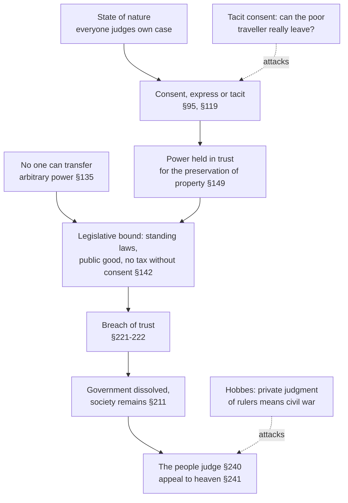

# History of Political Thought · Lesson 4.2: Locke II: limited government, revolution and toleration

> ⏱ ~15 min · Module 4: Consent, property and the general will · Builds on: [4.1 Locke I: against Filmer, and the origin of property](04-01-locke-against-filmer-and-property.md), [3.4 Hobbes II: the sovereign and the church](03-04-hobbes-the-sovereign-and-the-church.md) · Unlocks: [4.3 Rousseau I: the *Discourse on Inequality*](04-03-rousseau-discourse-on-inequality.md)

## Why this matters

Hobbes answered the question "who judges?" with one word: the sovereign. Locke wrote in the middle of a political crisis in which that answer would have meant accepting a Catholic king most of his allies believed would rule without Parliament. His reply, that government is a *trust* and that the people who grant a trust judge whether it has been broken, is the theory behind "no taxation without consent" and behind the Declaration of Independence's long train of abuses. The same decade produced his *Letter Concerning Toleration*, which fenced religion off from the state's power, and then fenced atheists and the servants of a foreign prince out of the fence.

## The idea

**The setting.** In the Exclusion Crisis (1679–81) Locke's patron, the Earl of Shaftesbury, led the attempt to bar James, Duke of York, a Catholic, from succeeding his brother Charles II. It failed. Charles ruled without Parliament from 1681, Shaftesbury died in exile in Holland in 1683, and Locke followed him there the same year. Louis XIV revoked the Edict of Nantes in 1685, driving Huguenots out of France. James II, king from 1685, was overthrown in 1688; Locke came home in early 1689 and published the *Two Treatises* anonymously that year. Peter Laslett's edition (1960) argued that most of the *Second Treatise* was written during the Exclusion Crisis, so it is less a justification of 1688 after the fact than a case for resistance written years before it happened. Most scholars accept some version of that dating.

**The trust.** [4.1](04-01-locke-against-filmer-and-property.md) left us in a state of nature that already has a moral law and property, but no umpire: everyone enforces the law of nature in their own case, and does it badly. People form a society to get an impartial judge, standing laws and a power to carry out judgments. What they hand over is exactly the power they had, enforcement of the law of nature, *for a purpose*. A power given for a purpose is limited by the purpose. That is the whole theory in miniature.

**The toleration.** The same move, applied to religion. If the commonwealth exists for civil interests (life, liberty, health and outward goods), then the salvation of souls was never part of what anyone handed over. And the magistrate's one distinctive instrument is force, which can make people *say* things but cannot make them *believe* them.

## Source

Locke, *A Letter Concerning Toleration* (William Popple's English translation, 1689, of the Latin *Epistola de Tolerantia*), the second of three reasons the care of souls does not belong to the magistrate:

> true and saving religion consists in the inward persuasion of the mind, without which nothing can be acceptable to God. And such is the nature of the understanding, that it cannot be compelled to the belief of anything by outward force.

Two claims sit in two sentences. The first is theological: God accepts only sincere belief. The second is about human psychology: belief does not respond to penalties. Locke needs both. A worship coerced into existence would be worthless even if penalties worked, and penalties would be useless even if God accepted conformity.

## The argument

**A. Limited government (*Second Treatise*, chs. VIII, XI, XIX).**

1. **No one is subject without consent.** "No one can be put out of this estate, and subjected to the political power of another, without his own consent" (§95). *In words:* since nature makes no one anyone else's ruler, only an act of the governed can.
2. **Consent can be tacit.** Owning land, lodging for a week, even travelling on the highway within a government's territory binds you to obey its laws while you do it (§119), though only express consent makes you a member (§121–22). *In words:* using the protection means accepting the rules, but it does not enrol you for life.
3. **No one can transfer more power than they have.** No one has arbitrary power over their own life or anyone else's, so the legislative, though supreme, cannot have it either (§135). *In words:* you cannot hand over a right to destroy what God, not you, owns ([4.1](04-01-locke-against-filmer-and-property.md), §6).
4. **So the legislative is bound.** It must rule by promulgated standing laws, the same for rich and poor; for the good of the people; not tax without the consent of the majority or their representatives; and not hand its lawmaking power to anyone else (§142, §140). *In words:* government by settled rules for the common good, with the purse in the people's hands.
5. **Political power is fiduciary.** The legislative holds its power in trust for an end; neglect or oppose that end and the trust is forfeit and power returns to those who gave it (§149). *In words:* the ruler is a trustee, not an owner.
6. **Breach of trust dissolves the government, not the society.** A legislative that tries to take the people's property or reduce them to arbitrary power forfeits its power, and the people may set up a new legislative (§222); so does a prince who stops the legislative from meeting (§215). The society survives; only foreign conquest ends it (§211). *In words:* the rulers can lose their office without the people dissolving into anarchy.
7. **The people judge.** Who decides whether the trustee has broken trust? "The people shall be judge" (§240), for the one who deputes judges the deputy. Where no judge on earth will hear the case, the only remedy is an *appeal to heaven*, meaning force, with God judging the right (§168, §241–42). *In words:* the last word belongs to the governed, and if the rulers will not accept it, the dispute becomes a war.

Locke adds a brake: people put up with serious mistakes and many bad laws, and move only after a long, consistent series of abuses makes a design visible (§225, §230).

**B. Toleration (the *Letter*).**

1. **The commonwealth is for civil interests only:** life, liberty, health, freedom from bodily pain, and outward possessions. *In words:* the state's job description has no salvation clause.
2. **The care of souls was not committed to the magistrate,** not by God, who gave no one authority to compel another's religion, and not by the people, since no one can abandon care of their own salvation to another's choice. *In words:* neither possible source of authority granted it.
3. **Force cannot produce belief** (the Source), **and even if it could, it would not save:** magistrates disagree, so salvation would depend on where you happened to be born. A church, meanwhile, is a voluntary society whose only penalty is expulsion. *In words:* compulsion is unauthorized, ineffective and pointless.
4. **Exclusions.** Not tolerated: opinions contrary to the moral rules civil society needs; churches whose members, by joining, put themselves under the protection and service of a foreign prince; and those who deny God, because oaths and promises cannot bind them. *In words:* toleration stops where civil peace is at stake.

## Argument map

The dashed edges are the pressure points. The first is Hobbes's worry, which Locke answers with the brake of §225. The second presses the step in which the benefits of residence count as agreement.

## Worked examples

**Example 1 (clean: Charles II without Parliament).** From 1681 until his death in 1685 Charles II did not summon Parliament. Run the theory. §215: a prince who prevents the legislative from assembling when it should alters the legislative, and a government whose legislative is altered is dissolved. The trust (§149) was given for ends a legislature serves, and here the executive has stopped it working. So on Locke's principles the government's authority is forfeit and the people may reconstitute it. Two limits keep this from being a hair trigger. The judgment belongs to the body of the people, not to a faction (§242), and one bad act is not a design. Only a long series of abuses all tending the same way makes the design visible (§225). Written in these years, the chapter reads as an argument that this line was being approached.

**Example 2 (hard: James II's Declaration of Indulgence, 1687).** James, by royal prerogative, suspended the penal laws against Catholics and Protestant dissenters. The *Letter* holds that persecution for belief is outside the magistrate's remit, so the *outcome* looks like what Locke wanted. Run both doctrines.

- *Toleration:* relief for dissenters is exactly what the jurisdiction argument supports. Relief for Catholics runs into the "foreign prince" exclusion. The *Letter* never names Catholics: its illustration is a Muslim who owes blind obedience to the Mufti of Constantinople. But the doctrines it lists just before (that faith need not be kept with heretics, that excommunicated kings forfeit their crowns) were read then, and are read by most scholars now, as aimed at Rome.
- *Limited government:* prerogative is a real power: discretion to act for the public good where the law is silent, and sometimes even against the law (§160). But it is held on the same trust, and a king who sets whole statutes aside by his own will looks like the tyrant of §199, who makes his will rather than the law the rule.

So the two halves of Locke point different ways: a tolerant *result* reached by what the *Second Treatise* treats as a signature of arbitrary power. Locke's texts do not discuss the Indulgence. His principles make the *method* decisive, and they leave open whether suspicion of the king's motive counts as evidence of a design (§230). That is where the theory needs judgment, and where Locke hands the judgment to the people.

## Watch out

- **Anachronism trap: "property."** In the *Second Treatise* the end of government is the preservation of property, but Locke tells us he uses the word as a general name for people's lives, liberties and estates (§123). "Government exists to protect property" is not a claim about protecting the rich.
- **Anachronism trap: "toleration" is not modern religious liberty.** Locke's toleration is a limit on the magistrate's jurisdiction, with civil exclusions built in. It is not a theory of equal citizenship regardless of belief. England's Toleration Act (1689) was narrower still, relieving Trinitarian Protestant dissenters only. Reading the *Letter* as the First Amendment is a century early.
- **You might think Locke defends democracy or a right of individuals to revolt at will.** "The people" judge collectively, a legislature may be an assembly of a few, and §230 says an agitator who stirs before the mischief is general brings only his own ruin.
- **You might think the religious premises are ornament.** Readers disagree sharply. John Dunn (1969) and Jeremy Waldron (*God, Locke, and Equality*, 2002) argue, in different ways, that the theory depends on its Christian premises (workmanship, equality before God, sincere faith); Leo Strauss (1953) read Locke as closer to Hobbes than his pious surface suggests. Whether a secular version stands is [`political-philosophy`](../../political-philosophy/syllabus.md)'s question, not this lesson's.

## One-liner

> Government is a trust for lives, liberties and estates, judged by those who granted it, and the magistrate's sword reaches outward conduct, never inward belief, except where belief itself threatens the civil bond.

## Problems

**P1 (🟢) *(Close reading. Exegetical.)*** Locke on atheists (*Letter*, Popple):

> Promises, covenants, and oaths, which are the bonds of human society, can have no hold upon an atheist. The taking away of God, though but even in thought, dissolves all.

He adds a second reason: atheists, undermining all religion, can claim no religious ground for demanding toleration. Is the exclusion in the quoted sentences justified by the atheist's *religious error* or by a *civil danger*? Point to the words that decide it, and say which of the two reasons fits the *Letter*'s own account of what the commonwealth is for. 100 words or fewer.

**P2 (🟡) *(Reconstruct. Exegetical (a) · Evaluative (b).)*** (a) Reconstruct the Source passage's argument that the magistrate may not compel belief, in numbered premises. Make explicit the premise that turns "force *cannot* produce belief" into "the magistrate has *no right* to use force for belief," and flag the weakest premise. (b) Jonas Proast replied (1690) that force need not produce belief directly: moderate penalties can make people *consider* arguments they would otherwise ignore, and consideration can produce belief. Does the argument in (a) survive? Any verdict. 150 words for (b).

**P3 (🔴, optional) *(Find the crux. Exegetical.)*** Hobbes: every subject is the author of the sovereign's acts, so the sovereign can do no injury to them (*Leviathan* ch. 18), and the doctrine that private men judge good and evil is seditious (ch. 29). Locke: the people judge whether their trustee has broken trust (§240). Both agree that in nature each person judges their own case. Name the single premise about what is handed over in forming a government that one must deny, and say what argument would move a defender of either side. 150 words or fewer.

Solutions

**P1** *(Exegetical, strict.)*

**Must hit, strict:**
- **Civil danger.** The decisive words are *bonds of human society* and *dissolves all*: the harm is that the atheist cannot be bound by oath or promise, the instruments society runs on. Nothing in the quoted sentences says atheism is *false* or damning.
- The fit: the *Letter* defines the commonwealth as for civil interests only, so the first reason (unreliability in oaths) fits its framework. The second reason (no religious ground to claim toleration) does not argue from civil interest. It argues that atheists lack the *basis* on which toleration is claimed.
- Note the premise doing the work: that belief in God is what makes oaths bind. That is an empirical and theological claim of Locke's time, not something the jurisdiction argument supplies.

**Wrong turns:** reading the passage as punishment for unbelief, which contradicts the rest of the *Letter*; treating the two reasons as one.

**Model answer:** Civil danger. *Bonds of human society* and *dissolves all* locate the harm in broken oaths and covenants, a civil interest, not in the error itself. That reason fits the *Letter*'s claim that the commonwealth exists only for civil goods. The second reason is different in kind: atheists have no religion to plead, so they cannot claim toleration on religious grounds. The exclusion rests on a further premise, that only belief in God makes promises bind.

---

**P2** *(Exegetical (a) · Evaluative (b).)*

**Must hit, strict (a):**
- P1: The magistrate's distinctive power is outward force (penalties).
- P2: God accepts only sincere inward belief; conformity without it is worthless, or worse (hypocrisy).
- P3: Belief cannot be compelled by outward force.
- P4 (the bridge): a power may rightly be used only for ends it can achieve (or: power entrusted for an end does not extend to ends it cannot serve).
- ∴ The magistrate has no right to use force to bring about religious belief.
- Weakest premise flagged with a reason: usually P3 (psychology: belief may respond to penalties indirectly) or P4 (inefficacy alone does not obviously make an act illegitimate).

**Must hit, any verdict (b):** state Proast's move precisely (force as an indirect cause, through consideration); say which premise it attacks (P3, since belief is changed by a route Locke did not rule out); then say whether Locke keeps anything: e.g. force cannot select *true* consideration over conformity, or a magistrate of a false religion would use the same means (the *Letter*'s third consideration).

**Wrong turns:** omitting P4, so the conclusion follows only as "useless," not "illegitimate"; answering (b) by restating P3, which is what Proast denies.

**Model answer (b), one of several:** Proast targets P3. Locke showed penalties cannot produce belief *directly*; he did not show they cannot make someone look at arguments, and looking can change belief. As stated, the Source argument does not survive. Locke's resources lie elsewhere. Every magistrate thinks his own religion true, so the same moderate penalties would push people toward false religions as often as the true one. That is the third of the three reasons, not the Source's. Verdict: the psychological argument alone is damaged; the jurisdictional argument, that no one entrusted the magistrate with this end, is untouched by Proast's point.

---

**P3** *(Exegetical, strict on naming one premise; any defensible statement passes.)*

**Must hit, strict:**
- The crux: *whether forming a government transfers an unlimited right, including the right of judging, or delegates a limited power in trust.* Hobbes affirms transfer (each authorizes all the sovereign's acts, so no subject can call them injury); Locke denies it (§135: no one has arbitrary power over their own life to give; §149: power held for an end is limited by it).
- Behind it: Hobbes's right of nature is a right to all things; Locke's state of nature is already bounded by a law of nature and by God's ownership (§6).
- What would move each: for Hobbes's defender, a showing that a limited trust does not collapse into civil war (Locke's brake in §225, or the record of trust-limited governments); for Locke's defender, a showing that when no one on earth can settle who judges, making the people judge is simply the state of war again.

**Wrong turns:** naming "whether rulers can be bad" (both grant it); naming the right to resist being killed, which Hobbes also keeps and is therefore not the crux.

**Model answer:** The disputed premise is whether individuals hand over an unlimited right, judgment included, when they form a government. Hobbes says yes: each subject authorizes the sovereign's acts, so none can be accused as injury. Locke says no: nobody ever had arbitrary power over life to give, so what was granted is a trust bounded by its end, and the grantor judges the trustee. A Hobbesian might be moved by evidence that trust-limited regimes do not dissolve into war. A Lockean might be moved by the argument that making the people judge names no decision procedure, and so restores the state of nature it was meant to escape.

## Flashback

**From Lesson 3.4 (Hobbes II: the sovereign, the church and the Kingdom of Darkness):** *(Exegetical.)* Close reading and application. In *Leviathan* ch. 20, on dominion acquired by war, Hobbes writes:

> It is not therefore the Victory, that giveth the right of Dominion over the Vanquished, but his own Covenant.

(a) Which reading do the words support? **(i)** Conquest itself confers the right to rule, and the covenant merely records it. **(ii)** The right comes only from the vanquished person's own submission, so a victory no one has submitted to confers none. Name the deciding words, and say why a covenant made at swordpoint still counts for Hobbes. (b) A town has fallen. Say whether each person owes the victor obedience, one sentence each: **(1)** a soldier kept in fetters while his captor decides what to do with him; **(2)** a shopkeeper who is left free to go about, promises not to resist, and keeps trading; **(3)** a man granted quarter on the field, having yielded to the victor's discretion, and marched off under guard.

Solution

**Must hit, strict (a):** reading (ii). "Not therefore the Victory … but his own Covenant" sets the two grounds against each other and assigns the right to the covenant, and *his own* makes it the vanquished person's act. Hobbes goes on to say the vanquished is obliged not because he is beaten but because he comes in and submits. The swordpoint does not void the promise because covenants entered from fear are valid (ch. 20, and ch. 14): the commonwealth by institution is also made from fear, only fear of one another rather than of the victor. That is why acquisition and institution give the same rights: both rest on authorization.
**Must hit, strict (b):**
- **(1)** No obligation. A captive kept in prison or bonds has made no covenant, and Hobbes says such men may break their bonds, and even kill or carry off their master, justly.
- **(2)** Obliged. Granted bodily liberty on a promise, express or by sufficient signs, he is a servant in Hobbes's sense and the author of what the victor does.
- **(3)** Not yet obliged. Quarter is yielding to discretion, not on condition of life: his life is only deferred, and his service becomes due when the victor trusts him with bodily liberty.

**Wrong turns:** (a) choosing (i) because a promise made at swordpoint looks like victory under another name; Hobbes's point is precisely that fear does not stop it being a promise. (b) Treating the fettered captive as a subject because he is in the victor's power; treating (3) as a servant because he surrendered, when Hobbes separates yielding to discretion from the covenant that trusts a man with liberty.

**Model answer:** (a) Reading (ii). The sentence opposes "the Victory" to "his own Covenant" and gives the right to the second, the vanquished person's own act. Fear does not void it: every covenant that makes a commonwealth is made from fear, which is why conquest and institution confer the same sovereign rights. (b) (1) The fettered soldier owes nothing and may escape, even kill his captor, without injustice, since he has promised nothing. (2) The shopkeeper, trusted with his liberty on his promise, is bound, and authors the victor's acts. (3) The man given quarter is not yet bound: he yielded to discretion, and his service falls due only once he is trusted with his liberty.

## Connections

- **Backward:** the state of nature, God's workmanship and property of [4.1](04-01-locke-against-filmer-and-property.md) are the premises this lesson spends; Hobbes's answer to "who judges" is in [3.3](03-03-hobbes-matter-motion-and-the-state-of-nature.md) and [3.4](03-04-hobbes-the-sovereign-and-the-church.md); Hobbes's own view that the sovereign may command outward profession but not inward faith (the Naaman passage, *Leviathan* ch. 42) is the natural foil for the *Letter*. Consent as the root of legitimate rule has an earlier, ecclesiastical form in [2.5](02-05-marsilius-and-conciliarism.md).
- **Forward:** [4.3](04-03-rousseau-discourse-on-inequality.md) and [4.4](04-04-rousseau-the-social-contract.md) attack the Lockean contract as a device of the propertied; Burke ([5.3](05-03-burke-prescription-against-abstract-rights.md)) reads 1688 as a preservation, not a dissolution; *The Federalist* ([5.2](05-02-the-federalist-faction-and-the-extended-republic.md)) builds the trust into institutions. Consent, tacit consent and obligation as an analytic problem belong to [`political-philosophy`](../../political-philosophy/syllabus.md).
- **Sideways:** the Catholic Church's teaching on religious freedom grounds it differently, in the dignity of the person, and is [`catholic-social-teaching`](../../catholic-social-teaching/syllabus.md)'s to teach; faith as a free assent that cannot be coerced is treated in [`fundamental-theology` 2.1](../../fundamental-theology/lessons/02-01-the-act-of-faith.md). The events of 1679–1689 are [`church-history`](../../church-history/syllabus.md)'s and [`constitutional-law`](../../constitutional-law/syllabus.md) traces "no taxation without consent" into working doctrine. Finding the premise two thinkers disagree about is [`philosophical-method` 4.3](../../philosophical-method/lessons/04-03-finding-the-crux.md).
