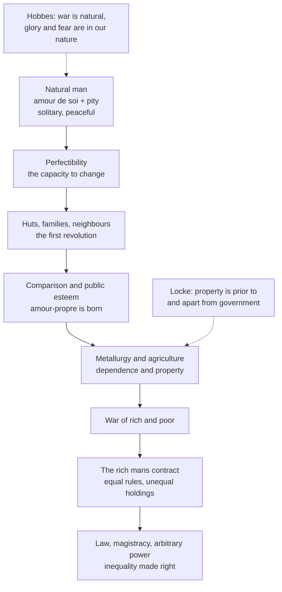

# History of Political Thought · Lesson 4.3: Rousseau I: the *Discourse on Inequality*

> ⏱ ~15 min · Module 4: Consent, property and the general will · Builds on: [4.1 Locke I: against Filmer, and the origin of property](04-01-locke-against-filmer-and-property.md), [3.3 Hobbes I: matter, motion and the state of nature](03-03-hobbes-matter-motion-and-the-state-of-nature.md) · Unlocks: [4.4 Rousseau II: the *Social Contract*](04-04-rousseau-the-social-contract.md)

## Why this matters

Hobbes and Locke both started from a state of nature and both built a government on top of it. Rousseau's *Discourse on the Origin of Inequality* (1755) says they never reached the starting point: they described Parisians and called them savages. His replacement story is the first great account of inequality as something *made*, by comparison, dependence and property, and then locked in by law. Every later argument that social status corrupts, that markets manufacture wants, or that formally equal rules can entrench privilege draws on this book, usually without naming it.

## The idea

In 1753 the Academy of Dijon set an essay question: what is the origin of inequality among men, and is it authorised by natural law? Rousseau split the question. There is *natural or physical* inequality (age, strength, health, wit), and there is *moral or political* inequality, the privileges of being richer, more honoured or obeyed, which rests on convention. The first needs no explanation. The second is the puzzle: how did differences in strength become differences in right?

His method is subtraction. Take a modern person and strip away everything that society could have added: language, reflection, property, the wish to be admired. What is left is a solitary animal with two drives. *Amour de soi* is the plain care for one's own preservation that every animal has. *Pitié* (Cole translates it "compassion") is a pre-reflective reluctance to see another sentient creature suffer. Add one capacity animals lack, *perfectibilité*, the ability to acquire new faculties, and you have a creature that can change, and so can be corrupted.

Then he runs the film forward. This is conjectural history: Rousseau says plainly, "Let us begin then by laying facts aside, as they do not affect the question." The story is a model of how our present could have been produced from our nature, not a report of what happened on a Tuesday in the Neolithic.

The punchline: the wicked passions Hobbes found in the state of nature are real, but they are the *products* of the story, not its premises.

## Source

Rousseau, *Discourse on Inequality*, Part I preamble (Cole, public domain), on his predecessors:

> Every one of them, in short, constantly dwelling on wants, avidity, oppression, desires and pride, has transferred to the state of nature ideas which were acquired in society; so that, in speaking of the savage, they described the social man.

The sentence is a charge of *method*, not of fact. The list names what was imported ("wants, avidity, oppression, desires and pride"), and the key verb is "transferred": the fault is carrying social ideas backwards. Rousseau names no one in this sentence; the surrounding lines are usually read as aimed at the natural-law jurists, at Locke's natural right to property and at Hobbes, whom he names and attacks a few pages later.

## The argument

**Part I: natural man.**

1. **The state of nature must contain only what does not presuppose society.** *In words:* anything that needs language, comparison or ongoing contact with others is not natural, however universal it looks now.
2. **Natural man is solitary, with few needs, easily met.** No fixed home, no lasting family, no language beyond cries. *In words:* someone who needs no one has nothing to fight anyone over for long.
3. **His motives are *amour de soi* and *pitié*.** Pity moderates self-preservation: he will not hurt another if he can look after himself some other way. *In words:* nature supplies a brake before reason, law or virtue exist.
4. **So the state of nature is peaceful, and Hobbes erred by importing social passions into it.** Hobbes, says Rousseau, counted among self-preservation many passions that are the work of society. *In words:* the war of all against all is a description of us, not of our origin.
5. **Man alone is perfectible.** *In words:* the capacity that lets us develop reason is the same one that lets us develop vice; Rousseau calls it nearly limitless, and the possible source of all our misfortunes.

**Part II: the conjectural history.**

6. **Small advances produce settled life.** Tools, huts and families form what Rousseau calls a first revolution; neighbours and languages follow. *In words:* proximity is where the trouble starts.
7. **Proximity breeds comparison, and comparison breeds *amour-propre*.** Gathered before their huts round a tree to sing and dance, each wants to be esteemed as the best; vanity and contempt appear on one side, shame and envy on the other. *In words:* once your worth depends on others' opinion, you need them, and you resent them.
8. **Metallurgy and agriculture create mutual dependence and property.** Iron needs smiths, smiths need farmers, land worked from season to season becomes owned. Natural differences in talent now compound into differences of wealth. *In words:* division of labour turns small natural inequalities into large conventional ones.
9. **Property without law produces a war of rich and poor.** The rich hold what they have with no title but force, and know it. *In words:* this, not the original condition, is Hobbes's state of war.
10. **The rich propose a contract.** Equal rules of justice and peace for everyone, and a supreme power to enforce them. Rousseau's verdict is that this founding of society and law "bound new fetters on the poor, and gave new powers to the rich." *In words:* the first social contract was a fraud with equal-looking terms.
11. **Inequality then passes through three stages:** property and law (rich and poor), magistracy (powerful and weak), and arbitrary power (master and slave). *In words:* each institution authorises a harder form of the inequality before it.

∴ **C.** Moral inequality has almost no basis in nature; it grows from the development of our faculties and becomes fixed and legitimate through property and law. Where it is out of proportion to physical inequality, Rousseau concludes, it conflicts with natural right.

## Argument map

The dashed edges mark where the two predecessors deny a link: Hobbes denies that natural man is peaceful; Locke denies that property is a stage in a story of corruption. The Locke side of that quarrel is Module 4's boss problem.

## Worked examples

**Example 1 (clean: sorting the two self-loves).** Rousseau's own note separates them (Cole renders *amour de soi* "self-respect" and *amour-propre* "egoism"). *Amour de soi* is absolute: it measures how I am doing against my needs. *Amour-propre* is relative: it measures how I am doing against *you*, and it only exists in society.

Run the test on three cases. A hiker eats because she is hungry: *amour de soi*, satisfiable, since once fed she stops. A salesman needs to be top of the quarterly board, and being second in a strong year ruins it: *amour-propre*, because the satisfaction is defined by rank, so it cannot be had by everyone, and it rises with others' success. A craftsman takes care over a chair no one will see: on Rousseau's terms closer to *amour de soi*, since no audience enters the motive. The diagnostic question is always the same: *does the satisfaction depend on a comparison?* If yes, it is social, and it is where Part II says inequality gets its fuel: a good that is relative cannot be shared equally.

**Example 2 (hard: the happiest epoch).** The story strains in one place. After the dancing round the tree, *amour-propre* already exists, yet Rousseau calls this period of nascent society, between primitive indolence and our restless egoism, the happiest and most stable epoch humanity knew, left only by some fatal accident. If comparison is the root of vice, how can an age full of it be the best?

Rousseau's text gives two answers. First, pity is weakened but still active, and men are not yet dependent on each other's *labour*: the damage is done by metallurgy and agriculture, when one man needs another to live. So the decisive corruption is dependence plus property, not comparison by itself. Second, *amour-propre* here is still rough and limited: consideration is claimed by everyone and insults are avenged, but no one yet owns what another needs.

That opens a reading defended by Frederick Neuhouser (*Rousseau's Theodicy of Self-Love*, 2008): *amour-propre* is not evil as such but can take healthy or inflamed forms, depending on the institutions that channel it. If so, the problem of the *Discourse* is not "how do we get back to the forest" but "what arrangement would let people who need esteem and each other remain free." That is exactly the question the [*Social Contract*](04-04-rousseau-the-social-contract.md) sets out to answer. Other readers take the darker line: that *amour-propre* is inherently inflammatory and the *Social Contract* can only contain it. The text of the *Discourse* alone does not settle between them.

## Watch out

- **You might think Rousseau praised the "noble savage."** The phrase is not his, and his natural man is not noble. He is pre-moral: good only in the sense that he is not wicked, lacking any idea of justice, *meum* or *tuum*. Reading romantic primitivism back into the *Discourse* is an anachronism shaped by its later reputation.
- **You might think the conjectural history is bad anthropology.** Rousseau offers it as conditional and hypothetical reasoning, likened to physicists' conjectures about the formation of the world, and says it is not to be taken as historical truth. Hobbes, too, conceded his state of nature was never general over the world. Criticise it as a model, not as a chronicle.
- **Cole's vocabulary inverts modern English.** His "self-respect" (*amour de soi*) is the innocent drive; his "egoism" (*amour-propre*) is the comparative, esteem-seeking one. A modern reader hears "self-respect" as a matter of standing, which is *amour-propre*. Read through to the French.
- **You might think Rousseau calls all law and property illegitimate.** His conclusion is narrower: the actual first contract entrenched usurpation, and inequality not proportioned to natural inequality conflicts with natural right. He goes on to design legitimate law in 4.4.

## One-liner

> Hobbes's savage was a social man in disguise: our quarrelsome passions come from comparison, dependence and property, and the first contract made that inequality law.

## Problems

**P1 (🟢) *(Exegetical.)*** The rich man's proposal, *Discourse*, Part II (Cole):

> "Let us join … to guard the weak from oppression … and secure to every man the possession of what belongs to him: let us institute rules of justice and peace, to which all without exception may be obliged to conform."

Every clause sounds impartial, and Rousseau still calls the scheme a fraud. Where, according to the passage and its setting in Part II, does the fraud lie? Point to the words that decide it. 120 words or fewer.

**P2 (🟡) *(Exegetical (a) · Evaluative (b).)*** Hobbes (*Leviathan* ch. 13) and Rousseau agree that before government there is no law, no property and no justice. Hobbes concludes that the condition is war; Rousseau, that it is peace. (a) Name the single premise about human passions that one must affirm and the other deny, and say what kind of consideration Rousseau uses to support his side. (b) Both writers admit their state of nature is not a historical record. Can one hypothetical model refute another, or do they merely talk past each other? 150 words or fewer for (b).

**P3 (🔴, optional) *(Exegetical.)*** An invented op-ed:

> "Our grandparents compared themselves with a dozen neighbours. Our children compare themselves with ten million strangers, ranked by likes. No wonder they are anxious: a need for approval that can never be met is built into the product. Delete the apps and children will rediscover who they really are."

Which concept from the *Discourse* is the op-ed borrowing, what does it drop from Rousseau's account of where that concept comes from, and would Rousseau accept the cure? 150 words or fewer.

Solutions

**P1** *(Exegetical — strict.)*

**Must hit, strict:**
- The fraud is **not** in unequal terms: the rules really do bind "all without exception," and the rich man is not planning to exempt himself.
- It lies in "secure to every man the possession of what belongs to him." Spoken when holdings are already very unequal, and when (the preceding paragraph) the rich have no valid title beyond force, equal protection of existing possession turns de facto holdings into right. The poor, who possess little, gain little from having it secured.
- The setting confirms the motive: the plan was to make allies of the rich man's adversaries, turning their force to his defence. Rousseau's verdict is that the institutions bound new fetters on the poor.

**Wrong turns:** reading the fraud as a secret double standard (the rules are genuinely equal; that is the point); concluding Rousseau rejects rules of justice as such (4.4 builds legitimate law).

**Model answer:** Nothing in the terms is rigged: the rules bind all without exception. The trick is in "what belongs to him." The proposal freezes the current distribution, which the rich hold by force without valid title, and makes it a right that the whole community must defend. Formal equality applied to unequal holdings protects the rich most. Part II says the scheme was designed to enlist the rich man's attackers as his defenders, so the poor ran into their chains hoping to secure their liberty.

---

**P2** *(Exegetical (a) · Evaluative (b).)*

**Must hit, strict (a):**
- The crux: *whether the conflict-producing passions, above all the desire for glory or esteem and the fear of others, belong to human nature before society, or are produced by social life.* Hobbes affirms (glory is one of his three causes of quarrel); Rousseau denies (esteem-seeking is *amour-propre*, born of comparison).
- Rousseau's support: a method of subtraction plus a consistency argument (nothing presupposing society may enter the state of nature; Hobbes's bad man as a robust child would have to be both strong and dependent, a contradiction), with pity and observations of animals as supporting evidence.

**Must hit, any verdict (b):**
- State that both are models: Hobbes infers his from passions visible now, Rousseau builds his by subtraction.
- Name at least one standard a model can fail by: internal consistency, what it must assume, how well it explains present facts.
- A verdict, with the standard that decides it.

**Wrong turns:** naming "whether people are good or evil" (both deny natural man has moral ideas); naming the absence of government (both agree).

**Model answer (b), one of several acceptable:** They can engage, because a hypothetical model still makes claims that can fail. Hobbes's state of nature is built from passions observed in men now, glory among them. Rousseau's charge is that this assumes what should be explained: if glory needs an audience, Hobbes put a product of society into his premise. That is an internal criticism, and it works against a model as well as a history. Hobbes's reply is that his aim is to show what people as they are would do without a common power, which is what matters for obedience. So the two models answer different questions: origins versus present incentives. Verdict: Rousseau refutes Hobbes's claim to describe *nature*, but not his claim about people as they now are. That leaves Hobbes's case for the sovereign intact.

---

**P3** *(Exegetical — strict.)*

**Must hit, strict:**
- The concept: ***amour-propre***, a relative self-love whose satisfaction depends on others' esteem and on comparison, which cannot be satisfied for everyone. Social man, Rousseau says near the end of Part II, lives outside himself, in the opinion of others: that is the op-ed's anxiety.
- What it drops: for Rousseau *amour-propre* is produced by social life itself (proximity, comparison, public esteem at the dance), then inflamed by dependence and property. The op-ed blames one technology and treats grandparents' dozen neighbours as the unspoiled condition, but for Rousseau the village dance was already its birthplace.
- The cure: Rousseau would reject "delete the apps and rediscover who you really are." There is no return to a pre-social self; the remedy he looks for is political, reshaping dependence through legitimate institutions (4.4).

**Wrong turns:** naming *amour de soi* (the need for likes is comparative); treating Rousseau as recommending withdrawal to nature.

**Model answer:** The op-ed borrows *amour-propre*: self-worth measured by others' esteem, a need that cannot be satisfied because rank is relative. It drops Rousseau's account of its source. For him *amour-propre* is not created by a product; it is born wherever people live together and compare, as at the dance before the huts, and becomes destructive through dependence and property. Grandparents comparing themselves with neighbours were already in its grip. So Rousseau would not accept the cure: deleting an app does not return anyone to a self prior to opinion, since there is no such social self to rediscover. His remedy is institutional, a political order that changes how people depend on each other.

## Flashback

**From Lesson 4.1 (Locke I: against Filmer, and the origin of property):** *(Exegetical.)* Apply to a hard case. In 1685 a villager fences off an acre of his parish common, ploughs it, and harvests far more than it ever yielded as rough pasture. He cites *Second Treatise* §32: as much land as a man tills and can use the product of is his, and he needs no consent of "all his fellow-commoners, all mankind." But in §35 Locke says of land common in England, where many people live under government with money and commerce:

> no one can inclose or appropriate any part, without the consent of all his fellow-commoners; because this is left common by compact

(a) Give the two reasons §35 offers for denying the villager title. (b) A critic says §35 contradicts §32, since both concern enclosing a common without the commoners' consent. Name the distinction that removes the contradiction, and say why the villager's bigger harvest does not rescue his claim. Three sentences or fewer per part.

Solution

**Must hit, strict (a):**
- *Compact:* this land is common by agreement, that is, by the law of the land, which is not to be violated. It is the joint property of this parish or country, not a share of the original common of mankind, so it already has owners, and taking it without their consent takes what is theirs.
- *"Enough and as good" fails:* what is left after the enclosure would not be as good for the other commoners as the whole was when all of them could use it. In the first peopling of the world, by contrast, an enclosure left others no worse off (§33).

**Must hit, strict (b):**
- The distinction is between two kinds of common. In §32 the "fellow-commoners" are *all mankind*, sharing God's original grant, and requiring their consent would mean starving (§28). In §35 the commoners are a particular body of co-owners whose rights were made by compact under government. Labour gives title against the first kind of common, not against the second.
- The harvest does not help, because the productivity argument (§37: enclosed and cultivated land adds to the common stock) shows that appropriating *unowned* land benefits mankind. It does not turn a trespass on land others already jointly own into a title.

**Wrong turns:** citing spoilage, when the villager uses what he grows; concluding that labour never gives title once government exists (§35 is about land already held in common by compact, not about everything); treating the rival claims as settled by which use is more productive.

**Model answer:** (a) First, the parish common is common by compact, the law of the land: it is the joint property of those parishioners, not the unowned common of mankind, so it cannot be taken without their consent. Second, the rest of the common would no longer be as good for the other commoners as the whole was, so the "enough and as good" condition fails. (b) The two sections concern different commons. §32 denies that appropriating God's gift to mankind needs the consent of all mankind; §35 concerns land already owned jointly by a particular body under law, where the consent needed is that of co-owners. The larger harvest shows that improvement adds to the common stock, which is Locke's defence of taking unowned land, but improving what others already own does not make it yours.

## Connections

- **Backward:** Rousseau's Part I is aimed at [3.3](03-03-hobbes-matter-motion-and-the-state-of-nature.md)'s three causes of quarrel, and he cites Locke's maxim that there can be no injury where there is no property. The labour theory and provisos of [4.1](04-01-locke-against-filmer-and-property.md) are the rival story of property; the boss problem sets the two side by side.
- **Forward:** [4.4](04-04-rousseau-the-social-contract.md) answers this lesson's problem: if dependence is unavoidable, make everyone depend on laws they give themselves. [5.4](05-04-wollstonecraft-rights-virtue-and-education.md) turns Rousseau's account of corrupted dependence against his own treatment of women, and [6.5](06-05-marx-from-hegel-to-historical-materialism.md) inherits the idea of property and division of labour as engines of history.
- **Sideways:** the Part II deer hunt, in which each hunter abandons his post to catch a passing hare, is usually cited as the origin of the *stag hunt*, the coordination game in [`game-theory-refresher` 1.2](../../game-theory-refresher/lessons/01-02-nash-equilibrium.md). Whether inequality is unjust as such is an analytic question for [`political-philosophy`](../../political-philosophy/syllabus.md); status competition and recognition as social facts belong to [`social-theory`](../../social-theory/syllabus.md).
