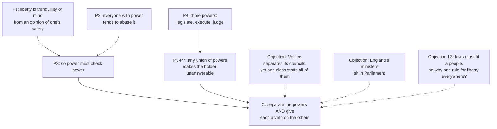

# History of Political Thought · Lesson 5.1: Montesquieu: the spirit of the laws

> ⏱ ~15 min · Module 5: The age of revolutions · Builds on: [4.2 Locke II: limited government, revolution and toleration](04-02-locke-limited-government-and-toleration.md), [1.4 Aristotle: constitutions, citizens and the polity](01-04-aristotle-constitutions-citizens-and-the-polity.md) · Unlocks: [5.2 *The Federalist*: faction and the extended republic](05-02-the-federalist-faction-and-the-extended-republic.md)

## Why this matters

When Madison defends the divided powers of the new American Constitution in *Federalist* 47, the authority he has to square himself with is a French judge-aristocrat: on this subject, he says, Montesquieu is the oracle everyone consults. *The Spirit of the Laws* (1748) handed the eighteenth century two ideas that pull against each other. One sounds universal: wherever the power to make laws and the power to execute them sit in the same hands, liberty is gone. The other is relativist: laws are good only relative to a particular people, with its climate, religion, trade and manners. The Federalists took the first; their opponents quoted the second. Reading Montesquieu means holding both.

## The idea

Hobbes and Locke asked what makes political authority *legitimate*. Montesquieu asks a naturalist's question instead: **why do the laws of different peoples differ, and what makes a given set of them hang together?**

He opens with law in its widest sense: laws are the necessary relations arising from the nature of things (I.1), in physics and in nations alike. The *spirit* of a nation's laws is the web of relations they bear to everything around them: the form of government, the climate and soil, whether the people are farmers, herders or traders, their religion, wealth, numbers and customs (I.3). Hence his warning that laws made for one nation will seldom suit another.

**The three governments.** Montesquieu discards Aristotle's six regimes ([1.4](01-04-aristotle-constitutions-citizens-and-the-polity.md)) for three. Each has a **nature**, the structure that constitutes it, and a **principle**, the human passion that makes it move (III.1).

| Government | Nature (who rules, how) | Principle (the spring) | Corrupted when… (Book VIII) |
|---|---|---|---|
| **Republic**: democracy or aristocracy | The whole people, or a part of it, holds supreme power | **Virtue**: love of country, which is love of equality; in an aristocracy, **moderation** among the nobles | The spirit of equality is lost, or pushed to the extreme where no one will obey a magistrate |
| **Monarchy** | One person rules by fixed, established laws, through intermediate powers (nobility, clergy, the law courts) | **Honour**: ambition for rank and distinction | The prince strips the orders and cities of their privileges |
| **Despotism** | One person rules by his own will and caprice | **Fear** | Its principle is corrupt by nature |

Two things are new. Rule by law versus rule by will matters more than the number of rulers, so democracy and aristocracy become two kinds of one thing. And despotism is no longer a monarchy gone bad (Aristotle's tyranny) but a species of its own, which Montesquieu, looking at Persia and the Ottomans, took to be the ordinary condition of much of the world.

**Climate and commerce.** Books XIV–XVII tie laws to climate: heat, he argues, makes people languid, cold makes them vigorous. It is less crude than its reputation: good legislators work *against* the vices of the climate and bad ones indulge them (XIV.5). By Book XIX climate is one of seven causes, with religion, laws, maxims of government, precedent, morals and customs, that form a nation's *general spirit* (XIX.4). Book XX adds the thesis later called ***doux commerce***: commerce softens manners and cures destructive prejudices (XX.1), and peace is the natural effect of trade, since nations that trade become dependent on each other (XX.2). In the next breath he gives the cost: among *individuals*, the commercial spirit turns humane acts into things done for money.

**Liberty.** Political liberty is not doing whatever you like. It is the right to do whatever the laws permit (XI.3), and it is found only in moderate governments, and only there when power is not abused (XI.4). One nation, he says, has political liberty as the direct end of its constitution: England (XI.5). Chapter 6 takes that constitution apart.

## Source

Montesquieu, *The Spirit of Laws* XI.6, "Of the Constitution of England" (Nugent's translation, public domain). He has just set out three powers: the legislative; the executive in matters of the law of nations (war, embassies, defence); and the power of judging crimes and private disputes, which he calls the judiciary.

> The political liberty of the subject is a tranquillity of mind arising from the opinion each person has of his safety.

> When the legislative and executive powers are united in the same person, or in the same body of magistrates, there can be no liberty

The first sentence defines liberty not as participation, self-government or a list of rights but as a *state of mind*: the settled belief that you are safe. So the test of a constitution is whether one citizen needs to fear another. In the second sentence, look at "or in the same body." The danger is not only a single tyrant. A senate that both makes and executes the laws is just as fatal, which is why Montesquieu goes on to condemn the Italian republics as well as the Turkish sultan.

## The argument

**Why liberty requires separated powers (XI.4, XI.6).**

1. **Political liberty is a tranquillity of mind arising from each person's opinion of his own safety.** *In words:* you are free when you have no reason to fear what the government, or anyone using it, will do to you.
2. **Constant experience shows that "every man invested with power is apt to abuse it"** and will push his authority as far as it goes (XI.4). *In words:* no ruler can be trusted to limit himself, virtuous ones included.
3. **So abuse can be prevented only if, by the arrangement of things, power checks power** (XI.4). *In words:* liberty depends on institutional design, not on the character of whoever holds office.
4. **There are three kinds of power: making law, executing it, and judging under it.** *In words:* any government does these three things, whatever it calls them.
5. **If one person or body holds both legislative and executive power, it can make tyrannical laws and then execute them tyrannically.** *In words:* the author of a rule who also enforces it answers to no one.
6. **If the power of judging is joined to the legislative, the judge becomes the legislator and life and liberty lie open to arbitrary control; joined to the executive, the judge can act with violence and oppression.** *In words:* a court is only a protection if it is not a tool of the people it would judge.
7. **Where one person or body holds all three, as in the sultan's Turkey, there is an end of everything.** *In words:* full concentration is despotism, whatever its name.
8. **∴ Liberty requires that the three powers sit in different hands, *and* that the hands be able to stop one another.** In England the two chambers check each other by each being able to reject what the other passes, the executive can reject legislation, and the legislature can inquire into how its laws are executed. *In words:* separating the powers is not enough. Each must also have a veto on the others, so that the three can move only together.

Two points about premise 8 are easy to miss. First, the judiciary barely counts in the balancing: of the three powers, Montesquieu calls it close to nothing, because judging is to be done by temporary tribunals drawn from the people, and judges are to be no more than the voice of the law. Second, the checks run through **social orders**. There is a hereditary monarch, a chamber of nobles, who with one vote each would be outvoted into servitude, and a chamber of the people's representatives. This is the old mixed constitution ([1.2](01-02-plato-against-democracy-and-the-second-best-city.md), [2.1](02-01-cicero-the-commonwealth-and-natural-law.md)) rebuilt as a machine for making people feel safe.

## Argument map

## Worked examples

**Example 1 (clean): running the argument on England as Montesquieu describes it.** The legislative power belongs to two bodies: hereditary nobles, and representatives elected by district. Each can reject what the other passes, so neither can legislate alone (premise 8). The executive belongs to a monarch, because execution needs speed and one person acts faster than many. He shares in legislation only by *rejecting*, never *resolving*, so premise 5's danger does not arise. The legislature cannot judge the monarch's person, but it can examine and punish his ministers. Criminal trials go to juries of the accused's peers, drawn for a term and then dissolved, so no standing body holds the power to punish (premise 6). Run the test, *does any citizen have reason to fear another?*, and each power's route to unanswerable action is blocked by another. A caution later readers skip: he describes what English *law* establishes, and says it is not his business whether the English actually enjoy that liberty (XI.6).

**Example 2 (hard): the minister in Parliament.** If there were no monarch and the executive were given to persons taken from the legislature, he says, liberty would end, because the same people would hold, or always be able to hold, both powers (XI.6). That describes **parliamentary government**, where the cabinet is drawn from the legislature and survives only while it keeps the legislature's confidence. Britain was already moving that way, with Walpole leading the ministry from the Commons from the 1720s. Three readings each have serious defenders:

- **Strict reading.** Montesquieu meant separated *personnel*, and on his theory parliamentary systems carry exactly the danger he named. Whether they are free in fact is a separate question, one he explicitly set aside for England.
- **Checks reading.** The point was never to keep the powers apart in watertight boxes but to stop any one body from *acting alone*. Madison argues in *Federalist* 47 that Montesquieu cannot have meant the departments should have no share in one another's work, since the English constitution he praised blends them. On this reading, a parliamentary system passes if it keeps other brakes: a second chamber, courts, elections, an opposition.
- **Historical reading.** Montesquieu fitted England to his theory more than he observed it. The chapter is an ideal model of liberty in English dress.

The crux between the first two readings is which half of premise 8 carries the weight: separate hands, or mutual vetoes. Whether parliamentary or presidential design better protects liberty is a question for [`political-institutions`](../../political-institutions/syllabus.md) and [`political-philosophy`](../../political-philosophy/syllabus.md), not for this lesson.

## Watch out

- **Anachronism: "separation of powers" is not the American three co-equal branches.** Montesquieu's judiciary is a rotating tribunal, close to negligible as a power, with no judicial review. His checks work through hereditary orders, a king and a nobility, that the Americans did not have. [5.2](05-02-the-federalist-faction-and-the-extended-republic.md) shows how Madison rebuilt the machine without them.
- **"Virtue" in a republic is not moral or Christian virtue.** In the advertisement prefixed to later editions, Montesquieu says he means a *political* virtue, love of country and of equality. Honour, likewise, is not integrity but the wish to be distinguished.
- **The principles are claims about what each government *requires*, not reports of what it has.** He says outright that he is not claiming every republic is virtuous, only that it ought to be, or it is imperfect (III.11). "The French monarchy had no honour" is not a counterexample to Book III.
- **Montesquieu is not a climate determinist.** Climate is one cause of the general spirit among seven, the others weaken as one grows stronger (XIX.4), and legislators are praised for resisting it (XIV.5). The relativity is about *fit*, not fatalism.

## One-liner

> Montesquieu asks what makes a people's laws fit together, and finds liberty in only one kind of fit: powers set against powers, so that no one needs to fear anyone.

## Problems

**P1 (🟢)** *(Exegetical.)* Classify each invented government by Montesquieu's **nature** and **principle**, one line each. For (d), also say what Book VIII says is happening.
(a) An island of 30,000 where citizens meet in assembly to pass laws, most offices are filled by lot, and a law caps the size of any estate.
(b) A trading city where 200 hereditary families form the only council with supreme power, and elect their magistrates from among themselves.
(c) A ruler who governs through one favourite minister, whose decrees change with his moods, and whose governors execute without trial.
(d) A hereditary king who rules by published codes through landed nobles and chartered law courts, and who, over twenty years, abolishes the courts' right to register edicts and the towns' charters.

**P2 (🟡)** *(Exegetical (a) · Evaluative (b).)* In XI.6 Montesquieu admits that Venice gives its legislative, executive and judicial powers to three different councils. He goes on (Nugent):

> But the mischief is, that these different tribunals are composed of magistrates all belonging to the same body; which constitutes almost one and the same power.

(a) Does Venice satisfy Montesquieu's condition for liberty? Which words decide it, and what do they show that "separation" has to mean for him? Three sentences or fewer.
(b) Apply the Venice test to a modern state where one disciplined party wins both the legislature and the presidency. Is the party a "body" in Montesquieu's sense? Any verdict, 150 words or fewer.

**P3 (🔴, optional)** *(Exegetical (a) · Evaluative (b).)* An invented op-ed: *"The new republic of Varenna should adopt the proven formula of liberty: three separate branches, just as every free people has. Liberty is the same everywhere. And it should throw open its ports, because trade makes nations peaceful and citizens gentle."*
(a) Name the two ideas from *The Spirit of the Laws* the op-ed borrows, with book, and say what it has dropped from each. 100 words or fewer.
(b) Is "liberty is the same everywhere" a betrayal of Montesquieu's relativism (I.3), or does XI.6 license it? Any verdict, 150 words or fewer.

Solutions

**P1** *(Exegetical.)*

**Must hit, strict:** (a) republic, specifically democracy, since the whole people holds supreme power; principle **virtue** (love of equality), which the estate cap is there to protect. (b) republic, specifically **aristocracy**, since a *part* of the people holds supreme power; principle **moderation**. (c) **despotism**: one person, rule by will and caprice (the vizier-style favourite is Montesquieu's own detail of despotism); principle **fear**. (d) **monarchy** by nature (one ruler, fixed laws, intermediate powers); principle **honour**; what is happening is the **corruption of monarchy's principle**: the prince is stripping orders and cities of their privileges, the drift toward despotism that Book VIII describes.

**Wrong turns:** calling (b) an oligarchy or a monarchy-of-many. For Montesquieu an aristocracy is a *kind of republic*, and oligarchy is its corruption. Calling (d) despotism already: it still rules by fixed laws, and what is being described is a corruption under way, not a change of nature.

**Model answer:** (a) Democratic republic; virtue, meaning love of equality, which the estate cap protects. (b) Aristocratic republic; moderation among the nobles. (c) Despotism; fear. (d) A monarchy whose principle is being corrupted: by abolishing the courts' and towns' privileges, the king removes the intermediate powers that make monarchy different from despotism.

**P2** *(Exegetical (a) · Evaluative (b).)*

**Must hit, strict (a):** No. The deciding words are "all belonging to the same body" and "almost one and the same power." Separation is about **who staffs** the institutions and whose interest they share, not about how many institutions there are. Three councils drawn from one hereditary class have one will. This matches "or in the same body of magistrates" in the no-liberty sentence.

**Must hit, any verdict (b):** state the Venice criterion precisely: formally distinct institutions fail if one body with a common interest staffs them all. Name at least one feature that makes a party **like** that body (shared interest, discipline, members in both branches) and at least one that makes it **unlike** (it is not hereditary, it can lose the next election, a rival party exists, its members answer to different electorates). Reach a verdict that follows from the features weighed.

**Wrong turns:** answering (a) "yes, because the powers are in three councils," which is the reading the "mischief" sentence exists to reject. In (b), assuming Montesquieu's text settles modern party government directly, when the application is the evaluative step.

**Model answer (b), one of several:** Venice fails because one hereditary class staffs every council, so the councils share a single will. A disciplined party that holds both branches meets part of that description: its members in each branch pursue one programme and answer to one leadership, so the veto each branch holds over the other may never be used. But Montesquieu's body was permanent. A party can be voted out, faces an opposition that watches it, and its legislators answer to their own districts. His underlying test is whether a citizen has reason to fear. The fear the Venetian case warns of, a power that can never lose, is weaker when the unity lasts only until the next election. So the party is a *temporary* body: a real risk while it holds both branches, but not Venice.

**P3** *(Exegetical (a) · Evaluative (b).)*

**Must hit, strict (a):** (1) Separation of powers, **XI.6**. Dropped: Montesquieu's checks (each power's veto on the others), and his claim that liberty is the *direct end* of only one constitution (XI.5), not a formula every free people shares. "Branches" is also an anachronism for his three powers. (2) *Doux commerce*, **XX.1–2**. Dropped: trade unites **nations** but not individuals the same way, since among individuals it turns humane acts into things done for money. So "citizens gentle" is only half his claim.

**Must hit, any verdict (b):** name the tension. I.3 says laws must fit a particular people and rarely transfer. XI.6 states conditions without which there "can be no liberty" in any government. Give one reading on which the two are consistent or one on which they clash, and draw the consequence for Varenna.

**Wrong turns:** (a) "Montesquieu was a climate determinist, so he would reject any constitution for Varenna," which overstates the relativity (XIV.5, XIX.4). (b) Treating the tension as settled by quoting either chapter alone.

**Model answer (b), one of several:** The two claims can be reconciled. The relativity of I.3 is about which *ends* and which laws suit a people. XI.5 says states pursue different ends, Rome expansion and Marseilles commerce, and only England makes liberty the direct end. XI.6 is conditional: *if* liberty is your end, the powers must be divided and able to check each other, whoever you are. So Varenna may adopt the conditions of liberty, but it must still ask whether its general spirit will support them: its orders, its customs, whether it is one of the moderate governments where liberty is possible. The op-ed's error is not the separation itself but "the same everywhere" as a reason. Montesquieu gives a necessary condition, not a formula that works regardless of the people.

## Flashback

**From Lesson 4.3 (Rousseau I: the *Discourse on Inequality*):** *(Exegetical.)* Close reading and application. In Part I (Cole), Rousseau says that compassion,

> instead of inculcating that sublime maxim of rational justice, *Do to others as you would have them do unto you,* inspires all men with that other maxim of natural goodness, much less perfect indeed, but perhaps more useful; *Do good to yourself with as little evil as possible to others.*

(a) Which reading do the words support? **(i)** Natural man already lives by a rough form of the golden rule, so the state of nature has a morality of reciprocity. **(ii)** Pity is not a rule of justice at all but a feeling that brakes self-preservation, leaving self first. Name the deciding words. (b) A strong forager can either climb for fruit himself or snatch the fruit a feeble old man has gathered; later, in a lean season, the old man's fruit is the only food there is. Say what the second maxim directs in each case, where the golden rule would direct otherwise, and what the gap shows about why Rousseau calls natural man good but not just. Three sentences or fewer per part.

Solution

**Must hit, strict (a):** reading (ii). The contrast "rational justice" / "natural goodness" puts the golden rule on the side of reason, which natural man lacks; "instead of inculcating" versus "inspires" contrasts a rule taught with a feeling that moves. The second maxim's order decides it: "Do good to yourself" comes first, and others enter only as a limit, "as little evil as possible," which is a brake on *amour de soi*, not a duty of reciprocity. "Much less perfect" concedes it is not justice.

**Must hit, strict (b):**
- First case: the maxim directs him to climb, since he can do himself good with no evil to the old man; pity stops the snatch when another way exists.
- Lean season: the maxim permits taking the fruit, doing no more harm than survival needs; the golden rule forbids it, since he would not want his only food taken.
- The gap: pity restrains harm without any idea of what is *owed*, of equal standing or of *meum* and *tuum*, so natural man is good in not being cruel but has no conception of justice; justice arrives only with reason and society.

**Wrong turns:** (a) choosing (i) because both maxims mention others, or because "sublime" is read as Rousseau's endorsement of natural man's morality; the sublime maxim is exactly the one natural man does *not* have. (b) Saying pity forbids the lean-season taking: self-preservation still comes first. Calling natural man unjust: he is pre-moral, neither just nor unjust.

**Model answer:** (a) Reading (ii). The golden rule is a maxim of "rational justice," which compassion replaces "instead of inculcating" it; what compassion "inspires" is a maxim that starts with "Do good to yourself" and treats others only as a limit, "as little evil as possible." Rousseau calls it "much less perfect": a check on self-love, not reciprocity. (b) When the forager can climb, the maxim sends him up the tree, because pity stops harm he does not need to do. In the lean season it lets him take the fruit, harming no more than he must, where the golden rule would forbid what he would not want done to himself. So natural man is good only in lacking the wish to hurt; with no idea of what anyone is owed, he is not yet capable of justice.

## Connections

- **Backward:** Locke ([4.2](04-02-locke-limited-government-and-toleration.md)) already split legislative, executive and "federative" power (*Second Treatise* ch. XII), and Montesquieu's first two executive powers map onto Locke's executive and federative. The difference is that Locke keeps the legislative supreme, while Montesquieu makes the powers check each other. Aristotle's classification and his mixed polity ([1.4](01-04-aristotle-constitutions-citizens-and-the-polity.md)) are what the three governments replace. Hobbes ([3.4](03-04-hobbes-the-sovereign-and-the-church.md)) held that divided sovereignty dissolves the commonwealth, and XI.6 is the direct counter-thesis.
- **Forward:** [5.2](05-02-the-federalist-faction-and-the-extended-republic.md) reads *Federalist* 47 and 51 against this lesson: Madison's checks reading of XI.6, and the Anti-Federalists' use of Montesquieu's claim that a republic naturally needs a small territory (VIII.16). Tocqueville ([6.2](06-02-tocqueville-equality-of-conditions.md)) is often read as Montesquieu's heir: another French aristocrat studying a nation's laws through its mores.
- **Sideways:** separated powers as working institutions belong to [`political-institutions`](../../political-institutions/syllabus.md) (parliamentary versus presidential government, Example 2's case) and to [`constitutional-law`](../../constitutional-law/syllabus.md) (the US separation-of-powers cases). Montesquieu's search for the causes behind a people's laws is a founding moment for [`social-theory`](../../social-theory/syllabus.md); Durkheim wrote his Latin thesis on him. The *doux commerce* thesis is a forerunner of the arguments about trade and peace that [`political-economy`](../../political-economy/syllabus.md) models formally.
