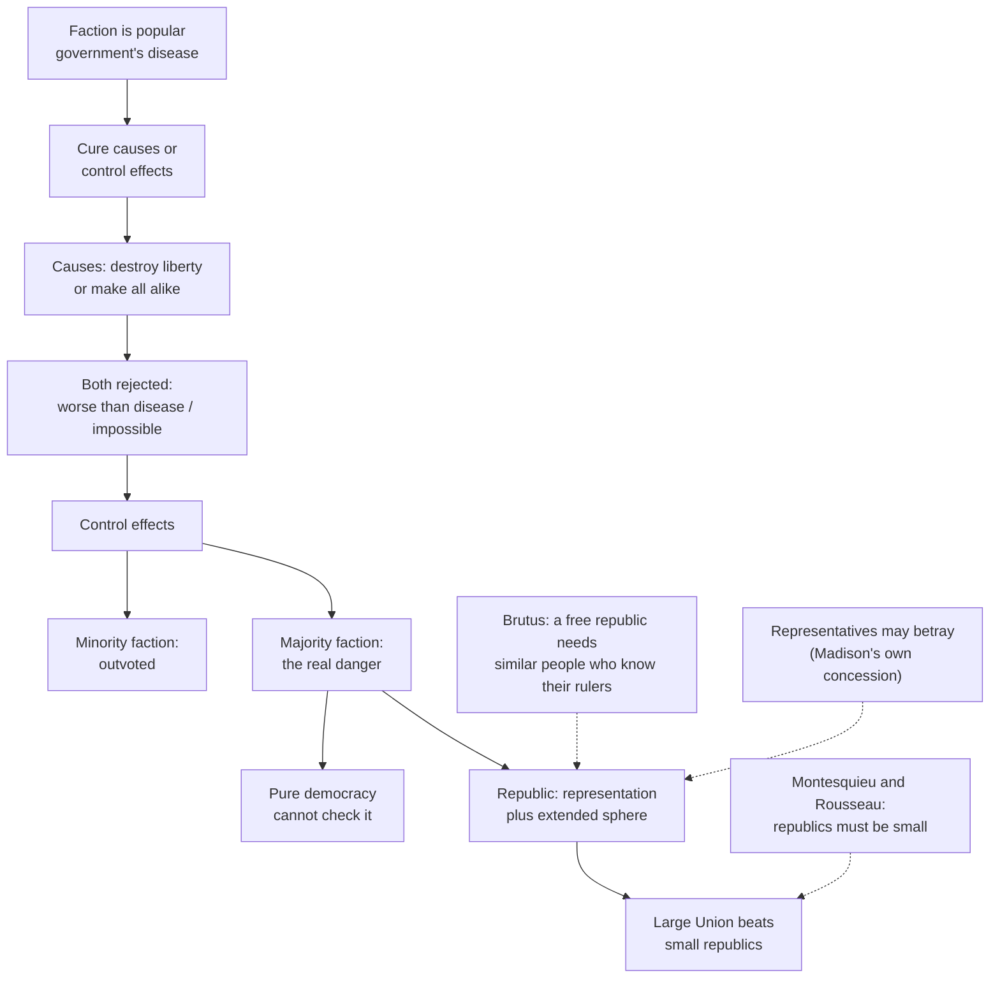

# History of Political Thought · Lesson 5.2: *The Federalist*: faction and the extended republic

> ⏱ ~15 min · Module 5: The age of revolutions · Builds on: [5.1 Montesquieu: the spirit of the laws](05-01-montesquieu-the-spirit-of-the-laws.md), [4.4 Rousseau II: the *Social Contract*](04-04-rousseau-the-social-contract.md) · Unlocks: [5.3 Burke: prescription against abstract rights](05-03-burke-prescription-against-abstract-rights.md)

## Why this matters

For two thousand years the answer to "how big can a free republic be?" was *small*. Aristotle wanted a citizen body that could know one another's characters; Montesquieu wrote that a republic by its nature has a small territory; Rousseau thought the social bond weakens as the state grows. In 1787 a newspaper writer calling himself Publius turned the answer upside down: size is not the republic's weakness but its cure. *Federalist* 10 is the argument, and it still underwrites how people defend pluralism, federalism and the value of a divided electorate.

## The idea

Start with the problem, not the solution. In the mid-1780s the American states were popular governments, and Madison thought several of them were misbehaving: legislatures passing paper-money and debtor-relief laws, rewriting contracts, changing the rules faster than anyone could plan around them. Shays' Rebellion in Massachusetts (1786–87) made the fear vivid. His diagnosis, worked out first in a private memorandum, *Vices of the Political System of the United States* (1787), was that popular government's characteristic disease is **faction**, and above all a faction that is a *majority*. Kings oppress from above; a republic's special danger is that the many oppress the few through perfectly regular votes.

The classical cure was virtue and sameness: keep the republic small, its citizens alike and public-spirited, and the common good stays visible. Madison's move is to deny that sameness helps. In a small, homogeneous society a majority easily shares one passion and easily finds out that it does. In a large society with many trades, regions and churches, no single interest is likely to make up a majority, and those that might are too scattered to coordinate. *Diversity does the work that virtue was supposed to do.*

A picture: one river through a narrow valley floods the town; the same volume spread across a delta with a hundred channels never rises high enough anywhere. Madison does not try to shrink the water. He changes the terrain.

*The Federalist* is 85 essays published in New York newspapers in 1787–88 under the shared pseudonym Publius, urging New York to ratify the Constitution. Most were Hamilton's, about a third Madison's, five Jay's. No. 10 (November 1787) is Madison's; so, on the prevailing attribution, is No. 51.

## Source

*Federalist* No. 10 (Madison), defining the problem. By a faction, Publius says, he understands

> a number of citizens, whether amounting to a majority or a minority of the whole, who are united and actuated by some common impulse of passion, or of interest, adverse to the rights of other citizens, or to the permanent and aggregate interests of the community.

(Some printings read "adversed.") Three things in the words matter. *Majority or minority*: size does not decide it. *Passion, or of interest*: faction can be driven by zeal as well as by gain. And *adverse to*: a group is a faction because of what its aim does to others' rights or to the long-run good of the whole, not because it is organized or partisan. By this definition a majority acting justly is not a faction at all.

## The argument

**Federalist 10, reconstructed in Madison's terms.**

1. **Faction is the mortal disease of popular government**, producing instability, injustice and confusion. *In words:* republics historically died of their own majorities, not of foreign kings.
2. **There are two cures: remove faction's causes, or control its effects.** *In words:* prevent the fire, or contain it.
3. **Causes can be removed only by destroying liberty or by giving every citizen the same opinions, passions and interests.** The first is worse than the disease; as he puts it, "Liberty is to faction what air is to fire." The second is impossible: reason is fallible, it is tied to self-love, and people's faculties for acquiring property differ, which government exists to protect. *In words:* free people with unequal talents will always divide, and the only ways to stop them are tyranny or a fantasy.
4. **So relief lies only in controlling effects.** *In words:* assume faction; design around it.
5. **A minority faction is controlled by the republican principle itself**: the majority outvotes it. *In words:* a small selfish group can obstruct but cannot rule.
6. **The real danger is a majority faction**, and against it moral and religious motives are no reliable check; they weaken exactly as the number combined grows. *In words:* do not count on the majority's conscience.
7. **A pure democracy** (a small number of citizens who assemble and govern in person) **has no cure**: a common passion easily grips a majority, and the assembly itself supplies communication and concert. *In words:* direct self-rule hands the flood its channel.
8. **A republic** (government by representation) differs in two ways: power is delegated to a chosen few, which may refine and enlarge the public views by passing them through a chosen body (or, Madison concedes, may elevate schemers who then betray the people), and it can extend over far more citizens and territory. *In words:* representation filters, and representation makes size possible.
9. **Size helps both ways.** A large republic offers more fit candidates per seat, and larger constituencies are harder to win by petty corruption. And, principally: "Extend the sphere, and you take in a greater variety of parties and interests," making a majority with a common motive to invade others' rights less likely, and harder to organize if one exists. *In words:* many factions cancel into none.
10. **∴ The large Union controls faction better than the states, as a republic does better than a democracy.** *In words:* the extended republic is a republican remedy for republican government's own characteristic diseases.

**No. 51 adds the institutional half.** Where No. 10 relies on diversity in *society*, No. 51 relies on division inside *government*: give each department the constitutional means and personal motives to resist the others, so that ambition counteracts ambition, and let the federal system divide power twice, between nation and states and then within each. It closes by restating No. 10: in so varied a republic, a majority coalition could seldom form on any principles other than justice and the general good.

## Argument map

## Worked examples

**Example 1 (clean: a paper-money law).** Madison's own list of wicked projects that faction breeds starts with a rage for paper money and for abolishing debts. Run the argument on a small state in the 1780s where debtors are a majority, as reformers alleged of Rhode Island.

- Is it a faction? A majority united by an *interest* (lighter debts) that, on Madison's view, is adverse to creditors' rights and to the long-run aggregate interest in stable contracts. Yes, by the definition's own terms.
- Minority or majority? Majority, so the republican principle offers no relief (step 5 fails, step 6 applies).
- Small sphere: debtors are numerous, local, in regular contact, and share one pressing interest. Impulse and opportunity coincide.
- Now enlarge to the Union. The same debtors are a minority among merchants, planters, creditors and farmers with different debts in different currencies; a paper-money coalition must be assembled across states that have little else in common. Such a malady, he predicts, is likelier to infect a county than a whole state, and a state than the Union.

The argument delivers a clear verdict: the national legislature is the safer place to decide monetary questions. (Hamilton's public-credit program belongs to [`history-of-debt`](../../history-of-debt/syllabus.md).)

**Example 2 (hard: when the sphere does not break the interest).** The multiplicity mechanism assumes interests cut across one another: this farmer's creditor is in another trade, another county, another church. Suppose instead one interest is huge, durable and *geographically concentrated*, and coincides with the regions themselves. Slavery was that case. It divided the Union along a single sectional line rather than a hundred crosscutting ones, and federalism gave each side whole state governments through which to act.

Here the argument strains at two points. Step 9 needed many small interests; a binary sectional interest is not diluted by adding territory, and the extended republic's own structure (states as units) gave it organization. And step 1's definition turns on "the rights of other citizens": whether enslaved people's rights even entered the calculation depended on who was counted as a member of the political community, a question the framework itself did not settle. Readers divide on what follows. Some treat the Civil War as the counterexample that shows diversity alone cannot secure rights. Others reply that No. 10 never promised a cure for every majority, only better odds, and that its defenders can point to the Union's survival of many other divisions. The lesson's point is narrower: the argument is probabilistic, and it depends on the *shape* of a society's divisions, not only their number.

## Watch out

- **"Democracy" and "republic" are not the modern words.** For Madison a *democracy* is a small assembly of citizens governing in person, and a *republic* is any government by representation. Today's "representative democracy" is his republic. Reading No. 10 as hostile to democracy in the modern sense is an anachronism.
- **A faction is not simply a party or an interest group.** The definition makes adverseness to rights or to the aggregate interest essential. An organized majority pursuing a just aim is not a faction, and No. 10 still relies on majority rule to defeat minority factions.
- **Diversity in society is not the same thing as checks in government.** No. 10's remedy lives in the social map; No. 51's lives in institutional design. Treating "the extended republic" as a synonym for gridlock collapses the two.
- **Publius is an advocate, not a commentator.** These were campaign essays aimed at New York's ratifying convention, under a shared pen name, by authors who soon split into rival parties in the 1790s. No. 10 drew little special notice until the twentieth century: Charles Beard's *An Economic Interpretation of the Constitution* (1913) made it central, and Robert Dahl's *A Preface to Democratic Theory* (1956) criticized what he called Madisonian democracy. Its canonical status is itself a later reading.

## One-liner

> Madison accepted faction as the price of liberty and bet that a republic big and varied enough would drown every majority's passion in a hundred cross-currents, reversing the old rule that free republics must be small.

## Problems

**P1 (🟢) *(Exegetical.)*** Two sentences from *Federalist* No. 10, separated by a list of other causes of faction (religion, government, rival leaders, frivolous distinctions):

> The latent causes of faction are thus sown in the nature of man … But the most common and durable source of factions has been the various and unequal distribution of property.

(a) An economic reading says Madison holds that factions are, at bottom, about property. A pluralist reading says property is the chief of several sources rooted in human nature. Which reading do these words support, and which words decide it? (b) What does "latent … sown in the nature of man" contribute to step 3 of the reconstruction? 100 words or fewer in total.

**P2 (🟡) *(Exegetical.)*** From an invented op-ed:

> "The founders knew what they were doing. They built a country so big and so divided that no single group could ever take control. That is why today's gridlock is not a bug but the design working. When a party wins an election and tries to push its program through, the system is supposed to stop it. Any majority that can govern easily is, by definition, a faction."

(a) Which argument of *The Federalist* is the author borrowing? (b) Name two things the author has dropped or changed from the original, pointing to the text of No. 10 for each. 150 words or fewer.

**P3 (🔴, optional) *(Exegetical (a) · Evaluative (b).)*** Brutus's first essay (New York, October 1787) argued, following Montesquieu, that a free republic cannot succeed over a territory as large as the United States: its people's manners, sentiments and interests would be too dissimilar, and they would know too little of distant rulers to trust them, so the government would end by enforcing its laws with an army. (a) Name the single premise about a free republic that Brutus affirms and Madison denies, and say what kind of evidence would move either side. (b) Madison concedes that representation can be inverted: schemers may win election and then betray the people. Does Brutus's point about confidence exploit that concession or talk past it? Any verdict. 150 words or fewer in total.

Solutions

**P1** *(Exegetical — strict.)*

**Must hit, strict (a):** the words support the pluralist reading, with property given priority, not exclusivity. "Most common and durable" is comparative: it ranks property first among several sources, and the list the sentences frame (religion, government, leaders, frivolous distinctions) confirms that others exist. Nothing says "only" or "ultimately." An answer granting the economic reading its real textual foothold ("most common and durable," and the claim that regulating property interests is the principal task of modern legislation) earns full credit if it still says the words stop short of reducing faction to property.

**Must hit, strict (b):** the causes lie in human nature itself (fallible reason, self-love, unequal faculties), so they cannot be removed without destroying liberty or remaking human nature. "Latent" adds that they need circumstances to become active, which is why the remedy is to shape circumstances (control effects).

**Wrong turns:** reading "latent" as "always active"; saying Madison claims property is the *only* source; treating unequal property as the root cause rather than itself the effect of unequal faculties under liberty.

**Model answer:** (a) Pluralist, with economic priority. "Most common and durable" ranks property first among several causes the passage itself lists; it does not make it the only one. (b) If faction's causes are sown in human nature, removing them means destroying liberty or remaking people, which is why step 3 rejects both and Madison turns to controlling effects; "latent" says circumstances decide how active they become.

---

**P2** *(Exegetical — strict.)*

**Must hit, strict (a):** the extended-republic argument of No. 10 (size and variety prevent any one interest from dominating), possibly blended with No. 51's divided powers; either identification, with No. 10 named, passes.

**Must hit, strict (b), any two of:**
- **Faction redefined.** In No. 10 a faction is defined by adverseness to others' rights or to the permanent and aggregate interests of the community, whether a majority or a minority. Winning or governing easily does not make a majority a faction.
- **Majority rule dropped.** No. 10 relies on the republican principle (majority vote) to defeat minority factions; a minority that can only obstruct is a harm Madison names, not the design working.
- **Mechanism swapped.** The extended republic works on society (majorities with unjust aims are hard to form), not by blocking majorities after elections; No. 51 hopes majorities will still form, on principles of justice and the general good.

**Wrong turns:** attributing the op-ed to Brutus or Montesquieu; rebutting the op-ed on policy grounds instead of against the text.

**Model answer:** (a) *Federalist* 10's extended republic, with a nod to No. 51's checks. (b) First, it redefines faction: Madison's faction is a group, majority or minority, united by an aim adverse to others' rights or the aggregate interest, so a majority is not a faction merely for governing easily. Second, it drops majority rule: No. 10 counts on the republican principle to outvote minority factions, and treats a minority that can merely obstruct as a problem. The design aims to make unjust majorities rare, not to stop majorities as such.

---

**P3** *(Exegetical (a) · Evaluative (b).)*

**Must hit, strict (a):** the crux is whether a free republic needs a people similar in manners, sentiments and interests. Brutus affirms it explicitly; Madison denies it, holding that similarity is what lets a majority faction form and diversity is the safeguard. Evidence: whether large, diverse republics have in fact protected minority rights and kept popular confidence better or worse than small, homogeneous ones, and whether distant government actually needed force to be obeyed. An answer that frames the crux as *which danger is primary*, majority oppression (Madison) or rulers escaping popular knowledge (Brutus), passes if it is tied to the similarity premise.

**Must hit, any verdict (b):** state Madison's concession (representation can be inverted) and his reply (larger constituencies make corrupt arts harder); state Brutus's point (distance destroys the knowledge and removability on which confidence rests); then judge whether Brutus's argument is about the same mechanism. Either verdict passes.

**Wrong turns:** calling the crux "large vs small," which is the conclusion, not a premise; treating Brutus as a defender of pure democracy (he too favored representation).

**Model answer (b), one of several:** Partly exploits, partly talks past. Madison's concession is about *who gets elected*: in large districts, fit characters are likelier to win. Brutus's worry is about *what happens after*: however good the representatives, people in Georgia cannot watch or remove them, so trust decays. That extends the concession, since unmonitored representatives are the ones most able to betray. But Madison could reply that his filter argument needs selection, not constant surveillance.

## Flashback

**From Lesson 4.4 (Rousseau II: the *Social Contract*):** *(Exegetical.)* Close reading and application. In II.7, having said that it would take gods to give men laws, Rousseau concludes (Cole):

> He, therefore, who draws up the laws has, or should have, no right of legislation, and the people cannot, even if it wishes, deprive itself of this incommunicable right

He calls the lawgiver's position "an authority that is no authority." (a) Which reading do the words support? **(i)** The lawgiver's wisdom makes his drafts law, and the people's vote is a formality. **(ii)** A draft binds only once the people adopts it, and the people could not hand the power to make law to anyone, however wise. Name the deciding words, and say which step of the lesson's argument the conclusion rests on. (b) Say whether each arrangement fits II.7, one sentence each: **(1)** a new republic hires a foreign jurist to draft its code, then puts it to a free vote of all citizens; **(2)** a victorious general drafts a code and puts it in force on his own authority, promising to resign once it is working; **(3)** citizens tired of assemblies vote, unanimously, that an elected council of the wisest may enact laws from now on without ratification.

Solution

**Must hit, strict (a):** reading (ii). "No right of legislation" denies the drafter any power to make law, however great his genius; "even if it wishes" and "incommunicable" say the people cannot give that power away, so no vote can turn the drafter or anyone else into a legislator. The ground is step 6, that sovereignty is inalienable and cannot be represented: only the general will binds, and II.7 adds that there is no assurance a particular will conforms to it until it has been put to the free vote of the people. That is why the lawgiver has "an authority that is no authority": he can propose and persuade, never command.
**Must hit, strict (b):**
- **(1)** Fits. Drafting by an outsider is Rousseau's own approved practice (the Greek towns, Geneva), and the free vote makes the code law.
- **(2)** Fails twice. There is no vote, so the code is not law; and the general holds command over men and over the laws at once, the combination II.7 says turns laws into servants of the drafter's passions (Rome under the decemvirs). Lycurgus resigned the throne *before* giving laws, not after.
- **(3)** Fails. The unanimous vote tries to do exactly what "even if it wishes" rules out: the council's enactments would be laws the people has not ratified, which are not laws (III.15).

**Wrong turns:** (a) choosing (i) because II.7 praises the lawgiver's superhuman intelligence; his genius gives him no office, "neither magistracy, nor Sovereignty." (b) Accepting (3) because the people itself chose it, which confuses a free vote with a vote that can alienate sovereignty; accepting (2) because of the promised resignation.

**Model answer:** (a) Reading (ii). "No right of legislation" strips the drafter of law-making power, and "even if it wishes" with "incommunicable" means the people cannot confer it. The ground is the inalienability of sovereignty (step 6): only the general will binds, and a draft is known to match it only once the people has voted. (b) (1) Fits: a foreign drafter proposes, the people makes it law. (2) Fails: without a vote the code is not law, and uniting command over men with command over laws is what II.7 warns lets a founder's private aims mar the work. (3) Fails: the people cannot give away its legislative right even unanimously, so the council's acts would not be laws.

## Connections

- **Backward:** Montesquieu's small-republic doctrine and his confederate republic ([5.1](05-01-montesquieu-the-spirit-of-the-laws.md)) are the authority both sides quote; *Federalist* 47 treats him as the oracle everyone consults on separated powers, and No. 9 (Hamilton) turns his confederate republic against the Anti-Federalists. Rousseau's small, undivided sovereign people ([4.4](04-04-rousseau-the-social-contract.md)) is the ideal No. 10 rejects, though with an odd echo: Rousseau wanted no partial associations in the state or, failing that, as many as possible so that none dominates (II.3), a multiplication Madison makes the whole remedy. Aristotle's worry about rule by the poor over the rich ([1.4](01-04-aristotle-constitutions-citizens-and-the-polity.md)) and Plato's democracy that breeds tyranny ([1.2](01-02-plato-against-democracy-and-the-second-best-city.md)) are the old fears Madison restates. Machiavelli ([3.2](03-02-machiavelli-the-discourses.md)) thought class conflict *produced* Roman liberty; Madison wants conflict contained.
- **Forward:** Burke ([5.3](05-03-burke-prescription-against-abstract-rights.md)) answers the same revolutionary age by trusting inheritance rather than design. Tocqueville ([6.3](06-03-tocqueville-tyranny-of-the-majority-and-soft-despotism.md)) visits the extended republic fifty years on and finds majority tyranny working through opinion, which multiplicity of interests does not stop. Mill ([6.4](06-04-mill-representative-government.md)) inherits the problem of protecting minorities inside representative government.
- **Sideways:** No. 10's faction problem is the informal ancestor of interest-group and collective-action models in [`political-economy`](../../political-economy/syllabus.md), and whether a majority with a common motive will form is a question [`social-choice`](../../social-choice/syllabus.md) formalizes. Separation of powers and federalism as working institutions belong to [`political-institutions`](../../political-institutions/syllabus.md) and [`constitutional-law`](../../constitutional-law/syllabus.md); whether majority rule is justified at all is [`political-philosophy`](../../political-philosophy/syllabus.md)'s question.
