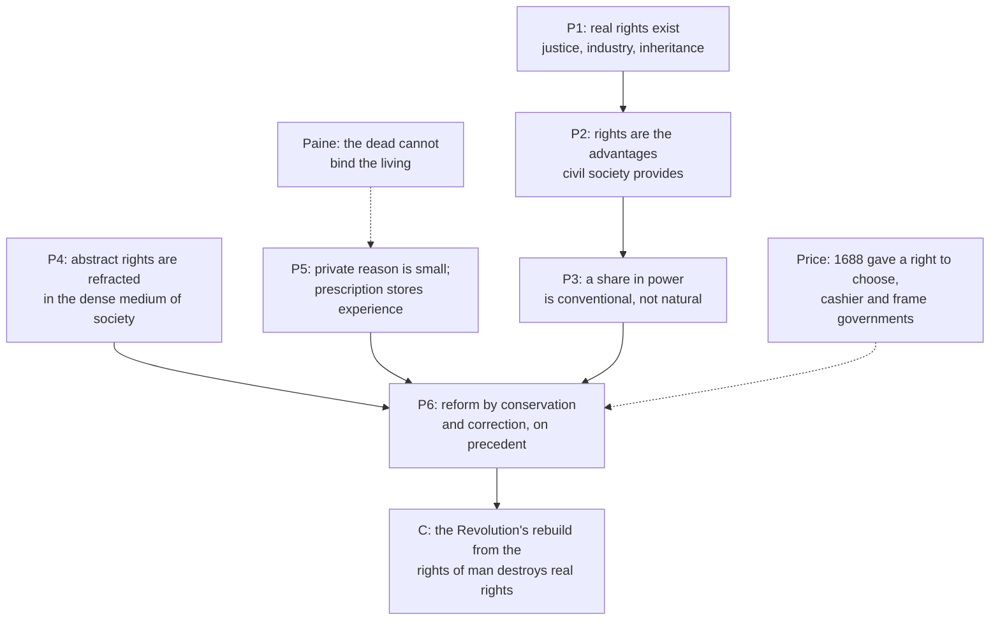

# History of Political Thought · Lesson 5.3: Burke: prescription against abstract rights

> ⏱ ~15 min · Module 5: The age of revolutions · Builds on: [5.2 *The Federalist*: faction and the extended republic](05-02-the-federalist-faction-and-the-extended-republic.md), [4.2 Locke II: limited government, revolution and toleration](04-02-locke-limited-government-and-toleration.md) · Unlocks: [5.4 Wollstonecraft: rights, virtue and the education of women](05-04-wollstonecraft-rights-virtue-and-education.md)

## Why this matters

Locke gave the eighteenth century a way to judge any government from outside: people have rights before government exists, and a government that invades them may be dissolved. Madison designed a new constitution on that footing. In 1790 Edmund Burke, a Dublin-born Whig member of Parliament, published the most powerful case ever made that this is the wrong way to think about a political order at all. *Reflections on the Revolution in France* is not a defense of kings against rights. It is an argument about what kind of reason politics runs on. Every later quarrel between reform from first principles and reform from inherited practice restages it.

## The idea

There are two ways to justify an arrangement. You can derive it: start from what every human being is owed, and build the institutions those rights require. Or you can point to its record: it has been lived in for generations, it has been repaired many times, and it still answers needs.

Burke thinks the second is not a fallback for people who can't do the first. It is the better kind of reason, because a society is too complicated for the first. Think of an old house. A renovator carrying only a blueprint of the ideal house cannot tell which wall holds up the roof. That the house has stood for two hundred years is information, and it is information the blueprint does not contain.

English law already had a name for this. **Prescription** gives you title to land through long, peaceable possession, even when nobody can produce the original grant. Burke extends it to whole constitutions. A government's long and beneficial continuance is its title, and demanding that it first show its papers against an abstract standard asks for something no working order could supply.

The occasion was a sermon. On 4 November 1789 Richard Price, a Dissenting minister, preached *A Discourse on the Love of Our Country* to the Revolution Society, a London club that commemorated 1688. He welcomed the French Revolution as the completion of England's. Burke's book began as a reply to that claim, written as a letter to a young French correspondent.

## Source

Burke has just granted that society is indeed a contract. But the state, he says, is not a trading partnership in pepper or coffee, to be dissolved whenever the partners please. It is a partnership in all science, art and virtue, and then:

> As the ends of such a partnership cannot be obtained in many generations, it becomes a partnership not only between those who are living, but between those who are living, those who are dead, and those who are to be born.

*Reflections on the Revolution in France* (1790), in *Works*, vol. 3.

Read the first clause. The partnership spans generations *because of its ends*: goods like law, learning and civility take longer than one lifetime to build. It is not simply because Burke says so. The argument is teleological before it is sentimental. The next sentence goes further. Each state's contract is only a clause in a great primeval contract of eternal society that links the visible and invisible worlds. A religious reader takes that as Burke's real ground. A secular reader takes it as rhetoric laid over the argument from ends. The text supports both, and this lesson doesn't choose.

## The argument

Burke's case against the rights of man, in his own terms:

1. **Men have real rights.** They have a right to justice, to the fruits of their industry, to what their parents acquired, and to instruction in life and consolation in death. *In words:* Burke is not denying rights. He is moving where they come from.
2. **These rights are the advantages civil society exists to provide.** Government is a contrivance of human wisdom to provide for human wants, and one of those wants is a restraint on our own passions. *In words:* rights are what the partnership owes its members, so they come after the partnership, not before it.
3. **So a share in power is not a natural right but a matter of convention.** In the partnership all have equal rights, but not to equal things. *In words:* who governs, and how, is settled by a society's own arrangements. It cannot be read off human nature.
4. **Abstract rights bend when they enter real life.**
   > These metaphysic rights entering into common life, like rays of light which pierce into a dense medium, are, by the laws of Nature, refracted from their straight line.

   *In words:* a principle that is true in the abstract gives no direction until it passes through actual circumstances, and by then it no longer points straight.
5. **No one generation's reason is equal to that complexity.** Each person's private stock of reason is small, so it is wiser to draw on what Burke calls the bank and capital of nations and ages. Inherited "prejudice" and prescription store that tested experience. *In words:* an institution's long survival is evidence that it meets needs nobody has fully put into words.
6. **So reform must conserve and correct.** A state that cannot change cannot preserve itself. But the change should be confined to the part that failed and should follow precedent, as 1688 did. *In words:* repair what broke, and keep the frame.

**∴** Rebuilding a state from the rights of man mistakes a metaphysical abstraction for a political reason. In doing so it destroys the real rights (premise 1) it claims to secure. And Price's reading of 1688 as a charter for such rebuilding is simply false history.

**The chivalry passage.** Burke's famous lament for Marie Antoinette, driven from Versailles in October 1789, belongs to this argument and is not a digression. The age of chivalry is gone, he writes, and the age of sophisters, economists and calculators has replaced it. His point is that inherited manners and what he calls the "moral imagination" clothe power and soften it. Strip them away, and a king is just a man and a queen just a woman, and only force remains. Critics from Paine onward heard sentimentality. Burke meant it as a claim about what keeps power gentle.

## Argument map

## Worked examples

**Example 1 (clean case): what 1688 was.**

Price said the Glorious Revolution gave the English people three rights: to choose their governors, to *cashier* them for misconduct, and to frame a government for themselves. Run Burke's premise 6 on it.

Burke tells us to look at the acts of the Revolution, not the sermons about it. The Declaration of Right (1689) said nothing about electing kings. It declared *ancient* rights and liberties, and it settled the succession. The Act of Settlement (1701) fixed the Protestant line of inheritance. James II's removal was a case of necessity, a just war in the one situation where such a war can be just. It was not a precedent for removing kings at will. The deviation was confined to the part that had failed, the person of the king. The hereditary principle was kept.

Behind this sits the frame Burke calls an *entailed inheritance*. From Magna Carta to the Declaration of Right, the English claimed their liberties as an estate received from their forefathers and owed to their posterity. They did not claim them as the rights of man. Under an entail, the current holder cannot sell the estate off. So on Burke's reading, 1688 is the constitution conserving itself, which is the opposite of what the Revolution Society wanted from it.

**Example 2 (hard case): was Burke consistent about America?**

In 1775 Burke urged Parliament to conciliate the American colonists. In 1790 he damned the French. Paine, among others, saw a man who backed one revolution and denounced the next. Can the principle survive?

Burke's own frame gives him an answer. In his American speeches of 1774 and 1775 he treats the colonists as Englishmen claiming English liberties, above all the liberty of being taxed only through their own assemblies. He refuses to rule on Parliament's abstract right to tax them: whatever the right, using it was imprudent. That is premises 2 and 4 at work, applied fifteen years before the *Reflections*. On this reading the colonists were defending an inheritance, and the French were throwing one away.

The principle strains in two places. First, in 1776 the Americans justified independence by self-evident rights, which is exactly the language Burke later attacked. So his reading fits the colonial grievance better than the Declaration of Independence. Second, prescription needs a limit. Burke defends the French Church's lands through a thousand years of possession, yet an abuse can also be very old. His resource is the word *beneficial*: prescription covers institutions whose long continuance has served their members. But then benefit, not age, is doing the justifying work, and someone has to judge the benefit. That is where [5.4](05-04-wollstonecraft-rights-virtue-and-education.md) will press him.

## Watch out

- **Anachronism: "Burke the conservative."** Burke was a Whig. He defended 1688, the American colonists and Ireland's Catholics, and in the same years he led the impeachment of Warren Hastings for abuses in India. "Conservative" became a party label only in the decades after his death. Reading him as the founder of a later party's program imports alliances he never made.
- **"Prejudice" does not mean bigotry.** In Burke it means a judgment formed before deliberation, a settled disposition that makes a person's virtue their habit instead of a fresh calculation each time. Whether that is wise is a real question. But it is not the question of whether he defended intolerance.
- **Burke does not oppose change.** Premise 6 requires change: a state without the means to change cannot preserve itself. What he opposes is rebuilding the whole order from first elements. Treat him as a blanket enemy of reform and Example 1 makes no sense.
- **Burke does not reject contract either.** He accepts that society is a contract and then denies that it is the kind of contract its current members can dissolve. Paine and Burke share the word and disagree about what sort of agreement it names.

## One-liner

> Burke doesn't deny the rights of man. He denies that they can build a state, because real rights are the inherited advantages of a partnership across generations, and only tested practice knows how to secure them.

## Problems

**P1 (🟢) *(Exegetical.)*** The sentences below come from a stretch of the *Reflections* about the National Assembly. Just before them, Burke complains about noblemen who joined the Third Estate in destroying the nobility, and says that such ambitious men generally despise their own order.

> To be attached to the subdivision, to love the little platoon we belong to in society, is the first principle … of public affections. It is the first link in the series by which we proceed towards a love to our country and to mankind.

(a) In this context, what is "the subdivision" Burke has in mind? (b) Does the passage set local attachment against love of mankind, or make it the route to it? Name the words that decide. (c) Today "little platoons" is often used to mean voluntary neighborhood associations. Say what that use changes. 120 words or fewer in total.

**P2 (🟡) *(Exegetical (a) · Evaluative (b))*** Paine's *Rights of Man* (1791) replies to Burke's defense of the 1688 settlement:

> The vanity and presumption of governing beyond the grave is the most ridiculous and insolent of all tyrannies.

(a) Name the single premise about where political obligation comes from that one of them must deny. State it so that Paine affirms it and Burke denies it. (b) Does Burke's partnership passage (the Source above) answer Paine, or talk past him? Any verdict. 150 words for (b).

**P3 (🔴, optional) *(Exegetical.)*** Diagnose this invented op-ed. Which of Burke's ideas is it borrowing, and what has it dropped from the original? 150 words or fewer.

> "Our city charter has stood for 170 years. Its age is its proof. Now a commission of consultants wants to replace it with a 'model charter' drawn up from best-practice principles. Change nothing, not a comma. No spreadsheet can match the wisdom of our great-grandparents, and anyone who wants to amend their work shows contempt for the dead."

Solutions

**P1** *(Exegetical.)*

**Must hit, strict:**
- **(a)** The subdivision is one's *order* or rank in society. Here it is the nobility, whose ambitious members are betraying their own order. It is not, in the first instance, a neighborhood or a voluntary club.
- **(b)** It is a route, not a rival. The deciding words are "first principle", "first link in the series" and "proceed towards a love to our country and to mankind". Local attachment is the first link in a chain that ends in love of humanity.
- **(c)** The modern use swaps an inherited social rank for a chosen association. It often also treats the platoon as a *substitute* for the larger community, where Burke has it as the *first step* toward it.

**Wrong turns:** reading "little platoon" as the family or the parish without checking the surrounding paragraph. Reading Burke as preferring the local *over* the universal, which the word "series" rules out.

**Model answer:** (a) One's own order, the nobility, which the ambitious nobles in the Assembly despised. (b) It makes local attachment the start of a sequence: "first link in the series by which we proceed towards" love of country and mankind. (c) The modern use turns a rank you are born into into an association you choose, and often treats it as an alternative to the national community instead of the first step toward it.

---

**P2** *(Exegetical (a) · Evaluative (b))*

**Must hit, strict (a):** the crux is *political obligation can arise only from the will (consent or authorization) of those who are bound.* Paine affirms it: the dead have no will and no wants left, so they have no authority. Burke denies it: obligation also comes from membership in a partnership whose ends outrun any one generation, and we hold it as heirs and trustees, not as parties who consented. A premise stated as "tradition is valuable" does not pass, because it names no source of obligation.

**Must hit, any verdict (b):**
- State what Burke's passage gives *against* Paine: an account of why the scope must cross generations (its ends), which Paine's picture of consent does not engage.
- Test it against Paine's actual target, the claim of the 1688 Parliament to bind posterity *for ever*. Say whether "we are bound as heirs" meets that, or only changes the subject from authority to benefit.
- Name one thing either side would need in order to move. For example, Paine has to say how the living may keep long-term commitments such as public debts or treaties without inheriting obligations. Burke has to say when an inherited obligation lapses.

**Wrong turns:** giving the crux as "Burke likes tradition, Paine likes reason," which Burke would deny, since he argues that prescription *is* reason stored up. Scoring (b) on which thinker is right.

**Model answer (b), one of several:** Burke answers a question Paine is not asking. Paine asks who has authority to *command*, and the dead have none, because authority needs a will. Burke asks why we are *bound* at all, and his answer is that the goods of political life take generations to build, so every generation holds them in trust. That meets Paine's picture of consent head-on: if a society is a trust and not a trade, the consent of the living is not the whole story. But Paine's target is narrower, a Parliament presuming to bind the succession for ever. Burke's trust image explains why we should be slow to break with the past. It does not show that anyone in 1689 had the *power* to forbid it. So it partly answers Paine and partly talks past him. Paine owes an account of debts contracted for posterity (Jefferson and Madison argued exactly this).

---

**P3** *(Exegetical.)*

**Must hit, strict:**
- **Borrowed:** prescription (long standing as a title), inherited experience against the reason of a single generation, and suspicion of design from abstract principle ("best-practice principles" playing the part of the rights of man).
- **Dropped (name at least two):** (1) *correction*. For Burke a state without the means of change cannot conserve itself, so "not a comma" is the opposite of his view. (2) Age is a *presumption*: prescription protects an order whose long continuance has been beneficial, so age counts as evidence of good working, not as proof. (3) The partnership includes those *to be born*, so obligations run forward to heirs as well as back to ancestors. (4) Burke's reason for deference is the complexity of society, not reverence for the dead as such.

**Wrong turns:** saying the op-ed borrows Paine. Saying it is simply Burke, with nothing dropped.

**Model answer:** It borrows Burke's prescription (a 170-year charter as proof), his suspicion of reform from first principles, and his preference for accumulated experience over any one generation's reason. It drops his principle of correction. Burke says a state unable to change cannot preserve itself, and he praised 1688 for repairing only the part that failed. "Not a comma" is therefore anti-Burkean. It also turns a presumption into a proof: for Burke, age counts because it is evidence of beneficial working, and the charter's record would need showing. Finally, it faces only backward. Burke's partnership includes the unborn, and the trust can require prudent amendment for their sake.

## Flashback

**From Lesson 5.1 (Montesquieu: the spirit of the laws):** *(Exegetical.)* Close reading and application. In *The Spirit of Laws* XIX.14 (Nugent), Montesquieu advises a prince who wants great alterations in his kingdom:

> he should reform by law what is established by law, and change by custom what is settled by custom; for it is very bad policy to change by law, what ought to be changed by custom.

(a) Which reading do the words support? **(i)** Legislators should leave a nation's customs alone. **(ii)** Customs may need changing, but the instrument must match the thing: laws for what law made, example and new manners for what custom made. Name the deciding words. (b) An invented minister has three projects: repeal a royal charter giving one guild a monopoly on weaving; fine any family whose wedding feast exceeds a set cost, since such feasts ruin households; and punish a custom of settling family quarrels by killing. Say which instrument the maxim assigns to each, and which case shows the maxim does not put everything customary beyond the reach of law. Three sentences or fewer per part.

Solution

**Must hit, strict (a):** reading (ii). "Change by custom what is settled by custom" uses the same verb for customs as "reform" for laws: change is presupposed, only its means are at issue. "What ought to be changed by custom" concedes that customs ought sometimes to be changed. "Very bad policy" is a judgment about method, not a ban on the end. The chapter's title (the natural *means* of changing a nation's manners) and its example, Peter the Great's beard law, called tyranny although Montesquieu thinks the Europeanising change came easily, confirm it.

**Must hit, strict (b):**
- Guild charter: established by law, so reform it by law.
- Wedding feasts: settled by custom, so a fine is the "bad policy"; the maxim points to example and new manners (the court and leading families marrying simply), because laws are a legislator's institutions and manners belong to the nation's general spirit.
- Killing: the case that shows the limit. A custom that is also a crime falls to law and punishment; the maxim governs manners, not every harm that happens to be customary. (In the same chapter Montesquieu gives punishments to crimes and examples to customs.)

**Wrong turns:** (a) choosing (i) because Montesquieu stresses fit between laws and a people (I.3): fit governs the means of reform, not whether reform is allowed. Reading Montesquieu here as a defender of every inherited practice. (b) Treating the feast as law's business because it causes harm to the family: it is still a manner, and the maxim's point is that force applied to manners looks like tyranny. Extending the maxim to the killing case.

**Model answer:** (a) Reading (ii). The sentence asks how to "change" what custom settled, not whether to; "what ought to be changed by custom" admits that customs ought sometimes to go, and "very bad policy" faults a method. (b) Repeal the guild charter by law, since law made it. Leave the feasts to example: let the court and leading families marry simply, since fining a manner sets a legislator's will against the nation's general spirit and looks like tyranny. The killings are a crime, not a manner, so they fall to punishment; that case shows the maxim restrains law only over manners, not over whatever happens to be customary.

## Connections

- **Backward:** Locke's dissolution of government ([4.2](04-02-locke-limited-government-and-toleration.md)) is the doctrine Price was reading into 1688, and Burke's Example 1 contests Locke's heirs on the facts of that same revolution. Montesquieu's claim that laws must fit their people ([5.1](05-01-montesquieu-the-spirit-of-the-laws.md)) is a near ancestor of premise 4. *The Federalist* ([5.2](05-02-the-federalist-faction-and-the-extended-republic.md)) shows the other path: a constitution designed on paper that still leans on English precedent.
- **Forward:** [5.4](05-04-wollstonecraft-rights-virtue-and-education.md) is the first great reply, *A Vindication of the Rights of Men*, written within weeks: rights come from reason, not prescription, and Burke's sentiment is on the side of property. Hegel ([6.1](06-01-hegel-freedom-realized-in-the-state.md)) will try to reconcile rational rights with inherited ethical life, and Tocqueville ([6.3](06-03-tocqueville-tyranny-of-the-majority-and-soft-despotism.md)) revisits the French Revolution's centralizing legacy.
- **Sideways:** Paine's challenge and Burke's partnership are cited in [`philosophy-of-debt`](../../philosophy-of-debt/syllabus.md) 6.1, where Jefferson's argument that the earth belongs to the living and Madison's reply turn the question into one about public debt. Whether inherited institutions have authority is argued analytically in [`political-philosophy`](../../political-philosophy/syllabus.md), and the resemblance between little platoons and subsidiarity belongs to [`catholic-social-teaching`](../../catholic-social-teaching/syllabus.md), which should not treat the two as the same idea without argument. Finding the crux in P2 is the technique of [`philosophical-method` 4.3](../../philosophical-method/lessons/04-03-finding-the-crux.md).
