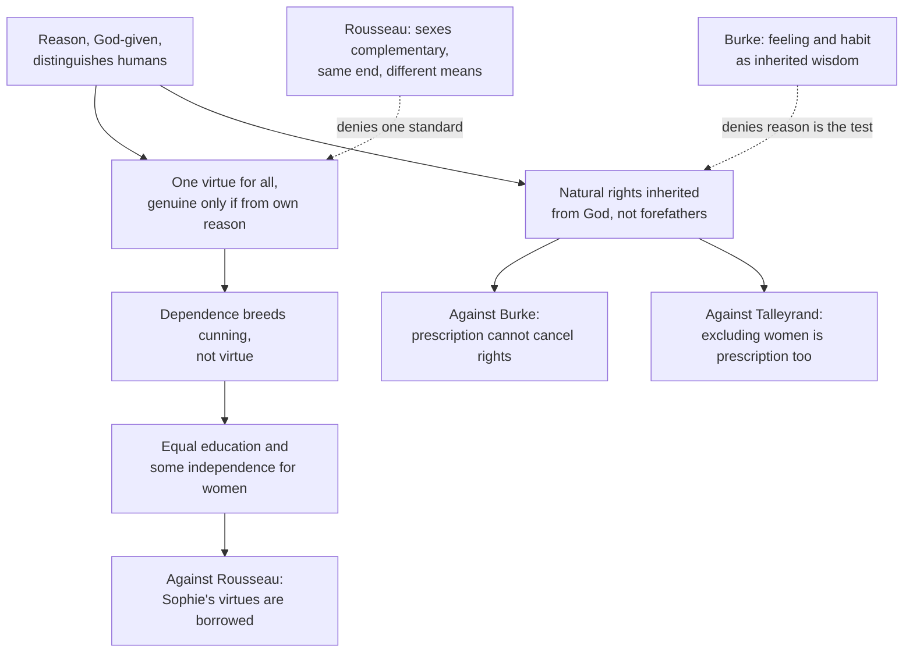

# History of Political Thought · Lesson 5.4: Wollstonecraft: rights, virtue and the education of women

> ⏱ ~15 min · Module 5: The age of revolutions · Builds on: [5.3 Burke: prescription against abstract rights](05-03-burke-prescription-against-abstract-rights.md), [4.4 Rousseau II: the *Social Contract*](04-04-rousseau-the-social-contract.md) · Unlocks: [6.1 Hegel: freedom realized in the state](06-01-hegel-freedom-realized-in-the-state.md)

## Why this matters

Mary Wollstonecraft (1759–1797) wrote two *Vindications* in two years, and they are one argument aimed at two targets. The first, *A Vindication of the Rights of Men* (1790), was among the first replies to Burke's *Reflections*, out within weeks. The second, *A Vindication of the Rights of Woman* (1792), turns the same principle on the revolution's friends: on Talleyrand, whose report on national education gave girls far less than boys, and on Rousseau, whose *Emile* had become the age's manual for raising girls. Her claim is that rights, virtue and education are one package, so a society that denies any of them to half its members has not really granted them to anyone. Every later argument that dependence deforms character, and that the deformity is then offered as proof the dependence was deserved, runs through her.

## The idea

Picture a bird raised in a cage. It cannot fly well, and its keeper points to that as proof it was never meant to fly. Wollstonecraft thinks this is the whole case for keeping women subordinate. Women are called vain, cunning, timid and incapable of principle, and those faults are used to justify an education in pleasing and a life of dependence. But the education and the dependence produce the faults. Rousseau, she says in *Rights of Woman* ch. 5, takes the effect of habit for evidence of nature.

Behind that diagnosis sits a claim about what virtue is. A virtue you merely obey, because someone you depend on wants it, is not yours. It is good behaviour on loan, and it will be withdrawn the moment a new master wants something else. Real virtue has to come from your own reason seeing why the duty is a duty. So anyone who wants women to be good must let them become rational, and that means educating them the way men are educated and loosening their dependence on men.

The same principle had already done its work against Burke. If rights are grounded in reason, which every human being has from God, then no length of inherited custom can cancel them. Burke's prescription is only a very old habit.

## Source

*A Vindication of the Rights of Woman* (1792), ch. 2, from her conclusion about what the best education is:

> "In fact, it is a farce to call any being virtuous whose virtues do not result from the exercise of its own reason. This was Rousseau's opinion respecting men: I extend it to women"

Two things to see. The standard is not hers: she borrows it from Rousseau, the author she is about to attack, so her quarrel is over its *scope*, not its truth. And "any being" is doing the work, because she will not let the standard be sexed.

## The argument

**The case in *Rights of Woman*.**

1. **Reason is what raises humans above the brutes, and virtue is what raises one being above another** (ch. 1). *In words:* the human excellence is rational virtue, and it is the measure of persons.
2. **There is one standard of virtue for all rational beings** (ch. 2: if women have souls, providence has appointed one way to virtue for all of humanity). *In words:* chastity, courage and honesty mean the same thing in a woman as in a man.
3. **A virtue is genuine only if it results from the agent's own reason** (ch. 2, the Source). *In words:* conduct produced by fear, flattery or command is compliance, not virtue.
4. **Reason grows strong only by exercise, and virtue needs liberty to reach its strength** (chs. 2, 13). *In words:* you cannot order someone into good judgment; she has to use it.
5. **Dependence replaces one's own reason with another's favour, and so breeds cunning** (chs. 4, 9: it is vain to expect virtue from women until they are to some degree independent of men). *In words:* whoever lives by pleasing a master learns to manage him, not to judge rightly.
6. **Women's observed faults are the effects of their education and station, not of their nature** (Introduction, ch. 13). *In words:* the cage made the bird clumsy.
7. **∴ Women must be educated as rational beings, with the same studies as men, and given enough civil and economic independence for their virtue to be their own** (chs. 9, 12). *In words:* if you want virtuous wives, mothers and citizens, stop raising girls to please.

Her concrete proposals follow. Ch. 12 proposes government day schools where boys and girls, rich and poor, study together, dressed alike and under the same discipline. Ch. 9 proposes that women train as physicians and run businesses, and adds a "hint", which she expects to be laughed at, that women should have political representatives.

**The case against Burke, in *Rights of Men*.**

1. **Rights are inherited at birth by rational creatures, who receive them from God, not from their forefathers.** So prescription cannot undermine natural rights. *In words:* age does not turn a wrong into a right.
2. **The birthright is defined by reason,** as "such a degree of liberty, civil and religious, as is compatible with the liberty of every other individual with whom he is united in a social compact." *In words:* each person may have as much civil and religious liberty as fits with everyone else's.
3. **Burke's defence of inheritance protects hereditary property and rank, which corrupt both rich and poor.** The only property reason approves is what a person's own talents and industry acquire. By Burke's logic, she adds, the slave trade could never be abolished, since our forefathers sanctioned it. *In words:* what Burke calls English liberty is really just keeping property safe.
4. **Burke reasons from feeling, and his feelings are selective.** She calls sensibility the craze of the day, and asks where his sensibility was when, in the Regency debate of 1788–89, he spoke of the stricken George III in terms she calls a cruel mockery. *In words:* sentiment is no test of right, because it pities whom it likes.

The dedication of *Rights of Woman* joins the two books. Talleyrand's constitution claims to rest on reason, yet it excludes women on the strength of the very argument revolutionaries reject: prescription. If the rights of man survive rational scrutiny, she tells him, those of woman will too.

## Argument map

The dashed edges are where each opponent refuses a premise. Burke's refusal belongs to Module 5's boss problem. Rousseau's is Example 2.

## Worked examples

**Example 1 (clean: Sophie).** *Emile* Book V (1762) gives Emile a wife, Sophie, and a plan for her education. As Wollstonecraft reports it in ch. 5, Sophie is to be as perfect a woman as Emile is a man, and since woman is formed to please man and be subject to him, her education should be relative to men. She is to cultivate charm, modesty and the art of being agreeable, and she is governed from infancy by what people will think of her.

Run the argument. Sophie's good conduct is produced by the wish to please and by concern for opinion, so by premise 3 it is not virtue. Premise 5 then predicts what happens under strain. A woman trained only to please, Wollstonecraft argues in ch. 2, will find her husband's attention fading after marriage and will plausibly turn the same art on other men. The system that is meant to secure fidelity undermines it. The prediction is conditional, not moralistic: remove the one man who holds the leash, and nothing inside her holds her conduct in place, because it was never built. Hence the conclusion: educate her reason, and the duties of wife and mother become hers.

**Example 2 (hard: Rousseau at full strength).** Rousseau has a real reply, and Wollstonecraft quotes it. He grants that man and woman should pursue the same *end*. He denies they need the same *means*: since they differ in temperament and character, they should be educated differently and act in concert. So he rejects premise 2, not premise 3. Men and women each have genuine virtues, but those virtues are complementary, and a couple is completed by their union. On this view Sophie's modesty is her own kind of excellence, not borrowed good behaviour.

Wollstonecraft's counter uses Rousseau's own political theory. [4.3](04-03-rousseau-discourse-on-inequality.md) made dependence on a particular will the root of corruption, and [4.4](04-04-rousseau-the-social-contract.md) built a republic so that no citizen would hang on another's pleasure. Sophie's education makes that dependence a woman's whole life. Rousseau therefore needs the household to be exempt from his own diagnosis.

Here the text stops settling things. Whether sexual difference reaches as far as character and virtue, or stops at the body, turns on premise 6, a causal claim about nature versus habit. Neither author could test it in a society where every girl was already raised as Sophie. Wollstonecraft concedes greater male bodily strength in her Introduction and declines to settle the general question of equality. Her argument needs only that no one has yet seen what a rationally educated woman would be. And she did not reject domestic life: ch. 9 still holds that most women are called to be wives and mothers. Her demand is that they be those things *as rational beings*.

**Three readings (hedged).** A long tradition reads her as a founder of *liberal* feminism: equal rights for individuals, extended consistently. Recent scholars such as Alan Coffee stress her *republican* language instead: independence, the corruption of dependence, and the arbitrary power of husbands and kings. Barbara Taylor's *Mary Wollstonecraft and the Feminist Imagination* (2003) emphasizes the *religious* frame. Wollstonecraft moved in the circle of the Dissenting minister Richard Price, and for her reason is God's gift and virtue is training for an immortal soul. The texts support all three. They differ over which strand carries the weight.

## Watch out

- **Anachronism: "feminist" and "votes for women."** The word came later, and suffrage is not her program. Representation is a single, tentative hint, and she immediately notes that most men are not truly represented either. Her central demands are education, independence and civil standing.
- **Her severity toward women is premise 6, not contempt.** She calls fashionable women weak and cunning precisely because she thinks those faults were produced in them. Read the harsh passages as the evidence for her causal claim.
- **Her rights are not free-floating.** Ch. 1 is titled "The Rights and Involved Duties of Mankind Considered," and her rights are grounded in God-given reason. A secular reconstruction is possible, but it has to supply a substitute for that ground.
- **"Independence" is not market self-reliance.** It means not living under another's arbitrary will. She says hereditary wealth and rank corrupt men in the same way, which is why her attack on Burke and her attack on Rousseau are one book.

## One-liner

> Virtue borrowed from a master is not virtue: so whoever keeps women dependent and uneducated has manufactured the weakness he cites as his excuse, and whoever claims rights from reason must extend them to everyone who reasons.

## Problems

**P1 (🟢) *(Exegetical.)*** From *Rights of Woman* ch. 4, just after arguing that girls' timidity is cultivated rather than natural:

> "Educate women like men," says Rousseau, "and the more they resemble our sex the less power will they have over us." This is the very point I aim at. I do not wish them to have power over men; but over themselves.

Does Wollstonecraft deny Rousseau's prediction, or accept it and reject his valuation? Name the words that decide it, and say what the two senses of "power" are, connecting the second to one premise of the lesson's reconstruction. 100 words or fewer.

**P2 (🟡) *(Exegetical, with a short evaluative step.)*** Reconstruct in numbered premises (P1, P2, … ∴ C), in Wollstonecraft's terms, the argument from "virtue must come from one's own reason" to "girls and boys should be taught the same studies in common day schools." Use no more than six premises. Then flag the premise most open to attack and say in one or two sentences what kind of evidence would bear on it. 150 words or fewer.

**P3 (🔴, optional) *(Exegetical.)*** Diagnose this invented op-ed paragraph:

> "Educate our daughters: it is the best investment a nation can make. A schooled mother keeps an orderly household, raises industrious sons and teaches her children the love of their country. She will know to leave public questions to her husband's judgment, but she will raise children capable of exercising it."

(a) Which of Wollstonecraft's arguments does it borrow, and where does she make it? (b) What has it dropped from her case, and whose view of women's education has it kept instead? 150 words or fewer.

Solutions

**P1** *(Exegetical — strict.)*

**Must hit, strict:**
- She **accepts** the prediction and rejects the valuation. "This is the very point I aim at" decides it: the outcome Rousseau fears is her goal.
- Two senses of power. The first is sway *over men*, gained by charm and weakness, which she elsewhere calls illegitimate and degrading. The second is power *over themselves*, meaning self-government by one's own reason.
- The link: self-command is premise 3 (virtue must result from one's own reason), and losing sway over men is the cost of leaving dependence (premise 5).

**Wrong turns:** reading her as denying that educated women would please men less. She concedes it. Treating "power over themselves" as political power, which is not the sense here.

**Model answer:** She grants Rousseau's prediction and reverses its value. "This is the very point I aim at" shows she wants what he fears. Rousseau means the indirect sway women gain over men by charm, which depends on weakness. She means self-government, conduct directed by one's own reason, which is her condition for genuine virtue. The swap costs women their illicit influence and gains them virtue that is their own.

---

**P2** *(Exegetical, then a small evaluative step.)*

**Must hit, strict:**
- A premise that virtue is genuine only if it results from the agent's own reason (ch. 2).
- A premise that there is one standard of virtue for both sexes (ch. 2).
- A premise that reason is strengthened by exercise, which requires education (chs. 2, 12).
- A premise that women's apparent incapacity is produced by education, not nature (so there is no natural bar to the same studies).
- A premise linking common schooling to the goal. In ch. 12, boys and girls studying together learn modesty and decency without the sexual distinctions that taint the mind, and mixing classes blocks the distinctions of vanity.
- A conclusion matching the task.

**Must hit (flag):** name one premise as most exposed, with the evidence that bears on it. The usual candidate is the nature-versus-education premise, which is empirical: it would take comparing girls educated rationally with girls educated to please. The one-standard premise is also defensible as a flag (Rousseau denies it), and the evidence there is argument about whether virtues differ by social role.

**Wrong turns:** grounding the conclusion in women's political rights, which is not her route to schooling; leaving out the nature-versus-education premise, without which Rousseau's complementarity reply stands untouched.

**Model answer:** P1 A being's virtues are genuine only if they result from its own reason. P2 There is one standard of virtue for all rational beings, women included. P3 Reason becomes strong only by exercise, which education supplies. P4 Women's apparent weakness of mind is an effect of their education and station, not of nature. P5 Studying together from childhood teaches both sexes decency without the sexual distinctions that corrupt, and the same discipline removes distinctions of vanity. ∴ C Girls should receive the same education as boys, and should receive it alongside them in common day schools. Most exposed: P4, a causal claim that only comparing differently educated girls could test.

---

**P3** *(Exegetical — strict.)*

**Must hit, strict (a):** the instrumental civic argument: educated women make better mothers and citizens and raise patriots. The dedication to Talleyrand says that a mother must herself be a patriot to raise patriots, and ch. 9 says emancipated women would be better wives, mothers and citizens.

**Must hit, strict (b):**
- Dropped: the *ground*. Virtue must come from her own reason, so her duties must be understood, not merely performed. Education is owed to her as a rational, accountable being, and the argument does not depend on its returns.
- Dropped: independence. Deferring to a husband on public questions is the dependence she says makes virtue impossible. The dedication's challenge is the rebuke: who made man the exclusive judge, if woman shares the gift of reason?
- Kept: Rousseau's education designed relative to men (*Emile* V). Women are schooled for men's and children's benefit while subordination stays in place.

**Wrong turns:** attributing the whole paragraph to Rousseau. The patriot-mother argument is really Wollstonecraft's, and the diagnosis must say so. Saying it has dropped her "demand for the vote," which inflates her one hint.

**Model answer:** (a) It borrows Wollstonecraft's instrumental case: educated women make better mothers and citizens, and patriots need patriot mothers (dedication to Talleyrand; ch. 9). (b) It drops what that case rested on. For her, virtue must result from a woman's own reason, and a duty not understood cannot be discharged virtuously. Education is owed to her as a rational being, not as an investment. It also drops independence. Leaving public questions to the husband's judgment is exactly the dependence she says breeds cunning instead of virtue. What it keeps is Rousseau's Book V: an education designed around the needs of men and the household, with the subordination intact.

## Flashback

**From Lesson 5.2 (*The Federalist*: faction and the extended republic):** *(Exegetical.)* Close reading and application. In *Federalist* No. 10 Madison says that many acts of legislation are really lawsuits in which the legislators' own classes are the parties. Of a law on private debts, with creditors on one side and debtors on the other, he writes that

> the parties are, and must be, themselves the judges; and the most numerous party, or, in other words, the most powerful faction must be expected to prevail.

A paragraph later: "Enlightened statesmen will not always be at the helm."

(a) Which reading do the words support? **(i)** The problem is that the state legislatures of the 1780s held biased men, and honest legislators would fix it. **(ii)** The bias is built into legislating on interests, so no choice of legislators removes it. Name the deciding words, and say which step of No. 10's argument the passage supports. (b) An invented reform league proposes two cures for unjust debt laws: legislators who personally owe or hold debts must abstain on them, and voters should elect only men of known public virtue. Say why, on this passage's reasoning, each leaves the problem in place. Three sentences or fewer per part.

Solution

**Must hit, strict (a):** reading (ii). "Are, and must be" makes the parties' judging a necessity, not a lapse; "must be expected to prevail" predicts the outcome from the structure; "the most numerous party, or, in other words, the most powerful faction" shows the danger is a majority deciding its own cause, not a few corrupt men. "Will not always be at the helm" rejects wise rulers as a cure. The passage supports step 3: faction's causes cannot be removed, so relief lies only in controlling its effects (step 4).

**Must hit, strict (b):**
- Recusal: the parties are not only the legislators but the classes they represent, so a legislator with no debts still answers to a debtor majority; recusing individuals does not take the numerous party out of the judging.
- Virtuous men: "enlightened statesmen will not always be at the helm," and even when they are, the just adjustment depends on remote considerations that rarely prevail over a party's immediate interest.
- Both try to make the judges impartial, which is removing causes; No. 10's conclusion is to control effects instead.

**Wrong turns:** (a) choosing (i) because the lesson's background mentions misbehaving state legislatures; the passage explains that misbehaviour structurally. Reading "faction" here as a minority: Madison equates it with "the most numerous party." (b) Accepting recusal because it removes the individual conflict of interest, missing that the conflict belongs to the constituents.

**Model answer:** (a) Reading (ii). The parties "are, and must be" the judges, and the "most numerous party," which Madison calls the "most powerful faction," is "expected to prevail": the bias follows from legislating on interests, not from bad character, and "Enlightened statesmen will not always be at the helm" rules out wise men as the cure. This supports step 3, that the causes of faction cannot be removed. (b) Recusal fails because the real parties are the creditor and debtor classes that elect the legislature: a debt-free member still votes his debtor constituents' cause. Electing the virtuous fails because such men will not always win, and the just balance rests on remote considerations that seldom beat immediate interest. Both proposals try to purify the judges, when No. 10's lesson is to control the effects of a judging that cannot be purified.

## Connections

- **Backward:** the *Rights of Men* answers [5.3](05-03-burke-prescription-against-abstract-rights.md) directly, charging that Burke's prescription is habit dressed as wisdom and his sensibility selective. The deeper debt is to Rousseau. [4.3](04-03-rousseau-discourse-on-inequality.md)'s diagnosis of corrupting dependence and [4.4](04-04-rousseau-the-social-contract.md)'s republic without personal dependence are the weapons she turns on *Emile*. Aristotle's claim that women deliberate, but without authority (*Politics* I.13), is the older view of sexed virtue she is up against ([1.3](01-03-aristotle-the-city-exists-by-nature.md)).
- **Forward:** Module 5's boss problem asks how she would diagnose a modern constitutional proposal, and makes you name the crux between her and Burke on inherited institutions. [6.1](06-01-hegel-freedom-realized-in-the-state.md) gives a rival answer about the family. Hegel assigns the sexes different spheres within ethical life, which is closer to Rousseau than to her. Mill ([6.4](06-04-mill-representative-government.md)) later pressed her premise 6 in *The Subjection of Women* (1869), outside this course: under subordination, women's nature cannot be observed.
- **Sideways:** whether freedom is non-interference or non-domination, the dispute behind the liberal and republican readings, is [`political-philosophy`](../../political-philosophy/syllabus.md) 3.1, and its 4.4 treats feminist political philosophy analytically, including the family as a site of justice. The one-virtue-or-many question is the unity of the virtues from [`ethics` 4.2](../../ethics/lessons/04-02-aristotle-virtue-and-practical-wisdom.md). Naming the premise Rousseau denies in Example 2 is the method of [`philosophical-method` 4.3](../../philosophical-method/lessons/04-03-finding-the-crux.md).
