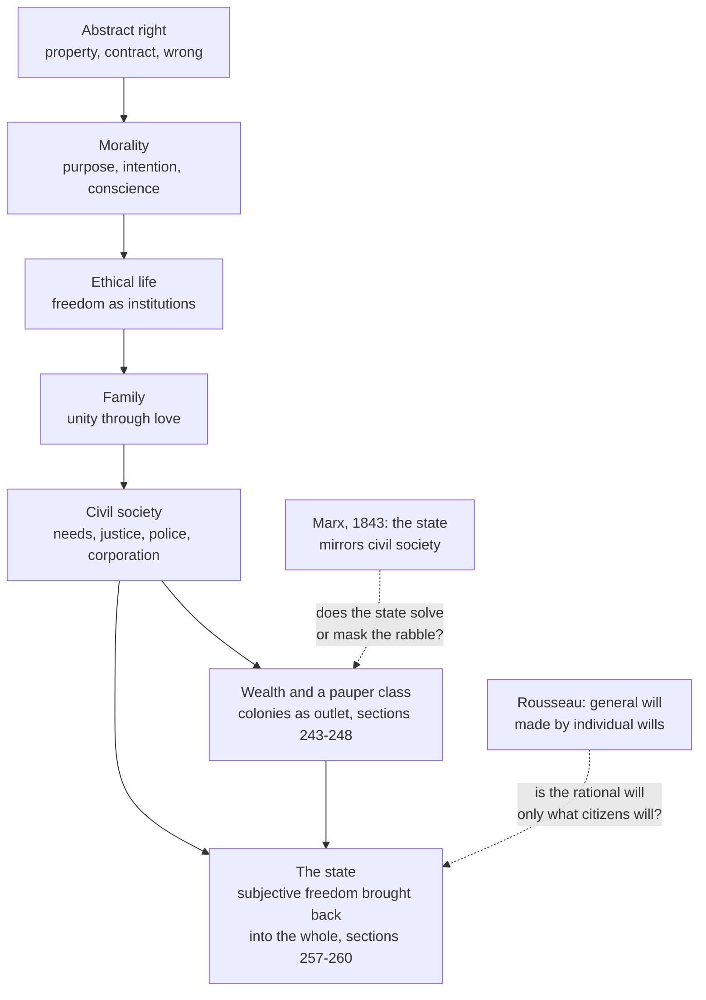

# History of Political Thought · Lesson 6.1: Hegel: freedom realized in the state

> ⏱ ~15 min · Module 6: The nineteenth century: freedom, capital and democracy · Builds on: [4.4 Rousseau II: the *Social Contract*](04-04-rousseau-the-social-contract.md), [5.3 Burke: prescription against abstract rights](05-03-burke-prescription-against-abstract-rights.md) · Unlocks: [6.2 Tocqueville I: equality of conditions](06-02-tocqueville-equality-of-conditions.md)

## Why this matters

By 1820 two answers to the French Revolution were on the table. Rousseau's heirs said a people is free when it rebuilds its institutions from the rational will. Burke said institutions earn obedience by having been inherited. G. W. F. Hegel (1770–1831), professor at Berlin, gave a third answer in the *Philosophy of Right* (dated 1821): the modern world had already produced institutions in which freedom exists, and philosophy's job is to show why they are rational rather than to design new ones or bow to old ones. Marx's whole theory of the state starts as a line-by-line critique of this book ([6.5](06-05-marx-from-hegel-to-historical-materialism.md)), and "civil society" as a separate sphere between family and state owes its modern sense largely to Hegel.

## The idea

Start with what freedom is *not*, for Hegel. It is not doing whatever you like. The person who follows every impulse is ruled by impulses he did not choose. Nor is it Kant's inner self-legislation alone: a conscience that answers only to itself can tell you to do anything.

Freedom, for Hegel, is being **at home** in your world: living under rules, roles and institutions that you can recognize, on reflection, as expressions of your own rational will rather than as alien fences. A good marriage, a trade you are proud of, a legal system whose logic you understand are not limits on your freedom. They are what your freedom *looks like* once it has a shape.

So the *Philosophy of Right* is built as a ladder. Each rung is a form of freedom that turns out to depend on the next: bare ownership needs a will that respects right; inner morality needs a world of customs and institutions to give it content; the market society of free individuals needs something that holds it together. The top rung is the state, and Hegel's claim is that there the most individual freedom and the most solidarity stop being rivals.

The method follows from this. Philosophy does not issue blueprints. The Preface makes the point with the most quoted pair of sentences in the book. The first, in Dyde's 1896 rendering, reads: "What is rational is real; And what is real is rational." The second is the Source below.

## Source

Hegel, *Philosophy of Right*, Preface (tr. S. W. Dyde, 1896), on why philosophy cannot tell the world what it ought to be:

> "When philosophy paints its grey in grey, one form of life has become old, and by means of grey it cannot be rejuvenated, but only known. The owl of Minerva takes its flight only when the shades of night are gathering."

Minerva's owl is wisdom. Three things to notice: philosophy comes at dusk, *after* a form of life has matured; its grey (abstract thought) cannot make that form young again; and what it can do is *know* it. The passage is aimed at reformers such as Jakob Fries, whom the Preface attacks by name, who wanted to remake the German states from moral feeling. On one reading it also limits Hegel's own claims, since a shape of life that has become fully knowable is already growing old.

## The argument

**From abstract right to the state (§§ 1–260, compressed).**

1. **The will is free when it wills itself: when its object is its own freedom** (§§ 21–29). *In words:* freedom is not an absence of rules but a will that finds itself in what it wills.
2. **Abstract right: a person gives freedom an external existence in property, exchanges it by contract, and has it restored by punishment when wronged** (§§ 41–104). *In words:* the first shape of freedom is ownership, and it cares only what you do, not why.
3. **Crime shows that right needs a will that wills right for its own sake, which is morality (*Moralität*): purpose, intention, welfare, conscience** (§§ 104–140). *In words:* rules need people who inwardly accept them.
4. **But morality alone is empty: duty for duty's sake yields no specific duties (§ 135, against Kant), and a conscience answerable only to itself can will evil (§§ 139–140).** *In words:* conviction without content cannot tell you what to do.
5. **Ethical life (*Sittlichkeit*) is freedom existing as institutions and customs the individual knows as his own; in them "duty" is liberation, not limit** (§§ 142–149). *In words:* the content morality lacks comes from a living community.
6. **Ethical life has three moments. The family is unity through love (§ 158). Civil society releases particularity: each pursues his own ends, but through a system of mutual dependence, the "external state" of needs, courts and public regulation (§§ 182–256).** *In words:* the market society makes selfish people depend on everyone, without their willing the whole.
7. **Civil society, left to itself, piles up wealth and a pauper class it cannot absorb, and is driven outward to trade and colonies (§§ 243–248); the corporation gives its members a "second family" but covers only them (§§ 250–256).** *In words:* civil society cannot supply the solidarity it undermines.
8. **∴ The state is the actuality of the ethical idea (§ 257): not a protection agency for property, membership in which would be optional (§ 258 note), but the whole in which subjective freedom is allowed to run to its extreme and is still brought back into the common life (§ 260).** *In words:* the state is where you can be fully a private individual and still will the common good as your own.

The state in step 8 is a constitutional monarchy with a professional civil service and an assembly of estates (§§ 273–320), backed by public trials and jury courts (§§ 224–228), not a list of what Prussia had. Prussia had no national assembly, and jury trial only in its Rhine provinces, a French legacy.

## Argument map

Each box *contains* the ones before it rather than replacing them: the state keeps property, conscience, family and market inside it. The dashed edges are the two objections this module keeps returning to.

## Worked examples

**Example 1 (clean: one life, every rung).** A Berlin master cabinetmaker, around 1820. He owns his tools and sells chairs by contract: abstract right. He refuses to use rotten wood though no buyer would notice: morality, his intention and conscience. He married for love and raises children who will leave home to work: the family and its dissolution into civil society (§§ 158–181). His income depends on thousands of strangers' needs and on courts that enforce his contracts: civil society. His guild sets standards, trains apprentices and supports members in hard times, giving him recognized standing and honour (§ 253): the corporation. Through it, and through the estates assembly, his particular interest reaches the state, which he serves when he pays taxes or, in war, risks his life (§ 324).

Hegel's claim is that at no point is he less free for belonging. Each institution gives his freedom a content, and he can explain why each exists. That is what "at home" means in step 1.

**Example 2 (hard: the rabble).** Now take the cabinetmaker's day-labourer, laid off when factory furniture undercuts the trade. §§ 243–245 are Hegel's analysis of him, and they strain the whole structure.

Hegel's German word is *Pöbel*, usually rendered "rabble"; Dyde says "pauper class." Poverty alone does not make it. The Addition to § 244 says the rabble is poverty joined to a disposition: inner rebellion against the rich, society and government, and the loss of the self-respect that comes from supporting oneself. It also says want, in society, takes the form of a wrong done to a class. Then § 245 tries the remedies. Direct support from the rich or from foundations would give subsistence without work, violating civil society's principle of independence and honour. Providing work would increase production when the problem is already too few consumers. Neither works. Hegel notes that England has tried both, and records that in Scotland the poor were left to beg. § 246 onward sends the surplus abroad in trade and colonies.

The corporation cannot absorb the labourer, since it is for skilled members. And the state of § 260 was supposed to bring *every* particularity back into the common life. Readers split on what follows. Rudolf Haym (1857) and Karl Popper (*The Open Society and Its Enemies*, 1945) read the book as an apology for the Restoration Prussian state. Shlomo Avineri (*Hegel's Theory of the Modern State*, 1972) reads it as a reformist design Prussia did not match, and treats the rabble sections as Hegel honestly naming a problem he could not solve. Marx reads the same sections as the crack through which the whole mediation collapses ([6.5](06-05-marx-from-hegel-to-historical-materialism.md)). The lesson does not decide between them.

## Watch out

- **Anachronism trap: *Staat* is not "the government," and civil society is not "the voluntary sector."** Hegel's state is the whole political community with its constitution and the disposition of its citizens; the executive is one part of it. His *bürgerliche Gesellschaft* includes the market economy, the courts and the *Polizei*, which means public regulation and welfare administration, not only constables. Reading today's NGO sense of "civil society" into §§ 182–256 loses the economics that § 245 is about.
- **You might think "the rational is actual" means whatever exists is justified.** *Wirklich* (actual) is a technical term: in the *Encyclopaedia* (1827 edition, § 6) Hegel says contingent existence does not deserve the name "actual." A decrepit institution exists but is not actual in his sense. Whether this rescue works is disputed; that the sentence is not "might is right" is exegesis.
- **You might think the state is "the march of God in the world."** Dyde does print that phrase, in the Addition to § 258. The Additions were compiled after Hegel's death by Eduard Gans from students' lecture notes, and the German is plausibly read as saying it is God's way in the world that there *be* a state, not that the state is God on the move. Treat Additions as good evidence, not as Hegel's text.
- **You might think Hegel's state swallows the individual.** Its defining feature in § 260 is the reverse: modern states differ from ancient ones by letting subjective freedom develop fully. The Preface and § 185 fault Plato's *Republic* ([1.1](01-01-platos-republic-justice-in-city-and-soul.md)) for suppressing exactly that. Whether the book delivers on the claim is the Popper–Avineri dispute, not a reading of § 260.

## One-liner

> Hegel's state is not a fence around free individuals but the whole in which property, conscience, family and market become freedom you can recognize as yours, and the rabble of § 244 is where that claim is hardest to sustain.

## Problems

**P1 (🟢) *(Exegetical.)*** After rejecting both remedies for poverty, § 245 concludes (Dyde):

> "There arises the seeming paradox that the civic community when excessively wealthy is not rich enough. It has not sufficient hold of its own wealth to stem excess of poverty and the creation of paupers."

(a) Does "not rich enough" mean civil society lacks resources to feed the poor? Name the words that decide it. (b) Does the passage treat poverty as a contingent misfortune (bad harvests, idleness) or as something civil society itself produces? Point to one earlier sentence of § 243–245, as summarized in Example 2, that supports your reading. 150 words or fewer.

**P2 (🟡) *(Exegetical (a) · Evaluative (b).)*** (a) Reconstruct, in 5–7 numbered premises in Hegel's own terms, the argument that civil society cannot be the final form of ethical life and must be taken up into the state. Use §§ 183, 243–248, 252 and 258. (b) Flag the weakest premise and assess whether the state, as § 260 describes it, actually answers the problem of §§ 244–245 or only relocates it. Any verdict. 150 words or fewer for (b).

**P3 (🔴, optional) *(Exegetical.)*** In the note to § 258 (paraphrased), Hegel credits Rousseau with making *will* the principle of the state, but says Rousseau took the general will only as the common element of individual wills, so the state became a contract resting on individuals' opinion and explicit consent; against this, the objective will is rational in itself whether or not individuals know or will it. Rousseau, in *Social Contract* II.3 and III.15, distinguishes the general will from the will of all and insists sovereignty cannot be represented. Name the single premise about the general will that one of them must deny, say where each stands on it, and say what kind of argument would move each. 150 words or fewer.

Solutions

**P1** *(Exegetical — strict.)*

**Must hit, strict:**
- (a) No. "Seeming paradox" and **"not sufficient hold of its own wealth"** decide it: the wealth exists; the problem is that civil society's own principles give it no way to *use* that wealth against poverty. The two failed remedies just before (support without work violates independence and honour; work creates overproduction) are why it lacks that hold.
- (b) Something civil society produces. Support: § 243, where unchecked growth yields large fortunes *and* division of labour, dependence and distress in the working class; or § 244, where wealth concentrates in few hands as the pauper class forms. "Excessively wealthy" ties the poverty to the wealth.

**Wrong turns:** reading "not rich enough" as a material shortage; citing the Addition's remarks on idleness (the Lazzaroni) as proof Hegel blames the poor alone, when the section's argument is about the system.

**Model answer:** No. The paradox is only "seeming" because the wealth is there; what civil society lacks is "hold" over it. Its principle is that each supports himself by his own work, so direct relief breaks that principle and job creation floods a market already short of buyers. Poverty here is produced by civil society's own working: § 243 says the same growth that amasses great fortunes also divides labour and leaves the working class dependent and distressed, and § 244 says wealth concentrates as the pauper class forms. The words "when excessively wealthy" make the link explicit: the paupers appear because of the wealth, not despite it.

---

**P2** *(Exegetical (a) · Evaluative (b).)*

**Must hit, strict (a):**
- Civil society is a system of mutual dependence in which each pursues self-seeking ends, the universal working only as a means: the "external state" (§ 183).
- Left free, it produces great fortunes together with a dependent, distressed class and a rabble that has lost self-supporting honour (§§ 243–244).
- Neither remedy compatible with its principle (direct support, provided work) removes this (§ 245).
- It is driven beyond itself into trade and colonies (§§ 246–248), which exports rather than solves the problem.
- The corporation gives members recognition and a second family (§ 252), but only members.
- A state understood as civil society's protection agency would make membership optional and leave the particular interest supreme (§ 258 note).
- ∴ Ethical life requires a state in which the universal is willed as an end, not merely produced as a side-effect (§§ 257–258).

**Must hit, any verdict (b):**
- Name the premise flagged and why (e.g. that the state's universality reaches those whom civil society has excluded; or that the corporation reaches enough of the working population).
- Test § 260 against the rabble specifically: does anything in the state give the pauper self-supporting honour or recognition, or does it only give him citizenship in principle?

**Wrong turns:** turning (a) into a summary of the whole book from abstract right; in (b), treating Marx's or Popper's verdict as the answer rather than arguing it.

**Model answer (b), one of several acceptable:** The weakest premise is the unstated one linking the last two steps: that what civil society cannot do for the pauper, the state can. § 260 says the state lets particularity develop and brings it back into unity, but the mechanisms it names for doing so (estates, corporations, a civil service) all reach people through their standing in civil society. The rabble is defined by having lost that standing. So on the text alone the state seems to relocate the problem: the pauper is a citizen in principle but has no mediating institution that makes the universal his own. A defender can reply that Hegel's *Polizei* (public regulation, education, relief) is part of the answer and that §§ 244–245 describe a pathology, not the rational state. Verdict: relocated, unless public authority is read more expansively than Hegel develops it.

---

**P3** *(Exegetical — strict on identifying one premise.)*

**Must hit, strict:**
- The crux: **whether the general will's authority depends on its being actually willed by the citizens themselves** (equivalently: whether the rational will can be objectively embodied in institutions independent of individuals' present consent).
- Rousseau affirms it: the general will aims at the common interest, not the sum of private wills (II.3), but it exists only as the will of the assembled sovereign people, which cannot be represented (III.15).
- Hegel denies it: the objective will is rational in itself whether or not individuals know or will it (§ 258 note); subjective consent is one necessary side, not the source.
- What moves each: for both, the account of reason and will (can reason be embodied in custom and institutions?); Hegel adds the historical argument from the Terror, which a Rousseauian can contest as a misapplication of a small-republic theory.

**Wrong turns:** naming "the general will vs the will of all" as the crux (both accept the distinction; Hegel thinks Rousseau could not sustain it); saying Rousseau is an individualist who rejects the common good.

**Model answer:** The disputed premise is that a will is general only if the citizens themselves will it. Rousseau holds this: the general will differs from the will of all by aiming at the common interest (II.3), but it must be the people's own act and cannot be represented (III.15). Hegel denies it: the objective will is rational in itself, known or not, and making it depend on individual consent turns the state into a revocable contract of opinion, whose consequence he sees in the Terror (§ 258 note). Consent is a moment of the rational will, not its ground. What would move Rousseau is an argument that reason can be embodied in inherited institutions without alienating freedom; what would move Hegel is a case where such institutions persisted as rational against their members' considered will.

## Flashback

**From Lesson 5.3 (Burke: prescription against abstract rights):** *(Exegetical.)* Close reading and application. Early in the *Reflections*, asked to congratulate France on its new liberty, Burke says he loves "a manly, moral, regulated liberty" as well as anyone, and continues:

> Circumstances (which with some gentlemen pass for nothing) give in reality to every political principle its distinguishing color and discriminating effect. … Abstractedly speaking, government, as well as liberty, is good

Soon after he adds that "liberty, when men act in bodies, is *power*."

(a) Which reading do the words support? **(i)** Burke denies that liberty is a good and praises it only for show. **(ii)** Burke grants that liberty is good in the abstract but denies that the abstract verdict tells you whether to praise any actual case of it. Name the deciding words, including what "as well as" contributes. (b) Two invented pieces of news: a printer jailed for years without trial for a pamphlet is released; a crowd drives out a town's magistrates, seizes the arsenal and governs the town by its own assembly. Would the passage have Burke withhold congratulations in each, and what does "liberty, when men act in bodies, is power" add to the second case? Three sentences or fewer per part.

Solution

**Must hit, strict (a):** reading (ii). "Abstractedly speaking … liberty, is good" concedes the value, and the love of "regulated liberty" is professed, not ironised. "Circumstances … give in reality to every political principle its distinguishing color and discriminating effect" says the concrete effect, and so the verdict, comes only with circumstances. "As well as" puts liberty on a par with government: nobody would praise a nation for simply having a government without asking what kind and how administered, and Burke asks the same inquiry of liberty.

**Must hit, strict (b):**
- Printer: the passage does not require withholding praise; the circumstances are known and a single man is restored to a liberty that harms no one, so Burke's rule of inquiry is satisfied, not violated.
- Crowd: withhold for now; he would wait to see how the new liberty is combined with government, public force, revenue, property, order and manners.
- "Power": when many act together their liberty is a capacity to act on others, so the question is no longer whether they are free but what they will do with new power in new hands, which only time shows.

**Wrong turns:** (a) choosing (i) from Burke's reputation or from the madman and highwayman comparisons that follow; those illustrate that abstract liberty is not a reason to praise, not that liberty is bad. (b) Having Burke refuse to congratulate the printer: that turns a demand for circumstances into blanket suspicion of liberty, which the passage does not say. Treating "power" as a condemnation instead of a reason to wait and observe.

**Model answer:** (a) Reading (ii). "Abstractedly speaking … liberty, is good" grants the value; "circumstances … give … every political principle its distinguishing color and discriminating effect" makes any real verdict depend on the case. "As well as" pairs liberty with government, which no one would praise without asking what kind it is. (b) The printer's release can be praised, since the facts are known and one man's recovered liberty threatens no one; the principle demands inquiry, and here the inquiry is already done. For the town, Burke would suspend judgment until he saw how the crowd's liberty was joined to order, property, revenue and manners. Once men act in bodies their liberty is power over others, so the question becomes what they will do with it, and that is not yet known.

## Connections

- **Backward:** Rousseau's general will ([4.4](04-04-rousseau-the-social-contract.md)) is the principle Hegel credits and corrects in § 258, and the *Discourse*'s story of inequality ([4.3](04-03-rousseau-discourse-on-inequality.md)) is a rival account of what § 243 describes. Burke's inherited institutions ([5.3](05-03-burke-prescription-against-abstract-rights.md)) share Hegel's hostility to rebuilding from abstractions, but § 258 says a state's historical origin is irrelevant to its rationality, which Burke's prescription denies. Aristotle's household, village and city ([1.3](01-03-aristotle-the-city-exists-by-nature.md)) is the older ladder Hegel's family, civil society and state rebuilds for a market society; Plato's suppression of particularity ([1.1](01-01-platos-republic-justice-in-city-and-soul.md)) is what the modern state is meant to overcome.
- **Forward:** Tocqueville ([6.2](06-02-tocqueville-equality-of-conditions.md)) finds in American associations something like the mediating bodies Hegel hoped corporations would be. Marx's 1843 critique ([6.5](06-05-marx-from-hegel-to-historical-materialism.md)) turns the rabble into the proletariat and the state into a reflection of civil society ([6.6](06-06-marx-the-state-revolution-and-after.md)). Module 6's boss problem asks which of Tocqueville, Mill and Marx Hegel's account is best placed to answer.
- **Sideways:** Hegel's system, dialectic and *Phenomenology* are [`modern-philosophy`](../../modern-philosophy/syllabus.md) 6.4. The § 135 charge of empty formalism is aimed at the formula tested in [`ethics` 2.2](../../ethics/lessons/02-02-the-formula-of-universal-law.md). Whether a market economy needs institutions beyond itself to be just is argued in [`political-philosophy`](../../political-philosophy/syllabus.md); civil society as a sociological category runs through [`social-theory`](../../social-theory/syllabus.md); intermediate bodies between individual and state reappear as subsidiarity in [`catholic-social-teaching`](../../catholic-social-teaching/syllabus.md). § 245's paradox, in which aggregate wealth coexists with a class the market leaves out, is the informal cousin of equilibria that are efficient but distributionally unacceptable in [`grad-micro` 4.4](../../grad-micro/lessons/04-04-two-welfare-theorems.md).
