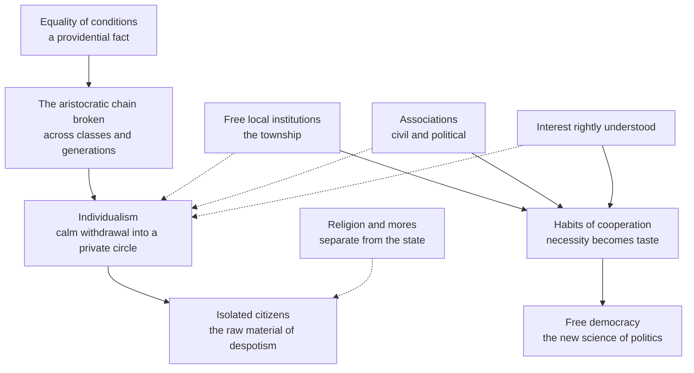

# History of Political Thought · Lesson 6.2: Tocqueville I: equality of conditions

> ⏱ ~15 min · Module 6: The nineteenth century: freedom, capital and democracy · Builds on: [5.1 Montesquieu](05-01-montesquieu-the-spirit-of-the-laws.md), [5.2 *The Federalist*](05-02-the-federalist-faction-and-the-extended-republic.md) · Unlocks: [6.3 Tocqueville II](06-03-tocqueville-tyranny-of-the-majority-and-soft-despotism.md)

## Why this matters

Every modern worry about "civic life" (people bowling alone, the decline of the town meeting, the church and the club as schools of citizenship) is borrowing from one book: *Democracy in America*, published in two volumes in 1835 and 1840 by a French aristocrat who had spent nine months in the United States in 1831-32, officially to study prisons. Alexis de Tocqueville was not writing a travel book or a hymn to America. He was writing to France about France's future, using America as the place where that future had already arrived. This lesson is his diagnosis of what equality does to people; [6.3](06-03-tocqueville-tyranny-of-the-majority-and-soft-despotism.md) is his account of the despotisms it makes possible.

## The idea

Start with what Tocqueville means by his master term. **Equality of conditions** (*égalité des conditions*) is not equal wealth and not equal voting rights. It is a *social state*: no hereditary ranks, no one born into a station, a society where anyone's family can rise or fall within a generation and where people therefore think of each other as the same kind of person. The Introduction opens by saying nothing in America struck him more than this, and that it shapes everything else: opinion, law, government, habits.

Then the grand claim. Look at France every fifty years from the eleventh century, he says, and the noble has always gone down the ladder while the commoner has gone up. The Crusades, firearms, printing, the post, even Protestantism all pushed the same way, often without anyone meaning them to. So the spread of equality is a **providential fact**: universal, durable, beyond human interference. The question is no longer *whether* democracy but *which* democracy, free or despotic. Hence the Introduction's famous line: "A new science of politics is indispensable to a new world" (Reeve).

Now the mechanism, from Volume II. In an aristocracy everyone was tied to someone. A peasant owed a lord, a lord owed a king, a family knew its ancestors for centuries and planned for its descendants. Equality cuts all of that:

> "Aristocracy had made a chain of all the members of the community, from the peasant to the king: democracy breaks that chain, and severs every link of it." (Vol. II, Part 2, ch. 2, Reeve)

What remains are people with enough education and property to get by alone, who owe no one and expect nothing from anyone. They are not selfish in the old sense. They simply draw a small circle of family and friends and let public life look after itself. Tocqueville needs a new word for this, and uses one that was then barely a word at all: **individualism**. He is careful to distinguish it from egotism, the old vice of loving oneself above all things. Individualism is quieter, and it grows with equality.

The surprise is his answer. The Americans, he found, were more equal than anyone and yet crowded into public life. They had been handed local self-government, and they formed associations for everything, from building churches to sending missionaries to the antipodes. Tocqueville's point about the township, the lowest rung of that self-government, is the key to the whole book:

> "local assemblies of citizens constitute the strength of free nations. Town-meetings are to liberty what primary schools are to science" (Vol. I, ch. 5, Reeve)

Freedom has to be *learned*, and it is learned locally, by practice.

## The argument

The diagnosis and the remedy, in Tocqueville's terms (Introduction; Vol. I, chs. 3, 5, 17; Vol. II, Part 2, chs. 2-8).

1. **The equality of conditions is advancing throughout Christendom and cannot be stopped.** *In words:* the hereditary ranks are finished; the choice left is what kind of democracy to build.
2. **In aristocratic society each person is bound to others across classes (by dependence and obligation) and across time (by lineage).** *In words:* the old order was unjust in many ways, but no one was alone in it.
3. **Equality dissolves both bonds: families rise and fall, classes intermingle, and many people become self-sufficient.** *In words:* when no one depends on anyone, no one feels bound to anyone.
4. **So equality breeds individualism: a calm withdrawal into a private circle, leaving society at large to itself.** *In words:* the democratic citizen is not greedy, just absent.
5. **Isolated citizens suit despotism, which asks only that subjects not combine.** *In words:* the danger of individualism is political, not only moral (Vol. II, Part 2, ch. 4).
6. **Free institutions (local self-government especially) force citizens to cooperate, and what they first do by necessity becomes a habit and then a taste.** *In words:* running your own township teaches you that your interest is tied to your neighbor's.
7. **Associations, civil and political, give equal and individually weak citizens the power a lord once had; political associations are schools where people learn the general art of association (ch. 7).** *In words:* many small people acting together replace one great one.
8. **The doctrine of *interest rightly understood* teaches that serving others serves oneself; it yields no heroic sacrifice but many small daily acts of self-denial and habits of self-command (ch. 8).** *In words:* Americans explain their public spirit as enlightened self-interest, and the explanation keeps them public-spirited.
9. **Religion, though it takes no direct part in government, restrains what people dare to conceive and so is the foremost of American political institutions; it is strong there because church and state are separate (Vol. I, ch. 17).** *In words:* the law lets Americans do anything; belief keeps them from wanting to do everything.
10. **∴ Equality can be free rather than despotic, but only through mores, local liberty and association, which a new political science must study and protect.** *In words:* democracy's cure is more participation, not less equality.

## Argument map

Solid arrows are the causal chain; dashed arrows are the counterweights pushing back against it.

## Worked examples

**Example 1 (clean): a bridge.** Two villages of equal, independent farmers need a bridge. In village A a distant prefect decides and builds it; the farmers pay taxes and never meet. In village B the farmers must vote the money at a town meeting, name overseers and argue about the route.

Run the argument. Equality (P3) makes both sets of farmers self-sufficient and inclined to withdraw (P4). In A nothing counters that: the bridge appears, and each farmer's circle stays closed. In B the farmers are forced to cooperate (P6). The first meeting is a chore, but the tenth is a habit, and by then each has learned that his road is also his neighbor's. Tocqueville's prediction is that B's farmers will also be the ones who found a school or a fire company unprompted (P7), because the art of association, once learned for one purpose, transfers. Note what the example does *not* say: that B builds a better bridge. Tocqueville concedes that a private or local undertaking often succeeds less well than the state would have (Vol. I, ch. 5); the gain is in the citizens it makes.

**Example 2 (hard): the three races.** Equality of conditions is Tocqueville's primary fact about America. Yet the long final chapter of Volume I (ch. 18) describes Native nations being dispossessed and destroyed, and a South built on slavery. Does the thesis survive?

Tocqueville does not hide the problem. He argues that slavery dishonors labor and corrupts the South, contrasts the two banks of the Ohio, and observes that race prejudice seems stronger in the states that have abolished slavery than in those that keep it, and strongest where slavery never existed. He foresees terrible conflict. What he does not do is fold these facts back into the equality thesis: the chapter sits outside the main argument, almost as a second book.

Readers divide on what that means, and the lesson takes no side. One reading: equality of conditions describes the *white* Anglo-American social state, so the book is candid that American democracy is a democracy of some, and Tocqueville's framework explains why equality among whites hardened the line against others. Another: a thesis about "the" American social state that has to quarantine its largest exception has been confined to a part of its evidence. Either way, the exegetical point is fixed: equality of conditions is a claim about the dissolution of hereditary *ranks among citizens*, and Tocqueville himself marks where it stops. (The same care applies to women: Vol. II, Part 3, ch. 12 argues that Americans hold the sexes equal in worth while assigning them separate spheres.)

## Watch out

- **Anachronism: "individualism" is not self-reliance.** In later American usage the word turned into a compliment. For Tocqueville it names a *disorder* of democratic societies: withdrawal from public life, rooted in "erroneous judgment" (ch. 2). Reading his chapter as praise of rugged independence reverses it.
- **Equality of conditions is not equality of wealth.** Tocqueville saw great American fortunes. His claim concerns rank, mobility and how people regard one another, and it concerns a social state, not a form of government.
- **"Democracy" names the social state first.** He can speak of democratic peoples under despotic rulers. Don't collapse it into elections.
- **Interest rightly understood is not an endorsement of egoism, nor a sneer.** He calls it the moral doctrine best suited to his age because it is attainable; he also says it cannot by itself make anyone virtuous.

## One-liner

> Equality unties the chain that bound everyone to someone; Tocqueville's democracy stays free only if citizens relearn, in townships and associations, the ties that rank once gave them for free.

## Problems

**P1 (🟢) *(Exegetical.)*** Close reading. Tocqueville's definition in Vol. II, Part 2, ch. 2 (Reeve), abridged:

> "Individualism is a mature and calm feeling, which disposes each member of the community to sever himself from the mass of his fellow-creatures ... Egotism originates in blind instinct: individualism proceeds from erroneous judgment more than from depraved feelings"

A reader says: "Tocqueville is just giving selfishness a polite democratic name." (a) Which words in the passage refute that reading, and what distinction do they draw? (b) Explain why the phrase "erroneous judgment" matters for the *remedies* Tocqueville later proposes (Vol. II, Part 2, chs. 4 and 8). 100 words or fewer in total.

**P2 (🟡) *(Exegetical (a) · Evaluative (b).)*** (a) Reconstruct, in 5-7 numbered premises and a conclusion, Tocqueville's argument in Vol. II, Part 2, ch. 2 that equality of conditions produces individualism, keeping its two strands (bonds across *classes* and bonds across *generations*) distinct. (b) Flag the premise you think is weakest and say what evidence would test it. Any verdict. 150 words or fewer for (b).

**P3 (🔴, optional) *(Exegetical.)*** Montesquieu held that popular government needs *virtue* as its spring (*Spirit of the Laws* III.3), defining it as love of the laws and the country, which requires a continual preference of the public interest to one's own (IV.5). Tocqueville says the Americans sustain their democratic republic largely by the doctrine of interest rightly understood (Vol. II, Part 2, ch. 8). Name the single premise one must deny, and say what kind of evidence would move a defender of each side. Consider Montesquieu V.6 before you answer. 150 words or fewer.

Solutions

**P1** *(Exegetical — strict.)*

**Must hit, strict:**
- (a) **"mature and calm feeling"** set against **"blind instinct"**, and **"erroneous judgment"** set against **"depraved feelings"**. The distinction is egotism (a passion, as old as the world) versus individualism (a reasoned, quiet withdrawal, new with democracy). Selfishness is the egotism side; the passage denies individualism is that.
- (b) Because individualism is a mistake of the mind more than a vice of the heart, it can be *corrected by experience and instruction*: free institutions show citizens their dependence on one another (ch. 4), and interest rightly understood teaches that serving others serves oneself (ch. 8). A vice of instinct would need repression; an error needs education.

**Wrong turns:** treating "calm" as praise (it marks how quietly the disorder spreads); forgetting that Tocqueville also says individualism ends by being absorbed into egotism, so the two are distinct but not unrelated.

**Model answer:** (a) "Mature and calm feeling" and "erroneous judgment" separate individualism from egotism, which comes from "blind instinct." Egotism is a passionate self-love found in every age; individualism is a sober, reasoned withdrawal from public life, and new. (b) If the root is a false judgment, the cure is a truer one. So Tocqueville's remedies educate: local liberty makes citizens discover their mutual dependence, and interest rightly understood gives them a correct account of their own interest that includes their neighbors.

---

**P2** *(Exegetical (a) · Evaluative (b).)*

**Must hit, strict (a):**
- Class strand: in aristocracies classes are fixed and distinct, and each person sees someone above whose protection he needs and someone below whose help he may claim; so each is tied to others outside his own circle. Equality intermingles classes and their members become indifferent to one another.
- Time strand: aristocratic families keep their station for centuries, so a person feels bound to ancestors and descendants; in democracies families rise and fall constantly, and the thread linking generations breaks.
- A self-sufficiency premise: equality multiplies people with enough education and fortune to meet their own wants, who owe nothing and expect nothing from anyone.
- Conclusion: each is thrown back on himself and forms a small circle, leaving society at large to itself: individualism, spreading in the same ratio as equality.

**Must hit, any verdict (b):** name one premise; say what observation would count for or against it (e.g. whether mobile, equal societies really show less concern for descendants; whether self-sufficiency, not equality as such, does the work).

**Wrong turns:** citing majority tyranny or centralization (6.3's argument, not this one); making greed the mechanism.

**Model answer (a):** P1 In aristocracies classes are fixed and each person depends on those above and is owed help by those below. P2 Aristocratic families hold their station for generations, so each feels tied to ancestors and descendants. P3 Equality mixes classes, whose members grow indifferent to one another. P4 Under equality families constantly rise and fall, so the link between generations breaks. P5 Equality multiplies people able to satisfy their own wants, who owe and expect nothing. ∴ Each withdraws into a private circle and leaves society to itself; individualism grows with equality.

**Model answer (b), one of several:** P5 is weakest. Self-sufficiency is doubtful for wage earners who depend on employers; if dependence persists without equality of rank, the test is whether dependent but equal people withdraw less. Comparing civic participation across groups with similar status but different economic independence would bear on it.

---

**P3** *(Exegetical — strict on identifying one premise.)*

**Must hit, strict:**
- The crux: **whether a free popular government requires citizens who prefer the public interest to their own, or whether a correctly understood self-interest, formed into habit by institutions, can do that work.** Montesquieu affirms the first (IV.5); Tocqueville, describing America, denies it: interest rightly understood yields no great sacrifice but disciplines citizens into regularity and self-command, and he doubts aristocratic ages were really more virtuous.
- V.6 complication: Montesquieu allows that a *commercial* democracy can hold great private fortunes without corruption, since the spirit of commerce brings frugality, moderation, work and order. So the gap is narrower than "virtue vs interest"; the dispute is over whether self-interest can supply the *motive* or only a helpful disposition alongside it.
- Evidence: whether large commercial republics survive without self-renouncing patriotism (history; 5.2's extended republic); whether the habits formed by interest rightly understood shade into real public spirit, which Tocqueville himself admits Americans show more than their doctrine allows.

**Wrong turns:** saying Tocqueville thinks mores don't matter (ch. 17 makes them decisive); treating Montesquieu's *virtue* as Christian or moral virtue (his own note: it is political virtue, love of country and equality).

**Model answer:** The premise in dispute: a democratic republic lasts only if citizens habitually put the public good ahead of their own. Montesquieu affirms it; virtue, the love of laws and country, is democracy's spring. Tocqueville's America denies it: citizens are held to public life by an enlightened self-interest, turned by free institutions into habits of cooperation. V.6 narrows the gap, since Montesquieu grants commercial democracies an ordered spirit of frugality and moderation; but he still makes love of equality the spring. A Montesquieuan would be moved by republics that endure on self-interest alone; a Tocquevillian by evidence that American public spirit depended on the disinterested impulses Tocqueville says Americans refused to credit.

## Flashback

**From Lesson 5.4 (Wollstonecraft: rights, virtue and the education of women):** *(Apply to a hard case: exegetical (a) · evaluative (b).)* A London household in 1792. The footman is punctual, polite and scrupulously honest in his employer's sight, because his whole future hangs on the written character she will give him when he leaves. Out of her sight he flatters the steward and pockets tips he is forbidden to take. She tells her friends this proves servants are sly by nature and must be watched. (a) Run Wollstonecraft's argument on the case: which of her premises apply, and what does she say about the footman's honesty and about the employer's inference? (b) Applied consistently, does her argument commit her to demanding independence for servants too? Take a side, and say where her text stops settling it. Three sentences or fewer per part.

Solution

**Must hit, strict (a):**
- The honesty is not virtue: it is produced by fear of one person's displeasure, not by his own reason seeing why honesty is a duty (premise 3). It is good behaviour on loan, and it lapses exactly where the master's eye does.
- The flattery and petty theft are what dependence predicts: whoever lives by one person's favour learns to manage people rather than to judge rightly (premise 5).
- The employer's inference is the caged-bird move: she takes the effect of station for evidence of nature (premise 6), and so cites the faults her arrangement produced as the reason to keep it.

**Must hit, any verdict (b):**
- Use her sense of *independence*: not living under another's arbitrary will, which is not the same as owning property or being self-supporting.
- Either extend the argument (the mechanism is the same, and she already says hereditary rank corrupts men as dependence corrupts women) or limit it (for instance: wages earned by one's own industry are the kind of acquisition she approves, so the corrupting element may be the arbitrary character reference rather than employment as such).
- Locate the gap: her positive program concerns women's education and civil standing, and the text does not settle whether a paid, terminable service relation counts as the dependence of premise 5.

**Wrong turns:** reading her as calling servants base by nature, which is the employer's view, not hers. In (b), treating independence as economic self-sufficiency and concluding she must want every servant to own land.

**Model answer:** (a) His honesty is compliance, not virtue: it comes from dependence on her favour, not from his own reason, so it stops where her supervision stops. The flattery and pilfering are the cunning dependence breeds, and the employer's conclusion takes the effect of his station for his nature. (b) Yes, in principle: independence for her means freedom from another's arbitrary will, and a man whose livelihood rides on one woman's say-so is under it, just as she says rank corrupts men as well as women. But she proposes no remedy for servants, and she approves what industry earns, so the text leaves open whether wage service is itself the problem or only the arbitrary power attached to it. A reader who says the reference system, not the wage, is the corruption has the same textual footing.

## Connections

- **Backward:** Montesquieu ([5.1](05-01-montesquieu-the-spirit-of-the-laws.md)) gave Tocqueville his method, laws read through mores and social state, and the idea of intermediate powers standing between the individual and the sovereign; associations are Tocqueville's democratic substitute for Montesquieu's nobility. *Federalist* 10 ([5.2](05-02-the-federalist-faction-and-the-extended-republic.md)) treated combination as the danger (faction); Tocqueville treats it as the cure. Hegel's corporation ([6.1](06-01-hegel-freedom-realized-in-the-state.md)) answers the same problem of atomized civil society from above, where Tocqueville's associations answer it from below.
- **Forward:** [6.3](06-03-tocqueville-tyranny-of-the-majority-and-soft-despotism.md) turns the isolated citizen of P5 into the subject of the majority and of soft despotism. Mill reviewed both volumes and built his case for active citizens on them ([6.4](06-04-mill-representative-government.md)). The sociology of civic association and "social capital," which leans heavily on Tocqueville, belongs to [`social-theory`](../../social-theory/syllabus.md).
- **Sideways:** interest rightly understood is close to what [`game-theory-refresher` 2.3](../../game-theory-refresher/lessons/02-03-repeated-games-folk-theorem.md) formalizes: cooperation sustained by self-interest in a repeated game, with the township as the repeated interaction (a modern gloss, not Tocqueville's frame). Catholic subsidiarity, the priority of smaller communities over the state, is often read alongside his associations; [`catholic-social-teaching`](../../catholic-social-teaching/syllabus.md) owns it. Whether participation is intrinsically valuable or only instrumentally is argued in [`political-philosophy`](../../political-philosophy/syllabus.md).
