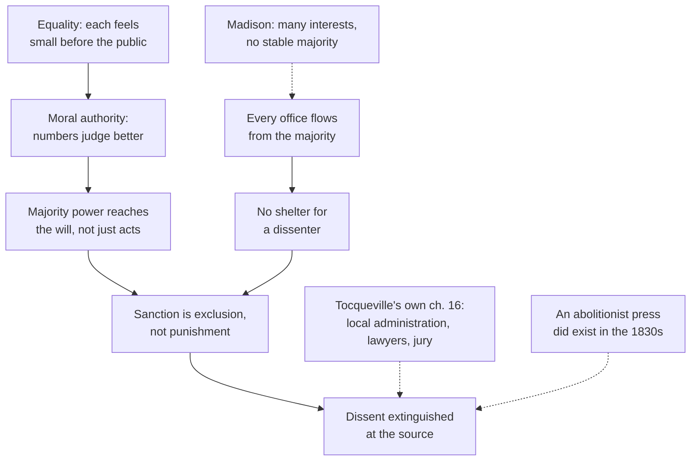

# History of Political Thought · Lesson 6.3: Tocqueville II: tyranny of the majority and soft despotism

> ⏱ ~15 min · Module 6: The nineteenth century: freedom, capital and democracy · Builds on: [6.2 Tocqueville I: equality of conditions](06-02-tocqueville-equality-of-conditions.md) · Unlocks: [6.4 Mill: representative government](06-04-mill-representative-government.md)

## Why this matters

Tocqueville is the friend of democracy who wrote its most famous warnings. Twice he named a danger no earlier theorist had quite seen: in 1835, a majority that rules not only laws but minds; in 1840, a mild, elected, all-providing power that governs people by relieving them of the need to govern themselves. Both phrases, "tyranny of the majority" and the "soft despotism" later readers built from his chapter, still circulate in arguments about conformity, bureaucracy and self-government. This lesson reconstructs what he actually argued, which is more precise than the slogans.

## The idea

Lesson 6.2 gave you the engine: **equality of conditions**. As ranks dissolve, people become alike, and each withdraws into a private circle (individualism). This lesson follows two things that engine can produce.

**Danger 1 (Vol. I, 1835): tyranny of the majority.** Old tyrannies worked on bodies: prison, exile, the scaffold. A king could silence a writer but not make anyone agree with the king. A democratic majority has something no king had: it is the source of every institution (legislature, executive, jury, often the judges) *and* it carries moral authority, because among equals it seems obvious that more heads judge better than one. So when the majority has made up its mind, the dissenter does not need to be punished. He is simply dropped: no votes, no customers, no friends willing to be seen with him. Soon no one wants to dissent at all.

**Danger 2 (Vol. II, 1840): a new despotism.** By the second volume Tocqueville says further reflection has not lessened his fears but changed their object. Now picture a crowd of equal, private individuals, each absorbed in small comforts, and above them a single guardian power that secures their pleasures, manages their affairs and asks only that they not trouble themselves. It does not break wills; it softens them. It can even be elected: people, he says, "console themselves for being in tutelage by the reflection that they have chosen their own guardians."

| | Tyranny of the majority | The tutelary power |
|---|---|---|
| Agent | the majority, through opinion and every office | a centralized administration |
| Mood | passionate, intolerant | mild, provident |
| Target | the dissenting mind | the habit of self-government |
| Needs | democratic institutions with no counterweight | equality plus individualism plus administrative centralization |

The hinge between them is a distinction from Vol. I, ch. 5. **Governmental centralization** concentrates the power over interests common to the whole nation (general laws, foreign relations). **Administrative centralization** concentrates the power over local and particular interests (the business of townships). Tocqueville thinks a nation cannot be secure without the first, and that the second enervates a people by draining its public spirit. America in the 1830s had the first and almost none of the second.

**Chapter numbers.** Reeve's translation, as usually reprinted, numbers Vol. I's chapters straight through: ch. 15 on the majority's power is Vol. I, Part 2, ch. 7 in modern editions; ch. 5 on centralization is Part 1, ch. 5.

## Source

From Vol. I, ch. 15 (Reeve), in the section on the power the majority exercises over opinion:

> I know no country in which there is so little true independence of mind and freedom of discussion as in America.

A page later he states the contrast with older despotism in one line: under a single despot the body was attacked to subdue the soul, but in democratic republics "the body is left free, and the soul is enslaved."

Notice what the first sentence compares. Not *laws*: America's press and religious liberty were legally broad, and he knew it. The claim is about *independence of mind*, the willingness to think apart. And "true" concedes that formal freedom of discussion exists; what is missing is the real thing.

## The argument

**The majority's power over opinion (Vol. I, ch. 15), in Tocqueville's terms.**

1. **In American democracy every power flows from the majority.** Public opinion is the majority; the legislature obeys it; the executive is its tool; the jury is the majority judging; in some states it elects the judges. *In words:* there is no office a wronged minority can appeal to that the majority does not already occupy.
2. **The majority's authority is moral as well as physical.** It rests on the belief that there is more wisdom in many than in one, equality applied to intellect, and that the interests of the many outrank those of the few. *In words:* people obey the majority because they half-believe it is right, not only because it is strong.
3. **Among equals, that belief is hard to resist.** Alike in means of judging, no one trusts any single neighbor over himself, but each feels insignificant against the mass (Vol. II, Part 1, ch. 2). *In words:* equality removes every authority except the public.
4. **A king's power controls actions but not the will; the majority's reaches the will.** *In words:* a subject can obey and privately disagree; a democrat finds his private judgment already occupied.
5. **In Europe a dissenter finds shelter somewhere:** the people against an absolute king, the throne or the aristocracy against a popular faction. Where democratic institutions are organized as in America there is one sole authority. *In words:* divided societies give heretics hiding places; a uniform one gives none.
6. **The sanction is exclusion, not death.** The writer who crosses the line keeps life and property but loses career, esteem and company, and those who privately agree abandon him in silence. *In words:* the penalty is social death, administered by everyone.
7. **∴ Within the majority's barriers one may write anything; beyond them, few even wish to.** *In words:* the tyranny succeeds by removing the desire to dissent, which the Inquisition never managed.

**The new despotism (Vol. II, Part 4, ch. 6), in brief.** Equality makes people alike and isolated; isolation makes them want a power that secures their comforts; administrative centralization supplies one; its small, uniform rules gradually take from each person the use of his own will; periodic election of the guardians does not restore that use, because people who never govern their small affairs lose the capacity to choose well in great ones. He judges it far preferable to concentrated power in irresponsible hands: election diminishes the evil but does not remove it.

**Remedies.** Vol. I, ch. 16 lists what actually softened the majority in America: decentralized administration (townships and counties act as breakwaters, since the majority must execute its will through local agents it cannot direct), the legal profession as a democratic substitute for aristocracy, and the jury. Vol. II, Part 4, ch. 7 generalizes: secondary bodies of elected citizens; associations as artificial substitutes for the powerful persons of an aristocracy, which cannot be crushed without an outcry; a free press; courts that must hear a single injured person; and a respect for forms and individual rights. Religion and mores, from 6.2, run underneath all of these.

**The Old Regime and the Revolution (1856)** turns the lens on France: administrative centralization under the royal council and its provincial intendants was built by the monarchy, not invented by 1789. The Revolution swept away the aristocracy and corporations that had limited it and left the administrative machine standing for whoever came next.

## Argument map

## Worked examples

**Example 1 (clean: Tocqueville's Pennsylvania footnote).** In a note to ch. 15, Tocqueville asks a Pennsylvanian why, in a state founded by Quakers, no free Black voters appeared at the polls. They have the legal right, he is told, but stay away for fear of being maltreated, and the magistrates cannot protect them against the majority's prejudice. Run premise 1:

- The **law** grants the vote. No legislative tyranny.
- **Execution** depends on officers answerable to the majority, and on a militia that is the majority under arms.
- **Redress** would go to a jury, which is the majority.
- Result: a civil right that is useless in exactly Tocqueville's sense, kept on paper and cancelled by opinion.

The case also shows why he separates tyranny from arbitrary power: the oppression here uses no unjust statute at all.

**Example 2 (hard: does Madison's multiplicity answer it?).** [Lesson 5.2](05-02-the-federalist-faction-and-the-extended-republic.md) argued that an extended republic has too many interests for any one majority faction to form. If so, where does Tocqueville's single, irresistible majority come from?

The argument strains here, and readers divide. One line of defense: Madison's majority is a coalition of *interests*; Tocqueville's is a community of *opinion*. Merchants, farmers and Methodists can disagree about tariffs while sharing the same assumptions about what may be said, and diversity of interest does nothing to break that. On this reading the two authors are not in conflict; Tocqueville found a danger Madison's mechanism was never built to catch. The opposing line: Tocqueville generalized from his travels, the abolitionist press (Garrison's *Liberator* began in 1831) shows that stubborn dissent survived, and he himself locates the worst of the danger in the state governments and lists the causes softening it. His own caveat supports caution: he says he does not claim tyrannical abuses were frequent in America, only that no sure barrier against them existed. The exegetical point is narrower than either reading: ch. 15 is a claim about **missing barriers**, not a report of constant persecution.

## Watch out

- **Tyranny of the majority is not majority rule.** Tocqueville grants the majority the right to command and thinks some one power must predominate in any society (he calls the mixed constitution a chimera). His complaint is a power with nothing to retard it, and above all its hold on opinion.
- **"Soft despotism" is a later label.** Tocqueville says the old words *despotism* and *tyranny* do not fit and that he cannot name the thing, only describe it. Speaking of "Tocqueville's theory of soft despotism" is fine as shorthand, but the chapter's own terms are administrative or democratic despotism.
- **Anachronism trap: the tutelary power is not the twentieth-century welfare state.** No such state existed in 1840; his model is centralized administration of the French kind, extended by democratic demands. Whether his warning fits modern social provision is a live question for [`political-philosophy`](../../political-philosophy/syllabus.md), not something the text settles.
- **Do not confuse the two centralizations.** Tocqueville wants a strong central *government*; his fear is central *administration* of local affairs. Reading him as simply anti-state gets him wrong.

## One-liner

> Tocqueville feared democracy would oppress not with chains but with unanimity, and then with kindness: first a majority that leaves the body free and captures the mind, then an elected guardian that spares citizens all the trouble of governing themselves.

## Problems

**P1 (🟢) *(Exegetical.)*** From Vol. I, ch. 15 (Reeve):

> The authority of a king is purely physical, and it controls the actions of the subject without subduing his private will; but the majority possesses a power which is physical and moral at the same time

(a) Reading A: the majority oppresses opinion as a king does, only more efficiently. Reading B: the majority's power differs in kind because it reaches the will. Reading C: the majority's power is merely social pressure, not real power. Which reading do the words support, and which words rule out each of the others? (b) In three or four numbered premises, reconstruct why a European dissenter could find shelter and an American one, on Tocqueville's account, could not. 150 words or fewer in total.

**P2 (🟡) *(Exegetical.)*** From an invented op-ed:

> "Our state is living under the tyranny of the majority. Last month the governing party passed a school-funding bill by a single vote over the fierce objections of the minority. When 51 percent can impose its will on 49 percent, freedom is dead. The only cure is to require a two-thirds vote for every law."

(a) Which of Tocqueville's ideas is the author borrowing? (b) Name two things the op-ed has changed or dropped from Vol. I, ch. 15, pointing to the text for each. (c) Name one remedy Tocqueville himself points to that the op-ed ignores. 150 words or fewer.

**P3 (🔴, optional) *(Exegetical (a) · Evaluative (b).)*** Classify each measure as governmental centralization, administrative centralization, or neither, by the definitions of Vol. I, ch. 5: (i) a national parliament sets one criminal code for the whole country; (ii) a ministry in the capital must approve every village's decision to repair its bridge; (iii) a national statute requires every town to maintain a school, but the towns elect their own school committees, levy the tax and run the schools. (b) Case (iii) involves a central command about a local matter. Does it strain the distinction, or does the distinction handle it? Any verdict. 150 words or fewer for (b).

Solutions

**P1** *(Exegetical — strict.)*

**Must hit, strict (a):** Reading B. "Purely physical … without subduing his private will" sets the king's power up as reaching actions only; the contrast "but the majority" and the added word "moral" mark a difference in kind, which rules out A (a king made more efficient would still leave the will untouched). "Physical and moral at the same time" rules out C: the majority keeps the physical power too; its moral authority is added, not substituted.

**Must hit, strict (b):** P1. In Europe power is divided among throne, aristocracy and people. P2. A dissenter attacked by one can be protected by another (the people against an absolute king; the throne or aristocracy in a free country). P3. In America every office and public opinion itself derive from the majority, one sole authority. ∴ No rival power exists to shelter him.

**Wrong turns:** choosing C because the sanction is social exclusion (the passage insists the power is also physical); reconstructing (b) as "America has worse laws on speech," which Tocqueville does not claim.

**Model answer:** (a) B. "Purely physical … without subduing his private will" limits the king to actions; "but the majority" introduces a power that is "physical and moral at the same time," so it does more than a king can (not A) and is still real force (not C). (b) P1 Europe divides power among king, nobles and people. P2 Whoever one of them attacks, another can shelter. P3 In America every office and opinion itself come from the majority. ∴ There is nowhere to hide.

---

**P2** *(Exegetical — strict.)*

**Must hit, strict (a):** the tyranny of the majority from Vol. I, ch. 15.

**Must hit, strict (b), any two of:**
- **Majority rule is not the complaint.** Tocqueville says he does not contest the majority's right of commanding, and he holds some one power must predominate. A bill passing by one vote is the normal exercise of that right.
- **The opinion mechanism is dropped.** His central charge concerns power over thought: dissent silenced by exclusion, independence of mind lost. The op-ed is about a vote count.
- **Injustice, not narrowness, is the test.** He appeals from an unjust law to the law of justice; the op-ed treats any contested law as tyranny whatever its content.
- **Party context reversed.** He observed that American parties accept the majority's right because each hopes to be the majority later.

**Must hit, strict (c):** any one of: an independent executive and judiciary (he says a government so built would stay democratic without risk of tyranny); decentralized administration; the legal profession; the jury; associations; a free press. A supermajority rule is not among his remedies; his aim is obstacles that retard and moderate a predominant power, not a veto for the minority.

**Wrong turns:** crediting Madison instead of Tocqueville for "tyranny of the majority" in (a) (Madison's worry is related, but the phrase and the ch. 15 argument are the borrowing); arguing that supermajorities are bad policy, which grades the op-ed, not the borrowing.

**Model answer:** (a) Tocqueville's tyranny of the majority. (b) First, Tocqueville does not object to majorities commanding: he grants the majority's right to govern and thinks some power must predominate, so a one-vote win is not tyranny. Second, the op-ed drops his real target, the majority's hold on opinion, where the dissenter is excluded until no one dares to think apart. (c) His remedies are counterweights that slow and moderate the majority: an independent judiciary and executive, local administration, lawyers and juries, associations, a free press. A minority veto is not among them.

---

**P3** *(Exegetical (a) · Evaluative (b).)*

**Must hit, strict (a):** (i) governmental: a general law common to the whole nation. (ii) administrative: the direction of a local interest brought together in one place. (iii) the command is governmental (a general law); the execution is decentralized, so no administrative centralization. Answers calling (iii) "mixed" pass only if they say the administration stays local.

**Must hit, any verdict (b):** state the definitions precisely (the *object* is common vs local interests; centralization means the power is gathered in one place); identify what in (iii) is central (the rule) and what is local (who decides and executes); then judge whether a general law about a local matter blurs the line. Either verdict passes if it rests on those definitions.

**Wrong turns:** treating any national law touching schools as administrative centralization; forgetting that Tocqueville *approves* strong central government.

**Model answer (b), one of several:** The distinction handles it, with a seam showing. Tocqueville classifies by where the power to *direct* an interest sits. In (iii) the capital sets a general obligation, but the local interest (which teacher, what tax, which building) is still directed by the town, as New England townships ran their own affairs under state law. The seam: a general law can be written so tightly that it leaves towns nothing to decide, and then a governmental command does administrative work. The line depends on how much discretion the law leaves, a matter of degree.

## Flashback

**From Lesson 6.1 (Hegel: freedom realized in the state):** *(Exegetical.)* Close reading and application. In *Philosophy of Right* § 268 (Dyde), Hegel calls political disposition, or patriotism, a confidence: the consciousness that my particular interest is contained and preserved in the state's end, so that the state is for me "not another," and in that consciousness I am free. The note continues:

> By patriotic feeling is frequently understood merely a readiness to submit to exceptional sacrifices or do exceptional acts. But in reality it is the sentiment which arises in ordinary circumstances and ways of life

(a) Which reading do the words support? **(i)** Hegel's patriot is above all the one ready to die for the state; ordinary life is private and apolitical. **(ii)** Patriotism is chiefly an everyday trust in institutions, and heroic readiness is secondary to it. Name the deciding words. (b) Two invented citizens. A clerk pays her taxes, takes a dispute to court without thinking of bribes, walks home safely at night without wondering why, and has never pictured any sacrifice for her country. A man toasts the nation and swears he would die for it, but dodges his taxes and calls the courts a joke. Which has patriotism in § 268's sense, what is missing in the other, and why does Hegel tie this sentiment to freedom? Three sentences or fewer per part.

Solution

**Must hit, strict (a):** reading (ii). "Frequently understood merely" marks the sacrifice view as a common but partial understanding; "But in reality" corrects it; "ordinary circumstances and ways of life" locates patriotism in everyday conduct. The rest of the note makes the order explicit: the readiness for exceptional effort is *based on* this everyday consciousness, not the other way round.

**Must hit, strict (b):**
- The clerk: her conduct accords with the institutions and she trusts that her interest is preserved in them, which is the confidence § 268 describes, even unreflective (it "may pass over" into insight, but need not have).
- The man: his patriotism is a feeling detached from the institutions, which § 268 calls mere opinion; the note says people would rather be magnanimous than merely right, and persuade themselves of extraordinary patriotism to spare themselves the true sentiment.
- Freedom: because the state is "not another," the clerk does not experience its laws as an alien fence; this is the lesson's freedom as being at home in one's institutions (ethical life, step 5), not the absence of constraint.

**Wrong turns:** (a) choosing (i) because Hegel elsewhere makes risking life in war a duty (§ 324): the note does not deny that readiness, it grounds it in everyday trust. (b) Faulting the clerk for lacking reflection or zeal; saying the man is the true patriot because he would sacrifice most. Reading "confidence" as mere passivity: it is a will that has become custom and stands on the truth of the institutions.

**Model answer:** (a) Reading (ii). The sacrifice view is what patriotism is "frequently understood merely" to be; "But in reality" it is a sentiment arising "in ordinary circumstances and ways of life," and the note goes on to say exceptional readiness rests on it. (b) The clerk has patriotism in Hegel's sense: her everyday conduct accords with the institutions, and she trusts that her own interest is preserved in them, even without reflecting on it. The man has only opinion, a sentiment cut loose from the institutions it praises, and Hegel's note diagnoses him exactly: people prefer to feel magnanimous rather than merely do right. The sentiment is freedom because in it the state is not an alien power over the clerk but the shape of her own will, which is what being at home in ethical life means.

## Connections

- **Backward:** Equality of conditions, individualism and associations come from [6.2](06-02-tocqueville-equality-of-conditions.md); this lesson shows what they protect against. Madison's majority faction and extended republic ([5.2](05-02-the-federalist-faction-and-the-extended-republic.md)) are the direct foil; ch. 15 even quotes *Federalist* 51, which Tocqueville attributes to Hamilton (the attribution to Madison now prevails). Montesquieu's intermediate powers ([5.1](05-01-montesquieu-the-spirit-of-the-laws.md)) are what associations and lawyers replace in an age without aristocracy. Plato's democracy that breeds tyranny ([1.2](01-02-plato-against-democracy-and-the-second-best-city.md)) is the old fear; Tocqueville's version is that the tyranny may be the majority itself. His dismissal of mixed government as a chimera rejects the tradition of Aristotle's polity ([1.4](01-04-aristotle-constitutions-citizens-and-the-polity.md)) and Cicero ([2.1](02-01-cicero-the-commonwealth-and-natural-law.md)).
- **Forward:** Mill reviewed both volumes and took over "tyranny of the majority" in *On Liberty*; [6.4](06-04-mill-representative-government.md) asks how representative government can cultivate the active citizens Tocqueville feared would vanish. Module 6's boss problem close-reads the tutelary-power passage against Marx's account of the state ([6.6](06-06-marx-the-state-revolution-and-after.md)).
- **Sideways:** Mill's case against social tyranny and for free discussion is [`political-philosophy`](../../political-philosophy/syllabus.md) 3.2 and 3.4. The principle of subsidiarity in [`catholic-social-teaching`](../../catholic-social-teaching/syllabus.md) 3.3 is a different doctrine with a family resemblance to the case against administrative centralization; do not equate them. Associations as sociology, and the social-capital tradition built on them, belong to [`social-theory`](../../social-theory/syllabus.md) 6.1; central and local government as working institutions to [`political-institutions`](../../political-institutions/syllabus.md).
