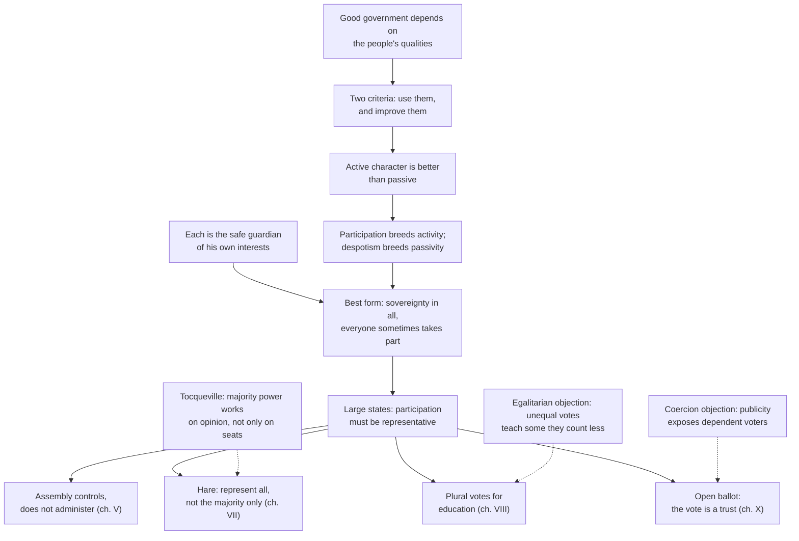

# History of Political Thought · Lesson 6.4: Mill: representative government

> ⏱ ~15 min · Module 6: The nineteenth century: freedom, capital and democracy · Builds on: [6.3 Tocqueville II: tyranny of the majority and soft despotism](06-03-tocqueville-tyranny-of-the-majority-and-soft-despotism.md), [1.4 Aristotle: constitutions, citizens and the polity](01-04-aristotle-constitutions-citizens-and-the-polity.md) · Unlocks: [6.5 Marx I: from Hegel to historical materialism](06-05-marx-from-hegel-to-historical-materialism.md)

## Why this matters

Most defences of democracy say it produces better decisions or that people have a right to it. John Stuart Mill's *Considerations on Representative Government* (1861) makes a stranger and more demanding case: the best government is the one that makes its citizens *better*, more active, more informed, more public-spirited. He then followed that criterion to conclusions that sound odd today: proportional representation, extra votes for the educated, and the abolition of the secret ballot. Seeing why one argument yields all three is the lesson. The question underneath is still open: is a political system judged by what it does *for* people, or by what it makes *of* them?

## The idea

Start with the thought experiment Mill opens Chapter III with. Suppose you could guarantee a good despot: wise, honest, tireless, with perfect information. Wouldn't that be the best government? Mill grants, for the sake of argument, everything the despot's admirers claim about his administration. Then he asks what the *people* become. Nobody has any reason to think about public questions, because nothing they think changes anything. Intelligence shrinks to private business; feeling shrinks to the family. You get good administration over a nation of spectators.

So Mill judges a government by **two criteria** (Chapter II). First, how well it puts the good qualities people already have to work. Second, and more important, how far it *improves* those qualities, what he calls the virtue and intelligence of the people themselves. A good despotism can score well on the first and must score badly on the second.

Participation is the cure because it is a *school*. The juror, the parish officer, the voter who must weigh a question of public policy, is made to think about interests not his own. Mill's model is Athens, where assembly and jury service lifted the average citizen far above any mass of people since.

But participation in a large country must mostly be *representative*. And a representative democracy has its own diseases: an assembly that tries to govern instead of supervising, a majority that shuts every minority out, and a franchise that treats ignorance as equal to knowledge. The rest of the book is a design brief for curing those diseases without giving up the school. Mill was not writing from the armchair only: he sat as MP for Westminster from 1865 to 1868 and moved the 1867 amendment to the Reform Bill that would have given women the vote.

## Source

Mill, *Considerations on Representative Government*, ch. III, on what a citizen gains from even occasional public office:

> He is called upon, while so engaged, to weigh interests not his own; to be guided, in case of conflicting claims, by another rule than his private partialities

Read the verbs. The citizen is *called upon* and *guided*: the effect comes from the position, not from any prior virtue he brings to it. And the gain is moral as well as intellectual. Mill's claim is that the institution teaches a habit of mind (judging by a rule that serves the general good) that private life almost never demands. Mill's own name for this is a school of public spirit.

## The argument

**The case for representative government (chs. II–III).**

1. **Good government depends on the good qualities of the people who compose, choose and watch it.** *In words:* no machinery works well if everyone operating it is ignorant or corrupt.
2. **So a form of government is judged by two things: how well it uses existing qualities, and how far it improves them; the second matters most.** *In words:* ask what a regime does, and then what it makes its citizens into.
3. **Each person's rights and interests are secure only when he is able and disposed to stand up for them.** Mill does not assume rulers are selfish; it is enough that the interests of the excluded are overlooked, or seen through other eyes. *In words:* nobody reliably guards what isn't theirs.
4. **Human beings improve only by active effort; the active character, which strives against evils, is better than the passive, which endures them.** *In words:* capacity grows by use.
5. **Rule by one or a few breeds passivity, even when benevolent; participation breeds activity and public spirit.** *In words:* a good despot's subjects have no reason to think.
6. **∴ The ideally best form is one in which sovereignty rests with the whole community and every citizen sometimes takes a real part.** *In words:* everyone should have a voice and, now and then, a job.
7. **In any community larger than a small town, most people can take part in person only in minor functions.** *In words:* you cannot run a nation as a town meeting.
8. **∴ The ideal type of a perfect government must be representative.** It is ideal only where a people can sustain it, which Chapter IV says not every people can.

**The design problems, in Mill's order.**

- **What the assembly is for (ch. V).** A numerous assembly is unfit to administer or to draft detailed law. Its proper office is "to watch and control the government": to publicize, demand justification, censure and dismiss. It is also the nation's *Committee of Grievances* and *Congress of Opinions*, where every section of opinion can be heard and tested. Skilled work goes to trained officials, supervised by those for whose benefit it is done.
- **True vs false democracy (ch. VII).** Democracy properly means the whole people *equally represented*. Winner-take-all districts give government by a mere majority, disfranchising every minority. Thomas Hare's scheme (*Treatise on the Election of Representatives*, 1859) fixes this: a national quota of votes per seat, preference lists, surplus and failed votes transferred down each voter's list. It is the ancestor of the single transferable vote. Its chief prize, for Mill, is that the instructed minority gets an organ in Parliament and a rallying point against the majority's instincts.
- **Who votes and how much (ch. VIII).** Universal suffrage, with exclusions: those who cannot read, write and do sums, those who pay no taxes, those on parish relief. Sex is as irrelevant as height or hair colour. But equal voting is good only relatively, not in principle: where two people share a concern, the better judgment deserves more weight. Hence **plural voting**, extra votes for proved education, never for property, open to anyone who passes a test, and never so many that the privileged could outvote everyone else.
- **How to vote (ch. X).** The vote is power over others, so it is a *trust*, not a personal right. Secret voting tells the elector he may cast it as he pleases; open voting subjects his selfish and class motives to the opinion of his fellow citizens. Where voters are coerced by landlords or employers, the ballot may be the lesser evil. In Mill's England, he judged, coercion was waning and the voter's own sinister interest was now the greater danger.

## Argument map

## Worked examples

**Example 1 (clean: the appointed school board).** A reform proposes abolishing elected local school boards and handing the schools to a professional agency. Assume test scores rise. Run Mill.

- *First criterion (use of existing qualities).* Plausibly a gain: skilled work done by the skilled. Mill agrees with this much. Chapter V wants administration by trained officials, though Chapter VI warns that bureaucracy without a popular element decays into routine.
- *Second criterion (improvement of the people).* A loss. The school board is exactly the kind of local public function that Chapter III calls a school of public spirit, and Chapter XV defends local representative bodies on those grounds.
- *Mill's resolution.* Not "keep amateurs in charge." It is his standing division of labour: officials administer; an elected local body selects, watches and, when needed, removes them. The reform as stated fails because it abolishes the controlling body, not because it hires experts.

The lesson of the example is that Mill is no naive participationist. He wants citizens to *supervise* skilled government, not replace it.

**Example 2 (hard: plural voting on its own terms).** Take plural voting at the strength Mill gives it, and do not read it against a later consensus he never saw. In 1861 most English men could not vote at all. Mill's package was *more* inclusive than the law: every literate adult, women included, with extra weight for education and none for wealth. His argument: in a joint concern, equal votes assert that the ignorant and the instructed judge equally well, which is false; being given less weight differs in kind from being made a nobody; and the extra votes stop short of letting any class rule.

Now watch it strain *by Mill's own criteria*. First, lacking a national examination, he proposes occupation as a proxy: employer over labourer, foreman over hand. That tracks class, and class legislation is the very evil the extra votes were meant to check. Second, Chapter III's educative argument says institutions teach by their *spirit*. Mill argues that the spirit plural voting teaches is sound: some judgments deserve more weight. A critic answers that the same spirit tells the labourer his public thinking matters less, which is the passivity the book set out to cure. Defenders and critics are both working within Mill's framework; that is why the argument is worth having. Whether political equality should be defended on the ground that judgments are equal, or on some other ground, is [`political-philosophy`](../../political-philosophy/syllabus.md)'s question.

## Watch out

- **This is not *On Liberty*.** *On Liberty* (1859) asks how far society may coerce the individual; its harm principle belongs to [`political-philosophy`](../../political-philosophy/syllabus.md) 3.2. *Representative Government* asks what form government should take. The two share a theme (active, self-developing character) but not a principle, so don't import the harm principle into Chapter VIII or X.
- **"Democracy" is Mill's word, not ours.** His *false democracy* is majority-only representation; his *true democracy* is proportional representation of all. Calling plural voting simply "anti-democratic" is an anachronism. Calling Mill a modern egalitarian is one too. He held equal voting to be wrong in principle.
- **The open ballot is conditional.** Mill once backed the ballot; Harriet Taylor turned against it before he did. Chapter X concedes it where voters are dependent (late republican Rome is his case). The argument turns on an empirical judgment about where bad votes come from. Change the facts and, by Mill's own reasoning, the verdict can change.
- **The ideal is explicitly restricted.** Chapters IV and XVIII hold that some peoples are not ready for representative government, and they defend government of dependencies by a free state. Report that as part of the theory; it isn't a footnote you can drop.

## One-liner

> Mill judged a government by the citizens it makes, and followed that test to representation of every minority, extra votes for the educated, and a public vote cast as a trust.

## Problems

**P1 (🟢) *(Exegetical.)*** From Chapter III, after Mill has considered the good despot:

> Evil for evil, a good despotism, in a country at all advanced in civilization, is more noxious than a bad one, for it is far more relaxing and enervating to the thoughts, feelings, and energies of the people.

(a) Reading A: Mill claims a good despot actually governs worse than a bad one. Reading B: Mill grants the good despot better administration and ranks him worse on a different criterion. Which reading do the words support, and which words decide it? (b) What does the phrase "in a country at all advanced in civilization" do to the claim? 120 words or fewer in total.

**P2 (🟡) *(Exegetical.)*** (a) Reconstruct Mill's Chapter X argument for open voting in numbered premises and a conclusion, in his terms, and include the condition under which he grants that the secret ballot is the smaller evil. (b) From an invented op-ed:

> "Our town should post every resident's vote online the day after each election. Voting is a public act, and public acts deserve public accountability. If you voted to close the library, your neighbours have a right to know, and to tell you what they think of it at the grocery store. The plant is the biggest employer in town, and its managers deserve to know who stands with the company. Secret ballots only protect people who are ashamed of their choices."

Whose argument is the author borrowing, and what has the author dropped or reversed from it? Name two things, pointing to Chapter X for each. 120 words or fewer for (b).

**P3 (🔴, optional) *(Exegetical (a) · Evaluative (b).)*** Mill and Tocqueville ([6.3](06-03-tocqueville-tyranny-of-the-majority-and-soft-despotism.md)) both fear the power of a democratic majority, and Mill credits Tocqueville with changing his mind about democracy. (a) Name the single premise about *where* the counterweight to majority power must be located that Mill affirms and Tocqueville does not, and point to the text of Chapter VII that commits Mill to it. (b) Does Hare's scheme answer Tocqueville's worry about the majority's power over opinion, or address a different problem? Any verdict. 150 words or fewer in total.

Solutions

**P1** *(Exegetical — strict.)*

**Must hit, strict (a):** Reading B. The decisive words are the reason clause: "for it is far more relaxing and enervating to the thoughts, feelings, and energies of the people." The ground of comparison is the effect on the *people's* faculties, which is Chapter II's second criterion (improvement), not the quality of administration. "Evil for evil" frames both despotisms as evils being ranked, not as rival administrations. Context confirms it: Mill has just conceded, for the sake of argument, everything claimed for the good despot's administration.

**Must hit, strict (b):** it restricts the claim's scope. The comparison holds for peoples already advanced enough to have energies to lose. It leaves room for Chapter IV (representative government is unsuitable for some peoples) and for Mill's acceptance of a temporary dictatorship that removes obstacles to freedom.

**Wrong turns:** choosing A because "more noxious" sounds like worse outcomes, which ignores the reason clause; reading the phrase in (b) as praise of civilization rather than a limit on the claim.

**Model answer:** (a) B. The reason Mill gives is that a good despotism is more "relaxing and enervating to the thoughts, feelings, and energies of the people": the harm is to the people's faculties, the second criterion, not to administration, which he has already conceded. (b) It limits the claim to peoples advanced enough to have active energies to lose, consistent with his view (ch. IV) that some peoples are not ready for representative government.

---

**P2** *(Exegetical — strict.)*

**Must hit, strict (a):**
- P1. Exercising any political function, including voting, is power over others.
- P2. Power over others is morally a trust, not a right held for one's own sake.
- P3. So the vote must be cast on one's best conscientious opinion of the public good. If the public is entitled to the vote, it is entitled to know how it was cast.
- P4. The spirit of an institution shapes the citizen; secrecy teaches that the vote is his to use as he pleases.
- P5. People give selfish, class or spiteful votes more readily in secret than in public; the opinion of fellow citizens restrains them.
- P6 (empirical). In present-day England coercion by landlords and employers is declining, and the voter's own sinister interests are now the greater danger.
- ∴ Voting should be open.
- Condition: where many voters are dependent and coerced by the powerful (the strongest case being when the few's power over the many is growing, as in late republican Rome), the ballot may be the smaller evil.

**Must hit, strict (b), any two:** It borrows Mill's Chapter X case for open voting (voting as a public act, answerable to public opinion).
- **The condition reversed.** Mill's publicity is justified only where coercion by landlords, employers and customers is waning. The op-ed invites the town's biggest employer to see votes, which is exactly the situation in which Mill grants the ballot.
- **Accountability to whom.** For Mill the voter answers to the public, for the public good, and publicity restrains his *own* sinister interests. The op-ed makes him answer to particular neighbours and to his employer, a private power.
- **The shame argument.** Chapter X opens by refusing to make the question turn on skulking or cowardice, and grants secrecy is justifiable in many cases. "Only protects people who are ashamed" is the argument Mill set aside.

**Wrong turns:** attributing the op-ed to Tocqueville; objecting on privacy grounds instead of against Mill's text; stating the trust premise without the empirical premise, which is where the condition lives.

**Model answer (b):** It borrows Mill's Chapter X case for the open vote. First, it reverses his condition: Mill accepts the ballot where employers can coerce voters, and the op-ed hands the employer the list. Second, it moves the accountability: Mill's voter answers to the public for the public good, so publicity checks his own selfish motives; here he answers to neighbours and a company. It also leans on the shame argument Mill explicitly refused to use.

---

**P3** *(Exegetical (a) · Evaluative (b).)*

**Must hit, strict (a):** the crux, stated as one premise, is that the counterweight to a democratic majority must have an organ *inside the representative body itself*, elected on equal terms. Mill affirms it: Chapter VII says the instructed minority has no organ in ordinary democracy, and Hare's scheme supplies one, a rallying point for opinions the majority disfavours. Tocqueville locates the main correctives outside the legislature: associations, local liberty, lawyers and juries, religion and mores. Also acceptable: whether majority tyranny is chiefly a defect of electoral machinery (Mill's "false democracy") or of social conditions and opinion (Tocqueville), if tied to Chapter VII.

**Must hit, any verdict (b):** state Tocqueville's worry precisely (the majority's power works on thought itself, discouraging dissent before any vote), state what Hare's scheme does (seats for dispersed minorities), and judge whether the second reaches the first.

**Wrong turns:** saying Tocqueville opposed representation; treating Mill as indifferent to associations and local government (ch. XV defends local bodies).

**Model answer (b), one of several:** Partly a different problem. Tocqueville's worry is that the majority's power over opinion silences dissent before any vote. Seats cannot directly cure a climate of opinion. But Mill's point about the Congress of Opinions is that dissent heard in Parliament, argued in the open, becomes respectable, so a visible minority organ might act on opinion too. Whether that is enough depends on whether representation shapes opinion or only reflects it.

## Flashback

**From Lesson 6.2 (Tocqueville I: equality of conditions):** *(Close reading: exegetical.)* A reader argues that since Tocqueville calls the spread of equality a "providential fact," he must think democracy good, and *Democracy in America* is a celebration of it. Two phrases from the same Introduction (Reeve):

> "a kind of religious dread produced in the author's mind by the contemplation of so irresistible a revolution"

> "so strong that it cannot be stopped, but it is not yet so rapid that it cannot be guided"

(a) Which words tell against the celebration reading, and what attitude toward equality do they express instead? (b) What task does the second phrase set for politics, and which remedy from Tocqueville's argument about individualism carries it out? Three sentences or fewer per part.

Solution

**Must hit, strict (a):**
- **"dread"** (and "irresistible"): the providential language marks equality as inevitable and beyond human interference, not as welcome. Awe before a force one cannot resist is not approval of it.
- The attitude is sober acceptance with alarm: nations must make the best of the social state they have been handed. Providence settles *that* democracy comes, not *which* democracy, free or despotic.

**Must hit, strict (b):**
- "Cannot be stopped" rules out restoring aristocracy; "can be guided" makes the task shaping what equality becomes, the job of a new science of politics (the Introduction goes on to call the first duty of leaders to *educate* the democracy).
- The remedy named must be one that guides rather than resists: local self-government (the township as liberty's primary school), associations, interest rightly understood, or religion and mores.

**Wrong turns:** swinging to the opposite error and calling Tocqueville an enemy of democracy who wants to halt it; "cannot be stopped" forbids that. In (b), proposing to limit equality itself (restricting the vote, restoring ranks) as the remedy, which is exactly what the passage calls futile.

**Model answer:** (a) "Dread" and "irresistible" make providence a reason for resignation, not praise: the revolution is God's work in that no one can halt it, and the author contemplates it with something close to fear. His attitude is that nations must make the best of equality, whose outcome, free or despotic, is still open. (b) Since equality cannot be stopped but can still be guided, politics must shape its mores and institutions instead of fighting it. The township does this directly: forced to vote the money and run their own affairs, equal citizens who would withdraw into private circles learn the habit, then the taste, of acting together.

## Connections

- **Backward:** Aristotle's citizen who rules and is ruled in turn ([1.4](01-04-aristotle-constitutions-citizens-and-the-polity.md)) is the ancestor of Mill's citizen schooled by public office, and Mill's Athens is Aristotle's world idealized. Plato's case for rule by knowledge ([1.2](01-02-plato-against-democracy-and-the-second-best-city.md)) survives, tamed, in plural voting. *Federalist* 10 ([5.2](05-02-the-federalist-faction-and-the-extended-republic.md)) protects minorities through a variety of interests in society; Mill builds minority representation into the electoral rules. Tocqueville ([6.3](06-03-tocqueville-tyranny-of-the-majority-and-soft-despotism.md)) is the direct influence: Mill's reviews of *Democracy in America* (1835 and 1840) record a shift, completed in this book, from the pure democracy of his youth to a guarded one. Chapter VIII cites Tocqueville on America as a school of politics from which the ablest teachers are excluded.
- **Forward:** Marx ([6.5](06-05-marx-from-hegel-to-historical-materialism.md), [6.6](06-06-marx-the-state-revolution-and-after.md)) treats the representative state Mill is perfecting as a form of class rule. Module 6's boss problem sets Mill's passive citizen beside Tocqueville's soft despotism and Marx's state.
- **Sideways:** the harm principle and whether political equality needs equal votes belong to [`political-philosophy`](../../political-philosophy/syllabus.md). Hare's quota and transfers are a voting rule that [`social-choice`](../../social-choice/syllabus.md) analyses formally, alongside the impossibility results of [`grad-game-theory` 5.1](../../grad-game-theory/lessons/05-01-social-choice-impossibility.md). Mill's criterion is utilitarian in foundation ([`ethics` 1.1](../../ethics/lessons/01-01-classical-utilitarianism.md)); how electoral systems actually shape party systems belongs to [`political-institutions`](../../political-institutions/syllabus.md).
