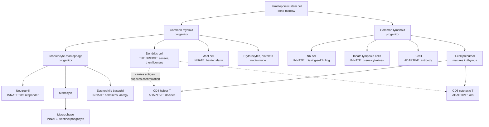

# Immunology · Lesson 1.1: The immune problem & the cellular cast

> ⏱ ~15 min · Module 1: Architecture & Innate Defense · Builds on: [molecular-cell-biology 2.1](../../molecular-cell-biology/lessons/02-01-receptors-reading-outside-world.md), [general-biology 4.1](../../general-biology/lessons/04-01-natural-selection.md) · Unlocks: [1.2](01-02-lymphoid-organs-cell-traffic.md) (lymphoid organs & cell traffic)

## Why this matters

Start with the problem, not the parts list. A bacterium doubles in half an hour; you take thirty years to make a child. **Your pathogens evolve roughly half a million generations for every one of yours** — so a defense strategy of "evolve a countermeasure to each new pathogen" loses by six orders of magnitude before it starts. Whatever the immune system is, it cannot be a catalogue of enemies compiled by natural selection.

The solution, and the single idea that organizes this entire course, is that the system is **general at the front and generative at the back.** The fast layer recognizes what pathogens *cannot change* — features so structurally load-bearing that escape costs the microbe its fitness. The slow layer does something no other organ system does: it **manufactures novel specificity on demand, inside your body, during your lifetime**, by a somatic randomization process, and then edits the result.

Everything else — the cell types, the organs, the cascades, the diseases — is machinery in service of that two-layer design. Get the framing now and the next nineteen lessons are consequences.

## The idea

**Three layers, each buying time for the next.**

1. **Barriers.** Skin, mucus, cilia, stomach acid, antimicrobial peptides, and a resident microbiota that occupies the niche a pathogen would want. Not glamorous; overwhelmingly the most effective layer by pathogen-encounters-prevented.
2. **Innate immunity.** Germline-encoded receptors — a few dozen specificities, fixed in your DNA, present before you were infected — that recognize *classes* of microbe. Ready in seconds to hours. Cannot improve, cannot remember.
3. **Adaptive immunity.** Receptors generated at random in each lymphocyte, so the repertoire covers essentially any molecular shape, including shapes no ancestor of yours ever met. Takes days on first exposure. Improves during the response, and remembers.

**The trade-off is speed versus specificity, and it is forced.** A receptor that is ready before the infection must have been encoded in the germline, so there can only be a few dozen of them. A repertoire of billions cannot be pre-made in useful numbers of each — the cell carrying the right one has to be *found* and then *multiplied*, and multiplying takes days. **You cannot have both properties in one receptor system, which is exactly why there are two.**

| | Innate | Adaptive |
|---|---|---|
| Receptors encoded | germline, inherited | somatically generated, per cell |
| Distinct specificities | tens | $10^{11}$ or more (potential) |
| Recognizes | conserved microbial classes | essentially any molecular shape |
| Ready in | seconds to hours | 4–7 days (primary) |
| Improves during response | no | yes (affinity maturation, [3.3](03-03-germinal-centers-affinity-maturation.md)) |
| Memory | limited ("trained immunity") | yes — hours to 1–2 days on re-exposure |
| Cost of a mistake | inflammation | autoimmunity |

**Self versus non-self is the wrong rule** — and correcting it is the second big idea of the lesson. The naive story says the system attacks what is foreign and spares what is yours. It fails immediately in both directions: your gut carries roughly as many bacterial cells as you have human ones and is not attacked; a fetus is half foreign and is not rejected; a sterile splinter, or a crush injury with no microbe anywhere, inflames enthusiastically.

**The operating rule is closer to: respond to conserved microbial patterns, and to evidence of tissue damage.** Molecules that mark "a microbe is here" (PAMPs — pathogen-associated molecular patterns) and molecules that mark "a cell died badly here" (DAMPs — damage-associated molecular patterns, such as ATP or mitochondrial DNA in the extracellular space). Foreignness as such is not the trigger; **context and damage are** ([1.3](01-03-barriers-sensing-danger.md) makes this precise).

**And the two systems are not parallel — the innate one is in charge of starting the adaptive one.** This is the point students most often miss. A dendritic cell samples tissue, fires its pattern receptors, migrates to a lymph node, and only then displays antigen with the costimulation an adaptive lymphocyte requires. **No innate decision, no adaptive response.** The adaptive system does not get to decide that something is dangerous; it is told ([3.5](03-05-helper-t-cells-polarization.md)).

## The formal version

**Claim 1 — the timescale asymmetry.** Let $t_d$ be a pathogen's doubling time and $T_g$ a host generation time. The number of pathogen generations per host generation is

$$G = \frac{T_g}{t_d} = \frac{30\ \text{yr} \times 8760\ \text{h/yr}}{0.5\ \text{h}} \approx 5 \times 10^{5}.$$

*In words: for every round of host evolution, the pathogen gets about half a million rounds.* Worse, the pathogen's population is enormous: with a per-genome mutation rate of about $10^{-3}$ per replication, a colonizing population reaching $10^{9}$ cells generates roughly $10^{6}$ new mutations, against about $1.4\times10^{7}$ possible single-base changes in a 4.6-Mb genome. **A population small enough to fit in a drop of pus contains a sizeable fraction of all point mutations of itself.** Germline evolution cannot race that ([evolution-ecology 1.4](../../evolution-ecology/lessons/01-04-drift-ne-gene-flow.md) has the machinery).

**Claim 2 — the repertoire cannot be genome-encoded.** Let $R$ be the number of distinct receptor specificities required and $L$ the coding length of one receptor gene. Direct encoding costs

$$D = R \cdot L = 10^{11} \times 10^{3}\ \text{bp} = 10^{14}\ \text{bp} \approx 3\times10^{4} \times (\text{the human genome}).$$

*In words: one gene per receptor would need a genome thirty thousand times too large, from a gene set of about 20,000.* **So receptors are not stored; they are assembled.** The genome holds *parts*, and each developing lymphocyte draws a combination — the answer is [3.1](03-01-vdj-recombination.md), and it is the intellectual centre of the course.

**A distinction worth keeping straight.** The *potential* repertoire — combinations the assembly process could produce — exceeds $10^{11}$ and by some accounts $10^{15}$. The *realized* repertoire is capped by how many lymphocytes you have: about $10^{12}$ lymphocytes in a human, so at most $\sim10^{8}$ distinct clones are alive at any moment. **You never hold your whole repertoire; you hold a fresh random sample of it, and you resample it continuously for life.**

**Claim 3 — why adaptive immunity is slow, in one calculation.** Let $n_0$ be the number of naive lymphocytes specific for a given epitope, $n_e$ the number of effectors needed, and $\tau$ the division time of an activated lymphocyte. The number of doublings and the elapsed time are

$$k = \log_2\!\left(\frac{n_e}{n_0}\right), \qquad t = k\,\tau .$$

*In words: the lag is set by how many times the winning clone must double, times how long a doubling takes.* With $n_0 \approx 10^{2}$ specific naive cells, $n_e \approx 10^{8}$ effectors and $\tau \approx 8$ h:

$$k = \log_2(10^{6}) = 19.9 \approx 20, \qquad t = 20 \times 8\ \text{h} = 160\ \text{h} \approx 6.7\ \text{days}.$$

**That is the observed lag of a primary adaptive response, recovered from arithmetic alone.** The delay is not biochemical sluggishness — signalling takes minutes. It is *finding one cell in ten million and then making a hundred million copies of it.* Memory shortens it (a larger $n_0$, [4.2](04-02-immunological-memory-vaccines.md)); nothing abolishes it.

**The cast.** Every one of these comes from a hematopoietic stem cell in the bone marrow, and the first branch — myeloid versus lymphoid — is most of the taxonomy.

| Cell | Lineage | Arm | Job, one line |
|---|---|---|---|
| Neutrophil | myeloid | innate | Abundant, short-lived phagocyte; first to arrive in numbers; indiscriminate weaponry ([1.4](01-04-inflammation-innate-effectors.md)) |
| Macrophage | myeloid | innate | Long-lived tissue sentinel: phagocytoses, presents, and releases the cytokines that start inflammation |
| Dendritic cell | myeloid (mostly) | **the bridge** | Samples tissue, senses danger, carries antigen to the lymph node and licenses T cells ([2.5](02-05-antigen-processing-presentation.md)) |
| Mast cell | myeloid | innate | Resident at barriers; degranulates to open vessels fast; the effector of IgE allergy ([4.4](04-04-autoimmunity-hypersensitivity.md)) |
| Eosinophil / basophil | myeloid | innate | Anti-helminth granule toxins; heavily involved in allergic inflammation |
| NK cell | **lymphoid** | **innate** | Kills cells that have *lost* MHC class I — "missing self" ([1.4](01-04-inflammation-innate-effectors.md), [4.1](04-01-cytotoxic-t-cells.md)) |
| B cell | lymphoid | adaptive | Membrane immunoglobulin binds native antigen; differentiates into an antibody factory ([2.1](02-01-antigens-antibody-structure.md)) |
| CD4 helper T | lymphoid | adaptive | Kills nothing; **decides what kind of response happens** ([3.5](03-05-helper-t-cells-polarization.md)) |
| CD8 cytotoxic T | lymphoid | adaptive | Kills host cells displaying foreign peptide on MHC class I ([4.1](04-01-cytotoxic-t-cells.md)) |

**Note the two entries that break the tidy story**, because they are the ones worth remembering: the **dendritic cell** is myeloid and innate yet is the switch that turns the adaptive system on, and the **NK cell** is lymphoid yet has no rearranged receptor and behaves as innate. **Lineage and arm are different axes.**

## Picture

**Read the dotted arrows as the lesson's thesis.** The tree's left side is fast and hard-wired, the right side is slow and made-to-order — and the only thing connecting them is a myeloid cell's judgement that something is wrong. (Plasmacytoid dendritic cells can also arise on the lymphoid side; the lineage boundary is fuzzier than the diagram, the *function* is not.)

## Worked examples

**Example 1 (mechanical — where the five-day lag comes from, and what shortens it).** A naive human carries about $3\times10^{2}$ CD8 T cells specific for one viral epitope. Clearing the infection needs about $3\times10^{7}$ effector CTLs at the site. Activated T cells divide every 8 h at peak. (a) How long is the lag? (b) A vaccinated person starts with $3\times10^{5}$ memory cells that divide every 6 h and skip the two-day priming phase. How long now? (c) Interpret.

(a) Fold-expansion required:

$$\frac{n_e}{n_0} = \frac{3\times10^{7}}{3\times10^{2}} = 10^{5}, \qquad k = \log_2(10^{5}) = \frac{5\ln 10}{\ln 2} = 16.6\ \text{doublings}.$$

$$t_{\text{expansion}} = 16.6 \times 8\ \text{h} = 133\ \text{h} = 5.5\ \text{days}.$$

Add roughly 1.5–2 days of search and priming ([1.2](01-02-lymphoid-organs-cell-traffic.md)) and you land at the textbook **7 days**.

(b) $$\frac{n_e}{n_0} = \frac{3\times10^{7}}{3\times10^{5}} = 10^{2}, \qquad k = \log_2(10^{2}) = 6.6\ \text{doublings},$$

$$t = 6.6 \times 6\ \text{h} = 40\ \text{h} \approx 1.7\ \text{days}, \ \text{with no priming delay}.$$

(c) **The response got about four times faster, and almost all of the gain came from the starting number, not from faster biology.** A thousand-fold larger precursor pool removes exactly $\log_2(10^{3}) = 10$ doublings — 80 hours at 8 h each. **That is what a vaccine buys you: it is not a better immune system, it is a bigger $n_0$.** The whole of [4.2](04-02-immunological-memory-vaccines.md) is this one term.

Notice the shape of the dependence: $t \propto \log(n_e/n_0)$. **Because the lag is logarithmic in the precursor frequency, being ten times rarer costs only $\log_2 10 = 3.3$ doublings — about a day.** The system is remarkably tolerant of rare precursors, which is precisely what lets it afford a repertoire this large.

**Example 2 (why you'd care — the accounting that forces V(D)J recombination).** A species needs to be able to bind essentially any pathogen-derived shape. Suppose that requires $R = 10^{11}$ distinct receptors. Its genome is $3\times10^{9}$ bp with about 20,000 genes. (a) Show that direct encoding is impossible. (b) Suppose instead a receptor is built by choosing one segment from each of four independent sets. How large must each set be? (c) What does the answer cost?

(a) At a modest 1 kb of coding sequence per receptor:

$$D = 10^{11} \times 10^{3} = 10^{14}\ \text{bp}, \qquad \frac{D}{3\times10^{9}} = 3.3\times10^{4}.$$

**A genome 33,000 times larger than the one available, dedicated entirely to receptors.** Even granting a receptor 100 bp of "distinguishing" sequence it is off by three orders of magnitude. **This is not a tight budget; it is a categorical impossibility**, and it is why the answer must be structural rather than a matter of more genes.

(b) If a receptor is a combination $(a,b,c,d)$ drawn from four sets of size $n$, the number of products is $n^{4}$:

$$n^{4} = 10^{11} \;\Longrightarrow\; n = 10^{11/4} = 10^{2.75} = 562.$$

Check: $562^{2} = 3.16\times10^{5}$, and $(3.16\times10^{5})^{2} = 9.98\times10^{10}$. ✓

(c) About $4 \times 562 \approx 2250$ gene segments — roughly 2.3 Mb at 1 kb each, **under one part in a thousand of the genome, and about 11 percent of the gene count.** Combinatorics converts a multiplication in the product into an addition in the storage.

**That is the whole trick, and the real system is more extravagant still**: it uses fewer segments than 562 per set but adds random nucleotides at each junction, which multiplies the count by several further orders of magnitude ([3.1](03-01-vdj-recombination.md)). **The price is that receptors are generated blind, so a large fraction of them will bind you** — which is why half of Module 4 is about editing the repertoire after the fact ([4.3](04-03-self-tolerance-regulation.md)). Hold that tension; it is the course's second theme.

## Watch out

- **You might think "innate = non-specific."** Innate receptors are highly specific — TLR4 for lipopolysaccharide, TLR5 for flagellin — just specific to *classes* rather than to individual molecules. The correct contrast is **fixed and inherited** versus **generated and disposable**, not vague versus precise.
- **You might rank adaptive immunity as the superior system.** It is slower by days, cannot start on its own, and is the only arm that can cause autoimmunity. Innate mechanisms handle the overwhelming majority of encounters without you ever noticing. Adaptive immunity is the specialist you call when the generalist is losing.
- **You might equate lymphoid with adaptive.** NK cells and the innate lymphoid cells are lymphoid-derived and carry no rearranged receptor. **Lineage is developmental; arm is functional; they cross.**
- **You might read self/non-self literally.** Your microbiota is non-self and tolerated; a sterile crush injury is entirely self and inflames. The triggers are conserved microbial patterns and signs of damage — which is why the danger/pattern framing predicts things self/non-self cannot ([1.3](01-03-barriers-sensing-danger.md)).
- **You might assume the adaptive system decides when to respond.** It does not. A dendritic cell's pattern receptors must fire first, or the T cell that sees the antigen is switched *off* rather than on ([3.5](03-05-helper-t-cells-polarization.md)). Antigen without danger is a tolerance signal.

## One-liner

> Pathogens out-evolve you by half a million generations to one, so defense cannot be a catalogue: the innate layer recognizes the few things microbes cannot change, and the adaptive layer builds $10^{11}$ receptors from a few thousand parts — which is why it is slow, why it must be licensed by an innate cell, and why it must then be edited so it does not attack you.

## Problems

**P1 (🟢)** A naive person has $2\times10^{2}$ B cells specific for a given epitope; a protective antibody response needs about $2\times10^{7}$ plasma cells. Activated B cells divide every 6 h. (a) How many doublings and how many days of pure expansion? (b) A different epitope has a tenfold rarer precursor pool. How much longer does that response take? (c) What does the form of your answer say about how costly rare specificities are?

**P2 (🟡)** A hypothetical animal devotes 1 percent of a $3\times10^{9}$ bp genome to germline-encoded receptor genes of 1 kb each. (a) How many distinct receptors does that buy? (b) It needs $10^{9}$. If receptors are instead assembled by picking one segment from each of three independent sets, how many segments per set, and how much DNA in total? (c) State the general principle in one sentence, and name the cost the animal now has to pay.

**P3 (🔴, optional — bridges to `evolution-ecology` and to [1.4](01-04-inflammation-innate-effectors.md))** A wound is seeded with $10^{3}$ bacteria that double every 30 min, so their intrinsic growth rate is $r = \ln 2 / (0.5\ \text{h})$. Adaptive effectors arrive at $t = 120$ h. Innate phagocytes impose a per-capita killing rate $k$, giving $\dot{N} = (r-k)N$. (a) Compute the load at 120 h if $k = 0$, and comment on the number. (b) What $k$ holds the population stationary? (c) If innate immunity achieves only $k = 1.20\ \text{h}^{-1}$, what is the load when the adaptive response arrives? (d) What does this say about the division of labour between the two arms?

Solutions

**P1 (a)** Fold-expansion $= (2\times10^{7})/(2\times10^{2}) = 10^{5}$.

$$k = \log_2(10^{5}) = \frac{5 \times 2.3026}{0.6931} = 16.6\ \text{doublings}.$$

$$t = 16.6 \times 6\ \text{h} = 99.7\ \text{h} = \mathbf{4.2\ \text{days}}.$$

**(b)** A tenfold rarer pool means $2\times10^{1}$ precursors, so the required expansion is $10^{6}$:

$$k' = \log_2(10^{6}) = 19.9, \qquad \Delta k = 19.9 - 16.6 = 3.3\ \text{doublings},$$

$$\Delta t = 3.3 \times 6\ \text{h} = 19.9\ \text{h} \approx \mathbf{0.8\ \text{days}}.$$

**(c)** Because $t = \tau \log_2(n_e/n_0)$, **the lag depends only logarithmically on precursor frequency** — a tenfold rarer clone costs a fixed $\log_2 10 = 3.3$ doublings no matter where you start, here under a day.

**That is what makes an enormous repertoire affordable.** If the delay scaled linearly with rarity, a repertoire of $10^{8}$ clones would be useless — the response to any given antigen would take years. Logarithmic scaling means the system can afford to make almost every specificity vanishingly rare and still respond to all of them on the same timescale. **The price of diversity is paid in cell numbers, not in time.**

**P2 (a)** $$\frac{0.01 \times 3\times10^{9}}{10^{3}} = \frac{3\times10^{7}}{10^{3}} = \mathbf{3\times10^{4}\ \text{receptors}}.$$

Thirty thousand — more genes than the animal has in total, for a repertoire five orders of magnitude short.

**(b)** $$n^{3} = 10^{9} \;\Longrightarrow\; n = 10^{3} = \mathbf{1000\ \text{segments per set}}.$$

Total segments $= 3 \times 1000 = 3000$, so

$$3000 \times 10^{3}\ \text{bp} = 3\times10^{6}\ \text{bp} = \mathbf{3\ \text{Mb}} = 0.1\ \text{percent of the genome}.$$

Compare the direct route: $10^{9} \times 10^{3} = 10^{12}$ bp, **330 times the whole genome.** The combinatorial scheme is cheaper by a factor of $3\times10^{5}$ and delivers 33,000 times more receptors than part (a).

**(c)** **The principle: independent combinatorial choice turns a product in the repertoire into a sum in the genome** — storage grows as $3n$ while diversity grows as $n^{3}$, so the genome pays the cube root of what it gets.

**The cost, and it is a real one: the receptor is now assembled at random in each cell, so the genome no longer knows what it is building.** It cannot pre-screen a combination it never designed. A large fraction of the products will bind host molecules, so the animal must now run an expensive post-hoc editing step on every lymphocyte it makes — thymic and marrow selection, [4.3](04-03-self-tolerance-regulation.md) — and must accept that the editing is imperfect, which is the origin of autoimmunity ([4.4](04-04-autoimmunity-hypersensitivity.md)). **Randomness bought the repertoire; tolerance is the bill.**

**P3 (a)** $$r = \frac{\ln 2}{0.5\ \text{h}} = 1.386\ \text{h}^{-1}, \qquad rt = 1.386 \times 120 = 166.4 .$$

$$N(120) = 10^{3}e^{166.4} = 10^{3} \times 10^{72.3} = \mathbf{2\times10^{75}}.$$

At about $10^{-12}$ g per bacterium that is $10^{63}$ g, some $10^{35}$ times the mass of the Earth. **The number is absurd, and its absurdity is the point:** unchecked exponential growth on a 30-minute clock cannot be allowed to run for five days under any circumstances. Long before nutrients ran out the host would be dead. ([evolution-ecology 3.1](../../evolution-ecology/lessons/03-01-exponential-growth-demography.md) is the same exponential from the other side.)

**(b)** Stationary requires $r - k = 0$:

$$k = r = \mathbf{1.386\ \text{h}^{-1}}.$$

*In words: innate immunity must destroy half the bacterial population every 30 minutes, continuously, merely to stop the infection getting worse.* That is the real job description of the neutrophil–complement–macrophage layer ([1.4](01-04-inflammation-innate-effectors.md), [1.5](01-05-complement-system.md)), and it is why those mechanisms are fast, abundant and crude rather than precise.

**(c)** Net rate $= 1.386 - 1.200 = 0.186\ \text{h}^{-1}$:

$$N(120) = 10^{3}e^{0.186 \times 120} = 10^{3}e^{22.3} = 10^{3} \times 4.9\times10^{9} = \mathbf{5\times10^{12}}.$$

**Innate immunity achieving 86.6 percent of the required killing rate still loses by a factor of five billion over five days.** The shortfall is 13 percent; the outcome is fatal sepsis.

**(d)** Three conclusions, and they set up the rest of Module 1.

1. **Adaptive immunity cannot be the primary defense against a fast replicator.** It arrives after the fight has been decided. Its five-day lag is not a flaw to be engineered away — Example 1 showed it is forced by the arithmetic of clonal expansion — so something else must hold the line.
2. **The innate layer's job is stated as an inequality, not an outcome:** it must supply $k \gtrsim r$. It need not clear the infection; it needs only to prevent exponential growth long enough for the adaptive response to be built. That is what "buying time" means quantitatively.
3. **The system is knife-edge sensitive to innate capacity**, because the deficit is exponentiated over five days. This predicts what the clinic sees: patients with defective phagocytes (chronic granulomatous disease) or missing complement components present with overwhelming bacterial infection, not with a subtle partial impairment ([4.5](04-05-immunodeficiency-tumor-transplant.md)). **A small change in $k$ is a catastrophic change in $N$ — which is the general signature of a defense operating against an exponential.**

## Connections

- **Backward:** the receptor–ligand recognition and signalling this whole course runs on is [molecular-cell-biology 2.1](../../molecular-cell-biology/lessons/02-01-receptors-reading-outside-world.md) and [2.2](../../molecular-cell-biology/lessons/02-02-second-messengers-amplification.md); the mutation supply that lets pathogens escape is [genetics 3.2](../../genetics/lessons/03-02-mutation.md), and the selection arithmetic behind the arms race is [evolution-ecology 1.1](../../evolution-ecology/lessons/01-01-fitness-quantitative.md).
- **Forward:** [1.2](01-02-lymphoid-organs-cell-traffic.md) explains how the one-in-a-million precursor of Example 1 is actually found; [1.3](01-03-barriers-sensing-danger.md) makes "conserved microbial patterns" precise; [3.1](03-01-vdj-recombination.md) is the answer to Example 2 and the pivot of the course; [4.3](04-03-self-tolerance-regulation.md) pays the bill that Example 2 ran up.
- **Sideways:** the exponential race in P3 is the unbounded-growth model of [evolution-ecology 3.1](../../evolution-ecology/lessons/03-01-exponential-growth-demography.md) with a per-capita removal term — the same equation an ecologist writes for a harvested population; the "generate variation blind, then select" logic of the adaptive response is Darwinian selection ([general-biology 4.1](../../general-biology/lessons/04-01-natural-selection.md)) running inside one body on a timescale of days, a point made fully explicit in [3.3](03-03-germinal-centers-affinity-maturation.md).
