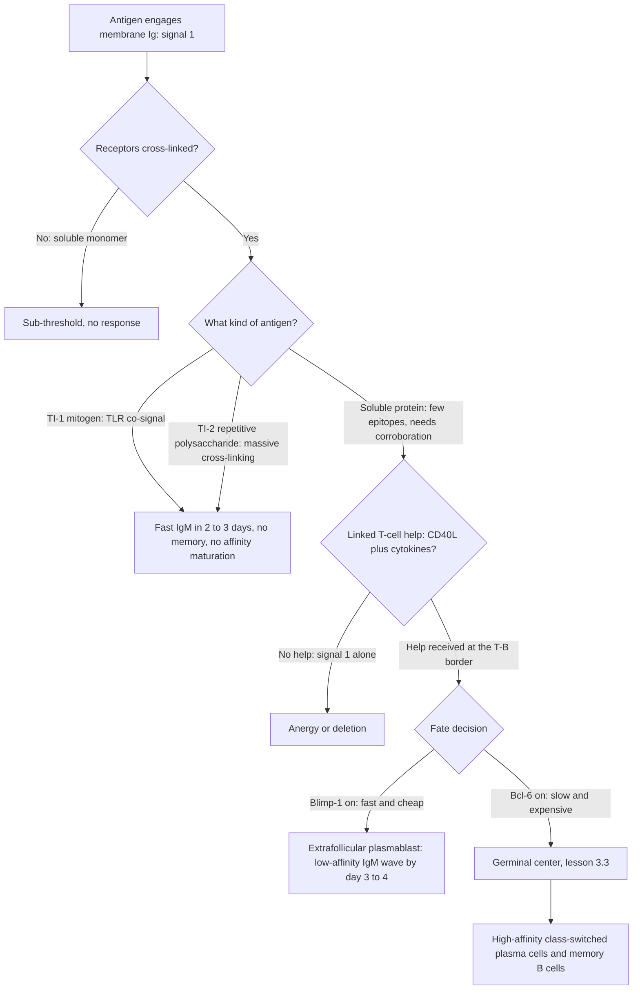

# Immunology · Lesson 3.2: Clonal selection & B-cell activation

> ⏱ ~15 min · Module 3: Generating Diversity & the Adaptive Response · Builds on: [3.1](03-01-vdj-recombination.md), [2.2](02-02-bcr-affinity-avidity.md) · Unlocks: 3.3 (germinal centers: affinity maturation & class switching)

## Why this matters

[3.1](03-01-vdj-recombination.md) built a repertoire of order $10^{11}$ specificities, blindly, before any pathogen was seen. That is a warehouse, not a response. This lesson is the mechanism that turns the warehouse into an army: **antigen does not instruct a lymphocyte what to make — it selects, from cells that already exist, the few that happen to fit, and lets them multiply.**

That sentence is Darwinism relocated. Variation is generated at random and in advance; a selective agent arrives; differential reproduction does the rest — the same logic as [evolution-ecology 1.1](../../evolution-ecology/lessons/01-01-fitness-quantitative.md), but running inside one body, on somatic cells, over days rather than millennia. Burnet's clonal selection theory (1957) is the single idea that made immunology coherent, and it beat a serious rival — the *instructional* theory, in which antigen acted as a template folding the antibody around itself. The instructional theory is elegant and completely wrong, and knowing why is worth more than knowing the right answer.

The second half of the lesson is the safety interlock. A cell that can proliferate a millionfold and secrete a molecule that recruits complement and phagocytes is a weapon, and **the system refuses to arm it on one piece of evidence.** Everything about B-cell activation — the two signals, linked recognition, the synapse — is a corroboration requirement, and every failure mode in Module 4 is that requirement being bypassed.

## The idea

**Clonal selection in one paragraph.** Every mature B cell displays many copies of *one* receptor (guaranteed by allelic exclusion, [3.1](03-01-vdj-recombination.md)). Antigen enters, binds the handful of cells whose receptor happens to fit, and those cells — and only those — divide. Their daughters inherit the same specificity, because specificity is written in rearranged DNA and DNA is copied. So the response is specific not because any molecule was clever, but because **the unit of selection is the whole cell, and the receptor rides along with the genome that encodes it.**

The consequences are immediate and testable. Specificity precedes exposure, so the repertoire must be built before it is needed. Memory is just a larger surviving clone. Tolerance must be a *deletion* problem, because the anti-self receptors were made and must be removed afterward ([4.3](04-03-self-tolerance-regulation.md)). And the several-day lag of a primary response is not slow chemistry — it is **the time it takes to divide.**

**Now the interlock.** Binding antigen is signal 1, and it is not enough. Membrane immunoglobulin must be *cross-linked* ([2.2](02-02-bcr-affinity-avidity.md)) — a soluble monomer occupying one receptor is a sub-threshold event — and even a well-cross-linked B cell that receives nothing else becomes **anergic** or is deleted, not activated. Signal 2 is help: CD40 ligation and cytokines delivered by a follicular helper T cell.

Why demand a second opinion? Because signal 1 is *cheap*. Cross-linking says only "something multivalent fits my receptor," and self-antigens fit receptors all the time. Signal 2 is expensive: a T cell can supply it only if it survived thymic selection ([4.3](04-03-self-tolerance-regulation.md)) *and* was itself licensed by a dendritic cell that had detected a genuine danger signal ([1.3](01-03-barriers-sensing-danger.md), [3.5](03-05-helper-t-cells-polarization.md)). **Requiring both makes B-cell activation an AND gate whose second input carries the innate system's verdict that something is actually wrong.**

**Linked recognition** is the specific shape that AND gate takes, and it is the most elegant thing in this lesson. The B cell and the T cell do **not** recognize the same epitope. The B cell binds a surface feature of the intact antigen, internalizes the whole molecule through its receptor, degrades it, and presents an *internal peptide* on MHC class II ([2.5](02-05-antigen-processing-presentation.md)). A T cell specific for that peptide provides help. So the two lymphocytes must recognize **different epitopes on the same physical particle**.

That constraint does real work: an autoreactive B cell cannot recruit help from a T cell specific for something else, so **T-cell tolerance is inherited by the B-cell compartment for free.** It is also why conjugate vaccines exist — see the worked example.

## The formal version

**Burnet's postulates**, stated as claims with their predictions:

| Postulate | Prediction it forces |
|---|---|
| One lymphocyte bears receptors of exactly one specificity | Specificity is a property of cells, not molecules in solution; allelic exclusion is mandatory |
| Receptor engagement is required for activation | Antigen is a selective agent, never a template |
| Progeny inherit the parent's specificity | Response magnitude grows by proliferation; memory is a surviving expanded clone |
| Self-reactive clones are removed early | Tolerance is deletion/editing after generation, not avoidance during it |

*In words: build blind, then select, then copy the winners — and clean up the ones aimed at you.*

**The expansion law.** Let $N_0$ be the number of recruited antigen-specific precursors, $\tau$ the division time, and $t_{\text{lag}}$ the delay before the first division:

$$N(t) = N_0 \, 2^{(t - t_{\text{lag}})/\tau}, \qquad n_{\text{div}} = \log_2\!\left(\frac{N_{\text{target}}}{N_0}\right)$$

*In words: the response is exponential in time with a base-2 clock, so the entire lag of adaptive immunity is set by three numbers — how many cells you start with, how fast they cycle, and how many you need.*

**The two-signal rule.** With $S_1$ = cross-linked antigen receptor and $S_2$ = T-cell help (CD40L plus cytokines):

$$\text{outcome} = \begin{cases} \text{clonal expansion and differentiation}, & S_1 \wedge S_2 \\ \text{anergy or deletion}, & S_1 \wedge \neg S_2 \\ \text{nothing}, & \neg S_1 \end{cases}$$

*In words: antigen without help is worse than no antigen at all — it actively silences the cell.* Note the asymmetry, because it is the design: the default on ambiguous evidence is **disarmament**, not inaction.

**Threshold modulation.** The CD19/CD21 coreceptor binds C3d deposited by complement ([1.5](01-05-complement-system.md)); co-ligation with the receptor lowers the activation threshold by roughly two to three orders of magnitude. So the amount of antigen needed for signal 1 is not a constant — **innate opsonization is a dial on adaptive sensitivity**, and an antigen the complement system has already condemned is treated as more credible.

**The synapse.** On contact, the B cell polarizes its MHC II and the T cell reorients its microtubule-organizing center toward the interface, forming concentric zones: a central cluster of engaged TCR–peptide–MHC and CD40–CD40L, surrounded by an adhesion ring of LFA-1 and ICAM-1. Cytokines are then secreted **directionally into the sealed cleft**. *In words: help is not broadcast into the tissue, it is handed to one cell* — which is what keeps a licensed T cell from activating every bystander B cell around it.

## Picture

Every branch is labelled with what licenses it. Read the diagram as an argument: the only route to the bottom-right — durable, high-affinity, switched antibody — passes through a T cell that recognized a linked epitope.

## Worked examples

### Example 1 — Where the seven-day lag comes from

A protein antigen enters a lymph node. Estimate the timing of the antibody response from first principles.

**Precursors.** Naive B cells specific for a given epitope are roughly 1 in $10^5$ of the naive B-cell pool. With around $10^{10}$ B cells in an adult, that is $10^5$ specific cells body-wide — but they are dispersed, and at the moment antigen arrives only the ones passing through *this* node can be recruited. Recirculation ([1.2](01-02-lymphoid-organs-cell-traffic.md)) delivers them over about a day, so take $N_0 \approx 10^{3}$ recruited precursors.

**Target.** A primary response peaks at roughly $10^{9}$ antigen-specific cells. The required expansion is

$$\frac{N_{\text{target}}}{N_0} = \frac{10^{9}}{10^{3}} = 10^{6}, \qquad n_{\text{div}} = \log_2 10^{6} = 6\log_2 10 \approx 19.9 \to \mathbf{20 \text{ divisions}}.$$

**Time.** Activated B cells are the fastest-cycling cells in the body; take $\tau = 8$ h:

$$t_{\text{proliferation}} = 20 \times 8\ \text{h} = 160\ \text{h} = 6.7\ \text{days}.$$

Add $t_{\text{lag}}$: about a day for antigen and lymphocytes to find each other in the node, plus about a day for the T–B border interaction before the first division. **Total: 8–9 days**, which is exactly when a primary IgG response peaks. **The lag is not biochemistry. It is arithmetic on a doubling clock.**

**What the army then produces.** Suppose 10 percent of those cells become antibody-secreting, so $10^{8}$ plasma cells, each secreting about $2\times10^{3}$ immunoglobulin molecules per second:

$$2\times10^{3}\ \text{s}^{-1} \times 10^{8} \times 8.64\times10^{4}\ \text{s}\,\text{day}^{-1} = 1.73\times10^{16}\ \text{molecules per day}$$

$$= \frac{1.73\times10^{16}}{6.02\times10^{23}} = 2.9\times10^{-8}\ \text{mol} \;\times\; 1.5\times10^{5}\ \text{g}\,\text{mol}^{-1} \approx 4.3\ \text{mg per day}.$$

Spread through about 3 L of plasma that is $1.4\ \mu\text{g}\,\text{mL}^{-1}$ accumulating per day, and since IgG's half-life is around 21 days almost none of it is lost meanwhile — so within a week the antigen-specific titre is in the tens of micrograms per millilitre. That is a real, measurable, protective titre built from roughly a thousand starting cells.

**The sobering comparison.** A bacterium dividing every 30 minutes gets $2\times 160 = 320$ doublings in the same 160 hours. **The adaptive response cannot win a race it starts from scratch** — which is precisely why the innate layer of Module 1 exists, and why memory ([4.2](04-02-immunological-memory-vaccines.md)), which changes $N_0$ by three or four orders of magnitude, is worth so much.

### Example 2 — Why polysaccharide vaccines fail in toddlers, and how conjugation fixes it

*Haemophilus influenzae* type b (Hib) is coated in a repetitive polysaccharide capsule. Purified capsule is a textbook **TI-2 antigen**: its epitopes repeat at regular spacing, so it cross-links dozens of receptors at once and drives activation without any T cell. Under the two-signal rule that looks like a violation — so what is happening?

**Resolution: massive cross-linking substitutes for signal 2.** Ordinary corroboration is waived because the *pattern itself* is the evidence — no host protein presents 50 identical epitopes at rigid 5–10 nm spacing, so extreme repetition is a reliable microbial signature, exactly the logic of pattern recognition in [1.3](01-03-barriers-sensing-danger.md). (TI-1 antigens such as LPS take the other shortcut: they carry their own TLR ligand, so signal 2 arrives through an innate receptor on the same B cell.)

**What the shortcut costs.** No T cell, no CD40 ligation, no germinal center — so the output is IgM, fast (2–3 days), low affinity, with little class switching and essentially no memory. Worse, the responding cells are largely marginal-zone and B-1 populations, which are **immature until about two years of age**. So the group at highest risk of invasive Hib meningitis is precisely the group that cannot respond to the purified capsule. The plain polysaccharide vaccine was, for infants, nearly useless.

**The fix is linked recognition, engineered.** Couple the polysaccharide covalently to a carrier protein such as tetanus toxoid or CRM197. Now a capsule-specific B cell binds the sugar, internalizes the *whole conjugate*, degrades it, and presents **carrier peptides** on MHC II. Carrier-specific helper T cells — which exist and are licensed — deliver CD40L and cytokines. The antigen has been converted from T-independent to T-dependent, and the response converts with it: IgG, affinity maturation, memory, and protection in six-month-olds. Invasive Hib disease in vaccinated populations fell by more than 99 percent.

**Note what was engineered.** Not the epitope, not the antibody, not the immune system — only the *evidence structure*. The polysaccharide was given a T-cell epitope to be linked to. That is the whole trick, and the same trick underlies the pneumococcal and meningococcal conjugates.

## Watch out

- **You might think antigen shapes the antibody, but the antibody is finished before the antigen arrives.** The instructional theory died on a simple fact: denature an antibody and let it refold with no antigen present, and it recovers its original specificity. Specificity is in the sequence, and the sequence was set by V(D)J recombination in a cell that had never met the pathogen. Antigen only ever chooses.
- **You might think "linked recognition" means the B and T cells see the same epitope, but they must see different ones.** The B cell binds a conformational surface feature; the T cell reads a linear peptide from the interior. They are linked by being on the same *molecule*, not by being the same *site* — which is why a hapten with no T-cell epitope is non-immunogenic no matter how well it binds a receptor, and why a carrier rescues it.
- **You might think T-independent means "no help needed, so simpler," but it means "corroboration waived, so degraded."** TI responses trade quality for speed: IgM, germline affinity, no durable memory. They are a stopgap that buys time for the T-dependent response, not an alternative to it — and a vaccine that elicits only a TI response protects poorly and briefly.
- **You might think anergy is a failure to respond, but it is an active response with a negative sign.** A B cell given signal 1 alone is not merely idle; it downregulates surface immunoglobulin, becomes refractory, and is excluded from follicles with a shortened lifespan. Under-evidenced activation is punished, not ignored.

## One-liner

> The antigen never teaches, it only chooses — and the immune system refuses to act on that choice until a T cell that recognized a different piece of the same molecule agrees.

## Problems

**P1 (🟢)** A primary response must reach $10^{8}$ antigen-specific B cells from $10^{3}$ recruited precursors, with a 2-day lag before the first division.
(a) How many divisions are required?
(b) How long does the response take if the division time is 12 h? If it is 6 h?
(c) Germinal-center B cells cycle every 6 hours, the fastest of any cell in the body. Argue from (b) that this is a requirement rather than a curiosity.

**P2 (🟡)** Dinitrophenyl (DNP) is a small chemical hapten. Three classic observations:
1. DNP injected alone with a strong adjuvant elicits no anti-DNP antibody.
2. DNP chemically coupled to bovine serum albumin (BSA) elicits abundant anti-DNP IgG.
3. A mouse primed with DNP–BSA and boosted with DNP–ovalbumin (DNP–OVA) mounts a poor secondary anti-DNP response — unless it was also primed with OVA earlier.

Explain all three from linked recognition. Then predict the result of boosting a DNP–BSA-primed mouse with DNP–BSA plus a blocking anti-CD40L antibody.

**P3 (🔴, optional)** Two B-cell clones, A and B, both specific for the same antigen, are recruited at equal numbers. Clone A's receptor binds more tightly, so it captures more antigen, presents more peptide–MHC II, and receives more T-cell help — which shortens its division time to 8 h, against 12 h for clone B.
(a) After 4 days of proliferation, what is the ratio of clone A to clone B?
(b) How long until A outnumbers B by 1000-fold?
(c) Recast this as selection in the sense of [evolution-ecology 1.1](../../evolution-ecology/lessons/01-01-fitness-quantitative.md): what plays the role of the selective agent, and what is the limiting resource being competed for? Why does this immediately imply that a *finite* supply of help is essential to the mechanism of [3.3](03-03-germinal-centers-affinity-maturation.md)?

Solutions

**P1**

**(a)** Required expansion is $10^{8}/10^{3} = 10^{5}$, so

$$n_{\text{div}} = \log_2 10^{5} = 5 \times 3.322 = 16.6 \to \mathbf{17 \text{ divisions}}$$

(rounding up, since divisions are integers — 16 gives only $6.6\times10^{4}$-fold).

**(b)** At $\tau = 12$ h: $17 \times 12 = 204$ h $= 8.5$ days of proliferation, plus the 2-day lag $= \mathbf{10.5\ \text{days}}$.
At $\tau = 6$ h: $17 \times 6 = 102$ h $= 4.25$ days, plus 2 days $= \mathbf{6.25\ \text{days}}$.

**(c)** The difference is over four days of unopposed pathogen replication — an enormous cost when the competitor doubles in tens of minutes. Every halving of $\tau$ removes $n_{\text{div}} \tau /2$ hours from the response, and since $n_{\text{div}}$ is fixed by the required fold-expansion (a ratio the system cannot shrink without starting from more precursors), **the only free parameter for a naive host is the cycle time.** A 6-hour cycle is therefore what the arithmetic demands, not an incidental fact — and it explains why the dark zone tolerates the mutational risk of running DNA replication that fast.

**P2**

**1. DNP alone is non-immunogenic.** DNP is a B-cell epitope with no T-cell epitope: it is too small to yield peptides that bind MHC II, so no helper T cell can ever be specific for it. A DNP-specific B cell can therefore receive signal 1 and never signal 2 — it is anergized, not activated. The adjuvant does not help, because an adjuvant licenses dendritic cells to costimulate T cells ([3.5](03-05-helper-t-cells-polarization.md)); it cannot conjure a T-cell epitope that the antigen does not contain.

**2. DNP–BSA works.** The DNP-specific B cell binds DNP, internalizes the entire conjugate through its receptor, processes it, and presents **BSA-derived peptides** on MHC II ([2.5](02-05-antigen-processing-presentation.md)). BSA-specific helper T cells supply CD40L and cytokines. The B cell's specificity (anti-DNP) and the T cell's specificity (anti-BSA peptide) are different — linked only by residing on one molecule. Result: class-switched, affinity-matured anti-DNP IgG.

**3. The carrier effect.** Boosting with DNP–OVA presents the memory anti-DNP B cells with their epitope, so signal 1 is abundant. But help is now the bottleneck: the expanded memory T-cell population is OVA-naive and BSA-specific, and the new carrier is OVA. A primary-magnitude T-cell response to OVA must be built from scratch, so the anti-DNP recall is slow and weak. Pre-priming with OVA creates the memory carrier-specific T cells in advance, and the secondary anti-DNP response is restored. **The recall response is limited by the helper compartment, not the B-cell compartment** — the direct experimental proof that help is a separate, rate-limiting input.

**Prediction with anti-CD40L.** Signal 1 is intact, signal 2 is blocked at its critical step. There is no germinal center, no class switching, and no affinity maturation; at best a small extrafollicular IgM wave from cells that got other help-independent signals. B cells receiving cross-linking without CD40 ligation are pushed toward anergy, so the response can end up *below* baseline for that antigen. This is the mouse model of the human CD40L defect — X-linked hyper-IgM syndrome: normal or high IgM, absent IgG/IgA/IgE ([3.3](03-03-germinal-centers-affinity-maturation.md)).

**P3**

**(a)** In 96 hours, clone A completes $96/8 = 12$ divisions and clone B completes $96/12 = 8$:

$$\frac{N_A}{N_B} = \frac{2^{12}}{2^{8}} = 2^{4} = \mathbf{16}.$$

**(b)** The ratio grows as $2^{t/8 - t/12} = 2^{t/24}$ with $t$ in hours. Setting this to $10^{3}$:

$$\frac{t}{24} = \log_2 10^{3} = 9.97 \quad\Rightarrow\quad t = 239\ \text{h} \approx \mathbf{10\ days}.$$

A modest 1.5-fold difference in cycle time becomes a thousandfold difference in clone size in the span of a single germinal-center reaction. **Exponential growth converts small rate differences into large frequency differences, which is exactly the mechanism by which selection works anywhere.**

**(c)** The selective agent is **T-cell help** (and, in [3.3](03-03-germinal-centers-affinity-maturation.md), antigen displayed on follicular dendritic cells). Receptor affinity is the heritable trait — heritable in the strict sense, since it is encoded in rearranged and mutated DNA that the daughters inherit. Fitness is realized proliferation rate, and the differential is set by how much antigen a clone captures and therefore how much peptide–MHC II it displays to a helper T cell.

**Why help must be finite.** If help were unlimited, every clone above the activation threshold would receive it, every clone would cycle at the maximum rate, and the ratio in (a) would be 1 — the mechanism would be a **filter** that passes anything good enough, with no pressure to improve further. Selection requires a resource that not everyone can have. Because Tfh cells are scarce in the light zone, clones compete, the differential in (a) exists, and mean affinity climbs round after round instead of merely clearing a bar. **Competition for a limiting resource is not a detail of germinal centers; it is the reason affinity maturation is possible at all** — the same requirement that makes selection in a population a function of *relative*, not absolute, fitness.

## Flashback

**From Lesson 2.2 (the B-cell receptor: affinity and avidity):** A germline IgM receptor binds its epitope with a single-site dissociation constant $K_d = 5\times10^{-6}$ M. Free antigen in the tissue sits at $[\text{L}] = 1\times10^{-7}$ M.

(a) What fraction of single binding sites is occupied?
(b) The antigen is a virion displaying its epitope repeatedly, so the receptor engages bivalently, and the geometry gives an apparent $K_d$ 200-fold tighter than the single-site value. Recompute the occupancy.
(c) What apparent $K_d$ would be needed for half occupancy at this antigen concentration, and what does the comparison say about why IgM is the primary-response isotype?

Solution

**(a)** Fractional occupancy for a single site is

$$\theta = \frac{[\text{L}]}{K_d + [\text{L}]} = \frac{1\times10^{-7}}{5\times10^{-6} + 1\times10^{-7}} = \frac{1\times10^{-7}}{5.1\times10^{-6}} = 0.0196 \approx \mathbf{2\ \text{percent}}.$$

Essentially no signal — a germline receptor at physiological antigen concentration is a poor detector.

**(b)** Apparent $K_d^{\text{app}} = 5\times10^{-6}/200 = 2.5\times10^{-8}$ M:

$$\theta = \frac{1\times10^{-7}}{2.5\times10^{-8} + 1\times10^{-7}} = \frac{1\times10^{-7}}{1.25\times10^{-7}} = 0.80 = \mathbf{80\ \text{percent}}.$$

A 200-fold change in the effective constant moved occupancy from 2 percent to 80 percent — occupancy is a steep function of $K_d/[\text{L}]$ near the transition, which is why modest affinity gains produce large functional gains.

**(c)** Half occupancy occurs when $K_d^{\text{app}} = [\text{L}] = 1\times10^{-7}$ M, i.e. **50-fold tighter than germline**. That is a demanding target for a receptor that was assembled at random, and affinity maturation ([3.3](03-03-germinal-centers-affinity-maturation.md)) will not have run yet at the start of a primary response.

**So the primary response buys the same result with geometry instead of chemistry.** IgM is pentameric: ten binding sites, each individually weak, but multivalent engagement of a repetitive surface multiplies the effective grip. Valency substitutes for affinity while the repertoire is still germline — which is precisely why the first isotype secreted is the one with the most arms, and why the switch to bivalent IgG waits until affinity maturation has made two good sites better than ten bad ones.

*The ceiling: the enhancement is not a clean product of the single-site constants. It depends on epitope spacing matching the hinge geometry, and on the entropic and strain costs of holding several arms engaged at once — so a multivalent antibody on a poorly-spaced surface can do barely better than a monovalent one.*

## Connections

- **Backward:** [3.1](03-01-vdj-recombination.md) is what makes postulate 1 true — allelic exclusion gives one cell one receptor, without which selection could not act on whole cells. [2.2](02-02-bcr-affinity-avidity.md) supplies the cross-linking requirement that defines signal 1, and [2.5](02-05-antigen-processing-presentation.md) supplies the class II pathway that makes linked recognition mechanically possible. The CD19/CD21 threshold shift is [1.5](01-05-complement-system.md)'s C3d being read as evidence. The lag computed here is [1.2](01-02-lymphoid-organs-cell-traffic.md)'s search estimate plus this lesson's doubling clock.
- **Forward:** [3.3](03-03-germinal-centers-affinity-maturation.md) takes the germinal-center branch of the flowchart and runs mutation and selection on it for a week. [3.5](03-05-helper-t-cells-polarization.md) explains where signal 2 comes from and why its *flavour* determines which isotype the B cell switches to. [4.2](04-02-immunological-memory-vaccines.md) is this lesson rerun with $N_0$ larger by three orders of magnitude, and adjuvants are the missing danger signal that licenses signal 2. [4.3](04-03-self-tolerance-regulation.md) is the postulate-4 cleanup, and [4.4](04-04-autoimmunity-hypersensitivity.md) is what happens when linked recognition is defeated by molecular mimicry.
- **Sideways:** clonal selection *is* natural selection with a somatic substrate — heritable variation, differential reproduction, a limiting resource — so [evolution-ecology 1.1](../../evolution-ecology/lessons/01-01-fitness-quantitative.md)'s relative-fitness formalism transfers directly, as P3 shows. Receptor-mediated internalization of the antigen is ordinary endocytic trafficking, [molecular-cell-biology 1.4](../../molecular-cell-biology/lessons/01-04-endomembrane-trafficking.md); the antigen-receptor signalling that converts cross-linking into a transcriptional decision is the machinery of [molecular-cell-biology 2.1](../../molecular-cell-biology/lessons/02-01-receptors-reading-outside-world.md).
