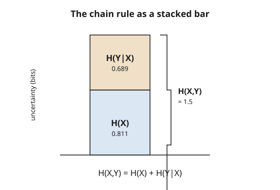

# Information Theory · Lesson 1.2: Joint, conditional entropy, and the chain rule

> ⏱ ~15 min · Module 1: Entropy and information measures · Builds on: [1.1 Entropy: uncertainty and surprise](01-01-entropy-uncertainty-surprise.md) · Unlocks: [1.3 Mutual information](01-03-mutual-information.md)

## Why this matters

Real data comes in bundles: a pixel and its neighbor, today's weather and tomorrow's, a symptom and the disease behind it. Lesson 1.1 measured the uncertainty of a *single* random variable. But the moment you have two, the interesting questions are relational — how much uncertainty is in the *pair*, and how much of one variable's uncertainty survives once you *learn* the other. Those two ideas — **joint** and **conditional** entropy — are the entire toolkit for the rest of the course: mutual information, source coding, and channel capacity are all built by adding and subtracting them. The bookkeeping that makes it all work is a single, almost obvious identity: the **chain rule**.

## The idea

Picture the uncertainty of a pair $(X,Y)$ as a bar you have to fill. You can fill it in two installments. First pay for $X$ outright: that costs $H(X)$, the uncertainty of $X$ alone. Now that $X$ is known, $Y$ is usually *less* mysterious than it was — knowing today's weather narrows tomorrow's — so the remaining bill is only the *leftover* uncertainty in $Y$ given $X$. Add the two installments and you've paid for the whole pair. That's the chain rule: **uncertainty of the pair = uncertainty of $X$, plus whatever uncertainty is left in $Y$ once you know $X$.**

The subtle word is "leftover." Conditional entropy is an **average**: for each possible value of $X$ you ask how uncertain $Y$ still is, then weight by how likely that value of $X$ was. On average, learning $X$ can only help — it never *increases* your average uncertainty about $Y$. (Watch out: that's a statement about the average. A single surprising observation can absolutely leave you *more* confused than before — more on that below.)

## The formal version

Let $X$ range over an alphabet with values $x$ and $Y$ over values $y$, with joint distribution $p(x,y)$, marginals $p(x)$, $p(y)$, and conditional $p(y\mid x) = p(x,y)/p(x)$. All logs are base 2, so entropy is in **bits**, and we take $0\log 0 = 0$.

**Joint entropy.**

$$H(X,Y) = -\sum_{x,y} p(x,y)\,\log p(x,y).$$

In words: treat the pair $(X,Y)$ as one combined symbol and measure its uncertainty exactly as in 1.1 — nothing new, just a bigger alphabet.

**Conditional entropy.**

$$H(Y\mid X) = \sum_{x} p(x)\,H(Y\mid X=x) = -\sum_{x,y} p(x,y)\,\log p(y\mid x).$$

In words: for each fixed $x$, compute the ordinary entropy of $Y$'s conditional distribution $p(y\mid x)$; then average those over $x$. It's the expected remaining uncertainty in $Y$ after $X$ is revealed.

**Chain rule.**

$$H(X,Y) = H(X) + H(Y\mid X).$$

In words: the pair's uncertainty splits cleanly into "the cost of $X$" plus "the cost of $Y$ given $X$." (It follows in one line from $\log p(x,y) = \log p(x) + \log p(y\mid x)$.)

**Conditioning reduces entropy (on average).**

$$H(Y\mid X) \leq H(Y), \quad \text{with equality} \iff X \perp Y.$$

In words: knowing $X$ never hurts your average uncertainty about $Y$, and it fails to help *only* when $X$ and $Y$ are independent (then $p(y\mid x) = p(y)$, so there's nothing to learn).

**General chain rule.** For $n$ variables, peel them off one at a time:

$$H(X_1, \dots, X_n) = \sum_{i=1}^{n} H(X_i \mid X_1, \dots, X_{i-1}).$$

In words: the uncertainty of a whole sequence is the sum of each variable's leftover uncertainty given all the ones before it.

## Picture

The total bar is $H(X,Y)$. The bottom installment is $H(X)$; stacked on top is the leftover $H(Y\mid X)$. Their heights literally add — that stacking *is* the chain rule.

## Worked examples

**Example 1 (the definitions in action, chain rule verified).** Take $X,Y \in \{0,1\}$ with joint distribution

$$p(0,0)=\tfrac12,\quad p(0,1)=\tfrac14,\quad p(1,0)=0,\quad p(1,1)=\tfrac14.$$

Marginals: $p(X=0)=\tfrac34,\ p(X=1)=\tfrac14$, and $p(Y=0)=\tfrac12,\ p(Y=1)=\tfrac12$.

*Individual entropies.*

$$H(X) = -\tfrac34\log\tfrac34 - \tfrac14\log\tfrac14 = 0.811 \text{ bits}, \qquad H(Y) = -\tfrac12\log\tfrac12 - \tfrac12\log\tfrac12 = 1 \text{ bit}.$$

*Joint entropy* (four terms, one of them zero):

$$H(X,Y) = -\left(\tfrac12\log\tfrac12 + \tfrac14\log\tfrac14 + \tfrac14\log\tfrac14\right) = \tfrac12 + \tfrac12 + \tfrac12 = 1.5 \text{ bits}.$$

*Conditional entropy*, the average way. Given $X=0$: $p(Y=0\mid X=0) = \tfrac{1/2}{3/4} = \tfrac23$, $p(Y=1\mid X=0) = \tfrac13$, so $H(Y\mid X=0) = -\tfrac23\log\tfrac23 - \tfrac13\log\tfrac13 = 0.918$. Given $X=1$: $p(Y=1\mid X=1)=1$, so $H(Y\mid X=1)=0$. Average:

$$H(Y\mid X) = \tfrac34(0.918) + \tfrac14(0) = 0.689 \text{ bits}.$$

*Chain rule check:* $H(X) + H(Y\mid X) = 0.811 + 0.689 = 1.5 = H(X,Y).$ ✓

Notice $H(Y\mid X) = 0.689 < 1 = H(Y)$: learning $X$ shaved off about $0.31$ bits of uncertainty about $Y$.

**Example 2 (equality under independence, and a 3-variable chain).** First, make $X,Y$ two *independent* fair coins: $p(x,y) = \tfrac14$ for all four cells. Then $H(X)=H(Y)=1$ and $H(X,Y) = -4\cdot\tfrac14\log\tfrac14 = 2$, so $H(Y\mid X) = H(X,Y)-H(X) = 1 = H(Y)$. Equality holds exactly — because independence means $X$ tells you nothing about $Y$.

Now the general chain rule on three variables. Let $X_1, X_2$ be independent fair coins and set $X_3 = X_1 \oplus X_2$ (XOR — the parity, fully determined by the first two). Then:

$$H(X_1) = 1, \quad H(X_2\mid X_1) = H(X_2) = 1, \quad H(X_3\mid X_1,X_2) = 0,$$

the last term being zero because once $X_1,X_2$ are known, $X_3$ is *certain*. So

$$H(X_1,X_2,X_3) = 1 + 1 + 0 = 2 \text{ bits}.$$

Sanity check: only 4 of the 8 bit-triples have even parity structure — precisely the 4 equally likely outcomes $(X_1,X_2,\text{parity})$ — and $\log 4 = 2$. ✓ A deterministic variable contributes nothing to a joint entropy, no matter how it's computed.

## Watch out

- **"Conditioning always lowers uncertainty."** Only *on average*. $H(Y\mid X) \le H(Y)$ is a statement about the weighted mean over $x$; a *particular* value can raise it. Example: let $X=b$ (probability $0.1$) make $Y$ a fair coin, while $X=a$ (probability $0.9$) forces $Y=0$. Then $Y$ is rarely $1$, so $H(Y) \approx 0.286$ bits — but observing the rare $X=b$ jumps you to $H(Y\mid X=b) = 1$ bit. That single observation *increased* your uncertainty. The average, $H(Y\mid X)=0.1$ bits, still obeys the inequality.
- **"The split is unique."** The chain rule works in either order: $H(X,Y) = H(X)+H(Y\mid X) = H(Y)+H(X\mid Y)$. The *total* is the same, but the pieces differ. In Example 1, $H(X)+H(Y\mid X) = 0.811+0.689$, whereas $H(Y)+H(X\mid Y) = 1 + 0.5$ — same $1.5$, different installments. Don't assume $H(Y\mid X)=H(X\mid Y)$; they're equal only when $H(X)=H(Y)$.
- **"Joint entropy can exceed the sum of the parts."** Never: **subadditivity** says $H(X,Y) \le H(X)+H(Y)$, with equality iff $X\perp Y$. The pair is at most as uncertain as two independent copies — any dependence *shares* information and shrinks the joint. (This is just $H(Y\mid X)\le H(Y)$ added to $H(X)$.)
- **The $0\log 0$ trap.** Cells with $p=0$ (like $p(1,0)=0$ above) contribute $0$, not an undefined $\log 0$. Skip them; the limit $t\log t \to 0$ as $t\to 0^+$ justifies it.

## One-liner

> The uncertainty of a pair is the cost of the first variable plus the *leftover* cost of the second given the first — $H(X,Y)=H(X)+H(Y\mid X)$ — and knowing more never raises your *average* uncertainty.

## Problems

**P1 (🟢)** For a joint distribution with $p(0,0)=p(1,1)=\tfrac13$ and $p(0,1)=p(1,0)=\tfrac16$, compute $H(X)$, $H(X,Y)$, and $H(Y\mid X)$, and verify the chain rule.

**P2 (🟡)** Prove the chain rule $H(X,Y) = H(X) + H(Y\mid X)$ directly from the definitions, starting from $\log p(x,y) = \log p(x) + \log p(y\mid x)$.

**P3 (🔴, optional)** A source emits three bits: $X_1, X_2$ independent and fair, and $X_3 = X_1 \oplus X_2$ as in Example 2. Using the *general* chain rule in a *different order*, compute $H(X_3) + H(X_1\mid X_3) + H(X_2\mid X_1,X_3)$ and confirm it still equals $2$ bits. (Hint: find the marginal distribution of $X_3$ first, then reason about what $X_3$ alone, and then $X_1$ together with $X_3$, tell you.)

Solutions

**P1** Marginals: $p(X=0) = \tfrac13+\tfrac16 = \tfrac12$, likewise $p(X=1)=\tfrac12$; by symmetry $p(Y=0)=p(Y=1)=\tfrac12$. So $H(X) = 1$ bit.

Joint entropy: two cells at $\tfrac13$ and two at $\tfrac16$:
$$H(X,Y) = -2\cdot\tfrac13\log\tfrac13 - 2\cdot\tfrac16\log\tfrac16 = \tfrac23\log 3 + \tfrac13\log 6.$$
Numerically $\log 3 = 1.585$, $\log 6 = 2.585$, so $H(X,Y) = \tfrac23(1.585) + \tfrac13(2.585) = 1.057 + 0.862 = 1.918$ bits.

Chain rule gives $H(Y\mid X) = H(X,Y) - H(X) = 1.918 - 1 = 0.918$ bits.

Direct check: given $X=0$, $p(Y=0\mid X=0)=\tfrac{1/3}{1/2}=\tfrac23$, $p(Y=1\mid X=0)=\tfrac13$, so $H(Y\mid X=0) = 0.918$; by symmetry $H(Y\mid X=1)=0.918$; average $=0.918$. ✓ And $0.918 < 1 = H(Y)$, so conditioning reduced entropy (the variables are correlated, not independent).

**P2** Start from the joint entropy and substitute the log identity:
$$H(X,Y) = -\sum_{x,y} p(x,y)\log p(x,y) = -\sum_{x,y} p(x,y)\big[\log p(x) + \log p(y\mid x)\big].$$
Split the sum:
$$= -\sum_{x,y} p(x,y)\log p(x) \;-\; \sum_{x,y} p(x,y)\log p(y\mid x).$$
In the first term, $\log p(x)$ doesn't depend on $y$, so $\sum_y p(x,y) = p(x)$:
$$-\sum_{x} \Big(\sum_y p(x,y)\Big)\log p(x) = -\sum_x p(x)\log p(x) = H(X).$$
The second term is exactly the definition of $H(Y\mid X)$. Hence $H(X,Y) = H(X) + H(Y\mid X)$. $\blacksquare$

**P3** First the marginal of $X_3 = X_1\oplus X_2$: over the four equally likely $(X_1,X_2)$ pairs, parity is $0$ for $(0,0),(1,1)$ and $1$ for $(0,1),(1,0)$ — so $X_3$ is a fair coin, $H(X_3)=1$ bit.

Next $H(X_1\mid X_3)$: knowing the parity $X_3$ alone tells you nothing about $X_1$ (for either parity, $X_1$ is still equally likely $0$ or $1$), so $H(X_1\mid X_3) = H(X_1) = 1$ bit.

Finally $H(X_2\mid X_1,X_3)$: once you know $X_1$ and the parity $X_3$, you have $X_2 = X_1 \oplus X_3$ exactly — no uncertainty left — so this term is $0$.

Total: $1 + 1 + 0 = 2$ bits, matching Example 2. The chain rule is order-free in its total even though the individual terms are completely rearranged. ✓

## Connections

- **Backward:** joint entropy is just [1.1](01-01-entropy-uncertainty-surprise.md)'s $H = -\sum p\log p$ applied to the pair as one big symbol, and conditional entropy is an *average* of those same single-variable entropies. The chain rule is the first genuinely new structure.
- **Forward:** [1.3 Mutual information](01-03-mutual-information.md) is built directly from these — $I(X;Y) = H(X) - H(X\mid Y) = H(Y) - H(Y\mid X)$, the drop in uncertainty from conditioning, which is exactly why "conditioning reduces entropy" matters. The general chain rule reappears in [2.1 The AEP](02-01-asymptotic-equipartition-property.md), where the joint entropy of a long sequence controls how many "typical" sequences exist.
- **Sideways (probability):** conditional entropy is built on the conditional distribution $p(y\mid x)$ and the law of total probability from [probability-theory](../../probability-theory/syllabus.md) — the average over $x$ is a conditional expectation, $H(Y\mid X) = \mathbb{E}_X[H(Y\mid X=x)]$.
- **Sideways (learning):** in [statistical-learning](../../statistical-learning/syllabus.md), $H(Y\mid X)$ is the expected surprise of the best possible predictor of a label $Y$ from features $X$ — the irreducible uncertainty no model can remove, and the floor that cross-entropy loss is trying to reach.

[syllabus](../syllabus.md)
