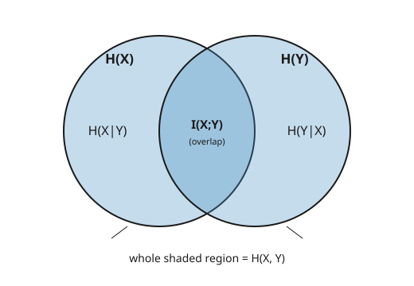

# Information Theory · Lesson 1.3: Mutual information

> ⏱ ~15 min · Module 1: Entropy and information measures · Builds on: [1.2 Joint, conditional entropy, and the chain rule](01-02-joint-conditional-entropy-chain-rule.md) · Unlocks: [1.4 Relative entropy (KL divergence) and Jensen](01-04-relative-entropy-kl-jensen.md)

## Why this matters

Everything useful about communication, learning, and inference is a version of one question: *how much does observing one thing tell you about another?* A test result about a disease, a pixel about the next pixel, a price about a firm's private cost — all of these are asking for a single number, the amount of shared information between two random variables. That number is **mutual information**, and it is the quantity a channel's capacity maximizes, a feature's usefulness is scored by, and a signal's economic value is measured in. Entropy told us how uncertain one variable is; mutual information tells us how much of that uncertainty *another variable resolves*.

## The idea

You know your uncertainty about $X$ before seeing anything: it's the entropy $H(X)$. Now someone hands you $Y$. Your *remaining* uncertainty about $X$ is the conditional entropy $H(X\mid Y)$ from Lesson 1.2. The gap between them — what you *stopped* being uncertain about — is the information $Y$ carried about $X$:

$$\text{information } Y \text{ gives about } X \;=\; \underbrace{H(X)}_{\text{before}} \;-\; \underbrace{H(X\mid Y)}_{\text{after}}.$$

Here's the beautiful surprise: this is **symmetric**. The amount $Y$ tells you about $X$ exactly equals the amount $X$ tells you about $Y$ — even though $H(X\mid Y)$ and $H(Y\mid X)$ are usually different numbers. Shared information doesn't have a direction. That's why we write it with a semicolon, $I(X;Y)$, and call it *mutual*.

The picture to hold in your head is two overlapping circles. One circle is all the uncertainty in $X$, the other is all the uncertainty in $Y$. Where they overlap is the information they share — that overlap is $I(X;Y)$. The part of $X$'s circle *outside* the overlap is $H(X\mid Y)$: what stays uncertain about $X$ even after you know $Y$.

## The formal version

For discrete random variables $X, Y$ with joint distribution $p(x,y)$ and marginals $p(x), p(y)$, the **mutual information** is

$$I(X;Y) \;=\; \sum_{x,y} p(x,y)\,\log \frac{p(x,y)}{p(x)\,p(y)}.$$

**In words:** average, over every joint outcome, the log-ratio of how often $(x,y)$ *actually* co-occurs versus how often it *would* if $X$ and $Y$ were independent. When they move together, that ratio exceeds 1 and its log is positive.

All logs are base 2, so $I$ is in **bits**. This single definition unpacks into four equivalent faces:

$$I(X;Y) \;=\; H(X) - H(X\mid Y) \;=\; H(Y) - H(Y\mid X) \;=\; H(X) + H(Y) - H(X,Y).$$

**In words:** mutual information is the drop in uncertainty about $X$ from learning $Y$; equally the drop in uncertainty about $Y$ from learning $X$; equally the "double-counted overlap" you'd remove when you add the two circles and subtract their union $H(X,Y)$. The third form makes the symmetry obvious — $X$ and $Y$ enter identically.

Two properties do the heavy lifting:

$$I(X;Y) \ge 0, \qquad I(X;Y) = 0 \iff X \perp Y.$$

**In words:** learning $Y$ can never, *on average*, make you more uncertain about $X$ — the overlap can shrink to nothing but never goes negative; and it's exactly nothing precisely when $X$ and $Y$ are independent (then $p(x,y)=p(x)p(y)$, the log-ratio is $\log 1 = 0$ everywhere). We'll *prove* $I \ge 0$ next lesson, because $I(X;Y)$ is secretly a **relative entropy** (KL divergence) between the joint $p(x,y)$ and the product of marginals $p(x)p(y)$ — a distance that is always non-negative.

One special case worth memorizing: $I(X;X) = H(X) - H(X\mid X) = H(X) - 0 = H(X)$. A variable shares *all* of its information with itself — the two circles coincide, and the overlap is the whole thing. This is why entropy is sometimes called *self-information*.

## Picture

## Worked examples

**Example 1 (mechanical — one $I$, three ways).** Take the joint distribution

$$p(0,0)=\tfrac12,\quad p(0,1)=\tfrac14,\quad p(1,0)=0,\quad p(1,1)=\tfrac14.$$

Marginals: $p(X{=}0)=\tfrac34,\ p(X{=}1)=\tfrac14$; and $p(Y{=}0)=\tfrac12,\ p(Y{=}1)=\tfrac12$.

*Way A — $H(X) - H(X\mid Y)$.* First $H(X) = H(\tfrac34) = -\tfrac34\log\tfrac34 - \tfrac14\log\tfrac14 = 0.3113 + 0.5 = 0.8113$ bits. For $H(X\mid Y)$, split on $Y$: given $Y{=}0$, $X$ is forced to $0$ (since $p(1,0)=0$), so $H(X\mid Y{=}0)=0$; given $Y{=}1$, $X$ is $\tfrac12/\tfrac12$ each way, so $H(X\mid Y{=}1)=1$. Weight by $p(Y)=\tfrac12,\tfrac12$:

$$H(X\mid Y) = \tfrac12(0) + \tfrac12(1) = 0.5 \ \text{bits}, \qquad I = 0.8113 - 0.5 = \mathbf{0.3113 \ bits}.$$

*Way B — $H(Y) - H(Y\mid X)$.* Here $H(Y)=H(\tfrac12)=1$ bit. Using the chain rule $H(Y\mid X)=H(X,Y)-H(X)$: the joint entropy is $H(X,Y) = -\tfrac12\log\tfrac12 - \tfrac14\log\tfrac14 - \tfrac14\log\tfrac14 = 0.5+0.5+0.5 = 1.5$ bits, so $H(Y\mid X)=1.5-0.8113=0.6887$, and $I = 1 - 0.6887 = \mathbf{0.3113 \ bits}$.

*Way C — $H(X)+H(Y)-H(X,Y)$.* $I = 0.8113 + 1 - 1.5 = \mathbf{0.3113 \ bits}$.

All three agree — as they must. Notice $H(X\mid Y)=0.5 \ne H(Y\mid X)=0.6887$: the conditionals are *asymmetric*, yet the mutual information they produce is one shared number.

**Example 2 (why you'd care — the binary symmetric channel).** You send one bit $X$, uniform on $\{0,1\}$. The channel flips it with probability $p$, so the received bit is $Y = X$ with probability $1-p$ and $Y = 1-X$ with probability $p$. How much does the output reveal about the input?

By symmetry the output is also uniform, so $H(Y)=1$ bit. Given the input, the only randomness left in $Y$ is the flip, so $H(Y\mid X{=}x) = H(p)$ (the binary entropy of the flip coin) for either $x$, giving $H(Y\mid X)=H(p)$. Therefore

$$I(X;Y) = H(Y) - H(Y\mid X) = 1 - H(p).$$

Read off the extremes. A clean channel, $p=0$: $H(0)=0$, so $I = 1$ bit — the output pins down the input completely. A useless channel, $p=\tfrac12$: $H(\tfrac12)=1$, so $I = 0$ — the output is an independent coin flip, telling you *nothing* (consistent with $I=0 \iff$ independence). A realistic $p=0.1$: $H(0.1)=0.469$, so $I = 0.531$ bits get through per use. This "$1 - H(p)$" is exactly the curve that Module 3 will *maximize* to get the channel's capacity.

## Watch out

- **You might think** $I(X;Y)$ has a direction like $H(X\mid Y)$ does, **but actually** it's symmetric: $I(X;Y)=I(Y;X)$ always, even when $H(X\mid Y)\ne H(Y\mid X)$ (Example 1 showed exactly that). The overlap of two circles doesn't care which circle you name first.
- **You might think** conditioning could occasionally *raise* average uncertainty, making $I<0$, **but actually** $I(X;Y)\ge 0$ without exception — on average, an observation never hurts. (Careful: this is about the *average* $H(X\mid Y)$. A single value $Y{=}y$ can make you more uncertain, i.e. $H(X\mid Y{=}y) > H(X)$; it's only the weighted average over $y$ that can't.)
- **You might think** the Venn picture extends cleanly to three variables, **but actually** the triple "overlap" $I(X;Y;Z)$ (interaction information) *can be negative*, so no real region can represent it. The two-circle picture is a genuine, reliable tool; the three-circle version is only a mnemonic and lies about signs.

## One-liner

> Mutual information $I(X;Y) = H(X) - H(X\mid Y)$ is the symmetric, non-negative overlap of two entropy circles — the bits one variable spends resolving your uncertainty about the other, zero exactly when they're independent.

## Problems

**P1 (🟢)** For the symmetric joint $p(0,0)=0.4,\ p(0,1)=0.1,\ p(1,0)=0.1,\ p(1,1)=0.4$, compute $I(X;Y)$ in bits.

**P2 (🟡)** Let $X$ be uniform over four symbols $\{a,b,c,d\}$, and let $Y$ report only which *half* $X$ landed in: $Y=0$ if $X\in\{a,b\}$, $Y=1$ if $X\in\{c,d\}$. Compute $I(X;Y)$, and explain in one line why the answer equals $H(Y)$.

**P3 (🔴, optional — the value of a signal)** A binary event $X$ is a fair coin. A sensor reports $Y$, correct with probability $0.8$ and wrong with probability $0.2$ (a binary symmetric channel with $p=0.2$).
(a) How many bits does one reading reveal, $I(X;Y)$?
(b) A vendor offers an upgraded sensor accurate with probability $0.95$. How many *additional* bits per reading does the upgrade buy? (In grad-micro, this uncertainty reduction is literally the value of the information.)

Solutions

**P1** Both marginals are uniform: $p(X{=}0)=0.4+0.1=0.5$, likewise $p(X{=}1)=0.5$, and by symmetry $p(Y{=}0)=p(Y{=}1)=0.5$. So $H(X)=H(Y)=1$ bit. The joint entropy over $\{0.4,0.1,0.1,0.4\}$:

$$H(X,Y) = -2(0.4\log 0.4) - 2(0.1\log 0.1) = 2(0.5288) + 2(0.3322) = 1.0575 + 0.6644 = 1.7219 \ \text{bits}.$$

Then $I(X;Y) = H(X)+H(Y)-H(X,Y) = 1 + 1 - 1.7219 = \mathbf{0.278 \ bits}$.

**P2** $X$ uniform over 4 symbols gives $H(X)=2$ bits. $Y$ is uniform over $\{0,1\}$, so $H(Y)=1$ bit. Once you know $Y$ (say $Y{=}0$), $X$ is uniform over the two symbols $\{a,b\}$, so $H(X\mid Y)=1$ bit. Hence

$$I(X;Y) = H(X) - H(X\mid Y) = 2 - 1 = \mathbf{1 \ bit}.$$

It equals $H(Y)$ because $Y$ is a *deterministic function* of $X$: knowing $X$ removes all uncertainty in $Y$, so $H(Y\mid X)=0$ and $I(X;Y)=H(Y)-H(Y\mid X)=H(Y)$. A variable can share at most its own entropy — and a function of $X$ shares all of it.

**P3** (a) With $p=0.2$: $H(0.2) = -0.2\log 0.2 - 0.8\log 0.8 = 0.4644 + 0.2575 = 0.7219$ bits. So

$$I(X;Y) = 1 - H(0.2) = 1 - 0.7219 = \mathbf{0.278 \ bits}.$$

(b) With $p=0.05$: $H(0.05) = -0.05\log 0.05 - 0.95\log 0.95 = 0.2161 + 0.0703 = 0.2864$ bits, so the upgraded sensor delivers $I = 1 - 0.2864 = 0.7136$ bits. The gain is

$$0.7136 - 0.278 = \mathbf{0.436 \ additional \ bits} \ \text{per reading}.$$

Whether that's worth the price is exactly the trade-off grad-micro frames as the value of information: pay up to the point where marginal bits stop being worth their marginal cost.

## Flashback

**From Lesson 1.2 (Joint, conditional entropy, and the chain rule):** For the joint $p(0,0)=\tfrac12,\ p(0,1)=\tfrac14,\ p(1,0)=\tfrac18,\ p(1,1)=\tfrac18$, compute $H(X,Y)$ using the chain rule $H(X,Y)=H(X)+H(Y\mid X)$, then verify it directly.

Solution

Marginals of $X$: $p(X{=}0)=\tfrac12+\tfrac14=\tfrac34$, $p(X{=}1)=\tfrac18+\tfrac18=\tfrac14$. So $H(X)=H(\tfrac34)=0.8113$ bits.

Conditional $H(Y\mid X)$, split on $X$:
- $X{=}0$ (weight $\tfrac34$): $p(Y\mid X{=}0) = \tfrac{1/2}{3/4}, \tfrac{1/4}{3/4} = \tfrac23,\tfrac13$, so $H(Y\mid X{=}0)=H(\tfrac13)=0.9183$.
- $X{=}1$ (weight $\tfrac14$): $p(Y\mid X{=}1) = \tfrac{1/8}{1/4},\tfrac{1/8}{1/4} = \tfrac12,\tfrac12$, so $H(Y\mid X{=}1)=1$.

$$H(Y\mid X) = \tfrac34(0.9183) + \tfrac14(1) = 0.6887 + 0.25 = 0.9387 \ \text{bits}.$$

Chain rule: $H(X,Y) = 0.8113 + 0.9387 = \mathbf{1.75 \ bits}$.

Direct check over $\{\tfrac12,\tfrac14,\tfrac18,\tfrac18\}$: $\tfrac12(1) + \tfrac14(2) + \tfrac18(3) + \tfrac18(3) = 0.5 + 0.5 + 0.375 + 0.375 = 1.75$ bits. ✓

## Connections

- **Backward:** this is built entirely from [1.1](01-01-entropy-uncertainty-surprise.md)'s entropy and [1.2](01-02-joint-conditional-entropy-chain-rule.md)'s conditional entropy and chain rule — $I(X;Y)$ is just $H(X)$ minus what [1.2](01-02-joint-conditional-entropy-chain-rule.md) left over. See also the [syllabus](../syllabus.md) for where Module 1 is heading.
- **Forward:** [1.4](01-04-relative-entropy-kl-jensen.md) reveals $I(X;Y)$ as the KL divergence between the joint and the product of marginals, which *proves* $I \ge 0$ via Jensen's inequality. [3.1 Discrete channels and capacity](03-01-discrete-channels-capacity.md) defines channel capacity as $\max_{p(x)} I(X;Y)$ — the "$1-H(p)$" of Example 2, optimized. [4.5 Information in learning and inference](04-05-information-in-learning-inference.md) makes mutual information the working currency of learning.
- **Sideways (statistical-learning):** mutual information scores how informative a feature or a learned representation is about the label — feature selection by MI, and the "information bottleneck" view of a good representation. See [statistical-learning](../../statistical-learning/syllabus.md).
- **Sideways (grad-micro):** the *value of a signal* to a decision-maker is precisely the uncertainty it resolves about the payoff-relevant state — an $I(X;Y)$ in economic clothing (P3). See [grad-micro](../../grad-micro/syllabus.md).
- **Sideways (stat-mech):** mutual information measures correlations between subsystems, and its non-negativity underlies subadditivity of entropy — the thermodynamic cost of correlation. See [stat-mech](../../stat-mech/syllabus.md).
