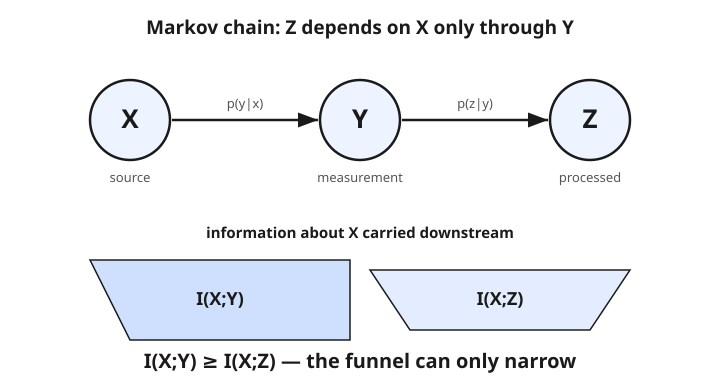

# Information Theory · Lesson 1.5: The data-processing inequality

> ⏱ ~15 min · Module 1: Entropy and information measures · Builds on: [1.4 Relative entropy (KL divergence) and Jensen](01-04-relative-entropy-kl-jensen.md) · Unlocks: [2.1 The asymptotic equipartition property](02-01-asymptotic-equipartition-property.md)

## Why this matters

Every real pipeline is a chain: a signal $X$ gets measured into $Y$, then $Y$ gets cleaned, compressed, featurized, or classified into $Z$. It is tempting to believe a clever post-processing step could *recover more* about the original $X$ than the raw measurement held. The data-processing inequality says flatly: it can't. Once $Y$ is all you kept of $X$, no downstream computation on $Y$ — however sophisticated — can raise the information about $X$ above what $Y$ already carried. This one fact underwrites the converse to the channel coding theorem (why you *can't* beat capacity, [3.4](03-04-converse-fano-inequality.md)), the limits of any learned feature ([4.5](04-05-information-in-learning-inference.md)), and the whole idea of a sufficient statistic.

## The idea

Picture a relay: $X \to Y \to Z$, where $Z$ is computed from $Y$ alone and never gets to peek back at $X$. That "no peeking" clause is the whole game. If the only route from $X$ to $Z$ runs through $Y$, then $Y$ is a bottleneck — a checkpoint every bit of information about $X$ must pass. Whatever $Y$ threw away is gone before $Z$ ever sees the data, and no amount of processing downstream can resurrect it.

So information flows like water through a **funnel that only narrows**. Each stage can preserve what it received or lose some of it, but it can never manufacture new information about the source. "Garbage in, garbage out" is the folk version; the precise version is that the mutual information $I(X;Y)$ is an upper bound on $I(X;Z)$ for every processing you could apply to $Y$.

The catch — and it is the whole reason the theorem has content — is the "no peeking" clause. If your processing step secretly gets to see extra information about $X$ (side information $Y$ never had), all bets are off. The inequality is a statement about *closed* pipelines.

## The formal version

**Markov chain.** We write $X \to Y \to Z$ to mean $Z$ is conditionally independent of $X$ given $Y$:

$$p(z \mid x, y) = p(z \mid y).$$

In words: once you know $Y$, learning $X$ tells you nothing more about $Z$ — all of $Z$'s dependence on $X$ is routed through $Y$. Here $p(\cdot)$ are probability mass functions and $I(\,\cdot\,;\cdot\,)$ is the mutual information from [1.3](01-03-mutual-information.md).

**Data-processing inequality (DPI).** If $X \to Y \to Z$ is a Markov chain, then

$$I(X;Y) \;\geq\; I(X;Z).$$

In words: processing $Y$ into $Z$ can never increase the information carried about $X$.

**Proof (chain rule for mutual information, from [1.4](01-04-relative-entropy-kl-jensen.md)).** Expand the joint information $I(X;Y,Z)$ two ways:

$$I(X;Y,Z) = I(X;Z) + I(X;Y \mid Z) = I(X;Y) + I(X;Z \mid Y).$$

The Markov property says $Z \perp X \mid Y$, so $I(X;Z \mid Y) = 0$. Equating the two expansions,

$$I(X;Y) = I(X;Z) + I(X;Y \mid Z).$$

Since conditional mutual information is never negative, $I(X;Y \mid Z) \geq 0$, and the inequality follows. In words: the gap between the two ends of the chain is exactly $I(X;Y \mid Z)$ — the information about $X$ that $Y$ still holds *after* you already know $Z$.

**Equality and sufficiency.** Equality $I(X;Y) = I(X;Z)$ holds **iff** $I(X;Y \mid Z) = 0$ — that is, once you know $Z$, the raw $Y$ adds nothing more about $X$. Then $Z$ has kept everything $Y$ knew about the source: $Z$ is a **sufficient statistic** for $X$.

**Corollary (functions).** For any deterministic function $g$, the chain $X \to Y \to g(Y)$ is Markov, so

$$I\big(X; g(Y)\big) \;\leq\; I(X;Y).$$

In words: no feature you compute from $Y$ can out-inform $Y$ itself.

## Picture

## Worked examples

**Example 1 (mechanical — two noisy hops lose more).** Let $X$ be a uniform bit, $H(X) = 1$. Send it through a binary symmetric channel that flips with probability $p$, giving $Y$; then through a second such channel with flip probability $q$, giving $Z$. This is a genuine Markov chain $X \to Y \to Z$.

For a symmetric channel with a uniform input, $Y$ is uniform, so $I(X;Y) = H(Y) - H(Y \mid X) = 1 - H_b(p)$, where $H_b(p) = -p\log_2 p - (1-p)\log_2(1-p)$ is the binary entropy. Two flips in series compose into a single channel with effective flip probability

$$p \star q = p(1-q) + q(1-p) = p + q - 2pq,$$

so $I(X;Z) = 1 - H_b(p \star q)$. Take $p = q = 0.1$: then $p \star q = 0.18$, and

$$I(X;Y) = 1 - H_b(0.1) = 1 - 0.469 = 0.531 \text{ bits},$$
$$I(X;Z) = 1 - H_b(0.18) = 1 - 0.680 = 0.320 \text{ bits}.$$

Indeed $0.531 \geq 0.320$: the second noisy hop can only cost you. (Since $p \star q \geq p$ and $H_b$ increases on $[0,\tfrac12]$, this holds for *every* $p, q$.)

**Example 2 (equality vs. strict loss — sufficiency).** Let $X$ be uniform on $\{0,1,2,3\}$, so $H(X) = 2$ bits, and let $Y = X$ (a noiseless measurement), giving $I(X;Y) = 2$. Now process $Y$ into $Z = g(Y)$:

- **Invertible $g$ (equality).** Let $g$ relabel the four outcomes by a fixed permutation, e.g. $Z = (Y + 1) \bmod 4$. From $Z$ you recover $Y$ exactly, so $I(X;Z) = 2 = I(X;Y)$. Here $Z$ loses nothing — it is a **sufficient statistic**, and the funnel doesn't narrow.
- **Lossy $g$ (strict inequality).** Let $Z = \mathbf{1}[Y \geq 2]$, the single bit "is $Y$ in the top half?" Then $Z$ is a uniform bit determined by $X$, so $I(X;Z) = H(Z) = 1 < 2 = I(X;Y)$. The 2-to-1 collapse destroys one full bit about $X$, permanently.

Same $Y$, same source — the verdict is set entirely by whether $g$ throws information away.

## Watch out

- **You might think** the DPI is a law of nature that always holds — **but actually** it needs the Markov structure $X \to Y \to Z$. If your "processing" quietly injects side information about $X$ that $Y$ never carried, apparent information can *rise*: let $X, N$ be independent uniform bits, $Y = X \oplus N$ (so $I(X;Y) = 0$, pure noise), and $Z = (Y, N)$. Then $X = Y \oplus N$ is recoverable, $I(X;Z) = 1 > 0$. No contradiction — $Z$ depends on $X$ through the extra input $N$, so $X \to Y \to Z$ is **not** a Markov chain.
- **You might think** more information always means more useful — **but actually** the DPI is about information, not usability. A deterministic feature $g(Y)$ carries $\leq I(X;Y)$ bits yet may be far *easier* for a downstream model to use. Processing trades raw information for convenience; it never creates information.
- **You might think** any loss along the chain is unavoidable waste — **but actually** equality is achievable exactly when $Z$ is **sufficient**: it can compress $Y$ enormously and still lose nothing about $X$, provided $I(X;Y\mid Z) = 0$. Sufficiency is the goal; the DPI is the wall you can approach but never breach.

## One-liner

> You can't create information by processing: in $X \to Y \to Z$, every step can only preserve or shrink what's known about $X$ — equality iff the step is sufficient.

## Problems

**P1 (🟢)** A sensor reports a uniform bit $X$ as $Y$ through a channel that flips with probability $0.2$; a downstream chip further corrupts $Y$ into $Z$ through a second flip-probability-$0.2$ channel. Compute $I(X;Y)$ and $I(X;Z)$ (in bits) and confirm the DPI. Use $H_b(0.2) = 0.722$ and $H_b(0.32) = 0.904$.

**P2 (🟡)** For a deterministic function $g$, explain in one line why $X \to Y \to g(Y)$ is automatically a Markov chain, and hence why $I(X;g(Y)) \leq I(X;Y)$. Then, for $X$ uniform on $\{0,1,2,3\}$ with $Y = X$, exhibit one $g$ giving equality and one giving strict inequality, computing $I(X;g(Y))$ in each case.

**P3 (🔴, optional)** You are handed variables with $I(X;Y) = 0$ yet $I(X;Z) = 1$ bit, and told "your DPI must be wrong." Construct an explicit example where this happens, and identify precisely which hypothesis of the DPI fails. (Hint: let $Z$ see an input that $Y$ scrambled away.)

Solutions

**P1** With a uniform input and a symmetric channel, $Y$ is uniform, so $I(X;Y) = 1 - H_b(0.2) = 1 - 0.722 = 0.278$ bits. The two flips compose to a single channel with flip probability $p \star q = 0.2 + 0.2 - 2(0.2)(0.2) = 0.4 - 0.08 = 0.32$, so $I(X;Z) = 1 - H_b(0.32) = 1 - 0.904 = 0.096$ bits. Since $0.278 \geq 0.096$, the DPI holds — the extra hop cost about $0.18$ bits.

**P2** $g(Y)$ is computed from $Y$ alone, so given $Y$ its value is fixed regardless of $X$: $p(g(y)\mid x, y) = p(g(y)\mid y)$, which is the Markov condition $X \to Y \to g(Y)$. The DPI then gives $I(X;g(Y)) \leq I(X;Y)$ directly.

Take $X$ uniform on $\{0,1,2,3\}$, $Y = X$, so $I(X;Y) = 2$ bits.
- *Equality:* $g(Y) = (Y+1)\bmod 4$ is invertible, so it determines $Y$ (hence $X$): $I(X;g(Y)) = H(g(Y)) = 2$ bits $= I(X;Y)$. $g(Y)$ is sufficient.
- *Strict:* $g(Y) = Y \bmod 2$ (the parity bit) is a uniform bit determined by $X$, so $I(X;g(Y)) = H(g(Y)) = 1$ bit $< 2$. The 2-to-1 map destroys a bit.

**P3** Let $X$ and $N$ be independent uniform bits. Set $Y = X \oplus N$ and $Z = (Y, N)$. Then $Y$ is a uniform bit independent of $X$, so $I(X;Y) = 0$. But $X = Y \oplus N$ is a deterministic function of $Z$, so $I(X;Z) = H(X) = 1$ bit. No contradiction: $Z$ depends on $X$ through the fresh input $N$ (which $Y$ had scrambled), so $X \to Y \to Z$ is **not** a Markov chain — $I(X;Z\mid Y) \neq 0$. The DPI's hypothesis fails, so its conclusion needn't hold. The lesson: the inequality governs *closed* pipelines only.

## Flashback

**From Lesson 1.4 (Relative entropy and Jensen):** Let $p = (\tfrac12, \tfrac12)$ be the true distribution of a bit and $q = (\tfrac14, \tfrac34)$ your assumed model. Compute the relative entropy $D(p \,\|\, q)$ in bits (the average excess bits per symbol from coding with $q$ instead of $p$), and state in one line why Jensen's inequality guarantees it is nonnegative.

Solution

$$D(p\,\|\,q) = \tfrac12 \log_2\frac{1/2}{1/4} + \tfrac12 \log_2\frac{1/2}{3/4} = \tfrac12(1) + \tfrac12\log_2\tfrac{2}{3} = \tfrac12 - \tfrac12(0.585) = 0.207 \text{ bits}.$$

Nonnegativity: $-D(p\,\|\,q) = \sum_x p(x)\log_2\frac{q(x)}{p(x)} \leq \log_2\sum_x p(x)\frac{q(x)}{p(x)} = \log_2\sum_x q(x) = \log_2 1 = 0$, where the middle step is Jensen applied to the concave $\log$. Hence $D(p\,\|\,q) \geq 0$, with equality iff $p = q$. (Note $D(q\,\|\,p) \neq D(p\,\|\,q)$ in general — relative entropy is not symmetric.)

## Connections

- **Backward:** the proof is nothing but the mutual-information chain rule from [1.4](01-04-relative-entropy-kl-jensen.md) applied to $I(X;Y,Z)$, resting on the mutual information of [1.3](01-03-mutual-information.md) and the nonnegativity of conditional MI. The whole inequality is one line of algebra plus one Markov zero.
- **Forward:** [3.4](03-04-converse-fano-inequality.md) uses the DPI to prove the channel-coding *converse* — the decoder is a processing of the channel output, so it cannot recover more about the message than the channel let through, which is what caps reliable rate at capacity. In [4.5](04-05-information-in-learning-inference.md), a learned representation $T$ of input $X$ obeys $I(T; Y) \leq I(X;Y)$ — the **information bottleneck**: no feature can exceed the information already in the raw data.
- **Sideways (statistical learning):** this is the information-theoretic face of the **sufficient statistic** — see [statistical-learning](../../statistical-learning/syllabus.md). A sufficient statistic hits DPI equality: it compresses the data yet loses nothing about the parameter, so no engineered feature can beat it. The information bottleneck is the same idea made into a training objective.
- **Sideways (probability/stats):** the definition and role of sufficiency trace back to the factorization criterion in [prob-stat-refresher](../../prob-stat-refresher/syllabus.md) — DPI recasts "sufficient" as "processing that preserves all the mutual information."
- **Syllabus:** [Module 1 map](../syllabus.md). Boss 1 spans Lessons 1.1–1.5; its DPI/sufficiency part is Example 2 and P2 above.
