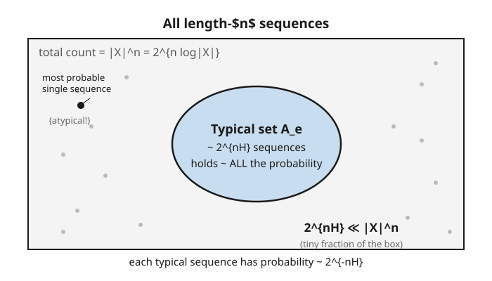

# Information Theory · Lesson 2.1: The asymptotic equipartition property

> ⏱ ~15 min · Module 2: Source coding and data compression · Builds on: [1.5 The data-processing inequality](01-05-data-processing-inequality.md) · Unlocks: [2.2 Shannon's source-coding theorem](02-02-source-coding-theorem.md)

## Why this matters

We ended Module 1 with a promise: entropy $H(X)$ is the compression limit — the average bits per symbol you can't beat. This lesson is the machine that delivers that promise. Its punchline is startling: out of the astronomically many sequences a random source *could* produce, only a tiny, sharply-defined sliver ever actually shows up. Name the members of that sliver and you've compressed the source; everything outside it is so improbable you can safely ignore it. This "the outcomes concentrate" phenomenon is the same one that makes statistical mechanics work and the law of large numbers useful — here it becomes the backbone of data compression.

## The idea

Flip a coin with $\Pr(\text{heads}) = 0.9$ a thousand times. Which single 1000-flip sequence is *most* likely? All heads — probability $0.9^{1000}$, beating any other one sequence. But will you ever *see* all heads? Essentially never. What you'll see is *some* sequence with roughly 900 heads and 100 tails, and there are enormously many of those. No single one of them is as likely as all-heads, but there are so many that together they soak up virtually all the probability.

That's the whole idea. Long i.i.d. sequences split into two camps:

- a **typical set** — sequences whose head-fraction (more precisely, whose average per-symbol surprise) matches the source's statistics. Each is individually unremarkable, but collectively they carry $\approx$ all the probability.
- **everything else** — including the lone most-probable sequence — which is individually rare *and* collectively negligible.

Why does this happen? Because the *per-symbol surprise*, averaged over a long sequence, is an average of many i.i.d. numbers — and the law of large numbers says such an average locks onto its mean. The mean of the per-symbol surprise is exactly the entropy $H$. So almost every long sequence has average surprise $\approx H$, which forces its probability to be $\approx 2^{-nH}$, which forces the count of such sequences to be $\approx 2^{nH}$. Three facts, one cause.

## The formal version

Let $X_1, X_2, \dots, X_n$ be i.i.d. draws from $p(x)$, and write $x^n = (x_1,\dots,x_n)$ for a sequence and $p(x^n) = \prod_{i=1}^n p(x_i)$ for its probability. All logs are base 2; $H = H(X) = -\sum_x p(x)\log p(x)$.

**The AEP.**

$$-\frac{1}{n}\log p(X_1,\dots,X_n) \;\xrightarrow{\;\text{in prob.}\;}\; H(X) \qquad \text{as } n \to \infty.$$

In words: the average per-symbol surprise of a long random sequence converges (in probability) to the entropy — long sequences almost always have "surprise per symbol" equal to $H$.

*Why it's true in one line:* because the draws are independent, $-\frac1n \log p(X^n) = -\frac1n \sum_{i=1}^n \log p(X_i)$ is the sample average of the i.i.d. terms $-\log p(X_i)$, each with mean $\mathbb{E}[-\log p(X_i)] = H$. The **weak law of large numbers** says a sample average converges in probability to its mean. That's the entire proof.

**The typical set.** Fix a tolerance $\varepsilon > 0$. The typical set $A_\varepsilon^{(n)}$ is the collection of sequences whose per-symbol surprise is within $\varepsilon$ of $H$:

$$A_\varepsilon^{(n)} = \left\{ x^n : \left| -\tfrac{1}{n}\log p(x^n) - H \right| \le \varepsilon \right\} = \left\{ x^n : 2^{-n(H+\varepsilon)} \le p(x^n) \le 2^{-n(H-\varepsilon)} \right\}.$$

In words: typical sequences are exactly the ones whose probability is close to $2^{-nH}$ — not too likely, not too unlikely, just average. (The two forms are the same statement; take $\log$ and divide by $-n$ to pass between them.)

**The three consequences.** For $n$ large enough:

1. **Total probability $\to 1$:** $\Pr\big(X^n \in A_\varepsilon^{(n)}\big) > 1 - \varepsilon$. *In words: almost all the probability lives in the typical set* — this is just the AEP restated.
2. **Each member is near-uniform:** every $x^n \in A_\varepsilon^{(n)}$ has $p(x^n) \approx 2^{-nH}$ (that's the definition). *In words: typical sequences are all roughly equally likely* — hence "equi-partition."
3. **Size $\approx 2^{nH}$:** $(1-\varepsilon)\,2^{n(H-\varepsilon)} \le \big|A_\varepsilon^{(n)}\big| \le 2^{n(H+\varepsilon)}$. *In words: there are about $2^{nH}$ typical sequences.*

Consequence 3 is just consequences 1 and 2 divided: if a set holds probability $\approx 1$ and each member has probability $\approx 2^{-nH}$, it must have $\approx 1 / 2^{-nH} = 2^{nH}$ members. Since $2^{nH} \ll |\mathcal{X}|^n = 2^{n\log|\mathcal{X}|}$ whenever $H < \log|\mathcal{X}|$ (i.e. whenever the source isn't uniform), the typical set is an *exponentially small fraction* of all sequences — yet it's where the source actually lives.

## Picture

The big box is *every* sequence; the shaded blob is the typical set. The blob is tiny by area (only $\approx 2^{nH}$ of the $|\mathcal{X}|^n$ points) yet it holds essentially all the probability. Note the black dot *outside* the blob: the single most-probable sequence is atypical — most likely one-at-a-time, but a set of measure that vanishes.

## Worked examples

**Example 1 (the biased coin, concretely).** Take $\Pr(\text{heads}) = 0.9$, $\Pr(\text{tails}) = 0.1$. Its entropy (computed in [1.1](01-01-entropy-uncertainty-surprise.md)) is

$$H = -0.9\log_2 0.9 - 0.1\log_2 0.1 \approx 0.469 \text{ bits}.$$

For length $n$, there are $2^n$ sequences total but only $\approx 2^{nH} = 2^{0.469\,n}$ typical ones. The ratio is

$$\frac{2^{nH}}{2^n} = 2^{-n(1 - 0.469)} = 2^{-0.531\,n} \xrightarrow{\;n\to\infty\;} 0.$$

At $n = 100$ that's $2^{-53} \approx 10^{-16}$: the typical set is a *hundred-quadrillionth* of all sequences, yet you'll land in it with probability near 1. What does a typical sequence look like? By the law of large numbers it has $\approx 0.9n = 90$ heads (at $n=100$), and its probability is

$$p \approx 0.9^{90}\,0.1^{10} = 2^{90\log_2 0.9 + 10 \log_2 0.1} = 2^{-100 \times 0.469} = 2^{-nH},$$

exactly consequence 2. Meanwhile the all-heads sequence has probability $0.9^{100} = 2^{-15.2}$ — far *larger* than a typical sequence's $2^{-46.9}$, yet all-heads has empirical surprise $-\frac1n\log_2 0.9^{100} = -\log_2 0.9 = 0.152 \ne H$, so it sits outside $A_\varepsilon$. Most likely, and atypical, at the same time.

**Example 2 (the AEP is the WLLN, and it sizes the typical set).** Let $Y_i = -\log_2 p(X_i)$. These are i.i.d. with $\mathbb{E}[Y_i] = H$. The sample mean is $\bar Y_n = -\frac1n \log_2 p(X^n)$, so the weak law gives $\Pr(|\bar Y_n - H| \le \varepsilon) \to 1$ — which is precisely "$\Pr(X^n \in A_\varepsilon^{(n)}) \to 1$" (consequence 1).

Now bound the size. Probabilities over the typical set sum to at most 1:

$$1 \ge \sum_{x^n \in A_\varepsilon} p(x^n) \ge \sum_{x^n \in A_\varepsilon} 2^{-n(H+\varepsilon)} = \big|A_\varepsilon^{(n)}\big|\,2^{-n(H+\varepsilon)} \;\Longrightarrow\; \big|A_\varepsilon^{(n)}\big| \le 2^{n(H+\varepsilon)}.$$

For the lower bound, use consequence 1 — the typical set holds probability $> 1-\varepsilon$ — together with the fact that each member has probability at most $2^{-n(H-\varepsilon)}$:

$$1 - \varepsilon < \sum_{x^n \in A_\varepsilon} p(x^n) \le \sum_{x^n \in A_\varepsilon} 2^{-n(H-\varepsilon)} = \big|A_\varepsilon^{(n)}\big|\,2^{-n(H-\varepsilon)} \;\Longrightarrow\; \big|A_\varepsilon^{(n)}\big| > (1-\varepsilon)\,2^{n(H-\varepsilon)}.$$

Together: $(1-\varepsilon)\,2^{n(H-\varepsilon)} \le \big|A_\varepsilon^{(n)}\big| \le 2^{n(H+\varepsilon)}$ — a set of size $\approx 2^{nH}$, pinned from both sides using nothing but the definition and a probability that sums to (at most) 1.

## Watch out

- **You might think the typical set contains the most-probable sequence — it usually doesn't.** For the biased coin, all-heads is the single likeliest outcome yet is *atypical*: its per-symbol surprise is $-\log_2 0.9 = 0.15 \ne H = 0.47$. "Typical" means *average surprise equal to $H$*, not *maximum probability*. The single most-probable point is a red herring; the source lives in the crowd of average sequences.
- **You might think $2^{nH}$ and $2^n$ are "close" — they differ by an exponential factor.** Whenever $H < \log_2|\mathcal{X}|$, the ratio $2^{n(H - \log|\mathcal{X}|)} \to 0$: the typical set is a *vanishing* fraction of all sequences. That exponential gap is the compressibility of the source — and it's zero only for a uniform source, which can't be compressed.
- **You might think the AEP holds for every sequence, or for small $n$ — it's asymptotic and probabilistic.** It says *almost all* the probability (not all) concentrates, for *large* $n$. Any individual short sequence can be wildly atypical; the guarantee is about the limit and about high probability, not certainty.

## One-liner

> Of the $|\mathcal{X}|^n$ sequences a source could emit, essentially all the probability sits on just $\approx 2^{nH}$ "typical" ones, each of probability $\approx 2^{-nH}$ — so naming a sequence costs only $\approx nH$ bits.

## Problems

**P1 (🟢)** A source is i.i.d. uniform over an alphabet of size $|\mathcal{X}| = 8$. (a) Compute $H$ in bits. (b) For length $n$, how does the typical-set size $2^{nH}$ compare to the total number of sequences $8^n$? (c) What does your answer say about compressing this source?

**P2 (🟡)** A biased coin has $\Pr(\text{heads}) = 0.25$. (a) Compute $H$ (you may reuse a value from [1.1](01-01-entropy-uncertainty-surprise.md)). (b) For $n = 200$, roughly how many typical sequences are there (give the exponent, i.e. $2^{?}$)? (c) A typical 200-flip sequence has about how many heads, and what is its approximate probability (as a power of 2)?

**P3 (🔴, optional)** Show that the single most-probable sequence of an i.i.d. source with a non-uniform $p$ is *not* in the typical set for small $\varepsilon$ and large $n$. (Hint: the most-probable sequence repeats the mode $x^* = \arg\max_x p(x)$; compute its per-symbol surprise and compare to $H$, using that $-\log p(x^*) < H$ whenever $p$ is non-uniform. Why is that inequality true?)

Solutions

**P1** (a) Uniform on 8 symbols: $H = \log_2 8 = 3$ bits. (b) $2^{nH} = 2^{3n} = 8^n$ — the typical set is *all* sequences; there's no gap. (c) A uniform i.i.d. source is **incompressible**: every sequence is typical and equally likely, so you genuinely need $\log_2 8 = 3$ bits per symbol and cannot do better. The AEP's compression payoff comes precisely from non-uniformity ($H < \log|\mathcal{X}|$).

**P2** (a) $H = -0.25\log_2 0.25 - 0.75\log_2 0.75 = 0.25(2) + 0.75(0.415) = 0.5 + 0.311 = 0.811$ bits (the same computation as the $p=\tfrac14$ coin in [1.1](01-01-entropy-uncertainty-surprise.md), by symmetry of $H(p)=H(1-p)$). (b) $2^{nH} = 2^{200 \times 0.811} = 2^{162.2} \approx 2^{162}$ typical sequences (versus $2^{200}$ total). (c) A typical sequence has $\approx 0.25 \times 200 = 50$ heads, and probability $\approx 2^{-nH} = 2^{-162}$.

**P3** The most-probable length-$n$ sequence is $x^* x^* \cdots x^*$ (repeat the mode $n$ times), since independence makes $p(x^n) = \prod_i p(x_i)$ largest when every factor is the largest single-symbol probability $p(x^*) = \max_x p(x)$. Its per-symbol surprise is

$$-\frac1n \log_2 p((x^*)^n) = -\frac1n \sum_{i=1}^n \log_2 p(x^*) = -\log_2 p(x^*).$$

For it to be typical we'd need $-\log_2 p(x^*) \approx H$. But $p(x^*)$ is the *largest* probability, so $-\log_2 p(x^*)$ is the *smallest* surprise value $-\log_2 p(x)$ over all $x$. The entropy $H = \sum_x p(x)\big(-\log_2 p(x)\big)$ is a weighted average of those surprises; an average of numbers is strictly greater than the smallest of them unless they're all equal — i.e. unless $p$ is uniform. So for non-uniform $p$, $-\log_2 p(x^*) < H$, meaning the most-probable sequence's per-symbol surprise falls below $H$ by a fixed gap. Once $\varepsilon$ is smaller than that gap and $n$ is large, $x^*{}^n \notin A_\varepsilon^{(n)}$: most probable, yet atypical. $\blacksquare$

## Flashback

**From Lesson 1.4 (Relative entropy and KL):** Let $p = (0.5, 0.25, 0.25)$ be the true distribution over three symbols and $q = (0.25, 0.25, 0.5)$ a model you use to encode them. Compute the KL divergence $D(p\,\|\,q) = \sum_x p(x)\log_2\frac{p(x)}{q(x)}$ in bits, and say in one sentence what it measures operationally.

Solution

$$D(p\,\|\,q) = 0.5\log_2\frac{0.5}{0.25} + 0.25\log_2\frac{0.25}{0.25} + 0.25\log_2\frac{0.25}{0.5} = 0.5(1) + 0.25(0) + 0.25(-1) = 0.5 - 0.25 = 0.25 \text{ bits}.$$

Operationally, $D(p\,\|\,q) = 0.25$ bits is the **penalty in average code length** (bits per symbol) you pay for encoding data drawn from $p$ using a code optimized for the wrong distribution $q$ instead of the true $p$. It is nonnegative (here strictly positive since $p \ne q$), confirming $D \ge 0$. ✓

## Connections

- **Backward:** the AEP is [1.1](01-01-entropy-uncertainty-surprise.md)'s entropy $H = \mathbb{E}[-\log p(X)]$ made kinetic — it's what happens when you *average* the surprise $-\log p(X_i)$ over a long run. The two-camps structure (typical vs. negligible) also echoes [1.5](01-05-data-processing-inequality.md)'s theme that processing can only lose information.
- **Forward:** [2.2 Source coding theorem](02-02-source-coding-theorem.md) turns this into an algorithm — index the $\approx 2^{nH}$ typical sequences with $\approx nH$ bits and flag the rest with a tiny escape code, achieving $H$ bits/symbol. The AEP is *the* reason the source-coding limit is $H$ and not something larger.
- **Forward:** [3.3 Noisy-channel coding](03-03-noisy-channel-coding-achievability.md) reruns this argument on *pairs* — a jointly typical set of (input, output) sequences — to prove you can communicate reliably up to the channel capacity.
- **Sideways (probability):** the AEP is nothing but the **weak law of large numbers** from [probability-theory](../../probability-theory/syllabus.md), applied to the i.i.d. variables $-\log p(X_i)$. Every subtlety here (convergence in probability, not surely; large-$n$ only) is inherited straight from the WLLN.
- **Sideways (statistical mechanics):** "almost all sequences look alike, and there are $\approx 2^{nH}$ of them" is the information-theoretic twin of a gas having $\approx e^{S/k_B}$ overwhelmingly-likely microstates that all share the same macroscopic look — the concentration behind the equivalence of ensembles. See [stat-mech](../../stat-mech/syllabus.md); [4.4](04-04-maximum-entropy-stat-mech.md) makes the bridge explicit.
